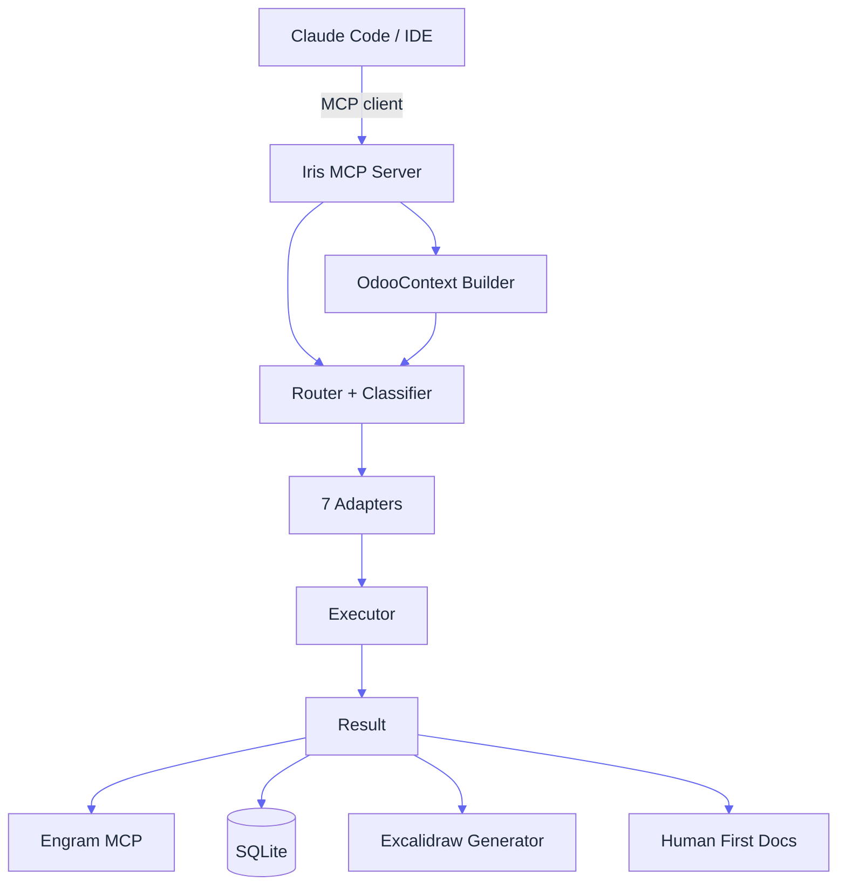
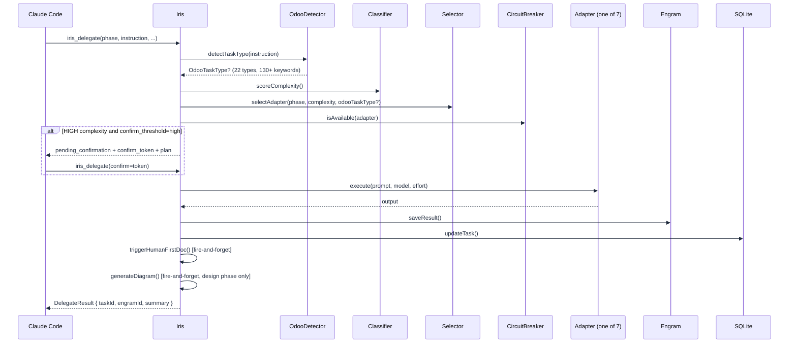
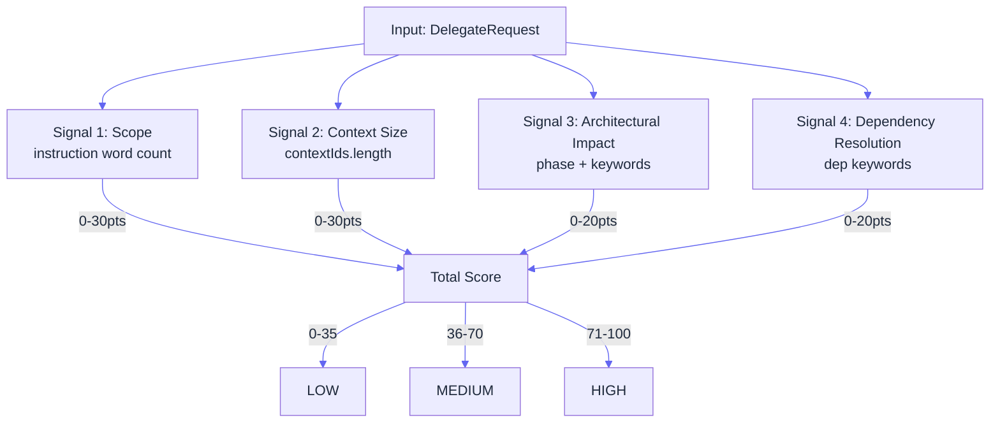
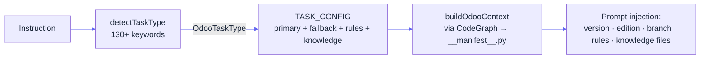
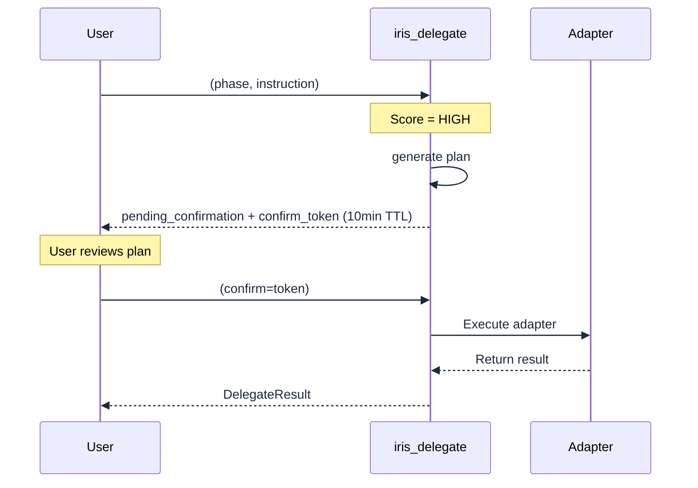
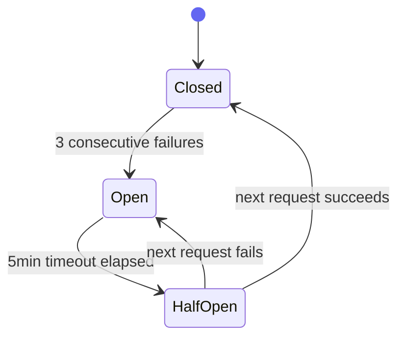
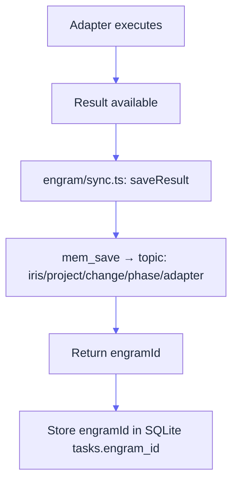
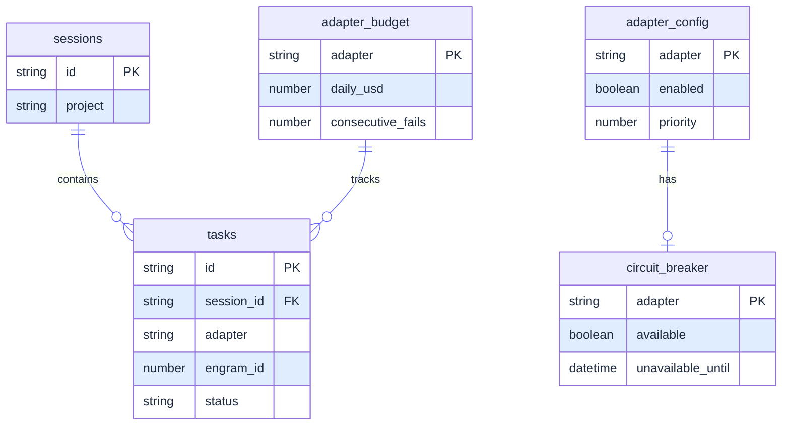

# Iris — Architecture Reference

## 1. Core Principles

- **Orchestration**: Iris manages the lifecycle, execution, and state of tasks across multiple AI adapters.
- **Odoo Specialization**: Built-in rules, contexts, and heuristics tailored for Odoo (v14–v19) development at Alesco Perú.
- **Agnostic AI Engines**: Flexible routing and fallbacks among 7 adapter backends.
- **Extensibility**: Powered by tools, knowledge files, and deep CodeGraph integration.

---

## 2. High-Level Architecture



---

## 3. Main Delegation Flow (iris_delegate)



---

## 4. Router — Complexity Scoring



---

## 5. Phase → Adapter Routing Table

| Phase | Primary Adapter | Fallback Adapter |
|-------|----------------|-----------------|
| explore | antigravity | claude |
| propose | claude | antigravity |
| spec | claude | antigravity |
| design | antigravity | claude |
| tasks | claude | copilot |
| apply | claude | codex |
| verify | claude | antigravity |
| report | antigravity | claude |
| document | antigravity | claude |

> When `OdooTaskType` is detected, routing overrides the phase table using `TASK_CONFIG[odooTaskType].primaryAdapter`.

---

## 6. Adapter Model Selection Matrix

| Complexity | claude | antigravity | copilot | codex | kilo | cursor | opencode |
|---|---|---|---|---|---|---|---|
| LOW | haiku-4-5 / low | Gemini 3.5 Flash (Medium) | gpt-4.1-mini / low | o4-mini / low | claude-3-5-haiku | claude-3-5-haiku | opencode/zen |
| MEDIUM | sonnet-4-6 / high | Gemini 3.5 Flash (High) | gpt-4o / medium | o4-mini / high | claude-sonnet-4 | claude-sonnet-4 | opencode/zen |
| HIGH | opus-4-7 / high | Gemini 3.1 Pro (High) | gpt-5.2 / high | o3 / high | claude-opus-4 | claude-opus-4 | opencode/zen |

---

## 7. Odoo Integration

Iris provides specialized support for Odoo development. When any instruction matches an Odoo-related keyword, routing switches from phase-based to task-type-based with dedicated knowledge injection.

### OdooTaskType — 22 values, 130+ keywords

`odoo-source` · `odoo-orm` · `odoo-view` · `odoo-security` · `odoo-wizard` · `odoo-report` · `odoo-owl` · `odoo-controller` · `odoo-mail` · `odoo-portal` · `odoo-migration` · `odoo-test` · `odoo-debug` · `odoo-ops` · `odoo-ci` · `odoo-api` · `odoo-commit` · `odoo-pr` · `odoo-changelog` · `odoo-module` · `odoo-accounting` · `odoo-stock`

### Odoo Context Flow



### Enterprise First (R6)
`executor/enterprise.ts` — `searchEnterprise(query, cfg)` uses `rg` (ripgrep) to search `alesco_path/Source/odoo-enterprise-18` before any implementation. Results injected into adapter prompt.

### Branch Safety (R2)
`executor/git.ts` — `classifyBranch()`:
- `st_*` / `st_produccion` → **allowed**
- `produccion` / `db_*` → **blocked** (throws)
- `push --force`, `rebase`, `reset` → **permanently blocked**

---

## 8. Knowledge Base

```text
knowledge/
  excalidraw/
    SKILL.md                      — coleam00/excalidraw-diagram-skill verbatim
    references/
      alesco-palette.md           — Alesco brand override (#1E3A5F · #E8732A · #875A7B)
      color-palette.md            — original coleam00 palette
      element-templates.md        — JSON copy-paste templates
      json-schema.md              — Excalidraw element schema
    templates/
      odoo-erd.md                 — ERD template (M2o/O2m/M2m + ◆/○/★ legend)
      odoo-owl-flow.md            — OWL 2 → RPC → Python flow template
      sdd-architecture.md         — SDD design phase architecture template
      odoo-deployment.md          — Odoo.sh deployment + R2 branch safety template
  odoo/
    ai/
      RULES.md                    — R1–R13 governance rules
      knowledge/
        patterns/                 — xml-views, wizards, reports, controllers, mail, portal, ...
        security/                 — security-patterns, acl-patterns, access-rules, ...
        core/                     — orm-patterns, data-migration, performance, ...
        testing/                  — patterns, mock-data, playwright-e2e
        migration/                — v14-v15 ... v18-v19
        business/                 — accounting, stock, hr, sale-crm, ...
        v18/, v19/                — version-specific references + OWL components
      plugins/odoo-source/        — Module Intelligence Report skill
    contribute/
      SKILL.md
      plugins/                    — odoo-oca, odoo-ops, odoo-commit, odoo-pr, odoo-ci, odoo-changelog
      scripts/                    — branch-safety-check, detect-environment, docker-setup
```

---

## 9. Excalidraw Diagram Generation

Auto-triggered on `phase=design` (fire-and-forget). No delay to primary adapter response.

```mermaid
%%{init: {'theme': 'default', 'themeVariables': {'primaryColor': '#dbeafe', 'primaryTextColor': '#1e293b', 'lineColor': '#6366f1', 'textColor': '#1e293b'}}}%%
flowchart LR
    Design[Design phase output] --> Gen[generator.ts\ngenerateDiagram]
    Gen --> SK[Load SKILL.md]
    Gen --> TP[Load template\nsdd-architecture.md]
    Gen --> PA[Load alesco-palette.md]
    SK & TP & PA --> Prompt[Build prompt]
    Prompt --> Gemini[AntigravityAdapter\nGemini 2.5 Flash]
    Gemini --> File[docs/sdd/{change}/\ndesign-arch.excalidraw]
```

---

## 10. Alesco Configuration (iris.local.yaml)

`iris.local.yaml` (gitignored) — single variable file:
```yaml
alesco_path: G:\My Drive\Alesco
```

Resolution priority in `config/local.ts`:
1. `process.env.ALESCO_PATH`
2. `iris.local.yaml`
3. `scripts/detect-alesco-path.ps1` (auto-detects Google Drive on Windows)

Derived paths:
- `enterprise_path` = `alesco_path/Source/odoo-enterprise-18`
- `community_path` = `alesco_path/Source/odoo-community-18`

---

## 11. Human First Documentation

After every SDD phase, `triggerHumanFirstDoc()` calls `agy` with a template from `prompts/docs/sdd-{phase}.md`. Output is saved asynchronously to `docs/sdd/{change}/{phase}.md`. Never blocks the primary adapter response.

Seven templates (one per phase): `explore` · `propose` · `spec` · `design` · `tasks` · `apply` · `verify`

---

## 12. Two-Phase Commit Flow (HIGH complexity)



---

## 13. Circuit Breaker States



---

## 14. Engram Integration Flow



---

## 15. SQLite Schema



---

## 16. File Structure

```text
src/
  index.ts           — MCP entry, stdio transport, SIGINT/SIGTERM cleanup
  server.ts          — registerTools(): iris_delegate, iris_status, iris_history, iris_task, iris_config, iris_setup
  types/index.ts     — All TypeScript interfaces and union types
  tools/
    delegate.ts      — iris_delegate: routing, Odoo detection, diagram trigger, Human First
    status.ts        — iris_status + iris_setup
    history.ts       — iris_history
    task.ts          — iris_task
    config.ts        — iris_config
  router/
    classifier.ts    — scoreComplexity() — 4 signals, 0–100 scale
    selector.ts      — selectAdapter() — phase + OdooTaskType routing
    circuit-breaker.ts
  adapters/
    base.ts          — IAdapter interface
    claude.ts        — claude CLI
    antigravity.ts   — agy CLI (Gemini)
    copilot.ts       — gh copilot CLI
    codex.ts         — codex exec CLI
    kilo.ts          — kilocode CLI
    cursor.ts        — cursor agent CLI
    opencode.ts      — opencode run, Zen models only
  codegraph/
    client.ts        — CodeGraph MCP singleton (cgSearch, cgContext, cgFiles, cgExplore, cgTrace, cgCallers, cgCallees, cgImpact)
  config/
    local.ts         — resolveAlescoPaths() — 3-priority resolution
  context/
    odoo-selector.ts — detectTaskType() + TASK_CONFIG (22 types, 130+ keywords)
    rules.ts         — parseRulesFile() + injectKnowledgeContext()
    odoo.ts          — buildOdooContext() via CodeGraph → __manifest__.py
  diagrams/
    generator.ts     — generateDiagram() — Excalidraw via Gemini
  executor/
    terminal.ts      — Windows Terminal launcher (agy fire-and-forget)
    subprocess.ts    — execa direct execution
    enterprise.ts    — searchEnterprise() via rg (R6)
    git.ts           — classifyBranch, checkIdentity, checkR5PreMigrate, requiresExplicitApproval
  store/
    db.ts            — better-sqlite3 connection
    tasks.ts         — Task CRUD
    budgets.ts       — Budget tracking
  engram/
    client.ts        — Engram MCP singleton
    sync.ts          — saveResult + getObservation
```

---

## 17. Config Reference (iris.local.yaml + iris_config)

```json
{
  "confirm_threshold": "high",
  "adapters": {
    "claude":       { "enabled": true, "priority": 3, "daily_budget_usd": 5.0 },
    "antigravity":  { "enabled": true, "priority": 1, "daily_budget_usd": 0.0 },
    "copilot":      { "enabled": true, "priority": 2, "daily_budget_usd": 0.0 },
    "codex":        { "enabled": true, "priority": 2, "daily_budget_usd": 2.0 },
    "kilo":         { "enabled": true, "priority": 2, "daily_budget_usd": 0.0 },
    "cursor":       { "enabled": true, "priority": 2, "daily_budget_usd": 0.0 },
    "opencode":     { "enabled": true, "priority": 2, "daily_budget_usd": 0.0 }
  }
}
```

---

IRIS_COMPLETE
