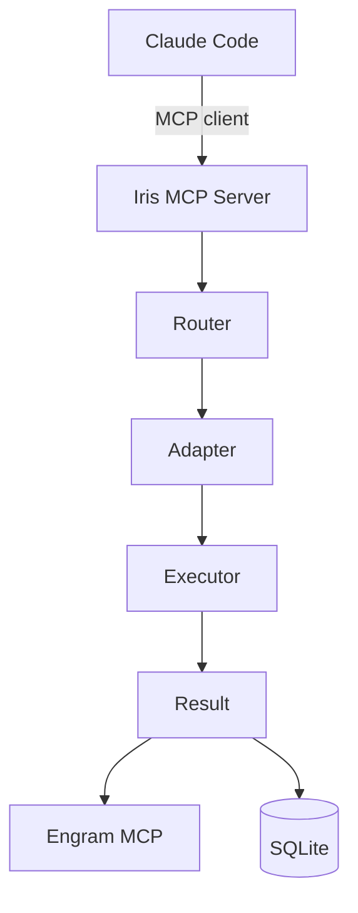
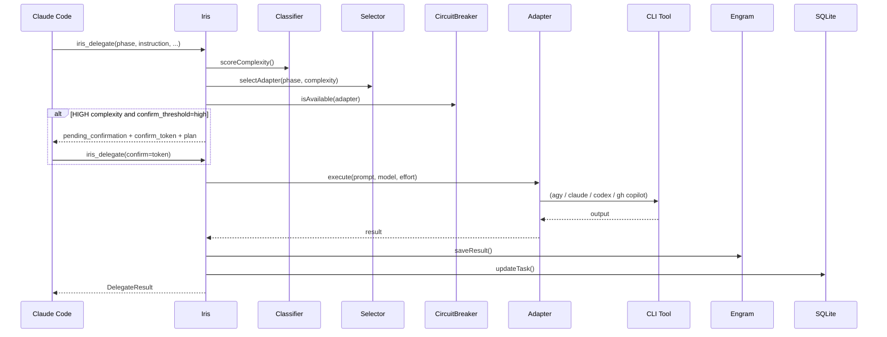
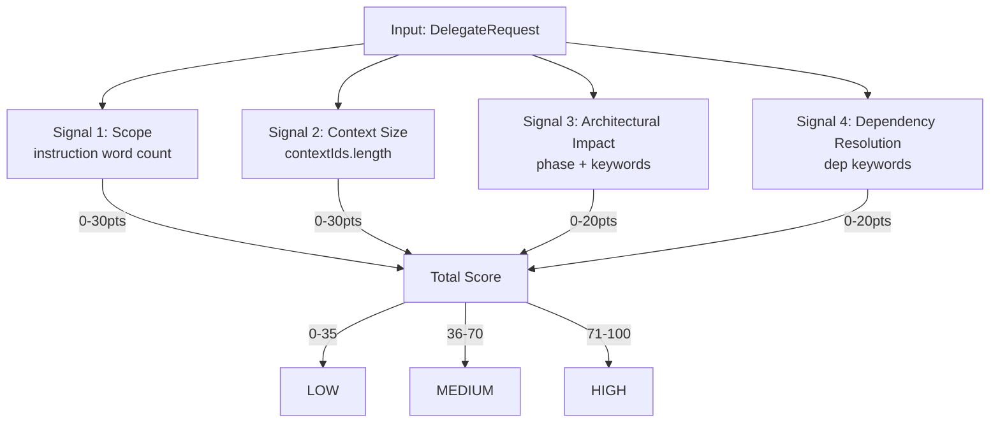
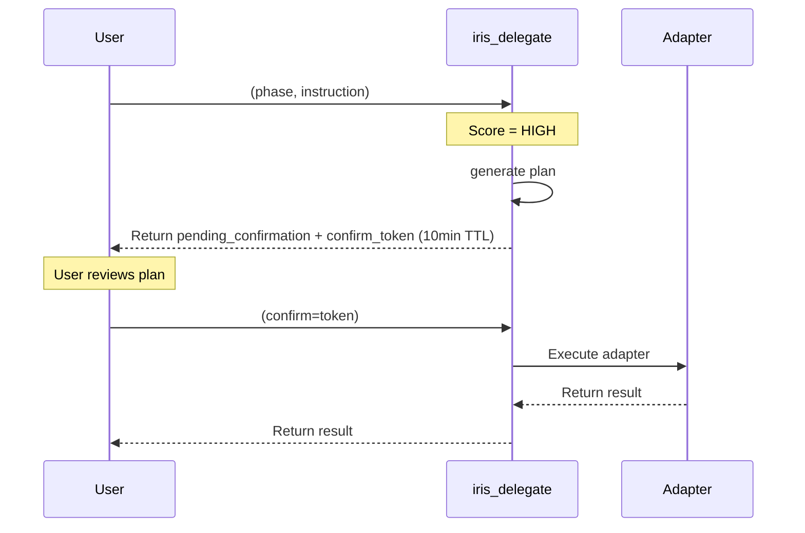
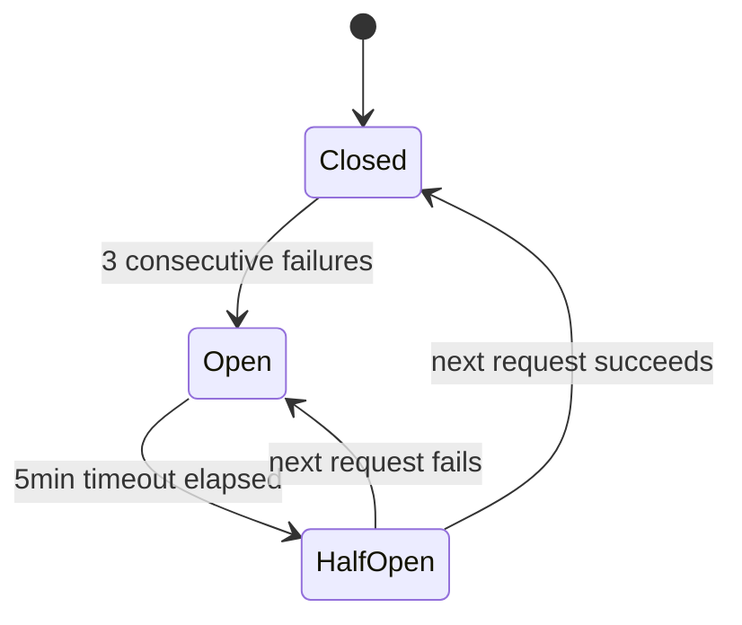
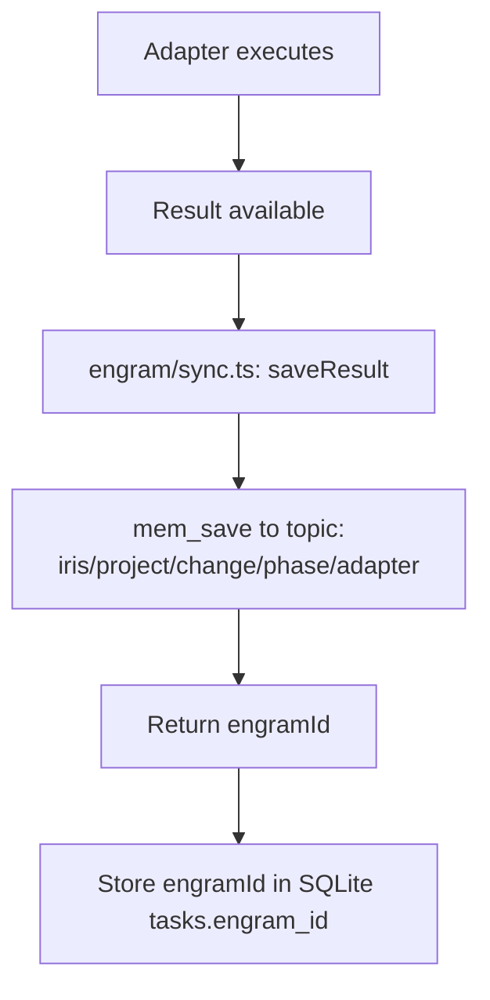
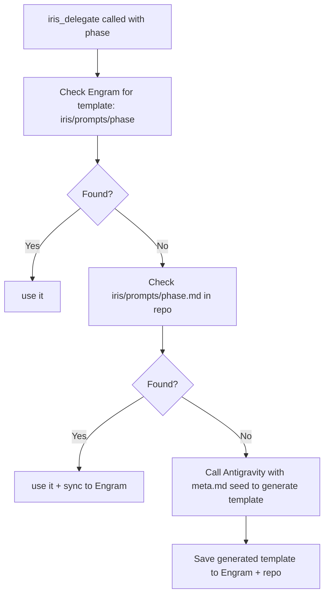
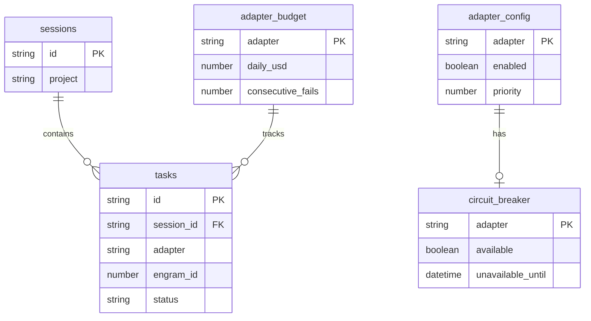

# Iris — Architecture Reference

## 1. Overview
Iris is a Model Context Protocol (MCP) server built in TypeScript/Node.js that acts as a central orchestration bus between AI CLI tools. It eliminates manual context pasting between AI sessions, intelligently routes tasks to the right AI based on phase and complexity, and ensures all results persist in Engram so no AI ever starts from scratch.

## 2. High-Level Architecture


## 3. Main Delegation Flow (iris_delegate)


## 4. Router — Complexity Scoring


## 5. Phase → Adapter Routing Table
| Phase | Adapter (Primary) | Fallback Adapter |
|-------|-------------------|------------------|
| sdd-init | antigravity | claude |
| sdd-explore | antigravity | claude |
| sdd-propose | antigravity | claude |
| sdd-spec | claude | antigravity |
| sdd-design | claude | antigravity |
| sdd-tasks | claude | copilot |
| sdd-apply | codex | copilot |
| sdd-verify | antigravity | claude |
| sdd-archive | antigravity | copilot |

## 6. Adapter Model Selection Matrix
| Complexity | claude | antigravity | copilot | codex |
|---|---|---|---|---|
| LOW | sonnet / low | Gemini 3.5 Flash (Medium) | gpt-4.1-mini / low | o4-mini / low |
| MEDIUM | sonnet / high | Gemini 3.5 Flash (High) | gpt-4o / medium | o4-mini / high |
| HIGH | opus / xhigh | Gemini 3.1 Pro (High) | gpt-5.2 / high | o3 / high |

## 7. Two-Phase Commit Flow (HIGH complexity)


## 8. Circuit Breaker States


## 9. Engram Integration Flow


## 10. Template System — Fallback Resolver


## 11. SQLite Schema Overview


## 12. File Structure
```text
src/
  index.ts          — MCP server entry, stdio transport
  server.ts         — registerTools(), connects all handlers
  types/index.ts    — Shared TypeScript interfaces
  tools/
    delegate.ts     — iris_delegate handler (routing + confirm flow)
    status.ts       — iris_status handler
    history.ts      — iris_history handler
    task.ts         — iris_task handler
    config.ts       — iris_config handler
  router/
    classifier.ts   — scoreComplexity() 4 signals engine
    selector.ts     — selectAdapter() logic
    circuit-breaker.ts — failure tracking and fallback chain
  adapters/
    base.ts         — IAdapter interface
    claude.ts       — Claude CLI implementation
    antigravity.ts  — Antigravity CLI implementation
    copilot.ts      — GitHub Copilot CLI implementation
    codex.ts        — Codex Exec implementation
  executor/
    terminal.ts     — Windows Terminal launcher
    subprocess.ts   — execa direct execution
    watcher.ts      — fs.watch() on output file
  store/
    db.ts           — better-sqlite3 connection
    tasks.ts        — Task CRUD operations
    budgets.ts      — Budget tracking operations
  engram/
    client.ts       — Engram MCP client wrapper
    sync.ts         — saveResult and getObservation
```

## 13. Config Reference (~/.iris/config.json)
```json
{
  // Execution mode for adapter tasks: "terminal" (opens wt) or "subprocess" (hidden)
  "execution_mode": "terminal",
  // Complexity threshold that triggers manual confirmation: "low", "medium", or "high"
  "confirm_threshold": "high",
  "adapters": {
    "claude": { 
      "enabled": true, 
      "priority": 3, 
      // Daily spend limit in USD. Once exceeded, adapter becomes unavailable.
      "daily_budget_usd": 5.0 
    },
    "antigravity": { 
      "enabled": true, 
      "priority": 1, 
      "daily_budget_usd": 0.0 
    },
    "copilot": { 
      "enabled": true, 
      "priority": 2, 
      "daily_budget_usd": 0.0 
    },
    "codex": { 
      "enabled": true, 
      "priority": 2, 
      "daily_budget_usd": 2.0 
    }
  }
}
```

## 14. Execution Modes
- **Terminal Mode**: Uses Windows Terminal (`wt`) to launch the CLI tool in a visible window. The user can watch the AI stream its response live. This is the default mode and is best for transparency and interrupting runaway processes.
- **Subprocess Mode**: Uses `execa` to run the CLI tool in the background. Output is captured silently. Best for automation, CI environments, or low-complexity tasks where seeing the stream isn't necessary.

---

IRIS_COMPLETE
