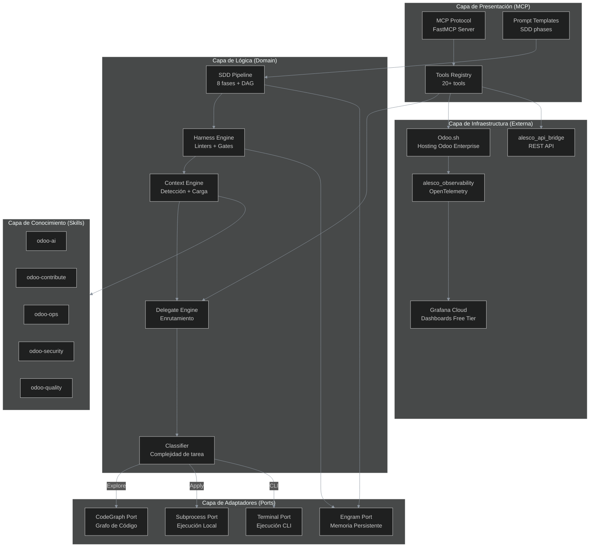
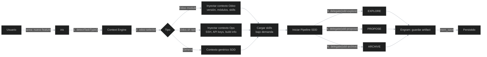
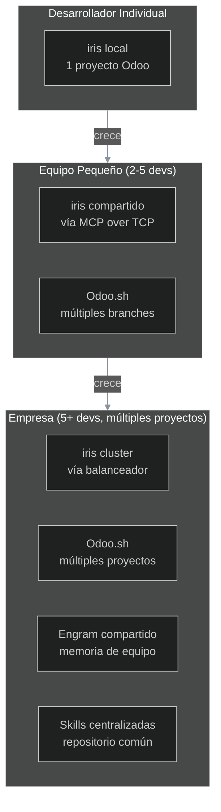
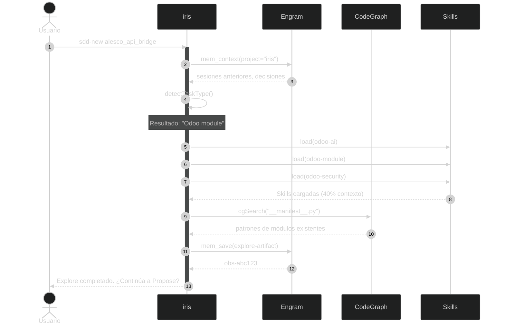
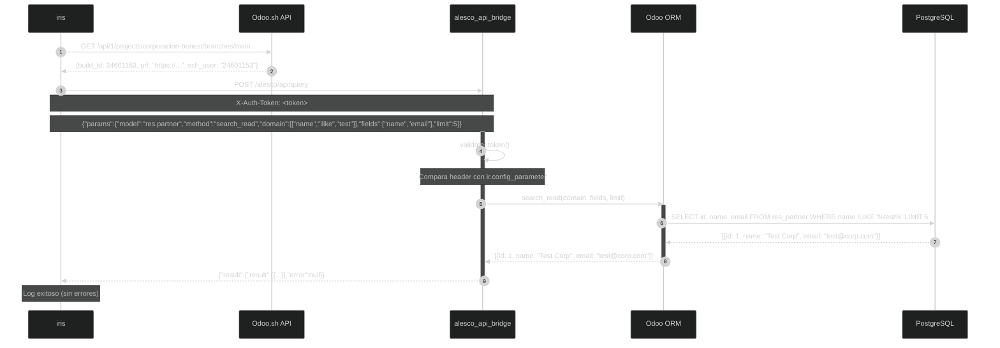

# iris — Arquitectura del Ecosistema

> **Versión:** 1.0.0  
> **Última actualización:** 2026-06-10  
> **Depende de:** `ECOSYSTEM.md` (documento maestro)

---

## Índice

1. [Visión General](#1-visión-general)
2. [Componentes del Sistema](#2-componentes-del-sistema)
3. [Diagrama de Arquitectura](#3-diagrama-de-arquitectura)
4. [Decisiones de Arquitectura (ADRs)](#4-decisiones-de-arquitectura-adrs)
5. [Flujo de Datos](#5-flujo-de-datos)
6. [Interfaces y Contratos](#6-interfaces-y-contratos)
7. [Escalabilidad](#7-escalabilidad)
8. [Diagramas de Secuencia](#8-diagramas-de-secuencia)

---

## 1. Visión General

iris es un **orquestador MCP (Model Context Protocol)** diseñado para el desarrollo profesional de Odoo Enterprise. Su propósito es coordinar agentes AI, gestionar el ciclo de vida de desarrollo SDD, y proporcionar herramientas de integración con Odoo.sh.

### Principios Arquitectónicos

| Principio | Descripción |
|---|---|
| **Hexagonal** | Los componentes se comunican a través de puertos y adaptadores. El núcleo (domain) no depende de infraestructura externa. |
| **Screaming Architecture** | La estructura del proyecto refleja el dominio Odoo, no la tecnología. |
| **Odoo-First** | Todas las decisiones de diseño priorizan el ecosistema Odoo. |
| **Stateless** | iris no guarda estado local. Todo el estado persiste en Engram. |
| **Fail-Fast** | Si un componente no responde, iris falla rápido con un mensaje claro. |

---

## 2. Componentes del Sistema

### 2.1 iris (MCP Server)

**Propósito**: Orquestador central que expone tools MCP para desarrollo Odoo.

```
src/
├── server.ts              ← Servidor MCP principal (FastMCP)
├── index.ts               ← Punto de entrada
├── updater.ts             ← Actualizador de configuración
├── config.ts              ← Configuración global
├── config/                ← Configuraciones adicionales
├── types/                 ← Definiciones de tipos
│   └── index.ts           ← Phase, DelegateRequest, AdapterName
├── router/                ← Enrutamiento de fases y tareas
│   ├── selector.ts        ← Phase→Adapter mapping
│   └── classifier.ts      ← Clasificación de tareas por complejidad
├── tools/                 ← Tools MCP expuestas
│   └── delegate.ts        ← Delegación de tareas a agentes
├── context/               ← Sistema de contexto
│   ├── odoo-selector.ts   ← Detector de tipo de tarea Odoo
│   └── odoo.js            ← Constructor de contexto Odoo
├── adapters/              ← Adaptadores de ejecución
├── executor/              ← Ejecutores
│   ├── subprocess.ts      ← Ejecución en subproceso
│   └── terminal.ts        ← Ejecución en terminal
├── engram/                ← Cliente Engram
│   ├── client.ts          ← Cliente MCP de Engram
│   └── sync.ts            ← Sincronización de artefactos
├── codegraph/             ← Cliente CodeGraph
│   └── client.ts          ← Cliente MCP de CodeGraph
├── store/                 ← Almacenamiento local temporal
└── diagrams/              ← Generación de diagramas
```

### 2.2 alesco_api_bridge (Módulo Odoo)

**Propósito**: Bridge REST seguro para que iris acceda a datos Odoo.

```
alesco_api_bridge/
├── __manifest__.py         ← Dependencias: base, web
├── __init__.py
├── controllers/
│   ├── __init__.py
│   ├── main.py             ← Endpoint /alesco/api/query
│   └── build_info.py       ← Endpoint /alesco/api/build-info
├── models/
│   ├── __init__.py
│   └── api_log.py          ← Log de accesos al bridge
├── data/
│   └── config_parameter.xml ← Token de autenticación
├── security/
│   └── ir.model.access.csv  ← Permisos del modelo de log
└── tests/
    ├── __init__.py
    ├── test_controllers.py  ← Tests de endpoints
    └── test_security.py     ← Tests de autenticación
```

### 2.3 alesco_observability (Módulo Odoo)

**Propósito**: OpenTelemetry para Odoo, gratis y open source.

```
alesco_observability/
├── __manifest__.py
├── __init__.py
├── models/
│   ├── __init__.py
│   └── otel_trace.py       ← Gestión de trazado OTel
├── controllers/
│   ├── __init__.py
│   └── otel_middleware.py  ← Middleware de tracing
├── pyproject.toml          ← Dependencia: opentelemetry-distro-odoo
├── security/
│   └── ir.model.access.csv
└── tests/
    ├── __init__.py
    ├── test_tracing.py
    └── test_middleware.py
```

### 2.4 Odoo.sh Tools (en iris)

**Propósito**: Tools MCP para interactuar con Odoo.sh.

```
src/tools/odoo/
├── bridge.ts               ← Tool: alesco_api_bridge query
├── ssh-discover.ts         ← Tool: descubre URL SSH dinámica
├── logs.ts                 ← Tool: tail de logs Odoo
├── psql.ts                 ← Tool: queries PostgreSQL seguras
├── status.ts               ← Tool: estado de builds
├── backups.ts              ← Tool: listado y restore de backups
└── audit.ts                ← Tool: audit logs de Odoo.sh
```

---

## 3. Diagrama de Arquitectura



*La arquitectura sigue el patrón hexagonal (ports & adapters). El **núcleo (Capa de Lógica)** contiene SDD, Harness, Context Engine y Delegate — no depende de infraestructura externa. Las **Capa de Presentación** expone tools MCP. Los **Adaptadores** implementan los puertos para conectarse a sistemas externos (Engram, CodeGraph, subprocess). La **Infraestructura** incluye Odoo.sh, los módulos Odoo y Grafana. La **Capa de Conocimiento** son skills markdown cargadas bajo demanda. Las flechas indican flujo de control: siempre del núcleo hacia afuera, nunca al revés.*

---

## 4. Decisiones de Arquitectura (ADRs)

### ADR-001: MCP como Protocolo de Comunicación

| Campo | Detalle |
|---|---|
| **Contexto** | Necesitamos un protocolo estandarizado para que iris se comunique con agentes AI, herramientas y servicios externos. |
| **Decisión** | Usar **Model Context Protocol (MCP)** como protocolo único de comunicación. |
| **Alternativas** | REST directo (menos flexible), gRPC (más complejo), WebSocket (sin estándar de herramientas). |
| **Consecuencias** | + Interoperabilidad con Claude Desktop, Codex CLI, Cursor. + Herramientas tipadas y descubribles. - Dependencia del ecosistema MCP (en crecimiento). |
| **Estado** | ✅ Aceptada |

### ADR-002: Engram como Única Fuente de Verdad

| Campo | Detalle |
|---|---|
| **Contexto** | iris necesita recordar decisiones, artefactos SDD y contexto entre sesiones. No debe depender del sistema de archivos local. |
| **Decisión** | **Engram** es la única fuente de verdad para estado persistente. iris no guarda archivos locales de estado. |
| **Alternativas** | Sistema de archivos local (no portable entre máquinas), Base de datos SQL (sobreingeniería). |
| **Consecuencias** | + Estado portable entre sesiones. + Trazabilidad completa. - Dependencia del servicio Engram. |
| **Estado** | ✅ Aceptada |

### ADR-003: CodeGraph Exclusivo para Exploración

| Campo | Detalle |
|---|---|
| **Contexto** | La fase SDD-Explore necesita investigar el código base sin modificarlo. Tradicionalmente se usa grep/búsqueda textual. |
| **Decisión** | **CodeGraph es la única herramienta permitida** en SDD-Explore. Prohibido usar grep, read, glob o bash para exploración. |
| **Alternativas** | grep + read (menos preciso, más tokens), búsqueda IDE (no disponible para agentes). |
| **Consecuencias** | + Precisión en búsquedas. + Trazabilidad de exploración. - Dependencia del índice CodeGraph. |
| **Estado** | ✅ Aceptada |

### ADR-004: Bridge con Token Auth (No API Key)

| Campo | Detalle |
|---|---|
| **Contexto** | alesco_api_bridge necesita autenticación. Rachel usó un token simple. Debemos decidir el mecanismo. |
| **Decisión** | **Token configurable en `ir.config_parameter`**, rotable periódicamente. No usar API keys de terceros (Claude, OpenAI). |
| **Alternativas** | API Key de Claude (vendor lock-in), OAuth2 (sobreingeniería para comunicación iris→bridge), JWT (complejidad innecesaria). |
| **Consecuencias** | + Simple, sin dependencias externas. + Configurable desde Settings de Odoo. - Menos features que OAuth (refresh, scopes). |
| **Estado** | ✅ Aceptada |

### ADR-005: OpenTelemetry Gratis (No dkn_otel)

| Campo | Detalle |
|---|---|
| **Contexto** | Necesitamos observabilidad en Odoo. `dkn_otel` cuesta $24.99. Existe alternativa gratis. |
| **Decisión** | Usar **`opentelemetry-distro-odoo`** (Apache-2.0, gratis en PyPI) como base para `alesco_observability`. |
| **Alternativas** | `dkn_otel` ($24.99, OPL-1), `az_opentelemetry` ($20.00, OPL-1), construir desde cero (más trabajo). |
| **Consecuencias** | + Sin costo recurrente. + Código abierto (Apache-2.0). - Menos features que opciones de pago (pero suficientes para nuestro caso). |
| **Estado** | ✅ Aceptada |

### ADR-006: SSH Dinámico con Auto-descubrimiento

| Campo | Detalle |
|---|---|
| **Contexto** | La URL SSH de Odoo.sh cambia en cada build. Hardcodearla rompe la conexión en cada push. |
| **Decisión** | iris **descubre dinámicamente** la URL SSH consultando la API REST de Odoo.sh o el endpoint `/alesco/api/build-info` del bridge. |
| **Alternativas** | Cloudflare Tunnel (costo), DNS dinámico (complejo), hardcodear y reconfigurar manualmente (error-prone). |
| **Consecuencias** | + Resiliente a cambios de build. + Sin costo adicional. - Dependencia de API Odoo.sh (gratis y estable). |
| **Estado** | ✅ Aceptada |

### ADR-007: Skills en Markdown, No en Código

| Campo | Detalle |
|---|---|
| **Contexto** | Necesitamos un sistema de conocimiento cargable por agentes AI. Las skills deben ser fáciles de crear y mantener. |
| **Decisión** | Las skills se definen en **archivos Markdown** con estructura estándar (`SKILL.md` + `references/` + `examples/`). No en código Python ni JSON. |
| **Alternativas** | Python modules (más potentes pero menos accesibles), JSON/YAML (menos legibles), Base de datos (sobreingeniería). |
| **Consecuencias** | + Fáciles de crear y mantener. + Cargables bajo demanda. + Legibles por humanos y agentes. - Sin lógica programática. |
| **Estado** | ✅ Aceptada |

---

## 5. Flujo de Datos

### Diagrama de Flujo de una Tarea SDD



*El flujo de una tarea SDD comienza cuando el usuario envía una solicitud a iris. El **Context Engine** clasifica la tarea (Odoo module, Odoo.sh ops, o general) usando `odoo-selector.ts`. Según el tipo, inyecta el contexto apropiado (versión Odoo, módulos instalados, skills, información de build). Luego carga las skills relevantes bajo demanda y finalmente inicia el pipeline SDD. Cada fase del pipeline produce un artifact que se persiste en Engram vía `mem_save`. Ningún estado se guarda localmente.*

---

## 6. Interfaces y Contratos

### 6.1 Contrato: iris → alesco_api_bridge

```
POST /alesco/api/query
Headers:
  X-Auth-Token: <string>
  Content-Type: application/json

Request Body:
{
  "params": {
    "model": "<string>",         // nombre del modelo Odoo (ej: "res.partner")
    "method": "<string>",        // "search_read" | "write" | "create" | "unlink"
    "domain": [<array>],         // dominio de búsqueda Odoo (ej: [["name", "ilike", "test"]])
    "fields": [<string>],        // campos a leer (ej: ["name", "email"])
    "limit": <number>,           // límite de resultados (default: 20)
    "values": {<object>},        // valores para write/create
    "ids": [<number>]            // IDs para write/unlink
  }
}

Response:
{
  "result": {
    "result": <any>,             // datos de respuesta
    "error": <string | null>     // mensaje de error, null si éxito
  }
}
```

### 6.2 Contrato: iris → Odoo.sh API

```
GET https://www.odoo.sh/api/1/projects/{project}/branches/{branch}
Headers:
  Authorization: Bearer <token>

Response:
{
  "id": 12345,
  "project_id": 67890,
  "name": "main",
  "build_id": 24601153,
  "status": "running" | "idle" | "error",
  "url": "https://{project}-{branch}-{build_id}.dev.odoo.com",
  "ssh_user": "24601153",
  "ssh_host": "{project}.odoo.com",
  "db_name": "{project}-{branch}-{build_id}",
  "commit": "abc123..."
}
```

### 6.3 Contrato: alesco_observability → Grafana

```
OTLP Protocol (HTTP/gRPC)
Endpoint: {grafana-cloud-otlp-endpoint}:4318
Headers:
  Authorization: Basic base64({instance-id}:{api-key})

Data:
  - Traces: Cada request HTTP a Odoo genera un trace
  - Metrics: Conteo de requests, duración, errores
  - Logs: Logs estructurados con trace_id correlation
```

---

## 7. Escalabilidad

### Estrategia de Escalado



*iris escala naturalmente desde un desarrollador individual hasta equipos enterprise. En modo **individual**, iris corre localmente conectado a un proyecto Odoo.sh. En modo **equipo**, iris se comparte vía MCP sobre TCP y cada desarrollador tiene su branch. En modo **empresa**, iris corre en un cluster con balanceador, Engram compartido como memoria de equipo, y skills centralizadas en un repositorio común. La arquitectura hexagonal permite escalar sin cambios en el núcleo — solo se agregan adaptadores.*

---

## 8. Diagramas de Secuencia

### 8.1 Nueva Tarea SDD



*Secuencia completa de inicio de una nueva tarea SDD. El usuario invoca `sdd-new`. iris primero recupera el contexto de Engram (decisiones pasadas, sesiones anteriores). Luego clasifica la tarea como "Odoo module" usando `detectTaskType()`. Carga las skills relevantes (odoo-ai, odoo-module, odoo-security) verificando que no excedan el 40% del contexto. Explora el código existente usando CodeGraph exclusivamente. Finalmente persiste el artifact de exploración en Engram y pregunta al usuario si desea continuar.*

### 8.2 Consulta al Bridge



*Secuencia de una consulta CRUD de iris al bridge. iris primero descubre la URL actual del build consultando la API de Odoo.sh. Luego envía una solicitud POST a alesco_api_bridge con autenticación por token. El bridge valida el token contra `ir.config_parameter`, ejecuta la operación en el ORM de Odoo (que a su vez ejecuta SQL en PostgreSQL), y devuelve el resultado. Todo el proceso es síncrono y el error se reporta en el campo `error` de la respuesta.*

---

## Apéndice A: Glosario de Términos

| Término | Definición |
|---|---|
| **MCP** | Model Context Protocol — protocolo estandarizado de Anthropic para comunicación entre LLMs y herramientas. |
| **SDD** | Spec-Driven Development — pipeline de desarrollo por fases con especificaciones formales. |
| **Harness** | Sistema de enforcement mecánico que valida reglas estructurales (linters, gates, tests). |
| **Engram** | Sistema de memoria persistente para agentes AI. Guarda observaciones, sesiones y artefactos. |
| **CodeGraph** | Herramienta de indexación de código en grafo. Permite búsqueda semántica y trazado de flujo. |
| **OTLP** | OpenTelemetry Protocol — protocolo estándar para exportar trazas, métricas y logs. |
| **ADR** | Architecture Decision Record — registro de decisión arquitectónica. |
| **OCA** | Odoo Community Association — organización que define estándares para módulos Odoo. |

---


---

## Apéndice B: Referencias Cruzadas

| Documento | Descripción |
|-----------|-------------|
| `ECOSYSTEM.md` | Documento maestro — define la arquitectura, componentes, 13 ingenierías, pipeline SDD, skills, harness, costos, roadmap |
| `AGENTS.md` | Definición de agentes especialistas Odoo — 7 roles con Onion Model, Teaching Mode, y mapeo a fases SDD |
| `CONNECTIVITY.md` | Matriz de conectividad — protocolos, puertos, dependencias, modos de fallo, zonas de seguridad |
| `RECIPROCAL_APPRENTICESHIP.md` | Metodología de aprendizaje recíproco — 4 pilares, Learning Artifacts, progresión por capas |
| `SECURITY.md` | Seguridad del ecosistema — 7 capas, políticas SSH/Token, auditoría, checklist SDD |
| `RELIABILITY.md` | Confiabilidad — backups, DR, resiliencia, circuit breaker, runbooks, SLOs |
| `QUALITY_SCORE.md` | Sistema de calidad — 10 dimensiones D1-D10, scoring ponderado, thresholds, PR Gates |
| `PLANS.md` | Plan de implementación — fases, dependencias, tickets, referencias a todos los documentos del ecosistema |
| `FRONTEND.md` | Frontend Odoo — patrones OWL, widgets, assets, temas, portal |
| `PRODUCT_SENS.md` | Sensibilidad de producto — restricciones de negocio, reglas críticas, compliance |

---

*Este documento de arquitectura es complementario al `ECOSYSTEM.md`. Describe las decisiones técnicas, contratos y flujos del sistema. Cualquier cambio arquitectónico requiere un nuevo ADR y actualización de este documento.*
