# Closure Report: Native Engram IPC Integration (iris-engram-ipc)

## Executive Summary / What was Built
The `iris-engram-ipc` architectural change marks a significant milestone in the modernization of the communication interface between **Iris (the orchestration parent process)** and **Agy (the subagent CLI execution engine)**. 

We have successfully transitioned from a fragile, file-based Inter-Process Communication (IPC) system—which relied on disk-polling watchers and file appending sentinels (`Tee-Object` and `IRIS_COMPLETE` flags)—to a robust, native, memory-based IPC system. Under this new architecture, **Agy** utilizes the native **Engram** memory store to save execution progress, output logs, and completion status flags. Concurrently, **Iris** actively queries Engram using semantic search and direct key retrieval tools, establishing an ultra-reliable, highly decoupled, and low-latency synchronization loop.

---

## Why: Rationale & Architectural Benefits
The migration to native Engram-based IPC was driven by several key architectural limitations of the legacy implementation:

1. **Fragility of Filesystem Watchers**: File-based watchers (`fs.watch`, `fs.watchFile`) are notoriously flaky across different operating systems (especially Windows), occasionally missing change events or double-firing when file handles are released.
2. **Disk I/O Overhead & Race Conditions**: Relying on the physical disk for constant updates introduced latent race conditions, file lock contention, and excessive I/O bottlenecks.
3. **Context Window Inflation**: Appending massive stdout blocks to text files on disk often resulted in importing bloated, unsummarized contexts back into the LLM window, raising token costs and diluting agent attention.
4. **Shell/Sentinel Dependency**: Using PowerShell’s `Tee-Object` alongside custom append sentinels (e.g., `IRIS_COMPLETE`) made the execution shell highly rigid and sensitive to encoding mismatches or pipe breakages.

### The Engram Solution
By storing the execution state in Engram:
- Communication becomes **stateless and native** to the agent’s execution tools.
- We eliminate file system dependencies and the legacy watcher subsystem entirely.
- Data structures are kept clean and easily queried via semantic search, decoupling the orchestrator's polling logic from the actual terminal terminal state.

---

## Files Changed / Deleted
A clean, precise set of changes was applied to transition the codebase safely. Below is the verification checklist of the files modified and deleted:

* [x] **`src/engram/sync.ts`** (Modified)
  - Implemented the `waitForEngramCompletion()` polling routine.
  - Configured robust 3-second polling interval utilizing `mem_search` to verify task completion.
  - Structured standard completion detection looking for the `"DONE:" + taskId` signature.
  - Implemented graceful cleanup and task cancellation via `failTask()` on timeout.

* [x] **`src/executor/terminal.ts`** (Modified)
  - Cleaned up terminal spawning logic.
  - Completely removed the `Tee-Object` command pipelining, `outputFile` creation, and `IRIS_COMPLETE` sentinel append injection.
  - Simplified the terminal environment to spawn raw commands cleanly.

* [x] **`src/tools/delegate.ts`** (Modified)
  - Updated the metadata setup inside `saveTaskPrompt()`.
  - Configured Agy to write its stdout/stderr to `"iris/task/{taskId}/output"` via `mem_save`.
  - Instructed Agy to commit `"DONE:{taskId}"` to `"iris/task/{taskId}/status"` upon completion of all execution steps.

* [x] **`src/executor/watcher.ts`** (Deleted)
  - Deleted the legacy file watcher entirely, eliminating dead polling code and reducing active maintenance surface.

---

## Technical Decisions & Implementation Details

### 1. Polling & Sync Mechanism
The synchronization is managed by `waitForEngramCompletion()` in `src/engram/sync.ts`:
- **Interval**: 3 seconds.
- **Search Strategy**: Uses `mem_search` with a query target specific to the `taskId` to locate status records in the active Engram session.
- **Completion Check**: Validates if the returned payload contains the exact status signature: `"DONE:" + taskId`.
- **Graceful Failure**: If the task exceeds the allocated timeout period without writing the `DONE` sentinel, the loop terminates and executes `failTask()`, ensuring no dangling background processes or locked states.

### 2. Engram Key Schemas
To ensure consistency and ease of lookup, we defined explicit, predictable keys:
* **Terminal Outputs**: `iris/task/{taskId}/output`
  - *Content*: Full execution console logs and error streams captured during runtime.
* **Execution Status**: `iris/task/{taskId}/status`
  - *Content*: `"DONE:{taskId}"` saved upon successful completion.

### 3. Avoiding Command Separator Issues with `-EncodedCommand`
During terminal integration under Windows Terminal (`wt`), passing complex command lines containing logical operators or special separators often caused parsing failures. 
* **Solution**: Commands are now base64 encoded into a UTF-16LE byte array and passed using the `-EncodedCommand` switch of PowerShell. This completely bypasses terminal escaping issues, ensuring execution commands arrive intact.

### 4. Deterministic Model Swapping via `swapModel()`
To prevent mismatch failures during subagent model switching, `swapModel()` was refined to perform **exact name matches** against the model registry. The selected configuration is persisted to `settings.json` located at `.gemini/antigravity-cli/settings.json`.

---

## Flow Diagram
The following diagram demonstrates the lifecycle and interaction pattern of the new Engram-based IPC:

```mermaid
sequenceDiagram
    autonumber
    participant Iris as Iris (Orchestrator Parent)
    participant Engram as Engram (Native Memory Store)
    participant Agy as Agy (Subagent CLI)

    Note over Iris, Agy: 1. Task Initialization & Handover
    Iris->>Engram: saveTaskPrompt() - Persists task prompt & metadata
    Iris->>Agy: Spawns subagent in wt new-tab via -EncodedCommand

    Note over Agy: 2. Execution & Status Logging
    rect rgb(30, 41, 59)
        Agy->>Agy: Executes command pipeline
        Agy->>Engram: mem_save("iris/task/{taskId}/output", stdout)
        Agy->>Engram: mem_save("iris/task/{taskId}/status", "DONE:{taskId}")
    end

    Note over Iris: 3. Decoupled Polling Loop
    loop Every 3 Seconds
        Iris->>Engram: mem_search("DONE:{taskId}")
        alt Status is DONE
            Engram-->>Iris: Returns completion signal
            Iris->>Iris: Completes task & processes output
        else Timeout Exceeded
            Iris->>Iris: Triggers failTask() (Clean Exit)
        end
    end
```

---

## Risks & Mitigations

| Identified Risk | Impact | Mitigation Strategy |
| :--- | :--- | :--- |
| **Plugin Load Failure in CLI** | High | If Agy runs in `--print` mode and fails to load the required MCP plugins, it will be unable to call `mem_save`. This would prevent the completion signal from being written. | **Mitigation**: Implemented a fallback timeout in `waitForEngramCompletion()`. If no signal is written within the timeout threshold, Iris executes `failTask()`, avoiding infinite loops. Additionally, bootstrap scripts ensure that standard MCP plugin paths are pre-loaded in the execution environment. |
| **Engram Search Latency** | Low | High traffic or large database size could theoretically slow down `mem_search` response times. | **Mitigation**: Polling interval is set to a conservative 3 seconds to avoid rate limiting or high load on the memory store, and keys use precise, structured formats for fast indexing. |
| **PowerShell Process Termination** | Medium | The CLI process could be forcefully killed by the OS or user, leaving no `DONE` sentinel in Engram. | **Mitigation**: The orchestrator's timeout handler guarantees that dead processes are marked as failed, freeing up the runner queue and notifying the parent context. |

---

## Rollback Steps
Should a critical system failure occur requiring a rollback to the file-based watcher mechanism, follow these steps in order:

1. **Revert Core Executor Changes**:
   - Restore `src/executor/watcher.ts` from git history (`git checkout HEAD~1 -- src/executor/watcher.ts`).
   - Re-introduce `Tee-Object` piping and the `IRIS_COMPLETE` sentinel append logic back into `src/executor/terminal.ts`.
2. **Revert Polling Strategy**:
   - In `src/engram/sync.ts`, replace `waitForEngramCompletion()` with the legacy file watcher subscription mechanism that listens for file system changes on the output path.
3. **Restore Tool Definitions**:
   - Modify `src/tools/delegate.ts` to expect raw text files instead of writing output directly to Engram via `mem_save`.
4. **Compile and Verify**:
   - Run `npx tsc` to verify compilation.
   - Run integration tests to ensure that the file system watcher completes processes as expected.

---

### Architectural Sign-off
This native integration significantly increases system stability, reduces disk I/O, and aligns the Iris codebase with state-of-the-art agent communication practices. Let's move forward with this modern, elegant approach!

*Prepared with care by Fairw, Systems Engineer & Senior Architect*
