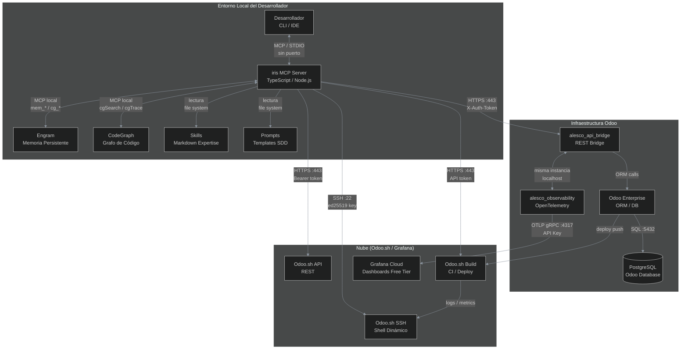
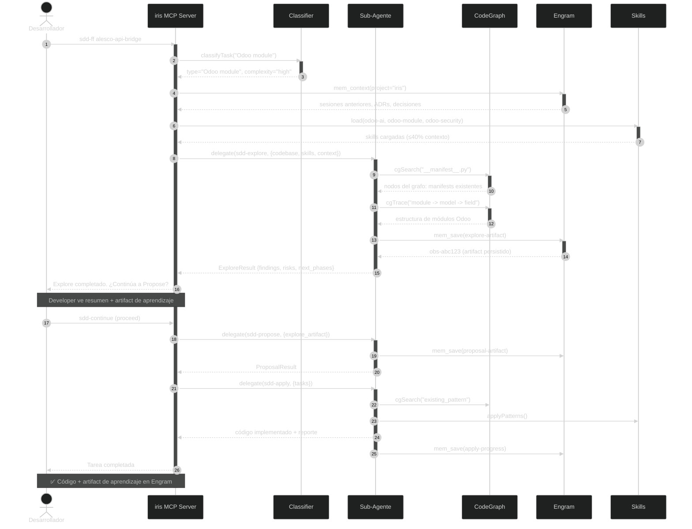
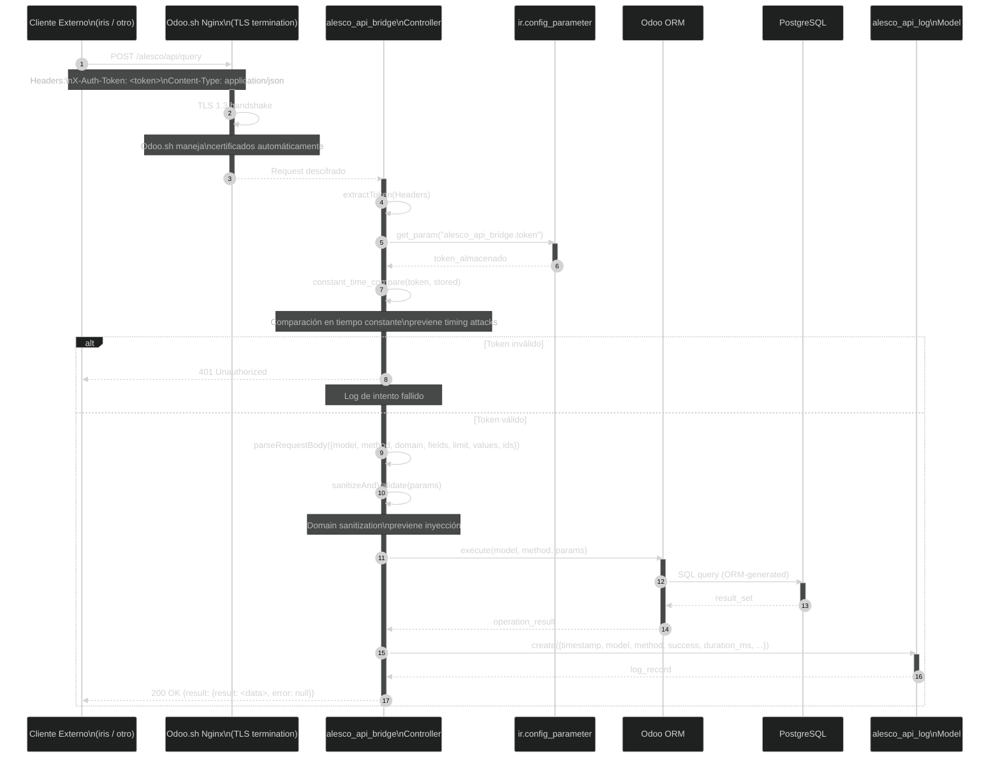
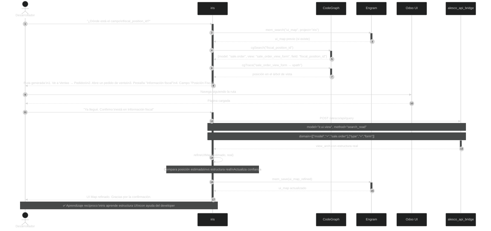
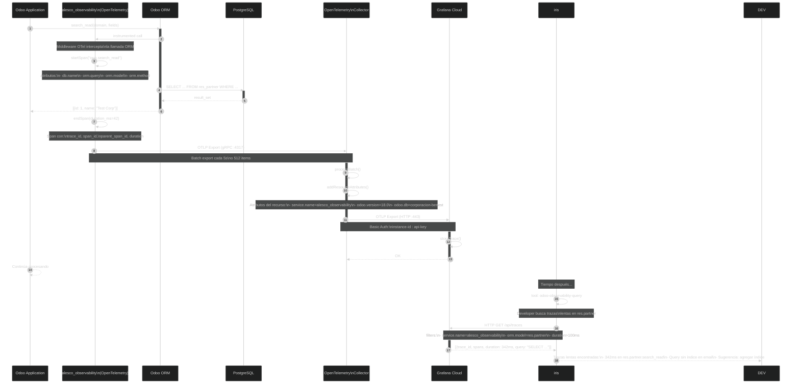
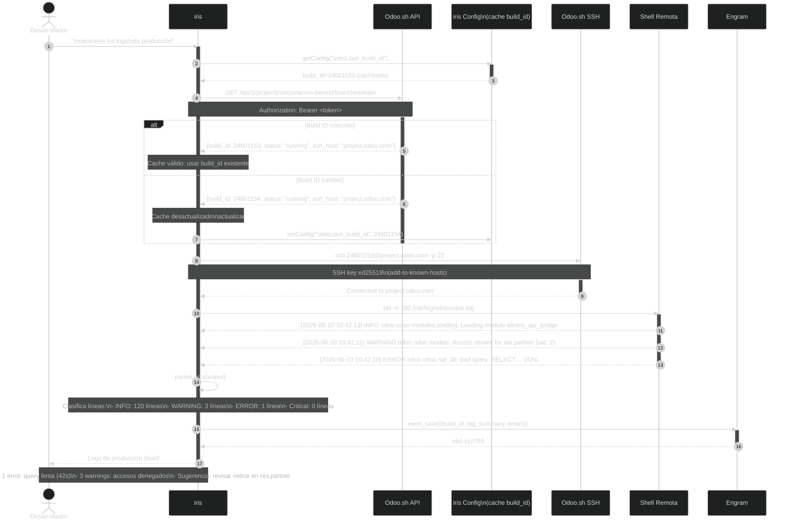
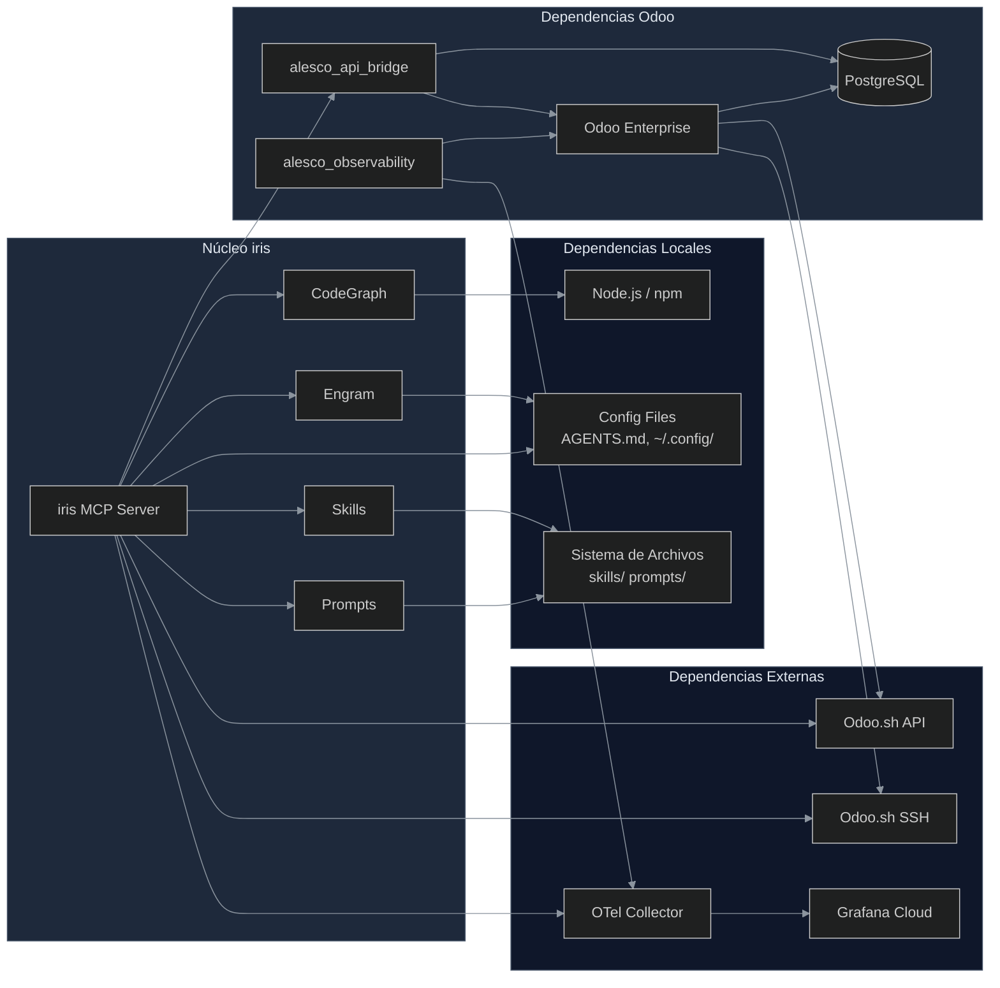
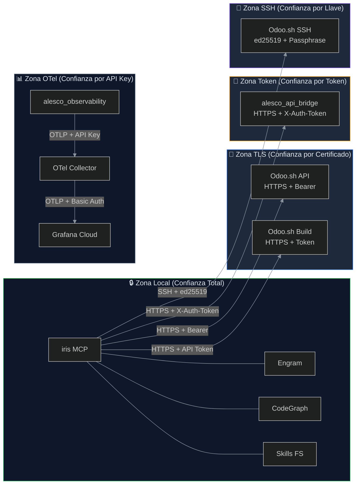

# CONNECTIVITY.md — Matriz de Conectividad del Ecosistema iris

> **Versión:** 1.0.0  
> **Estado:** ✅ Completo  
> **Última actualización:** 2026-06-10  
> **Autor:** Fairw — Systems Engineer & Senior Odoo Architect  
> **Depende de:** `ARCHITECTURE.md`, `ECOSYSTEM.md`, `SECURITY.md`, `RELIABILITY.md`  
> **Ingeniería relacionada:** Reliability Engineering (13), Security Engineering (11), Orchestration Engineering (8)

---

## Índice

1. [Component Inventory](#1-component-inventory)
2. [Communication Matrix](#2-communication-matrix)
3. [Protocol Reference Table](#3-protocol-reference-table)
4. [Data Flow Diagrams](#4-data-flow-diagrams)
5. [Port and Endpoint Reference](#5-port-and-endpoint-reference)
6. [Dependency Graph](#6-dependency-graph)
7. [Synchronization Events](#7-synchronization-events)
8. [Security-Critical Connections](#8-security-critical-connections)
9. [Connectivity Failure Modes](#9-connectivity-failure-modes)

---

## 1. Component Inventory

| Component | Type | Location | Purpose |
|-----------|------|----------|---------|
| **iris MCP Server** | Node.js/TypeScript | `C:\Development\iris\src\` | Central orchestrator — expone tools MCP, ejecuta pipeline SDD, gestiona contexto |
| **CodeGraph** | MCP tool | Integrado en iris (MCP local) | Static code analysis de módulos Odoo — búsqueda semántica, trazado de flujo |
| **Engram** | Memory system | Integrado (MCP local) | Memoria persistente entre sesiones — observaciones, artefactos SDD, taxonomía |
| **alesco_api_bridge** | Odoo module | `C:\Development\Odoo\18\aeca\` (a refactorizar) | REST bridge Odoo ↔ iris — endpoints `/alesco/api/query` y `/alesco/api/build-info` |
| **alesco_observability** | Odoo module | A crearse en `modules/` | OpenTelemetry gratuito para Odoo — trazas, métricas y logs vía OTLP |
| **Odoo.sh** | Cloud platform | `odoo.com` | Hosting Odoo Enterprise — SSH dinámico, logs, backups, CI builds |
| **Skills** | Markdown files | `~/.claude/skills/` + `C:\Development\iris\skills\` | Conocimiento experto cargable bajo demanda por el Context Engine |
| **Prompts** | Markdown templates | `C:\Development\iris\prompts\` | Templates de prompts para cada fase SDD (explore, propose, spec, etc.) |
| **Odoo Enterprise** | ERP | Odoo.sh instance | Plataforma objetivo de desarrollo — módulos, ORM, vistas, seguridad |
| **Reciprocal Apprenticeship** | Methodology | `RECIPROCAL_APPRENTICESHIP.md` | Marco pedagógico — cada tarea produce código + artifact de aprendizaje |
| **Grafana Cloud Free Tier** | Dashboard | Grafana Cloud | Visualización de trazas OTel, métricas de confiabilidad y dashboards de seguridad |

---

## 2. Communication Matrix

### Diagrama de Interacción de Componentes



*Todos los componentes del ecosistema iris se organizan en tres entornos: **Local** (desarrollador), **Infraestructura Odoo** (módulos dentro de Odoo) y **Nube** (Odoo.sh / Grafana). Las conexiones locales usan MCP o file system; las conexiones remotas usan HTTPS con autenticación por token o SSH con llave ed25519. El bridge y la observabilidad corren dentro de la misma instancia Odoo.*

---

## 3. Protocol Reference Table

| Connection | Protocol | Port | Auth Method | Encryption | Direction |
|------------|----------|------|-------------|------------|-----------|
| Developer ↔ iris (CLI) | MCP/STDIO | N/A | Config file (`AGENTS.md`) | N/A (local loopback) | Bidireccional |
| iris ↔ CodeGraph | MCP | Dinámico (local) | Config (`~/.config/`) | Local (sin red) | Bidireccional |
| iris ↔ Engram | Engram API (MCP) | Local socket | Config (`~/.config/`) | Local (sin red) | Bidireccional |
| Bridge ↔ Odoo | HTTP REST | 8069 (dev) / 443 (prod) | Token (`X-Auth-Token`) | HTTPS (TLS 1.3) | Bidireccional |
| iris ↔ Odoo.sh (SSH) | SSH v2 | 22 | SSH key ed25519 (passphrase) | SSH (cifrado por sesión) | iris → Odoo.sh |
| iris ↔ Odoo.sh API | HTTPS REST | 443 | Bearer token (API key) | TLS 1.3 | Bidireccional |
| iris ↔ Odoo.sh Build | HTTPS | 443 | Odoo.sh API token | TLS 1.3 | Bidireccional |
| Odoo ↔ OpenTelemetry | OTLP/gRPC | 4317 | N/A (plugin interno) | Opcional (TLS configurable) | Odoo → Collector |
| Odoo ↔ OpenTelemetry (HTTP) | OTLP/HTTP | 4318 | N/A (plugin interno) | Opcional (TLS configurable) | Odoo → Collector |
| Grafana ↔ OpenTelemetry | OTLP/HTTP | 443 (Grafana Cloud) | Basic Auth (instance-id:api-key) | TLS 1.3 | Collector → Grafana |
| Skills ↔ iris | File system | N/A | N/A | N/A (disco local) | iris → Skills (lectura) |
| Prompts ↔ iris | File system | N/A | N/A | N/A (disco local) | iris → Prompts (lectura) |
| Odoo ↔ PostgreSQL | PostgreSQL wire | 5432 | Password / Peer | Local (Odoo.sh internal) | Bidireccional |
| Odoo.sh → Odoo instance | HTTPS | 443 | Session cookie | TLS 1.3 | Usuario → Odoo (UI) |

### Detalle de Protocolo: MCP (Model Context Protocol)

Todas las comunicaciones internas de iris (con Engram, CodeGraph y el developer) usan **MCP** como protocolo unificado. MCP es un protocolo basado en JSON-RPC 2.0 que define:

- **Tools**: funciones invocables con parámetros tipados y descripciones
- **Resources**: datos expuestos con URI scheme
- **Prompts**: templates de instrucciones precargables
- **Transport**: STDIO (local) o SSE (remoto)

Para la matriz de conectividad, MCP se considera un protocolo único independientemente del transport subyacente.

### Detalle de Protocolo: SSH Dinámico

El SSH de Odoo.sh es **dinámico**: la URL cambia en cada build. El formato es:
```
ssh {build_id}@{project}.odoo.com -p 22
```
iris descubre `build_id` automáticamente consultando la API REST de Odoo.sh antes de cada conexión (ver `src/tools/odoo/ssh-discover.ts` en `ARCHITECTURE.md:125`).

---

## 4. Data Flow Diagrams

### 4.1 Full SDD Task Flow

Flujo completo de una tarea SDD: el developer envía un cambio → iris clasifica → delega a sub-agente → sub-agente usa CodeGraph + Engram + Skills → genera output → persiste en Engram → retorna resultado → developer ve código + artifact de aprendizaje (Reciprocal Apprenticeship).



*El flujo SDD completo inicia con el developer invocando `sdd-ff`. iris clasifica la tarea usando el Classifier, recupera contexto de Engram, carga skills bajo demanda, y delega cada fase a sub-agentes especializados. Cada sub-agente usa CodeGraph exclusivamente para exploración (nunca grep/read, según ADR-003 en `ARCHITECTURE.md:225`), persiste artifacts en Engram (ADR-002 en `ARCHITECTURE.md:215`), y aplica patrones de las skills cargadas. Al finalizar, el developer recibe código funcional más un artifact de aprendizaje registrado en Engram, cumpliendo el principio de Reciprocal Apprenticeship.*

### 4.2 Bridge Request Flow

Flujo de una solicitud externa a través del bridge: HTTPS → alesco_api_bridge controller → validar token → ejecutar operación ORM → log a alesco_api_log → retornar JSON.



*El bridge es el punto de entrada para que iris acceda a datos de Odoo. Cada request pasa por 7 etapas: (1) TLS termination en Odoo.sh Nginx, (2) extracción del token del header `X-Auth-Token`, (3) validación contra `ir.config_parameter`, (4) sanitización de parámetros (dominios, métodos, campos), (5) ejecución de la operación ORM, (6) registro en `alesco_api_log`, (7) respuesta JSON. La validación del token usa comparación en tiempo constante para prevenir timing attacks. Ver `ARCHITECTURE.md:309` para el contrato completo de la API.*

### 4.3 UI Navigation Learning Flow

Flujo de aprendizaje de navegación UI: el developer pregunta "dónde está el campo X" → iris consulta CodeGraph por UI Map → genera ruta de navegación → developer sigue ruta en Odoo UI → bridge observa cambios de URL → iris aprende estructura real → refina UI Map.



*Este flujo implementa el principio de Reciprocal Apprenticeship: el developer enseña a iris la estructura real de la UI, y iris la incorpora a su modelo de conocimiento. iris primero consulta CodeGraph para estimar dónde está un campo basándose en el archivo XML de la vista. Luego genera una ruta de navegación. El developer la sigue y confirma la ubicación real. iris refina su UI Map y persiste el aprendizaje en Engram para futuras consultas. Con cada iteración, la precisión del UI Map mejora.*

### 4.4 Observability Flow

Flujo de observabilidad: alesco_observability instrumenta llamadas ORM → exporta trazas OTLP → OpenTelemetry Collector → Grafana Cloud → developer debuggea vía iris.



*alesco_observability instrumenta cada llamada al ORM de Odoo usando OpenTelemetry. Cada operación genera un span con atributos (modelo, método, query, duración). Los spans se exportan en batch al OpenTelemetry Collector vía OTLP/gRPC cada 5 segundos. El Collector agrega atributos del recurso (versión Odoo, nombre de BD) y reenvía a Grafana Cloud. Luego, el developer puede consultar trazas lentas desde iris para identificar cuellos de botella. El módulo usa `opentelemetry-distro-odoo` (Apache-2.0, gratis), como establece ADR-005 en `ARCHITECTURE.md:245`.*

### 4.5 Odoo.sh Operations Flow

Flujo de operaciones Odoo.sh: el developer pide "muéstrame los logs" → iris descubre build_id vía API Odoo.sh → establece conexión SSH → ejecuta comando → retorna output estructurado.



*Las operaciones Odoo.sh siguen un patrón de discovery primero, ejecución después. iris primero consulta la API REST de Odoo.sh para obtener el build_id actual (ADR-006 en `ARCHITECTURE.md:255`). Si el build_id cambió (por un push reciente), actualiza el cache. Luego establece conexión SSH usando la llave ed25519 configurada en Odoo.sh. Ejecuta el comando solicitado (tail, psql, status), parsea la salida para extraer información relevante (errores, warnings, métricas), y persiste el resultado en Engram. El developer ve un resumen estructurado, no texto crudo. Ver `src/tools/odoo/` en `ARCHITECTURE.md:124` para la lista completa de tools.*

---

## 5. Port and Endpoint Reference

### Puertos

| Componente | Puerto(s) | Protocolo | Propósito |
|------------|-----------|-----------|-----------|
| **Odoo (desarrollo)** | 8069 | HTTP | Instancia Odoo local (docker/venv) |
| **Odoo (producción)** | 443 | HTTPS | Odoo.sh — TLS termination en Nginx |
| **Odoo Longpolling** | 8072 | HTTP | Notificaciones en tiempo real (bus) |
| **PostgreSQL** | 5432 | PostgreSQL wire | Base de datos Odoo (localhost) |
| **OpenTelemetry gRPC** | 4317 | OTLP/gRPC | Recolección de trazas OTel |
| **OpenTelemetry HTTP** | 4318 | OTLP/HTTP | Recolección alternativa de trazas |
| **Grafana Cloud OTLP** | 443 | OTLP/HTTP | Export a Grafana Cloud |
| **SSH Odoo.sh** | 22 | SSH v2 | Shell remoto dinámico |
| **Odoo.sh API** | 443 | HTTPS | API REST de gestión |
| **Odoo.sh Git** | 22/443 | SSH/HTTPS | Git push para CI builds |

### Endpoints

| Componente | Endpoint | Método | Propósito |
|------------|----------|--------|-----------|
| **alesco_api_bridge** | `/alesco/api/query` | POST | Consulta CRUD a modelos Odoo |
| **alesco_api_bridge** | `/alesco/api/build-info` | GET | Información del build actual |
| **Odoo** | `/web` | GET | Interfaz web de Odoo |
| **Odoo** | `/api` (v1) | POST/GET | API REST nativa de Odoo |
| **Odoo** | `/jsonrpc` | POST | API XML-RPC/JSON-RPC |
| **Odoo** | `/longpolling/poll` | GET | Longpolling para notificaciones |
| **Odoo.sh API** | `/api/1/projects/{id}/branches/{branch}` | GET | Estado del build y build_id |
| **Odoo.sh API** | `/api/1/projects/{id}/branches/{branch}/backups` | GET | Listado de backups |
| **Odoo.sh API** | `/api/1/projects/{id}/branches/{branch}/backups/{bid}` | POST | Restore de backup |
| **Odoo SSH** | `ssh {build_id}@{project}.odoo.com` | SSH | Conexión shell remota |

### Endpoints Planeados (alesco_observability)

| Componente | Endpoint | Método | Propósito |
|------------|----------|--------|-----------|
| **alesco_observability** | `/alesco/otel/traces` | GET | Consulta de trazas locales |
| **alesco_observability** | `/alesco/otel/health` | GET | Health check del módulo OTel |

*Nota: los endpoints de alesco_observability están en fase de diseño. Ver roadmap en `ECOSYSTEM.md:572`.*

---

## 6. Dependency Graph

### Dependencias Directas

```
iris ──requires──▶ Engram (memoria persistente entre sesiones)
iris ──requires──▶ CodeGraph (análisis de código en grafo)
iris ──requires──▶ Skills (conocimiento experto cargable)
iris ──requires──▶ Prompts (templates de fase SDD)
Bridge ──requires──▶ Odoo (el bridge es un módulo Odoo, corre dentro de su ORM)
Observability ──requires──▶ Odoo (ídem, módulo Odoo interno)
Odoo.sh SSH ──requires──▶ Odoo.sh API (el build_id se descubre vía API REST)
Odoo ──requires──▶ PostgreSQL (base de datos relacional)
Grafana ──requires──▶ Odoo.sh (red pública para export OTel)
Observability ──requires──▶ OTel Collector (middleware de recepción OTLP)
Skills ──requires──▶ Skill Registry (índice de skills disponibles en `SKILLS/`)
Engram ──requires──▶ Config local (~/.config/) (archivo de configuración)
```

### Árbol de Dependencias Completas



*El núcleo iris depende de Engram y CodeGraph para operar. Sin memoria no hay continuidad entre sesiones. Sin análisis de código no hay exploración. Las skills y prompts son dependencias de conocimiento: iris puede arrancar sin ellas, pero no puede ejecutar tareas especializadas. Las dependencias externas (Bridge en Odoo, API Odoo.sh, SSH) son necesarias para operaciones específicas; si una falla, iris degrada gracefulmente y solo fallan las tools que dependen de ese componente. Ver `RELIABILITY.md:276` para los patrones de resiliencia.*

### Matriz de Dependencias

| Dependencia | Esencial | Si falla... | Recuperación |
|-------------|----------|-------------|--------------|
| Engram | ✅ Sí | Sin memoria entre sesiones, SDD no puede continuar | `RELIABILITY.md:169` — reiniciar iris, recupera contexto |
| CodeGraph | ✅ Sí | Explore no puede ejecutarse | Harness bloquea fase Explore, ver `ECOSYSTEM.md:348` |
| Skills | ⚠️ Crítico | Agente sin conocimiento de dominio | Degradación graceful: funciona sin skills pero con menos precisión |
| Bridge | ⚠️ Crítico | CRUD Odoo no disponibles | Fallback: `RELIABILITY.md:399` — rediscovery automático |
| Odoo.sh API | ⚠️ Crítico | No se puede descubrir build_id | Fallback: usar último build_id conocido, retry con backoff |
| SSH | ⚡ Transitorio | No se pueden leer logs ni ejecutar comandos | Circuit breaker 30s, `RELIABILITY.md:286` |
| PostgreSQL | ✅ Sí | Odoo no funciona | Odoo.sh maneja HA de base de datos |

---

## 7. Synchronization Events

| Evento | Trigger | Qué sincroniza | Target | Frecuencia |
|--------|---------|----------------|--------|------------|
| SDD task complete | Sub-agente termina fase | Artifact de aprendizaje (explore, propose, spec, etc.) | Engram (`mem_save`) | Por cada fase SDD |
| Nuevo módulo analizado | Developer solicita exploración | UI Map (posición de campos en vistas XML) | CodeGraph (cache en grafo) | Bajo demanda |
| Módulo actualizado | git push / module update | Security audit → validación contra SECURITY.md | SECURITY.md validation (harness) | Por cada CI build |
| Bridge recibe request | HTTP POST a `/alesco/api/query` | Log de acceso (`alesco_api_log`) | Modelo Odoo `alesco_api_log` | Por cada request |
| Odoo.sh rebuild | git push a Odoo.sh | SSH build_id → actualizar en iris config | iris config (cache de build_id) | Por cada push |
| Inicio de sesión iris | iris arranca | Recuperar contexto de sesiones anteriores | Engram (`mem_context`) | Por cada inicio |
| Fin de sesión iris | Sesión termina | Resumen de sesión con logros y pendientes | Engram (`mem_session_end`) | Por cada fin de sesión |
| Skill actualizada | Nuevo SKILL.md o modificación | Skill Registry actualizado | `SKILLS/` + Engram | Bajo demanda |
| Health Check | iris arranca (y cada 5 min) | Estado de todas las conexiones | iris log + Engram | Periódico (5 min) |
| Token rotado | Administrador cambia token | Bridge reinicia validación con nuevo token | `ir.config_parameter` | Cada 90 días |
| Backup Odoo.sh | Automático (cada 24h) | DB completa + filestore | Odoo.sh Storage | Diario |

### Protocolo de Sincronización

```
Evento → Detección → Acción → Confirmación → Registro
   │          │          │          │             │
   │     [Context     [Acción    [Engram      [Audit
   │      Engine]     correctiva] mem_save]    Trail]
   v
[Duración: < 500ms objetivo]
```

*Cada evento de sincronización sigue el mismo protocolo: (1) el Context Engine detecta el evento, (2) iris ejecuta la acción correctiva (rediscovery, persistencia, recarga), (3) confirma la acción guardando en Engram, (4) registra en el audit trail. La duración objetivo de cada ciclo de sincronización es menor a 500ms. Si una sincronización falla, se reintenta con backoff exponencial (1s, 2s, 4s) según la política de `RELIABILITY.md:278`.*

---

## 8. Security-Critical Connections

Extraído de `SECURITY.md:176-205`. Las siguientes conexiones tienen implicaciones de seguridad críticas:

### 8.1 Bridge → iris (Token Auth)

| Propiedad | Valor |
|-----------|-------|
| **Mecanismo** | Token en header `X-Auth-Token` |
| **Almacenamiento** | `ir.config_parameter` en Odoo (NUNCA en código fuente) |
| **Rotación** | Cada 90 días (`SECURITY.md:351`) |
| **Longitud mínima** | 32 caracteres alfanuméricos |
| **Validación** | Comparación en tiempo constante (`constant_time_compare`) |
| **Auditoría** | Cada uso registrado en `alesco_api_log` |
| **Token por defecto** | `CAMBIAR_POR_TOKEN_SEGURO` — obligatorio cambiar |
| **Riesgo si se expone** | Acceso CRUD no autorizado a datos de Odoo |

**Regla del harness:** Si el token es el default, el CI gate bloquea el build.

### 8.2 iris → Odoo.sh (SSH Key Auth)

| Propiedad | Valor |
|-----------|-------|
| **Mecanismo** | Llave pública ed25519 con passphrase |
| **Almacenamiento** | Gestionada vía Odoo.sh UI (Settings → Llaves SSH) |
| **Formato** | `ed25519` (no RSA, no DSA) |
| **Acceso permitido** | Solo desde IPs del equipo de desarrollo |
| **Comandos prohibidos** | `DROP`, `TRUNCATE`, `DELETE FROM` sin WHERE |
| **Timeout inactividad** | 15 min → desconexión automática |
| **Riesgo si se expone** | Acceso shell completo a la instancia Odoo |

**Regla del harness:** iris nunca almacena la llave SSH localmente. La llave se configura exclusivamente en Odoo.sh y se referencia por fingerprint.

### 8.3 iris → CodeGraph / Engram (Local Only)

| Propiedad | Valor |
|-----------|-------|
| **Mecanismo** | MCP local (STDIO o socket Unix) |
| **Exposición externa** | ❌ Ninguna — no hay bind a 0.0.0.0 |
| **Autenticación** | Config local (`~/.config/opencode/`) |
| **Cifrado** | N/A — tráfico local únicamente |
| **Riesgo** | Bajo — no atraviesa la red |

### 8.4 Odoo → Odoo.sh (HTTPS)

| Propiedad | Valor |
|-----------|-------|
| **Mecanismo** | TLS 1.3, certificados automáticos de Odoo.sh |
| **Cifrado** | Automático (Odoo.sh maneja TLS termination) |
| **HSTS** | Activado por defecto |
| **Riesgo** | Bajo — gestionado completamente por Odoo.sh |

### 8.5 Mapa de Seguridad por Conexión



*Cada conexión pertenece a una zona de seguridad con mecanismos diferentes. La **Zona Local** no tiene autenticación explícita (confianza en el entorno local). La **Zona TLS** confía en el certificado TLS de Odoo.sh. La **Zona Token** requiere un token secreto rotable periódicamente. La **Zona SSH** usa llave pública ed25519 con passphrase. La **Zona OTel** usa API Key para autenticación contra Grafana Cloud. La regla de seguridad fundamental, según `SECURITY.md:29`, es defensa en profundidad: si una capa falla, la siguiente debe proteger.*

---

## 9. Connectivity Failure Modes

| Failure | Síntoma | Componentes afectados | Detección | Recovery | Prioridad |
|---------|---------|-----------------------|-----------|----------|-----------|
| **Bridge unreachable** | iris no puede ejecutar CRUD Odoo, tools de bridge devuelven timeout | iris → alesco_api_bridge | Health Check cada 5 min | 1. Verificar estado Odoo.sh (`tool: odoo-build-status`) 2. Rediscovery de build 3. Verificar token en `ir.config_parameter` 4. Verificar puerto 8069/443 | 🔴 Alta |
| **SSH connection lost** | Tools de logs, psql y shell fallan con "Connection refused" | iris → Odoo.sh SSH | Circuit breaker (3 fallos → Open 30s) | 1. Rediscovery automático de build_id 2. Reintentar con backoff (1s, 2s, 4s) 3. Si persiste: verificar llave SSH en Odoo.sh UI | 🔴 Alta |
| **Engram unavailable** | `mem_save`, `mem_search`, `mem_context` fallan | iris → Engram | Error en primera operación MCP | 1. Verificar que el daemon de Engram esté corriendo 2. `tool: odoo-check-connections` 3. Reiniciar sesión iris | 🟡 Media |
| **CodeGraph fails** | `cgSearch`, `cgTrace` devuelven error o empty | iris → CodeGraph | Harness detecta: Explore bloqueado | 1. Verificar conexión MCP 2. Reindexar proyecto CodeGraph 3. Si persiste: escalar a equipo — el harness bloquea Explore (ADR-003 prohíbe grep/read como fallback) | 🟡 Media |
| **Odoo.sh API unavailable** | `tool: odoo-build-status` falla, no se puede descubrir build_id | iris → Odoo.sh API | Timeout en GET /api/1/projects/... | 1. Usar último build_id conocido en cache 2. Retry con backoff 3. Si persiste: Odoo.sh está en mantenimiento — escalar | 🟡 Media |
| **Token expirado/revocado** | Bridge devuelve 401 Unauthorized | iris → alesco_api_bridge | Error 401 en respuesta del bridge | 1. Renovar token en Settings Odoo 2. Actualizar `ir.config_parameter` 3. Verificar que el nuevo token tiene 32+ caracteres | 🟡 Media |
| **PostgreSQL down** | Odoo no responde, bridge falla | Odoo → PostgreSQL | Odoo.sh alerta de base de datos | 1. Odoo.sh maneja automáticamente (HA) 2. Si es staging: restore desde backup 3. Ver `RELIABILITY.md:129` | 🔴 Alta |
| **Grafana Cloud unreachable** | Trazas OTel no se visualizan, dashboards empty | alesco_observability → Grafana | OTel Collector reporta error de export | 1. Verificar API key de Grafana 2. Verificar cuota del free tier (10k series) 3. Las trazas se bufferan localmente mientras tanto | 🟢 Baja |
| **Skills corruptas o faltantes** | Context Engine no puede cargar skills, agente sin contexto | iris → Skills | Error de carga en Context Engine | 1. Verificar estructura del SKILL.md 2. Verificar skill-registry 3. Si falta: crear skill skeleton | 🟢 Baja |

### Matriz de Tiempos de Recuperación

| Failure | Detection Time | Mitigation Time | Recovery Time | RTO Objetivo |
|---------|---------------|-----------------|---------------|--------------|
| Bridge unreachable | 5s (health check) | 10s (rediscovery) | 30s (reconexión) | < 1 min |
| SSH connection lost | 3s (circuit breaker) | 0s (automático) | 30s (half-open) | < 1 min |
| Engram unavailable | 2s (MCP timeout) | 5s (restart daemon) | 10s (reinicio) | < 30s |
| CodeGraph fails | 2s (MCP timeout) | 5s (reindex) | 30s (reindex completo) | < 1 min |
| Odoo.sh API unavailable | 5s (HTTP timeout) | 0s (cache fallback) | 1s (usa cache) | < 10s |
| Token expirado | 2s (HTTP 401) | Manual | 5 min (rotación) | < 15 min |
| PostgreSQL down | 10s (Odoo.sh alert) | Automático (HA) | 5 min (failover) | < 10 min |
| Grafana unreachable | 60s (OTLP timeout) | 0s (buffer local) | N/A (pérdida aceptable) | Best effort |

### Diagrama de Árbol de Decisiones para Fallos de Conectividad

```mermaid
%%{init: {'theme': 'dark', 'themeVariables': {'primaryColor': '#1f6feb', 'primaryTextColor': '#ffffff', 'primaryBorderColor': '#22d3ee', 'lineColor': '#8b949e'}}}%%
flowchart TD
    FAIL[Fallo de Conectividad\nDetectado] --> TYPE{¿Qué componente\nya no responde?}

    TYPE -->|Bridge| BRIDGE_FAIL
    TYPE -->|SSH| SSH_FAIL
    TYPE -->|Engram| ENGRAM_FAIL
    TYPE -->|CodeGraph| CG_FAIL
    TYPE -->|Odoo.sh API| API_FAIL

    BRIDGE_FAIL --> B1[Health Check: Odoo.sh build activo?]
    B1 -->|Sí| B2[Verificar token en ir.config_parameter]
    B1 -->|No| B3[Rediscovery: obtener nuevo build_id]
    B2 --> B4[Renovar token si expiró]
    B3 --> B5[Reintentar conexión con nuevo build_id]
    B4 --> B5
    B5 --> B6{¿Éxito?}
    B6 -->|Sí| OK[✅ Bridge restaurado]
    B6 -->|No| ESC[🔴 Escalar a equipo\nRunbook: RELIABILITY.md:391]

    SSH_FAIL --> S1[Circuit breaker: esperar 30s]
    S1 --> S2[Reintentar con backoff exponencial]
    S2 --> S3[Rediscovery: obtener nuevo build_id vía API]
    S3 --> S4{¿Éxito?}
    S4 -->|Sí| OK
    S4 -->|No| ESC

    ENGRAM_FAIL --> E1[Verificar daemon Engram]
    E1 --> E2[Reiniciar sesión iris]
    E2 --> E3{¿Éxito?}
    E3 -->|Sí| OK
    E3 -->|No| E4[Verificar config local\n~/.config/opencode/]
    E4 --> ESC

    CG_FAIL --> C1[Verificar MCP connection]
    C1 --> C2[Ejecutar cgSearch("test")]
    C2 --> C3{¿Éxito?}
    C3 -->|Sí| OK
    C3 -->|No| C4[Reindexar proyecto CodeGraph]
    C4 --> C5[Si persiste: escalar — ADR-003\nprohíbe grep/read como fallback]
    C5 --> ESC

    API_FAIL --> A1[Usar último build_id conocido\n(cache local)]
    A1 --> A2[Retry request cada 10s\nmáximo 3 intentos]
    A2 --> A3{¿Éxito?}
    A3 -->|Sí| OK
    A3 -->|No| A4[Odoo.sh puede estar en\nmantenimiento programado]
    A4 --> ESC
```

*Árbol de decisiones para recuperación de fallos de conectividad. Cada tipo de fallo tiene un camino de recuperación específico. Los patrones de resiliencia (retry con backoff, circuit breaker, cache fallback) están implementados en el código de iris, no en prompts. Ver `RELIABILITY.md:276-317` para la documentación completa de los patrones de resiliencia.*

---

## Apéndice A: Cross-Reference Matrix

| Concepto | Documento(s) | Sección(es) |
|----------|-------------|-------------|
| Arquitectura hexagonal | `ARCHITECTURE.md` | §2, §3 |
| Pipeline SDD (8 fases) | `ECOSYSTEM.md` | §4 |
| Contrato de API del bridge | `ARCHITECTURE.md` | §6.1 |
| Contrato API Odoo.sh | `ARCHITECTURE.md` | §6.2 |
| Contrato OTel → Grafana | `ARCHITECTURE.md` | §6.3 |
| ADR-001: MCP Protocol | `ARCHITECTURE.md` | §4, ADR-001 |
| ADR-002: Engram Single Source of Truth | `ARCHITECTURE.md` | §4, ADR-002 |
| ADR-003: CodeGraph Only Explore | `ARCHITECTURE.md` | §4, ADR-003 |
| ADR-004: Token Auth (No API Key) | `ARCHITECTURE.md` | §4, ADR-004 |
| ADR-005: OpenTelemetry Gratis | `ARCHITECTURE.md` | §4, ADR-005 |
| ADR-006: SSH Dinámico con Auto-descubrimiento | `ARCHITECTURE.md` | §4, ADR-006 |
| ADR-007: Skills en Markdown | `ARCHITECTURE.md` | §4, ADR-007 |
| Harness de Enforcement | `ECOSYSTEM.md` | §6 |
| 13 Ingenierías | `ECOSYSTEM.md` | §3 |
| Skills del sistema | `ECOSYSTEM.md` | §5 |
| Seguridad en capas | `SECURITY.md` | §2 |
| Seguridad en comunicación | `SECURITY.md` | §4 |
| Auditoría y trazabilidad | `SECURITY.md` | §6 |
| Token policy | `SECURITY.md` | §8.1 |
| SSH policy | `SECURITY.md` | §8.2 |
| Resilience patterns | `RELIABILITY.md` | §5 |
| Circuit breaker | `RELIABILITY.md` | §5.2 |
| Runbook: Bridge falla | `RELIABILITY.md` | §7.1 |
| Runbook: CI falla | `RELIABILITY.md` | §7.2 |
| Runbook: Backup falla | `RELIABILITY.md` | §7.3 |
| Health Check | `RELIABILITY.md` | §5.3 |
| Tools Odoo.sh | `ARCHITECTURE.md` | §2.4 |
| Reciprocal Apprenticeship | `RECIPROCAL_APPRENTICESHIP.md` | — |

---

## Apéndice B: Glosario de Términos de Conectividad

| Término | Definición |
|---------|------------|
| **MCP** | Model Context Protocol — protocolo JSON-RPC 2.0 para comunicación entre LLMs y herramientas. Usado como protocolo único en el ecosistema iris. |
| **STDIO Transport** | Transporte MCP sobre entrada/salida estándar. Usado para comunicación local entre procesos. |
| **SSH Dinámico** | Conexión SSH cuya URL (build_id) cambia en cada build de Odoo.sh. iris la descubre automáticamente vía API. |
| **OTLP** | OpenTelemetry Protocol — protocolo para exportar trazas, métricas y logs. Soporta transporte gRPC (4317) y HTTP (4318). |
| **TLS Termination** | Proceso de descifrado TLS en el load balancer (Nginx de Odoo.sh) antes de enviar el tráfico interno sin cifrar. |
| **Circuit Breaker** | Patrón de resiliencia que previene llamadas a un servicio que está fallando, permitiendo recuperación. |
| **Backoff Exponencial** | Estrategia de reintento donde el tiempo de espera se duplica en cada intento (1s, 2s, 4s...). |
| **Build ID** | Identificador numérico único de cada build en Odoo.sh. Cambia en cada push. Forma parte de la URL SSH y del subdominio. |
| **constant_time_compare** | Función de comparación de strings que toma el mismo tiempo sin importar dónde falla la comparación. Previene timing attacks. |
| **X-Auth-Token** | Header HTTP usado por alesco_api_bridge para autenticación. Token configurable en `ir.config_parameter`. |
| **Fail-Closed** | Principio de seguridad: si el sistema de autenticación falla, el acceso se deniega (nunca se permite por defecto). |
| **Graceful Degradation** | Capacidad de un sistema de seguir funcionando parcialmente cuando un componente falla, en lugar de colapsar completamente. |

---

*Este documento es la fuente única de verdad para toda la conectividad del ecosistema iris. Describe protocolos, puertos, endpoints, flujos de datos, dependencias y modos de fallo. Cualquier cambio en la conectividad del sistema (nuevo componente, cambio de protocolo, nuevo puerto, nueva dependencia) requiere actualizar este documento y los diagramas asociados. Para cambios arquitectónicos, debe crearse un ADR siguiendo el proceso definido en `ARCHITECTURE.md:§4`.*
