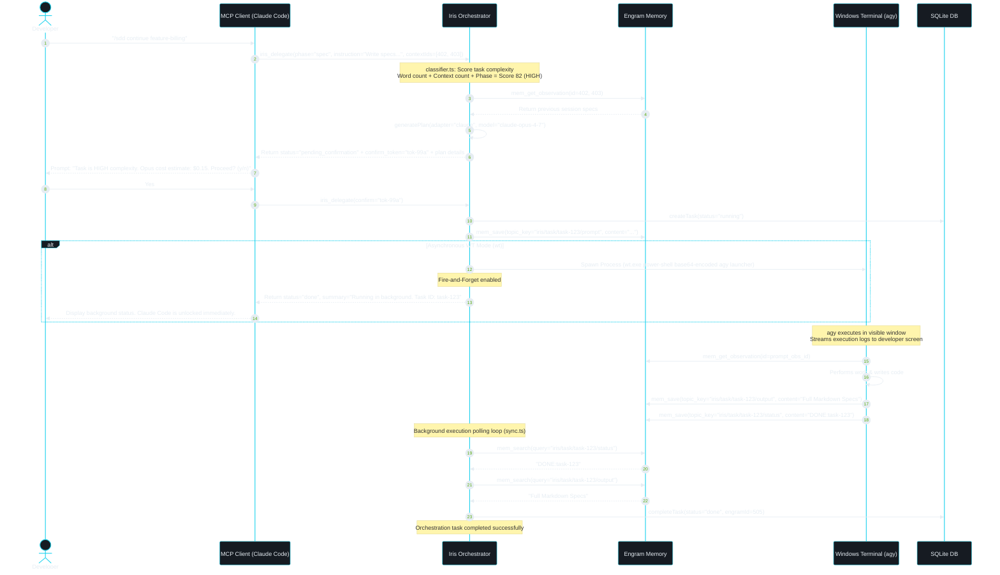
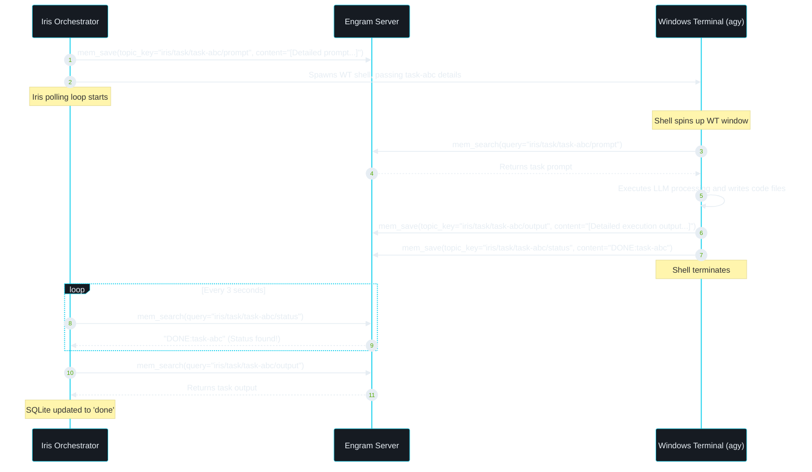

# Iris Developer Documentation

## 1. Overview
Iris is an enterprise-grade, multi-adapter Model Context Protocol (MCP) server built in TypeScript/Node.js. It acts as an intelligent orchestration bus that coordinates, delegates, and executes software development tasks across a swarm of specialized AI CLI engines: Claude, Antigravity, GitHub Copilot, and Codex.

### 1.1. Why Iris Exists
Modern AI-driven software development involves working with multiple specialized tools, each presenting unique benefits and trade-offs. However, developers face severe friction points when trying to weave these tools together:
1. **Context Fragmentation & Siloing:** CLI agents operate in isolation. Developers waste valuable hours copy-pasting context, environment state, and requirements between sessions.
2. **Context Loss & Compaction Limits:** Standard chat windows suffer from token bloat. Long conversations trigger context compaction, which discards or degrades critical architectural constraints.
3. **API Cost & Resource Waste:** Running high-complexity models (e.g., Claude Opus) on simple tasks like folder setup or file listing drains API budgets needlessly. Conversely, low-complexity models make structural errors when tasked with complex refactoring.
4. **AST Symbol Search Overhead:** CLI agents often waste thousands of tokens performing brute-force grepping and file scanning to locate class boundaries, method interfaces, or dependencies.
5. **No Unified Memory Store:** Prior to Iris, there was no centralized team memory bus. The file-system-bound `CONTEXT.md` pattern was easily corrupted, leaked into git history, and bloated local project directories.

Iris resolves these problems by acting as a **central orchestration bus**. It hooks directly into the **Model Context Protocol (MCP)**, analyzes the complexity of developer instructions using a multi-signal scoring classifier, routes workloads to the most optimal AI adapter, manages budget and circuit breaker fallbacks, and stores all outputs in **Engram**, a persistent, high-performance team memory database.

---

## 2. Architecture Overview
Iris sits between the primary MCP client (typically Claude Code or Claude Desktop) and the target CLI executables, integrating closely with Engram and a local SQLite database for task state tracking and budget metrics.

```mermaid
%%{init: {'theme': 'base', 'themeVariables': {'primaryColor': '#161b22', 'primaryTextColor': '#e6edf3', 'primaryBorderColor': '#22d3ee', 'lineColor': '#a855f7', 'secondaryColor': '#1e1e2e', 'tertiaryColor': '#0d2a2a', 'background': '#0d1117', 'clusterBkg': '#0a1628', 'clusterBorder': '#22d3ee'}}}%%
flowchart TD
    Client["MCP Client (Claude Code)"] -->|"/iris_delegate"| Iris["Iris MCP Server (TypeScript)"]
    
    subgraph Core ["Iris Core Orchestration Bus"]
        Iris --> Classifier["Complexity Classifier (classifier.ts)"]
        Iris --> Selector["Adapter Selector (selector.ts)"]
        Iris --> CB["Circuit Breaker (circuit-breaker.ts)"]
        Iris --> DB[("SQLite Store (db.ts)")]
    end

    subgraph Adapters ["Execution Adapters (adapters/)"]
        Selector -->|Low/Medium Fallback| Copilot["Copilot Adapter (copilot.ts)"]
        Selector -->|Pure Code Generation| Codex["Codex Adapter (codex.ts)"]
        Selector -->|Heavy Reasoning / Strategy| Claude["Claude Adapter (claude.ts)"]
        Selector -->|Semantic Search / Architecture| Antigravity["Antigravity Adapter (antigravity.ts)"]
    end

    subgraph Exec ["Runtime Execution Layer (executor/)"]
        Claude -->|execa| Subprocess["Subprocess Mode (Silent)"]
        Copilot -->|execa| Subprocess
        Codex -->|execa| Subprocess
        Antigravity -->|execa / wt| Terminal["Visible Terminal Mode (wt)"]
    end

    subgraph Memory ["Team Memory Bus"]
        Iris -->|mem_save / mem_search| Engram["Engram MCP Server"]
        Terminal -->|mem_save| Engram
        Subprocess -->|mem_save| Engram
    end

    style Client fill:#161b22,stroke:#22d3ee,stroke-width:2px;
    style Iris fill:#0a1628,stroke:#a855f7,stroke-width:2px;
    style Engram fill:#0d2a2a,stroke:#22d3ee,stroke-width:2px;
    style DB fill:#1e1e2e,stroke:#a855f7,stroke-width:2px;
```



---

## 3. Core Concepts

### 3.1. Phase-Based Workflow Delegation
Iris organizes task delegation around structured phases, primarily matching the **Spec-Driven Development (SDD)** lifecycle:
- **`explore`**: Conceptual code exploration and discovery.
- **`propose`**: Framing the intent, architectural changes, and scope of a feature.
- **`spec`**: Drafting behavioral specifications (using RFC 2119 imperatives).
- **`design`**: Detailing the technical design and system architecture (with UML/Mermaid diagrams).
- **`tasks`**: Breaking down the design into ordered, dependency-aware checklists.
- **`apply`**: Batched implementation of code deliverables.
- **`verify`**: Running test suites and validating results against the spec.
- **`report`**: Documenting completion and preparing changes for main integration.
- **`document`**: Writing technical developer guides, architecture manuals, and API contracts.

### 3.2. Execution Adapters
Iris hosts four specialized CLI adapters, wrapping them in a unified `IAdapter` interface:
1. **Claude CLI Adapter (`claude`):** Standard developer interface executing the `claude` CLI. Supports high-fidelity reasoning models (Haiku, Sonnet, Opus) and effort-level controls (`--effort`).
2. **Antigravity CLI Adapter (`antigravity`):** DeepMind's workspace runner, executing the `agy` binary. It specializes in large-scale context exploration, semantic directory traversal, and verification.
3. **GitHub Copilot CLI Adapter (`copilot`):** Uses the `gh copilot` CLI tool. Acts as a reliable fallback wrapper with standard OpenAI model bindings.
4. **Codex CLI Adapter (`codex`):** Built specifically for code execution and file generation. It is the primary workhorse during the `apply` phase.

### 3.3. Multi-Signal Complexity Classifier
Task complexity is not determined by mere guess-work. Iris runs a deterministic scoring engine evaluating four primary signals (scaled from 0 to 100 total points):
- **Signal 1: Scope of Changes (0-30 pts):** Measures the word count of the instruction. Short instructions yield lower scores, whereas dense developer specs score highly.
- **Signal 2: Context Size (0-30 pts):** Based on the number of active `contextIds` (Engram observations) attached to the task. Large context sets scale the score upward.
- **Signal 3: Architectural Impact (0-20 pts):** Highly weighted for the `design`, `apply`, and `spec` phases, or instructions containing architectural terms (e.g., *refactor*, *database*, *schema*, *pattern*, *interface*).
- **Signal 4: Dependency Resolution (0-20 pts):** Driven by keyword hits indicating external package modification or library setup (e.g., *npm*, *pip*, *package*, *library*, *integration*).

The total score maps to a `ComplexityLevel`:
- **LOW** (0-35 points): Handled by fast, high-efficiency models.
- **MEDIUM** (36-70 points): Routed to standard production models.
- **HIGH** (71-100 points): Triggers the **Two-Phase Commit** confirmation gate and routes to heavy reasoning engines.

### 3.4. Asynchronous Fire-and-Forget & Visible Terminal Execution
When executing long-running or high-complexity tasks using the `antigravity` adapter, Iris can launch a visible Windows Terminal (`wt`) window. This execution mode provides two key benefits:
1. **Transparency & User Control:** The developer can watch the AI agent stream its output, invoke tools, and execute commands in real-time, allowing manual cancellation if a loop occurs.
2. **Client Context Thinning (Fire-and-Forget):** Instead of keeping the parent MCP client waiting (which risks client-side timeouts), Iris registers the task as `running` and exits immediately, returning a thin summary block. The background process runs inside `wt` and updates Engram when done.

### 3.5. Engram IPC (Inter-Process Communication)
Iris eliminates the file-system-bound `CONTEXT.md` file entirely. All inter-agent communication, prompt seeding, and execution outputs pass through the **Engram IPC Protocol**:
- **Prompt Dispatch:** Iris stores the execution prompt in Engram under `iris/task/{taskId}/prompt`.
- **Status Signaling:** The background runner polls this prompt, executes the workload, and writes its final output to `iris/task/{taskId}/output`.
- **Completion Marker:** The runner registers completion by saving `"DONE:{taskId}"` to `iris/task/{taskId}/status`. The orchestrator polls this status key to resolve the task.

### 3.6. Resilient Circuit Breaker
To prevent cascading adapter failures (due to API outages, network limits, or auth loss), Iris maintains an in-memory `CircuitBreaker`.
- If an adapter fails **3 consecutive times**, its state transitions to **Open**.
- In the **Open** state, the adapter is locked out for a 5-minute timeout (`RESET_TIMEOUT_MS`). Any incoming requests are automatically diverted to the designated phase fallback adapter.
- After the timeout, the circuit enters **Half-Open** status, allowing a single test request through to check for recovery.

### 3.7. Token & Spending Budgets
Iris protects developer API budgets by storing adapter spend metrics in SQLite. Adapters can be configured with a `daily_budget_usd`. Once an adapter's spend exceeds this value, it is locked out, and Iris routes all tasks to the fallback chain.

---

## 4. Execution Flow
The sequence diagram below details a full `iris_delegate` invocation under **HIGH** complexity, showcasing the **Two-Phase Commit (2PC)** mechanism, context resolution from Engram, execution inside a Windows Terminal tab, and completion signaling.



## 5. Phase → Adapter Routing Table

The table below maps each development phase to its default primary adapter, fallback adapter, default model, and reasoning settings.

| SDD Phase | Primary Adapter | Fallback Adapter | Primary Model (Low / Med / High) | Effort / Reasoning Controls | Architectural Rationale |
| :--- | :--- | :--- | :--- | :--- | :--- |
| **`explore`** | `antigravity` | `claude` | Gemini 3.5 Flash / Gemini 3.5 Flash / Gemini 3.1 Pro | `n/a` (Driven by workspace search) | Gemini's large context window allows ingestion of entire code structures. |
| **`propose`** | `claude` | `antigravity` | Claude Haiku / Claude Sonnet / Claude Opus | `low` / `high` / `high` | Claude excels at understanding fuzzy requirements and drafting initial proposals. |
| **`spec`** | `claude` | `antigravity` | Claude Haiku / Claude Sonnet / Claude Opus | `low` / `high` / `high` | Rigorous architectural specs and RFC 2119 validation require Claude's strong logic. |
| **`design`** | `antigravity` | `claude` | Gemini 3.5 Flash / Gemini 3.5 Flash / Gemini 3.1 Pro | `n/a` | Gemini Pro writes highly accurate, extensive visual system blueprints in Mermaid format. |
| **`tasks`** | `claude` | `copilot` | Claude Haiku / Claude Sonnet / Claude Opus | `low` / `high` / `high` | Claude understands dependency management and splits plans into actionable tasks. |
| **`apply`** | `claude` | `codex` | Claude Haiku / Claude Sonnet / Claude Opus | `low` / `high` / `high` | Claude is the primary implementation driver; Codex serves as the specialized code fallback. |
| **`verify`** | `claude` | `antigravity` | Claude Haiku / Claude Sonnet / Claude Opus | `low` / `high` / `high` | High-fidelity reasoning is critical to matching actual outputs against spec test assertions. |
| **`report`** | `antigravity` | `claude` | Gemini 3.5 Flash / Gemini 3.5 Flash / Gemini 3.1 Pro | `n/a` | Gemini's structure mapping is perfect for aggregating changelogs and commit history. |
| **`document`** | `antigravity` | `claude` | Gemini 3.5 Flash / Gemini 3.5 Flash / Gemini 3.1 Pro | `n/a` | Gemini handles documentation synthesis and exports files directly to disk efficiently. |

---

## 6. Configuration

Iris reads and updates user configurations inside `~/.iris/config.json`. The configuration file manages execution modes, two-phase commit complexity gates, and adapter settings.

### 6.1. Config JSON Structure
```json
{
  "confirm_threshold": "high",
  "execution_mode": "terminal",
  "adapters": {
    "claude": {
      "enabled": true,
      "priority": 3,
      "daily_budget_usd": 5.0
    },
    "antigravity": {
      "enabled": true,
      "priority": 1,
      "daily_budget_usd": 0.0
    },
    "copilot": {
      "enabled": true,
      "priority": 2,
      "daily_budget_usd": 0.0
    },
    "codex": {
      "enabled": true,
      "priority": 2,
      "daily_budget_usd": 2.0
    }
  }
}
```

### 6.2. Configuration Parameters
- **`confirm_threshold`** (`"low" | "medium" | "high" | "never"`): The minimum complexity level required to halt task execution and prompt the user for confirmation (Two-Phase Commit).
- **`execution_mode`** (`"terminal" | "subprocess"`):
  - `"terminal"`: Spawns a visible Windows Terminal (`wt`) window for background adapters. Recommended for transparency.
  - `"subprocess"`: Spawns the CLI silently in the background via `execa`. Perfect for automation and CI/CD.
- **`enabled`** (`true | false`): Activates or deactivates the specific adapter.
- **`priority`** (`number`): The selection preference hierarchy. Lower priority values are selected first when multiple adapters support the same phase.
- **`daily_budget_usd`** (`number`): Daily spending limit in USD. Setting to `0.0` disables budget caps for that adapter.

---

## 7. Usage Examples

### 7.1. Example 1: `explore` Phase (Low Complexity)
Triggers a quick semantic scan of Odoo database models using the Antigravity adapter in the background.

```powershell
# In Claude Code
iris_delegate --phase explore --instruction "List all custom fields added to sale.order inside standard addons" --change odoo-cleanup
```

**JSON Request:**
```json
{
  "phase": "explore",
  "instruction": "List all custom fields added to sale.order inside standard addons",
  "change": "odoo-cleanup"
}
```

**Result Output:**
```json
{
  "taskId": "f9b699c2-55db-4412-a7d9-3990cb89c104",
  "adapter": "antigravity",
  "model": "Gemini 3.5 Flash (Medium)",
  "effort": "n/a",
  "complexity": "low",
  "status": "done",
  "engramId": 1024,
  "duration_ms": 14200,
  "summary": "Found 3 custom fields: x_studio_delivery_date, x_studio_payment_ref, x_studio_approval_status..."
}
```

---

### 7.2. Example 2: `design` Phase (Fire-and-Forget, Medium Complexity)
Delegates a complex diagramming task to Antigravity without holding the parent CLI agent context open.

```powershell
iris_delegate --phase design --instruction "Draft the database schema diagram for the token-vault encryption module" --change token-vault --fire_and_forget true
```

**Result Output:**
```json
{
  "taskId": "7c98031d-b844-42ea-a4df-22d7a22ea09e",
  "adapter": "antigravity",
  "model": "Gemini 3.5 Flash (High)",
  "effort": "n/a",
  "complexity": "medium",
  "status": "done",
  "summary": "Running in background. Check status with iris_task(\"7c98031d-b844-42ea-a4df-22d7a22ea09e\")"
}
```
*Note: A visible Windows Terminal window opens on the developer's screen showing Gemini generating the system schemas. The main Claude Code CLI is unlocked immediately.*

---

### 7.3. Example 3: `document` Phase (Medium Complexity with Disk Output)
Generates developer documentation and writes it directly to the target project path.

```powershell
iris_delegate --phase document --instruction "Create a comprehensive API guide for the token-vault module" --change token-vault --outputPath "C:\Development\vault\API_GUIDE.md"
```

**Result Output:**
```json
{
  "taskId": "3ab99a5e-bb12-42da-921a-28951da603b5",
  "adapter": "antigravity",
  "model": "Gemini 3.5 Flash (High)",
  "effort": "n/a",
  "complexity": "medium",
  "status": "done",
  "engramId": 1027,
  "duration_ms": 28900,
  "summary": "Successfully generated API documentation and saved directly to C:\\Development\\vault\\API_GUIDE.md"
}
```

---

### 7.4. Example 4: `apply` Phase (High Complexity, Two-Phase Commit)
Attempts to trigger a massive refactoring block of security keys. Because it scores as **HIGH complexity**, Iris holds execution and requests a confirmation.

```powershell
iris_delegate --phase apply --instruction "Refactor the vault authentication layer to support dynamic RSA key rotation and SQLite key retention" --change token-vault --contextIds 1027,1028
```

**Step 1: Request Gate Response:**
```json
{
  "taskId": "6bdf68fa-b5db-4b31-bc1b-2875924a858c",
  "adapter": "claude",
  "model": "claude-opus-4-7",
  "effort": "high",
  "complexity": "high",
  "status": "pending_confirmation",
  "plan": {
    "adapter": "claude",
    "model": "claude-opus-4-7",
    "effort": "high",
    "complexity": "high",
    "prompt": "Vault Auth RSA key rotation and Sqlite retention prompt context..."
  },
  "confirm_token": "63f8bbca-5544-4bd3-875f-3619a9e32a67"
}
```

**Step 2: Developer Confirms Execution:**
```powershell
iris_delegate --confirm "63f8bbca-5544-4bd3-875f-3619a9e32a67"
```

**Final Execution Response:**
```json
{
  "taskId": "6bdf68fa-b5db-4b31-bc1b-2875924a858c",
  "adapter": "claude",
  "model": "claude-opus-4-7",
  "effort": "high",
  "complexity": "high",
  "engramId": 1032,
  "duration_ms": 115000,
  "status": "done",
  "summary": "Implemented dynamic RSA key rotation in src/vault/auth.ts and set retention policies in SQLite db."
}
```

---

## 8. Integration with SDD (Spec-Driven Development)

Iris is engineered to serve as the unified backplane for **Spec-Driven Development (SDD)**:

```mermaid
%%{init: {'theme': 'base', 'themeVariables': {'primaryColor': '#161b22', 'primaryTextColor': '#e6edf3', 'primaryBorderColor': '#22d3ee', 'lineColor': '#a855f7', 'secondaryColor': '#1e1e2e', 'tertiaryColor': '#0d2a2a', 'background': '#0d1117', 'clusterBkg': '#0a1628', 'clusterBorder': '#22d3ee'}}}%%
flowchart LR
    init["1. sdd-init<br/>(antigravity)"] --> explore["2. sdd-explore<br/>(antigravity)"]
    explore --> propose["3. sdd-propose<br/>(claude)"]
    propose --> spec["4. sdd-spec<br/>(claude)"]
    spec --> design["5. sdd-design<br/>(antigravity)"]
    design --> tasks["6. sdd-tasks<br/>(claude)"]
    tasks --> apply["7. sdd-apply<br/>(claude/codex)"]
    apply --> verify["8. sdd-verify<br/>(claude)"]
    verify --> archive["9. sdd-archive<br/>(antigravity)"]

    style init fill:#161b22,stroke:#22d3ee
    style apply fill:#0d2a2a,stroke:#a855f7,stroke-width:2px
    style verify fill:#161b22,stroke:#22d3ee
```



### 8.1. SDD Flow Synergy
1. **Zero Cold Starts:** In standard setups, developers lose context during phase handoffs. Iris passes historical phase data forward. For example, during `sdd-design`, it pulls context IDs from the previous `sdd-spec` runs, reading inputs directly from Engram without relying on locally bloated folders.
2. **Strict Code Generation Controls (`sdd-apply`):** Code implementation is a high-liability task. During the implementation phase (`sdd-apply`), Iris routes the task to Codex or Claude, configuring Zod-based safety deliverables and ensuring generated files match specs strictly.
3. **Automated Verification (`sdd-verify`):** Iris processes test execution results in subprocess mode, parsing standard test outputs and using Gemini/Claude reasoning to identify and repair failing assertions automatically.
4. **Sub-Millisecond Search via CodeGraph:** Iris integrates with **CodeGraph** — an AST-based workspace search engine using tree-sitter. During exploration and design phases, CodeGraph provides instant symbol, class, and import boundary maps, reducing orchestration token usage by **~57%**.

---

## 9. Engram IPC Deep Dive

The Mermaid sequence below highlights how Iris, the target adapter executables, and Engram communicate using decoupled, asynchronous topic key polling.



### 9.1. Engram Key Conventions
To maintain structure across all engineering sessions, memory schemas inside Engram must match the following standard `topic_key` schemas:
- **Task Prompts:** `iris/task/{taskId}/prompt` (seeding commands and callback instructions).
- **Task Outputs:** `iris/task/{taskId}/output` (the final generated code, spec markdown, or design charts).
- **Task Status:** `iris/task/{taskId}/status` (contains `"DONE:{taskId}"` or `"FAILED:{taskId}"`).
- **Phase History Logs:** `iris/{project}/{change}/{phase}/{adapter}` (persistent global archive of design decisions and specification versions).

---
*End of Document. Written in compliance with Iris architecture, CodeGraph integrations, and Engram IPC patterns.*
