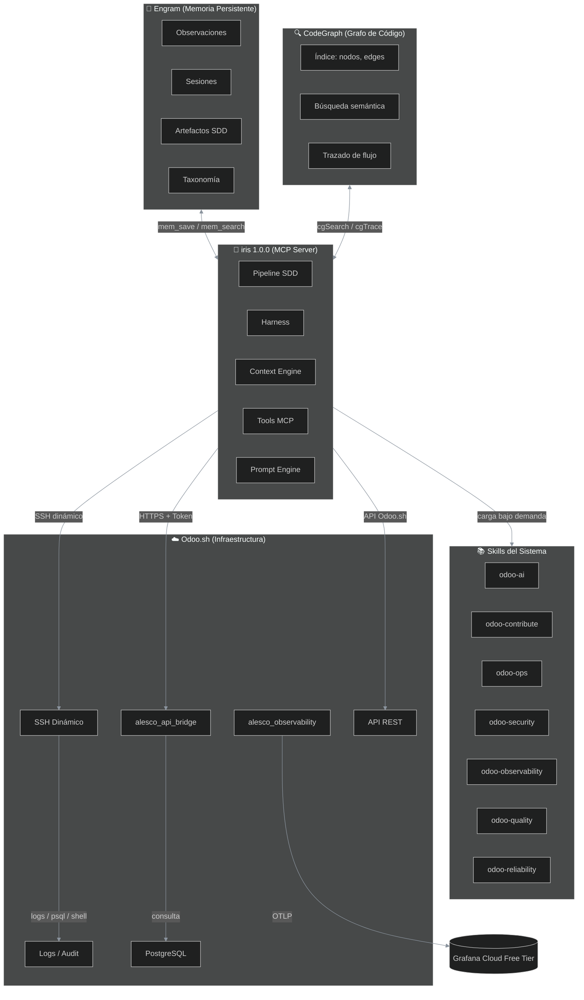
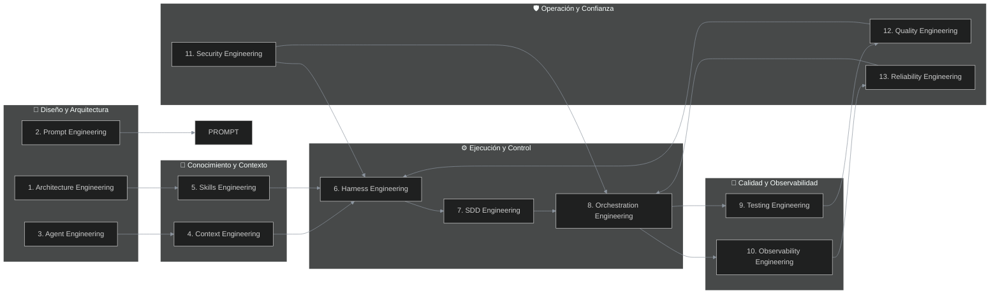
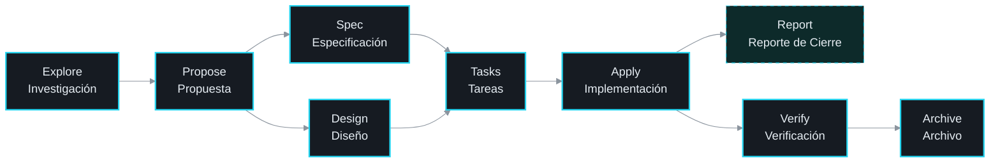
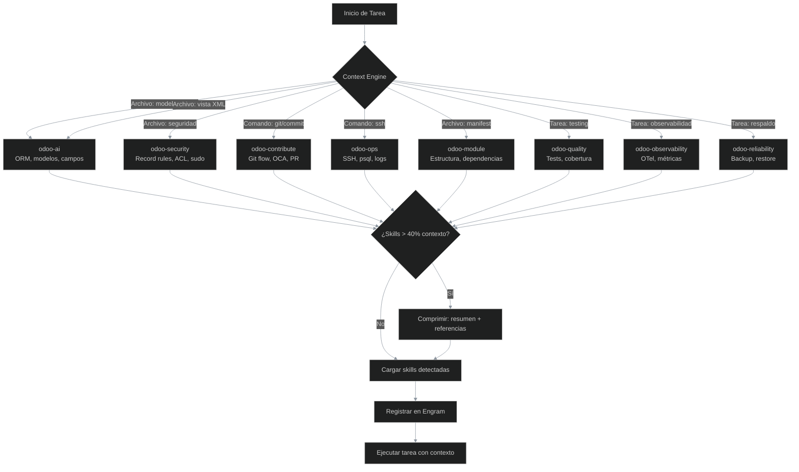
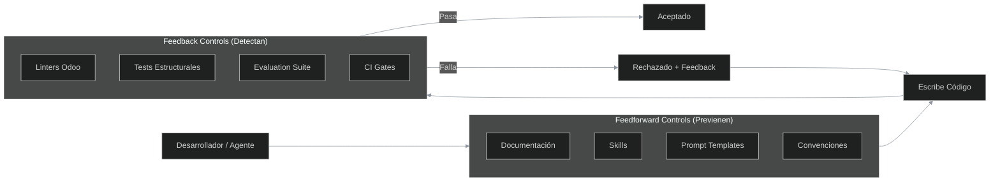
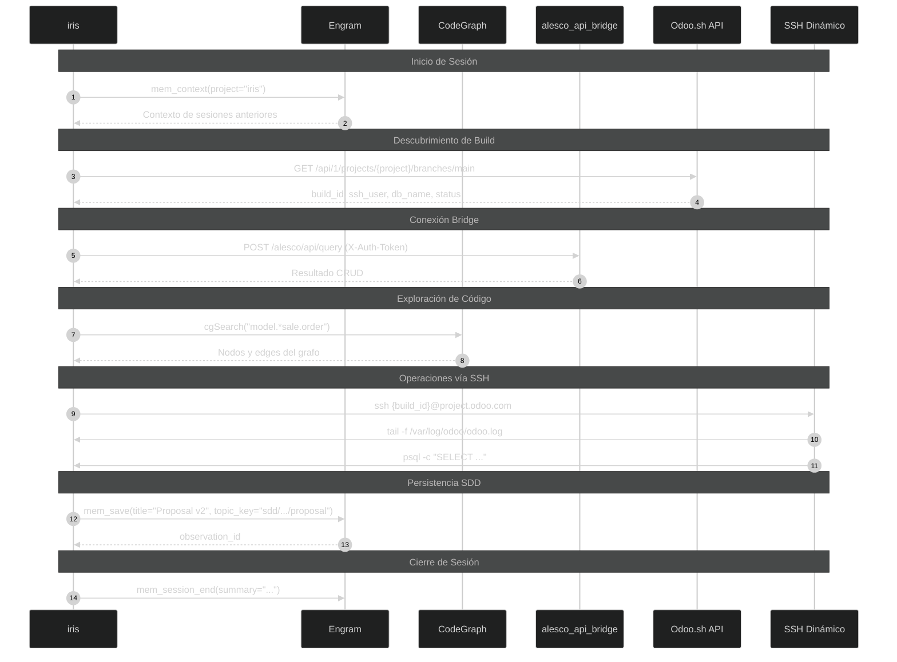
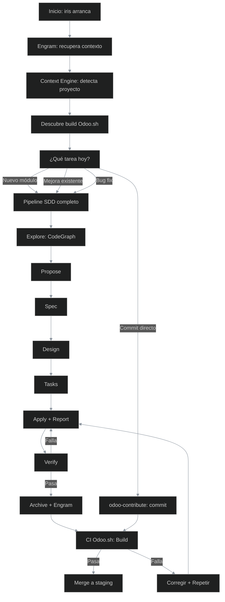
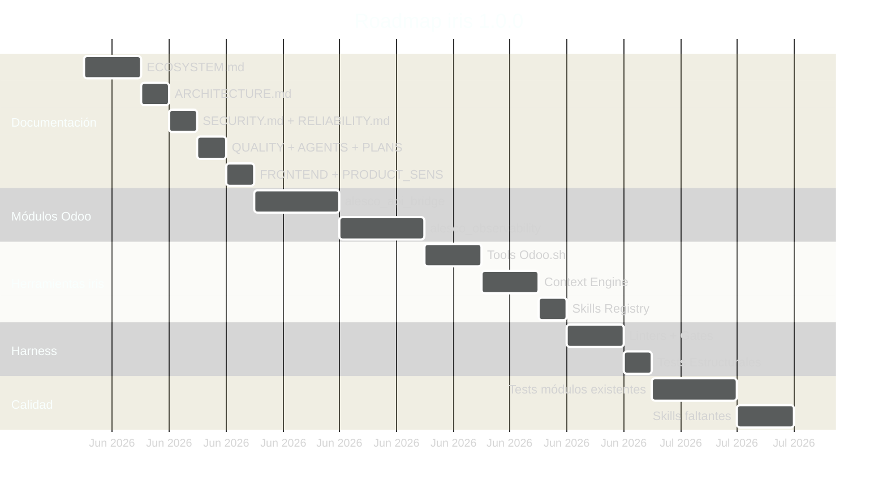

# iris — Ecosistema de Ingeniería Odoo

> **Versión:** 1.0.0  
> **Última actualización:** 2026-06-10  
> **Estado:** Documento maestro — define la arquitectura, componentes, ingenierías y flujos del ecosistema iris.  
> **Licencia:** Apache-2.0

---

## Índice

1. [Filosofía del Sistema](#1-filosofía-del-sistema)
2. [Mapa de Componentes](#2-mapa-de-componentes)
3. [Las 13 Ingenierías](#3-las-13-ingenierías)
4. [Pipeline SDD](#4-pipeline-sdd)
5. [Sistema de Skills](#5-sistema-de-skills)
6. [Harness de Enforcement](#6-harness-de-enforcement)
7. [Conectividad y Sincronización](#7-conectividad-y-sincronización)
8. [Arquitectura de Seguridad](#8-arquitectura-de-seguridad)
9. [Análisis de Costos](#9-análisis-de-costos)
10. [Flujo de Trabajo Diario](#10-flujo-de-trabajo-diario)
11. [Roadmap](#11-roadmap)

---

## 1. Filosofía del Sistema

### Principios Rectores

| # | Principio | Significado |
|---|-----------|-------------|
| 1 | **Odoo-First** | Todo el ecosistema está diseñado para desarrollo Odoo enterprise. Cada decisión técnica prioriza el ecosistema Odoo (ORM, módulos, Odoo.sh, OCA). |
| 2 | **Costo Cero Operativo** | Ningún componente del ecosistema requiere suscripción de pago. Odoo.sh, OTel gratis, Grafana Cloud free tier, skills markdown, herramientas open source. |
| 3 | **Harness > Modelo** | El 98% de la confiabilidad vive en el código alrededor del LLM. El harness (linters, tests estructurales, CI gates) es más importante que el modelo de AI. |
| 4 | **Context Engineering como Disciplina Central** | Lo que entra al contexto del agente determina todo. Skills cargadas bajo demanda, contexto mínimo viable, comprobación de calidad. |
| 5 | **Eval-Driven Development** | Sin medición no hay mejora. Cada fase del pipeline SDD tiene criterios de evaluación medibles. Sin evals no se avanza. |
| 6 | **Seguridad Estructural** | Las reglas de seguridad se aplican en el harness (código), no en prompts. El modelo puede ignorar instrucciones textuales; el código no. |
| 7 | **Versionado Semver** | Solo `iris`. Nada de "v2", "v3". Versionado semver: `1.0.0`, `1.1.0`, `2.0.0`. |
| 8 | **Documentación Primero** | No se escribe código hasta que el diseño está documentado y aprobado. Cada componente tiene ECOSYSTEM.md → ARCHITECTURE.md → SDD. |

---

## 2. Mapa de Componentes

### Diagrama General del Ecosistema



*El ecosistema se organiza en 5 capas. **Engram** provee memoria persistente entre sesiones (observaciones, artefactos SDD, taxonomía). **CodeGraph** indexa el código en un grafo navegable para exploración sin grep. **iris** es el orquestador central que conecta todo: ejecuta el pipeline SDD, aplica el harness, detecta contexto, carga skills y expone tools MCP. **Las Skills** son conocimiento markdown cargado bajo demanda según el contexto detectado. **Odoo.sh** es la infraestructura destino donde viven los módulos Odoo (alesco_api_bridge, alesco_observability) a los que iris accede vía HTTPS con token, SSH dinámico, o API REST.*

### Tabla de Componentes

| Componente | Rol | Tecnología | Conexión con iris |
|---|---|---|---|
| **iris** | Orquestador MCP | TypeScript, Node.js | — |
| **Engram** | Memoria persistente | MCP service (`mem_*`) | `engram_mem_save/search/get` |
| **CodeGraph** | Grafo de código | MCP service (`cg*`) | `cgSearch/cgTrace/cgExplore` |
| **alesco_api_bridge** | Bridge REST Odoo | Odoo 18 Python | HTTPS + token auth |
| **alesco_observability** | OpenTelemetry Odoo | Odoo 18 + OTel | OTLP export + SSH logs |
| **odoo-ai** | Skill Odoo core | Markdown | Carga por Context Engine |
| **odoo-contribute** | Skill VCS/OCA | Markdown | Carga por Context Engine |
| **odoo-ops** | Skill operaciones | Markdown | Carga por Context Engine |
| **odoo-security** | Skill seguridad | Markdown | Carga por Context Engine |
| **Odoo.sh** | Hosting Odoo | Odoo.sh platform | HTTPS + SSH + API |

---

## 3. Las 13 Ingenierías

### Mapa de Ingenierías y Relaciones



*Las 13 ingenierías se organizan en 5 capas conceptuales. La **Capa 1 (Diseño)** define la arquitectura, los prompts y los agentes. La **Capa 2 (Conocimiento)** gestiona el contexto y las skills que se cargan bajo demanda. La **Capa 3 (Ejecución)** es el núcleo operativo: harness (enforcement), pipeline SDD y orquestación. La **Capa 4 (Calidad)** cubre testing y observabilidad. La **Capa 5 (Operación)** asegura seguridad, calidad y confiabilidad en producción. Las flechas muestran cómo cada capa alimenta y valida a la siguiente.*

### Detalle por Ingeniería

| # | Ingeniería | Definición | Deliverable | Skill Asociada | Regla de Harness |
|---|---|---|---|---|---|
| 1 | **Architecture Engineering** | Diseño estructural del ecosistema | `ECOSYSTEM.md`, `ARCHITECTURE.md` | — | ADR obligatorio por cambio arquitectónico |
| 2 | **Prompt Engineering** | Diseño de instrucciones para agentes AI | `prompts/sdd-*.md` | odoo-ai | Template validation: roles, XML tags, few-shot |
| 3 | **Agent Engineering** | Diseño de sub-agentes especializados Odoo | Especificación de sub-agentes | odoo-ai | Sub-agente debe tener alcance definido |
| 4 | **Context Engineering** | Gestión de contexto para agentes | Context Engine en iris | odoo-ai | Skills cargadas no exceden 40% del contexto |
| 5 | **Skills Engineering** | Catálogo de conocimiento cargable | `SKILLS/` markdowns | — | Cada skill tiene SKILL.md + references |
| 6 | **Harness Engineering** | Sistema de enforcement mecánico | Linters, tests estructurales, CI gates | odoo-contribute | Fase sin validación → pipeline rechaza |
| 7 | **SDD Engineering** | Pipeline de desarrollo por fases | Pipeline explore→propose→...→archive | odoo-contribute | DAG enforcement: no saltar fases |
| 8 | **Orchestration Engineering** | Orquestador que decide qué hacer | `delegate.ts`, `selector.ts`, `classifier.ts` | — | Cada tool debe tener fallback definido |
| 9 | **Testing Engineering** | Tests para módulos Odoo | `tests/` en cada módulo Odoo | odoo-quality | Cobertura mínima > 80%, TransactionCase |
| 10 | **Observability Engineering** | Trazas, métricas y logs | `alesco_observability` + Grafana | odoo-observability | Toda request HTTP tiene trace OTel |
| 11 | **Security Engineering** | Protección contra accesos no autorizados | Auditoría record rules, ACL, sudo() | odoo-security | `ir.model.access` obligatorio por modelo nuevo |
| 12 | **Quality Engineering** | Medición de calidad Odoo | Scorecards OCA, reportes | odoo-quality | CI gate bloquea si score < umbral |
| 13 | **Reliability Engineering** | Resiliencia y recuperación | Retry, circuit breaker, backup/restore | odoo-reliability | Backup automático diario verificado |

---

## 4. Pipeline SDD

### Diagrama del Pipeline



*El pipeline SDD consta de 8 fases secuenciales. **Explore** investiga el problema usando CodeGraph exclusivamente. **Propose** define alcance, entregables y riesgos. **Spec** escribe especificaciones formales con escenarios Given/When/Then. **Design** documenta decisiones técnicas y ADRs. **Tasks** desglosa en tareas ordenadas. **Apply** implementa cada tarea y genera el **Report** (reporte de cierre). **Verify** valida contra la spec. **Archive** cierra el cambio y sincroniza lecciones aprendidas a Engram. Las fases Spec y Design alimentan Tasks en paralelo.*

### Descripción de Fases

| Fase | Entrada | Salida | Validación | Herramientas |
|---|---|---|---|---|
| **Explore** | Idea, problema | Reporte de exploración | CodeGraph obligatorio (nunca grep/read) | CodeGraph (`cgSearch`, `cgTrace`, `cgExplore`) |
| **Propose** | Reporte explore | Propuesta con alcance | Criterios de éxito definidos | Engram (propuesta guardada) |
| **Spec** | Propuesta | Especificaciones Given/When/Then | Escenarios cubren todos los casos | Prompts SDD |
| **Design** | Propuesta | ADRs, diagramas, interfaces | Cada decisión tiene alternativa considerada | Mermaid, ADR template |
| **Tasks** | Spec + Design | Checklist ordenado | Sin dependencias circulares | Task template |
| **Apply** | Tasks | Código implementado + Reporte | Tasks completadas 100% | Skills, Context Engine |
| **Verify** | Spec + Tasks | Reporte de verificación | Spec matches implementación | Eval suite |
| **Archive** | Todos los artifacts | Artefactos archivados + lecciones | Engram actualizado, branch synced | Engram (`mem_save`) |

### Regla de Oro del Pipeline

> **No se puede saltar una fase.** El harness (ver sección 6) valida que el artifact de la fase anterior exista antes de permitir avanzar. Si `proposal` no existe, `spec` no puede comenzar. Si `spec` no existe, `tasks` no puede comenzar. Esta validación es mecánica, no por prompt.

---

## 5. Sistema de Skills

### Diagrama de Detección y Carga



*El **Context Engine** es el cerebro del sistema de skills. Detecta automáticamente qué skills cargar basándose en: (1) el tipo de archivo abierto en el editor, (2) el comando ejecutado, (3) la tarea SDD en curso. Si las skills detectadas ocuparían más del 40% del contexto disponible, se activa la compresión: se genera un resumen ejecutivo y se guardan las referencias completas para carga bajo demanda. Las skills cargadas se registran en Engram para trazabilidad.*

### Catálogo de Skills

| Skill | Propósito | Fuente | ¿Existe? |
|---|---|---|---|
| `odoo-ai` | ORM, modelos, vistas, seguridad, testing — hub central Odoo | `~/.claude/skills/odoo-ai/` | ✅ 235 líneas + RULES.md + plugins |
| `odoo-contribute` | VCS, git, OCA, Docker, CI/CD | `~/.claude/skills/odoo-contribute/` | ✅ SKILL.md + plugins (odoo-ops, etc.) |
| `odoo-ops` | SSH, psql, Odoo.sh operations | Plugin de odoo-contribute | ✅ |
| `odoo-security` | Record rules, ACL, sudo(), SQL injection | `~/.claude/skills/.../odoo-security/` | ✅ |
| `odoo-module` | Estructura de módulos, manifest | Plugin de odoo-contribute | ✅ |
| `odoo-quality` | Tests Odoo, OCA compliance | ❌ Por crear en `SKILLS/` | 🔶 |
| `odoo-observability` | OpenTelemetry, logs, métricas | ❌ Por crear en `SKILLS/` | 🔶 |
| `odoo-reliability` | Backups, upgrades, recovery | ❌ Por crear en `SKILLS/` | 🔶 |

### Formato de una Skill

Cada skill en `SKILLS/` sigue esta estructura:

```
SKILLS/
├── odoo-quality/
│   ├── SKILL.md           ← Instrucciones para el agente
│   ├── references/        ← Documentación de referencia
│   │   ├── oca-testing.md
│   │   └── odoo-test-api.md
│   └── examples/          ← Ejemplos prácticos
│       ├── test_sale_order.py
│       └── test_security.py
```

El `SKILL.md` contiene:
- **Propósito**: qué problema resuelve
- **Cuándo cargarla**: condiciones de activación
- **Instrucciones**: pasos concretos para el agente
- **Ejemplos**: patrones de código
- **Anti-patrones**: qué evitar
- **Referencias**: enlaces a documentación externa

---

## 6. Harness de Enforcement

### Diagrama del Sistema de Enforcement



*El harness tiene dos tipos de controles. Los **Feedforward Controls** previenen errores antes de que ocurran: documentación clara, skills cargadas, prompts bien diseñados, convenciones explícitas. Los **Feedback Controls** detectan errores después de ocurridos: linters específicos de Odoo (validan manifest, seguridad, naming), tests estructurales (verifican que existan archivos obligatorios), evaluation suite (evalúa calidad de respuestas del agente), y CI gates (bloquean merges que no pasen validación). El ciclo se repite hasta que el código pasa todas las validaciones.*

### Reglas del Harness

| # | Regla | Tipo | ¿Qué valida? | Consecuencia si falla |
|---|---|---|---|---|
| 1 | **SDD Phase Order** | Feedback | El artifact de la fase anterior existe | Pipeline rechaza el avance |
| 2 | **CodeGraph Only Explore** | Feedforward | Explore no usa grep/read | Explore se rechaza automáticamente |
| 3 | **Module Manifest** | Feedback | `__manifest__.py` tiene todos los campos obligatorios | CI gate bloquea |
| 4 | **Security Required** | Feedback | Todo modelo nuevo tiene `ir.model.access.csv` | CI gate bloquea |
| 5 | **Naming OCA** | Feedback | Modelos, campos y métodos siguen OCA naming | Linter advierte + CI gate alerta |
| 6 | **Test Coverage** | Feedback | Módulo nuevo tiene test con cobertura > 80% | CI gate bloquea |
| 7 | **Context Budget** | Feedforward | Skills cargadas no exceden 40% del contexto | Compresión automática |
| 8 | **Engram Persistence** | Feedback | Toda fase SDD guarda artifact en Engram | Pipeline advierte antes de continuar |
| 9 | **Token Auth** | Feedforward | `alesco_api_bridge` requiere token configurable | Módulo no se instala sin token |
| 10 | **SSL Required** | Feedforward | Comunicación iris→bridge solo por HTTPS | Conexión rechazada |

---

## 7. Conectividad y Sincronización

### Diagrama de Conexiones



*El flujo de conexión completo inicia con iris recuperando el contexto de sesiones anteriores desde Engram. Luego descubre dinámicamente el build actual de Odoo.sh consultando su API REST — esto resuelve el problema del build_id cambiante. Una vez descubierta la URL, iris se conecta a alesco_api_bridge vía HTTPS con autenticación por token para operaciones CRUD. Para exploración de código, usa CodeGraph exclusivamente. Para operaciones de infraestructura (logs, psql, shell), usa SSH dinámico. Cada fase del pipeline SDD persiste sus artifacts en Engram. Al finalizar la sesión, se guarda un resumen en Engram para que la próxima sesión continúe desde donde se quedó.*

### Protocolos de Conexión

| Conexión | Protocolo | Puerto | Autenticación | Dinámica |
|---|---|---|---|---|
| iris → alesco_api_bridge | HTTPS | 443 | Token (`X-Auth-Token`) | URL descubierta vía API Odoo.sh |
| iris → Odoo.sh API | HTTPS | 443 | Bearer token | Fija (`www.odoo.sh`) |
| iris → SSH | SSH | 22 | Llave SSH | Build ID consultado cada vez |
| iris → Engram | MCP | Local | Local | Fija (local) |
| iris → CodeGraph | MCP | Local | Local | Fija (local) |
| alesco_observability → Grafana | OTLP | 4317/4318 | API key | Fija |

### Sincronización de Estado

```
Evento                              → Acción de Sincronización
─────────────────────────────────────────────────────────────────
Inicio de sesión iris               → Engram: recuperar contexto
    ↓                                    
Cambio de build Odoo.sh             → iris: rediscovery automático
    ↓
Fase SDD completada                 → Engram: mem_save artifact
    ↓
Skill actualizada                   → Skill Registry: reload
    ↓
Módulo Odoo instalado               → Bridge: endpoint disponible
    ↓
Error de conexión bridge             → iris: retry + rediscovery
    ↓
Fin de sesión                       → Engram: session summary
```

*Cada evento del ecosistema dispara una acción de sincronización automática. No hay estado manual que mantener. La regla es: **ningún componente guarda estado local que no esté respaldado en Engram**.*

---

## 8. Arquitectura de Seguridad

### Diagrama de Seguridad por Capas

```mermaid
%%{init: {'theme': 'dark', 'themeVariables': {'primaryColor': '#1f6feb', 'primaryTextColor': '#ffffff', 'primaryBorderColor': '#22d3ee', 'lineColor': '#8b949e'}}}%%
flowchart TD
    subgraph L1 ["Capa 1: Transporte"]
        HTTPS[HTTPS / TLS]
        SSH[SSH Key Auth]
    end
    
    subgraph L2 ["Capa 2: Autenticación"]
        TOKEN[Token Bridge]
        API_KEY[API Key Odoo.sh]
        SSH_KEY[Llave SSH]
    end
    
    subgraph L3 ["Capa 3: Autorización"]
        ACL[ir.model.access]
        RULES[ir.rule Record Rules]
        FIELD[Field-level Permissions]
    end
    
    subgraph L4 ["Capa 4: Auditoría"]
        AUDIT[Audit Logs Odoo.sh]
        LOGS[Logs de Acceso]
        TRACES[Traces OTel]
    end
    
    subgraph L5 ["Capa 5: Harness"]
        LINT_SEC[Security Linter]
        SUDO_AUDIT[Auditoría sudo()]
        SAFE_EVAL[safe_eval Validation]
    end

    L1 --> L2
    L2 --> L3
    L3 --> L4
    L4 --> L5
```

*La seguridad se implementa en 5 capas. **Capa 1 (Transporte)**: toda comunicación usa HTTPS/TLS o SSH con llave. **Capa 2 (Autenticación)**: token configurable para el bridge, API key para Odoo.sh, llave SSH para conexión remota. **Capa 3 (Autorización)**: los permisos de Odoo (ir.model.access, ir.rule, field-level) controlan qué datos puede leer/escribir cada usuario. **Capa 4 (Auditoría)**: Odoo.sh registra todos los accesos, logs y traces OTel permiten reconstruir cualquier operación. **Capa 5 (Harness)**: linters de seguridad, auditoría de sudo() y validación de safe_eval garantizan que el código cumple con las políticas antes de llegar a producción. La regla fundamental: **los permisos se aplican en el código, no en prompts.***

### Políticas de Seguridad

| Política | Descripción | Responsable |
|---|---|---|
| **Token Bridge** | Token configurable en `ir.config_parameter`, rotable periódicamente | Administrador Odoo |
| **HTTPS Obligatorio** | Toda comunicación entre iris y Odoo.sh usa HTTPS | Harness |
| **Mínimo Privilegio** | Cada usuario/agente tiene solo los permisos necesarios | Arquitecto |
| **Auditoría de Accesos** | Odoo.sh audit logs + logs de aplicación monitoreados | Operaciones |
| **Seguridad en Código** | `ir.model.access` obligatorio por modelo nuevo; `sudo()` solo en métodos marcados | Harness (linter) |
| **safe_eval Seguro** | Server actions usan solo builtins permitidos; validación automática | Harness |

---

## 9. Análisis de Costos

| Componente | Costo | Detalle |
|---|---|---|
| **iris** (MCP Server) | $0 | Open source, corre localmente |
| **Engram** (Memoria) | $0 | Incluido en OpenCode/Claude |
| **CodeGraph** (Grafo) | $0 | Incluido en el entorno |
| **alesco_api_bridge** (Módulo Odoo) | $0 | Módulo Odoo propio, código abierto |
| **alesco_observability** (Módulo Odoo) | $0 | Basado en `opentelemetry-distro-odoo` (Apache-2.0, gratis) |
| **Odoo.sh** (Hosting) | Incluido | Ya contratado por el proyecto |
| **Grafana Cloud Free Tier** | $0 | 10k series, 14 días retención, 3 usuarios |
| **Skills Markdown** | $0 | Solo archivos de texto |
| **Documentación** | $0 | Solo archivos markdown |
| **OpenTelemetry Python** | $0 | `opentelemetry-distro-odoo` (Apache-2.0) |
| **PostgreSQL pg_stat_statements** | $0 | Incluido en PostgreSQL |
| **dkn_otel** | ❌ BLOQUEADO | $24.99/mes, OPL-1 — prohibido por ADR-005. Usar `opentelemetry-distro-odoo` |

**Total operativo mensual: $0 USD.**

Nota: Rachel invirtió en Cloudflare para exponer el bridge a Internet externo. Con iris, el bridge solo necesita ser accesible para iris (local o mediante la red de Odoo.sh). No se requiere Cloudflare.

---

## 10. Flujo de Trabajo Diario

### Diagrama del Ciclo de Desarrollo



*El ciclo de desarrollo diario comienza con iris recuperando el contexto de Engram y descubriendo dinámicamente el build activo de Odoo.sh. Según el tipo de tarea, se inicia el pipeline SDD completo o se usa una ruta directa. Cada fase del pipeline valida contra el harness antes de avanzar. Al completar verify, se envía a CI en Odoo.sh. Si el build falla, se corrige y repite. Si pasa, se mergea a staging.*

### Guía Rápida

| Situación | Comando / Acción | Skills que se cargan |
|---|---|---|
| Iniciar nuevo módulo Odoo | `iris> sdd-ff alesco_api_bridge` | odoo-ai, odoo-module, odoo-security |
| Revisar logs de Odoo.sh | `iris> tool: odoo-logs` | odoo-ops |
| Auditoría de seguridad | `iris> tool: odoo-security-audit` | odoo-security |
| Agregar tests a módulo | `iris> tool: odoo-generate-tests` | odoo-quality |
| Ver estado de builds | `iris> tool: odoo-build-status` | odoo-ops |
| Commit de cambios | `iris> tool: odoo-commit` | odoo-contribute |
| Explorar código base | `iris> sdd-explore <tema>` | odoo-ai, CodeGraph |

---

## 11. Roadmap

### Diagrama de Tiempos



*El roadmap estimado para iris 1.0.0. La **Fase 1 (Documentación)** establece el plano maestro del ecosistema. La **Fase 2 (Módulos Odoo)** construye alesco_api_bridge (refactor del bridge de Rachel) y alesco_observability (OpenTelemetry gratis). La **Fase 3 (Herramientas iris)** implementa los tools de Odoo.sh, el Context Engine y el Skills Registry. La **Fase 4 (Harness)** implementa linters, CI gates y tests estructurales. La **Fase 5 (Calidad)** agrega tests a módulos existentes y crea las skills faltantes. Cada fase produce artifacts SDD verificables.*

### Orden de Implementación

| Orden | Componente | Depende de | SDD Change Name |
|---|---|---|---|
| 1 | `alesco_api_bridge` | Documentación aprobada | `sdd/alesco-api-bridge` |
| 2 | `alesco_observability` | Documentación aprobada | `sdd/alesco-observability` |
| 3 | Tools Odoo.sh en iris | Bridge funcional | `sdd/odoo-sh-tools` |
| 4 | Context Engine | Tools funcionando | `sdd/context-engine` |
| 5 | Skills Registry | Context Engine | `sdd/skills-registry` |
| 6 | Harness (linters, gates) | Skills Registry | `sdd/harness` |
| 7 | Tests para módulos existentes | Harness | `sdd/module-tests` |
| 8 | Skills faltantes | Skills Registry | `sdd/missing-skills` |

---

## Apéndice A: Convenciones del Proyecto

### Nombrado

- **Proyecto**: `iris` (minúsculas, sin "v2", "v3", etc.)
- **Módulos Odoo**: `alesco_*` (prefijo alesco, snake_case)
- **Skills**: `odoo-*` (prefijo odoo, kebab-case)
- **Documentos**: `UPPERCASE.md` (SCREAMING_CASE)
- **Versiones**: Semver estricto (`1.0.0`, `1.1.0`, `2.0.0`)

### Estructura de Directorios

```
iris/
├── docs/                    ← Documentación complementaria (diagramas, SDD)
│   └── diagrams/            ← Diagramas Excalidraw
├── *.md (raíz)              ← Documentos del ecosistema
│   ├── ECOSYSTEM.md         ← Documento maestro
│   ├── ARCHITECTURE.md      ← Arquitectura detallada
│   ├── SECURITY.md          ← Seguridad
│   ├── RELIABILITY.md       ← Confiabilidad
│   ├── QUALITY_SCORE.md     ← Calidad
│   ├── AGENTS.md            ← Guía de agentes
│   ├── PLANS.md             ← Roadmap
│   ├── FRONTEND.md          ← Frontend Odoo
│   ├── PRODUCT_SENS.md      ← Sensibilidad de producto
│   ├── CONNECTIVITY.md      ← Matriz de conectividad
│   └── RECIPROCAL_APPRENTICESHIP.md ← Metodología pedagógica
├── SKILLS/                  ← Skills del sistema
│   ├── odoo-quality/
│   ├── odoo-observability/
│   └── odoo-reliability/
├── prompts/                 ← Templates SDD
├── src/                     ← Código de iris
└── modules/                 ← Módulos Odoo (alesco_*)
```

---

*Este documento es el plano maestro del ecosistema iris. Cualquier cambio a este documento requiere una propuesta SDD (explore → propose → spec) y aprobación explícita. Las decisiones técnicas registradas aquí son vinculantes para todo el desarrollo posterior.*
