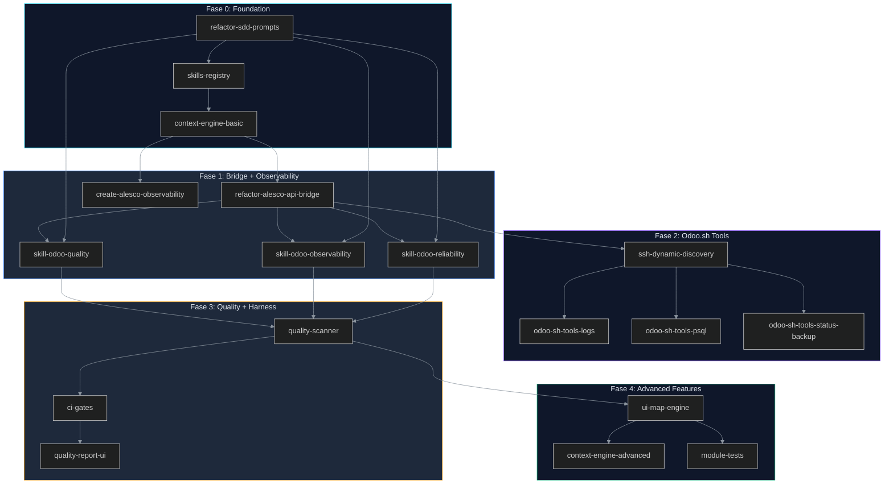
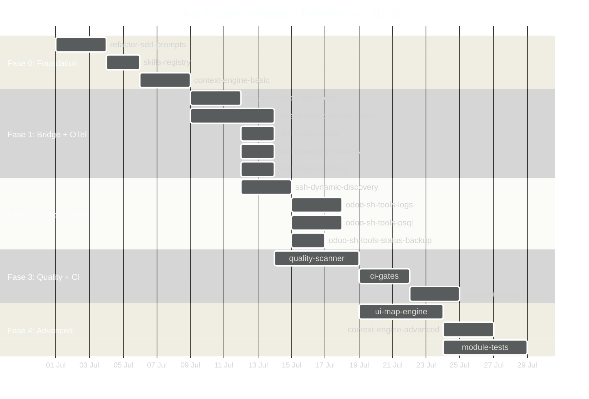

# PLANS.md — Plan de Implementación del Ecosistema iris

> **Versión:** 1.0.0  
> **Última actualización:** 2026-06-10  
> **Estado:** Documento maestro de implementación — define el orden, dependencias, tickets y cronograma del ecosistema iris.  
> **Depende de:** `ECOSYSTEM.md`, `ARCHITECTURE.md`, `CONNECTIVITY.md`, `RECIPROCAL_APPRENTICESHIP.md`, `SECURITY.md`, `RELIABILITY.md`  
> **Ingeniería relacionada:** SDD Engineering (7), Orchestration Engineering (8), Quality Engineering (12)

---

## Índice

1. [Quick Start — Primer Paso Recomendado](#1-quick-start--primer-paso-recomendado)
2. [Implementation Philosophy](#2-implementation-philosophy)
3. [Dependency Map](#3-dependency-map)
4. [Phase Breakdown](#4-phase-breakdown)
5. [Timeline — Gantt Chart](#5-timeline--gantt-chart)
6. [Ticket Template](#6-ticket-template)
7. [Cost Verification](#7-cost-verification)
8. [References](#8-references)

---

## 1. Quick Start — Primer Paso Recomendado

```
1. git checkout -b chore/refactor-sdd-prompts
2. iris> sdd-propose refactor-sdd-prompts
3. Implementar learning objective en cada prompt template
4. git commit -m "refactor(prompts): integrate Reciprocal Apprenticeship methodology"
5. git push
6. iris> sdd-continue skills-registry
```

**Justificación:** Los prompts SDD (`prompts/sdd-*.md`) son el punto de entrada de todo el pipeline. Sin prompts que implementen Reciprocal Apprenticeship, ninguna fase SDD puede producir código con valor pedagógico. Todas las fases siguientes dependen de esto.

---

## 2. Implementation Philosophy

### 2.1 Reciprocal Apprenticeship como Principio Rector

Cada tarea de implementación sigue el modelo definido en `RECIPROCAL_APPRENTICESHIP.md`: el desarrollador aprende mientras construye. No es "build this" — es "build this AND learn this."

### 2.2 Reglas de Implementación

| # | Regla | Fundamento |
|---|-------|------------|
| 1 | **Cada SDD ticket incluye un Learning Objective** | `RECIPROCAL_APPRENTICESHIP.md` §5 — toda fase SDD se enriquece con una dimensión de aprendizaje |
| 2 | **Never hardcode.** Every URL, token, build_id, port, domain is configurable or auto-discovered | `ARCHITECTURE.md` ADR-006 — SSH dinámico, `CONNECTIVITY.md` §6 — dependencias |
| 3 | **Costo Cero Operativo.** Ningún componente requiere suscripción paga. `dkn_otel` ($24.99) prohibido. Usar `opentelemetry-distro-odoo` (Apache-2.0, gratis) | `ECOSYSTEM.md` §9 — Análisis de Costos, `ARCHITECTURE.md` ADR-005 |
| 4 | **Documentación > Código.** No se implementa sin spec aprobada. Cada componente se documenta antes de codificar | `ECOSYSTEM.md` §1 — Principio 8 |
| 5 | **Harness > Modelo.** El 98% de la confiabilidad vive en el código alrededor del LLM. Linters, tests estructurales, CI gates | `ECOSYSTEM.md` §6 — Harness de Enforcement |
| 6 | **Engram es la única fuente de verdad.** iris no guarda estado local. Toda fase SDD persiste su artifact en Engram | `ARCHITECTURE.md` ADR-002 |
| 7 | **CodeGraph exclusivo para exploración.** Prohibido grep/read en fase Explore | `ARCHITECTURE.md` ADR-003 |
| 8 | **Seguridad en código, no en prompts.** `ir.model.access.csv` obligatorio por modelo nuevo. `sudo()` requiere comentario justificativo | `SECURITY.md` §1 — Principio 1 |

### 2.3 Thresholds de Calidad por Dimensión

Cada ticket debe superar estos thresholds en el quality scanner (ver `QUALITY_SCORE.md` §2). Los thresholds están en escala 0-10, que equivale a score_i × 10 en la fórmula de `QUALITY_SCORE.md` §3 (score_i ∈ [0, 1], overall ∈ [0, 100]).

| Dimensión (QUALITY_SCORE.md) | Weight | Threshold Mínimo (0-10) | Verificado por |
|------------------------------|--------|------------------------|----------------|
| D1 (Estructural) | 10% | 8.0 | CodeGraph structure check |
| D2 (Manifest) | 10% | 9.0 | Manifest parser |
| D3 (Modelos y ORM) | 20% | 8.0 | ORM linter |
| D4 (Vistas y UX) | 15% | 7.0 | View validator |
| D5 (Seguridad) | 15% | 9.0 | Security linter |
| D6 (Tests) | 15% | 7.0 | Coverage report |
| D7 (i18n) | 5% | 7.0 | i18n scanner |
| D8 (Performance) | 5% | 7.0 | Query count analysis |
| D9 (Documentación) | 3% | 8.0 | Docstring checker |
| D10 (Mantenibilidad) | 2% | 7.0 | PEP8 linter + complexity |
| **Promedio Ponderado** | **100%** | **8.0** | Scorecard final |

> **Nota:** El promedio ponderado 8.0/10 equivale a QUALITY_SCORE ≥ 80/100, que es el umbral del PR Gate (`QUALITY_SCORE.md` §6). Cada dimensión sigue las reglas de penalización definidas en `QUALITY_SCORE.md` §2.

### 2.4 Principio de Costo Cero

| Componente | ¿Permitido? | Costo |
|------------|-------------|-------|
| iris MCP Server | ✅ | $0 |
| Odoo.sh | ✅ | Incluido en Enterprise |
| opentelemetry-distro-odoo | ✅ | $0, Apache-2.0 |
| dkn_otel | ❌ BLOQUEADO | $24.99, OPL-1 |
| Grafana Cloud Free Tier | ✅ | $0 |
| GitHub Actions | ✅ | $0 (2000 min/mo) |
| Engram | ✅ | $0 |
| CodeGraph | ✅ | $0 |

---

## 3. Dependency Map



**Leyenda de dependencias:**
- `Fase 0` es **fundacional**: nada puede empezar sin prompts SDD refactorizados y skills registry funcional
- `Fase 1` depende de Fase 0: el bridge refactorizado necesita prompts SDD; las skills necesitan skills registry
- `Fase 2` depende del bridge: las tools Odoo.sh usan el bridge para config sync y build-info discovery
- `Fase 3` depende de Fase 1 (skills + bridge) y del documento `QUALITY_SCORE.md`
- `Fase 4` depende del quality scanner de Fase 3 y de las fases 0-2 completas

**Dependencias entre fases:**

| Fase | Depende de | Dependientes |
|------|-----------|--------------|
| Fase 0: Foundation | Ninguna (código iris existente) | Fase 1, Fase 3 (prompts), Fase 4 (context engine) |
| Fase 1: Bridge + OTel | Fase 0 | Fase 2, Fase 3 |
| Fase 2: Odoo.sh Tools | Fase 1 (bridge) | Fase 4 |
| Fase 3: Quality + Harness | Fase 0 (prompts), Fase 1 (skills) | Fase 4 |
| Fase 4: Advanced | Fases 0-3 | — |

---

## 4. Phase Breakdown

### 4.1 Matriz de Riesgos (Transversal)

| Riesgo | Probabilidad | Impacto | Fase Afectada | Mitigación |
|--------|-------------|---------|---------------|------------|
| Prompts SDD no adoptan Reciprocal Apprenticeship | Baja | Alto | F0, F3 | Validación: cada prompt template debe tener Learning Objective explícito |
| Skills Registry no conecta con Engram | Media | Alto | F0 | Usar `mem_search` para validar persistencia antes de continuar |
| dkn_otel usado por error en vez de opentelemetry-distro-odoo | Baja | Medio | F1 | CI gate bloquea dependencias OPL-1. Validación en PR |
| Bridge token expuesto en código fuente | Media | Alto | F1 | `SECURITY.md` §8.1 — CI gate bloquea si token es default |
| Odoo.sh SSH build_id hardcodeado | Alta | Medio | F2 | `ARCHITECTURE.md` ADR-006 — auto-discovery obligatorio |
| Quality scanner no es Odoo-specific | Media | Alto | F3 | Validación: debe parsear `__manifest__.py`, `ir.model.access.csv`, vistas XML |
| UI Map Engine no maneja herencia de vistas vía xpath | Alta | Alto | F4 | Diseñar parser que siga `inherit_id` y aplique xpath en orden |
| Cobertura de tests < 80% en módulos existentes | Alta | Medio | F4 | Priorizar tests críticos (seguridad, CRUD core) |
| 8x code duplication de AI no detectada | Media | Alto | F3 | Quality scanner D10 debe medir duplicación explícitamente |
| Prompts/ sin methodology bloquean todo el pipeline | Baja | Crítico | F0 | **Quick Start** — primer ticket es refactor de prompts |

---

### 4.2 Fase 0: Foundation (SDD + Registry)

**Goal:** Preparar el pipeline SDD y el sistema de skills para todo el trabajo subsecuente. Sin esta fase, ninguna fase puede operar correctamente.

**Prerequisites:** Ninguno. El código iris en `src/` existe y es funcional. Los prompts en `prompts/` existen pero NO implementan Reciprocal Apprenticeship.

**Qué existe hoy (baseline):**
- `src/` — 15 directorios con estructura TypeScript funcional (server.ts, config.ts, router/, tools/, adapters/, engram/, codegraph/, store/, etc.)
- `prompts/sdd-*.md` — 7 templates SDD (apply, design, explore, propose, spec, tasks, verify) que son genéricos y no incluyen metodología de aprendizaje
- `prompts/odoo/` — 5 templates Odoo (module-intelligence, migration, orm, owl, security)
- `prompts/docs/` — Documentación de los prompts
- `*.md` (raíz) — 11 documentos del ecosistema (ECOSYSTEM, ARCHITECTURE, CONNECTIVITY, RECIPROCAL_APPRENTICESHIP, SECURITY, RELIABILITY, QUALITY_SCORE, AGENTS, PLANS, FRONTEND, PRODUCT_SENS)
- `SKILLS/` — No existe físicamente. Skills existentes en `~/.claude/skills/` pero sin registry

**SDD Tickets:**

| Ticket | Description | Est. Effort | Learning Objective |
|--------|-------------|-------------|-------------------|
| `refactor-sdd-prompts` | Rewrite `prompts/sdd-*.md` con Reciprocal Apprenticeship: cada template debe incluir sección explícita de **Learning Objective**, sección de **Fundamentos**, y campo para **Learning Artifact** al completar. Agregar sección de `Quality Thresholds` referenciando `QUALITY_SCORE.md`. Agregar referencias cruzadas a `ECOSYSTEM.md`, `ARCHITECTURE.md`, `RECIPROCAL_APPRENTICESHIP.md` | 3 days | Understand how prompt structure affects agent teaching quality. The developer will learn how the structure of a prompt template directly determines whether the agent produces code with or without pedagogical value. |
| `skills-registry` | Create `.atl/skill-registry.md` scanning all available skills in `~/.claude/skills/` and `~/.config/opencode/skills/`. Connect registry to Engram via `mem_save` for persistence. Create `SKILLS/` directory in iris root. Implement skill loading validation (SKILL.md must exist, references/ must exist if referenced) | 2 days | Understand the skills loading mechanism — how Context Engine discovers, validates, and loads skills under demand. The developer will learn the full skill lifecycle: discovery → validation → loading → persistence. |
| `context-engine-basic` | Implement file-type to skill mapping in `src/context/odoo-selector.ts`. Map: `.py` → odoo-ai, `.xml` → odoo-ai (views) + odoo-module, `.csv` (security) → odoo-security, `manifest` → odoo-module. Basic detection: command-based (`git`, `ssh`, `commit`) → odoo-contribute or odoo-ops. Register loaded skills in Engram for traceability | 3 days | Understand context detection architecture — how an agent determines what knowledge it needs based solely on file extension and command type. The developer will learn the tradeoffs between broad context (more relevant) and token budget (40% limit). |

**Riesgos específicos:**
- Prompts sin methodology: si el refactor no incluye explícitamente Learning Objective, las siguientes fases producirán código sin valor pedagógico
- Skills Registry sin persistencia: si no se conecta a Engram, cada sesión empezará sin skills detectadas

**Verificación:**
1. Ejecutar `/sdd-new test-change` → verificar que el agente usa la metodología Reciprocal Apprenticeship (incluye Learning Objective, referencias a fundamentos)
2. `mem_search(query: "skill-registry", project: "iris")` → debe devolver el skill registry completo
3. Context Engine detecta skill correcta según tipo de archivo: `.py` → carga odoo-ai

---

### 4.3 Fase 1: Bridge + Observability (Módulos Odoo + Skills)

**Goal:** Establecer comunicación bidireccional entre Odoo e iris mediante un bridge REST seguro, implementar observabilidad gratuita con OpenTelemetry, y crear las skills markdown faltantes para quality, observability y reliability.

**Prerequisites:** Fase 0 completa. Bridge refactor requiere prompts SDD. Skills requieren skills registry.

**Qué existe hoy (baseline):**
- `C:\Development\Odoo\18\aeca\alesco_claude_bridge\` — Módulo existente de Rachel con:
  - Nombre: `alesco_claude_bridge` → debe ser `alesco_api_bridge`
  - Token key: `alesco_claude_bridge.claude_token` → debe ser `alesco_api_bridge.api_token`
  - Header: `X-Claude-Token` → debe ser `X-Auth-Token`
  - Default token: `alesco-aeca-claude-2026-rachel` → debe ser `CAMBIAR_POR_TOKEN_SEGURO`
  - Clase: `ClaudeBridge` → debe ser `AlescoApiBridge`
  - No tiene modelo de logging → debe crear `alesco_api_log`
  - Controller actual: 82 líneas, sin validación de dominio sanitizada, sin CORS restrictivo
  - No tiene endpoint `/alesco/api/build-info`
  - No tiene `security/ir.model.access.csv`
  - No tiene `tests/`
- `alesco_observability` — No existe. Debe crearse desde cero
- `skill-odoo-quality` — No existe. Debe crearse basado en `QUALITY_SCORE.md`
- `skill-odoo-observability` — No existe. Debe crearse basado en OpenTelemetry patterns
- `skill-odoo-reliability` — No existe. Debe crearse basado en `RELIABILITY.md`

**Cambios específicos del refactor del bridge:**

| Aspecto | Estado Actual (Rachel) | Estado Futuro (iris) |
|---------|----------------------|---------------------|
| Nombre módulo | `alesco_claude_bridge` | `alesco_api_bridge` |
| Token key | `alesco_claude_bridge.claude_token` | `alesco_api_bridge.api_token` |
| Header auth | `X-Claude-Token` | `X-Auth-Token` |
| Default token | `alesco-aeca-claude-2026-rachel` | `CAMBIAR_POR_TOKEN_SEGURO` |
| Nombre clase | `ClaudeBridge` | `AlescoApiBridge` |
| CORS | `Access-Control-Allow-Origin: *` | Restringir a origenes conocidos |
| Modelo de log | No existe | `alesco_api_log` |
| Endpoint build-info | No existe | `GET /alesco/api/build-info` |
| Seguridad | Sin `ir.model.access.csv` | `security/ir.model.access.csv` |
| Tests | No existen | `tests/test_controllers.py`, `tests/test_security.py` |
| Validación | Sin sanitización de dominio | Sanitización de domain + validación de método whitelist |

**SDD Tickets:**

| Ticket | Description | Est. Effort | Learning Objective |
|--------|-------------|-------------|-------------------|
| `refactor-alesco-api-bridge` | Refactor complete del módulo existente: rename, token key, headers, default values, CORS restrictivo. Nuevo modelo `alesco_api_log` con campos: `timestamp`, `user_id`, `token_used` (hash), `model`, `method`, `domain`, `ip_address`, `duration_ms`, `success`, `error_message`. Nuevo endpoint `GET /alesco/api/build-info`. Validación de dominio sanitizada. Crear `security/ir.model.access.csv` con permisos: grupo_user (read), grupo_system (CRUD). Crear tests de controller y seguridad. Mover módulo de `C:\Development\Odoo\18\aeca\` a `C:\Development\iris\modules\` | 3 days | Learn Odoo controller patterns, token authentication, audit logging with transient models, and Odoo security basics (ACL, record rules). The developer will understand: (1) how HTTP controllers work in Odoo, (2) how to implement token auth with constant-time comparison, (3) how `ir.config_parameter` stores secrets, (4) how `ir.model.access.csv` grants permissions |
| `create-alesco-observability` | Crear módulo Odoo `alesco_observability` basado en `opentelemetry-distro-odoo` (Apache-2.0). `__manifest__.py` con dependencias: `base`, `web`, `alesco_api_bridge`. Modelo `otel_trace.py` para gestión de trazas. Controlador middleware `otel_middleware.py` para instrumentar requests HTTP. `pyproject.toml` con dependencia `opentelemetry-distro-odoo`. Security ACL. Tests de tracing y middleware. Export OTLP a Grafana Cloud Free Tier | 5 days | Learn OpenTelemetry in Odoo, tracing ORM calls, span attributes, context propagation, and OTLP export. The developer will understand: (1) how OpenTelemetry instruments Python code, (2) how to create a middleware that wraps ORM calls, (3) how to configure OTLP exporters, (4) the difference between gRPC and HTTP OTLP transport |
| `skill-odoo-quality` | Crear `SKILLS/odoo-quality/SKILL.md` con: propósito (evaluar calidad de módulos Odoo), cuándo cargarla (tareas de testing, CI gates, PR review), instrucciones (10 dimensiones de `QUALITY_SCORE.md`), ejemplos (test patterns, OCA compliance), anti-patrones (generic Python analysis no Odoo), referencias (OCA guidelines, Odoo testing docs). Crear `references/` con `oca-testing.md` y `odoo-test-api.md`. Crear `examples/` con `test_sale_order.py` y `test_security.py` | 2 days | Understanding quality scoring fundamentals in Odoo. The developer will learn: (1) OCA quality standards, (2) the 10 quality dimensions, (3) how to write quality tests for Odoo modules, (4) how to detect AI code duplication (8x problem) |
| `skill-odoo-observability` | Crear `SKILLS/odoo-observability/SKILL.md` con: propósito (OpenTelemetry para Odoo), cuándo cargarla (tareas de observabilidad, debugging de performance, configuración OTel), instrucciones (instrumentación ORM, export OTLP, interpretar trazas), anti-patrones (dkn_otel — recordatorio de costo cero), referencias (opentelemetry-distro-odoo en PyPI, OTel spec) | 2 days | Understanding observability fundamentals in Odoo: OpenTelemetry architecture, span lifecycle, OTLP protocol, traces vs metrics vs logs |
| `skill-odoo-reliability` | Crear `SKILLS/odoo-reliability/SKILL.md` con: propósito (backups, upgrades, recovery del ecosistema Odoo), cuándo cargarla (tareas de backup, restore, upgrade de versión, disaster recovery), instrucciones (patrones de resiliencia: retry backoff, circuit breaker, bulkhead), runbooks reference, anti-patrones (no verificar backups). Crear `references/` con `odoo-backup-strategies.md` y `odoo-upgrade-procedure.md` | 2 days | Understanding reliability fundamentals: backup verification, circuit breaker pattern, upgrade strategies, runbook-driven operations |

**Riesgos específicos:**
- `dkn_otel` es PAID ($24.99, OPL-1). **Debe usarse `opentelemetry-distro-odoo` (gratis, Apache-2.0).** Verificar dependencia en `pyproject.toml` antes de implementar.
- CORS con `Access-Control-Allow-Origin: *` es inseguro. Debe restringirse a origenes conocidos.
- Token default `CAMBIAR_POR_TOKEN_SEGURO` debe ser validado por CI gate.

**Verificación:**
1. POST a `/alesco/api/query` con token válido → `200 OK` con datos
2. POST a `/alesco/api/query` con token inválido → `401 Unauthorized`
3. POST a `/alesco/api/query` con token default → CI gate bloquea
4. `GET /alesco/api/build-info` → devuelve build_id, versión, estado
5. Trazas OTel aparecen en el collector configurado (Grafana Cloud o local)
6. `skills-registry` lista `odoo-quality`, `odoo-observability`, `odoo-reliability`

---

### 4.4 Fase 2: Odoo.sh Tools

**Goal:** Habilitar a iris para interactuar con Odoo.sh de forma dinámica — descubrir builds, leer logs, ejecutar queries psql seguras, gestionar backups.

**Prerequisites:** Fase 1 completa. El bridge refactorizado provee el endpoint `/alesco/api/build-info` para config sync. El módulo `alesco_observability` provee tracing para debugging de las tools.

**SDD Tickets:**

| Ticket | Description | Est. Effort | Learning Objective |
|--------|-------------|-------------|-------------------|
| `ssh-dynamic-discovery` | Implementar `src/tools/odoo/ssh-discover.ts` que consulta la API REST de Odoo.sh (`GET /api/1/projects/{project}/branches/{branch}`) para obtener `build_id`, `ssh_user`, `ssh_host`, `db_name`, `status`. Cachear build_id en memoria (no en disco). Fallback a endpoint `/alesco/api/build-info` del bridge si API Odoo.sh no responde. Implementar circuit breaker pattern (`RELIABILITY.md` §5.2) con 3 fallos → Open 30s. Health check de conexión SSH | 3 days | Learn Odoo.sh architecture, SSH URL patterns, and why build_id changes on every push. The developer will understand: (1) Odoo.sh deployment model (build → container → URL), (2) how to query Odoo.sh REST API, (3) SSH dynamic URL resolution, (4) circuit breaker pattern for unreliable connections |
| `odoo-sh-tools-logs` | Implementar `src/tools/odoo/logs.ts` que ejecuta `tail`, `grep` y `journalctl` vía SSH dinámico. Parsear output para clasificar líneas por nivel (INFO, WARNING, ERROR, CRITICAL). Soportar filtros: `--since`, `--until`, `--level`, `--module`, `--build`. Retornar resumen estructurado (no texto crudo). Persistir log summary en Engram | 3 days | Learn Odoo log structure, debugging patterns, and log parsing. The developer will understand: (1) Odoo log format (timestamp, level, module, message), (2) common error patterns in Odoo logs, (3) how to parse and classify log lines |
| `odoo-sh-tools-psql` | Implementar `src/tools/odoo/psql.ts` que ejecuta queries PostgreSQL seguras vía SSH. Whitelist de comandos: solo SELECT, solo lectura. **Prohibido:** DELETE, UPDATE, DROP, TRUNCATE, INSERT. Timeout: 10s por query. Parsear resultado como JSON estructurado. Implementar validación de query antes de ejecución | 3 days | Learn PostgreSQL in Odoo.sh context: schema, key tables, query patterns. The developer will understand: (1) Odoo database schema (ir_*, res_*, account_*, sale_*, etc.), (2) how to write safe read-only queries, (3) PostgreSQL query optimization basics |
| `odoo-sh-tools-status-backup` | Implementar `src/tools/odoo/status.ts` que consulta estado del build vía API Odoo.sh. Implementar `src/tools/odoo/backups.ts` que lista, descarga, restaura y verifica backups vía API Odoo.sh y SSH. Soportar: `list` (backups disponibles), `download` (descargar a local), `restore` (restaurar en staging), `verify` (verificar integridad) | 2 days | Learn Odoo.sh operations: build lifecycle, backup strategies, restore procedures. The developer will understand: (1) Odoo.sh backup types (daily, weekly, monthly, on-demand), (2) backup verification importance, (3) how to restore in staging vs production |

**Riesgos específicos:**
- Odoo.sh SSH URLs son **dinámicas**: el build_id cambia en cada push. **NUNCA hardcodear.** Auto-discovery es obligatorio (ADR-006).
- Circuit breaker pattern de `RELIABILITY.md` §5.2 debe implementarse para SSH failures.
- Queries psql prohibidas: DELETE, UPDATE, DROP, TRUNCATE, INSERT. Validación antes de ejecución.
- Fallback a último build_id conocido si API Odoo.sh no responde.

**Verificación:**
1. `tool: odoo-ssh-discover` → devuelve build_id, ssh_user, ssh_host
2. `tool: odoo-logs --level ERROR --since 1h` → lista errores de la última hora
3. `tool: odoo-psql-query "SELECT count(*) FROM res_partner"` → número > 0
4. `tool: odoo-psql-query "DELETE FROM res_partner"` → **bloqueado** por validación
5. `tool: odoo-build-status` → running/idle/error
6. `tool: odoo-backups list` → lista de backups disponibles

---

### 4.5 Fase 3: Quality + Harness

**Goal:** Implementar quality gates automatizados y un quality scanner Odoo-specific que evalúe módulos contra `QUALITY_SCORE.md`. Integrar CI/CD con GitHub Actions y pre-commit hooks.

**Prerequisites:** Fase 0 (prompts SDD con metodología), Fase 1 (skills de quality, observability, reliability), y el documento `QUALITY_SCORE.md` (debe existir para referencia).

**SDD Tickets:**

| Ticket | Description | Est. Effort | Learning Objective |
|--------|-------------|-------------|-------------------|
| `quality-scanner` | Implementar scanner de 10 dimensiones según `QUALITY_SCORE.md`. Cada dimensión es un plugin independiente: D1 (OCA Naming), D2 (Module Structure), D3 (Security), D4 (Test Coverage), D5 (Documentation), D6 (Performance), D7 (ORM Correctness), D8 (UI/UX), D9 (Dependencies), D10 (AI Safety — detecta duplicación de código 8x). Cada plugin retorna score 0-10 con peso configurable. Reporte en JSON + Markdown. **Odoo-specific**: debe parsear `__manifest__.py`, `ir.model.access.csv`, vistas XML, no ser análisis Python genérico | 5 days | Learn static analysis of Odoo modules. The developer will understand: (1) OCA quality standards in practice, (2) how to parse Odoo-specific files (manifest, security, views), (3) how to detect code duplication from AI generation, (4) how to build a plugin-based scoring system |
| `ci-gates` | Implementar GitHub Actions workflow + pre-commit hooks que ejecutan quality-scanner en cada PR. Threshold: promedio ponderado >= 8.0 para merge. Gates específicos: (1) Security linter — bloquea si `ir.model.access.csv` incompleto, (2) OCA Naming — alerta si naming incorrecto, (3) Test Coverage — bloquea si < 80%, (4) Token default — bloquea si `CAMBIAR_POR_TOKEN_SEGURO` detectado. Workflow: `on: [pull_request]` → quality-scanner → gates → report | 3 days | Learn Odoo CI/CD practices with GitHub Actions. The developer will understand: (1) GitHub Actions workflow syntax, (2) pre-commit hooks for Odoo, (3) CI gate design for quality enforcement, (4) how to fail PRs that don't meet quality thresholds |
| `quality-report-ui` | Implementar generación de reportes de calidad visuales. Formato: HTML responsive con: score general (radar chart de 10 dimensiones), breakdown por dimensión con color coding (verde >= 8, amarillo 6-7, rojo < 6), recomendaciones priorizadas, histórico de scores. Integrar con `SKILLS/odoo-quality/references/` para explicar cada dimensión. Output en `reports/quality/` | 3 days | Learn report generation and VISIBLE CRAFT artifacts. The developer will understand: (1) how to generate HTML reports in Node.js, (2) data visualization best practices, (3) how to communicate quality metrics effectively |

**Riesgos específicos:**
- Quality scanner debe ser Odoo-specific, no Python genérico. Validación: debe parsear `__manifest__.py` para estructura, `ir.model.access.csv` para seguridad.
- 8x code duplication increase from AI (Comeau 2026, citing Sonar) debe ser explícitamente detectado en D10.
- Thresholds configurables: 8.0 promedio ponderado por defecto, pero ajustable por proyecto.
- CI gates no deben bloquear desarrollo local — solo PRs a main/staging.

**Verificación:**
1. `tool: odoo-quality-scan module=alesco_api_bridge` → reporte JSON con 10 dimensiones
2. Cada dimensión tiene score 0-10 con justificación
3. PR con score < 8.0 → CI gate bloquea (rojo)
4. PR con score >= 8.0 → CI gate pasa (verde)
5. Reporte HTML se genera y es visualizable en navegador

---

### 4.6 Fase 4: Advanced Features

**Goal:** Completar el ecosistema con features avanzadas: UI Map Engine para navegación generada por IA, Context Engine avanzado con detección por contenido (no solo extensión), y tests para módulos Odoo existentes.

**Prerequisites:** Fases 0-3 completas. Quality scanner debe existir para validar codebase. Bridge debe estar funcional para UI Map refinement (consultar vista real en Odoo).

**SDD Tickets:**

| Ticket | Description | Est. Effort | Learning Objective |
|--------|-------------|-------------|-------------------|
| `ui-map-engine` | Implementar engine que parsea vistas XML de Odoo y genera un mapa de navegación UI completo. CodeGraph → parse XML view arch → extract: tabs (notebook pages), sections, fields, smart buttons, action references. Manejar: herencia de vistas via `inherit_id`, xpath modifications (position: after, before, replace, attributes, inside), view refs (ref=). Generar ruta de navegación: Menu → Action → View → Tab → Section → Field. Cachear UI Map en Engram. Refinar con feedback del bridge (consulta real view arch vía ORM) | 5 days | Learn XML view parsing, UI mapping, and Odoo view architecture. The developer will understand: (1) Odoo view inheritance (inherit_id + xpath), (2) view resolution order (priority, sequence), (3) how menus connect to actions connect to views, (4) smart button architecture, (5) how to build a navigation route from static analysis |
| `context-engine-advanced` | Mejorar `src/context/odoo-selector.ts` para detectar skills basándose en **contenido del archivo**, no solo extensión. Implementar: (1) Detección de imports: `from odoo import models` → odoo-ai; `import logging` + `_logger` → no skill change. (2) Detección de patrones: `class *(models.Model)` → odoo-ai; `@http.route` → odoo-ai controllers; `_inherit` → odoo-ai inheritance; `@api.depends` → odoo-ai computed fields; `sudo()` → odoo-security. (3) Detección de contexto de archivo: view XML → odoo-ai; security XML → odoo-security; report XML → odoo-qweb; JS/OWL → odoo-ai OWL. (4) Compresión automática si skills > 40% contexto | 3 days | Learn advanced context detection: pattern matching in source code, import analysis, and context budget management. The developer will understand: (1) how to detect Odoo patterns in Python code, (2) tradeoffs of content-based vs extension-based detection, (3) context compression strategies |
| `module-tests` | Implementar tests para módulos Odoo existentes en `C:\Development\Odoo\18\aeca\` y `C:\Development\iris\modules\`. Prioridad: (1) `alesco_api_bridge` — tests de controller (happy path, auth failure, invalid model, CORS) + tests de seguridad (token validation, domain injection). (2) `alesco_observability` — tests de tracing (middleware wrapping, span creation, OTLP export) + health check. Cada test: TransactionCase, cobertura mínima > 80%. Incluir tests de seguridad de `SECURITY.md` §7 | 5 days | Learn Odoo testing patterns: TransactionCase, HttpCase, SavepointCase, mock data, assertions. The developer will understand: (1) Odoo test framework architecture, (2) how to write testable Odoo code, (3) test coverage analysis, (4) security testing patterns |

**Riesgos específicos:**
- UI Map Engine es el componente más complejo del ecosistema. XML view parsing debe manejar: inherit_id, múltiples niveles de herencia, xpath en cualquier orden (no secuencial), position attributes (after, before, replace, attributes, inside, move), view refs que referencian vistas externas.
- Context Engine avanzado no debe ser frágil: imports pueden tener alias, clases pueden heredar indirectamente, patrones pueden aparecer en strings.
- Module tests para código existente: puede requerir refactor para testabilidad (extraer lógica de negocios de controllers).

**Verificación:**
1. Developer pregunta "¿dónde está el campo `fiscal_position_id`?" → iris genera: "Ventas → Órdenes → Órdenes de Venta → abrir orden → pestaña 'Información Fiscal' → campo 'Posición Fiscal'"
2. Context Engine detecta `sudo()` en archivo y carga `odoo-security` automáticamente
3. `python -m pytest tests/` en `alesco_api_bridge` → cobertura > 80%
4. Test de seguridad: usuario sin grupo de bridge → 401

---

## 5. Timeline — Gantt Chart



**Estimación total: ~54 días hábiles (~11 semanas)**

| Fase | Días Estimados | Semanas | Inicio Estimado |
|------|---------------|---------|-----------------|
| Fase 0: Foundation | 8 | 1.6 | 2026-07-01 |
| Fase 1: Bridge + OTel | 14 | 2.8 | 2026-07-11 |
| Fase 2: Odoo.sh Tools | 11 | 2.2 | 2026-07-18 |
| Fase 3: Quality + CI | 11 | 2.2 | 2026-07-25 |
| Fase 4: Advanced | 13 | 2.6 | 2026-08-01 |
| Buffer (20%) | 11 | 2.2 | — |
| **Total** | **~68** | **~13.6** | **Julio–Octubre 2026** |

**Hitos clave:**

| Hito | Fecha Estimada | Evento |
|------|---------------|--------|
| M0 | 2026-06-10 | Documentación completa (ECOSYSTEM, ARCHITECTURE, CONNECTIVITY, RECIPROCAL_APPRENTICESHIP, SECURITY, RELIABILITY, PLANS, QUALITY_SCORE, AGENTS) |
| M1 | 2026-07-10 | Fase 0 completa — SDD pipeline funcional con Reciprocal Apprenticeship |
| M2 | 2026-07-25 | Fase 1 completa — Bridge Odoo ↔ iris funcional, OTel operativo |
| M3 | 2026-08-05 | Fase 2 completa — Odoo.sh tools operativas (logs, psql, backups) |
| M4 | 2026-08-15 | Fase 3 completa — Quality gates en CI, scanner funcional |
| M5 | 2026-08-25 | Fase 4 completa — UI Map Engine, Context Engine advanced, tests |
| M6 | 2026-09-01 | Buffer + estabilización |
| M7 | 2026-10-01 | **iris 1.0.0 release** |

---

## 6. Ticket Template

Cada ticket de implementación sigue esta estructura:

```markdown
## sdd/<ticket-name>

### Description
[Qué se va a implementar, por qué, contexto del ecosistema]
[Referencias a ECOSYSTEM.md, ARCHITECTURE.md, CONNECTIVITY.md según aplique]

### Learning Objective (Reciprocal Apprenticeship)
[Qué aprenderá el desarrollador al implementar este ticket]
[Referencia a RECIPROCAL_APPRENTICESHIP.md §5 — integración con fase SDD]
[Nivel del Onion Model esperado: N1 Leer, N2 Modificar, N3 Crear, N4 Enseñar]

### Prerequisites
- [Fase/Ticket que debe estar completada]
- [Skills que deben estar cargadas]
- [Documentos que deben existir]

### Quality Gates
| Dimensión (QUALITY_SCORE.md) | Threshold Mínimo (0-10) | Peso |
|------------------------------|------------------------|------|
| D2 (Manifest) | 9.0 | 10% |
| D3 (Modelos y ORM) | 8.0 | 20% |
| D4 (Vistas y UX) | 7.0 | 15% |
| D5 (Seguridad) | 9.0 | 15% |
| D6 (Tests) | 7.0 | 15% |
| D9 (Documentación) | 8.0 | 3% |
| **Promedio Ponderado** | **8.0** | **100%** |

### Verification
[Cómo verificar en Odoo UI o CLI]
[Comandos iris específicos]

### Risks
- [Riesgo conocido con mitigación]
- [Referencia a RELIABILITY.md si aplica]

### File Manifest
| File | Action | Description |
|------|--------|-------------|
| path/to/file | Create / Modify / Delete | What changes |

### References
- `ECOSYSTEM.md` §[sección]
- `ARCHITECTURE.md` §[sección]
- `SECURITY.md` §[sección]
- `RELIABILITY.md` §[sección]
- `CONNECTIVITY.md` §[sección]
- `RECIPROCAL_APPRENTICESHIP.md` §[sección]
- Enlaces externos (PyPI, Odoo docs, OCA, GitHub)
```

---

## 7. Cost Verification

| Componente | Costo | Notas | ¿Verificado? |
|-----------|-------|-------|-------------|
| iris MCP Server (Node.js/TypeScript) | $0 | Open source, corre localmente | ✅ |
| Odoo.sh (Hosting Enterprise) | Incluido | Ya contratado por el proyecto | ✅ |
| OpenTelemetry (opentelemetry-distro-odoo) | $0 | Apache-2.0, gratis en PyPI | ✅ |
| dkn_otel | ❌ DO NOT USE | $24.99, OPL-1, licencia paga | ⛔ BLOQUEADO |
| Grafana Cloud Free Tier | $0 | 10k series, 14 días retención, 3 usuarios | ✅ |
| CodeGraph (MCP tool) | $0 | Incluido en el entorno de desarrollo | ✅ |
| Engram (Memoria persistente) | $0 | Incluido en OpenCode/Claude | ✅ |
| GitHub Actions (CI/CD) | $0 | Repositorio público, 2000 min/mo gratuitos | ✅ |
| PostgreSQL | Incluido en Odoo.sh | — | ✅ |
| Dominio/SSL/TLS | Incluido en Odoo.sh | TLS 1.3 automático | ✅ |
| Cloudflare (opcional) | $0 | No necesario si bridge solo es accesible para iris | ✅ |

**Total operativo mensual: $0 USD.**

**Regla de enforcement:** Cualquier dependencia que introduzca costo debe ser aprobada mediante SDD design con ADR explícito. `dkn_otel` está explícitamente prohibido (ADR-005, `ARCHITECTURE.md:245`).

---

## 8. References

### 8.1 Documentos del Ecosistema iris

| Documento | Descripción | Secciones Clave para PLANS |
|-----------|-------------|---------------------------|
| `ECOSYSTEM.md` | Documento maestro — define arquitectura, componentes, 13 ingenierías, pipeline SDD, skills, harness, costos, roadmap | §3 (13 ingenierías), §4 (Pipeline SDD), §5 (Skills), §6 (Harness), §9 (Costos), §11 (Roadmap) |
| `ARCHITECTURE.md` | Arquitectura detallada — componentes, 7 ADRs, contratos, flujos, escalabilidad | §2 (Componentes), §4 (ADRs), §6 (Contratos), §8 (Diagramas de secuencia) |
| `CONNECTIVITY.md` | Matriz de conectividad — protocolos, puertos, flujos, dependencias, modos de fallo | §2 (Matriz de comunicación), §6 (Dependencias), §9 (Failure modes) |
| `RECIPROCAL_APPRENTICESHIP.md` | Metodología de aprendizaje recíproco | §2 (4 pilares), §4 (Pipeline técnico), §5 (Integración SDD), §8 (Dimensiones Odoo), §9 (Onion Model) |
| `SECURITY.md` | Seguridad del ecosistema — 7 capas, políticas, auditoría | §2 (Modelo en capas), §3 (Seguridad módulos), §7 (Checklist SDD), §8 (Políticas) |
| `RELIABILITY.md` | Confiabilidad — backups, DR, upgrades, resiliencia, runbooks | §2 (Backups), §3 (DR), §5 (Resiliencia), §6 (SLOs), §7 (Runbooks) |
| `QUALITY_SCORE.md` | Sistema de calidad — 10 dimensiones, scoring, thresholds | 10 dimensiones (D1-D10), cálculo de score, thresholds |
| `AGENTS.md` | Definición de agentes del ecosistema | Sub-agentes, roles, responsabilidades |

### 8.2 Referencias Externas

| Referencia | URL | Propósito |
|------------|-----|-----------|
| Odoo.sh Pricing | odoo.com/pricing | Verificar costo de hosting y features incluidas |
| opentelemetry-distro-odoo | pypi.org/project/opentelemetry-distro-odoo/ | Paquete PyPI gratuito (Apache-2.0) para OTel en Odoo |
| dkn_otel | apps.odoo.com/apps/modules/18.0/dkn_otel/ | ❌ Módulo pago ($24.99, OPL-1) — NO USAR |
| GitHub Actions Pricing | github.com/pricing | Límites del free tier (2000 min/mes) |
| Odoo 18.0 Developer Docs | odoo.com/documentation/18.0/developer.html | Documentación oficial de desarrollo Odoo |
| OCA Guidelines | github.com/OCA/maintainer-tools | Estándares de calidad OCA |
| OpenTelemetry Python | opentelemetry.io/docs/languages/python/ | Documentación OTel Python |
| Grafana Cloud Free Tier | grafana.com/pricing | 10k series, 14 días retención, 3 usuarios |
| Comeau, J. (2026) | joshwcomeau.com | "The Post-Developer Era" — fundamento empírico de Reciprocal Apprenticeship |

### 8.3 Código Existente (Baseline)

| Ruta | Propósito | Acción en PLANS |
|------|-----------|-----------------|
| `C:\Development\iris\src\` | Código TypeScript de iris (15 directorios) | Fase 0: mejorar context engine. Fase 2: agregar tools Odoo.sh. Fase 4: mejorar context engine |
| `C:\Development\iris\prompts\` | 7 templates SDD + 5 templates Odoo + 9 docs | Fase 0: refactor completo con Reciprocal Apprenticeship |
| `C:\Development\iris\docs\` | 9 documentos del ecosistema | Referencia transversal para todas las fases |
| `C:\Development\Odoo\18\aeca\alesco_claude_bridge\` | Bridge actual de Rachel | Fase 1: refactor completo a `alesco_api_bridge` |
| `~/.claude/skills/` | Skills existentes (odoo-ai, odoo-contribute, etc.) | Fase 0: skills registry. Fase 1: crear 3 skills faltantes |

---

## Apéndice A: Glosario de Términos de Implementación

| Término | Definición |
|---------|------------|
| **SDD Ticket** | Unidad de trabajo mínima en el pipeline SDD. Incluye descripción, learning objective, quality gates, verification y riesgos |
| **Learning Objective** | Sección obligatoria de cada ticket que define qué aprenderá el desarrollador al implementarlo |
| **Reciprocal Apprenticeship** | Metodología que define que cada tarea produce código + aprendizaje. El desarrollador aprende Odoo; el sistema aprende contexto de negocio |
| **Quality Gate** | Punto de control en CI que verifica que un módulo cumple thresholds mínimos de calidad antes de permitir merge |
| **Circuit Breaker** | Patrón de resiliencia que previene llamadas a un servicio que está fallando |
| **Auto-discovery** | Mecanismo por el cual iris descubre dinámicamente URLs de Odoo.sh (build_id) sin hardcodear |
| **Skills Registry** | Índice de todas las skills disponibles, persistido en Engram para detección rápida por el Context Engine |
| **Context Engine** | Sistema que determina qué skills cargar según el tipo de archivo, comando o tarea |
| **UI Map** | Mapa de navegación de un módulo Odoo generado por CodeGraph: modelos, vistas, menús, acciones, seguridad |
| **Harness** | Sistema de enforcement mecánico que valida reglas estructurales (linters, gates, tests) |
| **OPL-1** | Odoo Proprietary License v1.0 — licencia paga no compatible con el principio de costo cero |
| **Baseline** | Estado actual del código antes de comenzar la implementación. Documentado en cada fase |

---

## Apéndice B: Checklist de Verificación por Fase

### Fase 0 — Foundation
- [ ] Cada prompt SDD incluye sección de Learning Objective
- [ ] Cada prompt SDD referencia `QUALITY_SCORE.md` y `RECIPROCAL_APPRENTICESHIP.md`
- [ ] Skills registry existe en `.atl/skill-registry.md`
- [ ] Skills registry está persistido en Engram
- [ ] Context Engine carga skill correcta según extensión de archivo
- [ ] Context Engine no excede 40% de contexto

### Fase 1 — Bridge + Observability
- [ ] Bridge renombrado correctamente (todos los cambios de nombre verificados)
- [ ] Token auth funcional con `X-Auth-Token`
- [ ] Token default rechazado por CI gate
- [ ] Modelo `alesco_api_log` creado con todos los campos
- [ ] Endpoint `GET /alesco/api/build-info` funcional
- [ ] CORS restrictivo (no `*`)
- [ ] `ir.model.access.csv` creado con permisos correctos
- [ ] `opentelemetry-distro-odoo` usado (NO `dkn_otel`)
- [ ] Trazas OTel exportadas al collector
- [ ] 3 skills creadas: quality, observability, reliability

### Fase 2 — Odoo.sh Tools
- [ ] SSH discovery obtiene build_id de API Odoo.sh
- [ ] Fallback a bridge si API no responde
- [ ] Circuit breaker implementado (3 fallos → Open 30s)
- [ ] Logs tool clasifica líneas por nivel
- [ ] PSQL tool bloquea comandos no-SELECT
- [ ] Backups tool lista/descarga/restaura/verifica

### Fase 3 — Quality + CI
- [ ] Quality scanner evalúa 10 dimensiones
- [ ] Scanner es Odoo-specific (parsea manifest, security, views)
- [ ] CI gate bloquea PRs con score < 8.0
- [ ] Pre-commit hooks instalados y funcionales
- [ ] Reporte HTML generado con visualizaciones

### Fase 4 — Advanced
- [ ] UI Map Engine parsea vistas XML con herencia y xpath
- [ ] Ruta de navegación generada es precisa
- [ ] Context Engine detecta patrones por contenido (no solo extensión)
- [ ] Tests existentes con cobertura > 80%
- [ ] Tests de seguridad cubren casos de autenticación

---

*Este documento es el plan de implementación del ecosistema iris. Define el orden, dependencias, tickets y cronograma para llevar iris desde su estado actual (documentación completa + código base TypeScript) hasta un ecosistema funcional listo para producción. Cualquier cambio a este plan (reordenamiento de fases, nuevos tickets, cambios de estimación) requiere una propuesta SDD y aprobación explícita. Las estimaciones son en días hábiles y asumen dedicación full-time.*
