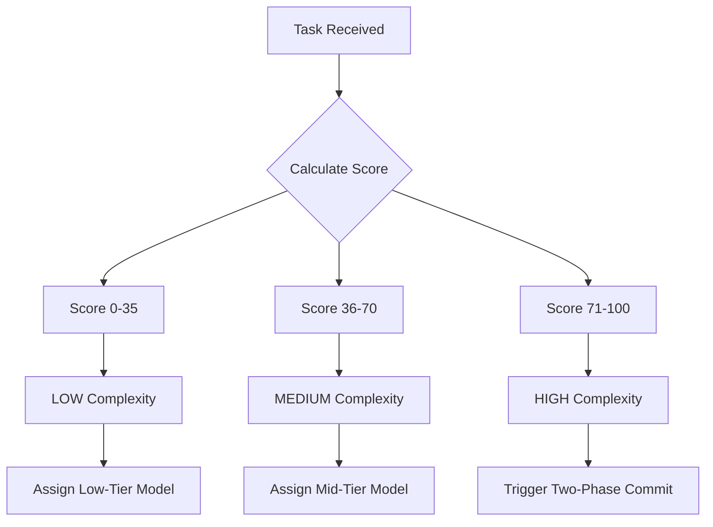
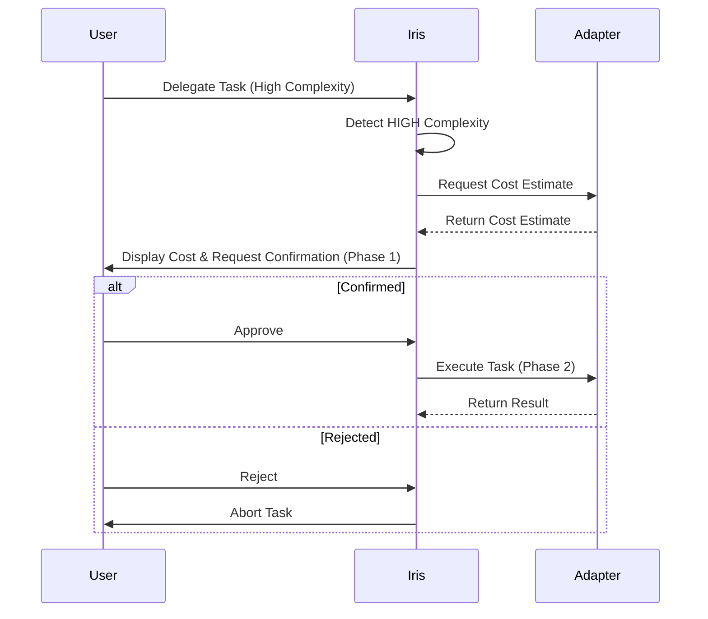
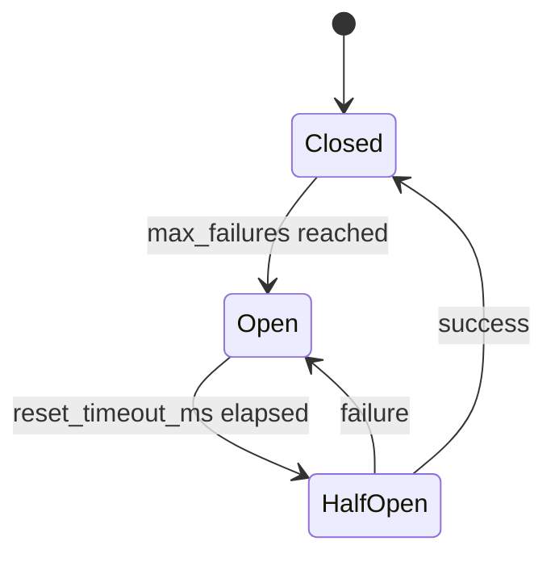

# Iris Product Requirements Document (PRD)

## 1. Executive Summary
Iris is an intelligent, multi-adapter AI CLI orchestrator designed to route tasks to the most suitable AI model (Claude, Antigravity, Copilot, or Codex) based on phase and complexity. By maintaining shared memory through Engram and intelligently delegating workloads, Iris eliminates manual context management and ensures the right AI is used for the job, saving tokens and improving developer velocity.

## 2. Problem Statement
Iris solves the following 6 pain points:
1. **Manual context pasting:** Developers waste time copying and pasting context between different AI tools.
2. **Token waste:** Using expensive, high-complexity models for trivial tasks drains API budgets.
3. **Compaction loss:** Context is lost or truncated when conversations get too long or are manually summarized.
4. **No intelligent delegation:** Lack of a unified system to decide which AI is best suited for a specific phase of development.
5. **No shared memory:** Different AI CLIs operate in silos without a centralized memory store, leading to repetitive prompting.
6. **Code search overhead:** Without structural code intelligence, AI agents must grep/read many files to locate symbols — wasting tokens and slowing orchestration.

## 3. Vision
"One delegation call. The right AI. The right model. Every time."

## 4. Target Users
Developers using 2+ AI CLIs simultaneously who need a unified, context-aware orchestrator to manage their workflows efficiently.

## 5. Supported Platforms
- Windows (primary)
- macOS
- Linux

## 5.1. Prerequisites / Dependencies
Before starting the setup, ensure that the following requirements are met or integrated:

| Dependency | Purpose | Description |
|---|---|---|
| **CodeGraph** | MCP server for Claude Code | AST-based code search (tree-sitter). Provides sub-millisecond symbol lookup. Reduces token usage ~57% on code exploration tasks. |

## 6. Adapter Specifications

| Adapter | CLI Invocation Pattern | Model Options | Effort/Reasoning Control | Best-for Phases | Constraints |
| :--- | :--- | :--- | :--- | :--- | :--- |
| **Claude** | `claude -m {model} -p "{prompt}"` | Haiku, Sonnet, Opus | `--effort` (low/medium/high) | `sdd-explore`, `sdd-propose` | High token cost for Opus |
| **Antigravity** | `agy --print "{prompt}" --dangerously-skip-permissions --print-timeout 15m0s` | Gemini 3.5 Flash (Medium/High), Gemini 3.1 Pro (High) | **NO EFFORT FLAG.** Model set via `~/.gemini/antigravity-cli/settings.json`. Iris writes model before exec, restores after. | `sdd-explore`, `sdd-propose`, `sdd-verify` | Full binary path required: `%LOCALAPPDATA%\agy\bin\agy.exe`. No `--model` flag. |
| **Copilot** | `gh copilot -m {model} --reasoning-effort {effort} "{prompt}"` | gpt-4o-mini, gpt-4o | `--reasoning-effort` | Fallback | Requires GitHub auth |
| **Codex** | `codex exec -m {model} -c reasoning_effort="{effort}" "{prompt}"` | codex-base, codex-pro | `-c reasoning_effort="{effort}"` | `sdd-apply` (ALL CODE WRITTEN HERE) | Focused solely on code generation |

## 7. Complexity Detection Algorithm
The complexity of a task is determined by evaluating 4 signals:
1. **Scope of Changes:** Number of files to create/modify.
2. **Context Size:** Number of tokens required to understand the current state.
3. **Architectural Impact:** Whether new patterns or structures are introduced.
4. **Dependency Resolution:** Level of external library interactions.

**Scoring Table (Total 100 points):**
- Scope (0-30 points)
- Context Size (0-30 points)
- Architectural Impact (0-20 points)
- Dependency Resolution (0-20 points)

**Thresholds:**
- **LOW:** 0-35 points
- **MEDIUM:** 36-70 points
- **HIGH:** 71-100 points



## 8. Model + Effort Matrix

### Claude Adapter
| Complexity | Model | Effort |
| :--- | :--- | :--- |
| LOW | Haiku | low |
| MEDIUM | Sonnet | medium |
| HIGH | Opus | high |

### Antigravity Adapter
| Complexity | Model | Effort Control |
| :--- | :--- | :--- |
| LOW | Gemini 3.5 Flash (Medium) | N/A |
| MEDIUM | Gemini 3.5 Flash (High) | N/A |
| HIGH | Gemini 3.1 Pro (High) | N/A |

### Copilot Adapter
| Complexity | Model | Reasoning Effort |
| :--- | :--- | :--- |
| LOW | gpt-4o-mini | low |
| MEDIUM | gpt-4o | medium |
| HIGH | gpt-4o | high |

### Codex Adapter
| Complexity | Model | Reasoning Effort |
| :--- | :--- | :--- |
| LOW | codex-base | low |
| MEDIUM | codex-pro | medium |
| HIGH | codex-pro | high |

## 9. Phase → Adapter Delegation Table

| SDD Phase | Primary Adapter | Fallback Adapter | Notes |
| :--- | :--- | :--- | :--- |
| `sdd-init` | Antigravity | Claude | Initializes Engram |
| `sdd-explore` | Claude | Antigravity | Broad conceptual exploration |
| `sdd-propose` | Claude | Antigravity | Drafts initial proposal |
| `sdd-spec` | Antigravity | Claude | Writes rigorous specifications |
| `sdd-design` | Antigravity | Claude | Architecture and system design |
| `sdd-tasks` | Claude | Copilot | Breakdown into actionable tasks |
| `sdd-apply` | Codex | Copilot | **Codex writes ALL code** |
| `sdd-verify` | Antigravity | Claude | Validates implementation against specs |
| `sdd-archive` | Antigravity | Copilot | Finalizes and archives change |

## 9.1. Ecosystem Integrations
Iris operates alongside several key tools in the AI agent ecosystem:

| Tool | Role |
|---|---|
| **Engram** | Persistent memory and IPC between agents |
| **CodeGraph** | AST-based code intelligence — symbol lookup, call graphs, impact analysis |
| **gentle-ai** | SDD phase templates and workflow methodology |
| **Claude Code** | Primary MCP host that loads and invokes Iris |

## 10. Two-Phase Commit Flow
For tasks with HIGH complexity, Iris requires user confirmation and presents a cost/time estimate before proceeding.



## 11. Template System
Iris uses a hierarchical template system to seed tasks:
- **Structure:** Stored in `iris/prompts/`
- **Seed:** `meta.md` acts as the foundational seed for new projects.
- **Fallback Resolver:** If a specific prompt template is missing, Iris resolves it via:
  1. **Engram:** Checks shared memory for previously cached templates.
  2. **Repo:** Checks the local repository for project-specific overrides.
  3. **Antigravity Creates:** If not found, Antigravity is invoked to generate the missing template dynamically.

## 12. MCP Tools API Reference

```typescript
/**
 * Delegate a task to an adapter.
 */
function iris_delegate(taskDescription: string, phase: string, forcedAdapter?: string): Promise<string>;

/**
 * Get status of an ongoing task.
 */
function iris_status(taskId: string): Promise<TaskStatus>;

/**
 * Retrieve execution history.
 */
function iris_history(limit?: number): Promise<TaskHistory[]>;

/**
 * Manage task lifecycle (create, update, cancel).
 */
function iris_task(action: 'create' | 'update' | 'cancel', payload: any): Promise<any>;

/**
 * Get or update Iris configuration.
 */
function iris_config(action: 'get' | 'set', key?: string, value?: any): Promise<any>;

/**
 * Verify and auto-configure Engram per adapter.
 */
function iris_setup(adapterName: string): Promise<boolean>;
```

## 13. Execution Modes
- **Terminal Mode (`wt`):** Executes the CLI adapter in a visible Windows Terminal tab, allowing the user to monitor streaming output.
- **Subprocess Mode (`execa`):** Executes the CLI adapter silently in the background, capturing standard output and error streams.
- **Completion Marker:** Regardless of execution mode, when a task is finished, the adapter MUST output `IRIS_COMPLETE` on its own line.

## 14. Engram Integration
**CONTEXT.md is ELIMINATED in final architecture. All AIs read from Engram via MCP.**
- **Universal Access:** All 4 adapters (Claude, Antigravity, Copilot, Codex) have Engram MCP configured.
- **Auto-Configuration:** `iris_setup` verifies and auto-configures Engram for each adapter upon initialization.
- **Topic Key Conventions:** Memory is structured around standardized `topic_key` names (e.g., `project:architecture`, `task:current`).
- **Task Flow:** Adapters retrieve context from Engram, execute their task, and save the result/observations back to Engram.

## 15. SQLite Schema

```sql
CREATE TABLE sessions (
    id TEXT PRIMARY KEY,
    created_at DATETIME DEFAULT CURRENT_TIMESTAMP,
    status TEXT NOT NULL,
    active_topic_key TEXT
);

CREATE TABLE tasks (
    id TEXT PRIMARY KEY,
    session_id TEXT REFERENCES sessions(id),
    adapter TEXT NOT NULL,
    phase TEXT NOT NULL,
    complexity TEXT NOT NULL,
    status TEXT NOT NULL,
    created_at DATETIME DEFAULT CURRENT_TIMESTAMP,
    completed_at DATETIME
);

CREATE TABLE adapter_budget (
    adapter TEXT PRIMARY KEY,
    daily_limit_usd REAL NOT NULL,
    current_spend_usd REAL DEFAULT 0.0,
    reset_date DATETIME NOT NULL
);

CREATE TABLE adapter_config (
    adapter TEXT PRIMARY KEY,
    default_model TEXT NOT NULL,
    is_enabled BOOLEAN DEFAULT 1,
    engram_configured BOOLEAN DEFAULT 0
);
```

## 16. Folder Structure

```text
src/
├── adapters/        # Adapter implementations (Claude, Antigravity, Copilot, Codex)
├── core/            # Core orchestrator logic (complexity, delegation, execution)
├── mcp/             # MCP tools server implementation (iris_delegate, etc.)
├── db/              # SQLite database schema and connection logic
├── engram/          # Engram MCP integration and auto-setup routines
├── prompts/         # Template system and meta.md
└── utils/           # Shared utilities (logger, config parser)
```

## 17. Configuration Reference
`~/.iris/config.json` defaults:

```json
{
  "general": {
    "execution_mode": "subprocess",
    "log_level": "info"
  },
  "adapters": {
    "claude": { "enabled": true, "default_model": "Sonnet" },
    "antigravity": { "enabled": true, "default_model": "Gemini 3.5 Flash (Medium)" },
    "copilot": { "enabled": true, "default_model": "gpt-4o-mini" },
    "codex": { "enabled": true, "default_model": "codex-pro" }
  },
  "engram": {
    "auto_setup": true,
    "default_topic": "default"
  },
  "circuit_breaker": {
    "max_failures": 3,
    "reset_timeout_ms": 300000
  }
}
```

## 18. Circuit Breaker
Iris implements a circuit breaker to handle adapter failures, tracking failure counts, determining fallback chains, and setting `unavailable_until` lockouts.


- **Closed:** Normal operation. Requests flow to the primary adapter.
- **Open:** Primary adapter is blocked. Requests immediately route to the fallback adapter.
- **Half-Open:** Allows a single test request to the primary adapter to check recovery.

## 19. Success Criteria
- [x] Orchestrator successfully delegates tasks based on complexity.
- [x] Engram MCP is fully configured and functional for all 4 adapters.
- [x] CONTEXT.md dependency is entirely removed.
- [x] Two-Phase Commit is triggered for HIGH complexity tasks.
- [x] Codex is exclusively used for code generation in the `sdd-apply` phase.
- [x] Fallback mechanisms via the Circuit Breaker operate correctly.
- [x] Template resolution falls back sequentially (Engram -> Repo -> Antigravity).
- [x] SQLite accurately tracks tasks, sessions, and adapter states.

## 20. Out of Scope (v1)
- Custom adapter plugins beyond the core 4.
- Cloud-hosted distributed SQLite syncing.
- Mobile platform support.
- CLI dashboard (CLI only for v1).

IRIS_COMPLETE
