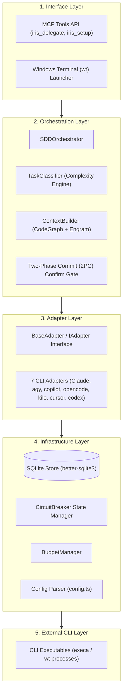
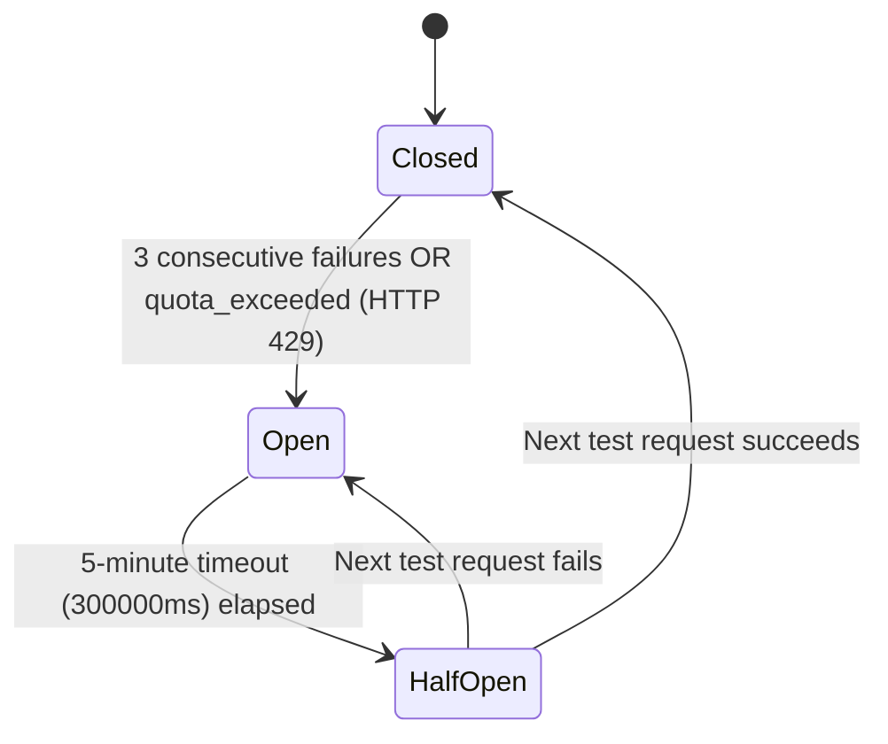
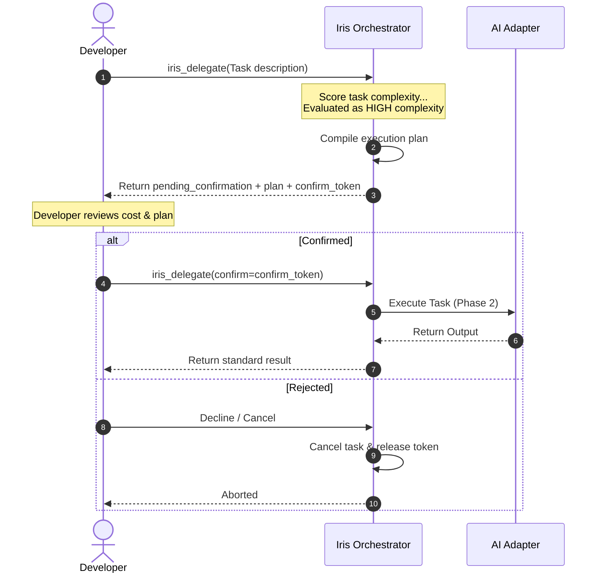

# Iris — Product Requirements Document

## 1. Executive Summary
Iris is an enterprise-grade, multi-adapter Model Context Protocol (MCP) server written in TypeScript/Node.js. It acts as an intelligent orchestration bus that coordinates, delegates, and executes software engineering tasks across a swarm of seven specialized AI CLI engines: Claude, Antigravity, GitHub Copilot, OpenCode, Kilo, Cursor-Agent, and Codex. 

By analyzing developer instructions through a multi-signal complexity classifier, Iris routes workloads to the most optimal AI adapter, manages API spending budgets and circuit breakers, and coordinates persistent context using a shared team memory bus (Engram synchronized bidirectionally via Google Drive). Iris eliminates context fragmentation, lowers token consumption by ~57% utilizing CodeGraph's AST-based search, and ensures the correct model is selected for every phase of development.

---

## 2. Problem Statement
Iris addresses the following six developer friction points:
1. **Manual Context Pasting:** Developers waste hours copying and pasting environment states, logs, and files between independent AI CLI tools and shell sessions.
2. **API Token and Budget Waste:** Invoking high-complexity, expensive models (e.g., Claude Opus) for trivial tasks (e.g., directory creation, simple shell commands) unnecessarily drains budgets.
3. **Context Loss (Compaction Limits):** Chat windows suffer from token bloat. Long conversations trigger context compaction, which degrades or discards critical architectural constraints.
4. **No Intelligent Delegation:** Developers lack a unified routing system to decide which AI and reasoning tier is best suited for a specific phase of the software development lifecycle.
5. **No Shared Memory:** Different AI CLI engines operate in silos without a centralized memory store, leading to repetitive prompting and loss of context.
6. **Code Search Overhead:** Without structural code intelligence, AI agents must grep/read many files to locate symbols — wasting tokens and slowing orchestration.

---

## 3. Vision
> "One delegation call. The right AI. The right model. Every time."

---

## 4. Target Users
Software developers using two or more AI CLIs simultaneously who require a unified, context-aware orchestrator to manage their workflows efficiently.

---

## 5. Supported Platforms
- **Windows (Primary):** Features custom Terminal execution modes using Windows Terminal (`wt`).
- **macOS**
- **Linux**

---

## 6. CLI Adapter Specifications
Iris integrates seven specialized CLI adapters under a unified execution interface. Each adapter maps abstract effort levels to its local CLI syntax and parses distinct output formats back into a standardized JSON response.

| Adapter | CLI Invocation Pattern | Model Options | Effort / Reasoning Control | Output Parsing Strategy | Notes & Overheads |
| :--- | :--- | :--- | :--- | :--- | :--- |
| **Claude** | `claude -p "{prompt}" --model {model} --effort {level} --output-format json --dangerously-skip-permissions` | `haiku` (low), `sonnet` (med), `opus` (high/xhigh) | `--effort` flag: `low / medium / high / xhigh / max` | JSON wrapper → extract `result.result` (content is Markdown) | Best for code generation and code review. Opus has high latency. |
| **Antigravity (agy)** | `agy --print "{prompt}" --dangerously-skip-permissions --print-timeout 15m0s` | `Gemini 3.5 Flash (Low/Medium/High)`, `Gemini 3.1 Pro (Low/High)`, `Claude Opus 4.6 (Thinking)`, `GPT-OSS 120B (Medium)` | **No CLI flag.** Iris writes exact model string to `~/.gemini/antigravity-cli/settings.json` before exec. | Markdown via stdout direct. | Best for documentation, architecture prose, and diagrams. 15-min timeout supported. |
| **Copilot** | `copilot -p "{prompt}" --model {model}` | `gpt-5-mini` (0.4 cr), `gpt-5.4-mini`, `gpt-5.2-codex`, `auto`, `claude-haiku-4.5`, `gemini-3.1-pro`, `gpt-5.2` | `--model` flag only. No reasoning-effort flag. | Markdown text + **strip trailing stats block** (from "Changes / AI Credits / Tokens" line). | `copilot` == `gh copilot` — same binary, both aliases work. |
| **OpenCode** | `opencode run --format json -m {model} --variant {v} "{prompt}"` | `opencode/deepseek-v4-flash-free`, `opencode/mimo-v2.5-free`, `opencode/minimax-m3-free`, `opencode/nemotron-3-super-free`, `opencode/big-pickle` | `--variant` flag: `minimal / low / medium / high / max` (where supported) | JSONL stream → filter `type="text"` → concatenate `part.text` (Markdown content). | OpenCode Zen ONLY — OpenRouter not configured. Free models only. |
| **Kilo** | `kilo run --format json -m {model} --variant {v} "{prompt}"` | `kilo/kilo-auto/free`, `kilo/qwen/qwen3.7-plus:free`, `kilo/stepfun/step-3.7-flash:free`, `kilo/nvidia/nemotron-3-super-120b-a12b:free`, `kilo/poolside/laguna-m.1:free`, `kilo/nvidia/nemotron-3-nano-omni-30b:free` | `--variant` flag: `default / instant / thinking / low / medium / high` (model-dependent) | JSONL stream → identical parser to OpenCode. Content is Markdown. | Free-tier only (`:free` suffix). kilo-auto/free provides internal routing. |
| **Cursor-Agent** | `cursor-agent -p "{prompt}" --output-format text --model auto --trust` | `auto` (free plan only) | No effort flag. `--trust` is MANDATORY for headless execution. | Markdown via stdout direct. | Free plan: named models require paid plan. `--trust` bypasses interactive confirmation. |
| **Codex** | `codex exec "{prompt}" -m {model} -s workspace-write -c "approval_policy=never" --skip-git-repo-check` | `gpt-5.4-mini` (low/med), `gpt-5.5` (high) | `-m` flag for model selection only. | Markdown via stdout. Stderr contains session metadata (ignore). | Requires cwd = project directory. ~20k token base overhead. ChatGPT account required. NOT in automatic routing — explicit `adapter="codex"` only. |

---

## 7. 5-Layer Architecture
Iris is structured into five distinct, decoupled layers:



1. **Interface Layer:** Manages client inputs and standard tool definitions (`iris_delegate`, `iris_setup`). Spawns tasks either in visible Windows Terminal (`wt`) window or silently in the background.
2. **Orchestration Layer:** Controls development workflow flows (`SDDOrchestrator`), scores incoming request complexity (`TaskClassifier`), aggregates context (`ContextBuilder`), and prompts for confirmation under high-complexity levels.
3. **Adapter Layer:** Outlines the core translation mappings. Standardizes raw outputs (e.g. converting JSONL stream objects to plain text) so the orchestrator receives a uniform result.
4. **Infrastructure Layer:** Handles database persistence, budgets, config parameters, and manages the circuit breaker's lifecycle.
5. **External CLI Layer:** Houses the physical CLI executables installed on the system, executed as native OS processes.

---

## 8. Core Components
Iris introduces several core components to separate responsibilities and improve orchestration reliability:

- **TaskClassifier:** A scoring engine that calculates complexity from 0 to 100 based on:
  - **Scope of Changes (0-30 pts):** Evaluated from prompt instruction word count.
  - **Context Size (0-30 pts):** Based on active Engram observations (`contextIds`).
  - **Architectural Impact (0-20 pts):** Weighted by phase and design-centric keywords (*refactor*, *schema*, *interface*).
  - **Dependency Resolution (0-20 pts):** Driven by setup keywords (*npm*, *install*, *library*).
  - **Complexity Mapping:** 0-35 points maps to **LOW**, 36-70 to **MEDIUM**, and 71-100 to **HIGH** complexity.
- **ContextBuilder:** Decouples context compilation. Collects local state, structural symbols from **CodeGraph**, observations from **Engram**, and parses rules from the local `iris_context.md`.
- **SDDOrchestrator:** Coordinates Spec-Driven Development execution. Automatically manages the transition between phases (`/sdd explore` -> `/sdd propose` -> `/sdd spec`, etc.) by invoking the primary adapter defined in the routing matrix.
- **`iris_context.md`:** The localized context reference file. Contains repository-specific standards, active development changesets, and architectural constraints. It acts as the local entry point for workspace configurations, while raw session states reside in Engram.
- **`prompts/` Template System:** A structured folder of 8 specialized markdown prompt templates used to seed delegation requests:
  1. `code.md`: Directives for generating clean, modular code.
  2. `docs.md`: blueprints for writing developer guides.
  3. `diagram.md`: Instructions for Mermaid diagrams.
  4. `explore.md`: Seeding prompts for codebase exploration.
  5. `specs.md`: Validation rules for behavioral specs (RFC 2119).
  6. `synthesis.md`: Compaction rules to summarize conversation histories.
  7. `review.md`: Checksheets for verification reviews.
  8. `tests.md`: Test generation assertions.

---

## 8b. Odoo Integration Layer

Iris includes a specialized Odoo development layer for Alesco Perú. It detects 22 OdooTaskType values through 130+ keyword matching in `context/odoo-selector.ts`. Each task type has a dedicated `TASK_CONFIG` entry specifying: primary adapter, fallback adapter, relevant knowledge files from `knowledge/odoo/`, and active RULES.md governance rules (R1–R13).

OdooContext is built by querying CodeGraph for `__manifest__.py`, extracting version/edition, and resolving alesco_path (enterprise and community source paths). This context is injected into the adapter prompt so the AI always knows the Odoo version, edition, branch, and which rules apply.

**Enterprise First (R6):** `executor/enterprise.ts` searches the Enterprise source via `rg` before any implementation. **Branch Safety (R2):** `executor/git.ts` blocks `push --force`, `rebase`, `reset`, and requires explicit authorization for push/merge/cherry-pick.

---

## 8c. Knowledge Base

Iris ships 200+ Odoo knowledge files organized under `knowledge/odoo/`:
- `ai/` — RULES.md (R1–R13) + patterns (xml-views, security, wizards, controllers, OWL, mail, portal, etc.) + core (ORM, data-migration, performance) + testing + migration (v14–v19) + business (accounting, stock, HR, sales) + v18/v19 references
- `contribute/` — plugins (odoo-oca, odoo-ops, odoo-commit, odoo-pr, odoo-ci, odoo-changelog) + scripts

---

## 8d. Excalidraw Diagram Generation

`src/diagrams/generator.ts` auto-generates `.excalidraw` files on every `design` phase (fire-and-forget). It loads `knowledge/excalidraw/SKILL.md` (verbatim from coleam00/excalidraw-diagram-skill), the appropriate template, and the Alesco brand palette (navy `#1E3A5F`, orange `#E8732A`, Odoo purple `#875A7B`). Templates: `odoo-erd`, `odoo-owl-flow`, `sdd-architecture`, `odoo-deployment`. Output: `docs/sdd/{change}/design-arch.excalidraw`.

---

## 9. Shared Memory Architecture
To achieve zero context fragmentation and zero cold starts across sessions, Iris utilizes a **Shared Memory Architecture**:
- All 7 CLI adapters are configured with native tools/configurations to communicate directly with MCP servers.
- The `iris_setup()` function automatically verifies dependencies, configures environment variables, and registers the local **Engram** memory server and **CodeGraph** AST symbol engine for all adapters.
- When an adapter executes (even in an isolated terminal or background process), it retrieves task parameters and recent workspace observations directly from Engram using unique topic keys and updates observations asynchronously upon completion. This removes the need for local file-system state transfer.

---

## 10. SDD Phase → Adapter Delegation Table
Iris routes each Spec-Driven Development phase to a specialized primary adapter to optimize quality, execution speed, and token cost.

| SDD Phase | Primary Adapter | Model | Fallback | MCP Used | Effort | Output File |
| :--- | :--- | :--- | :--- | :--- | :--- | :--- |
| **`sdd-explore`** | `kilo` | `kilo-auto/free` | `opencode` | CodeGraph (iris queries before delegating) | low | `00-explore.md` |
| **`sdd-propose`** | `cursor-agent` | `auto` | `kilo` | Engram (reads explore context) | low | `01-proposal.md` |
| **`sdd-spec`** | `copilot` | `gpt-5-mini` | `cursor-agent` | Engram (reads explore + proposal) | med | `02-spec.md` |
| **`sdd-design`** | `antigravity` | `Gemini 3.1 Pro (High)` | `claude` | Engram (reads all previous phases) | high | `03-design.md` |
| **`sdd-tasks`** | `cursor-agent` | `auto` | `kilo` | Engram (reads design) | low | `04-tasks.md` |
| **`sdd-apply`** | `claude` | `sonnet` (high effort) | `antigravity` | CodeGraph + Engram | high | code changes |
| **`sdd-verify`** | `claude` | `haiku` (med effort) | `copilot` | Engram (reads tasks + apply) | med | `05-verify.md` |
| **`sdd-archive`** | `antigravity` | `Gemini 3.5 Flash (High)` | `opencode` | Engram (reads all) → writes docs/ | med | `06-archive.md` |
| **`sdd-report`** | `antigravity` | `Gemini 3.5 Flash (Med)` | `copilot` | Engram → executive summary | med | `report.md` |

**Documentation flow:** agy documents each phase and writes the corresponding `.md` file to `docs/{feature}/sdd/` after completion. Humans review and approve before the next phase begins.

---

## 11. Documentation Structure (Screaming Architecture)

Each feature is self-contained in `docs/`. The feature name screams first — the process (sdd/) is subordinate. Humans review SDD artifacts phase by phase before approving continuation.

```text
docs/
  {feature-name}/
    sdd/
      00-explore.md       ← agy writes after sdd-explore
      01-proposal.md      ← agy writes after sdd-propose
      02-spec.md          ← agy writes after sdd-spec
      03-design.md        ← agy writes after sdd-design
      04-tasks.md         ← agy writes after sdd-tasks
      05-verify.md        ← agy writes after sdd-verify
      06-archive.md       ← agy writes after sdd-archive
      report.md           ← agy writes after sdd-report (executive summary)
    diagrams/
      arch-overview.excalidraw    ← hub-and-spoke system view
      arch-layers.excalidraw      ← n-tier 5-layer view
      flow-routing.excalidraw     ← routing decision flow
      flow-sequence.excalidraw    ← request/response sequence
      uml-use-cases.excalidraw    ← MCP tool use cases
      uml-erd.excalidraw          ← entity relationships
    logic.md              ← systematic logic in fluid prose (human-readable)
```

Diagram naming convention: prefix indicates type (`arch-`, `flow-`, `uml-`, `state-`, `data-`). Files within each type are flat — no nested subfolders.

---

## 12. Circuit Breaker & Quota Handling
To prevent cascading adapter failures (network limits, rate limits, or credentials loss), Iris maintains an in-memory `CircuitBreaker` wrapper around every adapter.



- **Closed State:** Requests route directly to the primary adapter.
- **Open State:** The adapter is blocked. Requests immediately route to the fallback adapter.
- **Half-Open State:** Allows a single request to test if the adapter has recovered.
- **Quota Exceeded (HTTP 429) Bypass:** If an adapter returns a rate limit or quota exceeded error, the circuit breaker immediately transitions to **Open** without waiting for the 3-failure threshold, preventing unnecessary latency and falling back instantly to the secondary adapter.

---

## 13. SQLite Schema
The persistence layer tracks sessions, task history, adapter configurations, and API spend:

```sql
CREATE TABLE sessions (
    id TEXT PRIMARY KEY,
    created_at DATETIME DEFAULT CURRENT_TIMESTAMP,
    status TEXT NOT NULL,
    active_topic_key TEXT
);

CREATE TABLE tasks (
    id TEXT PRIMARY KEY,
    session_id TEXT REFERENCES sessions(id),
    adapter TEXT NOT NULL,
    phase TEXT NOT NULL,
    complexity TEXT NOT NULL,
    status TEXT NOT NULL,
    created_at DATETIME DEFAULT CURRENT_TIMESTAMP,
    completed_at DATETIME,
    engram_id INTEGER,
    cost_usd REAL DEFAULT 0.0
);

CREATE TABLE adapter_budget (
    adapter TEXT PRIMARY KEY,
    daily_limit_usd REAL NOT NULL,
    current_spend_usd REAL DEFAULT 0.0,
    reset_date DATETIME NOT NULL
);

CREATE TABLE adapter_config (
    adapter TEXT PRIMARY KEY,
    default_model TEXT NOT NULL,
    is_enabled BOOLEAN DEFAULT 1,
    engram_configured BOOLEAN DEFAULT 0
);
```

---

## 14. Two-Phase Commit Flow
For tasks evaluated as **HIGH complexity**, Iris halts execution, compiles a detailed execution plan (including model, effort level, and cost estimate), and requests explicit developer authorization before executing.



---

## 15. Folder Structure
The Iris project layout implements a clean, screaming architecture structure:

```text
src/
├── adapters/         # Adapter implementations (base, claude, antigravity, copilot, opencode, kilo, cursor-agent, codex)
├── core/             # Orchestrator core: TaskClassifier, ContextBuilder, SDDOrchestrator
├── mcp/              # MCP server protocol, transport, and tools definitions
├── store/            # SQLite connection, budget database, and task repository
├── prompts/          # The 8 standard templates (code.md, docs.md, etc.)
├── router/           # Routing: selector.ts, circuit-breaker.ts
├── executor/         # Process execution: terminal.ts (wt), subprocess.ts (execa)
├── types/            # TypeScript interfaces and shared schemas
└── utils/            # Logging, config parsing, and file system utilities
```

---

## 16. Configuration Reference
The configuration file is located at `~/.iris/config.json`. The following represents the default configuration:

```json
{
  "confirm_threshold": "high",
  "execution_mode": "terminal",
  "adapters": {
    "claude": {
      "enabled": true,
      "priority": 3,
      "daily_budget_usd": 5.0
    },
    "antigravity": {
      "enabled": true,
      "priority": 1,
      "daily_budget_usd": 0.0
    },
    "copilot": {
      "enabled": true,
      "priority": 2,
      "daily_budget_usd": 0.0
    },
    "opencode": {
      "enabled": true,
      "priority": 1,
      "daily_budget_usd": 0.0
    },
    "kilo": {
      "enabled": true,
      "priority": 1,
      "daily_budget_usd": 0.0
    },
    "cursor-agent": {
      "enabled": true,
      "priority": 1,
      "daily_budget_usd": 0.0
    },
    "codex": {
      "enabled": true,
      "priority": 2,
      "daily_budget_usd": 2.0
    }
  },
  "engram": {
    "auto_setup": true,
    "default_topic": "default",
    "gdrive_sync": true
  },
  "circuit_breaker": {
    "max_failures": 3,
    "reset_timeout_ms": 300000
  }
}
```

---

## 17. Ecosystem Integrations

### 17.1. Engram + Google Drive Bidirectional Sync
To facilitate seamless collaboration across distributed teams, local Engram databases are synchronized bidirectionally using a Google Drive backup system:
- **Personal Directories:** Teammates sync their database records to personal folders in Google Drive, preventing locking issues.
- **Auto-Import Daemon:** A background process (`engram-drive` service) scans Google Drive directories and imports new observations; observations from other teammates are seamlessly integrated.
- **Decentralized IPC:** Ensures all adapters operate with updated shared context, eliminating central coordination servers.

### 17.2. CodeGraph AST Integration
Iris integrates directly with the **CodeGraph** AST search tool. During the explore and design phases, CodeGraph provides sub-millisecond symbol lookup, call hierarchy graphs, and dependency impact maps using tree-sitter. This reduces adapter exploration token usage by **~57%**.

---

## 18. Success Criteria
- [ ] **TaskClassifier** accurately scores instructions across the 4 signals and maps them to correct tiers (LOW, MEDIUM, HIGH).
- [ ] All 7 adapters (**claude**, **antigravity**, **copilot**, **opencode**, **kilo**, **cursor-agent**, **codex**) successfully launch, execute CLI instructions, and return standardized plain text.
- [ ] **CircuitBreaker** transitions to **Open** immediately upon encountering a `quota_exceeded` / HTTP 429 error and routes tasks to fallbacks.
- [ ] **Shared Memory Architecture** compiles context successfully via CodeGraph & Engram, eliminating cold starts across sessions.
- [ ] **ContextBuilder** resolves missing prompt templates in sequence: Local Prompts Folder -> Engram -> Antigravity creation.
- [ ] **Two-Phase Commit** prompts for developer approval on HIGH complexity tasks, blocking downstream subprocess execution until confirmed.
- [ ] **Screaming documentation** structure is maintained inside `docs/` for routing, memory, and adapter domains.

---

IRIS_COMPLETE
