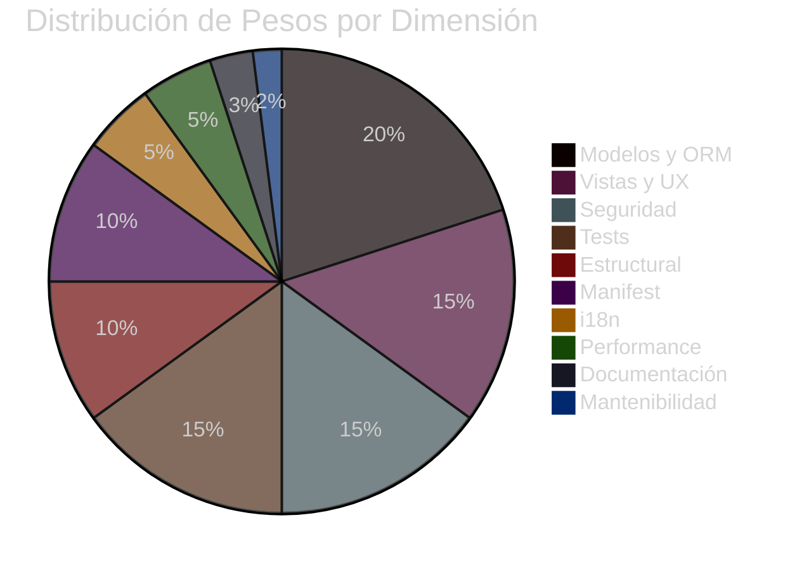
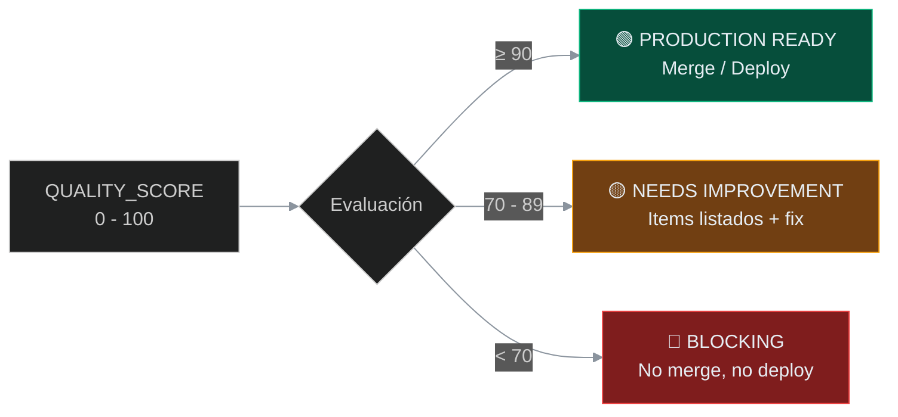
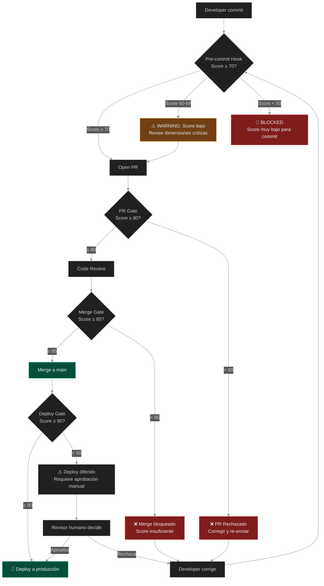

# iris — Sistema de Puntuación de Calidad para Módulos Odoo

> **Versión:** 1.0.0
> **Última actualización:** 2026-06-10
> **Estado:** Documento de calidad — define el sistema de puntuación, dimensiones, fórmula y gates CI para el ecosistema iris.
> **Depende de:** `ECOSYSTEM.md` (ingeniería #12 — Quality Engineering), `ARCHITECTURE.md` (ADR-002 — Engram), `RECIPROCAL_APPRENTICESHIP.md` (metodología de aprendizaje), `SECURITY.md` (dimensión de seguridad)
> **Ingeniería relacionada:** Quality Engineering (12), Testing Engineering (9), Security Engineering (11), Harness Engineering (6)

---

## Índice

1. [Quality Philosophy](#1-quality-philosophy)
2. [Quality Dimensions](#2-quality-dimensions)
3. [Scoring Formula](#3-scoring-formula)
4. [Integrated with Reciprocal Apprenticeship](#4-integrated-with-reciprocal-apprenticeship)
5. [Quality Report Template](#5-quality-report-template)
6. [CI Gates Integration](#6-ci-gates-integration)
7. [References](#7-references)

---

## 1. Quality Philosophy

### Calidad como Enseñanza, No como Gate

En el ecosistema **iris**, la calidad no es un simple semáforo que bloquea o aprueba. Es la **manifestación tangible del Quality Engineering** (Ingeniería #12, `ECOSYSTEM.md` §3), y sigue la misma filosofía de **Reciprocal Apprenticeship** (`RECIPROCAL_APPRENTICESHIP.md` §2): **cada verificación de calidad es una oportunidad de aprendizaje**.

> *"Evaluación de calidad: Saber distinguir código bueno de código mediocre"* — Josh Comeau (2026)

La evaluación de calidad en Odoo no es trivial. Un módulo puede funcionar perfectamente en el día a día y sin embargo violar principios fundamentales de seguridad, performance o mantenibilidad que se manifiestan como problemas graves en producción. El propósito de este sistema es **hacer visibles esas diferencias** y, al hacerlo, **enseñar al desarrollador por qué importan**.

### El Mandato de Reciprocal Apprenticeship

Cada medición de calidad debe responder cuatro preguntas:

| Pregunta | Propósito |
|----------|-----------|
| **¿Qué** falló/pasó? | El hecho objetivo medible |
| **¿Por qué** importa? | El fundamento Odoo subyacente (referencia a docs) |
| **¿Cómo** verificarlo en UI? | La ruta concreta en la interfaz de Odoo |
| **¿Cómo** arreglarlo con comprensión? | La solución explicada, no solo el fix |

Este documento implementa el **Harness de Enforcement** descrito en `ECOSYSTEM.md` §6 para la dimensión de calidad. Las reglas aquí definidas se aplican mecánicamente en CI gates — no por prompt, sino por código que valida estructura, manifiestos y convenciones.

### Principios de la Evaluación

| # | Principio | Implicación |
|---|-----------|-------------|
| 1 | **Objetivo sobre subjetivo** | Las métricas son binarias o cuantificables. No hay "se ve bien" |
| 2 | **Odoo-específico** | No evaluamos JavaScript genérico — evaluamos ORM, vistas Odoo, seguridad Odoo, tests Odoo |
| 3 | **Reproducible** | Dos evaluadores obtienen el mismo score para el mismo módulo |
| 4 | **Económico** | La evaluación no cuesta más que el desarrollo. Automatizada vía CI |
| 5 | **Educativo** | Cada penalización viene con su fundamento y ruta de arreglo |

---

## 2. Quality Dimensions

El sistema define **10 dimensiones ponderadas**. Cada dimensión tiene:

- **Weight** (% del total)
- **Qué mide**
- **Sources/Standards**
- **Cómo verificar en Odoo UI**
- **Penalties**

### Diagrama de Dimensiones



---

### Dimensión 1: Estructural

| Campo | Detalle |
|-------|---------|
| **Weight** | 10% |
| **Qué mide** | El módulo sigue la estructura de directorios OCA estándar |
| **Sources/Standards** | OCA module structure: `github.com/OCA/maintainer-tools` — directorios obligatorios: `models/`, `views/`, `security/`, `data/`, `tests/`, `wizards/`, `report/`, `controllers/` |
| **UI verification** | `ls <module>/` en el sistema de archivos. Verificar que cada directorio exista (aunque esté vacío con `__init__.py`) |
| **Penalties** | -50% si falta `models/` o `security/`; -25% por cada directorio obligatorio faltante; -10% si `tests/` existe pero está vacío |

**Fundamento**: Odoo descubre módulos buscando `__manifest__.py` en subdirectorios de `addons_path`. La estructura OCA no es arbitraria — `models/` y `views/` son convenciones que el ORM y el loader de vistas esperan. Sin `security/`, no hay `ir.model.access.csv` y el modelo es inaccesible.

---

### Dimensión 2: Manifest

| Campo | Detalle |
|-------|---------|
| **Weight** | 10% |
| **Qué mide** | `__manifest__.py` completo y correcto |
| **Sources/Standards** | Odoo 18 manifest reference: `odoo.com/documentation/18.0/developer/reference/backend/module.html` |
| **Campos requeridos** | `name`, `version`, `category`, `license` (debe ser `AGPL-3` para OCA), `depends` (mínimo, explícito), `data` (ordenado correctamente), `author` |
| **UI verification** | Apps → buscar módulo → formulario del módulo → verificar versión, licencia, autor, dependencias |
| **Penalties** | -20% por cada campo requerido faltante; -50% si license no es `AGPL-3` (para módulos que se publicarán en OCA); -15% si `depends` incluye dependencias no usadas; -15% si `depends` no incluye dependencias usadas |

**Fundamento**: El `__manifest__.py` es el contrato del módulo con Odoo. `depends` define el orden de carga de módulos y la disponibilidad de tablas/columnas. Una dependencia faltante causa `FieldNotFound` o `ModelNotFound` en producción. `license` determina la compatibilidad legal con OCA y la comunidad.

---

### Dimensión 3: Modelos y ORM (HIGHEST)

| Campo | Detalle |
|-------|---------|
| **Weight** | 20% |
| **Qué mide** | Uso correcto del ORM de Odoo |
| **Sources/Standards** | Odoo ORM docs: `odoo.com/documentation/18.0/developer/reference/backend/orm.html`; OCA performance guidelines: `github.com/OCA/maintainer-tools/blob/master/tools/quality.md#performance` |
| **Checks** | ✅ `@api.depends` con todas las dependencias declaradas; ✅ `@api.constrains` para validación; ✅ Evita N+1 (usa prefetch, `search` con `prefetch_fields`); ✅ `_rec_name`, `_order`, `_sql_constraints` (o `models.Constraint` en v18); ✅ Herencia correcta (sin `_inherit` + `_name` a menos que sea intencional); ❌ No `sudo()` sin comentario explícito de contexto; ❌ No `cr.execute()` sin parameterización (SQL injection); ❌ No compute methods sin `@api.depends`; ❌ No stored computed fields sin dependencias correctas |
| **UI verification** | Technical → Models → buscar modelo → revisar campos, constraints, relaciones. Technical → Fields → verificar compute fields y sus dependencias |
| **Penalties** | -30% por `sudo()` sin comentario; -30% por `cr.execute()` sin parameterización; -25% por compute field sin dependencia; -20% por N+1 en método crítico; -15% por `_sql_constraints` faltante en modelo con campos únicos; -10% por `_rec_name` faltante |

---

### Dimensión 4: Vistas y UX

| Campo | Detalle |
|-------|---------|
| **Weight** | 15% |
| **Qué mide** | Calidad de vistas XML, convenciones Odoo 18 |
| **Sources/Standards** | Odoo Views: `odoo.com/documentation/18.0/developer/reference/backend/views.html` |
| **Checks** | ✅ Usa `list view` (no `tree`) para Odoo 18; ✅ Usa `invisible` inline en vez de `attrs`; ✅ Usa widget correcto (`badge`, `statusbar`, `monetary`, `handle`, `many2many_tags`); ✅ Template kanban si existe vista kanban; ✅ Search view con filtros y favoritos; ✅ Form view organizado con notebooks, groups, pages |
| **UI verification** | Abrir la vista en Odoo → Developer Tools (bug icon) → View Metadata → revisar arch structure, fields, widgets. O: Settings → Technical → Views → buscar vista por ID |
| **Penalties** | -15% por vista sin organización lógica (todo en un mismo group); -15% por `attrs` usados donde `invisible` inline funciona (Odoo 18); -10% por search view sin filtros útiles; -10% por kanban sin template adecuado |

---

### Dimensión 5: Seguridad

| Campo | Detalle |
|-------|---------|
| **Weight** | 15% |
| **Qué mide** | Integridad del control de acceso |
| **Sources/Standards** | Odoo Security: `odoo.com/documentation/18.0/developer/reference/backend/security.html`; `SECURITY.md` §3 (Seguridad en Módulos Odoo) |
| **Checks** | ✅ Todo modelo tiene entrada en `ir.model.access.csv` para todos los CRUD necesarios; ✅ Record rules (`ir.rule`) para multi-company o multi-user; ✅ Field-level security vía `groups` en campos sensibles; ✅ Controller methods tienen `auth=` correcto; ✅ Sin hardcoded user IDs |
| **UI verification** | Settings → Technical → Security → Access Rights → filtrar por modelo. Record Rules → buscar reglas del modelo. Fields → verificar groups en campos sensibles |
| **Penalties** | -100% si un modelo no tiene `ir.model.access.csv` (modelo inaccesible); -30% si faltan permisos CRUD (solo read, sin write); -25% si modelo con `company_id` no tiene record rule multi-company; -20% por controller público (`auth='public'`) que expone datos sensibles |

**Ver también**: `SECURITY.md` §3.1 para el formato exacto de `ir.model.access.csv` y §3.2 para `ir.rule`. El harness de seguridad (`SECURITY.md` §3) bloquea en CI cualquier modelo sin ACL.

---

### Dimensión 6: Tests

| Campo | Detalle |
|-------|---------|
| **Weight** | 15% |
| **Qué mide** | Cobertura y calidad de tests |
| **Sources/Standards** | Odoo Testing: `odoo.com/documentation/18.0/developer/reference/backend/testing.html`; `ECOSYSTEM.md` §3 — Testing Engineering (#9): cobertura mínima > 80%, TransactionCase |
| **Checks** | ✅ Directorio `tests/` existe; ✅ Usa `TransactionCase` (o `HttpCase` para UI); ✅ Tests cubren CRUD + flujos de negocio; ✅ Tests usan mock data realista (no mínima); ✅ Tests pasan sin error; ✅ Ningún test está vacío (solo `pass`) |
| **UI verification** | Apps → módulo → Technical → Tests → Run Tests. Revisar que los tests aparecen, se ejecutan y pasan |
| **Penalties** | -100% si no existe `tests/`; -30% si tests no cubren lógica de negocio (solo CRUD trivial); -20% si tests usan `self.env` directo sin setUp de datos; -15% si hay tests vacíos (solo `pass`) |

---

### Dimensión 7: i18n

| Campo | Detalle |
|-------|---------|
| **Weight** | 5% |
| **Qué mide** | Preparación para internacionalización |
| **Sources/Standards** | Odoo i18n: `odoo.com/documentation/18.0/developer/reference/backend/i18n.html` |
| **Checks** | ✅ Strings de usuario usan `_()` o `translate=True`; ✅ Campos XML tienen `translate="1"` donde apropiado; ✅ Sin strings hardcoded en inglés en QWeb templates |
| **UI verification** | Settings → Technical → Translations → Translatable Terms → buscar términos del módulo. Abrir vista form en otro idioma (Settings → User → Language) |
| **Penalties** | -50% por string hardcoded en template QWeb visible al usuario; -25% por campo `Char` o `Text` sin `translate=True` cuando contiene datos multilingües |

---

### Dimensión 8: Performance

| Campo | Detalle |
|-------|---------|
| **Weight** | 5% |
| **Qué mide** | Anti-patrones de performance comunes |
| **Sources/Standards** | OCA Performance: `github.com/OCA/maintainer-tools`; DORA 2024: `+3.4%` code quality con AI pero `8x` code duplication increase |
| **Checks** | ✅ Sin `search()` en loop (usar `search_read`, prefetch, o `browse`); ✅ Sin `browse()` en loop para campos relacionados (usar `mapped`, prefetch); ✅ Domain filters usan tipos de campo e índices correctos; ✅ Computed stored fields tienen inverse methods |
| **UI verification** | Settings → Technical → Models → Performance → ver query count. Odoo.sh → Logs → buscar slow queries |
| **Penalties** | -40% por `search()` dentro de `for` loop (N+1 clásico); -30% por computed stored field sin inverse method; -20% por domain sobre campo no indexado en modelo con >10k registros |

---

### Dimensión 9: Documentación

| Campo | Detalle |
|-------|---------|
| **Weight** | 3% |
| **Qué mide** | Documentación inline del código |
| **Checks** | ✅ Métodos tienen docstrings (`"""..."""`); ✅ Lógica compleja tiene comentarios inline; ✅ Definiciones de campo tienen `help` parameter; ✅ `__manifest__.py` tiene `description` y `summary` |
| **Penalties** | -30% si métodos públicos no tienen docstring; -20% si `__manifest__.py` no tiene `summary`; -15% si fields sin `help` en modelos expuestos al usuario |

---

### Dimensión 10: Mantenibilidad

| Campo | Detalle |
|-------|---------|
| **Weight** | 2% |
| **Qué mide** | Organización y claridad del código |
| **Checks** | ✅ Métodos tienen responsabilidad única; ✅ Constantes extraídas (sin magic numbers/strings); ✅ Código sigue Python PEP8 y OCA conventions |
| **Penalties** | -30% por método con >100 líneas; -20% por magic numbers sin constante nombrada; -10% por violaciones PEP8 detectadas por linter |

---

## 3. Scoring Formula

```
QUALITY_SCORE = Σ(weight_i × score_i) para las 10 dimensiones

donde:
  score_i  ∈ [0.0, 1.0]   (0 = worst, 1.0 = perfect)
  weight_i ∈ [0.02, 0.20] (2% a 20%)
  Σ(weight_i) = 1.0        (100%)
```

### Cálculo de score_i por Dimensión

Cada dimensión comienza con **1.0** y aplica penalizaciones multiplicativas:

```
score_i = 1.0 × (1 - p₁) × (1 - p₂) × ... × (1 - pₙ)

donde pₙ es la penalización n-ésima (0.0 a 1.0)
```

**Ejemplo**: Dimensión Seguridad (weight=0.15) con dos fallas:
- Modelo sin `ir.model.access.csv` → penalización -1.0 (score se vuelve 0)
- Record rule multi-company faltante → penalización -0.25

```
score_seguridad = 1.0 × (1 - 1.0) × (1 - 0.25) = 0.0 × 0.75 = 0.0
contribución = 0.15 × 0.0 = 0.0
```

### Umbrales



| Score | Color | Significado | Acción |
|-------|-------|-------------|--------|
| **≥ 90** | 🟢 Verde | Ready for production / merge | Aprobado automáticamente |
| **70–89** | 🟡 Amarillo | Needs improvement — items específicos listados | Se requiere revisión humana. El autor debe corregir los items antes de merge |
| **< 70** | 🔴 Rojo | Blocking — no desplegar, no mergear | CI gate bloquea. El equipo revisa y corrige antes de re-evaluar |

---

## 4. Integrated with Reciprocal Apprenticeship

Cada verificación de calidad genera un **learning artifact** siguiendo la metodología definida en `RECIPROCAL_APPRENTICESHIP.md` §4.4. Esto asegura que el desarrollador no solo recibe un score, sino que **entiende por qué** perdió puntos y **cómo evitar** la misma falla en el futuro.

### Ejemplo: Dimensión Seguridad — FAIL

```
┌─────────────────────────────────────────────────────────────────────┐
│ EJEMPLO: Dimensión 5 (Seguridad) — FAIL                              │
├─────────────────────────────────────────────────────────────────────┤
│                                                                      │
│ ❌ Modelo 'alesco.api.log' no tiene entrada en ir.model.access.csv    │
│                                                                      │
│ 📖 FUNDAMENTO:                                                        │
│   Todo modelo en Odoo necesita un permiso explícito en                │
│   ir.model.access.csv. Sin esta entrada, solo el superusuario         │
│   (sudo) puede acceder al modelo — los usuarios normales ven           │
│   un error "El documento no existe" o directamente no ven el menú.    │
│   → Docs: odoo.com/documentation/18.0/developer/reference/backend/    │
│     security.html#access-rights                                       │
│                                                                      │
│ 🖥️ CÓMO VERIFICAR EN UI:                                             │
│   Settings → Technical → Security → Access Rights                     │
│   → filtrar por "alesco.api.log"                                     │
│   → Si no aparece, el modelo no tiene ACL                            │
│                                                                      │
│ 🔧 CÓMO ARREGLARLO:                                                  │
│   Agregar a security/ir.model.access.csv:                             │
│   id,name,model_id/id,group_id/id,perm_read,perm_write,              │
│   perm_create,perm_unlink                                             │
│   access_alesco_api_log,alesco.api.log,model_alesco_api_log,          │
│   base.group_user,1,0,0,0                                            │
│   (solo lectura para usuarios, porque es un log)                     │
│                                                                      │
│ 📎 Ver también: SECURITY.md §3.1 — formato completo de ACL            │
└─────────────────────────────────────────────────────────────────────┘
```

### Ejemplo: Dimensión 3 (ORM) — N+1 Query

```
┌─────────────────────────────────────────────────────────────────────┐
│ EJEMPLO: Dimensión 3 (Modelos y ORM) — FAIL                          │
├─────────────────────────────────────────────────────────────────────┤
│                                                                      │
│ ❌ search() dentro de for loop en método compute_supervisor_info()    │
│     → N+1 query: 1 + N consultas SQL                                │
│                                                                      │
│ 📖 FUNDAMENTO:                                                        │
│   El ORM de Odoo usa prefetching automático para campos Many2one,     │
│   pero search() dentro de un loop NO se beneficia de esto.            │
│   Cada iteración ejecuta una consulta SQL separada.                   │
│   Con 100 órdenes, son 101 queries vs 1 query con search_read().      │
│   → Docs: odoo.com/documentation/18.0/developer/reference/backend/    │
│     orm.html#performance                                              │
│                                                                      │
│ 🖥️ CÓMO VERIFICAR EN UI:                                             │
│   Activar "Debug with tools" → Enable "Query Count"                   │
│   → Abrir vista que ejecuta el método                                 │
│   → Ver conteo de queries en la esquina superior derecha              │
│                                                                      │
│ 🔧 CÓMO ARREGLARLO:                                                  │
│   En vez de:                                                          │
│     for order in orders:                                              │
│         logs = self.env['alesco.api.log'].search([...])               │
│   Usar:                                                               │
│     all_logs = self.env['alesco.api.log'].search([                    │
│         ('field', 'in', orders.mapped('some_field'))                  │
│     ])                                                                │
│   → 1 query, no N queries                                            │
│                                                                      │
│ 📎 Referencia: OCA Performance Guidelines —                            │
│     github.com/OCA/maintainer-tools/blob/master/tools/quality.md      │
└─────────────────────────────────────────────────────────────────────┘
```

### Integración con el Pipeline SDD

Cada fase del pipeline SDD (`ECOSYSTEM.md` §4) incorpora la validación de calidad:

| Fase SDD | Validación de Calidad | Learning Output |
|----------|----------------------|-----------------|
| **explore** | CodeGraph analiza estructura del módulo y genera UI Map | El desarrollador ve la arquitectura completa del módulo antes de modificarlo |
| **propose** | Estimación de impacto en dimensiones de calidad | El desarrollador anticipa qué dimensiones necesita reforzar |
| **spec** | Requisitos escritos con métricas de calidad asociadas | Cada requisito tiene criterios de aceptación medibles |
| **design** | ADR incluye evaluación de impacto en quality score | Las decisiones arquitectónicas consideran explícitamente la calidad |
| **tasks** | Cada task incluye "Quality Gates" que debe cumplir | Las tareas no son solo funcionales — incluyen calidad |
| **apply** | Código generado con learning artifact integrado | El artifact explica cada decisión con fundamentos Odoo |
| **verify** | Ejecución completa del quality scoring | Score numérico + lista de learning moments |
| **archive** | Quality report archivado en Engram | El score histórico permite tracking de mejora continua |

---

## 5. Quality Report Template

Cada evaluación produce un reporte JSON estándar consumible por CI/CD y almacenable en Engram (`ARCHITECTURE.md` §2.2 — ADR-002).

### Formato JSON

```json
{
  "meta": {
    "module": "alesco_api_bridge",
    "version": "18.0.1.0.0",
    "odoo_version": "18.0",
    "evaluator": "iris-quality-engine",
    "evaluator_version": "1.0.0"
  },
  "overall_score": 72,
  "threshold": "yellow",
  "dimensions": [
    {
      "name": "Seguridad",
      "weight": 0.15,
      "weight_label": "15%",
      "score": 0.4,
      "score_pct": 40,
      "penalties": [
        {
          "rule": "missing_acl",
          "severity": "critical",
          "deduction": 1.0,
          "message": "Model 'alesco.api.log' missing from ir.model.access.csv",
          "fundamental": "Every model needs explicit access rights in ir.model.access.csv. Without it, only sudo can access the model.",
          "ui_verification": "Settings → Technical → Security → Access Rights → filter by model 'alesco.api.log'",
          "fix": "Add entry to security/ir.model.access.csv: id, name, model_id/id, group_id/id, perm_read, perm_write, perm_create, perm_unlink",
          "reference_url": "https://www.odoo.com/documentation/18.0/developer/reference/backend/security.html"
        },
        {
          "rule": "missing_multicompany_rule",
          "severity": "major",
          "deduction": 0.25,
          "message": "Model 'alesco.api.log' has company_id but no multi-company record rule",
          "fundamental": "Without a multi-company record rule, users from Company A can see logs from Company B.",
          "ui_verification": "Settings → Technical → Security → Record Rules → filter by model 'alesco.api.log'",
          "fix": "Add ir.rule with domain_force: [('company_id', 'in', company_ids)]",
          "reference_url": "https://www.odoo.com/documentation/18.0/developer/reference/backend/security.html#record-rules"
        }
      ]
    },
    {
      "name": "Modelos y ORM",
      "weight": 0.20,
      "weight_label": "20%",
      "score": 0.85,
      "score_pct": 85,
      "penalties": [
        {
          "rule": "sudo_without_comment",
          "severity": "major",
          "deduction": 0.15,
          "message": "sudo() call in models/api_log.py:42 without context comment",
          "fundamental": "sudo() bypasses all security rules. Every use must be justified with a comment explaining WHY it's necessary.",
          "ui_verification": "Code review: search for .sudo() in Python files. Check if each has a comment above it.",
          "fix": "Add comment: # sudo required because mail.thread needs access to ir.attachment",
          "reference_url": "https://www.odoo.com/documentation/18.0/developer/reference/backend/security.html#sudo"
        }
      ]
    }
  ],
  "learning_moments": [
    {
      "dimension": "Seguridad",
      "severity": "critical",
      "concept": "ir.model.access.csv — ACL en Odoo",
      "summary": "Todo modelo necesita permiso explícito. Sin ACL, solo sudo accede.",
      "reference_url": "https://www.odoo.com/documentation/18.0/developer/reference/backend/security.html"
    },
    {
      "dimension": "Seguridad",
      "severity": "major",
      "concept": "Record Rules multi-compañía",
      "summary": "Modelo con company_id necesita regla multi-company para aislamiento de datos.",
      "reference_url": "https://www.odoo.com/documentation/18.0/developer/reference/backend/security.html#record-rules"
    }
  ],
  "reciprocal_apprenticeship": {
    "learning_moments_count": 2,
    "dimensions_with_explanation": 10,
    "pillars_applied": ["Human-First", "Fundamentals-First", "Transparency"],
    "onion_level_target": 2,
    "generated_at": "2026-06-10T12:00:00Z",
    "methodology_reference": "RECIPROCAL_APPRENTICESHIP.md"
  }
}
```

### Almacenamiento en Engram

Los reportes de calidad se guardan en Engram con el topic key:

```
sdd/{module-name}/quality-report/{timestamp}
```

Esto permite:
- Trazabilidad histórica del quality score por módulo
- Detección de regresiones (score bajó vs reporte anterior)
- Comparación entre módulos del mismo proyecto
- Feed para el dashboard de Quality Engineering

---

## 6. CI Gates Integration

### Pipeline de CI Gates



### Tabla de Gates

| Gate | Mínimo | Acción si falla | Fundamento |
|------|--------|-----------------|------------|
| **Pre-commit hook** | 70 | Warn si < 70, bloquea si < 50 | Atrapar errores temprano, antes de que lleguen a revisión. El 90% de bugs invisibles (Sonar, citado en Comeau 2026) se detectan aquí |
| **PR submission** | 80 | Bloquea revisión humana hasta corregir | Asegurar que solo código con calidad aceptable consume tiempo de revisión. DORA 2024: `+3.1%` code review speed con AI |
| **Merge a main** | 85 | Bloquea merge | Proteger la rama principal de deuda técnica. La rama main debe reflejar calidad sostenible |
| **Producción** | 90 | Bloquea deploy (requiere aprobación manual si < 90) | Solo código auditado y con todas las dimensiones saludables llega a producción. DORA: `+3.4%` code quality con AI adoption |

### Referencia DORA 2024

El reporte DORA 2024 (Google Cloud DevOps Report) muestra que la adopción de AI en desarrollo trae:

| Métrica | Cambio | Implicación para Quality Gates |
|---------|--------|-------------------------------|
| **Velocidad de desarrollo** | +2.1% | Marginal. La AI no acelera significativamente sin estructura |
| **Calidad de código** | +3.4% | Positivo pero insuficiente sin gates — la AI necesita supervisión |
| **Calidad de documentación** | +7.5% | La AI es buena documentando si se le pide explícitamente |
| **Velocidad de code review** | +3.1% | Los gates de calidad permiten que los reviewers se concentren en lógica, no en estilo |
| **Duplicación de código** | +8x | **Alarmante**. La AI tiende a duplicar código en vez de refactorizar. Los gates de performance y mantenibilidad son críticos para detectar esto |
| **Bugs invisibles** | 90% (Sonar) | El desarrollador que no entiende el código generado no detecta bugs. **Este es el argumento central de Reciprocal Apprenticeship** |

### Implementación Técnica

Los gates se implementan como parte del **Harness de Enforcement** (`ECOSYSTEM.md` §6):

```yaml
# .github/workflows/quality-gates.yml (ejemplo)
name: Quality Gates
on: [push, pull_request]

jobs:
  quality-score:
    runs-on: ubuntu-latest
    steps:
      - uses: actions/checkout@v4
      - name: Run quality scorer
        run: iris quality-score --module ./alesco_api_bridge --output report.json
      - name: Check pre-commit gate (≥ 70)
        if: github.event_name == 'push'
        run: |
          SCORE=$(jq '.overall_score' report.json)
          if [ "$SCORE" -lt 50 ]; then exit 1; fi
          if [ "$SCORE" -lt 70 ]; then echo "⚠️ Score $SCORE — review recommended"; fi
      - name: Check PR gate (≥ 80)
        if: github.event_name == 'pull_request'
        run: |
          SCORE=$(jq '.overall_score' report.json)
          if [ "$SCORE" -lt 80 ]; then exit 1; fi
      - name: Archive report in Engram
        run: |
          iris quality-archive --report report.json
```

---

## 7. References

### Odoo Official Documentation

| Document | URL | Relevancia |
|----------|-----|------------|
| Odoo 18 Developer Reference (Backend) | `odoo.com/documentation/18.0/developer/reference/backend/` | Portal principal |
| Module Manifest | `odoo.com/documentation/18.0/developer/reference/backend/module.html` | Dimensión 2 |
| ORM Reference | `odoo.com/documentation/18.0/developer/reference/backend/orm.html` | Dimensión 3 |
| Views Reference | `odoo.com/documentation/18.0/developer/reference/backend/views.html` | Dimensión 4 |
| Security Reference | `odoo.com/documentation/18.0/developer/reference/backend/security.html` | Dimensión 5 |
| Testing Reference | `odoo.com/documentation/18.0/developer/reference/backend/testing.html` | Dimensión 6 |
| i18n Reference | `odoo.com/documentation/18.0/developer/reference/backend/i18n.html` | Dimensión 7 |

### OCA (Odoo Community Association)

| Document | URL | Relevancia |
|----------|-----|------------|
| Maintainer Tools | `github.com/OCA/maintainer-tools` | Portal principal de calidad OCA |
| OCA Quality Guidelines | `github.com/OCA/maintainer-tools/blob/master/tools/quality.md` | Dimensiones 3, 8 |
| OCA Module Structure | `github.com/OCA/maintainer-tools` — directorios obligatorios | Dimensión 1 |

### Ecosystem Documents (iris)

| Document | Relevancia para Quality Score |
|----------|-------------------------------|
| `ECOSYSTEM.md` §3 (Quality Engineering #12) | Define Quality Engineering como disciplina dentro de las 13 ingenierías |
| `ECOSYSTEM.md` §6 (Harness de Enforcement) | Los CI gates de calidad son parte del feedback control del harness |
| `ARCHITECTURE.md` §2.2 (Engram) | Los quality reports se persisten en Engram (ADR-002) |
| `RECIPROCAL_APPRENTICESHIP.md` §2 (4 Pillars) | Cada quality check genera un learning artifact con fundamentos, UI path y fix |
| `RECIPROCAL_APPRENTICESHIP.md` §8 (Learning Dimensions) | Las 11 dimensiones de aprendizaje Odoo se reflejan en las 10 dimensiones de calidad |
| `SECURITY.md` §3 (Seguridad en Módulos) | Reglas detalladas para ACL, record rules, sudo() — base de la Dimensión 5 |
| `SECURITY.md` §8.3 (CI Gates de Seguridad) | Los gates de seguridad se integran con los quality gates |

### Research & Industry

| Reference | URL | Relevancia |
|-----------|-----|------------|
| **Comeau, J.** (2026). "The Post-Developer Era" | `joshwcomeau.com` | Fundamento empírico: `+55%` con fundamentos, `-21%` sin fundamentos, `8x` duplicación, `90%` bugs invisibles |
| **DORA** (2024). Google Cloud DevOps Report | `dora.dev` | `+2.1%` productividad, `+3.4%` calidad, `+7.5%` documentación, `+3.1%` review speed con AI |
| **METR** (2025). Independent Study on AI-Assisted Development | `metr.org` | Desarrolladores experimentados `19-21%` más lentos en codebases complejas con AI — corrobora Comeau |
| **Sonar** (2025). AI Code Quality Study | `sonarsource.com` | 90% de bugs introducidos por AI son invisibles para el desarrollador que no comprende el código |

---

## Appendix A: Quick Reference Card

```
┌─────────────────────────────────────────────────────────────────────┐
│ QUALITY SCORE — Resumen Rápido                                       │
├─────────────────────────────────────────────────────────────────────┤
│                                                                      │
│ 🏗️ ESTRUCTURAL      10%  — ¿Sigue estructura OCA?                    │
│ 📋 MANIFEST          10%  — ¿__manifest__.py completo?               │
│ 🗄️ MODELOS Y ORM     20%  — ¿ORM correcto? (mayor peso)              │
│ 🎨 VISTAS Y UX       15%  — ¿Vistas Odoo 18 correctas?               │
│ 🔒 SEGURIDAD         15%  — ¿ACL, record rules, sudo()?              │
│ 🧪 TESTS             15%  — ¿Tests existen y cubren?                 │
│ 🌐 i18n               5%  — ¿Strings traducibles?                    │
│ ⚡ PERFORMANCE         5%  — ¿Anti-patrones de performance?           │
│ 📝 DOCUMENTACIÓN      3%  — ¿Docstrings, help, comments?             │
│ 🔧 MANTENIBILIDAD     2%  — ¿Código limpio y organizado?             │
│                                                                      │
│ 🟢 ≥ 90  → Production ready                                          │
│ 🟡 70-89 → Needs improvement                                         │
│ 🔴 < 70  → Blocking                                                  │
│                                                                      │
│ CI Gates: Pre-commit ≥ 70 | PR ≥ 80 | Merge ≥ 85 | Deploy ≥ 90      │
│                                                                      │
└─────────────────────────────────────────────────────────────────────┘
```

## Appendix B: Changelog

| Version | Date | Changes |
|---------|------|---------|
| 1.0.0 | 2026-06-10 | Documento inicial. 10 dimensiones, fórmula, umbrales, CI gates, integración con Reciprocal Apprenticeship |

---

*Este documento de calidad es complementario a `ECOSYSTEM.md` (visión general), `ARCHITECTURE.md` (decisiones técnicas), `RECIPROCAL_APPRENTICESHIP.md` (metodología de aprendizaje) y `SECURITY.md` (seguridad). Cualquier cambio a este sistema de puntuación requiere una propuesta SDD y aprobación explícita del equipo de ingeniería.*
