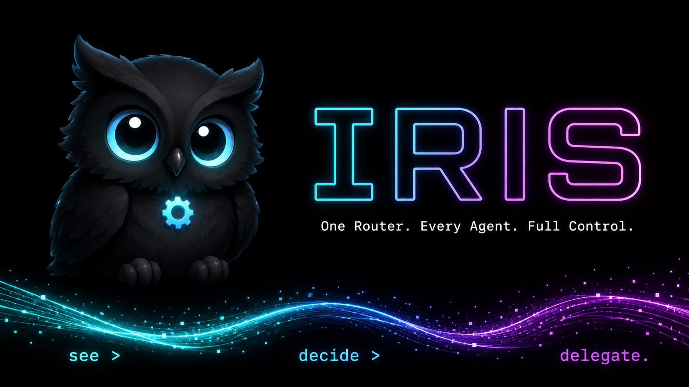
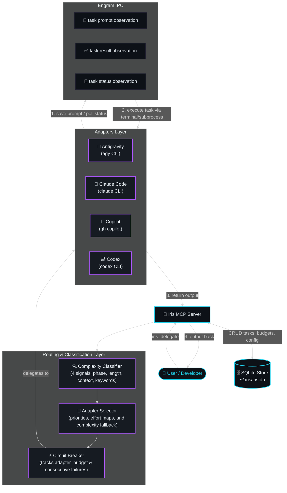

<div align="center">


**One router. Every agent. Full control.**

*Delegate to Claude, Gemini, Copilot, or Codex — with shared memory, SDD-aware routing, and fire-and-forget execution.*  
*see > decide > delegate.*

---

[Why Iris?](#why-iris) • [MCP Tools](#mcp-tools) • [Adapters](#adapters) • [Architecture](#architecture) • [Engram IPC Flow](#engram-ipc-flow) • [Quick Start](#quick-start) • [Configuration](#configuration) • [SDD Integration](#sdd-integration) • [Documentation](#documentation-ecosystem) • [Credits](#credits)

</div>

---

## Why Iris?

Most AI workflows are fragmented. Developers manually switch between different CLI clients, lose output files when a terminal tab closes, lack real-time visibility into multi-agent tasks, write ad-hoc prompts from scratch, and have no way to track daily token budgets across API endpoints.

**Iris** is a smart routing and orchestration MCP server that coordinates multiple AI agents under one interface, keeping memory persistent, budget tracked, and execution centralized.

| Without Iris | With Iris |
|---|---|
| Manual switching between CLI tools (`agy`, `claude`, `copilot`, `codex`) | Unified delegation interface with automatic routing based on task complexity |
| Lost output files and vanishing terminal histories | Fully documented session history, with every task stored locally in SQLite |
| No task visibility during long-running background runs | Real-time task tracking, terminal execution, and watcher status updates |
| Ad-hoc, inconsistent prompt templates written from scratch | Robust template system seeded by a meta-prompt and managed through Engram |
| Untracked daily token budgets and high API costs | Circuit breakers and daily token limits to prevent runaway loops and budget overruns |

---

## MCP Tools

Iris exposes a powerful set of Model Context Protocol (MCP) tools that enable any LLM agent to orchestrate and track multi-agent tasks:

| Tool | Description |
|---|---|
| `iris_delegate` | Unified entry point to score, plan, and delegate tasks to the appropriate adapter. |
| `iris_task` | Retrieves the complete details and execution results of a specific task by its ID. |
| `iris_status` | Shows the overall system health, daily token budget usage, and circuit breaker status per adapter. |
| `iris_history` | Lists execution history and allows searching past tasks, filtered by project or change name. |
| `iris_config` | Configures operational parameters, priorities, and budget limits for adapters. |
| `iris_setup` | Bootstraps the local environment, verifies schemas, registers models, and trusts workspace paths. |

---

## Adapters

Iris normalizes CLI commands for each underlying agent executor. The router delegates the parsed task based on its calculated complexity to the best-suited adapter:

| Adapter Name | CLI Command | Best For |
|---|---|---|
| **Antigravity (agy)** | `agy -p "{prompt}" --dangerously-skip-permissions` | Codebase exploration, background terminal runs, and general Gemini-native workflows. |
| **Claude Code (claude)** | `claude -p "{prompt}" --model {model} --effort {effort}` | Deep multi-file reasoning, specification drafting, and interactive code generation. |
| **Copilot (gh copilot)** | `gh copilot -p "{prompt}" --reasoning-effort {effort}` | Quick code queries, short inline changes, and fast diagnostics. |
| **Codex (codex)** | `codex exec -m {model} -c reasoning_effort="{effort}" "{prompt}"` | Batch code generation, scripted task automation, and direct file writes. |
| **Kilo (kilocode)** | `kilocode --model {model} "{prompt}"` | Lightweight targeted code edits and file changes. |
| **Cursor** | `cursor agent --model {model} "{prompt}"` | IDE-integrated code changes and refactoring. |
| **OpenCode** | `opencode run --model {model} "{prompt}"` | Open-source Zen model execution (no OpenRouter auth required). |

---

## Architecture

The following diagram illustrates how Iris acts as a central hub between the developer's agent session, the local database, the complexity-aware routing layer, and the underlying AI adapters communicating via Engram:



---

## Engram IPC Flow

For terminal-based adapters (like Antigravity), Iris utilizes an asynchronous, 5-step Inter-Process Communication (IPC) protocol mediated by Engram:

1. **Prompt Saved to Engram**: Iris saves the compiled task instruction to Engram as a new observation under the topic key `iris/task/{taskId}/prompt`. This yields a unique observation ID (`obsId`).
2. **Adapter Reads**: The adapter (e.g. Antigravity) is triggered in a separate window and reads the target observation (`obsId`) from Engram to obtain the complete task instruction.
3. **Adapter Writes Output**: The adapter executes the instruction and writes the generated result file to `~/.iris/tasks/{taskId}-output.txt`.
4. **Adapter Writes DONE Status**: Once execution is complete, the adapter writes the final status (`DONE:{taskId}`) to Engram under `iris/task/{taskId}/status` as the last step.
5. **Iris Polls and Returns**: Iris polls `iris/task/{taskId}/status` or watches the output file, reads the completed output, saves it to Engram, and returns the result to the caller.

---

## Quick Start

### Prerequisites

Before starting the setup, ensure that the following requirements are met in your system:

| Requirement | Purpose |
|---|---|
| **Node.js 22+** | Runtime environment for the Iris MCP server. |
| **SQLite (better-sqlite3)** | Local database engine to persist session state, task tracking, and budgets. |
| **Engram MCP Plugin** | Persistent shared memory layer to coordinate IPC and store logs. |
| **Supported AI CLIs** | At least one active adapter CLI (`agy`, `claude`, `gh copilot`, or `codex`). |

### Installation

Clone the repository and install dependencies locally:

```powershell
# 1. Clone the repository
git clone https://github.com/Geraldow/iris.git
cd iris

# 2. Install dependencies
npm install

# 3. Build the server
npm run build

# 4. Install Claude Code behavioral protocols
Copy-Item iris\prompts\CLAUDE.md -Destination "$env:USERPROFILE\.claude\CLAUDE.md"
```

### First Run

Initialize and verify the Iris operational state:

```powershell
# Run the setup script to verify paths and install dependencies
node scripts/setup.ts

# Register iris as an MCP server in Claude Code settings
# Add to ~/.claude/claude_desktop_config.json:
# { "mcpServers": { "iris": { "command": "node", "args": ["dist/index.js"] } } }
```

---

## Configuration

Iris parses incoming commands, evaluates complexity, and maps them to dynamic routing configurations. 

### Complexity Tier Routing Table

Total scores (4–12) are derived from the combination of SDD phase, length of instructions, context IDs, and specialized keywords:

| Complexity Level | Score Range | Primary Adapter | Target LLM Model |
|---|---|---|---|
| **LOW** | 4 – 7 | `antigravity` (agy) | `Gemini 3.5 Flash (Medium)` |
| **MEDIUM** | 8 – 10 | `antigravity` (agy) or `claude` | `Gemini 3.5 Flash (High)` or `Claude Sonnet 4.6 (Thinking)` |
| **HIGH** | 11 – 12 | `claude` or `antigravity` (agy) | `Claude Opus 4.6 (Thinking)` or `Gemini 3.1 Pro (High)` |

### CLI Configuration Examples

Configure system-wide behavior, token budgets, and adapter priorities directly through `iris_config`:

```powershell
# Enable or disable an adapter
iris_config set --adapter antigravity --enabled true

# Set priority levels for fallback chains (lower values take priority)
iris_config set --adapter claude --priority 5

# Set daily USD spending limit for an adapter
iris_config set --adapter copilot --budget 5.00
```

---

## SDD Integration

Iris natively hooks into the Spec-Driven Development (SDD) pipeline, allowing automated agent orchestration across all 8 SDD phases (`explore`, `propose`, `spec`, `design`, `tasks`, `apply`, `verify`, and `archive`).

### Phase Command Examples

```powershell
# 1. Explore Phase
iris_delegate --phase explore --instruction "Analyze how user permissions are structured in the billing module" --change billing-security

# 2. Spec Phase
iris_delegate --phase spec --instruction "Write delta specs for the invoice approval flow" --change billing-security --contextIds 1237,1255

# 3. Apply Phase (batch implementation)
iris_delegate --phase apply --instruction "Implement SQLite migrations and schema loader in src/store/db.ts" --change db-foundation --deliverable "db.ts"
```

---

## Documentation Ecosystem

Iris ships with a comprehensive documentation set organized under `docs/`:

| Document | Purpose |
|----------|---------|
| `AGENTS.md` | Odoo specialist agents — 7 roles (Architect, Modeler, Viewer, Tester, Reviewer, Ops, Observable) with Onion Model |
| `docs/01-PRD.md` | Product Requirements Document — vision, problem statement, requirements, engineering disciplines, roadmap |
| `docs/02-ADR.md` | Architecture Decision Records — 12 ADRs with context, decisions, consequences, and alternatives |
| `docs/03-ARCHITECTURE.md` | Technical architecture — components, data flow, protocols, security zones, resilience patterns |
| `docs/04-CONTRIBUTING.md` | Contribution guide — OCA standards, quality system, Reciprocal Apprenticeship methodology, SDD pipeline |
| `docs/05-SECURITY.md` | Security — 7-layer model, SSH/Token policies, audit trails, SDD security checklist |
| `docs/06-CHANGELOG.md` | Version history — Keep a Changelog format, 9 releases from v0.1.0-beta to v1.1.6 |
| `docs/07-TP.md` | Test Plan — 28 test cases across 8 test suites, CI pipeline, coverage targets |

> **Note:** Start with `AGENTS.md` for the agent system, then `docs/01-PRD.md` for product vision, and `docs/03-ARCHITECTURE.md` for technical details. The recommended reading order is: `AGENTS.md` → `01-PRD.md` → `03-ARCHITECTURE.md` → `04-CONTRIBUTING.md`.

---

## Credits

Iris is built on top of excellent open-source work and ecosystem partnerships:

- **[Model Context Protocol SDK](https://github.com/modelcontextprotocol)** — Standardized LLM-to-tool communication protocol.
- **[Engram](https://github.com/Gentleman-Programming/engram)** — Persistent team and session memory.
- **[Antigravity](https://github.com/GoogleDeepMind)** — Google DeepMind's agentic workspace runner.
- **[odoo-ai](https://github.com/Geraldow/odoo-ai)** — The ultimate Odoo agentic skills framework.
- Inspired by [gentle-ai](https://github.com/Gentleman-Programming/gentle-ai) — the framework that proved the pattern works.

---

<div align="center">
<sub>Inspired by the <a href="https://github.com/Geraldow/odoo-ai">odoo-ai</a> ecosystem — built with care for developer teams everywhere.</sub>
</div>
