# Reciprocal Apprenticeship: Aprendizaje Recíproco entre Desarrollador e IA para el Ecosistema Odoo

> **Versión:** 1.0.0  
> **Estado:** Documento de metodología — define el modelo de aprendizaje recíproco entre desarrollador e IA en el ecosistema iris.  
> **Última actualización:** 2026-06-10  
> **Autor:** Fairw — Systems Engineer, Senior Odoo Architect  
> **Depende de:** `ECOSYSTEM.md`, `ARCHITECTURE.md`, `SECURITY.md`, `RELIABILITY.md`  
> **Ingeniería relacionada:** Context Engineering (4), Prompt Engineering (2), SDD Engineering (7)

---

## Índice

1. [Abstract](#1-abstract)
2. [The 4 Pillars of Reciprocal Apprenticeship](#2-the-4-pillars-of-reciprocal-apprenticeship)
3. [The Learning Loop](#3-the-learning-loop)
4. [Technical Architecture: The 4-Phase Pipeline](#4-technical-architecture-the-4-phase-pipeline)
5. [How It Integrates with the SDD Pipeline](#5-how-it-integrates-with-the-sdd-pipeline)
6. [Best Practices & References](#6-best-practices--references)
7. [Comparison with Other Methodologies](#7-comparison-with-other-methodologies)
8. [Odoo-Specific Learning Dimensions](#8-odoo-specific-learning-dimensions)
9. [The Onion Model of Learning Progression](#9-the-onion-model-of-learning-progression)

---

## 1. Abstract

En junio de 2026, Josh Comeau publicó un análisis con datos contundentes: la IA es un **multiplicador de habilidad**, no un reemplazo. Los desarrolladores con fundamentos sólidos experimentaron un **+55% de velocidad** usando GitHub Copilot, mientras que aquellos sin fundamentos fueron **19-21% más lentos** que la línea base sin IA [Comeau, 2026]. Más alarmante aún: la duplicación de código aumentó 8x y el 90% de los bugs introducidos por IA son invisibles para el desarrollador que no comprende el código generado [Sonar, citado en Comeau, 2026].

Este hallazgo plantea una pregunta incómoda para la industria: **¿cómo aprenden los desarrolladores junior los fundamentos si la IA genera todo el código?**

Las metodologías tradicionales fallan aquí:
- **Pair Programming** requiere un senior disponible [Beck, 1999]
- **Cognitive Apprenticeship** necesita sesiones estructuradas con un experto [Collins, Brown & Newman, 1989]
- **Reciprocal Teaching** funciona en el aula, no en el flujo diario de desarrollo [Palincsar & Brown, 1984]

**Reciprocal Apprenticeship** (Aprendizaje Recíproco) es una metodología diseñada específicamente para el ecosistema Odoo donde la IA no solo genera código, sino que **exhibe su razonamiento**, **explica los fundamentos**, y **aprende del contexto de negocio** del desarrollador. Es una relación bidireccional: el desarrollador aprende Odoo; la IA aprende el dominio del proyecto.

Este documento define cómo el ecosistema **iris** (descrito en `ECOSYSTEM.md`) implementa esta metodología a través de su pipeline SDD, su sistema de skills, y su integración con CodeGraph y Engram (descritos en `ARCHITECTURE.md`).

---

## 2. The 4 Pillars of Reciprocal Apprenticeship

### 2.1 Human-First

El desarrollador decide **QUÉ** construir; la IA asiste **CÓMO**.

```
Desarrollador: "Necesito un campo 'supervisor' en las órdenes de venta"
       ↓
IA: "Entendido. Para implementar un Many2one a res.users en sale.order,
    necesitamos: (1) campo Python, (2) vista form, (3) seguridad.
    ¿A qué grupo de usuarios debe visible este campo?"
```

El desarrollador mantiene el control conceptual. La IA no propone features — ejecuta decisiones con transparencia.

### 2.2 Fundamentals-First

Cada output de la IA incluye una explicación de los conceptos Odoo subyacentes. No código mágico. Código entendido.

```python
# ❌ Approach tradicional de IA:
supervisor_id = fields.Many2one('res.users', string='Supervisor')

# ✅ Reciprocal Apprenticeship:
supervisor_id = fields.Many2one(
    'res.users',
    string='Supervisor',
    help='Usuario responsable de supervisar esta orden'
)
# 📖 FUNDAMENTOS:
# - Many2one crea una FK: sale_order.supervisor_id → res_users.id
# - El ORM maneja JOINs automáticos en búsquedas
# - Sin domain, cualquier usuario es seleccionable
# - Para restringir, necesitamos un domain o record rule
# 📎 Docs: developer/reference/backend/orm.html#fields
```

### 2.3 Transparency

La IA no oculta su trabajo. Cada cambio incluye:

- 🐍 **Código generado** con explicación línea por línea
- 🖥️ **Ruta de navegación en UI** (qué menú, qué pestaña, qué campo)
- 🧪 **Ruta de test** (qué hacer en UI para probar, qué assertions escribir)
- 🔗 **Mapa de relaciones** (qué otros modelos/views se impactan)
- ⚠️ **Consideraciones de seguridad** (permisos, sudo(), SQL injection)

### 2.4 Reciprocal

Ambos aprenden. La bidireccionalidad es la clave diferenciadora:

| Rol | Aprende |
|------|---------|
| **Desarrollador** | Fundamentos de Odoo: ORM, vistas, seguridad, herencia, OWL |
| **IA (iris)** | Contexto de negocio del proyecto: reglas de dominio, excepciones, nombres de campos locales, políticas de la empresa |

Cuando el desarrollador corrige a la IA ("este campo no debe ser visible para usuarios de inventario"), ese conocimiento se persiste en Engram (`ARCHITECTURE.md` §2 — Engram como única fuente de verdad) y la IA lo reutiliza en el futuro. El sistema mejora con cada interacción.

---

## 3. The Learning Loop

### Diagrama del Ciclo de Aprendizaje

```mermaid
%%{init: {'theme': 'dark', 'themeVariables': {'primaryColor': '#1f6feb', 'primaryTextColor': '#ffffff', 'primaryBorderColor': '#22d3ee', 'lineColor': '#8b949e'}}}%%
flowchart TD
    REQ[Developer Request\n"Solicitud de cambio"] --> GEN[AI generates code\n+ explanation]
    GEN --> UI[AI provides UI nav route\n+ test path]
    UI --> INTERACT[Developer interacts\nwith Odoo UI]
    INTERACT --> REFINE[Developer refines\nwith new understanding]
    REFINE --> LEARN[Both learn\nDeveloper → Odoo fundamentals\nAI → Business context]
    LEARN --> PERSIST[Knowledge persisted\nin Engram + Learning Artifact]
    PERSIST --> REQ

    style REQ fill:#1e293b,stroke:#22d3ee,stroke-width:2px
    style GEN fill:#0f172a,stroke:#a855f7,stroke-width:2px
    style LEARN fill:#1e293b,stroke:#10b981,stroke-width:2px
    style PERSIST fill:#0f172a,stroke:#f59e0b,stroke-width:2px
```

El ciclo es auto-sostenido. Cada iteración profundiza el conocimiento del desarrollador y enriquece el contexto de la IA. El **Learning Artifact** (ver §4.4) es el entregable tangible de cada ciclo — queda archivado en Engram para consulta futura.

### Principios Operativos del Loop

1. **Sin código sin explicación**: Toda generación de código incluye su fundamento conceptual
2. **Sin cambio sin ruta UI**: El desarrollador siempre sabe dónde ver el resultado en pantalla
3. **Sin interacción sin refinamiento**: El desarrollador toca Odoo, ve el resultado, y ajusta
4. **Sin ciclo sin persistencia**: Cada iteración deja un artifact en Engram (`SECURITY.md` §6.2)

---

## 4. Technical Architecture: The 4-Phase Pipeline

El pipeline técnico que implementa Reciprocal Apprenticeship en iris se apoya en **CodeGraph** (`ARCHITECTURE.md` §2.4) para el análisis estático y en **Engram** (`ARCHITECTURE.md` §2.2) para la persistencia.

### 4.1 Phase 1: Static Analysis (CodeGraph)

CodeGraph escanea el módulo Odoo y construye un **UI Map** completo:

```
📊 UI MAP generado para sale.order:
├── Models
│   └── sale.order (model: 162)
│       ├── Fields: name, partner_id, date_order, amount_total, ...
│       ├── Relations: sale.order.line (O2m), res.partner (M2o)
│       └── Computed: amount_total, state
├── Views
│   ├── sale.order.form (id: 123)
│   │   ├── Tabs: ["General", "Otra Información", "Notas"]
│   │   ├── Section "Supervisión" → tab "Otra Información"
│   │   └── Smart Buttons: [Órdenes(12), Facturas(3)]
│   └── sale.order.tree (id: 124)
├── Menus
│   └── Ventas → Órdenes → Órdenes de Venta (action: 456)
├── Security
│   ├── ACL: sale.order → sales_team.group_sale_salesman (CRUD)
│   └── Record Rules: multi-company, own documents only
└── URL Patterns
    └── /web#action=456&model=sale.order&view_type=form
```

Este mapa es la materia prima del pipeline. iris lo construye una vez por módulo y lo cachea en Engram, actualizándolo solo cuando el módulo cambia.

### 4.2 Phase 2: UI Navigation Route Generation

Dado un cambio solicitado, iris consulta el UI Map y genera una ruta de navegación precisa:

```
📍 RUTA DE NAVEGACIÓN:
1. Menú: Ventas → Órdenes → Órdenes de Venta
2. Abre orden existente (cualquiera en estado "Borrador")
3. Pestaña: "Otra Información" (tercera pestaña, ver view sale.order.form)
4. Sección: "Supervisión"
5. Campo: Supervisor [▼] (Many2one a res.users)
🔗 URL directa: /web#action=456&model=sale.order&view_type=form&id=42
⚡ Smart buttons relacionados: [Órdenes(12), Facturas(3)]
```

Esta ruta no es genérica — se genera dinámicamente del análisis estático de CodeGraph, reflejando la estructura exacta del módulo en la versión actual del proyecto.

### 4.3 Phase 3: Dynamic Observation

Mientras el desarrollador navega por la UI de Odoo, iris observa (a través del bridge descrito en `ARCHITECTURE.md` §2.2):

```
🔍 Observación activa:
├── URL change → /web#action=456&model=sale.order&view_type=form&id=42
│   └── Infiere: view_type=form, model=sale.order, record=42
├── Click detected → field=supervisor_id, widget=many2one
│   └── Infiere: usuario explorando el campo generado
├── Error detected → "Field 'x_supervisor' does not exist"
│   └── Gatilla: learning moment → "El campo se llama supervisor_id, no x_supervisor"
└── Save detected → record updated successfully
    └── Confirma: el cambio funciona como se esperaba
```

Los errores son especialmente valiosos — son **learning moments** que el sistema captura, explica y persiste para evitar que se repitan.

### 4.4 Phase 4: Learning Artifact Generation

Para cada cambio, iris genera un **Learning Artifact** completo:

```yaml
# Learning Artifact: add_supervisor_field
## 🐍 Generated Code
supervisor_id = fields.Many2one(
    'res.users',
    string='Supervisor',
    domain=[('share', '=', False)],
    help='Usuario responsable de supervisar esta orden'
)

## 📖 Fundamentals Explanation
- Many2one: crea FK en PostgreSQL (sale_order.supervisor_id → res_users.id)
- domain: filtra solo usuarios internos (share=False excluye portal/public)
- help: se muestra como tooltip en UI — documenta el propósito
- 📎 Odoo Docs 18.0: developer/reference/backend/orm.html#fields
- 📎 OCA Guidelines: github.com/OCA/maintainer-tools

## 🖥️ UI Navigation Route
📍 Ventas → Órdenes → Órdenes de Venta
   → Abrir orden
   → Pestaña "Otra Información"
   → Sección "Supervisión"
   → Campo "Supervisor [▼]"

## 🧪 Test Path (UI)
1. Ir a Ventas → Órdenes → Órdenes de Venta
2. Crear nueva orden o abrir existente
3. Ir a pestaña "Otra Información"
4. Verificar campo "Supervisor" visible
5. Seleccionar usuario y guardar
6. Verificar que el valor persiste al recargar

## 🧪 Test Path (Code)
```python
def test_supervisor_field(self):
    order = self.env['sale.order'].create({
        'partner_id': self.partner.id,
        'supervisor_id': self.user.id,
    })
    self.assertEqual(order.supervisor_id, self.user)
    self.assertIn('supervisor_id', order.fields_get())
```

## 🔗 Impacted Relations
- Model: sale.order → nuevo campo
- View: sale.order.form → nueva sección en tab "Otra Información"
- Security: sale.order → no requiere cambios ACL (hereda permisos)
- Report: sale.order.report → si imprime supervisor, actualizar

## ⚠️ Security Considerations
- Unrestricted: cualquier usuario con acceso a sale.order puede asignar supervisor
- Para restringir: agregar record rule o field-level security
- sudo(): no necesario (campo simple sin dependencias)
```

Este artifact se guarda en Engram bajo `sdd/{change}/learning-artifact` y queda disponible para consulta futura.

---

## 5. How It Integrates with the SDD Pipeline

El pipeline SDD descrito en `ECOSYSTEM.md` §4 es el vehículo natural para Reciprocal Apprenticeship. Cada fase se enriquece con una dimensión de aprendizaje:

| SDD Phase | Reciprocal Enhancement | Learning Output |
|-----------|----------------------|-----------------|
| **explore** | IA explica **RATIONALE** de la exploración (por qué este modelo, por qué este approach) | El desarrollador entiende el "por qué" de la arquitectura, no solo el "qué" |
| **propose** | IA muestra **ALTERNATIVAS consideradas** con tradeoffs explícitos | El desarrollador aprende a evaluar opciones arquitectónicas |
| **spec** | Requirements escritos con **referencias explícitas a fundamentos** | Cada spec references Odoo docs, OCA guidelines, o patterns conocidos |
| **design** | Architecture decisions incluyen sección **"What you'd learn"** | El ADR explica el concepto Odoo subyacente (herencia de vista, seguridad multi-compañía, etc.) |
| **tasks** | Cada task tiene campo **"Fundamentos a aprender"** | Las tareas no son solo acciones — son oportunidades de aprendizaje |
| **apply** | Código + **Learning Artifact** generados juntos | El artifact se produce automáticamente con cada cambio |
| **verify** | Verificación incluye validación **CONCEPTUAL** (no solo funcional) | Se verifica que el desarrollador entiende lo que el código hace |
| **archive** | Archivado con **"Lessons Learned"** para referencia futura | El conocimiento no se pierde — se consolida en Engram |

### Ejemplo: Fase `apply` enriquecida

```yaml
## SDD Phase: apply
## Task: Add supervisor field to sale.order

## 🎯 Learning Objectives for this task:
1. Entender cómo Many2one crea FK en PostgreSQL
2. Aprender la diferencia entre domain y record rules
3. Saber dónde se renderiza el campo en la vista form
4. Conocer los smart buttons y su relación con action windows

## 📚 Concepts to learn before starting:
- Odoo Fields: Many2one vs Many2many vs One2many
- View inheritance: xpath, position, attribute
- Security inheritance: sale.order ACL → new field inherits
```

---

## 6. Best Practices & References

### 6.1 Best Practices para Reciprocal Apprenticeship

| # | Práctica | Descripción | Fundamento |
|---|----------|-------------|------------|
| 1 | **Nunca código sin contexto** | Todo bloque de código generado incluye explicación, ruta UI, y consideraciones de seguridad | [Comeau, 2026] — el 90% de bugs invisibles ocurren cuando el developer no entiende el código |
| 2 | **Preguntar antes de asumir** | La IA pregunta el contexto de negocio antes de proponer soluciones | [Biswas et al., 2005] — enseñar requiere entender al estudiante |
| 3 | **Exhibir alternativas** | La IA muestra al menos 2 alternativas con tradeoffs | [Collins, Brown & Newman, 1989] — el experto hace visible su razonamiento |
| 4 | **Errores son aprendizaje** | Cuando el desarrollador comete un error, la IA lo explica, no lo corrige silenciosamente | [Palincsar & Brown, 1984] — la corrección es una oportunidad de enseñanza |
| 5 | **Persistir cada ciclo** | Todo learning artifact se guarda en Engram para consulta futura | ADR-002 en `ARCHITECTURE.md` — Engram como única fuente de verdad |
| 6 | **Progresión en capas** | El desarrollador avanza por el Onion Model (§9) a su propio ritmo | [Beck, 1999] — XP promueve aprendizaje incremental |
| 7 | **Fundamentos > frameworks** | Antes de enseñar OWL, enseñar JavaScript. Antes de enseñar herencia de vista, enseñar XML | [Comeau, 2026] — fundamentos sólidos son la diferencia entre +55% y -21% |
| 8 | **Validación bidireccional** | El desarrollador valida el código; la IA valida la comprensión del desarrollador | [Bret Victor, 2011] — aprendizaje a través de manipulación directa y feedback |

### 6.2 Referencias

| Referencia | Cita | Relevancia |
|------------|------|------------|
| **Comeau, J.** (2026). "The Post-Developer Era". joshwcomeau.com. | `+55%` velocidad con Copilot para devs con fundamentos; `19-21%` más lentos sin fundamentos; `8x` aumento en duplicación de código; `90%` bugs invisibles (Sonar). | Fundamento empírico de la metodología — la justificación de por qué fundamentals-first es crítico. |
| **Collins, A., Brown, J.S. & Newman, S.E.** (1989). "Cognitive Apprenticeship: Making Thinking Visible". *American Educator*. | El experto exhibe su proceso de razonamiento, no solo el resultado. Tres métodos: modeling, coaching, fading. | Base teórica para la transparencia en la generación de código — la IA debe mostrar su razonamiento. |
| **Palincsar, A.S. & Brown, A.L.** (1984). "Reciprocal Teaching of Comprehension-Fostering and Comprehension-Monitoring Activities". *Cognition and Instruction*, 1(2), 117-175. | Tutor y alumno intercambian roles. El alumno aprende enseñando. | Base teórica del "Reciprocal" — el desarrollador enseña contexto de negocio a la IA mientras aprende fundamentos. |
| **Victor, B.** (2011). "Explorable Explanations". worrydream.com. | El aprendizaje ocurre cuando el alumno puede manipular directamente el sistema y ver el feedback inmediato. | Base para la Dynamic Observation (Phase 3) — el desarrollador ve el cambio en UI inmediatamente. |
| **Beck, K.** (1999). *Extreme Programming Explained*. Addison-Wesley. | Pair Programming: un navigator (estrategia) y un driver (ejecución). Roles intercambiables. | Analogía directa: el desarrollador es el navigator; la IA es el driver. Pero aquí la IA también enseña. |
| **Biswas, G., Leelawong, K., Schwartz, D. & Vye, N.** (2005). "Learning by Teaching: A New Agent Paradigm for Educational Software". *AIED*. | Agentes que aprenden mientras enseñan. El agente mejora su modelo del dominio al ser corregido por el alumno. | Base para la reciprocidad — iris aprende del contexto del proyecto cada vez que el desarrollador lo corrige. |
| **DORA** (2024). *Google Cloud DevOps Report*. | AI mejora: `+2.1%` productividad, `+3.4%` calidad de código, `+7.5%` calidad de documentación. | Contexto de la industria — la IA es positiva pero requiere estructura para maximizar beneficios. |
| **METR** (2025). "Independent Study on AI-Assisted Development". | Developers experimentados fueron `19-21%` más lentos en codebases complejas con IA. | Corrobora Comeau — la complejidad del dominio (como Odoo) magnifica el efecto negativo de la falta de fundamentos. |
| **Odoo Documentation** (18.0). developer/reference/backend/orm.html, views.html, security.html. | Documentación oficial de Odoo 18.0 para ORM, vistas y seguridad. | Referencia técnica principal para learning artifacts. |
| **OCA Guidelines**. github.com/OCA/maintainer-tools. | Convenciones de la Odoo Community Association para naming, estructura de módulos, y calidad. | Estándar de calidad para todo código generado — OCA compliance es mandatory. |

---

## 7. Comparison with Other Methodologies

| Methodology | Focus | Teacher | When | How learning happens |
|-------------|-------|---------|------|---------------------|
| **Pair Programming** [Beck, 1999] | Code quality | Senior dev | Real-time | El junior observa al senior escribir código y hace preguntas |
| **Cognitive Apprenticeship** [Collins, Brown & Newman, 1989] | Reasoning process | Expert | Structured sessions | El experto exhibe su razonamiento en voz alta mientras trabaja |
| **Reciprocal Teaching** [Palincsar & Brown, 1984] | Comprehension | Teacher | Classroom | Tutor y alumno se turnan para enseñar el contenido |
| **Code Review** | Code quality | Peers | Post-commit | El revisor explica qué mejorar y por qué |
| **Mentoring tradicional** | Career growth | Senior dev | Periodic sessions | Conversaciones estructuradas sobre tecnología y carrera |
| **Reciprocal Apprenticeship (iris)** | **Fundamentos + Código + UI** | **AI + Odoo** | **Real-time, every change** | La IA genera código + explicación + ruta UI; el developer enseña contexto de negocio |

### What Makes Reciprocal Apprenticeship Unique

1. **Escala a 100% de los cambios**: No requiere sesiones especiales — cada interacción con iris es una oportunidad de aprendizaje.
2. **Bidireccionalidad real**: La IA no es solo profesora — también es alumna del contexto de negocio del proyecto.
3. **Integración con el flujo de trabajo**: No es una actividad separada del desarrollo — es el desarrollo mismo.
4. **UI como laboratorio**: El desarrollador no solo lee código — navega Odoo, ve el cambio en vivo, y refina con comprensión.
5. **Persistencia del conocimiento**: Cada aprendizaje queda registrado en Engram y es recuperable (`RELIABILITY.md` §5 — Sin Estado Local en iris).

---

## 8. Odoo-Specific Learning Dimensions

Odoo es un ecosistema particularmente rico para el aprendizaje porque abarca múltiples dimensiones técnicas que se entrelazan. Reciprocal Apprenticeship las cubre todas:

| Dimension | What developer learns | How iris teaches it | Learning Artifact example |
|-----------|----------------------|-------------------|--------------------------|
| **ORM** | Field types (Char, Integer, Float, Monetary, Many2one, One2many, Many2many), relations, computed fields, `@api.depends`, `_sql_constraints`, indexes | Cada field generation incluye: SQL type equivalente, comportamiento de FK, implicaciones de performance | `📖 Many2one → FK en PostgreSQL. El JOIN es automático. Sin index explícito, PostgreSQL indexa FKs automáticamente.` |
| **Views** | XML structure, `field`, `group`, `notebook`, `page`, `xpath` inheritance, `position` attributes, widget options (`statusbar`, `badge`, `monetary`, `handle`, `many2one_tags`) | Cada view change incluye: screenshot equivalence ("esto se ve así en UI"), widget alternatives | `📖 position='after' inserta después del nodo. position='attributes' modifica atributos. position='replace' reemplaza.` |
| **Security** | `ir.model.access.csv` (ACL), `ir.rule` (record rules), `res.groups`, field-level security, `sudo()` governance | Cada security change incluye: vulnerability explanation ("sin esta regla, un usuario de inventario podría..."), attack scenario | `⚠️ Sin record rule multi-company, un usuario de Compañía A puede ver datos de Compañía B.` |
| **Inheritance** | `_inherit` vs `_name`, `_inherits` (delegation), view inheritance via `inherit_id`, `xpath`, `position` | Cada herencia incluye: class hierarchy diagram, MRO (Method Resolution Order) explanation | `📖 _inherit='sale.order' → misma tabla. _name='sale.order' + _inherit → tabla nueva + copia de campos.` |
| **Controllers** | HTTP routing, `@http.route`, auth types (`user`, `public`, `none`), request handling, CORS | Cada controller incluye: URL pattern, method type (GET/POST), auth implications | `📖 auth='user' → requiere sesión activa. auth='public' → accessible sin login (cuidado con datos sensibles).` |
| **QWeb Reports** | Template syntax (`t-field`, `t-out`, `t-esc`, `t-foreach`), paperformat, external layout, barcodes, translations | Cada report change incluye: visual rendering explanation, paperformat options, font considerations | `📖 t-field renderiza con formato según el tipo de campo (moneda, fecha, etc.). t-out escapa HTML automáticamente.` |
| **OWL (Frontend)** | Component lifecycle, hooks (`onMounted`, `onWillUpdateProps`, `onWillStart`), reactive props, services, RPC calls | Cada OWL component incluye: lifecycle flow, state management pattern, RPC endpoint mapping | `📖 onMounted → fetch initial data. onWillUpdateProps → react to prop changes. useService → dependency injection.` |
| **Testing** | `TransactionCase`, `HttpCase`, `SavepointCase`, assertions, mock data, `post_install` tag, query count assertions | Cada test incluye: what it proves, what edge cases remain uncovered, performance implications | `🧪 Este test prueba CRUD básico. Edge cases no cubiertos: supervisor_id = False, concurrent writes.` |
| **Odoo.sh Ops** | Builds, SSH, logs, backups, scaling, monitoring, CI/CD | Cada ops task incluye: architecture rationale ("por qué el build cambia de URL"), failure modes | `📖 El build_id cambia en cada push. iris descubre la URL dinámicamente via API REST de Odoo.sh.` |
| **Performance** | N+1 queries, `_read_group`, prefetching, batch operations, index usage, `@api.depends` optimization | Cada optimization incluye: before/after query count, EXPLAIN ANALYZE output interpretation | `📖 Sin prefetching: 1 query para orders + N queries para partners. Con prefetching: 2 queries totales.` |
| **Data Migration** | `pre-migrate.py`, `post-migrate.py`, `end-migrate.py`, data transforms, XMLIDs, noupdate records | Cada migration script incluye: version delta, rollback plan, data integrity checks | `📖 post-migrate.py → se ejecuta después de instalar módulos. Útil para transformar datos existentes.` |

---

## 9. The Onion Model of Learning Progression

El aprendizaje en Reciprocal Apprenticeship no es binario (sabe / no sabe) — es un proceso en capas que el desarrollador atraviesa progresivamente:

```
                    ╔═══════════════════════════╗
                    ║     🧅 Nivel 4            ║
                    ║   Enseñar a otros         ║
                    ║   (iris aprende del dev)  ║
                    ╚═══════════════════════════╝
                    ╔═══════════════════════════╗
                    ║     🧅 Nivel 3            ║
                    ║   Crear código nuevo      ║
                    ║   con supervisión reducida ║
                    ╚═══════════════════════════╝
                    ╔═══════════════════════════╗
                    ║     🧅 Nivel 2            ║
                    ║   Modificar código        ║
                    ║   generado con comprensión ║
                    ╚═══════════════════════════╝
                    ╔═══════════════════════════╗
                    ║     🧅 Nivel 1            ║
                    ║   Leer y entender         ║
                    ║   código + explicación     ║
                    ╚═══════════════════════════╝
```

### Descripción de cada nivel

#### 🧅 Nivel 1: Leer y entender (Período de incubación)

El desarrollador **lee código generado** con las explicaciones de iris. No escribe código nuevo. Navega la UI de Odoo para ver dónde vive cada cambio.

```
🔰 Indicadores de logro:
  - Puede explicar qué hace un campo Many2one
  - Sabe dónde encontrar el campo en la UI
  - Entiende la diferencia entre form view y tree view
  - Reconoce un xpath de herencia
```

#### 🧅 Nivel 2: Modificar con comprensión

El desarrollador **modifica código generado**: cambia un `domain`, agrega un `widget`, ajusta una posición de xpath. iris revisa y explica por qué el cambio funciona o no.

```
🔰 Indicadores de logro:
  - Modifica un domain sin romper la lógica
  - Agrega un campo existente a una vista sin ayuda
  - Cambia el tipo de widget (statusbar → badge)
  - Sabe cuándo necesita sudo() y cuándo no
```

#### 🧅 Nivel 3: Crear con supervisión reducida

El desarrollador **escribe código nuevo** desde cero con iris en rol de revisor, no generador.

```
🔰 Indicadores de logro:
  - Crea un modelo nuevo con sus campos y relaciones
  - Escribe una vista form completa desde cero
  - Define reglas de seguridad (ACL + record rules)
  - Implementa un wizard con transient model
```

#### 🧅 Nivel 4: Enseñar a otros

El desarrollador **corrige a iris** — le enseña el contexto de negocio del proyecto. Este es el nivel donde la reciprocidad se completa: el desarrollador tiene suficientes fundamentos Odoo para decir "esto no se hace así" o "en este proyecto usamos esta convención".

```
🔰 Indicadores de logro:
  - Iris comete un error y el developer lo detecta antes de ver el código
  - El developer sugiere una mejor alternativa a la que iris propuso
  - El developer escribe learning artifacts para otros miembros del equipo
  - Iris mejora su precisión contextual porque el developer la corrige
```

### Diagrama de Progresión

```mermaid
%%{init: {'theme': 'dark', 'themeVariables': {'primaryColor': '#1f6feb', 'primaryTextColor': '#ffffff', 'primaryBorderColor': '#22d3ee', 'lineColor': '#8b949e'}}}%%
flowchart LR
    subgraph N1 ["Nivel 1: Leer"]
        L1_READ[Leer código generado\n+ explicación]
        L1_NAV[Navegar UI de Odoo\npara ver cambios]
    end

    subgraph N2 ["Nivel 2: Modificar"]
        L2_EDIT[Modificar campos.\ndomains, widgets]
        L2_REVIEW[iris revisa y explica\npor qué funciona/no]
    end

    subgraph N3 ["Nivel 3: Crear"]
        L3_NEW[Crear modelos.\nvistas, security desde cero]
        L3_REVIEW[iris solo revisa.\nno genera]
    end

    subgraph N4 ["Nivel 4: Enseñar"]
        L4_CORRECT[Corregir a iris\ncontexto de negocio]
        L4_ARTIFACT[Escribir learning artifacts\npara el equipo]
    end

    L1_READ --> L1_NAV
    L1_NAV --> L2_EDIT
    L2_EDIT --> L2_REVIEW
    L2_REVIEW --> L3_NEW
    L3_NEW --> L3_REVIEW
    L3_REVIEW --> L4_CORRECT
    L4_CORRECT --> L4_ARTIFACT

    style N1 fill:#0f172a,stroke:#64748b,stroke-width:1px
    style N2 fill:#1e293b,stroke:#64748b,stroke-width:1px
    style N3 fill:#0f172a,stroke:#64748b,stroke-width:1px
    style N4 fill:#1e293b,stroke:#64748b,stroke-width:1px
```



### Cómo iris detecta el nivel actual

iris no asume el nivel — lo detecta observando el comportamiento del desarrollador:

| Señal | Nivel inferido |
|-------|---------------|
| El developer pregunta "¿qué significa Many2one?" | 🧅 Nivel 1 |
| El developer dice "cambia el domain a solo usuarios activos" | 🧅 Nivel 2 |
| El developer escribe `supervisor_id = fields.Many2one(...)` sin ayuda | 🧅 Nivel 3 |
| El developer dice "esto no funciona porque en Odoo 18 los `attrs` se evalúan diferente" | 🧅 Nivel 4 |

La IA ajusta automáticamente el nivel de detalle de sus explicaciones según el nivel detectado, siguiendo el principio de **fading** de Collins, Brown & Newman [1989]: a medida que el desarrollador progresa, la IA reduce gradualmente el soporte.

---

## Apéndice A: Glosario

| Término | Definición |
|---------|------------|
| **Learning Artifact** | Entregable de cada ciclo de Reciprocal Apprenticeship — incluye código, explicación, ruta UI, test path, relaciones impactadas, y consideraciones de seguridad |
| **UI Map** | Mapa estático de un módulo Odoo generado por CodeGraph — modelos, vistas, menús, acciones, seguridad, URLs |
| **Dynamic Observation** | Monitoreo en tiempo real de la navegación del desarrollador en Odoo UI para inferir aprendizaje y detectar errores |
| **Learning Moment** | Oportunidad de aprendizaje gatillada por un error del desarrollador en la UI — iris lo captura, explica, y persiste |
| **Fading** | Reducción gradual del soporte de la IA a medida que el desarrollador progresa en el Onion Model |
| **Onion Model** | Modelo de progresión en 4 capas (Leer → Modificar → Crear → Enseñar) que describe la madurez del desarrollador |
| **Reciprocity** | Característica central de la metodología: ambas partes aprenden. El desarrollador aprende fundamentos Odoo; la IA aprende contexto de negocio |

---

## Apéndice B: Comandos Relacionados en iris

```bash
# Solicitar un learning artifact explícito
iris> tool: learning-artifact --change add-supervisor-field

# Ver el nivel actual del desarrollador (inferido)
iris> tool: apprentice-level

# Ver historial de learning moments
iris> tool: learning-history

# Solicitar explicación de un concepto Odoo
iris> tool: explain-odoo --concept "many2one vs one2many"

# Generar ruta UI para un cambio existente
iris> tool: ui-route --change add-supervisor-field

# Forzar un nivel específico de explicación
iris> tool: set-explanation-level --level 1  # más detalle
iris> tool: set-explanation-level --level 4  # menos detalle, más autonomía

# Ver todos los learning artifacts archivados
iris> tool: learning-artifacts list
```

---

*Este documento define la metodología Reciprocal Apprenticeship para el ecosistema iris. Es complementario a `ECOSYSTEM.md` (visión general del ecosistema), `ARCHITECTURE.md` (decisiones técnicas y contratos), `SECURITY.md` (seguridad del ecosistema), y `RELIABILITY.md` (confiabilidad y recuperación). Cualquier cambio a esta metodología requiere una propuesta SDD y aprobación explícita.*
