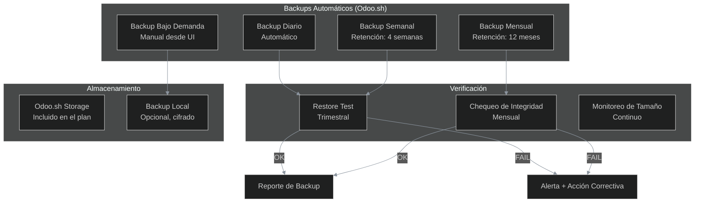
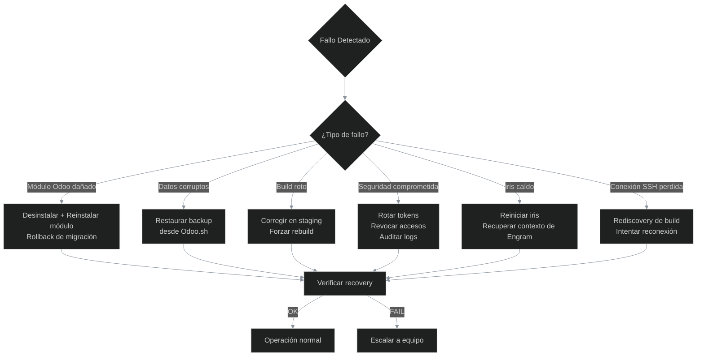
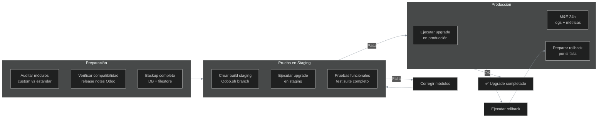
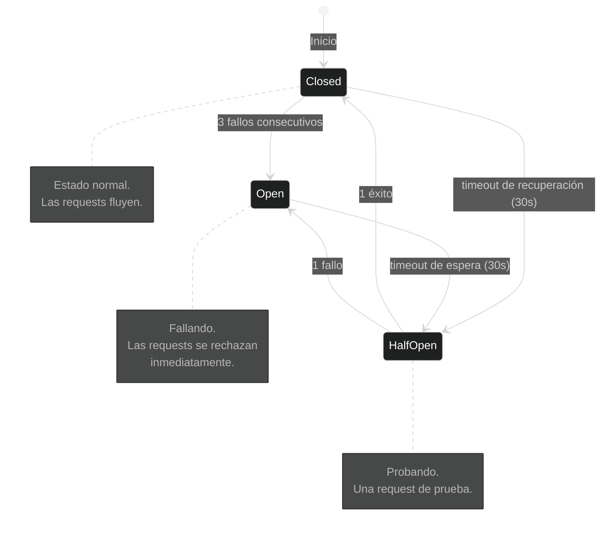
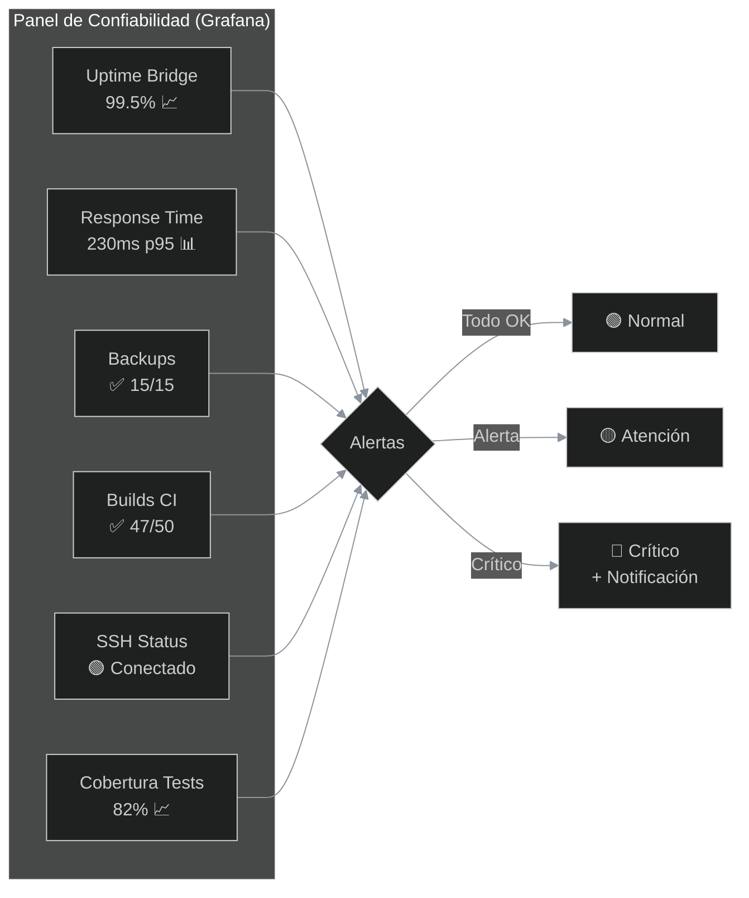

# iris — Confiabilidad del Ecosistema Odoo

> **Versión:** 1.0.0  
> **Última actualización:** 2026-06-10  
> **Depende de:** `ECOSYSTEM.md`, `ARCHITECTURE.md`  
> **Ingeniería relacionada:** Reliability Engineering (13)

---

## Índice

1. [Principios de Confiabilidad](#1-principios-de-confiabilidad)
2. [Estrategia de Backups](#2-estrategia-de-backups)
3. [Recuperación ante Desastres](#3-recuperación-ante-desastres)
4. [Upgrades y Migraciones](#4-upgrades-y-migraciones)
5. [Resiliencia de iris](#5-resiliencia-de-iris)
6. [Monitoreo de Confiabilidad](#6-monitoreo-de-confiabilidad)
7. [Runbooks](#7-runbooks)

---

## 1. Principios de Confiabilidad

| # | Principio | Descripción |
|---|---|---|
| 1 | **Diseño para Falla** | Todo componente puede fallar. El sistema debe degradarse gracefulmente, no colapsar. |
| 2 | **Recuperación Automática** | Los fallos transitorios (timeout, conexión perdida) se manejan con retry automático. |
| 3 | **Datos Seguros** | Los backups se prueban periódicamente. Un backup no verificado no es un backup. |
| 4 | **Rollback Siempre Posible** | Todo cambio debe poder revertirse en producción sin pérdida de datos. |
| 5 | **Sin Estado Local en iris** | iris no guarda estado en disco. Todo se persiste en Engram. Si iris se cae, al reiniciar recupera el contexto. |
| 6 | **Monitoreo Proactivo** | No esperar a que algo falle. Las métricas de confiabilidad se monitorean en tiempo real. |

---

## 2. Estrategia de Backups

### Diagrama de Ciclo de Backups



*El ciclo de backups de Odoo.sh es automático. Diariamente se genera un backup completo de la base de datos. Semanalmente se retienen los últimos 4 backups. Mensualmente se retienen los últimos 12. Adicionalmente, se pueden generar backups bajo demanda desde la UI de Odoo.sh. La **verificación** es el paso crítico: mensualmente se chequea la integridad del backup, y trimestralmente se hace un restore real en un entorno de prueba. Si el restore falla, se genera una alerta y se toma acción correctiva.*

### 2.1 Backups Automáticos (Odoo.sh)

| Tipo | Frecuencia | Retención | Contenido |
|---|---|---|---|
| Diario | Cada 24h | 7 días | DB completa + filestore |
| Semanal | Cada 7 días | 4 semanas | DB completa + filestore |
| Mensual | Cada 30 días | 12 meses | DB completa + filestore |
| Bajo demanda | Manual | Hasta eliminación | DB completa + filestore |

### 2.2 Backups desde iris

```bash
# Listar backups disponibles
iris> tool: odoo-backups list

# Descargar backup
iris> tool: odoo-backups download --id 12345 --output ./backups/

# Restaurar en entorno de prueba
iris> tool: odoo-backups restore --id 12345 --target staging

# Verificar integridad de backup
iris> tool: odoo-backups verify --id 12345
```

---

## 3. Recuperación ante Desastres

### Diagrama de Escenarios de Recuperación



*El árbol de decisión para recuperación ante desastres. Cada tipo de fallo tiene un procedimiento específico. Para **módulo dañado**: desinstalar y reinstalar o hacer rollback de migración. Para **datos corruptos**: restaurar backup desde Odoo.sh. Para **build roto**: corregir en staging y forzar rebuild. Para **seguridad comprometida**: rotar tokens, revocar accesos, auditar logs. Para **iris caído**: reiniciar y recuperar contexto de Engram (sin pérdida de estado). Para **conexión SSH perdida**: rediscovery automático del build.*

### 3.1 Procedimiento: Restaurar Backup

```bash
# 1. Listar backups disponibles
curl -H "Authorization: Bearer $ODOO_SH_TOKEN" \
  https://www.odoo.sh/api/1/projects/corporacion-benest/branches/main/backups

# 2. Restaurar backup en staging (desde iris)
iris> tool: odoo-backups restore --id BACKUP_ID --target staging

# 3. Verificar integridad de datos
iris> tool: odoo-psql-query \
  "SELECT count(*) FROM res_partner; SELECT count(*) FROM sale_order;"

# 4. Una vez verificado, promover a producción
# (desde UI de Odoo.sh)
```

### 3.2 Procedimiento: Rollback de Módulo

```bash
# 1. Identificar la versión anterior del módulo
iris> tool: odoo-version-delta module=alesco_api_bridge

# 2. Revertir el código a la versión anterior
git revert HEAD~1  # o el commit específico

# 3. Actualizar módulo en Odoo
iris> tool: odoo-bridge-query \
  model="ir.module.module" \
  method="button_immediate_upgrade" \
  ids=[MODULE_ID]

# 4. Verificar que el rollback fue exitoso
iris> tool: odoo-bridge-query \
  model="alesco.api.log" \
  method="search_count" \
  domain=[["create_date", ">", "2026-06-01"]]
```

### 3.3 Procedimiento: Recuperación de iris

```bash
# 1. iris se cae inesperadamente

# 2. Al reiniciar, Engram recupera el contexto
iris> # automático: mem_context(project="iris")

# 3. Se verifica el estado de conexiones
iris> tool: odoo-check-connections
# → Rediscovery de build SSH si es necesario

# 4. Se recupera la última sesión SDD activa
iris> sdd-continue alesco-api-bridge
# → Continúa desde la última fase completada
```

---

## 4. Upgrades y Migraciones

### Diagrama de Estrategia de Upgrades



*La estrategia de upgrades sigue el principio de "nunca hacer upgrade directo en producción". Primero se auditan los módulos custom para verificar compatibilidad. Luego se crea un build staging en Odoo.sh (un branch separado) y se prueba el upgrade completo con la test suite. Solo cuando el staging pasa todas las pruebas, se procede con producción. Durante las primeras 24 horas posteriores al upgrade, se monitorean logs y métricas intensivamente. El rollback debe estar preparado antes de iniciar el upgrade.*

### 4.1 Upgrade de Versión Odoo

```
Procedimiento para upgrade Odoo 18.0 → 19.0 (o futuros):

1. SEMANA 1: Auditoría
   - Revisar release notes de Odoo
   - Identificar breaking changes
   - Auditar módulos custom contra new API
   - Crear plan de migración

2. SEMANA 2: Staging
   - Crear branch de upgrade en Odoo.sh
   - Ejecutar upgrade y corregir errores
   - Ejecutar test suite completo
   - Validar funcionalmente con el equipo

3. SEMANA 3: Producción
   - Backup completo antes del upgrade
   - Ejecutar upgrade
   - Monitoreo intensivo (24h)
   - Rollback si es necesario
```

### 4.2 Upgrade de Módulo Individual

```bash
# 1. Backup del módulo actual
git tag pre-upgrade/alesco_api_bridge/1.0.0

# 2. Crear branch de upgrade
git checkout -b upgrade/alesco_api_bridge-1.1.0

# 3. Ejecutar SDD para el cambio
iris> sdd-ff alesco-api-bridge-upgrade

# 4. Probar en staging
iris> tool: odoo-build-status
# → Verificar que el build pasa

# 5. Merge a producción
git checkout main
git merge upgrade/alesco_api_bridge-1.1.0
git push
```

---

## 5. Resiliencia de iris

### 5.1 Patrones de Resiliencia

| Patrón | ¿Dónde? | Descripción |
|---|---|---|
| **Retry con Backoff** | Conexiones a Odoo.sh, bridge | 3 intentos con backoff exponencial (1s, 2s, 4s) |
| **Circuit Breaker** | Conexión SSH | Si falla 3 veces seguidas, esperar 30s antes de reintentar |
| **Timeout** | Todas las conexiones externas | 10s para bridge, 15s para SSH, 5s para API Odoo.sh |
| **Fallback** | Tools de Odoo.sh | Si SSH falla, intentar vía API REST de Odoo.sh |
| **Bulkhead** | Separar conexiones | Bridge, SSH y API Odoo.sh usan pools de conexión independientes |
| **Health Check** | iris al inicio | Verificar conexiones, reportar estado |

### 5.2 Diagrama de Circuit Breaker



*El Circuit Breaker para conexiones SSH. En estado **Closed** (cerrado), las requests fluyen normalmente. Si ocurren 3 fallos consecutivos, pasa a **Open** (abierto): todas las requests se rechazan inmediatamente sin intentar la conexión. Después de 30 segundos, pasa a **HalfOpen** (semi-abierto) y permite una request de prueba. Si esa request tiene éxito, vuelve a Closed. Si falla, vuelve a Open por otros 30 segundos. Este patrón evita sobrecargar un servicio que ya está fallando.*

### 5.3 Health Check de iris

Al iniciar, iris ejecuta:

```bash
# 1. Verificar que Engram responde
✓ engram_mem_stats()

# 2. Verificar que CodeGraph responde
✓ cgSearch("test") → resultados

# 3. Descubrir build actual de Odoo.sh
✓ API Odoo.sh → build_id, URL, estado

# 4. Verificar conexión al bridge
✓ POST /alesco/api/query → token válido

# 5. Verificar conexión SSH
✓ ssh {build_id}@{host} → conecta

# 6. Reportar estado general
ℹ️ iris 1.0.0 — Todos los sistemas operativos
```

---

## 6. Monitoreo de Confiabilidad

### Métricas Clave (SLOs)

| Métrica | SLO | Medición |
|---|---|---|
| **Disponibilidad del bridge** | 99.5% (mensual) | Health check cada 5 minutos |
| **Tiempo de respuesta del bridge** | < 500ms (p95) | Trazas OTel |
| **Disponibilidad de SSH** | 98% (mensual) | Health check + Circuit Breaker |
| **Backups exitosos** | 100% (diario) | Reporte Odoo.sh |
| **Restore tests exitosos** | 100% (trimestral) | Restore test manual |
| **Builds exitosos en CI** | > 95% (semanal) | Odoo.sh builds |
| **Cobertura de tests** | > 80% | Reporte de cobertura |

### Dashboard de Confiabilidad



*El panel de confiabilidad en Grafana consolida las 6 métricas clave. Uptime del bridge, tiempo de respuesta, estado de backups, tasa de builds exitosos en CI, estado de conexión SSH y cobertura de tests. Cada métrica tiene su umbral de alerta. Si todo está dentro de lo normal, el panel muestra verde. Si alguna métrica se acerca al umbral, muestra amarillo. Si se supera el umbral crítico, muestra rojo y envía una notificación.*

---

## 7. Runbooks

### 7.1 Runbook: Bridge No Responde

```yaml
Síntoma: iris no puede conectar al bridge (timeout)
Impacto: CRUD operations no disponibles
Severidad: Alta

Diagnóstico:
  1. Verificar health check: tool: odoo-check-connections
  2. Verificar estado del build Odoo.sh: tool: odoo-build-status
  3. Intentar rediscovery: (automático, esperar 10s)
  4. Verificar token en ir.config_parameter

Resolución:
  - Si build cambió: rediscovery automático → OK
  - Si token expiró: renovar token en Settings Odoo
  - Si Odoo.sh está caído: esperar + escalar

Verificación:
  - tool: odoo-bridge-query model=res.partner method=search_count domain=[]
  → Debe devolver un número > 0
```

### 7.2 Runbook: Build de CI Falló

```yaml
Síntoma: Build en Odoo.sh muestra estado "error"
Impacto: No se puede hacer merge a producción
Severidad: Media

Diagnóstico:
  1. tool: odoo-build-status → identificar build fallido
  2. tool: odoo-logs --build BUILD_ID → revisar logs
  3. Clasificar error: lint, test, migración, dependencia

Resolución:
  - Error de lint: corregir y push
  - Error de test: corregir test o código
  - Error de migración: revisar script de migración
  - Error de dependencia: actualizar dependencias

Verificación:
  - tool: odoo-build-status → debe mostrar "running" o "idle"
  - Esperar a que el build complete exitosamente
```

### 7.3 Runbook: Backup Restore Falló

```yaml
Síntoma: El restore test trimestral falla
Impacto: No podemos recuperar datos si hay desastre
Severidad: Crítica

Diagnóstico:
  1. Identificar backup más reciente exitoso
  2. tool: odoo-backups verify --id BACKUP_ID
  3. Revisar logs de restore: tool: odoo-logs --filter "restore"

Resolución:
  - Backup corrupto: usar backup anterior y reportar a soporte Odoo.sh
  - Error de versión: el backup es de versión diferente
  - Error de espacio: liberar espacio en staging

Prevención:
  - Activar backup diario adicional
  - Verificar backups más frecuentemente
  - Reportar a soporte Odoo.sh si el error persiste
```

---

## Apéndice A: Comandos de Confiabilidad en iris

```bash
# Verificar estado de todas las conexiones
iris> tool: odoo-check-connections

# Monitorear estado del bridge en tiempo real
iris> tool: odoo-health --watch

# Listar backups disponibles
iris> tool: odoo-backups list

# Verificar integridad de backup
iris> tool: odoo-backups verify --latest

# Ver estado de builds CI
iris> tool: odoo-build-status

# Simular fallo de conexión (test)
iris> tool: odoo-test-circuit-breaker
```

---

*Este documento de confiabilidad define las estrategias de backup, recuperación, upgrades y resiliencia del ecosistema iris. Los runbooks proporcionan procedimientos paso a paso para los escenarios de fallo más comunes. Todo el equipo debe conocer y practicar estos procedimientos.*
