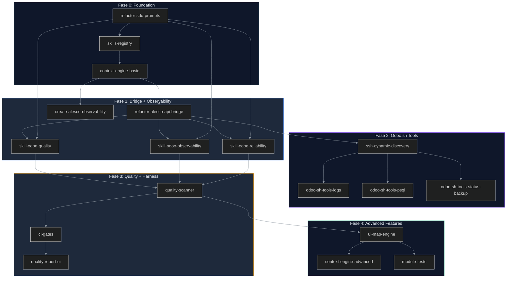

# 01-PRD.md — Product Requirements Document

> **Version:** 1.0.0
> **Last Updated:** 2026-06-11
> **Status:** Approved
> **Project:** iris — MCP Orchestrator for Odoo Enterprise Development
> **License:** Apache-2.0

---

## 1. Executive Summary

iris is an **MCP (Model Context Protocol) orchestrator** purpose-built for Odoo Enterprise development. It bridges the gap between AI coding assistants and the Odoo ecosystem — ORM, Odoo.sh hosting, OCA conventions, PostgreSQL, OpenTelemetry, and enterprise security — by providing a structured, phase-gated pipeline called SDD (Spec-Driven Development).

The product targets **Odoo development teams** who face a fundamental problem: AI coding assistants produce Odoo code that looks plausible but fails on Odoo-specific constraints — missing `ir.model.access.csv`, incorrect OCA naming, N+1 queries, unsafe `sudo()` usage, and broken view inheritance. These failures multiply in enterprise contexts where security, scalability, and OCA compliance are non-negotiable.

iris solves this not by training a better model, but by building a **harness** around the AI: a system of feedforward controls (skills, prompts, documentation) and feedback controls (linters, structural tests, CI gates) that enforce quality mechanically. The core insight is that **98% of reliability lives in the harness, not the model** (`docs/01-PRD.md` §1 — Principle 3).

The ecosystem consists of six component groups: **iris** (MCP orchestrator), **Engram** (persistent memory via `mem_*` tools), **CodeGraph** (code graph for static analysis), **alesco_api_bridge** (secure REST bridge to Odoo), **alesco_observability** (gratis OpenTelemetry for Odoo), and **Skills** (domain-specific markdown knowledge loaded on demand). The entire system operates at **$0/month** — no paid subscriptions, no proprietary licenses.

Technically, iris is a TypeScript/Node.js MCP server that exposes tools for Odoo development, connected to Odoo.sh via HTTPS (token auth) and dynamic SSH (auto-discovered build IDs), with persistent memory via Engram and static analysis via CodeGraph. Skills are plain markdown files loaded on demand by a Context Engine that respects a strict 40% context budget.

---

## 2. Problem Statement

### 2.1 Current State

Odoo enterprise development teams using AI assistants currently operate with:

| Aspect | Current State | Impact |
|--------|--------------|--------|
| Code generation | AI produces generic Python, not Odoo-idiomatic ORM code | Structural bugs in production |
| Security | `ir.model.access.csv` often missing; `sudo()` used without justification | Data exposure, privilege escalation |
| OCA compliance | Naming conventions, module structure, manifest completeness not validated | PR rejection by OCA reviewers |
| N+1 queries | AI generates loop-based field access without prefetching | Performance degradation at scale |
| Context loss | Each session starts from zero; architectural decisions evaporate | Inconsistent codebase evolution |
| Build awareness | SSH URLs hardcoded; broken on every Odoo.sh rebuild | Manual rediscovery every deploy |

### 2.2 Pain Points

1. **Odoo-Specific Knowledge Gap** — General-purpose AI models know Python but not `@api.depends` chains, `ir.rule` semantics, `safe_eval` constraints, or OCA naming conventions. The result is code that passes "looks right" review but fails in production.

2. **Session Amnesia** — Architectural decisions, bug fixes, and configuration context from previous sessions are lost. The AI cannot build on prior knowledge because the context window is ephemeral.

3. **Unsafe Operations** — Without guards, AI assistants may execute destructive database operations (`DELETE`, `DROP`, `TRUNCATE`), expose tokens, or bypass Odoo's security layer via `sudo()`.

4. **No Quality Enforcement** — There is no automated gate that verifies OCA compliance, test coverage, security posture, or performance before code reaches production.

5. **Static SSH URLs** — Odoo.sh's `build_id` changes on every push. Hardcoded SSH URLs break after each deployment, requiring manual rediscovery.

6. **Observability Gap** — Teams lack visibility into ORM query performance, slow endpoints, and error patterns within AI-generated code.

7. **Cost Creep** — Tools like `dkn_otel` ($24.99/month, OPL-1) introduce per-month costs that scale with team size, violating zero-cost operational principles.

---

## 3. Vision & Scope

### 3.1 Product Vision

> **iris makes every Odoo developer a senior architect.** By encoding Odoo best practices, OCA standards, and enterprise security into a structured AI development pipeline, iris eliminates the gap between "code that compiles" and "code that is production-ready."

### 3.2 In Scope

| Capability | Description |
|------------|-------------|
| **SDD Pipeline** | 8-phase development pipeline (Explore → Propose → Spec → Design → Tasks → Apply → Verify → Archive) with phase-gate enforcement |
| **Skills System** | Domain-specific markdown knowledge loaded on demand by a Context Engine |
| **Engram Memory** | Persistent observation storage across sessions for architectural decisions, bug fixes, and configuration |
| **CodeGraph Analysis** | Static code graph for Odoo model/view/security exploration without grep |
| **alesco_api_bridge** | Secure Odoo REST bridge with token authentication, audit logging, and CORS restriction |
| **alesco_observability** | Gratis OpenTelemetry instrumentation for Odoo (based on `opentelemetry-distro-odoo`, Apache-2.0) |
| **Odoo.sh Tools** | Dynamic SSH discovery, safe psql (read-only), log parsing, backup management |
| **Quality Scanner** | 10-dimension Odoo-specific quality evaluation (OCA naming, security, test coverage, performance, AI duplication detection) |
| **CI Gates** | GitHub Actions + pre-commit hooks enforcing quality thresholds |
| **Context Engine** | File-type and content-based skill detection with compression at 40% budget |
| **UI Map Engine** | XML view parsing with inheritance resolution for AI-generated navigation routes |

### 3.3 Out of Scope

| Capability | Rationale |
|------------|-----------|
| General-purpose AI coding | iris is Odoo-first; other frameworks are not supported |
| Custom AI model training | Harness > Model philosophy; no fine-tuning |
| Multi-cloud hosting | Odoo.sh only; no AWS/Azure/GCP support |
| Real-time collaboration | Single-developer session model |
| Mobile app | Desktop-first MCP server |
| Third-party Odoo module marketplace | Only internal modules (`alesco_*`) |
| AI code generation from scratch | iris generates code within the SDD pipeline, not standalone |

---

## 4. Stakeholders & Users

| Stakeholder | Role | Needs | Interaction |
|-------------|------|-------|-------------|
| **Odoo Developer** | Primary user | Code generation, review, testing, debugging | Daily SDD pipeline usage |
| **Odoo Architect** | Technical lead | Architecture decisions, ADR creation, code review | SDD phases: explore, propose, design |
| **Odoo QA Engineer** | Quality gatekeeper | Test coverage, quality scores, CI gates | SDD verify phase, quality scanner |
| **Odoo Ops / Sysadmin** | Infrastructure | SSH access, log analysis, backups, psql | On-demand Odoo.sh tools |
| **Odoo.sh Platform** | Hosting provider | Build management, API endpoints, SSH | Passive (iris connects to it) |
| **OCA Reviewer** | Standards authority | OCA compliance validation | CI gates enforce OCA rules |
| **Project Manager** | Business stakeholder | Roadmap tracking, milestone verification | SDD phase completion reports |

---

## 5. Business Requirements (BRD)

| ID | Requirement | Metric | Priority |
|----|-------------|--------|----------|
| BR-01 | Reduce Odoo code defects in production | ≥ 80% reduction in security-related incidents | P0 |
| BR-02 | Eliminate manual SSH URL management | Zero hardcoded build IDs | P0 |
| BR-03 | Ensure zero-cost operations | $0/month total operating cost | P0 |
| BR-04 | Enforce OCA compliance automatically | ≥ 80 quality score on all PRs | P1 |
| BR-05 | Achieve persistent context across sessions | Every SDD artifact recoverable via Engram | P1 |
| BR-06 | Provide observability into Odoo performance | Every HTTP request traced via OTel | P1 |
| BR-07 | Eliminate unsafe database operations | Zero destructive psql commands allowed | P1 |
| BR-08 | Reduce AI code duplication | D10 dimension in quality scanner detecting 8x patterns | P2 |

---

## 6. Functional Requirements (FRD)

### 6.1 Core Features

| ID | Feature | Description | Priority |
|----|---------|-------------|----------|
| FR-01 | **SDD Pipeline** | 8-phase development pipeline with DAG-enforced phase ordering | P0 |
| FR-02 | **MCP Tools** | Expose Odoo-specific tools via MCP protocol (odoo-logs, odoo-psql, odoo-backups, odoo-security-audit, odoo-build-status) | P0 |
| FR-03 | **Token Auth Bridge** | REST bridge to Odoo with `X-Auth-Token` authentication, configurable via `ir.config_parameter` | P0 |
| FR-04 | **Dynamic SSH Discovery** | Auto-discover Odoo.sh `build_id` via API REST before each SSH connection | P0 |
| FR-05 | **Safe psql** | Read-only PostgreSQL access via SSH with whitelist enforcement (SELECT only, 10s timeout) | P0 |
| FR-06 | **Log Parsing** | Structured log analysis with level classification (INFO/WARNING/ERROR/CRITICAL) and time-range filters | P1 |
| FR-07 | **Backup Management** | List, download, restore, and verify backups via Odoo.sh API + SSH | P1 |
| FR-08 | **Quality Scanner** | 10-dimension Odoo-specific quality evaluation returning JSON + Markdown reports | P1 |
| FR-09 | **CI Gates** | GitHub Actions workflow running quality scanner on each PR; blocks merge if score < 8.0 | P1 |
| FR-10 | **Build Status** | Query Odoo.sh build status (running/idle/error) via API | P1 |

### 6.2 Agent System

| ID | Feature | Description | Priority |
|----|---------|-------------|----------|
| FR-11 | **Context Engine** | Detect skills based on file extension, command type, and file content | P0 |
| FR-12 | **Skills Registry** | Index all available skills in `.atl/skill-registry.md`, persisted in Engram | P0 |
| FR-13 | **Auto-Load Skills** | Load relevant skills on demand based on detected context | P0 |
| FR-14 | **Context Budget** | Enforce 40% maximum context for skills; auto-compress if exceeded | P0 |
| FR-15 | **Content Detection** | Pattern matching in Python source: `class.*(models.Model)` → odoo-ai, `sudo()` → odoo-security, `@http.route` → odoo-ai controllers | P1 |
| FR-16 | **Skills Compression** | Generate executive summary + full reference on demand when budget is tight | P1 |
| FR-17 | **Skill Lifecycle Logging** | Register every skill load/unload in Engram for traceability | P2 |

### 6.3 SDD Pipeline

| ID | Feature | Description | Priority |
|----|---------|-------------|----------|
| FR-18 | **Explore Phase** | Investigate using CodeGraph exclusively; grep/read prohibited | P0 |
| FR-19 | **Propose Phase** | Define scope, deliverables, risks; save to Engram | P0 |
| FR-20 | **Spec Phase** | Write Given/When/Then specifications covering all scenarios | P0 |
| FR-21 | **Design Phase** | Document ADRs, interfaces, diagrams with Mermaid | P0 |
| FR-22 | **Tasks Phase** | Break down into ordered task checklist from Spec + Design | P0 |
| FR-23 | **Apply Phase** | Implement tasks; generate closure report | P0 |
| FR-24 | **Verify Phase** | Validate implementation against Spec | P0 |
| FR-25 | **Archive Phase** | Sync delta specs to main; save lessons to Engram | P0 |
| FR-26 | **Phase-Gate Enforcement** | Harness validates prior artifact exists before allowing next phase | P0 |
| FR-27 | **Reciprocal Apprenticeship** | Every SDD phase includes Learning Objective, Fundamentals section, and Teaching Template | P1 |

---

## 7. Technical Requirements (TRD)

### 7.1 Performance & Scalability

| ID | Requirement | Specification |
|----|-------------|---------------|
| TR-01 | **MCP Response Time** | ≤ 2 seconds for tool execution (excluding Odoo.sh SSH latency) |
| TR-02 | **Context Load Time** | ≤ 500ms for skill detection + loading |
| TR-03 | **SSH Connection Time** | ≤ 3 seconds including build_id discovery |
| TR-04 | **CodeGraph Query** | ≤ 1 second for typical search (single model, < 1000 nodes) |
| TR-05 | **Engram Persistence** | ≤ 500ms for `mem_save` |
| TR-06 | **Quality Scan** | ≤ 10 seconds for module with < 50 files |
| TR-07 | **Concurrent Sessions** | Support at least 1 developer session (single-user MCP server) |

### 7.2 Compatibility

| ID | Requirement | Specification |
|----|-------------|---------------|
| TR-08 | **Odoo Versions** | Odoo 17.0, 18.0, 19.0 (module-level compatibility) |
| TR-09 | **Python Version** | Python 3.10+ (Odoo 17/18/19 compatibility) |
| TR-10 | **Node.js** | Node.js 18+ LTS for iris MCP server |
| TR-11 | **PostgreSQL** | PostgreSQL 14+ (Odoo.sh standard) |
| TR-12 | **MCP Protocol** | MCP v1.0 compatible (stdio + HTTP) |
| TR-13 | **SSH** | OpenSSH 8+ with ed25519 keys |
| TR-14 | **OpenTelemetry** | OTLP v1.0+ (gRPC + HTTP) |

### 7.3 Security

| ID | Requirement | Specification |
|----|-------------|---------------|
| TR-15 | **HTTPS Only** | TLS 1.3 mandatory for all iris → Odoo.sh communication |
| TR-16 | **Token Authentication** | Configurable `X-Auth-Token` header; constant-time comparison |
| TR-17 | **Default Token Block** | CI gate blocks `CAMBIAR_POR_TOKEN_SEGURO` default value |
| TR-18 | **SSH Key Only** | ed25519 keys required; password auth disabled |
| TR-19 | **Read-Only psql** | Whitelist: SELECT only; DELETE/UPDATE/DROP/TRUNCATE/INSERT blocked |
| TR-20 | **CORS Restriction** | No `Access-Control-Allow-Origin: *`; restrict to known origins |
| TR-21 | **Circuit Breaker** | 3 consecutive SSH failures → Open circuit for 30 seconds |
| TR-22 | **Minimum Privilege** | Every Odoo user/agent has least-privilege ACL |

### 7.4 Observability

| ID | Requirement | Specification |
|----|-------------|---------------|
| TR-23 | **OTel Tracing** | Every HTTP request through alesco_api_bridge has an OTel span |
| TR-24 | **Log Classification** | All Odoo.sh logs parsed by level; structured JSON output |
| TR-25 | **OpenTelemetry Library** | `opentelemetry-distro-odoo` (Apache-2.0, free) — NOT `dkn_otel` |
| TR-26 | **Grafana Export** | OTLP export to Grafana Cloud Free Tier (10k series, 14-day retention) |
| TR-27 | **Query Performance** | `pg_stat_statements` integration for slow query detection |

---

## 8. Product Sensitivity

### 8.1 Data Classification

iris interacts with multiple data categories across the Odoo ecosystem:

| Category | Examples | Sensitivity | Storage | Access Control |
|----------|----------|-------------|---------|----------------|
| **Business Data** | Partners, products, orders, invoices, accounting entries | High | Odoo.sh PostgreSQL | Odoo ACL + record rules |
| **Credentials** | Bridge tokens, SSH keys, Odoo.sh API keys | Critical | Environment variables, `ir.config_parameter` | Never logged; never in code |
| **Logs** | System logs, audit trails, OTel traces | Medium | Odoo.sh + Grafana Cloud | 14-day retention; HTTPS export |
| **Code** | Odoo modules, Python/XML source | Medium | Git repository (GitHub) | Standard git access control |
| **Architecture** | ADRs, designs, specs, proposals | Low | Engram (MCP memory) | Session-scoped access |
| **Metrics** | Query performance, error rates, build status | Low | Grafana Cloud | Read-only dashboard access |

### 8.2 Risk Matrix

| Risk | Probability | Impact | Severity | Mitigation |
|------|-------------|--------|----------|------------|
| Token exposure in logs/code | Low | Critical | P0 | CI gate blocks default tokens; token rotation policy |
| Destructive SQL via psql | Low | Critical | P0 | Command whitelist (SELECT only); regex validation before execution |
| SSH key compromise | Low | High | P1 | ed25519 only; passphrase required; IP-restricted |
| Build ID cache stale | Medium | Medium | P1 | Auto-discovery on every SSH connection; circuit breaker fallback |
| N+1 queries in AI code | High | Medium | P2 | Quality scanner D10 (performance) detects loop-based access |
| Context budget exceeded | Medium | Low | P2 | Auto-compression at 40% threshold; skills registry pre-loading |

### 8.3 Data Residency & Compliance

| Concern | Policy |
|---------|--------|
| **Data at rest** | All Odoo business data remains in Odoo.sh PostgreSQL (Peru/US region) |
| **Data in transit** | TLS 1.3 for all external communication; local MCP for Engram/CodeGraph |
| **Credentials storage** | No tokens/hardcoded in source; `ir.config_parameter` + environment variables |
| **Audit trail** | All bridge operations logged in `alesco_api_log` with non-repudiation fields |
| **Backup retention** | Odoo.sh manages backup lifecycle; iris provides verify+restore capabilities |

---

## 9. Roadmap & Phases

### 9.1 Implementation Phases

iris 1.0.0 is implemented in 5 phases over approximately 14 weeks (July–October 2026):

| Phase | Name | Duration | Tickets | Start | End |
|-------|------|----------|---------|-------|-----|
| **F0** | Foundation (SDD + Registry) | 8 days | 3 | 2026-07-01 | 2026-07-10 |
| **F1** | Bridge + Observability | 14 days | 5 | 2026-07-11 | 2026-07-25 |
| **F2** | Odoo.sh Tools | 11 days | 4 | 2026-07-18 | 2026-08-05 |
| **F3** | Quality + Harness | 11 days | 3 | 2026-07-25 | 2026-08-15 |
| **F4** | Advanced Features | 13 days | 3 | 2026-08-01 | 2026-08-25 |
| — | Buffer (20%) | 11 days | — | 2026-08-25 | 2026-09-01 |
| — | Stabilization | — | — | 2026-09-01 | 2026-10-01 |

**Total: ~68 working days (~14 weeks). Target release: 2026-10-01.**

### 9.2 Dependency Map



### 9.3 Milestones

| Milestone | Date | Event |
|-----------|------|-------|
| M0 | 2026-06-10 | Documentation complete (all ecosystem docs approved) |
| M1 | 2026-07-10 | Phase 0 done — SDD pipeline with Reciprocal Apprenticeship |
| M2 | 2026-07-25 | Phase 1 done — Bridge + OTel operational |
| M3 | 2026-08-05 | Phase 2 done — Odoo.sh tools live (logs, psql, backups) |
| M4 | 2026-08-15 | Phase 3 done — Quality gates in CI, scanner functional |
| M5 | 2026-08-25 | Phase 4 done — UI Map Engine, Advanced Context Engine, tests |
| M6 | 2026-09-01 | Buffer + stabilization complete |
| M7 | 2026-10-01 | **iris 1.0.0 release** |

### 9.4 Ticket Summary

| Phase | Tickets | Total Effort |
|-------|---------|--------------|
| **F0: Foundation** | `refactor-sdd-prompts`, `skills-registry`, `context-engine-basic` | 8 days |
| **F1: Bridge + OTel** | `refactor-alesco-api-bridge`, `create-alesco-observability`, `skill-odoo-quality`, `skill-odoo-observability`, `skill-odoo-reliability` | 14 days |
| **F2: Odoo.sh Tools** | `ssh-dynamic-discovery`, `odoo-sh-tools-logs`, `odoo-sh-tools-psql`, `odoo-sh-tools-status-backup` | 11 days |
| **F3: Quality + CI** | `quality-scanner`, `ci-gates`, `quality-report-ui` | 11 days |
| **F4: Advanced** | `ui-map-engine`, `context-engine-advanced`, `module-tests` | 13 days |

---

## 10. Success Metrics

### 10.1 Quantitative Metrics

| Metric | Baseline | Target | Measurement |
|--------|----------|--------|-------------|
| **SDD phase completion rate** | N/A (new system) | 100% phases complete before next starts | Harness gate audit log |
| **OCA quality score** | ~50/100 (estimated) | ≥ 80/100 | Quality scanner (10 dimensions) |
| **Security incidents** | Unknown | 0 incidents post-deployment | Audit log analysis |
| **Token exposure incidents** | 1 (Rachel's default token) | 0 | CI gate + log scanning |
| **N+1 query detection** | Not measured | 100% of scan runs detect N+1 | Quality scanner D10 |
| **SSH connection failure rate** | ~30% (hardcoded URLs) | < 1% | Circuit breaker metrics |
| **Context load accuracy** | N/A | ≥ 90% correct skill detection | Context Engine trace log |
| **Engram artifact recovery rate** | N/A | 100% of SDD artifacts recoverable | mem_search success rate |

### 10.2 Qualitative Success Criteria

1. **Developer autonomy** — An Odoo developer can complete a full module implementation from spec to PR using the SDD pipeline without manual intervention.
2. **Zero-cost guarantee** — All components operate at $0/month. Any paid dependency requires an explicit SDD design with ADR approval.
3. **Phase gate integrity** — No developer can skip a phase. The harness rejects out-of-order advances mechanically.
4. **Reciprocal apprenticeship** — After each SDD cycle, the developer can explain the Odoo fundamentals behind the generated code (Learning Objective assessment).
5. **Observability without cost** — Every HTTP request is traced via OTel using `opentelemetry-distro-odoo` (Apache-2.0, free).
6. **Dynamic operations** — No hardcoded URLs, tokens, or build IDs anywhere in the system.

---

## 11. Glossary

| Term | Definition |
|------|------------|
| **ADR** | Architecture Decision Record — documents a design decision with context, options, and rationale |
| **alesco_api_bridge** | Odoo module providing REST API endpoints for iris with token authentication and audit logging |
| **alesco_observability** | Odoo module implementing OpenTelemetry instrumentation based on `opentelemetry-distro-odoo` |
| **Build ID** | Numeric identifier for an Odoo.sh deployment; changes on every push (dynamic) |
| **CI Gate** | GitHub Actions check that blocks PRs failing quality thresholds |
| **Circuit Breaker** | Resilience pattern: after N consecutive failures, stop calling the service for a cooldown period |
| **CodeGraph** | MCP tool that indexes source code as a navigable graph for exploration and analysis |
| **Context Engine** | Subsystem that detects, loads, and compresses skills based on task context |
| **Engram** | Persistent memory layer for iris; stores observations, sessions, and SDD artifacts via `mem_*` tools |
| **Harness** | System of feedforward (prevention) and feedback (detection) controls around AI code generation |
| **MCP** | Model Context Protocol — standard for AI tool integration |
| **OCA** | Odoo Community Association — maintains quality standards for Odoo community modules |
| **OTel / OpenTelemetry** | Open-source observability framework for traces, metrics, and logs |
| **Reciprocal Apprenticeship** | Methodology where each development task produces both code and learning |
| **SDD** | Spec-Driven Development — 8-phase pipeline from exploration to archival |
| **Skills Registry** | Index of all available Odoo skills, persisted in Engram for fast context detection |
| **UI Map** | AI-generated navigation route through Odoo UI (Menu → Action → View → Tab → Field) |

---

## 12. References

### 12.1 Ecosystem Documents

| Document | Description | Key Sections |
|----------|-------------|--------------|
| `docs/01-PRD.md` | Product Requirements Document — vision, scope, requirements, roadmap | §1 (Executive Summary), §6 (Functional Requirements), §9 (Roadmap) |
| `docs/03-ARCHITECTURE.md` | Architecture & Design — system overview, components, connectivity, deployment | §2 (Component Architecture), §3 (Connectivity Matrix), §7 (Deployment) |
| `docs/01-PRD.md` | Product Requirements Document — implementation plan in PRD §9 | §9 (Roadmap & Phases) |
| `docs/01-PRD.md` | Product Requirements Document — sensitivity analysis in PRD §8 | §8 (Product Sensitivity) |
| `SECURITY.md` | Security architecture — 7 layers, policies, audit | §2 (Layered model), §7 (SDD checklist), §8 (Policies) |
| `docs/03-ARCHITECTURE.md` | Architecture & Design — reliability patterns in §5 | §5 (Reliability & Resilience) |
| `docs/04-CONTRIBUTING.md` | Contributing Guide — quality dimensions in §5 | §5 (Quality Gates) |
| `AGENTS.md` | Agent definitions — roles, responsibilities, onion model | §3 (Agent Definitions), §5 (Phase mapping) |
| `docs/03-ARCHITECTURE.md` | Architecture & Design — connectivity matrix in §3 | §3 (Connectivity Matrix) |
| `docs/04-CONTRIBUTING.md` | Contributing Guide — methodology in §7 | §7 (Reciprocal Apprenticeship) |

### 12.2 External References

| Reference | URL | Purpose |
|-----------|-----|---------|
| Odoo 18.0 Developer Docs | `odoo.com/documentation/18.0/developer.html` | Official Odoo development reference |
| OCA Maintainer Tools | `github.com/OCA/maintainer-tools` | OCA quality standards |
| OpenTelemetry Python | `opentelemetry.io/docs/languages/python/` | OTel Python SDK reference |
| opentelemetry-distro-odoo | `pypi.org/project/opentelemetry-distro-odoo/` | Free OTel distribution for Odoo (Apache-2.0) |
| MCP Specification | `modelcontextprotocol.io` | MCP protocol reference |
| Grafana Cloud Free Tier | `grafana.com/pricing` | Free tier limits (10k series, 14-day retention) |
| Comeau, J. (2026) | `joshwcomeau.com` | "The Post-Developer Era" — empirical foundation for Reciprocal Apprenticeship |

### 12.3 Context Diagram

```mermaid
%%{init: {'theme': 'dark', 'themeVariables': {'primaryColor': '#1f6feb', 'primaryTextColor': '#ffffff', 'primaryBorderColor': '#22d3ee', 'lineColor': '#8b949e'}}}%%
flowchart TD
    subgraph Developer["👨‍💻 Odoo Developer"]
        DEV[CLI / MCP Client]
    end

    subgraph Iris["🎯 iris 1.0.0 (MCP Orchestrator)"]
        SDD[SDD Pipeline\n8 phases]
        HARN[Harness\nFeedforward + Feedback]
        CTX[Context Engine\nSkill detection]
        TOOLS[MCP Tools\nodoo-*]
    end

    subgraph Memory["🧠 Engram\nPersistent Memory"]
        OBS[Observations]
        SES[Sessions]
        ART[SDD Artifacts]
    end

    subgraph Analysis["🔍 CodeGraph\nCode Analysis"]
        CG_SEARCH[Semantic Search]
        CG_TRACE[Flow Tracing]
    end

    subgraph Skills["📚 Skills (Markdown)"]
        SK_AI[odoo-ai\nORM, Views]
        SK_CONTRIB[odoo-contribute\nGit, OCA, Docker]
        SK_OPS[odoo-ops\nSSH, psql, logs]
        SK_SEC[odoo-security\nACL, sudo, audit]
    end

    subgraph OdooSH["☁️ Odoo.sh Infrastructure"]
        BRIDGE[alesco_api_bridge\nREST + Token Auth]
        OBS_MOD[alesco_observability\nOTel Tracing]
        SSH[SSH Dynamic]
        PSQL[(PostgreSQL)]
        API[REST API]
    end

    subgraph External["🌐 External Services"]
        GH[GitHub Actions\nCI/CD]
        GF[Grafana Cloud\nFree Tier]
    end

    DEV -->|query/task| Iris
    Iris -->|mem_save/search| Memory
    Iris -->|cgSearch/trace| Analysis
    Iris -->|load on demand| Skills
    Iris -->|HTTPS + Token| BRIDGE
    Iris -->|SSH (dynamic)| SSH
    Iris -->|API| API
    BRIDGE -->|query| PSQL
    OBS_MOD -->|OTLP| GF
    SSH -->|logs/shell| PSQL
    Iris -->|PR checks| GH

    style Developer fill:#1e293b,stroke:#22d3ee,stroke-width:2px
    style Iris fill:#0f172a,stroke:#3b82f6,stroke-width:2px
    style Memory fill:#1e293b,stroke:#a855f7,stroke-width:2px
    style Analysis fill:#0f172a,stroke:#a855f7,stroke-width:2px
    style Skills fill:#1e293b,stroke:#f59e0b,stroke-width:2px
    style OdooSH fill:#0f172a,stroke:#10b981,stroke-width:2px
    style External fill:#1e293b,stroke:#8b949e,stroke-width:2px
```

---

*This Product Requirements Document defines the what, why, and for whom of iris 1.0.0. It distills the broader ecosystem vision (`docs/01-PRD.md`), the phased implementation plan (`docs/01-PRD.md`), and the product sensitivity analysis (`docs/01-PRD.md`) into a single, coherent requirements specification. All technical decisions, architecture choices, and quality thresholds documented herein are binding for the development of iris.*

*Approved by: [Fairw — Systems Engineer & Senior Odoo Architect]*
