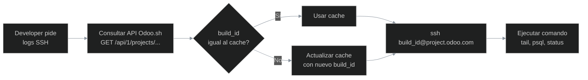
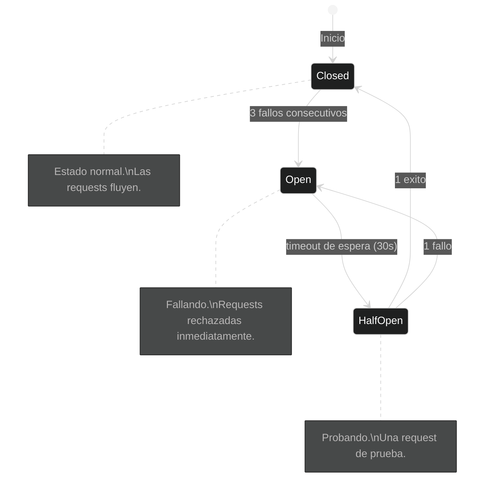

# 02-ADR.md — Architecture Decision Records

> **Version:** 1.0.0
> **Ultima actualizacion:** 2026-06-11
> **Proyecto:** iris — Orchestrador MCP para desarrollo Odoo Enterprise
> **Fuentes:** `docs/02-ADR.md`, `docs/03-ARCHITECTURE.md`, `docs/04-CONTRIBUTING.md`, `docs/01-PRD.md`

---

## Indice

1. [ADR-001: Screaming Architecture por Dominio Odoo](#adr-001-screaming-architecture-por-dominio-odoo)
2. [ADR-002: TypeScript + Node.js como Stack Principal](#adr-002-typescript--nodejs-como-stack-principal)
3. [ADR-003: MCP como Protocolo Unico de Comunicacion](#adr-003-mcp-como-protocolo-unico-de-comunicacion)
4. [ADR-004: Engram como Unica Fuente de Verdad y Memoria Persistente](#adr-004-engram-como-unica-fuente-de-verdad-y-memoria-persistente)
5. [ADR-005: OpenTelemetry Gratuito con opentelemetry-distro-odoo](#adr-005-opentelemetry-gratuito-con-opentelemetry-distro-odoo)
6. [ADR-006: SSH Dinamico con Auto-descubrimiento de Build ID](#adr-006-ssh-dinamico-con-auto-descubrimiento-de-build-id)
7. [ADR-007: Skills en Formato Markdown](#adr-007-skills-en-formato-markdown)
8. [ADR-008: Quality Gates como Codigo con Scoring OCA](#adr-008-quality-gates-como-codigo-con-scoring-oca)
9. [ADR-009: CodeGraph Exclusivo como Herramienta de Exploracion](#adr-009-codegraph-exclusivo-como-herramienta-de-exploracion)
10. [ADR-010: Bridge con Token Auth y Sin API Keys de Terceros](#adr-010-bridge-con-token-auth-y-sin-api-keys-de-terceros)
11. [ADR-011: Circuit Breaker, Retry con Backoff y Timeouts](#adr-011-circuit-breaker-retry-con-backoff-y-timeouts)
12. [ADR-012: Sin Estado Local con Recuperacion desde Engram](#adr-012-sin-estado-local-con-recuperacion-desde-engram)

---

## ADR-001: Screaming Architecture por Dominio Odoo

**Estado:** Aceptado

### Contexto

iris necesita organizar su codigo fuente de manera que la estructura del proyecto comunique inmediatamente el dominio del problema. En equipos Odoo, los desarrolladores piensan en terminos de modulos, modelos, vistas y seguridad — no en terminos de controladores, servicios y repositorios. La estructura de carpetas debe reflejar el dominio Odoo, no la tecnologia subyacente.

### Decision

Organizar el proyecto por **contexto de dominio Odoo** en lugar de por patron tecnico. Las carpetas de `src/` se agrupan por funcionalidad: `router/`, `tools/`, `adapters/`, `context/`, `engram/`, `codegraph/`. Cada subdirectorio representa un concepto del dominio (SDD pipeline, tools MCP, conectividad Odoo.sh, contexto Odoo), no una capa tecnica (controllers, services, repositories).

### Consecuencias

- Positivas: La estructura es intuitiva para desarrolladores Odoo. Un nuevo miembro del equipo sabe donde encontrar tools de Odoo.sh (`src/tools/odoo/`) sin entender la arquitectura interna.
- Positivas: La separacion por dominio permite que multiples desarrolladores trabajen en paralelo sin conflictos de carpeta.
- Negativas: No sigue convenciones generales de proyectos Node.js (que suelen usar `controllers/`, `services/`, `middleware/`).

### Alternativas Consideradas

- Estructura plana por capa tecnica (`controllers/`, `services/`, `models/`, `middleware/`) — descartada porque no comunica el dominio.
- Monorepo con multiples packages — descartado por sobreingenieria para un equipo pequeno.

---

## ADR-002: TypeScript + Node.js como Stack Principal

**Estado:** Aceptado

### Contexto

iris necesita un entorno de ejecucion que sea compatible con el ecosistema MCP de Anthropic, tenga tipado estricto para reducir errores en un orquestador multi-agente, y permita la ejecucion local sin infraestructura pesada. Ademas, debe integrarse con herramientas de linea de comando (STDIO) para comunicacion MCP local.

### Decision

Usar **TypeScript sobre Node.js** como stack principal. FastMCP como framework MCP server. El tipado estricto de TypeScript reduce errores de interfaz entre componentes. Node.js proporciona el bucle de eventos asincrono necesario para manejar multiples requests MCP simultaneas.

### Consecuencias

- Positivas: Tipado fuerte en las interfaces entre router, tools, adapters y clientes MCP (Engram, CodeGraph).
- Positivas: Ejecucion nativa en Windows, macOS y Linux sin cambios.
- Positivas: Compatibilidad directa con el SDK MCP de Anthropic.
- Negativas: No hay beneficio de concurrencia nativa como en Go o Rust. Node.js es monohilo; la concurrencia se maneja con async/await y event loop.

### Alternativas Consideradas

- Go: descartado porque el ecosistema MCP es notablemente mas maduro en TypeScript/Node.js.
- Python: descartado porque FastMCP (Python) no estaba tan pulido como el SDK TypeScript en el momento de la decision.
- Rust: descartado por sobreingenieria y curva de aprendizaje del equipo.

---

## ADR-003: MCP como Protocolo Unico de Comunicacion

**Estado:** Aceptado

### Contexto

iris se comunica con multiples componentes: Engram (memoria), CodeGraph (analisis de codigo), el desarrollador (CLI), y servicios externos (Odoo.sh, bridge). Cada uno podria tener su propio protocolo (REST, gRPC, WebSocket, IPC), lo que multiplicaria la logica de transporte, autenticacion y serializacion. Se necesita un protocolo estandarizado que unifique todas las comunicaciones internas.

### Decision

Usar **Model Context Protocol (MCP)** como protocolo unico de comunicacion entre iris y todos sus componentes internos. MCP es un protocolo JSON-RPC 2.0 que define tres primitivas: **Tools** (funciones invocables con parametros tipados), **Resources** (datos expuestos con URI scheme), y **Prompts** (templates de instrucciones precargables). El transport subyacente puede ser STDIO (local) o SSE (remoto), pero el protocolo es siempre MCP.

```mermaid
%%{init: {'theme': 'dark', 'themeVariables': {'primaryColor': '#1f6feb', 'primaryTextColor': '#ffffff', 'primaryBorderColor': '#22d3ee', 'lineColor': '#8b949e'}}}%%
flowchart LR
    subgraph MCPEco ["Ecosistema MCP"]
        IRIS[iris MCP Server]
        ENG[Engram\nmem_* tools]
        CG[CodeGraph\ncgSearch / cgTrace]
        DEV[Desarrollador\nCLI / IDE]
    end

    IRIS -->|MCP / STDIO| ENG
    IRIS -->|MCP / STDIO| CG
    DEV -->|MCP / STDIO| IRIS

    style MCPEco fill:#0f172a,stroke:#22d3ee,stroke-width:1px
```

### Consecuencias

- Positivas: Interoperabilidad inmediata con Claude Desktop, Codex CLI, Cursor y otros clientes MCP.
- Positivas: Herramientas tipadas y descubribles — cada tool expone su schema JSON.
- Positivas: Un solo mecanismo de autenticacion, serializacion y manejo de errores.
- Negativas: Dependencia de un protocolo en crecimiento (MCP aun no es un estandar formal ISO/IETF).
- Negativas: No es adecuado para streaming de datos pesados (logs extensos, archivos grandes).

### Alternativas Consideradas

- REST directo: descartado por menos flexible y sin estandar de herramientas descubribles.
- gRPC: descartado por complejidad de setup y menor integracion con clientes AI.
- WebSocket: descartado por carecer de un estandar de herramientas como MCP.

---

## ADR-004: Engram como Unica Fuente de Verdad y Memoria Persistente

**Estado:** Aceptado

### Contexto

iris necesita recordar decisiones arquitectonicas, artefactos SDD, contexto de sesiones anteriores y aprendizaje reciproco entre sesiones. Depender del sistema de archivos local hace que el estado no sea portable entre maquinas ni compartible entre miembros del equipo. Se necesita un sistema de memoria persistente que sea la fuente unica de verdad.

### Decision

**Engram es la unica fuente de verdad** para todo estado persistente de iris. iris NO guarda archivos locales de estado (ni JSON, ni YAML, ni SQLite local). Engram almacena:

- Artefactos de cada fase SDD (explore, proposal, spec, design, tasks, apply-progress, verify, archive)
- Contexto de sesiones anteriores (decisiones, patrones, bugs)
- Taxonomia y relaciones entre observaciones
- UI Maps aprendidos (posicion de campos en vistas XML de Odoo)

```mermaid
%%{init: {'theme': 'dark', 'themeVariables': {'primaryColor': '#1f6feb', 'primaryTextColor': '#ffffff', 'primaryBorderColor': '#22d3ee', 'lineColor': '#8b949e'}}}%%
flowchart TD
    IRIS[iris MCP Server]
    SDD[Pipeline SDD\n8 fases]
    MEM[Memoria entre Sesiones\nDecisiones, ADRs, Contexto]
    ART[Artefactos\nExplore, Propose, Spec...]
    UI[UI Maps\nPosicion de Campos]

    IRIS -->|mem_save| ART
    IRIS -->|mem_context| MEM
    IRIS -->|mem_save| UI
    SDD -->|cada fase| ART

    style IRIS fill:#1e293b,stroke:#a855f7,stroke-width:1px
```

### Consecuencias

- Positivas: Estado portable entre sesiones y maquinas — no hay dependencia del filesystem local.
- Positivas: Trazabilidad completa de todas las decisiones a traves del tiempo.
- Positivas: Recuperacion automatica de contexto al reiniciar iris (sin perdida de estado).
- Negativas: Dependencia del servicio Engram como externo. Si Engram no esta disponible, iris no tiene memoria de sesiones previas.

### Alternativas Consideradas

- Sistema de archivos local (JSON/YAML en disco): descartado porque no es portable entre maquinas y no soporta busqueda semantica.
- Base de datos SQL local (SQLite): descartado porque Engram ya proporciona SQLite + FTS5 con capa de busqueda semantica integrada.

---

## ADR-005: OpenTelemetry Gratuito con opentelemetry-distro-odoo

**Estado:** Aceptado

### Contexto

Se necesita observabilidad en el modulo `alesco_observability` para instrumentar llamadas ORM, exportar trazas, metricas y logs. Existen opciones de pago en el ecosistema Odoo (`dkn_otel` cuesta $24.99/mes, `az_opentelemetry` cuesta $20.00/mes). El proyecto iris se compromete a mantener costo operativo cero.

### Decision

Usar **`opentelemetry-distro-odoo`** (Apache-2.0, gratuito en PyPI) como base del modulo `alesco_observability`. Este paquete proporciona instrumentacion automatica del ORM de Odoo, exportacion OTLP hacia OpenTelemetry Collector, y es completamente open source. Se integra con Grafana Cloud Free Tier para dashboards.

Cada llamada ORM genera un span con atributos (modelo, metodo, query, duracion). Los spans se exportan en batch al Collector vía OTLP/gRPC cada 5 segundos o 512 items.

### Consecuencias

- Positivas: Sin costo recurrente — $0 operativo.
- Positivas: Codigo abierto (Apache-2.0) — sin vendor lock-in.
- Positivas: Compatible con el ecosistema OpenTelemetry estandar (Grafana, Jaeger, SigNoz).
- Negativas: Menos features que opciones de pago (dashboards preconstruidos, alertas avanzadas), pero suficientes para el caso de uso del proyecto.

### Alternativas Consideradas

- `dkn_otel` ($24.99/mes, OPL-1): descartado por costo recurrente y licencia restrictiva.
- `az_opentelemetry` ($20.00/mes, OPL-1): descartado por mismo motivo.
- Construir instrumentacion desde cero: descartado porque `opentelemetry-distro-odoo` ya resuelve el problema.

---

## ADR-006: SSH Dinamico con Auto-descubrimiento de Build ID

**Estado:** Aceptado

### Contexto

La URL SSH de Odoo.sh cambia en cada build: `ssh {build_id}@{project}.odoo.com -p 22`. El `build_id` es un numero entero que cambia con cada push a la rama. Hardcodear la URL SSH en la configuracion de iris rompe la conexion en cada deploy. Se necesita un mecanismo que descubra automaticamente la URL correcta antes de cada conexion.

### Decision

iris **descubre dinamicamente** el `build_id` consultando la API REST de Odoo.sh (`GET /api/1/projects/{project}/branches/{branch}`) o el endpoint `/alesco/api/build-info` del bridge antes de cada conexion SSH. El flujo es:

1. Consultar API Odoo.sh con token Bearer
2. Extraer `build_id`, `ssh_user`, `ssh_host` de la respuesta
3. Cachear el build_id en config local (valido hasta nuevo push)
4. Establecer conexion SSH con `ssh {build_id}@{project}.odoo.com`
5. Si la conexion falla, rediscovery automatico

### Consecuencias

- Positivas: Resiliente a cambios de build — cada push actualiza automaticamente la URL SSH.
- Positivas: Sin costo adicional — la API REST de Odoo.sh es gratuita.
- Positivas: Tolerante a fallos de red: cachea el ultimo build_id conocido.
- Negativas: Dependencia de la API REST de Odoo.sh (gratis y estable, pero si falla no se puede descubrir el build_id).
- Negativas: La API requiere token Bearer que debe configurarse y rotarse.

### Alternativas Consideradas

- Cloudflare Tunnel: descartado por costo y complejidad de setup.
- DNS dinamico: descartado por latencia de propagacion y configuracion manual.
- Hardcodear y reconfigurar manualmente tras cada push: descartado por propenso a error humano.

---

## ADR-007: Skills en Formato Markdown

**Estado:** Aceptado

### Contexto

iris necesita un sistema de conocimiento experto que los agentes AI puedan cargar bajo demanda segun el contexto de la tarea. Las skills deben ser faciles de crear, mantener y versionar. Inicialmente se consideraron modulos Python o archivos JSON, pero ambos presentaban barreras de entrada para contributors no-programadores.

### Decision

Las skills se definen en **archivos Markdown** con estructura estandarizada (`SKILL.md` + `references/` + `examples/`). Cada skill tiene:

- Frontmatter con metadatos (nombre, version, descripcion, categorias, triggers)
- Cuerpo Markdown con el conocimiento estructurado
- Referencias cruzadas a otras skills y documentos del ecosistema

Las skills se cargan bajo demanda por el Context Engine de iris, que detecta el tipo de tarea (Odoo module, Odoo.sh ops, general) y carga las skills relevantes sin exceder el 40% del contexto disponible.

### Consecuencias

- Positivas: Faciles de crear y mantener — cualquier miembro del equipo puede contribuir una skill.
- Positivas: Cargables bajo demanda — optimizan el uso de contexto.
- Positivas: Legibles por humanos y agentes AI por igual.
- Positivas: Versionables con git — diff claro en cada cambio.
- Negativas: Sin logica programatica — no pueden ejecutar codigo ni hacer validaciones dinamicas.
- Negativas: El contenido debe ser principalmente declarativo; la logica reside en los agentes que las consumen.

### Alternativas Consideradas

- Modulos Python (.py): descartados por menos accesibles para contributors no-programadores.
- Archivos JSON/YAML: descartados por menos legibles y sin soporte nativo de formato enriquecido.
- Base de datos: descartada por sobreingenieria para el tamano del equipo.

---

## ADR-008: Quality Gates como Codigo con Scoring OCA

**Estado:** Aceptado

### Contexto

iris necesita un sistema de calidad objetivo, reproducible y automatico para modulos Odoo. Las revisiones manuales son subjetivas, inconsistentes entre evaluadores, y no escalan. Se requiere un sistema que mida calidad contra estandares OCA, produzca un score numerico, y pueda integrarse en CI gates para bloquear merges que no cumplan el umbral minimo.

### Decision

Implementar un sistema de **10 dimensiones ponderadas** con scoring OCA automatizado via CI:

| Dimension | Weight | Que mide |
|-----------|--------|----------|
| Modelos y ORM | 20% | Correccion de modelos, campos, computed fields, constraints |
| Vistas y UX | 15% | Estructura XML, widgets, herencia xpath, nomenclatura |
| Seguridad | 15% | ACL, record rules, sudo(), SQL injection |
| Tests | 15% | Cobertura de TransactionCase, HttpCase, edge cases |
| Estructural | 10% | Directorio OCA estandar, naming de archivos |
| Manifest | 10% | `__manifest__.py` completo, dependencias correctas |
| i18n | 5% | Traducciones, archivos .po, strings exportables |
| Performance | 5% | Indices, N+1 detection, query count |
| Documentacion | 3% | README, docstrings, change log |
| Mantenibilidad | 2% | Complejidad ciclomatica, duplicacion |

### Consecuencias

- Positivas: Calidad objetiva y reproducible — dos evaluaciones del mismo modulo producen el mismo score.
- Positivas: Integracion en CI gates — PRs con score menor a 80/100 no pueden mergear.
- Positivas: Educativo — cada penalizacion incluye fundamento Odoo, referencia a docs, y ruta de arreglo.
- Negativas: No captura calidad subjetiva (legibilidad, diseno).
- Negativas: Requiere mantenimiento continuo de las reglas de scoring segun evolucionan los estandares OCA.

### Alternativas Consideradas

- Revision manual 100%: descartada por subjetiva e inconsistente.
- Solo linters (pylint-odoo, flake8): descartados porque no cubren dimensiones de negocio (tests, seguridad, manifest).
- Sin gates de calidad: descartado porque no hay garantia de estandar minimo.

---

## ADR-009: CodeGraph Exclusivo como Herramienta de Exploracion

**Estado:** Aceptado

### Contexto

La fase SDD-Explore necesita investigar el codigo fuente existente para entender estructura, patrones y relaciones. Tradicionalmente se usan herramientas de busqueda textual como `grep`, `read` y `glob`. Sin embargo, estas herramientas son imprecisas (devuelven coincidencias textuales, no semanticas), consumen muchos tokens, y no producen trazabilidad de la exploracion.

### Decision

**CodeGraph es la unica herramienta permitida** en la fase SDD-Explore. Queda prohibido el uso de `grep`, `read`, `glob` o `bash` para exploracion de codigo. CodeGraph proporciona:

- Busqueda semantica (`cgSearch`) — encuentra definiciones de modelos, campos, metodos, vistas por significado, no por texto exacto.
- Trazado de flujo (`cgTrace`) — sigue la cadena de herencia, dependencias, y relaciones entre modelos.
- Grafo de modulos — visualiza la estructura completa del proyecto.

Si CodeGraph falla, el Harness bloquea la fase Explore — no hay fallback a grep/read.

### Consecuencias

- Positivas: Precision en busquedas — no hay falsos positivos por coincidencias textuales.
- Positivas: Trazabilidad completa de toda exploracion realizada.
- Positivas: Menor consumo de tokens — no se necesita leer archivos completos.
- Negativas: Dependencia total del indice CodeGraph — si falla, Explore no puede ejecutarse.
- Negativas: No hay fallback disponible (decision deliberada).

### Alternativas Consideradas

- grep + read (busqueda textual): descartado por impreciso y alto consumo de tokens.
- Busqueda IDE (LSP): descartado porque no esta disponible para agentes AI no-interactivos.
- CodeGraph + fallback grep: descartado porque tener fallback incentiva no mantener CodeGraph.

---

## ADR-010: Bridge con Token Auth y Sin API Keys de Terceros

**Estado:** Aceptado

### Contexto

`alesco_api_bridge` es el punto de entrada REST para que iris acceda a datos de Odoo. Necesita autenticacion. Se consideraron API keys de terceros (Claude, OpenAI), OAuth2, JWT, y token simple. El mecanismo debe ser seguro, simple, y sin dependencias externas.

### Decision

Usar **token configurable en `ir.config_parameter`** de Odoo, validado con comparacion en tiempo constante (`constant_time_compare`). El token:

- Se almacena en `ir.config_parameter` (NUNCA en codigo fuente)
- Tiene longitud minima de 32 caracteres alfanumericos
- Se rota cada 90 dias
- Se valida con comparacion en tiempo constante para prevenir timing attacks
- Cada uso se registra en `alesco_api_log` para auditoria

### Consecuencias

- Positivas: Simple — sin dependencias externas de autenticacion.
- Positivas: Configurable desde Settings de Odoo (UI nativa).
- Positivas: Sin vendor lock-in — no depende de proveedores externos.
- Negativas: Menos features que OAuth2 (refresh tokens, scopes, consentimiento).
- Negativas: La rotacion manual cada 90 dias requiere disciplina operativa.

### Alternativas Consideradas

- API Key de Claude/OpenAI: descartado por vendor lock-in.
- OAuth2: descartado por sobreingenieria para comunicacion iris-bridge (solo dos partes).
- JWT: descartado por complejidad innecesaria — no se necesita stateless verification.

---

## ADR-011: Circuit Breaker, Retry con Backoff y Timeouts

**Estado:** Aceptado

### Contexto

iris se conecta a multiples servicios externos (Odoo.sh SSH, alesco_api_bridge, Odoo.sh API, Engram, CodeGraph). Cada uno puede fallar de forma transitoria (timeout de red, reinicio de servicio, deploy) o permanente (token expirado, servicio caido). Sin patrones de resiliencia, un solo fallo puede propagarse y degradar toda la experiencia del desarrollador.

### Decision

Implementar **tres patrones de resiliencia** en todas las conexiones externas:

| Patron | Descripcion | Parametros |
|--------|-------------|------------|
| **Retry con Backoff Exponencial** | Reintentar 3 veces con espera creciente (1s, 2s, 4s) | Max 3 intentos, backoff factor 2x |
| **Circuit Breaker** | Si falla 3 veces seguidas, esperar 30s antes de reintentar | Closed -> Open (3 fallos) -> HalfOpen (30s) -> Closed (1 exito) |
| **Timeout** | Tiempo maximo de espera por operacion | Bridge: 10s, SSH: 15s, API Odoo.sh: 5s |

### Consecuencias

- Positivas: Previene cascadas de fallo — un componente caido no sobrecarga al resto.
- Positivas: Recuperacion automatica de fallos transitorios sin intervencion del desarrollador.
- Positivas: Bulkhead (pools separados por conexion) asegura que un componente no agote recursos de otros.
- Negativas: Complejidad adicional en el codigo de conexion.
- Negativas: El Circuit Breaker puede enmascarar problemas persistentes si no se monitorea.

### Alternativas Consideradas

- Sin resiliencia (fail-fast siempre): descartado porque fallos transitorios son frecuentes en Odoo.sh.
- Solo retry sin circuit breaker: descartado porque puede sobrecargar un servicio que ya esta fallando.
- Resilience4j (libreria Java): descartado porque no es compatible con TypeScript/Node.js.

---

## ADR-012: Sin Estado Local con Recuperacion desde Engram

**Estado:** Aceptado

### Contexto

iris debe ser resiliente a reinicios inesperados (crash del proceso, cierre del terminal, reinicio del sistema). Si iris guarda estado en archivos locales, un crash puede dejar el sistema en un estado inconsistente (artefacto SDD a medio escribir, cache corrupto, config desactualizada). El principio de diseno es que iris no guarda nada en disco local.

### Decision

iris **no guarda estado en el sistema de archivos local**. Todo el estado se persiste exclusivamente en Engram via `mem_save`. Al reiniciar:

1. iris arranca y ejecuta health check de todas las conexiones
2. Engram recupera el contexto de la sesion anterior via `mem_context`
3. Se verifica el estado del build SSH via rediscovery
4. Se recupera la ultima fase SDD activa y se ofrece continuar via `sdd-continue`

El unico estado local permitido es el cache transitorio del `build_id` de Odoo.sh (config local), que se verifica contra la API en cada operacion SSH y se descarta si es invalido.

### Consecuencias

- Positivas: Recuperacion automatica sin perdida de datos tras un crash.
- Positivas: Sin archivos locales que requieran backup o limpieza.
- Positivas: Facil de ejecutar en entornos efimeros (CI, contenedores Docker).
- Negativas: Dependencia de Engram para el arranque — sin Engram, iris no tiene contexto de sesiones previas.
- Negativas: El cache transitorio de build_id puede quedar desactualizado (se verifica en cada operacion).

### Alternativas Consideradas

- SQLite local + Engram (dual persistence): descartado por complejidad y riesgo de inconsistencia entre fuentes.
- Archivos JSON locales por fase SDD: descartado porque no son portables entre maquinas.
- Sin persistencia (todo en memoria volatil): descartado porque cada sesion empezaria desde cero.

---

## Appendix A: Tabla de Referencia Cruzada

| ADR | Documento Fuente | Seccion |
|-----|-----------------|---------|
| ADR-001 | `docs/02-ADR.md` | §1 Principios Arquitectonicos |
| ADR-002 | `docs/02-ADR.md`, `package.json` | §2.1 Estructura de `src/` |
| ADR-003 | `docs/02-ADR.md` | ADR-001 original, §6 Interfaces |
| ADR-004 | `docs/02-ADR.md`, `docs/01-PRD.md` | ADR-002 original, §5 Ingenieria |
| ADR-005 | `docs/02-ADR.md`, `docs/03-ARCHITECTURE.md` | ADR-005 original, §4.4 |
| ADR-006 | `docs/02-ADR.md`, `docs/03-ARCHITECTURE.md` | ADR-006 original, §3 SSH Dinamico |
| ADR-007 | `docs/02-ADR.md`, `docs/01-PRD.md` | ADR-007 original, §5 Skills |
| ADR-008 | `docs/04-CONTRIBUTING.md` | §2 Dimensiones, §6 CI Gates |
| ADR-009 | `docs/02-ADR.md` | ADR-003 original |
| ADR-010 | `docs/02-ADR.md`, `docs/03-ARCHITECTURE.md` | ADR-004 original, §8.1 |
| ADR-011 | `docs/03-ARCHITECTURE.md` | §5 Resiliencia, §5.2 Circuit Breaker |
| ADR-012 | `docs/03-ARCHITECTURE.md`, `docs/02-ADR.md` | §1 Principio #5, ADR-002 |

---

## Appendix B: Estado de los ADRs

| ADR | Estado | Fecha | Supersede |
|-----|--------|-------|-----------|
| ADR-001 | Aceptado | 2026-06-11 | — |
| ADR-002 | Aceptado | 2026-06-11 | — |
| ADR-003 | Aceptado | 2026-06-11 | — |
| ADR-004 | Aceptado | 2026-06-11 | — |
| ADR-005 | Aceptado | 2026-06-11 | — |
| ADR-006 | Aceptado | 2026-06-11 | — |
| ADR-007 | Aceptado | 2026-06-11 | — |
| ADR-008 | Aceptado | 2026-06-11 | — |
| ADR-009 | Aceptado | 2026-06-11 | — |
| ADR-010 | Aceptado | 2026-06-11 | — |
| ADR-011 | Aceptado | 2026-06-11 | — |
| ADR-012 | Aceptado | 2026-06-11 | — |

---

*Este documento registra las decisiones arquitectonicas fundamentales del ecosistema iris. Cualquier cambio a un ADR existente o la creacion de un nuevo ADR requiere seguir el proceso SDD definido en `docs/01-PRD.md §4` y `docs/02-ADR.md §4`. Los ADRs son inmutables una vez aceptados — los cambios se documentan como nuevos ADRs que referencian y reemplazan a los anteriores.*
