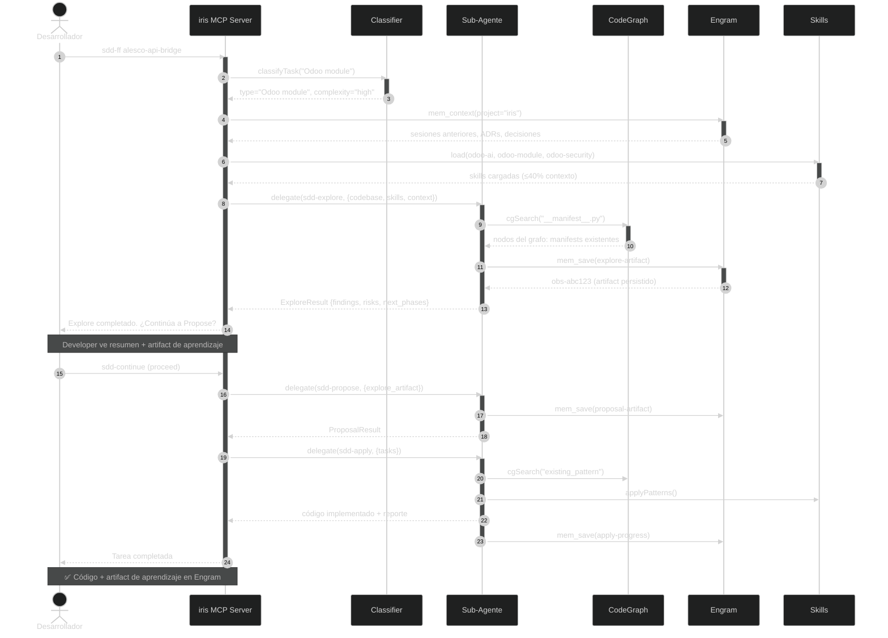
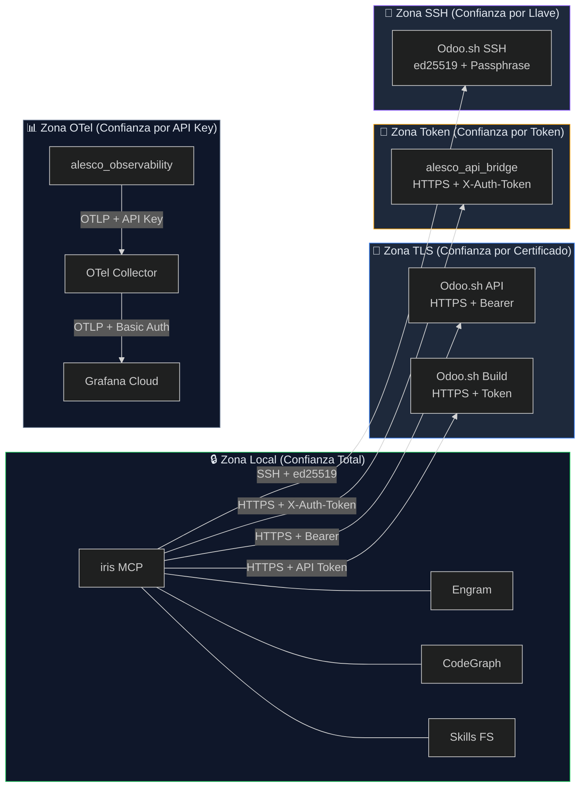
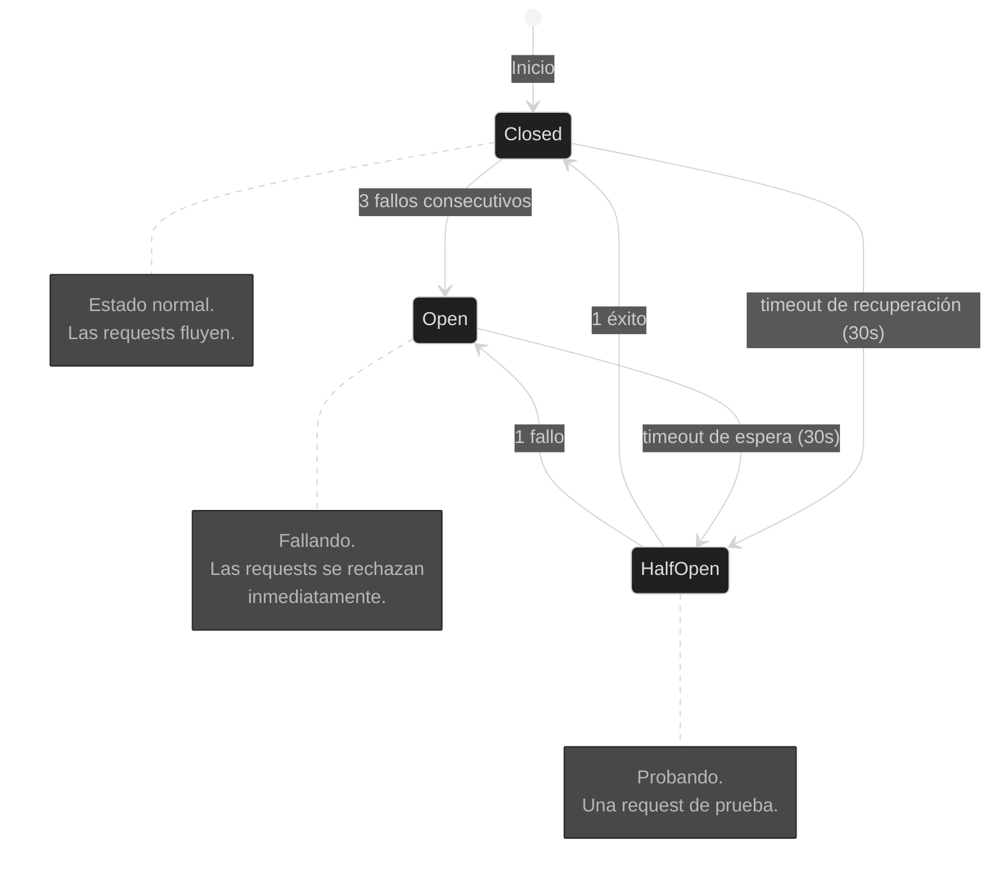
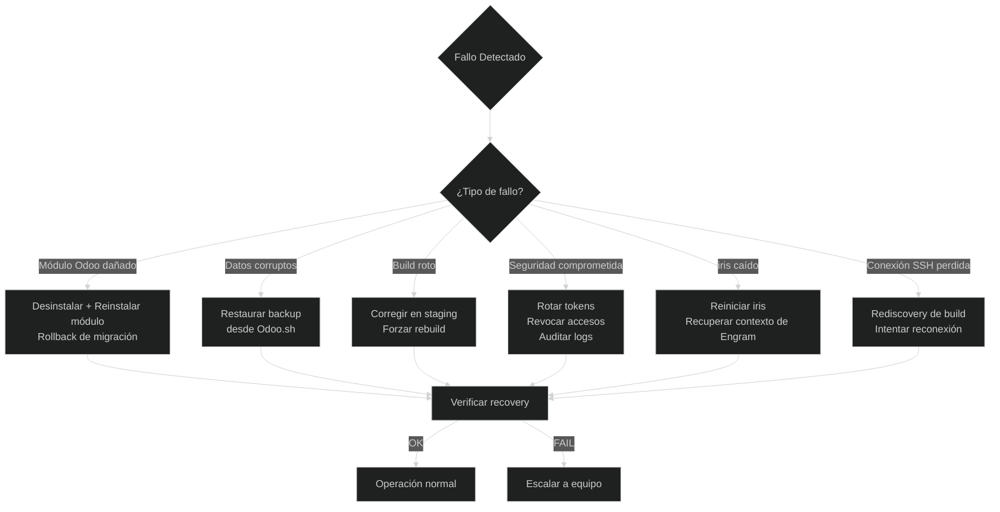
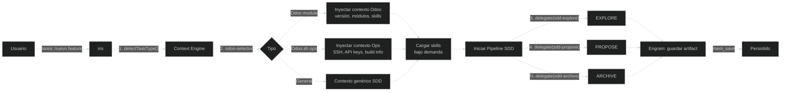
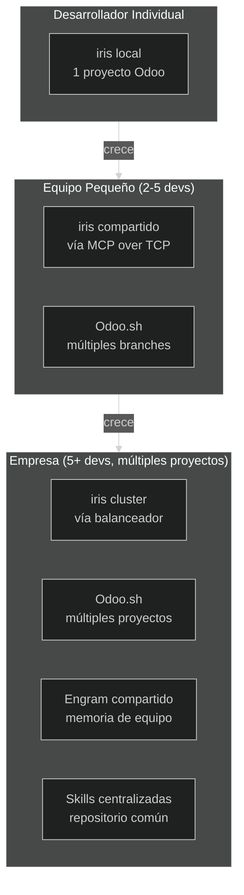

# 03-ARCHITECTURE.md — Arquitectura y Diseño

> **Versión:** 1.0.0
> **Última actualización:** 2026-06-11
> **Proyecto:** iris — Orquestador MCP para desarrollo Odoo Enterprise
> **Depende de:** `docs/01-PRD.md`, `02-ADR.md`, `AGENTS.md`
> **Ingeniería relacionada:** Systems Architecture (1), Orchestration Engineering (8), Context Engineering (4), Reliability Engineering (13)

---

## Índice

1. [System Overview](#1-system-overview)
2. [Component Architecture](#2-component-architecture)
3. [Connectivity Matrix](#3-connectivity-matrix)
4. [Frontend Architecture](#4-frontend-architecture)
5. [Reliability & Resilience](#5-reliability--resilience)
6. [Data Architecture](#6-data-architecture)
7. [Deployment Architecture](#7-deployment-architecture)
8. [Technology Stack Reference](#8-technology-stack-reference)

---

## 1. System Overview

iris es un **orquestador MCP (Model Context Protocol)** diseñado para el desarrollo profesional de Odoo Enterprise. Coordina agentes AI especializados, gestiona el ciclo de vida de desarrollo SDD (Spec-Driven Development), y proporciona herramientas de integración con Odoo.sh.

### 1.1 Principios Arquitectónicos

| Principio | Descripción |
|---|---|
| **Hexagonal** | Los componentes se comunican a través de puertos y adaptadores. El núcleo (domain) no depende de infraestructura externa. |
| **Screaming Architecture** | La estructura del proyecto refleja el dominio Odoo, no la tecnología. |
| **Odoo-First** | Todas las decisiones de diseño priorizan el ecosistema Odoo. |
| **Stateless** | iris no guarda estado local. Todo el estado persiste en Engram. Ver `02-ADR.md` ADR-002. |
| **Fail-Fast** | Si un componente no responde, iris falla rápido con un mensaje claro. |
| **Diseño para Falla** | Todo componente puede fallar. El sistema se degrada gracefulmente, no colapsa. Ver §5. |
| **Sin Estado Local** | iris no guarda estado en disco. Si iris se cae, al reiniciar recupera el contexto desde Engram. |

### 1.2 C4 Context Diagram

```mermaid
%%{init: {'theme': 'dark'}}%%
flowchart TD
    subgraph CapaPresentacion ["Capa de Presentación (MCP)"]
        MCP[MCP Protocol\nFastMCP Server]
        TOOLS[Tools Registry\n20+ tools]
        PROMPTS[Prompt Templates\nSDD phases]
    end

    subgraph CapaLogica ["Capa de Lógica (Domain)"]
        SDD[SDD Pipeline\n8 fases + DAG]
        HARN[Harness Engine\nLinters + Gates]
        CTX[Context Engine\nDetección + Carga]
        DELEGATE[Delegate Engine\nEnrutamiento]
        CLASSIFIER[Classifier\nComplejidad de tarea]
    end

    subgraph CapaAdaptadores ["Capa de Adaptadores (Ports)"]
        ENGRAM[Engram Port\nMemoria Persistente]
        CODEGRAPH[CodeGraph Port\nGrafo de Código]
        SUBS[Subprocess Port\nEjecución Local]
        TERM[Terminal Port\nEjecución CLI]
    end

    subgraph CapaInfra ["Capa de Infraestructura (Externa)"]
        ODOO_SH[Odoo.sh\nHosting Odoo Enterprise]
        BRIDGE[alesco_api_bridge\nREST API]
        OBSERV[alesco_observability\nOpenTelemetry]
        GRAFANA[Grafana Cloud\nDashboards Free Tier]
    end

    subgraph CapaSkills ["Capa de Conocimiento (Skills)"]
        SK_AI[odoo-ai]
        SK_CONTRIB[odoo-contribute]
        SK_OPS[odoo-ops]
        SK_SEC[odoo-security]
        SK_QUALITY[odoo-quality]
    end

    MCP --> TOOLS
    TOOLS --> DELEGATE
    PROMPTS --> SDD
    SDD --> HARN
    HARN --> CTX
    CTX --> DELEGATE
    DELEGATE --> CLASSIFIER
    CLASSIFIER -->|Explore| CODEGRAPH
    CLASSIFIER -->|Apply| SUBS
    CLASSIFIER -->|CLI| TERM
    SDD --> ENGRAM
    HARN --> ENGRAM
    TOOLS --> ODOO_SH
    TOOLS --> BRIDGE
    ODOO_SH --> OBSERV
    OBSERV --> GRAFANA
    CTX --> CapaSkills

    style CapaPresentacion fill:#0f172a,stroke:#22d3ee,stroke-width:2px
    style CapaLogica fill:#1e293b,stroke:#a855f7,stroke-width:2px
    style CapaAdaptadores fill:#0f172a,stroke:#10b981,stroke-width:2px
    style CapaInfra fill:#1e293b,stroke:#f59e0b,stroke-width:2px
    style CapaSkills fill:#0f172a,stroke:#64748b,stroke-width:2px
```



*La arquitectura sigue el patrón hexagonal (ports & adapters). El **núcleo (Capa de Lógica)** contiene SDD, Harness, Context Engine y Delegate — no depende de infraestructura externa. La **Capa de Presentación** expone tools MCP. Los **Adaptadores** implementan los puertos para conectarse a sistemas externos (Engram, CodeGraph, subprocess). La **Infraestructura** incluye Odoo.sh, los módulos Odoo y Grafana. La **Capa de Conocimiento** son skills markdown cargadas bajo demanda. Las flechas indican flujo de control: siempre del núcleo hacia afuera, nunca al revés.*

---

## 2. Component Architecture

### 2.1 Core Engine

El Core Engine de iris es el orquestador central. Expone tools MCP, gestiona el pipeline SDD, y coordina la comunicación entre todos los componentes.

**Estructura del MCP Server:**

```
src/
├── server.ts              ← Servidor MCP principal (FastMCP)
├── index.ts               ← Punto de entrada
├── updater.ts             ← Actualizador de configuración
├── config.ts              ← Configuración global
├── config/                ← Configuraciones adicionales
├── types/                 ← Definiciones de tipos
│   └── index.ts           ← Phase, DelegateRequest, AdapterName
├── router/                ← Enrutamiento de fases y tareas
│   ├── selector.ts        ← Phase→Adapter mapping
│   └── classifier.ts      ← Clasificación de tareas por complejidad
├── tools/                 ← Tools MCP expuestas
│   └── delegate.ts        ← Delegación de tareas a agentes
├── context/               ← Sistema de contexto
│   ├── odoo-selector.ts   ← Detector de tipo de tarea Odoo
│   └── odoo.js            ← Constructor de contexto Odoo
├── adapters/              ← Adaptadores de ejecución
├── executor/              ← Ejecutores
│   ├── subprocess.ts      ← Ejecución en subproceso
│   └── terminal.ts        ← Ejecución en terminal
├── engram/                ← Cliente Engram
│   ├── client.ts          ← Cliente MCP de Engram
│   └── sync.ts            ← Sincronización de artefactos
├── codegraph/             ← Cliente CodeGraph
│   └── client.ts          ← Cliente MCP de CodeGraph
├── store/                 ← Almacenamiento local temporal
└── diagrams/              ← Generación de diagramas
```

#### Subcomponentes del Core

| Componente | Archivo | Responsabilidad |
|---|---|---|
| **FastMCP Server** | `server.ts` | Servidor MCP principal, registro de tools y resources |
| **Router** | `router/selector.ts` | Mapea fases SDD a adaptadores concretos |
| **Classifier** | `router/classifier.ts` | Clasifica tareas por tipo (Odoo module, Odoo.sh ops, general) y complejidad |
| **Context Engine** | `context/odoo-selector.ts` | Detecta el tipo de tarea Odoo e inyecta contexto apropiado (versión, módulos, skills) |
| **Delegate Engine** | `tools/delegate.ts` | Enruta tareas a sub-agentes especializados según la fase SDD |
| **Harness Engine** | (integrado en pipeline) | Sistema de enforcement mecánico: linters, quality gates, validaciones |

### 2.2 Adapters Layer

Los adaptadores implementan los puertos definidos por el core. Cada adaptador encapsula un sistema externo.

| Puerto | Adaptador | Sistema Externo | Protocolo |
|---|---|---|---|
| `EngramPort` | `engram/client.ts` | Engram (memoria persistente) | MCP local (STDIO) |
| `CodeGraphPort` | `codegraph/client.ts` | CodeGraph (grafo de código) | MCP local (STDIO) |
| `SubprocessPort` | `executor/subprocess.ts` | Subprocesos locales | child_process |
| `TerminalPort` | `executor/terminal.ts` | Terminal interactiva | PTY |

#### Módulos Odoo (Infraestructura)

**alesco_api_bridge** — Bridge REST seguro para que iris acceda a datos Odoo:

```
alesco_api_bridge/
├── __manifest__.py         ← Dependencias: base, web
├── __init__.py
├── controllers/
│   ├── __init__.py
│   ├── main.py             ← Endpoint /alesco/api/query
│   └── build_info.py       ← Endpoint /alesco/api/build-info
├── models/
│   ├── __init__.py
│   └── api_log.py          ← Log de accesos al bridge
├── data/
│   └── config_parameter.xml ← Token de autenticación
├── security/
│   └── ir.model.access.csv  ← Permisos del modelo de log
└── tests/
    ├── __init__.py
    ├── test_controllers.py  ← Tests de endpoints
    └── test_security.py     ← Tests de autenticación
```

**alesco_observability** — OpenTelemetry para Odoo, gratis y open source (Apache-2.0):

```
alesco_observability/
├── __manifest__.py
├── __init__.py
├── models/
│   ├── __init__.py
│   └── otel_trace.py       ← Gestión de trazado OTel
├── controllers/
│   ├── __init__.py
│   └── otel_middleware.py  ← Middleware de tracing
├── pyproject.toml          ← Dependencia: opentelemetry-distro-odoo
├── security/
│   └── ir.model.access.csv
└── tests/
    ├── __init__.py
    ├── test_tracing.py
    └── test_middleware.py
```

**Tools Odoo.sh** (en iris) — Tools MCP para interactuar con Odoo.sh:

```
src/tools/odoo/
├── bridge.ts               ← Tool: alesco_api_bridge query
├── ssh-discover.ts         ← Tool: descubre URL SSH dinámica
├── logs.ts                 ← Tool: tail de logs Odoo
├── psql.ts                 ← Tool: queries PostgreSQL seguras
├── status.ts               ← Tool: estado de builds
├── backups.ts              ← Tool: listado y restore de backups
└── audit.ts                ← Tool: audit logs de Odoo.sh
```

### 2.3 Agent System

iris implementa un sistema de **agentes especialistas Odoo** organizados en un modelo de cebolla (Onion Model) de 4 capas, definido en detalle en `AGENTS.md`.

```
Layer 1 — Core Odoo (siempre cargados):
  └─ Odoo Architect ──── Razonamiento arquitectónico, decisiones estructurales

Layer 2 — Development:
  ├─ Odoo Modeler ────── Modelos, campos, ORM, constraints, seguridad
  └─ Odoo Viewer ────── Vistas XML, QWeb reports, widgets, assets

Layer 3 — Quality:
  ├─ Odoo Tester ─────── TransactionCase, HttpCase, E2E Playwright
  └─ Odoo Reviewer ───── Code review OCA, security audit, performance

Layer 4 — Operations:
  ├─ Odoo Ops ────────── Odoo.sh SSH, logs, backups, PostgreSQL
  └─ Odoo Observable ──── OpenTelemetry, tracing, query analysis
```

#### Principios de Activación

| Capa | Activación | Persistencia en contexto |
|---|---|---|
| **Layer 1 — Core** | Siempre activo en toda sesión SDD | Arquitecto permanece toda la sesión |
| **Layer 2 — Dev** | Se activa en fases `design`, `tasks`, `apply` | Se carga cuando hay implementación concreta |
| **Layer 3 — Quality** | Se activa en fases `apply`, `verify` | Se carga después de implementar |
| **Layer 4 — Ops** | Bajo demanda (comandos específicos) | Se carga y descarga por tarea |

#### Agent-to-SDD Phase Mapping

| Fase SDD | Agente Primario | Agentes de Soporte |
|---|---|---|
| **explore** | Odoo Architect | — |
| **propose** | Odoo Architect | Odoo Modeler, Odoo Viewer |
| **spec** | Odoo Architect | Todos (cada uno en su dominio) |
| **design** | Odoo Architect | Odoo Modeler |
| **tasks** | Odoo Architect | Todos |
| **apply** | Odoo Modeler / Odoo Viewer | Odoo Tester |
| **verify** | Odoo Reviewer | Odoo Tester, Odoo Security |
| **archive** | Odoo Architect | Todos (lessons learned) |

### 2.4 SDD Pipeline

El pipeline SDD (Spec-Driven Development) es el flujo de trabajo central de iris. Consta de 8 fases organizadas en un DAG (Directed Acyclic Graph):

```
proposal -> specs --> tasks -> apply -> verify -> archive
             ^
             |
           design
```

#### Descripción de Fases

| Fase | Propósito | Output | Agente |
|---|---|---|---|
| **explore** | Investigar el codebase, entender el problema | Exploration artifact | Architect |
| **propose** | Definir alcance y enfoque del cambio | Proposal | Architect |
| **spec** | Escribir especificaciones detalladas | Spec (requisitos + escenarios) | Architect |
| **design** | Diseño técnico con decisiones arquitectónicas | Design document | Architect + Modeler |
| **tasks** | Desglose en tareas implementables | Task checklist | Architect |
| **apply** | Implementar código siguiendo specs y design | Código + tests | Modeler / Viewer |
| **verify** | Validar contra specs, ejecutar quality gates | Verify report | Reviewer |
| **archive** | Sincronizar delta specs, cerrar cambio | Archive report | Architect |

---

## 3. Connectivity Matrix

### 3.1 Communication Flows



*El flujo SDD completo inicia con el developer invocando `sdd-ff`. iris clasifica la tarea usando el Classifier, recupera contexto de Engram, carga skills bajo demanda, y delega cada fase a sub-agentes especializados. Cada sub-agente usa CodeGraph exclusivamente para exploración (ver `02-ADR.md` ADR-003), persiste artifacts en Engram (ADR-002), y aplica patrones de las skills cargadas.*

### 3.2 Protocol Reference

| Connection | Protocol | Port | Auth Method | Encryption | Direction |
|---|---|---|---|---|---|
| Developer ↔ iris (CLI) | MCP/STDIO | N/A | Config file (`AGENTS.md`) | N/A (local loopback) | Bidireccional |
| iris ↔ CodeGraph | MCP | Dinámico (local) | Config (`~/.config/`) | Local (sin red) | Bidireccional |
| iris ↔ Engram | Engram API (MCP) | Local socket | Config (`~/.config/`) | Local (sin red) | Bidireccional |
| Bridge ↔ Odoo | HTTP REST | 8069 (dev) / 443 (prod) | Token (`X-Auth-Token`) | HTTPS (TLS 1.3) | Bidireccional |
| iris ↔ Odoo.sh (SSH) | SSH v2 | 22 | SSH key ed25519 (passphrase) | SSH (cifrado por sesión) | iris → Odoo.sh |
| iris ↔ Odoo.sh API | HTTPS REST | 443 | Bearer token (API key) | TLS 1.3 | Bidireccional |
| iris ↔ Odoo.sh Build | HTTPS | 443 | Odoo.sh API token | TLS 1.3 | Bidireccional |
| Odoo ↔ OpenTelemetry | OTLP/gRPC | 4317 | N/A (plugin interno) | Opcional (TLS configurable) | Odoo → Collector |
| Odoo ↔ OpenTelemetry (HTTP) | OTLP/HTTP | 4318 | N/A (plugin interno) | Opcional (TLS configurable) | Odoo → Collector |
| Grafana ↔ OpenTelemetry | OTLP/HTTP | 443 (Grafana Cloud) | Basic Auth (instance-id:api-key) | TLS 1.3 | Collector → Grafana |
| Skills ↔ iris | File system | N/A | N/A | N/A (disco local) | iris → Skills (lectura) |
| Prompts ↔ iris | File system | N/A | N/A | N/A (disco local) | iris → Prompts (lectura) |
| Odoo ↔ PostgreSQL | PostgreSQL wire | 5432 | Password / Peer | Local (Odoo.sh internal) | Bidireccional |

#### Detalle: MCP (Model Context Protocol)

Todas las comunicaciones internas de iris (con Engram, CodeGraph y el developer) usan **MCP** como protocolo unificado. MCP es un protocolo basado en JSON-RPC 2.0 que define:

- **Tools**: funciones invocables con parámetros tipados y descripciones
- **Resources**: datos expuestos con URI scheme
- **Prompts**: templates de instrucciones precargables
- **Transport**: STDIO (local) o SSE (remoto)

#### Detalle: SSH Dinámico

El SSH de Odoo.sh es **dinámico**: la URL cambia en cada build. El formato es:

```
ssh {build_id}@{project}.odoo.com -p 22
```

iris descubre `build_id` automáticamente consultando la API REST de Odoo.sh antes de cada conexión (ver `02-ADR.md` ADR-006). Este descubrimiento ocurre en `src/tools/odoo/ssh-discover.ts`.

### 3.3 Port/Endpoint Mapping

#### Puertos

| Componente | Puerto(s) | Protocolo | Propósito |
|---|---|---|---|
| **Odoo (desarrollo)** | 8069 | HTTP | Instancia Odoo local (docker/venv) |
| **Odoo (producción)** | 443 | HTTPS | Odoo.sh — TLS termination en Nginx |
| **Odoo Longpolling** | 8072 | HTTP | Notificaciones en tiempo real (bus) |
| **PostgreSQL** | 5432 | PostgreSQL wire | Base de datos Odoo (localhost) |
| **OpenTelemetry gRPC** | 4317 | OTLP/gRPC | Recolección de trazas OTel |
| **OpenTelemetry HTTP** | 4318 | OTLP/HTTP | Recolección alternativa de trazas |
| **Grafana Cloud OTLP** | 443 | OTLP/HTTP | Export a Grafana Cloud |
| **SSH Odoo.sh** | 22 | SSH v2 | Shell remoto dinámico |
| **Odoo.sh API** | 443 | HTTPS | API REST de gestión |

#### Endpoints

| Componente | Endpoint | Método | Propósito |
|---|---|---|---|
| **alesco_api_bridge** | `/alesco/api/query` | POST | Consulta CRUD a modelos Odoo |
| **alesco_api_bridge** | `/alesco/api/build-info` | GET | Información del build actual |
| **Odoo** | `/web` | GET | Interfaz web de Odoo |
| **Odoo** | `/jsonrpc` | POST | API XML-RPC/JSON-RPC |
| **Odoo** | `/longpolling/poll` | GET | Longpolling para notificaciones |
| **Odoo.sh API** | `/api/1/projects/{id}/branches/{branch}` | GET | Estado del build y build_id |
| **Odoo.sh API** | `/api/1/projects/{id}/branches/{branch}/backups` | GET | Listado de backups |
| **Odoo.sh API** | `/api/1/projects/{id}/branches/{branch}/backups/{bid}` | POST | Restore de backup |
| **Odoo SSH** | `ssh {build_id}@{project}.odoo.com` | SSH | Conexión shell remota |

#### Security Zones Diagram



*Cada conexión pertenece a una zona de seguridad con mecanismos diferentes. La **Zona Local** no tiene autenticación explícita (confianza en el entorno local). La **Zona TLS** confía en el certificado TLS de Odoo.sh. La **Zona Token** requiere un token secreto rotable periódicamente (ver `02-ADR.md` ADR-004). La **Zona SSH** usa llave pública ed25519 con passphrase. La **Zona OTel** usa API Key para autenticación contra Grafana Cloud. La regla de seguridad fundamental es defensa en profundidad: si una capa falla, la siguiente debe proteger.*

#### Contratos de API

**Contrato: iris → alesco_api_bridge**

```
POST /alesco/api/query
Headers:
  X-Auth-Token: <string>
  Content-Type: application/json

Request Body:
{
  "params": {
    "model": "<string>",         // nombre del modelo Odoo (ej: "res.partner")
    "method": "<string>",        // "search_read" | "write" | "create" | "unlink"
    "domain": [<array>],         // dominio de búsqueda Odoo
    "fields": [<string>],        // campos a leer
    "limit": <number>,           // límite de resultados (default: 20)
    "values": {<object>},        // valores para write/create
    "ids": [<number>]            // IDs para write/unlink
  }
}

Response:
{
  "result": {
    "result": <any>,
    "error": <string | null>
  }
}
```

**Contrato: iris → Odoo.sh API**

```
GET https://www.odoo.sh/api/1/projects/{project}/branches/{branch}
Headers:
  Authorization: Bearer <token>

Response:
{
  "id": 12345,
  "project_id": 67890,
  "name": "main",
  "build_id": 24601153,
  "status": "running" | "idle" | "error",
  "url": "https://{project}-{branch}-{build_id}.dev.odoo.com",
  "ssh_user": "24601153",
  "ssh_host": "{project}.odoo.com",
  "db_name": "{project}-{branch}-{build_id}",
  "commit": "abc123..."
}
```

**Contrato: alesco_observability → Grafana**

```
OTLP Protocol (HTTP/gRPC)
Endpoint: {grafana-cloud-otlp-endpoint}:4318
Headers:
  Authorization: Basic base64({instance-id}:{api-key})

Data:
  - Traces: Cada request HTTP a Odoo genera un trace
  - Metrics: Conteo de requests, duración, errores
  - Logs: Logs estructurados con trace_id correlation
```

---

## 4. Frontend Architecture

> **Estado:** 📋 Pendiente — documento planificado en el roadmap (ver `docs/01-PRD.md` §11).

Este documento cubrirá en futuras iteraciones:

- Patrones de frontend Odoo (OWL components, widgets)
- Asset bundles (JavaScript, SCSS)
- Temas SCSS y personalización visual
- Portal Odoo y personalización UX

Por ahora, el frontend de Odoo se maneja exclusivamente a través de los módulos estándar de Odoo y las personalizaciones se gestionan vía el pipeline SDD de iris, que genera vistas XML, templates QWeb y configuraciones de assets según las especificaciones del módulo.

---

## 5. Reliability & Resilience

### 5.1 Timeout Strategies

| Conexión | Timeout | Rationale |
|---|---|---|
| Bridge (alesco_api_bridge) | 10s | Operaciones CRUD vía REST, latencia Odoo.sh esperada |
| SSH Odoo.sh | 15s | Handshake SSH + ejecución de comando |
| API Odoo.sh | 5s | API REST liviana, debe responder rápido |
| Engram (MCP local) | 2s | Comunicación local (STDIO), latencia mínima |
| CodeGraph (MCP local) | 2s | Comunicación local (STDIO), latencia mínima |
| OpenTelemetry Collector | 60s | Export batch, pérdida aceptable |

### 5.2 Retry & Circuit Breaker

| Patrón | ¿Dónde? | Descripción |
|---|---|---|
| **Retry con Backoff** | Conexiones a Odoo.sh, bridge | 3 intentos con backoff exponencial (1s, 2s, 4s) |
| **Circuit Breaker** | Conexión SSH | Si falla 3 veces seguidas, esperar 30s antes de reintentar |
| **Timeout** | Todas las conexiones externas | 10s para bridge, 15s para SSH, 5s para API Odoo.sh |
| **Fallback** | Tools de Odoo.sh | Si SSH falla, intentar vía API REST de Odoo.sh |
| **Bulkhead** | Separar conexiones | Bridge, SSH y API Odoo.sh usan pools de conexión independientes |
| **Health Check** | iris al inicio | Verificar conexiones, reportar estado |

#### Circuit Breaker State Machine



*El Circuit Breaker para conexiones SSH. En estado **Closed**, las requests fluyen normalmente. Si ocurren 3 fallos consecutivos, pasa a **Open**: todas las requests se rechazan inmediatamente. Después de 30 segundos, pasa a **HalfOpen** y permite una request de prueba. Si esa request tiene éxito, vuelve a Closed. Si falla, vuelve a Open por otros 30 segundos.*

### 5.3 Disaster Recovery



*El árbol de decisión para recuperación ante desastres. Cada tipo de fallo tiene un procedimiento específico. Para **iris caído**: reiniciar y recuperar contexto de Engram sin pérdida de estado (principio stateless). Para **conexión SSH perdida**: rediscovery automático del build vía API Odoo.sh (ver `02-ADR.md` ADR-006).*

#### Backup Strategy (Odoo.sh)

| Tipo | Frecuencia | Retención | Contenido |
|---|---|---|---|
| Diario | Cada 24h | 7 días | DB completa + filestore |
| Semanal | Cada 7 días | 4 semanas | DB completa + filestore |
| Mensual | Cada 30 días | 12 meses | DB completa + filestore |
| Bajo demanda | Manual | Hasta eliminación | DB completa + filestore |

#### Health Check de iris

Al iniciar, iris ejecuta:

```bash
# 1. Verificar que Engram responde
✓ engram_mem_stats()

# 2. Verificar que CodeGraph responde
✓ cgSearch("test") → resultados

# 3. Descubrir build actual de Odoo.sh
✓ API Odoo.sh → build_id, URL, estado

# 4. Verificar conexión al bridge
✓ POST /alesco/api/query → token válido

# 5. Verificar conexión SSH
✓ ssh {build_id}@{host} → conecta

# 6. Reportar estado general
ℹ️ iris 1.0.0 — Todos los sistemas operativos
```

#### Connectivity Failure Modes

| Failure | Detección | Mitigation Time | Recovery Time | RTO Objetivo |
|---|---|---|---|---|
| Bridge unreachable | 5s (health check) | 10s (rediscovery) | 30s (reconexión) | < 1 min |
| SSH connection lost | 3s (circuit breaker) | 0s (automático) | 30s (half-open) | < 1 min |
| Engram unavailable | 2s (MCP timeout) | 5s (restart daemon) | 10s (reinicio) | < 30s |
| CodeGraph fails | 2s (MCP timeout) | 5s (reindex) | 30s (reindex completo) | < 1 min |
| Odoo.sh API unavailable | 5s (HTTP timeout) | 0s (cache fallback) | 1s (usa cache) | < 10s |
| Token expirado | 2s (HTTP 401) | Manual | 5 min (rotación) | < 15 min |
| PostgreSQL down | 10s (Odoo.sh alert) | Automático (HA) | 5 min (failover) | < 10 min |

---

## 6. Data Architecture

### 6.1 Engram Data Flow



*El flujo de datos de una tarea SDD comienza cuando el usuario envía una solicitud a iris. El **Context Engine** clasifica la tarea usando `odoo-selector.ts`. Según el tipo, inyecta el contexto apropiado (versión Odoo, módulos instalados, skills, información de build). Luego carga las skills relevantes bajo demanda y finalmente inicia el pipeline SDD. Cada fase del pipeline produce un artifact que se persiste en Engram vía `mem_save`. Ningún estado se guarda localmente.*

#### Tipos de Datos en Engram

| Tipo | Propósito | Frecuencia | Tamaño típico |
|---|---|---|---|
| **Session context** | Decisiones, ADRs, historial de sesión | Por inicio/fin de sesión | ~5KB |
| **SDD artifacts** | Explore, propose, spec, design, tasks | Por fase SDD | ~10-50KB |
| **Learning artifacts** | Teaching Mode output (código + fundamentos + rutas UI) | Por tarea completada | ~5-20KB |
| **UI Maps** | Ubicación de campos en vistas Odoo | Bajo demanda | ~1-5KB |
| **Log summaries** | Resumen de logs Odoo.sh | Por cada consulta de logs | ~2-10KB |
| **Build cache** | Último build_id conocido | Por cada rediscovery | ~0.5KB |

#### Ciclo de Vida de un Artifact SDD

```
Fase SDD → Sub-agente genera artifact → mem_save(topic_key) → 
Engram persiste → Future sessions recuperan vía mem_search →
mem_get_observation(id) → Sub-agente recibe contexto completo
```

### 6.2 Caching Strategy

| Cache | Tipo | TTL | Propósito |
|---|---|---|---|
| **Build ID** | En memoria | 5 min (o hasta error) | Evitar llamadas repetidas a API Odoo.sh |
| **Skills** | En contexto | Duración de sesión | Evitar recarga de skills en cada fase SDD |
| **CodeGraph index** | Externo (CodeGraph) | Por proyecto | Indización de código para búsqueda semántica |
| **UI Map** | Engram | Persistente | Ubicación de campos en vistas Odoo |

iris no implementa una capa de cache tradicional. La estrategia se basa en:
- **Carga bajo demanda**: skills y contexto se cargan solo cuando se necesitan
- **Persistencia en Engram**: el estado se recupera entre sesiones sin cache local
- **TTL corto**: el build_id se cachea solo 5 minutos, suficiente para operaciones secuenciales

---

## 7. Deployment Architecture

### 7.1 Diagrama de Despliegue

```mermaid
%%{init: {'theme': 'dark'}}%%
flowchart TD
    subgraph Local ["Entorno Local del Desarrollador"]
        DEV[Desarrollador\nCLI / IDE]
        IRIS[iris MCP Server\nTypeScript / Node.js]
        ENGRAM[Engram\nMemoria Persistente]
        CODEGRAPH[CodeGraph\nGrafo de Código]
        SKILLS[Skills\nMarkdown Expertise]
        PROMPTS[Prompts\nTemplates SDD]
    end

    subgraph OdooInfra ["Infraestructura Odoo"]
        BRIDGE[alesco_api_bridge\nREST Bridge]
        OBSERV[alesco_observability\nOpenTelemetry]
        ODOO[Odoo Enterprise\nORM / DB]
        PG[(PostgreSQL\nOdoo Database)]
    end

    subgraph Cloud ["Nube (Odoo.sh / Grafana)"]
        ODOO_SH_API[Odoo.sh API\nREST]
        ODOO_SH_SSH[Odoo.sh SSH\nShell Dinámico]
        ODOO_SH_BUILD[Odoo.sh Build\nCI / Deploy]
        GRAFANA[Grafana Cloud\nDashboards Free Tier]
    end

    DEV <-->|MCP / STDIO\nsin puerto| IRIS
    IRIS <-->|MCP local\nmem_* / cg_*| ENGRAM
    IRIS <-->|MCP local\ncgSearch / cgTrace| CODEGRAPH
    IRIS -->|lectura\nfile system| SKILLS
    IRIS -->|lectura\nfile system| PROMPTS

    IRIS -->|HTTPS :443\nX-Auth-Token| BRIDGE
    BRIDGE -->|ORM calls| ODOO
    ODOO -->|SQL :5432| PG

    IRIS -->|HTTPS :443\nBearer token| ODOO_SH_API
    IRIS -->|SSH :22\ned25519 key| ODOO_SH_SSH
    IRIS -->|HTTPS :443\nAPI token| ODOO_SH_BUILD

    ODOO -->|deploy push| ODOO_SH_BUILD
    OBSERV -->|OTLP gRPC :4317\nAPI Key| GRAFANA
    ODOO_SH_BUILD -->|logs / metrics| ODOO_SH_SSH

    BRIDGE <-->|misma instancia\nlocalhost| OBSERV

    style Local fill:#0f172a,stroke:#22d3ee,stroke-width:2px
    style OdooInfra fill:#1e293b,stroke:#f59e0b,stroke-width:2px
    style Cloud fill:#0f172a,stroke:#10b981,stroke-width:2px
```



*Todos los componentes se organizan en tres entornos: **Local** (desarrollador), **Infraestructura Odoo** (módulos dentro de Odoo) y **Nube** (Odoo.sh / Grafana). Las conexiones locales usan MCP o file system; las conexiones remotas usan HTTPS con autenticación por token o SSH con llave ed25519. El bridge y la observabilidad corren dentro de la misma instancia Odoo.*

### 7.2 Estrategia de Escalado



*iris escala naturalmente desde un desarrollador individual hasta equipos enterprise. En modo **individual**, iris corre localmente conectado a un proyecto Odoo.sh. En modo **equipo**, iris se comparte vía MCP sobre TCP. En modo **empresa**, iris corre en un cluster con balanceador, Engram compartido como memoria de equipo, y skills centralizadas en un repositorio común. La arquitectura hexagonal permite escalar sin cambios en el núcleo — solo se agregan adaptadores.*

### 7.3 Upgrade Strategy

```
Procedimiento para upgrade de versión Odoo (ej. 18.0 → 19.0):

1. SEMANA 1: Auditoría
   - Revisar release notes de Odoo
   - Identificar breaking changes
   - Auditar módulos custom contra nueva API
   - Crear plan de migración

2. SEMANA 2: Staging
   - Crear branch de upgrade en Odoo.sh
   - Ejecutar upgrade y corregir errores
   - Ejecutar test suite completo
   - Validar funcionalmente con el equipo

3. SEMANA 3: Producción
   - Backup completo antes del upgrade
   - Ejecutar upgrade (nunca upgrade directo en producción)
   - Monitoreo intensivo (24h)
   - Rollback si es necesario (preparado antes de iniciar)
```

---

## 8. Technology Stack Reference

### 8.1 Stack del Proyecto

| Capa | Tecnología | Versión | Propósito |
|---|---|---|---|
| **Runtime** | Node.js | 20 LTS | Ejecución del servidor MCP |
| **Lenguaje** | TypeScript | 5.x | Tipado estático para el orquestador |
| **MCP Framework** | FastMCP | Última | Framework MCP para servidores de herramientas |
| **Memoria** | Engram | Integrado | Sistema de memoria persistente para agentes AI |
| **Code Analysis** | CodeGraph | Integrado | Indexación de código en grafo |
| **ERP** | Odoo Enterprise | 18.0 | Plataforma objetivo de desarrollo |
| **Observabilidad** | opentelemetry-distro-odoo | Apache-2.0 | OpenTelemetry gratis para Odoo |
| **Dashboards** | Grafana Cloud Free Tier | — | Visualización de trazas y métricas |
| **Infraestructura** | Odoo.sh | — | Hosting Odoo Enterprise |
| **Skills** | Markdown (SKILL.md) | — | Conocimiento experto cargable |
| **SSH** | OpenSSH | 9.x | Conexión segura a Odoo.sh |

### 8.2 Dependencias del Proyecto (iris MCP Server)

| Dependencia | Tipo | Propósito |
|---|---|---|
| `fastmcp` | Runtime | Framework MCP server |
| `typescript` | Dev | Compilador TS |
| `tsx` | Dev | Ejecución TypeScript directa |
| `vitest` | Dev | Test runner |
| `biome` | Dev | Linter + formatter |
| Engram MCP client | Runtime | Memoria persistente |
| CodeGraph MCP client | Runtime | Análisis de código |

### 8.3 Dependencias Odoo (alesco_api_bridge)

| Dependencia | Tipo | Propósito |
|---|---|---|
| `base` | Odoo module | Dependencia base de Odoo |
| `web` | Odoo module | Controladores HTTP |

### 8.4 Dependencias Odoo (alesco_observability)

| Dependencia | Tipo | Propósito |
|---|---|---|
| `opentelemetry-distro-odoo` | PyPI (Apache-2.0) | OpenTelemetry para Odoo |
| `base` | Odoo module | Dependencia base |
| `web` | Odoo module | Middleware HTTP |

### 8.5 Matriz de Versiones Odoo Soportadas

| Versión Odoo | iris | alesco_api_bridge | alesco_observability |
|---|---|---|---|
| **18.0** | ✅ Full support | ✅ Full support | ✅ Full support |
| **17.0** | 🔧 Posible (no testado) | 🔧 Posible | 🔧 Posible |
| **16.0** | ❌ No soportado | ❌ No soportado | ❌ No soportado |

### 8.6 Runbooks de Operaciones

```bash
# Verificar estado de todas las conexiones
iris> tool: odoo-check-connections

# Monitorear estado del bridge en tiempo real
iris> tool: odoo-health --watch

# Listar backups disponibles
iris> tool: odoo-backups list

# Verificar integridad de backup
iris> tool: odoo-backups verify --latest

# Ver estado de builds CI
iris> tool: odoo-build-status

# Simular fallo de conexión (test)
iris> tool: odoo-test-circuit-breaker
```

---

## Apéndice A: Cross-Reference Matrix

| Concepto | Documento | Sección(es) |
|---|---|---|
| Pipeline SDD (8 fases) | `docs/01-PRD.md` | §4 |
| Agentes especialistas Odoo | `AGENTS.md` | §3, §5 |
| ADR-001: MCP Protocol | `02-ADR.md` | ADR-001 |
| ADR-002: Engram Single Source of Truth | `02-ADR.md` | ADR-002 |
| ADR-003: CodeGraph Only Explore | `02-ADR.md` | ADR-003 |
| ADR-004: Token Auth | `02-ADR.md` | ADR-004 |
| ADR-005: OpenTelemetry Gratis | `02-ADR.md` | ADR-005 |
| ADR-006: SSH Dinámico | `02-ADR.md` | ADR-006 |
| ADR-007: Skills en Markdown | `02-ADR.md` | ADR-007 |
| Harness de Enforcement | `docs/01-PRD.md` | §6 |
| 13 Ingenierías | `docs/01-PRD.md` | §3 |
| Reciprocal Apprenticeship | `docs/04-CONTRIBUTING.md` | §2 |
| Seguridad en capas | `SECURITY.md` | §2 |
| Seguridad en comunicación | `SECURITY.md` | §8 |
| Resilience patterns | `docs/03-ARCHITECTURE.md` | §5 |
| Circuit breaker | `docs/03-ARCHITECTURE.md` | §5.2 |
| Runbook: Bridge falla | `docs/03-ARCHITECTURE.md` | §7.1 |

---

## Apéndice B: Glosario de Términos de Arquitectura

| Término | Definición |
|---|---|
| **MCP** | Model Context Protocol — protocolo JSON-RPC 2.0 de Anthropic para comunicación entre LLMs y herramientas. |
| **SDD** | Spec-Driven Development — pipeline de desarrollo por fases con especificaciones formales. |
| **Harness** | Sistema de enforcement mecánico que valida reglas estructurales (linters, gates, tests). |
| **Engram** | Sistema de memoria persistente para agentes AI. Guarda observaciones, sesiones y artefactos. |
| **CodeGraph** | Herramienta de indexación de código en grafo. Permite búsqueda semántica y trazado de flujo. |
| **OTLP** | OpenTelemetry Protocol — protocolo estándar para exportar trazas, métricas y logs. |
| **ADR** | Architecture Decision Record — registro de decisión arquitectónica. |
| **OCA** | Odoo Community Association — organización que define estándares para módulos Odoo. |
| **SSH Dinámico** | Conexión SSH cuya URL (build_id) cambia en cada build de Odoo.sh. iris la descubre automáticamente vía API. |
| **Circuit Breaker** | Patrón de resiliencia que previene llamadas a un servicio que está fallando. |
| **Backoff Exponencial** | Estrategia de reintento donde el tiempo de espera se duplica en cada intento (1s, 2s, 4s). |
| **Build ID** | Identificador numérico único de cada build en Odoo.sh. Cambia en cada push. |
| **Graceful Degradation** | Capacidad de seguir funcionando parcialmente cuando un componente falla. |
| **Bulkhead** | Patrón de resiliencia que aísla conexiones en pools independientes. |

---

*Este documento de arquitectura y diseño es el más pesado del sistema iris porque consolida toda la información estructural: componentes, conectividad, despliegue, resiliencia y referencias técnicas. Los ADRs se documentan por separado en `02-ADR.md`. Cualquier cambio arquitectónico que no sea puramente cosmético requiere un nuevo ADR y la actualización de este documento.*

*Para cambios en la conectividad (nuevo componente, cambio de protocolo, nuevo puerto), actualizar la Connectivity Matrix en §3. Para cambios en estrategias de resiliencia (timeouts, retry, circuit breaker), actualizar §5.*

