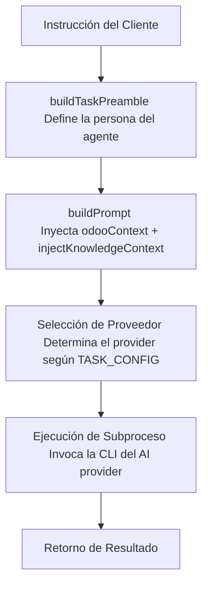

# iris Architecture — v1.1.8

## 1. Resumen General (Overview)
`iris` es un servidor MCP (Model Context Protocol) desarrollado en TypeScript que actúa como orquestador para múltiples interfaces de línea de comandos (CLIs) de proveedores de Inteligencia Artificial. Su función principal consiste en recibir las llamadas a herramientas (tool calls) del cliente MCP (como Claude Code), construir prompts enriquecidos con contexto específico del dominio y delegar la ejecución a los proveedores correspondientes.

## 2. Flujo de Datos (Data Flow)
El flujo de procesamiento de una petición sigue la siguiente secuencia estructurada:



1. **Recepción de la Instrucción**: El cliente MCP envía la petición base.
2. **`buildTaskPreamble`**: Configura la persona y el rol del agente especializado.
3. **`buildPrompt`**: Construye el prompt final inyectando el contexto de Odoo (`odooContext`) y el conocimiento adicional (`injectKnowledgeContext`).
4. **Selección del Proveedor**: Se evalúa la tarea para elegir el proveedor primario o secundario.
5. **Ejecución del Subproceso**: Se lanza el comando CLI de manera asíncrona.
6. **Retorno**: Se parsea y devuelve el resultado limpio al cliente MCP.

## 3. Proveedores de IA Soportados (Providers - 7)
El sistema soporta la integración de 7 proveedores de IA a nivel de CLI:
* **claude**: Utilizado para las fases de desarrollo `apply` (aplicar cambios) y `verify` (verificar/testear).
* **antigravity/agy**: Utilizado para las fases de `apply` y `archive` (archivado de cambios/sincronización).
* **copilot**: Orientado a tareas operativas y flujos de Integración Continua (`ops`/`ci`).
* **codex**: Utilizado como proveedor general para desarrollo y utilidades.
* **opencode**: Asignado para tareas de documentación (`docs`). *Nota: Actualmente presenta un bug a nivel de protocolo MCP.*
* **kilo**: Proveedor de soporte rápido y tareas ligeras.
* **cursor**: Integración directa con flujos del editor/IDE.

## 4. Sistema OdooTaskType (23 Tipos de Tareas)
La lógica de asignación y enrutamiento se define a través de la constante `TASK_CONFIG` en el archivo `odoo-selector.ts`. Existen 23 tipos de tareas catalogadas, y cada una de ellas define rigurosamente:
* **primaryProvider**: El proveedor de IA principal para ejecutar la tarea.
* **fallbackProvider**: El proveedor de respaldo en caso de fallo o indisponibilidad del primario.
* **knowledgeFiles[]**: Lista de archivos de conocimiento específico (`.md` u otros) que se deben inyectar.
* **activeRules[]**: Reglas y estándares de codificación activos para la tarea.

## 5. Sistema de Conocimiento (Knowledge System)
El motor de contexto de `iris` busca los recursos en la ruta de conocimiento:
* **`KNOWLEDGE_ROOT`** = `knowledge/odoo/`

Para garantizar la portabilidad (especialmente al compilar como Ejecutable Único o SEA), el sistema incluye un mecanismo de verificación `existsSync` como fallback en la detección de rutas.

El sistema se apoya en tres funciones clave para la construcción del contexto:
1. **`loadKnowledgeFile`**: Lee y carga el contenido de los archivos de especificación y buenas prácticas.
2. **`injectKnowledgeContext`**: Acopla la información del dominio directamente al prompt de la tarea.
3. **`loadAgentPersona`**: Extrae la definición de la identidad del agente desde el archivo central de agentes.

Toda la definición de identidades se centraliza en el archivo `AGENTS.md`, que describe un total de 7 agentes especializados.

## 6. Personas de Agentes (AGENTS.md)
Para cubrir los 23 tipos de tareas de Odoo, el sistema mapea cada una a una de las siguientes 7 especialidades de agentes definidas en `AGENTS.md`:
* **orm-architect**: Especialista en el diseño de modelos de Odoo, campos, relaciones y optimización de consultas PostgreSQL (ORM).
* **view-architect**: Encargado de la creación y modificación de vistas XML (form, tree, kanban, search) y desarrollo de componentes frontend bajo el framework OWL.
* **security-auditor**: Auditor de accesos, encargado de definir reglas de registro (record rules), grupos de seguridad y archivos ACL (`ir.model.access.csv`).
* **integration-engineer**: Diseñador de interfaces API, controladores HTTP, sincronizaciones mediante RPC y comunicación entre módulos.
* **devops-engineer**: Responsable de la infraestructura, empaquetado Docker, scripts de despliegue, pipelines de CI/CD y optimización del entorno de ejecución.
* **business-analyst**: Mapeador de requerimientos funcionales hacia especificaciones y flujos técnicos estructurados.
* **quality-engineer**: Especialista en control de calidad, encargado de diseñar casos de prueba automatizados en Python (TransactionCase, HttpCase) y pruebas E2E.

## 7. Corrección de GAPs e Inconsistencias (GAP Fixes v1.1.8)
En la versión 1.1.8 se han corregido fallas críticas de flujo (GAPs) para robustecer la orquestación:
* **GAP-1 (Inyección Global de Conocimiento)**: Se extrajo la ejecución de `injectKnowledgeContext` fuera del bloque condicional `if (odooCtx)`. Con esto, las tareas que no posean un contexto explícito de base de datos de Odoo de todas formas recibirán la inyección de los archivos de conocimiento generales necesarios.
* **GAP-2 (Precedencia del Preamble)**: Se corrigió la función `loadAgentPersona()` para asegurar que la personalidad del agente se inyecte en el prompt con prioridad absoluta, justo antes de la instrucción directa del usuario, evitando que el proveedor ignore las directivas de comportamiento.
* **Compatibilidad SEA (Single Executable Application)**: Se modificó la resolución de ruta en `getKnowledgeRoot` para verificar la existencia del directorio mediante `existsSync` antes de retornar el path por defecto. Esto evita errores de ruta inexistente al ejecutar el binario compilado de Bun.

## 8. Entornos de Desarrollo vs. Producción
El ciclo de vida del servidor `iris` diferencia claramente dos formas de ejecución:
* **Entorno de Desarrollo**: Se ejecuta de forma interpretada directamente en Node.js mediante el comando `node dist/index.js` (disponible inmediatamente tras realizar la compilación con `tsc` o `npx tsc`).
* **Entorno de Producción**: Se empaqueta como un binario nativo compilado e independiente para Windows (`iris.exe`) mediante el motor Bun, utilizando el comando:
  ```bash
  bun build dist/index.js --compile
  ```
  Esto encapsula el runtime y las dependencias, permitiendo una distribución ágil sin requerir dependencias de node locales en la máquina destino.
