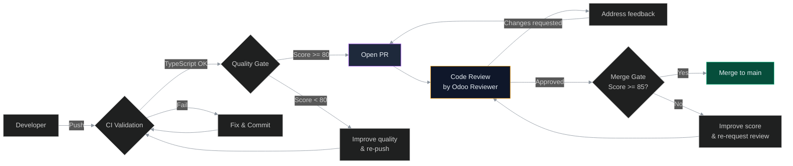
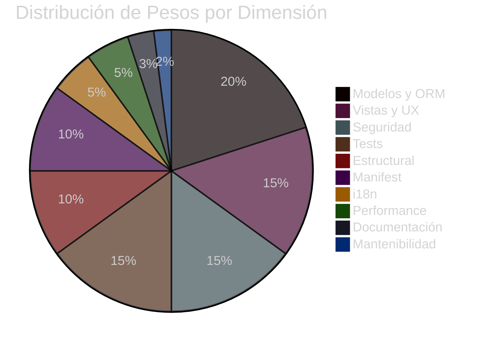
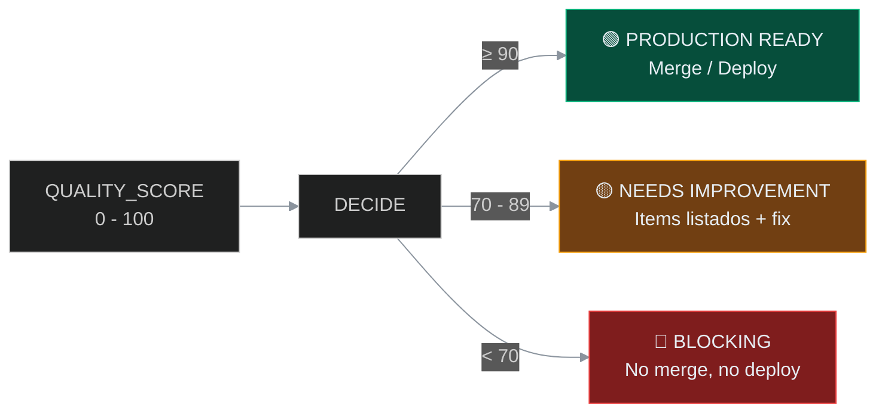
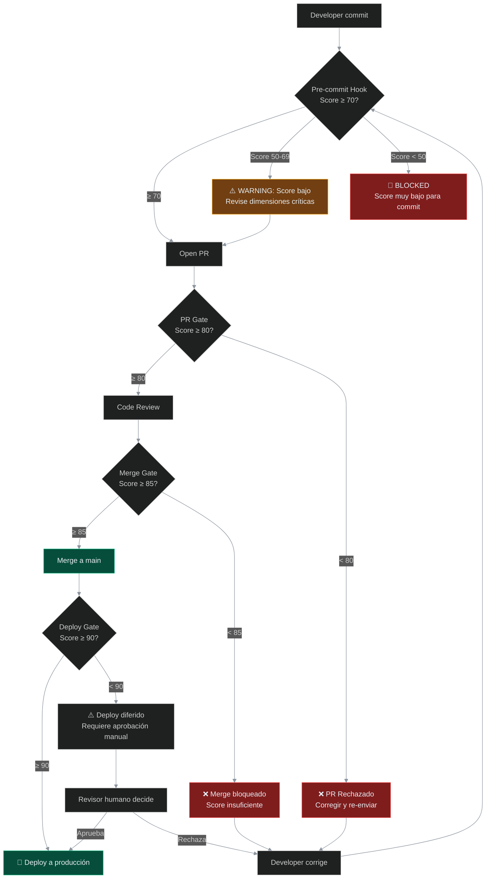
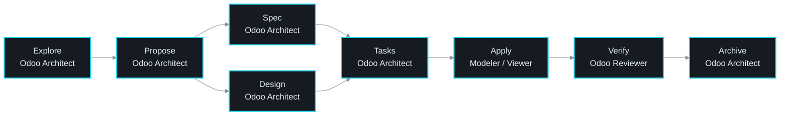

# 04-CONTRIBUTING.md — Guía de Contribución

> **Versión:** 1.0.0
> **Última actualización:** 2026-06-11
> **Proyecto:** iris — Orquestador MCP para desarrollo Odoo Enterprise
> **Licencia:** Apache-2.0
> **Depende de:** `docs/01-PRD.md`, `docs/04-CONTRIBUTING.md`, `AGENTS.md`, `SECURITY.md`, `docs/03-ARCHITECTURE.md`

---

## Índice

1. [Code of Conduct](#1-code-of-conduct)
2. [Development Setup](#2-development-setup)
3. [Development Workflow](#3-development-workflow)
4. [Coding Standards OCA](#4-coding-standards-oca)
5. [Quality Gates](#5-quality-gates)
6. [Testing Requirements](#6-testing-requirements)
7. [Methodology: Reciprocal Apprenticeship](#7-methodology-reciprocal-apprenticeship)
8. [Review & Merge Process](#8-review--merge-process)
9. [References](#9-references)

---

## 1. Code of Conduct

### 1.1 Nuestro Compromiso

iris es un ecosistema profesional de ingeniería Odoo. Nos comprometemos a mantener un ambiente respetuoso, inclusivo y orientado al aprendizaje. Cada contribución — sea código, documentación, revisión o reporte de bug — es una oportunidad de crecimiento colectivo.

### 1.2 Principios de Convivencia

| # | Principio | Comportamiento Esperado |
|---|-----------|------------------------|
| 1 | **Respeto Técnico** | Las decisiones técnicas se discuten con datos, no con ego. Toda crítica es constructiva y fundamentada |
| 2 | **Aprendizaje Continuo** | Nadie nace sabiendo Odoo. Las preguntas "básicas" son bienvenidas y se responden con fundamentos |
| 3 | **Propiedad Colectiva** | El código es del equipo, no de quien lo escribió. Todos pueden mejorarlo |
| 4 | **Calidad > Velocidad** | Preferimos una contribución correcta y bien documentada a cinco contribuciones apresuradas |
| 5 | **Comunicación Clara** | Las discusiones técnicas usan lenguaje preciso. Evitamos ambigüedad y suposiciones no dichas |

### 1.3 Comportamientos Inaceptables

- Comentarios despectivos sobre el nivel técnico de otros contribuyentes
- Cambios que deliberadamente bajan el quality score sin justificación documentada
- Saltar fases del pipeline SDD (ver §3.3)
- Commits sin mensaje convencional o sin verificación de calidad
- Exposición de credenciales, tokens o llaves en commits

### 1.4 Reporte de Incidentes

Si presencias una violación de este código de conducta, repórtalo a través de una issue de GitHub con label `coc` o contacta al equipo de ingeniería. Todas las quejas se investigan con confidencialidad.

---

## 2. Development Setup

### 2.1 Prerequisites

| Tool | Versión | Propósito |
|------|---------|-----------|
| Node.js | >= 22 | Runtime de iris (MCP Server) |
| npm | >= 10 | Gestión de dependencias |
| TypeScript | >= 5.5 | Lenguaje del proyecto |
| Git | >= 2.40 | Control de versiones |
| OpenCode / Claude | Última | Cliente AI para desarrollo asistido |
| PostgreSQL | >= 16 | Solo para módulos Odoo (no para iris core) |

### 2.2 First Time Setup

```bash
# 1. Clonar el repositorio
git clone https://github.com/anomalyco/iris.git
cd iris

# 2. Instalar dependencias
npm ci

# 3. Compilar TypeScript
npm run build

# 4. Verificar compilación
npx tsc --noEmit

# 5. Configurar entorno local
cp iris.local.yaml.template iris.local.yaml
# Editar iris.local.yaml con la ruta de tu proyecto Odoo
```

### 2.3 Environment Variables

iris requiere las siguientes variables de entorno para operación completa. Ninguna es secreta — todas se configuran en `iris.local.yaml`:

```yaml
# iris.local.yaml — Configuración local
alesco_path: "G:\\My Drive\\[1] Geraldo\\[1] Documents\\Alesco"
# Ruta al proyecto Odoo local. Usada por CodeGraph para análisis estático.

# Variables de entorno adicionales (opcionales según features activados):
# ODOO_SH_TOKEN=<token>    # Token API Odoo.sh para operaciones SSH
# ODOO_SH_PROJECT=<nombre> # Nombre del proyecto en Odoo.sh
# ENGRAM_MODE=engram       # Modo de persistencia: engram | openspec | hybrid | none
```

> **Nota:** iris sigue una filosofía de **costo cero operativo**. Ningún componente requiere suscripción de pago. Ver `docs/01-PRD.md` §9 para el análisis de costos completo.

### 2.4 Verificación de Conexiones

```bash
# Verificar que todas las conexiones del ecosistema funcionan
iris> tool: odoo-check-connections
# Verifica: bridge, SSH, API Odoo.sh, Engram, CodeGraph

# Ver estado de skills cargadas
iris> tool: agent-status

# Ver calidad del módulo actual
iris quality-score --module ./alesco_api_bridge --output report.json
```

---

## 3. Development Workflow

### 3.1 Branch Strategy

```mermaid
%%{init: {'theme': 'dark', 'themeVariables': {'primaryColor': '#1f6feb', 'primaryTextColor': '#ffffff', 'primaryBorderColor': '#22d3ee', 'lineColor': '#8b949e'}}}%%
gitgraph TB
    commit id: "init"
    branch develop
    commit id: "chore: setup CI"
    commit id: "feat: api bridge"
    
    branch "st_alesco"
    commit id: "feat: auth module"
    commit id: "fix: token refresh"
    
    checkout develop
    merge "st_alesco" id: "merge: st_alesco"
    
    branch "hotfix/critical-bug"
    commit id: "fix: critical N+1"
    
    checkout main
    merge "hotfix/critical-bug" id: "hotfix merge"
    
    checkout develop
    merge main id: "sync with hotfix"
    
    branch "release/v1.2"
    commit id: "chore: bump version"
    
    checkout main
    merge "release/v1.2" id: "release v1.2"
    
    commit id: "tag: v1.2.0" tag: "v1.2.0"
```

| Rama | Propósito | Regla |
|------|-----------|-------|
| `main` | Producción — estable, desplegada | Solo merges vía PR aprobado. Quality score >= 85 |
| `develop` | Integración — trabajo en curso | Rama base para features. CI obligatorio |
| `st_<proyecto>` | Staging por proyecto | Desarrollo normal. Ej: `st_alesco`, `st_cliente_x` |
| `st_produccion` | Staging compartido antes de producción | Rama de estabilización pre-producción |
| `release/<version>` | Preparación de release | Solo cambios cosméticos y version bump |
| `hotfix/<descripcion>` | Corrección urgente a producción | Nace de `main`, mergea a `main` y `develop` |

### 3.2 Commit Convention (Conventional Commits)

iris sigue estrictamente el formato **Conventional Commits**. Cada mensaje de commit debe estructurarse así:

```
tipo(alcance): descripción breve en presente

- Cambio de alto nivel (qué cambia y por qué)
- Verificación realizada (cómo se confirmó que funciona)
```

#### Tipos Permitidos

| Tipo | Uso | Ejemplo |
|------|-----|---------|
| `feat` | Nueva funcionalidad | `feat(api): add token refresh endpoint` |
| `fix` | Corrección de bug | `fix(orm): resolve N+1 in order line compute` |
| `docs` | Documentación | `docs(contributing): add OCA conventions section` |
| `refactor` | Refactorización sin cambio funcional | `refactor(auth): extract validate_token method` |
| `test` | Tests nuevos o modificados | `test(quality): add edge cases for score_i formula` |
| `chore` | Mantenimiento, CI, dependencias | `chore(deps): update typescript to 5.7` |
| `style` | Cambios de formato (PEP8, prettier) | `style(models): fix line length warnings` |

#### Reglas

- La descripción debe estar en **tiempo presente** ("add", no "added")
- El alcance entre paréntesis es el módulo o componente afectado
- El cuerpo detalla el cambio de alto nivel y la verificación realizada
- No incluir atribuciones de IA ("Co-Authored-By") en el mensaje
- Usar keywords en inglés (`feat`, `fix`, `docs`, `chore`, `refactor`, `test`)
- Descripción en español o inglés según el contexto del prompt del usuario

#### Commits Bloqueados

Nunca ejecutes estos comandos a menos que la gobernanza del proyecto lo autorice explícitamente:

- `git push --force` / `git push -f`
- `git rebase`
- `git reset --soft / --mixed / --hard`
- `git push origin --delete`

### 3.3 Pull Request Process



#### Checklist Pre-PR

Antes de abrir un Pull Request, verifica:

- [ ] Todos los tests pasan localmente
- [ ] Quality Score >= 80 (ejecutar `iris quality-score`)
- [ ] No hay `console.log`, `debugger`, o credenciales hardcodeadas
- [ ] El código compila sin errores (`npx tsc --noEmit`)
- [ ] Los mensajes de commit siguen Conventional Commits
- [ ] La documentación se actualizó si el cambio afecta APIs públicas
- [ ] Los cambios están en una rama feature/hotfix (nunca en `main`)
- [ ] El módulo Odoo (si aplica) tiene `__manifest__.py` version bump

#### Proceso de PR

1. Crear PR desde la rama feature hacia `develop` (o `main` para hotfixes)
2. CI ejecuta automáticamente: TypeScript check + Quality Gate
3. El Reviewer asigna un **Odoo Reviewer** (ver `AGENTS.md` §3)
4. El Reviewer ejecuta la revisión según el scoring OCA
5. Si hay cambios solicitados, el desarrollador corrige y re-push
6. Merge Gate verifica score >= 85 antes de permitir merge
7. El merge lo ejecuta el Reviewer o un mantenedor autorizado

---

## 4. Coding Standards OCA

iris sigue las convenciones de la **Odoo Community Association (OCA)** para todo código Odoo. Estas reglas aplican a módulos Odoo dentro del proyecto, no al código TypeScript de iris core (que sigue sus propias convenciones descritas en `docs/03-ARCHITECTURE.md`).

### 4.1 Module Naming (snake_case)

| Elemento | Convención | Correcto | Incorrecto |
|----------|------------|----------|------------|
| Módulo | snake_case, sin puntos | `sale_commission` | `sale.commission`, `SaleCommission` |
| Modelo | dotted tech name | `sale.order.line` | `saleorderline`, `SaleOrderLine` |
| Campo | snake_case | `supervisor_id` | `supervisorId`, `idSupervisor` |
| XML ID | `module_record_purpose` | `sale_order_form_view` | `view_saleorder` |
| Security ID | `access_model_group` | `access_sale_order_salesman` | `sale_order_acl` |
| Test file | `tests/test_<feature>.py` | `tests/test_margin.py` | `tests/test.py` |

### 4.2 Module Structure (OCA template)

```
my_module/
├── __init__.py              # Lista de imports del módulo
├── __manifest__.py          # Metadatos, dependencias, archivos
├── controllers/
│   ├── __init__.py
│   └── main.py              # HTTP controllers (@http.route)
├── data/
│   ├── __init__.py
│   └── my_data.xml           # Datos demo o de configuración
├── models/
│   ├── __init__.py
│   ├── my_model.py           # Modelos Python
│   └── inherited_model.py   # Herencias (_inherit)
├── report/
│   ├── __init__.py
│   ├── my_report.py          # Definiciones de reporte QWeb
│   └── my_report_templates.xml
├── security/
│   ├── ir.model.access.csv  # ACL (obligatorio para modelos nuevos)
│   ├── ir_rule.xml           # Record rules multi-compañía
│   └── res_groups.xml        # Definición de grupos de seguridad
├── tests/
│   ├── __init__.py
│   ├── test_my_model.py      # TransactionCase tests
│   └── test_ui.py            # HttpCase tests (cuando aplica)
├── views/
│   ├── __init__.py
│   ├── my_model_views.xml    # Form, list, search, kanban views
│   └── menu_items.xml        # Definición de menús
└── wizards/
    ├── __init__.py
    └── my_wizard.py          # Transient models (wizards)
```

### 4.3 Manifest Requirements

El `__manifest__.py` es el contrato del módulo con Odoo. Debe incluir:

```python
{
    "name": "Sale Commission",
    "version": "18.0.1.0.0",
    "category": "Sales",
    "license": "AGPL-3",                  # Obligatorio para OCA
    "summary": "Manage sales commissions",
    "description": """
        Extends sale.order to track and compute
        salesperson commissions automatically.
    """,
    "author": "Your Company, Odoo Community Association (OCA)",
    "website": "https://github.com/OCA/sale-workflow",
    "depends": [
        "sale_management",
        "account",
    ],
    "data": [
        "security/ir.model.access.csv",
        "security/ir_rule.xml",
        "views/sale_order_views.xml",
        "views/commission_rule_views.xml",
        "data/commission_data.xml",
    ],
    "demo": [
        "data/demo/commission_demo.xml",
    ],
    "installable": True,
    "application": False,
    "auto_install": False,
}
```

**Campos requeridos** (el Quality Score penaliza su ausencia):

| Campo | Obligatorio | Notas |
|-------|------------|-------|
| `name` | ✅ | Nombre humano del módulo |
| `version` | ✅ | Formato OCA: `18.0.X.Y.Z` |
| `category` | ✅ | Debe existir en Odoo (ver `ir.module.category`) |
| `license` | ✅ | `AGPL-3` para módulos OCA |
| `depends` | ✅ | Mínimo, explícito, sin dependencias no usadas |
| `data` | ✅ | Orden correcto: security antes que views |
| `author` | ✅ | Incluir OCA si aplica |

### 4.4 Python Standards (OCA)

#### ORM Patterns

```python
from odoo import api, fields, models


class SaleOrder(models.Model):
    _name = "sale.order"
    _inherit = "sale.order"      # Herencia: misma tabla
    _description = "Sales Order"

    # ── Fields ──────────────────────────────────────────────
    margin = fields.Float(
        string="Margin",
        compute="_compute_margin",
        store=True,               # Stored: searchable, ocupa DB
        digits="Product Price",
        help="Difference between total price and total cost",
    )

    # ── Compute Methods ─────────────────────────────────────
    @api.depends("order_line.price_total", "order_line.purchase_price")
    def _compute_margin(self):
        """Compute margin as total revenue minus total cost."""
        for order in self:
            order.margin = sum(
                line.price_total - (line.purchase_price * line.product_uom_qty)
                for line in order.order_line
            )

    # ── Constraints ─────────────────────────────────────────
    @api.constrains("date_order", "commitment_date")
    def _check_dates(self):
        for order in self:
            if order.commitment_date and order.date_order:
                if order.commitment_date < order.date_order:
                    raise ValidationError(
                        _("Commitment date cannot be before order date.")
                    )
```

#### Reglas Esenciales

| # | Regla | Fundamento |
|---|-------|------------|
| 1 | Usar `@api.model_create_multi` para `create()` | Performance: procesa múltiples registros en una sola operación |
| 2 | Usar `for record in self` en computes y constraints | El ORM itera sobre recordsets — `self` puede tener múltiples registros |
| 3 | Usar `_("%s") % value` en vez de f-strings dentro de `_()` | f-strings se evalúan antes de la traducción |
| 4 | Preferir `Command.create/update/link` para valores x2many | API moderna de Odoo 18.0 para comandos One2many/Many2many |
| 5 | Toda llamada a `sudo()` debe tener un comentario de contexto | `sudo()` bypasses toda seguridad — cada uso debe justificarse |
| 6 | Nunca usar `cr.execute()` sin parameterización | SQL injection: el usuario malicioso puede inyectar queries |
| 7 | `@api.depends` debe declarar TODAS las dependencias | Sin depends completo, el compute field no se recalcula |
| 8 | Prefijar `_sql_constraints` con `models.Constraint` en v18 | La nueva API de constraints reemplaza a `_sql_constraints` |

### 4.5 XML Views Standards (OCA)

#### Odoo 18+ Syntax

| Práctica OCA | Correcto (v18) | Incorrecto (legacy) |
|-------------|----------------|---------------------|
| Naming de vistas | `sale_order_form_view` | `view_sale_order_form` |
| List view | `<list>` | `<tree>` (deprecated en v18) |
| Invisible dinámico | `invisible="state == 'draft'"` | `attrs="{'invisible': [('state', '=', 'draft')]}"` |
| Readonly dinámico | `readonly="state != 'draft'"` | `attrs="{'readonly': [('state', '!=', 'draft')]}"` |
| Required dinámico | `required="state == 'draft'"` | `attrs="{'required': [('state', '=', 'draft')]}"` |
| Columnas list | Sin limit | `col span`, `col width` (deprecated) |

#### Ejemplo de Vista Form (Odoo 18)

```xml
<?xml version="1.0" encoding="utf-8"?>
<odoo>
    <record id="sale_order_form_view" model="ir.ui.view">
        <field name="name">sale.order.form</field>
        <field name="model">sale.order</field>
        <field name="inherit_id" ref="sale.view_order_form"/>
        <field name="arch" type="xml">
            <!-- Insertar margen en la pestaña "Otra Información" -->
            <xpath expr="//page[@name='other_info']//group" position="inside">
                <group string="Margin" name="margin_group">
                    <field name="margin" widget="monetary"
                           options="{'currency_field': 'currency_id'}"/>
                </group>
            </xpath>
        </field>
    </record>
</odoo>
```

#### Reglas de Vistas

1. **Herencia con xpath preciso**: Cada `xpath` debe apuntar a un nodo único. Usar `expr` específico con atributos `name` donde sea posible
2. **Widgets correctos**: Usar `widget="monetary"` para campos monetarios, `widget="badge"` para estados, `widget="statusbar"` para progreso
3. **Search view obligatoria**: Todo modelo con vista form/list debe tener una search view con filtros útiles
4. **Sin `attrs` en Odoo 18+**: Las expresiones `invisible`, `readonly`, `required` se escriben inline con sintaxis booleana
5. **Security data antes que views**: Los archivos de seguridad deben cargarse antes que las vistas que referencian grupos

---

## 5. Quality Gates

### 5.1 10 Quality Dimensions

El sistema de calidad de iris evalúa módulos Odoo en **10 dimensiones ponderadas**. Cada dimensión tiene un peso específico, checks automatizados y penalizaciones claras.



| # | Dimensión | Peso | Qué Mide | Penalización Mayor |
|---|-----------|------|----------|-------------------|
| 1 | **Estructural** | 10% | ¿Sigue la estructura de directorios OCA? | -50% si falta `models/` o `security/` |
| 2 | **Manifest** | 10% | ¿`__manifest__.py` completo y correcto? | -50% si license no es AGPL-3 |
| 3 | **Modelos y ORM** | 20% | ¿Uso correcto del ORM Odoo? | -30% por `sudo()` sin comentario; -30% SQL injection |
| 4 | **Vistas y UX** | 15% | ¿Vistas XML correctas y v18 compatibles? | -15% por `attrs` en vez de `invisible` inline |
| 5 | **Seguridad** | 15% | ¿ACL, record rules, sudo governance? | -100% si modelo sin `ir.model.access.csv` |
| 6 | **Tests** | 15% | ¿Cobertura y calidad de tests? | -100% si no existe `tests/` |
| 7 | **i18n** | 5% | ¿Strings traducibles? | -50% por string hardcoded en QWeb |
| 8 | **Performance** | 5% | ¿Anti-patrones de performance? | -40% por `search()` dentro de `for` loop |
| 9 | **Documentación** | 3% | ¿Docstrings, help, summary? | -30% si métodos públicos sin docstring |
| 10 | **Mantenibilidad** | 2% | ¿Código limpio y organizado? | -30% por método >100 líneas |

> Fuente completa: `docs/04-CONTRIBUTING.md` §5 — Quality Gates con detalles de cada penalización, fundamento Odoo, ruta de verificación UI y referencias a documentación oficial.

### 5.2 Scoring System

```
QUALITY_SCORE = Σ(weight_i × score_i) para las 10 dimensiones

donde:
  score_i  ∈ [0.0, 1.0]   (0 = worst, 1.0 = perfect)
  weight_i ∈ [0.02, 0.20] (2% a 20%)
  Σ(weight_i) = 1.0        (100%)
```

Cada dimensión comienza con **1.0** y aplica penalizaciones multiplicativas:

```
score_i = 1.0 × (1 - p₁) × (1 - p₂) × ... × (1 - pₙ)

donde pₙ es la penalización n-ésima (0.0 a 1.0)
```

**Ejemplo**: Dimensión Seguridad (weight=0.15) con dos fallas:
- Modelo sin `ir.model.access.csv` → penalización -1.0 (score se vuelve 0)
- Record rule multi-company faltante → penalización -0.25

```
score_seguridad = 1.0 × (1 - 1.0) × (1 - 0.25) = 0.0
contribución = 0.15 × 0.0 = 0.0
```

### 5.3 Minimum Thresholds



| Score | Color | Significado | Acción |
|-------|-------|-------------|--------|
| **≥ 90** | 🟢 Verde | Ready for production | Aprobado automáticamente |
| **70–89** | 🟡 Amarillo | Needs improvement | Se requiere revisión humana. El autor debe corregir los items listados |
| **< 70** | 🔴 Rojo | Blocking — no desplegar, no mergear | CI gate bloquea. El equipo revisa y corrige antes de re-evaluar |

### 5.4 Gate Enforcement



| Gate | Mínimo | Acción si falla | Fundamento |
|------|--------|-----------------|------------|
| **Pre-commit hook** | 70 | Warn si < 70, bloquea si < 50 | Atrapar errores temprano, antes de revisión |
| **PR submission** | 80 | Bloquea revisión humana hasta corregir | Solo código con calidad aceptable consume tiempo de revisión |
| **Merge a main** | 85 | Bloquea merge | Proteger la rama principal de deuda técnica |
| **Producción** | 90 | Bloquea deploy (requiere aprobación manual si < 90) | Solo código auditado llega a producción |

#### Implementación en CI

Los gates se ejecutan vía GitHub Actions (ver `.github/workflows/quality.yml`):

```yaml
# .github/workflows/quality.yml (fragmento)
name: Odoo Quality Gate
on: [push, pull_request]

jobs:
  quality:
    steps:
      - name: Run Quality Scanner
        run: |
          npx tsx src/tools/quality-cli.ts \
            --module ./ \
            --gate ${{ steps.gate.outputs.gate }} \
            --json > quality-report.json

      - name: Archive report in Engram
        run: |
          iris quality-archive --report quality-report.json
```

Cada reporte de calidad se archiva en **Engram** con topic key `sdd/{module}/quality-report/{timestamp}`, permitiendo trazabilidad histórica, detección de regresiones y dashboards de Quality Engineering.

---

## 6. Testing Requirements

### 6.1 Unit Tests (TransactionCase)

Los tests unitarios en Odoo usan `TransactionCase`. Cada test corre en una transacción separada con rollback automático al finalizar.

```python
from odoo.tests import TransactionCase, tagged


@tagged("standard", "sale")
class TestSaleMargin(TransactionCase):
    """Test the margin computation on sale.order."""

    @classmethod
    def setUpClass(cls):
        super().setUpClass()
        cls.partner = cls.env["res.partner"].create({"name": "Test Partner"})
        cls.product = cls.env["product.product"].create({
            "name": "Test Product",
            "list_price": 100,
            "standard_price": 70,
        })

    def test_margin_computed(self):
        """Margin equals total - cost for a single line."""
        order = self.env["sale.order"].create({"partner_id": self.partner.id})
        self.env["sale.order.line"].create({
            "order_id": order.id,
            "product_id": self.product.id,
            "price_unit": 100,
            "product_uom_qty": 1,
        })
        self.assertEqual(order.margin, 30)

    def test_margin_zero_lines(self):
        """Margin is zero when order has no lines."""
        order = self.env["sale.order"].create({"partner_id": self.partner.id})
        self.assertEqual(order.margin, 0)

    def test_margin_negative(self):
        """Margin is negative when cost exceeds price."""
        order = self.env["sale.order"].create({"partner_id": self.partner.id})
        self.env["sale.order.line"].create({
            "order_id": order.id,
            "product_id": self.product.id,
            "price_unit": 50,
            "product_uom_qty": 1,
        })
        self.assertLess(order.margin, 0)
```

#### Reglas para Unit Tests

1. **Cubrir lógica de negocio**, no solo CRUD trivial
2. **Usar mock data realista** (no crear registros con el mínimo de campos)
3. **Testear edge cases**: valores cero, valores negativos, listas vacías, nulos
4. **No usar `self.env` directo sin setUpClass** — usar datos preparados
5. **Named method convention**: `test_<feature>_<scenario>` (ej: `test_margin_negative`)
6. **Query count assertions** para detectar N+1:
   ```python
   def test_margin_query_count(self):
       with self.assertQueryCount(2):  # 1 SO + 1 líneas prefetch
           orders = self.env["sale.order"].search([])
           margins = orders.mapped("margin")
   ```

### 6.2 Integration Tests (HttpCase)

Para probar flujos completos que involucran la UI de Odoo, usar `HttpCase`:

```python
from odoo.tests import HttpCase, tagged


@tagged("post_install", "-at_install")
class TestSaleMarginUI(HttpCase):
    def test_margin_display_in_form(self):
        """Margin field renders correctly in sale.order form view."""
        self.start_tour("/web", "sale_margin_tour", login="admin")
```

### 6.3 E2E Tests (Playwright)

Para escenarios críticos de usuario final, iris usa Playwright:

```bash
# Ejecutar tests E2E
npx playwright test tests/e2e/

# Ver reporte
npx playwright show-report
```

Los tests E2E se usan para:
- Flujos multi-paso (crear SO → confirmar → facturar → cobrar)
- Validación de reportes QWeb y PDFs
- Verificación de reglas de seguridad (usuario X no puede ver Y)
- Pruebas de rendimiento (carga de listas con >1000 registros)

### 6.4 Cobertura Mínima

| Tipo de Test | Cobertura Mínima | Cuándo es Obligatorio |
|-------------|------------------|----------------------|
| TransactionCase | ≥ 80% de métodos con lógica de negocio | Todo modelo nuevo o modificado |
| Edge cases | ≥ 3 escenarios por método principal | Campos computed, constraints, onchange |
| HttpCase | Flujo principal (happy path) | Nuevas vistas o modificaciones de UI |
| E2E Playwright | Flujo crítico de negocio | Módulos que serán usados por usuarios finales |
| Query count | 1 test por método compute | Métodos que iteran sobre recordsets |

---

## 7. Methodology: Reciprocal Apprenticeship

iris opera bajo la metodología **Reciprocal Apprenticeship** (Aprendizaje Recíproco), definida en `docs/04-CONTRIBUTING.md`. En esta metodología, cada interacción de desarrollo es una oportunidad de aprendizaje bidireccional.

### 7.1 Los 4 Pilares

| Pilar | Descripción | En la práctica |
|-------|-------------|----------------|
| **Human-First** | El desarrollador decide QUÉ construir; la IA asiste CÓMO | iris nunca propone features sin consultar. Ejecuta decisiones con transparencia |
| **Fundamentals-First** | Todo código generado incluye explicación de conceptos Odoo subyacentes | Cada field, cada vista, cada security rule viene con su fundamento: "Many2one → FK en PostgreSQL", "domain → filtra registros en el JOIN" |
| **Transparency** | iris no oculta su trabajo. Cada cambio incluye: código, ruta UI, test path, relaciones impactadas, seguridad | El Learning Artifact (§7.3) es la manifestación tangible de esta transparencia |
| **Reciprocal** | Ambos aprenden: el desarrollador aprende Odoo; iris aprende el contexto del proyecto | Cuando el desarrollador corrige a iris ("este campo no debe ser visible para inventario"), ese conocimiento se persiste en Engram para siempre |

### 7.2 SDD Workflow (8 Phases)

iris utiliza el pipeline **Spec-Driven Development (SDD)** de 8 fases secuenciales. Cada fase tiene un **agente especialista** responsable (ver `AGENTS.md` §5):



| Fase | Agente Primario | Entrada | Salida | Learning Output |
|------|----------------|---------|--------|-----------------|
| **Explore** | Odoo Architect | Idea, problema | Reporte de exploración (CodeGraph) | El desarrollador entiende la arquitectura existente |
| **Propose** | Odoo Architect | Reporte explore | Propuesta con alcance y riesgo | Aprende a evaluar opciones arquitectónicas |
| **Spec** | Odoo Architect | Propuesta | Especificaciones Given/When/Then | Cada requisito referencia fundamentos Odoo |
| **Design** | Odoo Architect | Propuesta | ADRs, diagramas, interfaces | Cada ADR explica "What you'd learn" |
| **Tasks** | Odoo Architect | Spec + Design | Checklist ordenado de tareas | Cada tarea tiene "Fundamentos a aprender" |
| **Apply** | Odoo Modeler / Viewer | Tasks | Código + Learning Artifact | Artifact se produce automáticamente con cada cambio |
| **Verify** | Odoo Reviewer | Spec + Tasks | Reporte de verificación | Validación conceptual + funcional |
| **Archive** | Odoo Architect | Todos los artifacts | Lecciones aprendidas en Engram | Conocimiento consolidado no se pierde |

> **Regla de Oro del Pipeline:** No se puede saltar una fase. El harness valida que el artifact de la fase anterior exista antes de permitir avanzar. Ver `docs/01-PRD.md` §4.

### 7.3 Learning Artifacts

Cada cambio en iris produce un **Learning Artifact** — un entregable estructurado que se archiva en Engram y queda disponible para consulta futura.

```
📦 Learning Artifact: add_supervisor_field

├── 🐍 Generated Code
│   [código generado con explicaciones inline]
├── 📖 Fundamentals Explanation
│   [por qué Many2one crea FK, qué significa domain, cómo funciona el prefetch]
├── 🖥️ UI Navigation Route
│   📍 Ventas → Órdenes → Órdenes de Venta → Pestaña "Otra Información"
├── 🧪 Test Path (UI)
│   [pasos concretos para verificar el cambio en UI]
├── 🧪 Test Path (Code)
│   [código de test TransactionCase]
├── 🔗 Impacted Relations
│   [modelos, vistas, reportes, seguridad afectados]
└── ⚠️ Security Considerations
    [riesgos, mitigaciones, alternativas]
```

Los Learning Artifacts se guardan en Engram bajo el topic key `sdd/{change-name}/learning-artifact` y se pueden consultar con:

```bash
iris> tool: learning-artifact --change add-supervisor-field
iris> tool: learning-history
iris> tool: ui-route --change add-supervisor-field
```

---

## 8. Review & Merge Process

### 8.1 Code Review Roles

iris implementa el sistema de **agentes especialistas** definido en `AGENTS.md`. Cada revisión asigna un reviewer según la naturaleza del cambio:

| Tipo de Cambio | Reviewer Asignado | Skills del Reviewer |
|----------------|-------------------|---------------------|
| Modelos Python, ORM, campos | Odoo Modeler | `odoo-ai` (ORM section), `odoo-contribute` (OCA naming) |
| Vistas XML, QWeb, reports | Odoo Viewer | `odoo-ai` (views section), `odoo-qweb`, `odoo-visual` |
| Tests | Odoo Tester | `odoo-test`, `playwright-cli` |
| Seguridad (ACL, record rules) | Odoo Security | `odoo-security`, `odoo-code-review` |
| Revisión completa pre-merge | Odoo Reviewer | `odoo-code-review`, `odoo-security`, `odoo-oca` |

### 8.2 Pre-Merge Checklist

El **Odoo Reviewer** verifica estos puntos antes de aprobar cualquier merge:

#### Dimensión Estructural
- [ ] El módulo sigue la estructura OCA (`models/`, `views/`, `security/`, `data/`, `tests/`)
- [ ] No hay archivos huérfanos o directorios vacíos (excepto `__init__.py`)

#### Dimensión Manifest
- [ ] `__manifest__.py` tiene todos los campos requeridos: `name`, `version`, `category`, `license`, `depends`, `data`, `author`
- [ ] `license` es `AGPL-3` para módulos OCA
- [ ] `depends` no tiene dependencias no usadas ni faltan dependencias usadas

#### Dimensión Modelos y ORM
- [ ] No hay `sudo()` sin comentario de contexto explícito
- [ ] No hay `cr.execute()` sin parameterización
- [ ] Todos los computed fields tienen `@api.depends` completo
- [ ] No hay `search()` dentro de bucles `for` (N+1)
- [ ] `_rec_name`, `_order`, `_sql_constraints` están definidos donde corresponde
- [ ] `@api.constrains` existe para validaciones de datos

#### Dimensión Vistas y UX
- [ ] Las vistas usan `list` en vez de `tree` (Odoo 18+)
- [ ] No hay `attrs` donde `invisible`/`readonly`/`required` inline funciona
- [ ] Los widgets son apropiados para cada tipo de campo
- [ ] Existe search view con filtros útiles
- [ ] Los xpath de herencia apuntan a nodos únicos

#### Dimensión Seguridad
- [ ] Todo modelo nuevo tiene entrada en `ir.model.access.csv`
- [ ] Los permisos CRUD son correctos (no dar `unlink` si no aplica)
- [ ] Modelos con `company_id` tienen record rule multi-compañía
- [ ] Campos sensibles tienen `groups=` para field-level security
- [ ] Controllers tienen `auth=` correcto (nunca `public` para datos sensibles)

#### Dimensión Tests
- [ ] Directorio `tests/` existe con `__init__.py`
- [ ] Tests cubren lógica de negocio (no solo CRUD trivial)
- [ ] Tests pasan sin error (`-u all` o `--test-enable`)

#### Dimensión Performance
- [ ] Sin `search()` en loop (verificado con `assertQueryCount`)
- [ ] Campos stored computed tienen inverse methods
- [ ] Domains usan campos indexados

#### Dimensión Documentación
- [ ] Métodos públicos tienen docstrings
- [ ] Campos con interacción de usuario tienen `help`
- [ ] `__manifest__.py` tiene `summary` y `description`

### 8.3 Quality Score Verification

El Reviewer ejecuta el quality scorer y verifica umbrales:

```bash
# Ejecutar quality score
iris quality-score --module ./my_module --output quality-report.json

# Ver resultado
cat quality-report.json | jq '{score: .overall_score, threshold: .threshold, dimensions: [.dimensions[].name]}'

# Archivar en Engram
iris quality-archive --report quality-report.json
```

### 8.4 Tiempos de Revisión

| Tipo de Cambio | Tiempo Máximo | Reviewers Mínimos |
|----------------|---------------|-------------------|
| Bug fix crítico (hotfix) | 2 horas | 1 (Odoo Reviewer) |
| Feature mediana (< 5 archivos) | 1 día hábil | 1 (especialista según tipo) |
| Feature grande (> 5 archivos) | 2 días hábiles | 2 (Odoo Reviewer + especialista) |
| Nuevo módulo completo | 3 días hábiles | 3 (Architect + Modeler + Reviewer) |

### 8.5 Merge Approval Matrix

| Condición | ¿Se aprueba el merge? |
|-----------|----------------------|
| Score ≥ 90 y sin issues críticos | ✅ Automático |
| Score 80-89 y sin issues críticos | ✅ Con aprobación de 1 Reviewer |
| Score 70-79 o issues mayores presentes | ❌ Requiere corrección |
| Score < 70 o issues críticos | ❌ Bloqueado |
| Cualquier modelo sin ACL | ❌ Bloqueado (issue crítico) |
| SQL injection (cr.execute sin params) | ❌ Bloqueado (issue crítico) |

---

## 9. References

### Documentos del Ecosistema iris

| Documento | Propósito |
|-----------|-----------|
| `docs/01-PRD.md` | Product Requirements Document — vision, scope, requirements, roadmap |
| `docs/03-ARCHITECTURE.md` | Architecture & Design — system overview, components, connectivity, deployment |
| `docs/04-CONTRIBUTING.md` | Contributing Guide — quality dimensions and scoring in §5 |
| `docs/04-CONTRIBUTING.md` | Contributing Guide — Reciprocal Apprenticeship methodology in §7 |
| `AGENTS.md` | Sistema de agentes especialistas Odoo, roles, skills, quality gates por agente |
| `SECURITY.md` | Seguridad del ecosistema: llaves SSH, ACL, record rules, CI gates de seguridad |
| `docs/03-ARCHITECTURE.md` | Architecture & Design — connectivity matrix in §3 |
| `docs/03-ARCHITECTURE.md` | Architecture & Design — reliability patterns in §5 |
| `docs/03-ARCHITECTURE.md` | Architecture & Design — frontend architecture in §4 |

### Documentación Oficial Odoo

| Documento | URL |
|-----------|-----|
| Odoo 18 Developer Reference | `odoo.com/documentation/18.0/developer/reference/backend/` |
| Module Manifest | `odoo.com/documentation/18.0/developer/reference/backend/module.html` |
| ORM Reference | `odoo.com/documentation/18.0/developer/reference/backend/orm.html` |
| Views Reference | `odoo.com/documentation/18.0/developer/reference/backend/views.html` |
| Security Reference | `odoo.com/documentation/18.0/developer/reference/backend/security.html` |
| Testing Reference | `odoo.com/documentation/18.0/developer/reference/backend/testing.html` |
| i18n Reference | `odoo.com/documentation/18.0/developer/reference/backend/i18n.html` |

### OCA (Odoo Community Association)

| Documento | URL |
|-----------|-----|
| Maintainer Tools | `github.com/OCA/maintainer-tools` |
| OCA Quality Guidelines | `github.com/OCA/maintainer-tools/blob/master/tools/quality.md` |
| OCA Review Guidelines | `github.com/OCA/maintainer-tools/wiki/Review` |
| OCA Module Structure | `github.com/OCA/maintainer-tools` — directorios obligatorios |

### Referencias de Investigación

| Referencia | Cita | Relevancia |
|------------|------|------------|
| **Comeau, J.** (2026). "The Post-Developer Era" | `+55%` velocidad con fundamentos; `-21%` sin fundamentos; `8x` duplicación; `90%` bugs invisibles | Fundamento empírico de la metodología — justificación de fundamentals-first |
| **DORA** (2024). Google Cloud DevOps Report | `+2.1%` productividad, `+3.4%` calidad, `+7.5%` documentación con AI | Contexto de industria para quality gates |
| **Collins, Brown & Newman** (1989). "Cognitive Apprenticeship" | El experto exhibe su razonamiento. Métodos: modeling, coaching, fading | Base teórica para la transparencia en generación de código |
| **Palincsar & Brown** (1984). "Reciprocal Teaching" | Tutor y alumno intercambian roles | Base teórica del "Reciprocal" — bidireccionalidad |

---

## Apéndice A: Quick Reference Card

```
┌─────────────────────────────────────────────────────────────────────┐
│ CONTRIBUTING — Resumen Rápido                                        │
├─────────────────────────────────────────────────────────────────────┤
│                                                                      │
│ 📦 BRANCH MODEL                                                      │
│   main ← develop ← st_<proyecto>                                     │
│   hotfix/<desc> → main + develop                                     │
│                                                                      │
│ 📝 COMMIT FORMAT                                                     │
│   tipo(alcance): descripción presente                                 │
│   feat | fix | docs | refactor | test | chore | style                │
│                                                                      │
│ 🏗️ OCA STRUCTURE                                                     │
│   models/ | views/ | security/ | data/ | tests/ | wizards/ | report/ │
│                                                                      │
│ 🏆 QUALITY GATES                                                     │
│   Pre-commit ≥ 70 | PR ≥ 80 | Merge ≥ 85 | Deploy ≥ 90              │
│   🟢 ≥ 90 | 🟡 70-89 | 🔴 < 70                                      │
│                                                                      │
│ 🧪 TEST COVERAGE                                                     │
│   TransactionCase ≥ 80% | Edge cases ≥ 3 | HttpCase happy path      │
│                                                                      │
│ 🔒 SECURITY BASICS                                                   │
│   ✓ ACL para todo modelo nuevo                                      │
│   ✓ Record rules multi-compañía                                     │
│   ✓ sudo() siempre con comentario                                   │
│   ✓ No cr.execute() sin parámetros                                   │
│                                                                      │
└─────────────────────────────────────────────────────────────────────┘
```

---

## Apéndice B: Changelog

| Versión | Fecha | Cambios |
|---------|-------|---------|
| 1.0.0 | 2026-06-11 | Documento inicial — Code of Conduct, Development Setup, Git workflow, OCA Standards, Quality Gates (10 dimensiones), Testing Requirements, Reciprocal Apprenticeship, Review & Merge Process |

---

*Esta Guía de Contribución es complementaria a `docs/01-PRD.md` (visión general), `docs/04-CONTRIBUTING.md` (sistema de calidad y metodología de aprendizaje), `AGENTS.md` (agentes especialistas) y `SECURITY.md` (seguridad). Cualquier cambio a esta guía requiere una propuesta SDD y aprobación explícita del equipo de ingeniería.*
