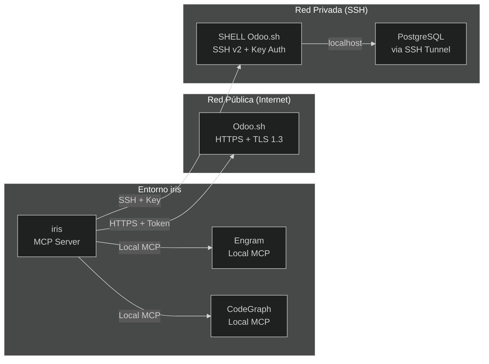
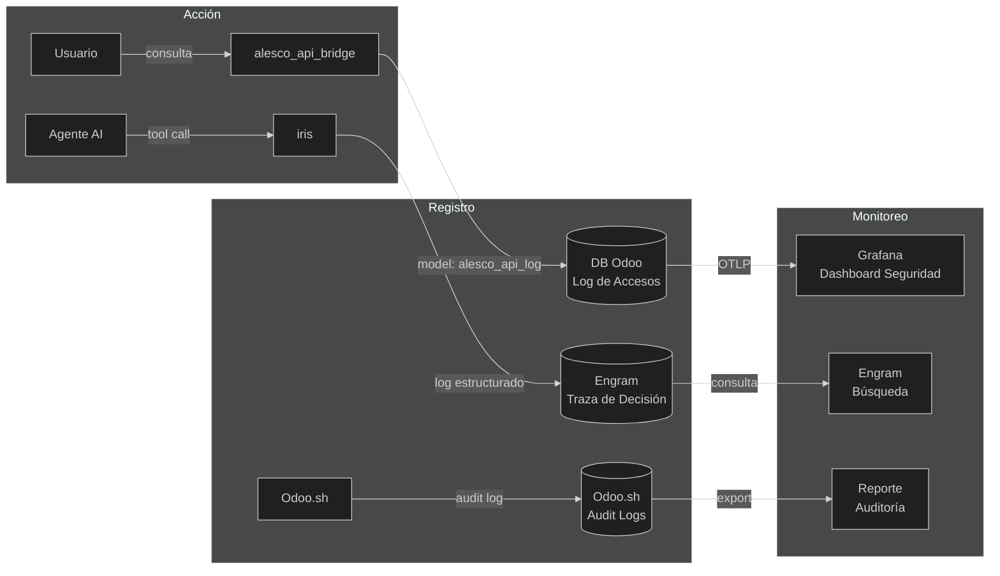

# 05-SECURITY.md — Seguridad

> **Versión:** 1.0.0
> **Última actualización:** 2026-06-11
> **Proyecto:** iris — Orquestador MCP para desarrollo Odoo Enterprise

---

## Índice

1. [Principios de Seguridad](#1-principios-de-seguridad)
2. [Modelo de Seguridad en Capas](#2-modelo-de-seguridad-en-capas)
3. [Seguridad en Módulos Odoo](#3-seguridad-en-módulos-odoo)
4. [Seguridad en la Comunicación](#4-seguridad-en-la-comunicación)
5. [Seguridad en iris](#5-seguridad-en-iris)
6. [Auditoría y Trazabilidad](#6-auditoría-y-trazabilidad)
7. [Checklist de Seguridad por Fase SDD](#7-checklist-de-seguridad-por-fase-sdd)
8. [Políticas y Procedimientos](#8-políticas-y-procedimientos)

---

## 1. Principios de Seguridad

| # | Principio | Descripción | Origen |
|---|---|---|---|
| 1 | **Seguridad Estructural** | Las reglas de seguridad se implementan en código (harness), no en prompts. El modelo puede ignorar instrucciones textuales; el código no. | NVIDIA Agent Harness Guidelines |
| 2 | **Mínimo Privilegio** | Cada usuario, agente y componente tiene solo los permisos necesarios para su función. Nada por defecto. | Microsoft Agent Governance |
| 3 | **Defensa en Profundidad** | Múltiples capas de seguridad: transporte → autenticación → autorización → auditoría → harness. | AWS Well-Architected Framework |
| 4 | **Fail-Closed** | Si la seguridad falla, el acceso se deniega. Nunca se permite acceso por defecto. | OWASP |
| 5 | **Auditabilidad Total** | Toda acción significativa queda registrada: quién, qué, cuándo, desde dónde. | Meta Agent Engineering |
| 6 | **Zero Trust** | Nunca asumir que una conexión es segura. Verificar siempre, incluso dentro de la red interna. | Google ADK Governance |

---

## 2. Modelo de Seguridad en Capas

```mermaid
%%{init: {'theme': 'dark'}}%%
flowchart TD
    subgraph L7 ["Capa 7: Harness de Seguridad"]
        LINT[Security Linter]
        AUDIT_COD[Análisis de Código]
        CI_GATE[CI Gate Seguridad]
    end

    subgraph L6 ["Capa 6: Auditoría"]
        AUDIT_LOGS[Audit Logs Odoo.sh]
        ACCESS_LOGS[Logs de Acceso]
        TRACES[Trazas OTel]
        MONITOR[Monitoreo Continuo]
    end

    subgraph L5 ["Capa 5: Autorización Odoo"]
        ACL[ir.model.access]
        RULES[ir.rule Record Rules]
        FIELD[Field-level Permissions]
        GROUP[Grupos de Seguridad]
    end

    subgraph L4 ["Capa 4: Autenticación"]
        TOKEN[Token Bridge]
        API_KEY[API Keys]
        SSH_KEY[Llaves SSH]
        SESSION[Sesión Odoo]
    end

    subgraph L3 ["Capa 3: Transporte Seguro"]
        HTTPS[HTTPS / TLS 1.3]
        SSH[SSH v2]
        MCP_AUTH[MCP Auth]
    end

    subgraph L2 ["Capa 2: Código Seguro"]
        INPUT[Input Validation]
        SQL_INJ[SQL Injection Prevention]
        XSS[XSS Protection]
        SAFE[safe_eval Control]
    end

    subgraph L1 ["Capa 1: Configuración Segura"]
        ENV[Variables de Entorno]
        SECRETS[Secretos / Tokens]
        CONF[Configuración Mínima]
    end

    L1 --> L2
    L2 --> L3
    L3 --> L4
    L4 --> L5
    L5 --> L6
    L6 --> L7
```



*El modelo de seguridad tiene 7 capas. **Capa 1**: configuración segura (variables de entorno, secretos). **Capa 2**: código seguro (validación de inputs, prevención de SQL injection y XSS, control de safe_eval). **Capa 3**: transporte seguro (HTTPS/TLS 1.3, SSH v2, autenticación MCP). **Capa 4**: autenticación (token del bridge, API keys, llaves SSH, sesión Odoo). **Capa 5**: autorización Odoo (ir.model.access, ir.rule, permisos a nivel de campo, grupos). **Capa 6**: auditoría (logs de Odoo.sh, logs de acceso, trazas OTel, monitoreo continuo). **Capa 7**: harness de seguridad (linters, análisis de código, CI gates). Cada capa asume que la anterior puede fallar y la protege.*

---

## 3. Seguridad en Módulos Odoo

### 3.1 ir.model.access.csv

Todo modelo Odoo nuevo **debe** tener una entrada en `ir.model.access.csv`:

```csv
id,name,model_id:id,group_id:id,perm_read,perm_write,perm_create,perm_unlink
access_alesco_api_log,alesco_api_log,model_alesco_api_log,base.group_user,1,1,1,1
access_alesco_api_log_manager,alesco_api_log_manager,model_alesco_api_log,base.group_system,1,1,1,1
```

**Reglas del harness:**
- Si un modelo Python existe sin entrada en `ir.model.access.csv` → **CI gate bloquea**
- Si `perm_read=0` para todos los grupos → **linter advierte** (probable error)
- Los modelos de sólo logging deben tener `perm_write=0, perm_create=0, perm_unlink=0`

### 3.2 ir.rule (Record Rules)

Las record rules limitan qué registros puede ver cada usuario:

```xml
<record id="alesco_api_log_rule_company" model="ir.rule">
    <field name="name">alesco_api_log: multi-company</field>
    <field name="model_id" ref="model_alesco_api_log"/>
    <field name="global" eval="True"/>
    <field name="domain_force">[('company_id', 'in', company_ids)]</field>
</record>
```

**Reglas del harness:**
- Modelos con `company_id` deben tener record rule multi-company
- Modelos financieros deben tener record rule por compañía

### 3.3 Grupos de Seguridad

```xml
<record id="group_alesco_api_bridge_user" model="res.groups">
    <field name="name">Usuario del Bridge API</field>
    <field name="category_id" ref="module_category_alesco_api_bridge"/>
</record>
```

### 3.4 Seguridad en sudo()

```python
# ✅ Correcto: método marcado explícitamente con comentario de seguridad
def _send_notification(self):
    """Enviar notificación. Requiere sudo porque mail.thread necesita acceso ir.attachment."""
    self.env['mail.thread'].sudo().message_post(
        body="Mensaje",
        subtype_id=self.env.ref('mail.mt_comment').id
    )

# ❌ Incorrecto: sudo() sin justificación
records.sudo().write({'state': 'done'})
```

**Reglas del harness:**
- `sudo()` debe tener comentario explicando por qué es necesario
- `sudo()` no está permitido en controllers (rutas HTTP)
- Auditoría automática de todo `sudo()` en el código

### 3.5 safe_eval Seguro

Para server actions y evaluaciones dinámicas:

```python
# ✅ Correcto: usar evaluate() con contexto seguro
self.env['ir.actions.server'].browse(action_id).evaluate(context=context)

# ❌ Incorrecto: safe_eval directo sin restricciones
safe_eval(user_input, {'self': self})  # ¡PELIGROSO!
```

---

## 4. Seguridad en la Comunicación

### Diagrama de Comunicaciones Seguras



*iris se comunica con Odoo.sh a través de dos canales. **HTTPS + TLS 1.3** para el bridge y la API REST de Odoo.sh, autenticado con token configurable. **SSH v2 con llave** para shell, logs y psql. Con Engram y CodeGraph la comunicación es local via MCP (no atraviesa la red). El túnel SSH a PostgreSQL protege la base de datos del acceso directo desde Internet.*

### 4.1 alesco_api_bridge

```
Endpoint:  POST https://{build}.dev.odoo.com/alesco/api/query
Auth:      X-Auth-Token (configurable en ir.config_parameter)
Transport: HTTPS / TLS 1.3 (proveído por Odoo.sh)
CORS:      Restringido a origenes conocidos
Rate Limiting: 100 requests/minuto por token (configurable)
```

### 4.2 Conexión SSH Dinámica

```
Protocolo: SSH v2
Auth: Llave pública (sin contraseña)
Puerto: 22
Descubrimiento: API Odoo.sh → build_id → ssh {build_id}@{project}.odoo.com
Timeout: 10 segundos
Retry: 3 intentos con backoff exponencial
```

---

## 5. Seguridad en iris

### 5.1 Validación de Comandos

iris implementa una **whitelist de acciones permitidas** para agentes AI:

| Acción | ¿Permitida? | Validación |
|---|---|---|
| Leer datos de Odoo vía bridge | ✅ | Token debe ser válido |
| Escribir en Odoo vía bridge | ✅ | Token + permisos Odoo |
| Ejecutar queries psql | ✅ | Solo SELECT, solo lectura |
| Ejecutar shell en Odoo.sh | ✅ | Solo comandos de debugging |
| Modificar archivos del proyecto | ✅ | Solo dentro del repo |
| Eliminar datos en Odoo | ⚠️ | Requiere confirmación humana |
| Acceder a secretos/credenciales | ❌ | Bloqueado por harness |
| Modificar configuración de seguridad | ❌ | Bloqueado por harness |

### 5.2 Budget de Seguridad

Cada agente tiene un **budget de seguridad** que no puede exceder:

```
- Límite de requests/minuto: 100
- Límite de registros por consulta: 1000
- Límite de filas afectadas por escritura: 500
- Prohibido: DELETE sin WHERE, UPDATE sin WHERE, DROP, TRUNCATE
- Prohibido: sudo() en controllers
- Prohibido: safe_eval con input de usuario
```

### 5.3 Manejo de Secretos

```
- No almacenar tokens en el código fuente
- Los tokens se configuran vía ir.config_parameter en Odoo
- Las API keys viven en el entorno de Odoo.sh
- Las llaves SSH se gestionan vía Odoo.sh (built-in)
- iris nunca guarda secretos localmente
```

---

## 6. Auditoría y Trazabilidad

### Diagrama de Auditoría



*Cada acción en el sistema se registra en al menos un punto. Las consultas al bridge se guardan en el modelo `alesco_api_log` dentro de Odoo. Las decisiones de iris se registran como trazas en Engram. Odoo.sh mantiene audit logs de accesos HTTP y SSH. Todos estos feeds pueden consolidarse en Grafana para un dashboard de seguridad unificado.*

### 6.1 Log del Bridge

El modelo `alesco_api_log` registra:

| Campo | Descripción |
|---|---|
| `timestamp` | Fecha y hora de la solicitud |
| `user_id` | Usuario Odoo que ejecutó la acción (o `null` si es token) |
| `token_used` | Hash del token usado (nunca el token completo) |
| `model` | Modelo Odoo consultado |
| `method` | Método ejecutado |
| `domain` | Dominio de búsqueda (sanitizado) |
| `ip_address` | Dirección IP de origen |
| `duration_ms` | Duración de la consulta |
| `success` | True/False |
| `error_message` | Mensaje de error si falló |

### 6.2 Trazabilidad en Engram

Cada artifact SDD guardado en Engram incluye:

```
- Quién: agente o usuario que ejecutó la acción
- Qué: fase SDD, tool ejecutada, decisión tomada
- Cuándo: timestamp ISO 8601
- Por qué: contexto de la decisión
- Resultado: artifact generado (proposal, spec, design, etc.)
```

---

## 7. Checklist de Seguridad por Fase SDD

| Fase SDD | Checklist de Seguridad |
|---|---|
| **Explore** | ⬜ Verificar que CodeGraph no expone secretos ⬜ No leer archivos de configuración sensibles |
| **Propose** | ⬜ Incluir análisis de impacto de seguridad ⬜ Identificar datos sensibles involucrados |
| **Spec** | ⬜ Especificar requisitos de seguridad ⬜ Definir escenarios de abuso/edge cases |
| **Design** | ⬜ ADR de seguridad si aplica ⬜ Diagrama de flujo con puntos de validación ⬜ Identificar necesidad de nuevos grupos/permisos |
| **Tasks** | ⬜ Tarea de `ir.model.access.csv` ⬜ Tarea de `ir.rule` ⬜ Tarea de tests de seguridad ⬜ Tarea de revisión de sudo() |
| **Apply** | ⬜ Implementar `ir.model.access.csv` ⬜ Implementar `ir.rule` ⬜ NO usar `sudo()` sin comentario ⬜ Validar inputs de usuario ⬜ Usar `_get_*` para valores sensibles |
| **Verify** | ⬜ Ejecutar security linter ⬜ Verificar que no hay sudo() sin justificación ⬜ Probar permisos: usuario sin acceso no debe ver datos ⬜ Verificar que no hay SQL injection potencial |
| **Archive** | ⬜ Guardar reporte de auditoría de seguridad ⬜ Registrar lecciones de seguridad aprendidas |

---

## 8. Políticas y Procedimientos

### 8.1 Política de Tokens

| Item | Detalle |
|---|---|
| **Rotación** | Cada 90 días |
| **Longitud mínima** | 32 caracteres alfanuméricos |
| **Almacenamiento** | `ir.config_parameter` en Odoo (nunca en código) |
| **Revocación** | Eliminar el parámetro en Settings → Parámetros del Sistema |
| **Auditoría** | Cada uso del token queda registrado en `alesco_api_log` |
| **Token por defecto** | `CAMBIAR_POR_TOKEN_SEGURO` — obligatorio cambiar antes de usar |

### 8.2 Política de Acceso SSH

| Item | Detalle |
|---|---|
| **Autenticación** | Llave pública solamente (sin contraseña) |
| **Gestión de llaves** | Vía Odoo.sh (Settings → Llaves SSH) |
| **Acceso permitido** | Solo desde IPs del equipo de desarrollo |
| **Comandos prohibidos** | `DROP`, `TRUNCATE`, `DELETE FROM` sin WHERE |
| **Timeout** | 15 minutos de inactividad → desconexión automática |

### 8.3 Política de CI Gates de Seguridad

| Gate | ¿Qué valida? | ¿Bloquea? |
|---|---|---|
| **Security Linter** | `ir.model.access.csv` completo, `sudo()` justificado, sin SQL injection potencial | ✅ Sí |
| **OCA Naming** | Modelos, campos y métodos siguen convenciones OCA | ⚠️ Alerta |
| **Test Coverage** | Tests de seguridad cubren casos de autenticación y autorización | ✅ Sí |
| **Dependency Check** | Sin dependencias con vulnerabilidades conocidas | ✅ Sí |

---

## Apéndice A: Comandos de Seguridad en iris

```bash
# Auditar seguridad de un módulo Odoo
iris> tool: odoo-security-audit module=alesco_api_bridge

# Escanear sudo() en todo el proyecto
iris> tool: odoo-sudo-scan path=./modules/

# Verificar ir.model.access.csv completo
iris> tool: odoo-check-access model=alesco_api_bridge

# Generar reporte de seguridad
iris> tool: odoo-security-report output=./reports/security-audit.md

# Verificar conexiones activas
iris> tool: odoo-check-connections
```

---

*Este documento de seguridad es complementario al `docs/01-PRD.md` y `docs/03-ARCHITECTURE.md`. Define las políticas, procedimientos y validaciones de seguridad para todo el ecosistema iris. El harness de seguridad (Capa 7) es el mecanismo de enforcement que garantiza el cumplimiento de estas políticas.*
