# 07-TP.md — Test Plan

> **Versión:** 1.0.0
> **Última actualización:** 2026-06-11
> **Estado:** ✅ Activo
> **Proyecto:** iris — Orquestador MCP para desarrollo Odoo Enterprise
> **Depende de:** `docs/04-CONTRIBUTING.md`, `AGENTS.md`, `docs/03-ARCHITECTURE.md`
> **Autores:** Fairw — Systems Engineer & Senior Odoo Architect

---

## 1. Test Strategy

iris es un orquestador MCP que delega tareas a múltiples adaptadores AI (Claude, Codex, Copilot, Cursor, OpenCode, Kilo, Antigravity) y gestiona conexiones críticas (Odoo.sh SSH, Engram, CodeGraph). El enfoque de pruebas sigue una **estrategia piramidal invertida** con énfasis en:

| Principio | Aplicación |
|-----------|------------|
| **Integration-first** | Dado que iris es un orquestador, el valor real está en la integración entre componentes |
| **Smoke tests automatizados** | Todo deploy a Odoo.sh ejecuta smoke tests de conectividad (adapters, Engram, CodeGraph, SSH) |
| **Quality gates CI** | Cada PR debe pasar gates de calidad antes de merge: lint, typecheck, unit tests, smoke tests |
| **Zero-cost tooling** | Toda herramienta de testing debe ser open-source y sin costo operativo recurrente |

### Stack de Testing

| Herramienta | Propósito | Licencia | Estado |
|-------------|-----------|----------|--------|
| `vitest` | Test runner unitario e integración (TypeScript nativo, ESM compat) | MIT | Pendiente de instalar |
| `tsd` | Type-level tests para tipos complejos del router/classifier | MIT | Pendiente de instalar |
| PowerShell scripts | Smoke tests de conectividad de modelos (kiro, kilo) | Propietario iris | ✅ Existentes |
| Playwright | E2E tests de integración Odoo (tool `odoo-sh`, `quality-scanner`) | Apache-2.0 | Pendiente de instalar |
| `@types/node` | Type definitions para asserts y mocks | MIT | ✅ Instalado |

### Niveles de Prioridad

| Prioridad | Cobertura | Tolerancia a fallos |
|-----------|-----------|---------------------|
| P0 — Crítico | Router, delegates, circuit breaker | 0% tolerancia |
| P1 — Alto | Tools (odoo-sh, quality-scanner), Engram sync | < 5% tolerancia |
| P2 — Medio | Adaptadores individuales, store, executor | < 15% tolerancia |
| P3 — Bajo | Context detectors, UI map engine | < 30% tolerancia |

---

## 2. Test Levels

### 2.1 Unit Tests

Pruebas a nivel de función/método individual, sin integración con MCP SDK ni sistemas externos.

| Componente | Archivos | Prioridad |
|-----------|----------|-----------|
| **Router — Classifier** | `src/router/classifier.ts` | P0 |
| **Router — Selector** | `src/router/selector.ts` | P0 |
| **Router — Circuit Breaker** | `src/router/circuit-breaker.ts` | P0 |
| **Config — Local** | `src/config/local.ts` | P1 |
| **Store — Budgets** | `src/store/budgets.ts` | P1 |
| **Store — Tasks** | `src/store/tasks.ts` | P1 |
| **Tools — Delegate** | `src/tools/delegate.ts` | P0 |
| **Tools — Quality Scanner** | `src/tools/quality-scanner.ts` | P1 |
| **Executor — Subprocess** | `src/executor/subprocess.ts` | P2 |
| **Executor — Terminal** | `src/executor/terminal.ts` | P2 |
| **Context — Rules** | `src/context/rules.ts` | P2 |
| **Context — Slim MD** | `src/context/slim-md.ts` | P2 |

**Ejemplo de estructura de test:**

```typescript
// src/router/__tests__/classifier.test.ts
import { describe, it, expect } from 'vitest'
import { scoreComplexity } from '../classifier.js'
import type { DelegateRequest } from '../../types/index.js'

describe('scoreComplexity', () => {
  it('returns low for short instructions without keywords', () => {
    const req: DelegateRequest = {
      instruction: 'Fix typo in README',
      phase: 'verify',
      complexity: undefined,
    }
    const result = scoreComplexity(req)
    expect(result.level).toBe('low')
  })

  it('returns high for architecture refactors with many context IDs', () => {
    const req: DelegateRequest = {
      instruction: 'Redesign the module architecture and migrate database schema',
      phase: 'design',
      contextIds: ['ctx-1', 'ctx-2', 'ctx-3'],
      complexity: undefined,
    }
    const result = scoreComplexity(req)
    expect(result.level).toBe('high')
  })

  it('respects manual complexity override', () => {
    const req: DelegateRequest = {
      instruction: 'Any instruction',
      phase: 'explore',
      complexity: 'high',
    }
    const result = scoreComplexity(req)
    expect(result.total).toBe(85)
    expect(result.level).toBe('high')
  })
})
```

### 2.2 Integration Tests

Pruebas que verifican la interacción entre 2+ componentes sin depender de servicios externos reales (mock de adapters, Odoo.sh, Engram).

| Escenario | Componentes | Descripción |
|-----------|-------------|-------------|
| **Delegate flow** | Router → Classifier → Selector → Adapter | Verifica que una solicitud de delegación completa el ciclo |
| **Circuit breaker** | Adapter → CircuitBreaker → Store/Budgets | Verifica que un adaptador fallido es aislado y recuperado |
| **History + Task** | Tools/History → Store/Tasks | Verifica consulta de historial y detalle de tarea |
| **Config round-trip** | Tools/Config → Config/Local | Lectura y escritura de configuración local |
| **Quality scan** | Tools/QualityScanner → Store | Escaneo de calidad con resultados almacenados |
| **Engram sync** | Engram/Client → Engram/Sync | Sincronización bidireccional con Engram MCP |

**Patrón de integración con mocks:**

```typescript
// src/tools/__tests__/delegate.integration.test.ts
import { describe, it, expect, vi } from 'vitest'
import { handleDelegate } from '../delegate.js'
import * as classifier from '../../router/classifier.js'
import * as selector from '../../router/selector.js'

describe('handleDelegate — integration', () => {
  it('completes full delegate cycle with mock responses', async () => {
    vi.spyOn(classifier, 'scoreComplexity').mockReturnValue({
      total: 20, level: 'low',
      breakdown: { scope: 5, contextSize: 5, architecturalImpact: 5, dependencyResolution: 5 },
    })
    vi.spyOn(selector, 'selectAdapter').mockReturnValue('kilo')

    const result = await handleDelegate({
      instruction: 'Test instruction',
      phase: 'explore',
    })
    expect(result.adapter).toBe('kilo')
    expect(result.status).toBe('completed')
  })
})
```

### 2.3 E2E Tests

Pruebas de extremo a extremo que verifican el sistema completo contra servicios reales o staging.

| Escenario | Descripción | Entorno |
|-----------|-------------|---------|
| **Odoo.sh discovery** | `iris_odoo_sh_discover` → SSH → respuesta real | Odoo.sh staging |
| **Odoo.sh logs** | `iris_odoo_sh_logs` → SSH → log parsing | Odoo.sh staging |
| **Model smoke test** | `kilo` adapter → prompt → response | Local (script existente) |
| **Kiro model test** | `kiro` adapter → prompt → response | Local (script existente) |
| **Setup verification** | `iris_setup` → Engram config → verification | Local + Engram |

**Scripts existentes** (ya funcionales, mantener como parte del E2E suite):

```powershell
# scripts/test-kilo-models.ps1 — Smoke test todos los modelos kilo free
# scripts/test-kiro-models.ps1 — Smoke test todos los modelos kiro-cli
```

---

## 3. Coverage Requirements

| Módulo | Unit | Integration | E2E | Gate mínimo |
|--------|------|-------------|-----|-------------|
| **Router** (classifier, selector, circuit-breaker) | ≥ 90% | ≥ 80% | — | 🔴 P0 |
| **Tools** (delegate, odoo-sh, quality-scanner, status, config, history, task) | ≥ 85% | ≥ 75% | ≥ 60% | 🔴 P0 |
| **Store** (tasks, budgets, db) | ≥ 90% | ≥ 70% | — | 🟡 P1 |
| **Adapters** (base, claude, codex, copilot, cursor, opencode, kilo, antigravity) | ≥ 80% | ≥ 70% | ≥ 50% | 🟡 P1 |
| **Executor** (enterprise, git, subprocess, terminal) | ≥ 75% | ≥ 60% | — | 🟢 P2 |
| **Context** (rules, slim-md, context-detector, odoo, odoo-selector, map-cache) | ≥ 70% | ≥ 50% | — | 🟢 P2 |
| **Engram** (client, sync) | ≥ 80% | ≥ 70% | ≥ 50% | 🟡 P1 |
| **CodeGraph** (client) | ≥ 80% | ≥ 70% | ≥ 50% | 🟡 P1 |
| **Config** (local) | ≥ 90% | ≥ 80% | — | 🟢 P2 |
| **Types** (index) | 100% (tsd) | — | — | 🟢 P2 |

### Reglas de Coverage

- **P0**: Cobertura mínima 85%. Si baja de 80%, CI bloquea el merge automáticamente.
- **P1**: Cobertura mínima 70%. Alerta en CI pero no bloquea.
- **P2**: Cobertura mínima 60%. Monitoreo semanal.
- **Nuevo código**: Todo archivo nuevo en `src/` debe tener al menos un test unitario asociado en el mismo PR.

---

## 4. Test Cases por Componente

### 4.1 Core Engine

| ID | Test Case | Nivel | Prioridad |
|----|-----------|-------|-----------|
| CORE-001 | `index.ts` se conecta al transporte MCP sin errores | Integration | P0 |
| CORE-002 | `server.ts` registra todos los tools sin duplicados | Unit | P0 |
| CORE-003 | `server.ts` cada tool retorna `{ content: [{ type: 'text', text: string }] }` | Integration | P0 |
| CORE-004 | Señales SIGINT/SIGTERM cierran conexiones gracefulmente | Integration | P1 |
| CORE-005 | `updater.ts` (si existe) verifica versión sin bloquear | Unit | P2 |

### 4.2 Agent System (Router + Adapters)

| ID | Test Case | Nivel | Prioridad |
|----|-----------|-------|-----------|
| AGENT-001 | `scoreComplexity` clasifica correctamente low/medium/high | Unit | P0 |
| AGENT-002 | `scoreComplexity` con override manual respeta el valor exacto | Unit | P0 |
| AGENT-003 | `selectAdapter` retorna adaptador basado en fase y complejidad | Unit | P0 |
| AGENT-004 | `selectAdapter` lanza error si no hay adaptador disponible | Unit | P0 |
| AGENT-005 | Circuit breaker abre después de N fallos consecutivos | Integration | P0 |
| AGENT-006 | Circuit breaker cierra después del tiempo de recovery | Integration | P0 |
| AGENT-007 | Circuit breaker half-open permite un request de prueba | Integration | P0 |
| AGENT-008 | Cada adapter implementa la interfaz `AdapterBase` correctamente | Unit | P1 |
| AGENT-009 | `handleDelegate` orquesta el flujo completo classifier → selector → adapter | Integration | P0 |

### 4.3 SDD Pipeline

| ID | Test Case | Nivel | Prioridad |
|----|-----------|-------|-----------|
| SDD-001 | `handleHistory` retorna historial ordenado por timestamp | Integration | P1 |
| SDD-002 | `handleHistory` filtra correctamente por adapter/phase | Unit | P1 |
| SDD-003 | `handleTask` retorna detalle de tarea por ID | Integration | P1 |
| SDD-004 | `handleTask` retorna error para ID inexistente | Unit | P1 |
| SDD-005 | `handleConfig` lee configuración actual correctamente | Integration | P1 |
| SDD-006 | `handleConfig` escribe y persiste nueva configuración | Integration | P1 |
| SDD-007 | `handleStatus` retorna health de todos los adaptadores | Integration | P0 |
| SDD-008 | `handleSetup` verifica y configura Engram para un adapter | Integration | P1 |
| SDD-009 | Quality scanner ejecuta escaneo y retorna score | Integration | P1 |

### 4.4 Odoo.sh Integration

| ID | Test Case | Nivel | Prioridad |
|----|-----------|-------|-----------|
| ODOO-001 | `handleDiscover` descubre build_id vía API REST | Integration | P0 |
| ODOO-002 | `handleDiscover` retorna error si API no responde | Integration | P0 |
| ODOO-003 | `handleLogs` conecta SSH y parsea líneas de log | E2E | P0 |
| ODOO-004 | `handleLogs` retorna error si SSH falla | Integration | P0 |
| ODOO-005 | `handlePsql` ejecuta query SELECT y retorna resultados | E2E | P0 |
| ODOO-006 | `handlePsql` bloquea comandos DROP/TRUNCATE/DELETE | Unit | P0 |
| ODOO-007 | `handleStatus` retorna health, memoria, disco, DB size | E2E | P1 |
| ODOO-008 | `handleBackups` lista backups disponibles | E2E | P1 |
| ODOO-009 | `handleBackups` inicia nuevo backup y retorna status | E2E | P2 |

---

## 5. Test Data & Mocking

### Estrategia de Mocking

| Dependencia | Herramienta | Estrategia |
|-------------|-------------|------------|
| **MCP SDK** (`@modelcontextprotocol/sdk`) | `vi.mock()` | Mock del server transport |
| **execa** (subprocess execution) | `vi.mock('execa')` | Mock de salida de comandos |
| **Engram client** | `vi.mock()` + fixture JSON | Mock de respuestas API |
| **CodeGraph client** | `vi.mock()` + fixture JSON | Mock de respuestas API |
| **Odoo.sh SSH** | `vi.mock('execa')` | Mock de stdout SSH |
| **Adaptadores AI** | `vi.mock()` | Mock de respuestas de cada adapter |
| **File system** | `vi.mock('node:fs')` | Mock de lectura/escritura de archivos |

### Fixtures

```text
src/
  __fixtures__/
    adapter-responses/
      claude-response.json
      kilo-response.json
      opencode-response.json
    odoo-sh/
      ssh-logs-output.txt
      ssh-status-output.txt
      api-build-discovery.json
    engram/
      sync-response.json
      search-response.json
    config/
      iris.local.valid.yaml
      iris.local.invalid.yaml
```

### Generación de Datos

- **TaskFactory**: función factory para crear `DelegateRequest` con defaults sensibles
- **AdapterResponseFactory**: genera respuestas de adaptadores mock con formato correcto
- **OdooShResponseFactory**: genera stdout simulado de comandos SSH en Odoo.sh

```typescript
// src/__fixtures__/factories.ts
export function createDelegateRequest(overrides: Partial<DelegateRequest> = {}): DelegateRequest {
  return {
    instruction: 'Default test instruction',
    phase: 'explore',
    complexity: undefined,
    contextIds: [],
    ...overrides,
  }
}
```

---

## 6. CI Integration

El pipeline de CI se ejecuta en Odoo.sh y GitHub Actions. Cada push a rama `main` o PR a `main` gatilla la cadena completa.

```mermaid
%%{init: {'theme': 'dark'}}%%
flowchart LR
    subgraph TRIGGERS ["Eventos Gatillantes"]
        PUSH[Push a main]
        PR[PR apuntando a main]
        SCHEDULE[Schedule diario 06:00 UTC]
    end

    subgraph GATES ["Quality Gates <br/> (GitHub Actions)"]
        LINT[Lint & Format<br/>ESLint + Prettier]
        TYPE[TypeCheck<br/>tsc --noEmit]
        UNIT[Unit Tests<br/>vitest run]
        TYPE_LEVEL[Type-Level Tests<br/>tsd]
    end

    subgraph INTEGRATION ["Integración"]
        INTEG[Integration Tests<br/>vitest --config vitest.integration.config.ts]
        COVERAGE[Coverage Report<br/>>=80% P0 gate]
    end

    subgraph E2E ["End-to-End"]
        SMOKE_MODELS[Model Smoke Tests<br/>test-kilo-models.ps1<br/>test-kiro-models.ps1]
        ODOO_CONNECT[Odoo.sh Connectivity<br/>discover + SSH ping]
        ENGRAM_SYNC[Engram Sync Test<br/>write + read back]
        CODEGRAPH[CodeGraph Query Test<br/>search + response]
    end

    subgraph REPORTING ["Reportes"]
        COVERAGE_HTML[Coverage HTML<br/>upload as artifact]
        TEST_REPORT[Test Report<br/>JUnit XML]
        QUALITY_DASH[Quality Dashboard<br/>iris quality-scanner]
    end

    subgraph DEPLOY ["Deploy"]
        BUILD[Build<br/>tsc]
        RELEASE_NOTE[Release Notes<br/>auto-generated]
        ODOO_DEPLOY[Deploy to<br/>Odoo.sh production]
    end

    TRIGGERS --> LINT
    LINT --> TYPE
    TYPE --> UNIT
    UNIT --> TYPE_LEVEL
    TYPE_LEVEL --> INTEG

    INTEG --> COVERAGE
    COVERAGE -->|coverage >= P0 gate| E2E
    COVERAGE -->|coverage < P0 gate| FAIL[❌ FAIL]

    E2E -->|all passing| REPORTING
    E2E -->|any failure| FAIL

    REPORTING --> BUILD
    BUILD -->|main branch| DEPLOY
    BUILD -->|PR branch| READY[✅ Ready for Review]

    style TRIGGERS fill:#0f172a,stroke:#22d3ee,stroke-width:1px
    style GATES fill:#1e293b,stroke:#a855f7,stroke-width:1px
    style INTEGRATION fill:#0f172a,stroke:#10b981,stroke-width:1px
    style E2E fill:#1e293b,stroke:#f59e0b,stroke-width:1px
    style REPORTING fill:#0f172a,stroke:#22d3ee,stroke-width:1px
    style DEPLOY fill:#1e293b,stroke:#a855f7,stroke-width:1px
    style FAIL fill:#7f1d1d,stroke:#ef4444,stroke-width:2px,color:#ef4444
    style READY fill:#14532d,stroke:#22c55e,stroke-width:2px,color:#22c55e
```



### Gates de CI

| Gate | Comando | Umbral | Bloqueante |
|------|---------|--------|------------|
| Lint | `npx eslint src/ --max-warnings 0` | 0 warnings | ✅ Sí |
| TypeCheck | `npx tsc --noEmit` | Sin errores | ✅ Sí |
| Unit Tests | `npx vitest run --reporter=verbose` | 100% pass | ✅ Sí |
| Coverage | `npx vitest run --coverage` | ≥ 80% P0, ≥ 70% P1 | ✅ Sí |
| Integration | `npx vitest run --config vitest.integration.config.ts` | 100% pass | ✅ Sí |
| Type-Level | `npx tsd` | 100% pass | ✅ Sí |
| E2E Models | `pwsh scripts/test-kilo-models.ps1` | ≥ 90% pass | ❌ No (info) |
| Odoo.sh Connectivity | `iris_odoo_sh_discover + iris_odoo_sh_status` | Respuesta válida | ❌ No (warning) |

---

## 7. Regression Strategy

### Cobertura Regresiva por Tipo de Cambio

| Tipo de Cambio | Tests Requeridos | Responsable |
|----------------|-----------------|-------------|
| **Bug fix** | Unit test que reproduce el bug + integration test del flujo afectado | Desarrollador |
| **Nueva feature** | Unit tests (≥ 80% cobertura del nuevo código) + integration tests + smoke E2E | Desarrollador + Odoo Tester |
| **Refactor** | Todos los tests existentes del módulo deben pasar SIN cambios | CI gate |
| **Dependency update** | Full regression suite (unit + integration + E2E smoke) | CI automatizado |
| **Config change** | Integration tests de config + smoke test de conectividad | CI gate |

### Frecuencia de Ejecución

| Suite | Frecuencia | Trigger |
|-------|-----------|---------|
| Unit + TypeCheck | Cada commit | Push / PR |
| Integration | Cada PR | PR sync |
| E2E smoke | Cada merge a main | Post-merge |
| Full regression | Diario (06:00 UTC) | Schedule |
| Model smoke tests | Semanal (lunes 08:00 UTC) | Schedule |

### Reglas de Rollback

- Si algún test **P0** falla en `main`, el deploy se revierte automáticamente.
- Si la cobertura de **P0** baja de 75%, se congela la rama `main` hasta que se recupere.
- Si los **E2E de Odoo.sh** fallan 3 ejecuciones consecutivas, se crea un bug P0 automático.

---

## 8. Reporting & Metrics

### Métricas Clave

| Métrica | Herramienta | Objetivo | SLA |
|---------|-------------|----------|-----|
| **Code coverage %** | vitest + c8 | ≥ 80% general | Semanal |
| **Test pass rate** | vitest JUnit reporter | 100% en main | Diario |
| **Flaky test rate** | GitHub Actions Analytics | < 1% | Semanal |
| **Build time (CI)** | GitHub Actions | < 10 min | Por commit |
| **Smoke test success** | PowerShell scripts | ≥ 95% | Semanal |
| **Quality score** | iris quality-scanner | ≥ 85/100 | Por release |

### Reportes Generados

| Reporte | Formato | Frecuencia | Destino |
|---------|---------|------------|---------|
| Coverage report | HTML (artifact) | Cada CI run | GitHub Actions |
| Test results | JUnit XML | Cada CI run | GitHub Actions + Engram |
| Quality dashboard | Markdown + JSON | Cada release | `docs/` + Engram |
| Model smoke report | Markdown | Semanal | `scripts/kiro-test-results.md` |
| Regression summary | Markdown | Diario (si hay fallos) | GitHub Issues |

### Integración con iris

El propio `iris quality-scanner` se utiliza para medir la calidad del código de iris. Esto crea un ciclo de **auto-observabilidad**:

```bash
# Escanear calidad del propio iris
iris> iris_quality_scan --path src/ --output docs/quality-self-report.md

# Comparar contra baseline del release anterior
iris> iris_quality_diff --baseline v1.0.0 --current src/
```

### Verificación en Odoo UI

Para features que impactan la experiencia del usuario Odoo, los tests deben incluir la ruta de navegación UI para verificación manual:

```typescript
// Ejemplo de test con ruta UI documentada
it('iris_setup configura Engram correctamente', async () => {
  /**
   * 📖 RUTA UI (verificación manual):
   *   No aplica — iris es una herramienta CLI/MCP sin UI propia.
   *   Verificar en el cliente MCP host:
   *   1. Conectar cliente MCP (Claude Desktop, VS Code, etc.)
   *   2. Ejecutar tool: iris_setup con adapter="claude"
   *   3. Verificar mensaje de éxito en la respuesta del tool
   */
  const result = await handleSetup({ adapter: 'claude' })
  expect(result.status).toBe('configured')
})
```

---

## Apéndice A: Comandos de Testing

```bash
# === Unit Tests ===
npx vitest run                              # Todos los tests unitarios
npx vitest run --reporter=verbose           # Con detalle por test
npx vitest run src/router/__tests__/        # Tests de un módulo específico
npx vitest --watch                          # Modo watch (desarrollo)

# === Integration Tests ===
npx vitest run --config vitest.integration.config.ts

# === Coverage ===
npx vitest run --coverage                   # Genera reporte HTML en coverage/
npx vitest run --coverage --reporter=text   # Coverage en terminal

# === Type-Level Tests ===
npx tsd                                    # Tests de tipos TypeScript

# === Smoke Tests (modelos AI) ===
pwsh scripts/test-kilo-models.ps1          # Todos los modelos kilo free
pwsh scripts/test-kiro-models.ps1          # Todos los modelos kiro-cli

# === Lint & TypeCheck ===
npx eslint src/ --max-warnings 0            # Lint estricto
npx tsc --noEmit                            # TypeCheck sin emit

# === Quality Self-Scan ===
node dist/index.js iris_quality_scan --path src/
```

## Apéndice B: Configuración de vitest (pendiente)

```typescript
// vitest.config.ts (por crear)
import { defineConfig } from 'vitest/config'

export default defineConfig({
  test: {
    globals: true,
    environment: 'node',
    include: ['src/**/*.test.ts'],
    coverage: {
      provider: 'v8',
      reporter: ['text', 'html', 'json', 'lcov'],
      thresholds: {
        statements: 80,
        branches: 75,
        functions: 80,
        lines: 80,
      },
    },
  },
})
```

---

*Este documento define el plan de pruebas del proyecto iris. Establece la estrategia, niveles, cobertura requerida, casos de prueba por componente, datos de prueba, integración CI, estrategia de regresión y métricas de reporte. La implementación de este plan requiere la instalación de `vitest` y `tsd` como dependencias de desarrollo, y la creación de los directorios `src/**/__tests__/` y `src/__fixtures__/` para alojar los tests y datos de prueba respectivamente.*
