# 🌈 IRIS — La Visión Completa

> **Un paseo progresivo**: empieza simple, termina profundo.
> Cada sección construye sobre la anterior. Si algo no se entiende, la sección de atrás lo explica.

---

## 📍 Cómo leer esto

Este documento tiene **15 secciones** que van de lo más simple a lo más técnico:

| Sección | Nivel | Lo que encontrarás |
|---------|-------|-------------------|
| **1. La foto familiar** | 🌱 Principiante | ¿Qué es iris? en 3 frases. Un mapa mental de todo. |
| **2. Quién hace qué** | 🌱 Principiante | Los 7 agentes explicados como personas de un equipo. |
| **3. El camino del trabajo** | 🌿 Intermedio | Cómo viaja una tarea desde que la pides hasta que se cierra. |
| **4. Los engranajes** | 🌿 Intermedio | Las 13 disciplinas de ingeniería que hacen funcionar iris. |
| **5. La matriz de conexiones** | 🌳 Avanzado | Quién se conecta con quién y para qué. |
| **6. La arquitectura técnica** | 🌳 Avanzado | Las 17 capas del sistema, los adaptadores AI, el protocolo MCP. |
| **7. El protocolo de calidad** | 🔥 Experto | Quality gates, 10 dimensiones, CI/CD, circuit breakers. |
| **8. El mapa completo** | 🔥 Experto | Todo junto: agentes + disciplinas + pipeline + infraestructura. |
| **9. La topología de complejidad** | 🔥 Experto | Scoring, árboles de decisión, mapa de calor, umbrales dinámicos. |
| **10. Coreografía temporal** | 🔥 Experto | Diagramas de secuencia: delegación, handoff, fallos, recuperación. |
| **11. Máquinas de estado** | 🔥 Experto | State machines: circuit breaker, pipeline SDD, ciclo de vida de agentes. |
| **12. El modelo de clases** | 🔥 Experto | UML: interfaces, adaptadores, herencia, Engram, QualityScanner. |
| **13. Infraestructura y seguridad** | 🔥 Experto | Zonas de red, deployment, límites de seguridad, protocolos. |
| **14. El tiempo en iris** | 🔥 Experto | Timeline del proyecto, gitGraph, Gantt de hitos. |
| **15. Modelo C4** | 🔥 Experto | Contexto, contenedores, componentes — la vista del arquitecto. |

---

# SECCIÓN 1 — La Foto Familiar 🌱

## ¿Qué es iris?

iris es un **orquestador de agentes AI especialistas** para desarrollar en Odoo. Piensa en él como el **capitán de un barco**: no rema, pero sabe exactamente qué tripulante necesita en cada momento y le da las instrucciones precisas para que haga su trabajo.

### El mapa mental de todo el sistema

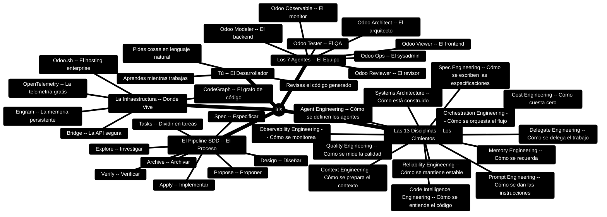
```mermaid
%%{init: {'theme': 'base', 'themeVariables': {'background': '#0d1117', 'primaryColor': '#161b22', 'primaryTextColor': '#FFFFFF', 'secondaryColor': '#1e1e2e', 'secondaryTextColor': '#FFFFFF', 'lineColor': '#a855f7', 'textColor': '#e6edf3', 'clusterBkg': '#0a1628', 'clusterBorder': '#22d3ee'}}}%%
mindmap
  root((iris))
    Tú -- El Desarrollador
      Pides cosas en lenguaje natural
      Revisas el código generado
      Aprendes mientras trabajas
    Los 7 Agentes -- El Equipo
      Odoo Architect -- El arquitecto
      Odoo Modeler -- El backend
      Odoo Viewer -- El frontend
      Odoo Tester -- El QA
      Odoo Reviewer -- El revisor
      Odoo Ops -- El sysadmin
      Odoo Observable -- El monitor
    Las 13 Disciplinas -- Los Cimientos
      Systems Architecture -- Cómo está construido
      Prompt Engineering -- Cómo se dan las instrucciones
      Agent Engineering -- Cómo se definen los agentes
      Context Engineering -- Cómo se prepara el contexto
      Spec Engineering -- Cómo se escriben las especificaciones
      Delegate Engineering -- Cómo se delega el trabajo
      Orchestration Engineering -- Cómo se orquesta el flujo
      Observability Engineering -- Cómo se monitorea
      Quality Engineering -- Cómo se mide la calidad
      Reliability Engineering -- Cómo se mantiene estable
      Memory Engineering -- Cómo se recuerda
      Code Intelligence Engineering -- Cómo se entiende el código
      Cost Engineering -- Cómo cuesta cero
    El Pipeline SDD -- El Proceso
      Explore -- Investigar
      Propose -- Proponer
      Spec -- Especificar
      Design -- Diseñar
      Tasks -- Dividir en tareas
      Apply -- Implementar
      Verify -- Verificar
      Archive -- Archivar
    La Infraestructura -- Donde Vive
      Engram -- La memoria persistente
      CodeGraph -- El grafo de código
      Odoo.sh -- El hosting enterprise
      Bridge -- La API segura
      OpenTelemetry -- La telemetría gratis
```

### En 3 frases

1. **iris recibe tu pedido** en lenguaje natural ("agrega un campo margen a la orden de venta") y lo clasifica: ¿es simple, moderado o complejo?
2. **iris decide quién debe hacerlo**: si es arquitectura, llama al Architect. Si son modelos, al Modeler. Si son vistas, al Viewer. Si hay que revisar, al Reviewer.
3. **iris coordina el viaje completo** de la tarea por 8 fases (explorar → proponer → especificar → diseñar → dividir → implementar → verificar → archivar), persistiendo cada decisión en Engram para que no se olvide nunca.

---

# SECCIÓN 2 — Quién Hace Qué 🌱

## Los 7 agentes como personas de un equipo

Imagina que iris es una empresa de desarrollo Odoo. Estos son sus empleados:

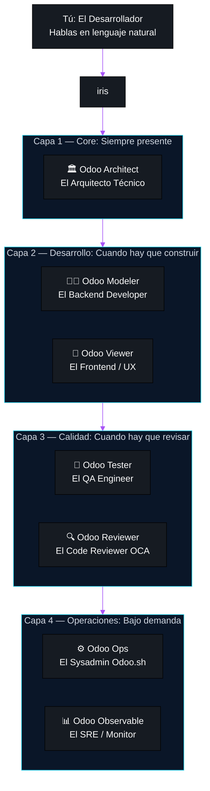
```mermaid
%%{init: {'theme': 'base', 'themeVariables': {'background': '#0d1117', 'primaryColor': '#161b22', 'primaryTextColor': '#FFFFFF', 'secondaryColor': '#1e1e2e', 'secondaryTextColor': '#FFFFFF', 'lineColor': '#a855f7', 'textColor': '#e6edf3', 'clusterBkg': '#0a1628', 'clusterBorder': '#22d3ee'}}}%%
flowchart TD
    Tú[Tú: El Desarrollador<br/>Hablas en lenguaje natural] --> iris
    
    subgraph L1 [Capa 1 — Core: Siempre presente]
        ARCH[🏛️ Odoo Architect<br/>El Arquitecto Técnico]
    end
    
    subgraph L2 [Capa 2 — Desarrollo: Cuando hay que construir]
        MODEL[👨‍💻 Odoo Modeler<br/>El Backend Developer]
        VIEW[🎨 Odoo Viewer<br/>El Frontend / UX]
    end
    
    subgraph L3 [Capa 3 — Calidad: Cuando hay que revisar]
        TEST[🧪 Odoo Tester<br/>El QA Engineer]
        REVIEW[🔍 Odoo Reviewer<br/>El Code Reviewer OCA]
    end
    
    subgraph L4 [Capa 4 — Operaciones: Bajo demanda]
        OPS[⚙️ Odoo Ops<br/>El Sysadmin Odoo.sh]
        OBS[📊 Odoo Observable<br/>El SRE / Monitor]
    end
    
    iris --> L1
    L1 --> L2
    L2 --> L3
    L3 --> L4
```

### ¿Qué hace cada uno? (En palabras simples)

| Agente | Es como... | Su especialidad | Lo que NO hace |
|--------|-----------|----------------|----------------|
| **Odoo Architect** | El arquitecto del equipo | Decide la estructura del módulo, el patrón de herencia, escribe los ADRs. Está en **todo el proceso** de principio a fin. | No escribe modelos ni vistas. |
| **Odoo Modeler** | El backend | Escribe modelos Python, campos, ORM, seguridad (ACL, record rules), computed fields. | No hace vistas ni tests. |
| **Odoo Viewer** | El frontend | Crea vistas XML (form/list/kanban/search), reportes QWeb PDF/HTML, widgets, temas. | No escribe lógica de negocio. |
| **Odoo Tester** | El QA | Escribe tests (TransactionCase, HttpCase, E2E Playwright), mocks, assertion de queries. | No diseña arquitectura. |
| **Odoo Reviewer** | El revisor de código | Audita calidad OCA, seguridad, performance (N+1), naming conventions. | No escribe código nuevo. |
| **Odoo Ops** | El sysadmin | Conecta vía SSH a Odoo.sh, revisa logs, hace backups, ejecuta psql. | No modifica código de módulos. |
| **Odoo Observable** | El monitor | Traza con OpenTelemetry, analiza queries lentas, EXPLAIN ANALYZE, span analysis. | No opera servidores. |

### El principio fundamental: Reciprocal Apprenticeship

Cada agente no solo **hace** el trabajo, sino que **te enseña** mientras lo hace:

```
Cada interacción produce 4 cosas:
┌─────────────────────────────────────────────┐
│ 🐍  Executes → Genera código que funciona   │
│ 📖  Teaches  → Explica POR QUÉ esa decisión │
│ 🖥️  Shows    → Te dice dónde verificarlo    │
│ 💡  Learns   → Aprende de tus correcciones  │
└─────────────────────────────────────────────┘
```

---

# SECCIÓN 3 — El Camino del Trabajo 🌿

## El Pipeline SDD: cómo viaja una tarea de principio a fin

Cuando pides algo a iris ("crea un módulo de comisiones"), la tarea viaja por **8 fases**. Cada fase es un paso que transforma la idea en código funcionando.

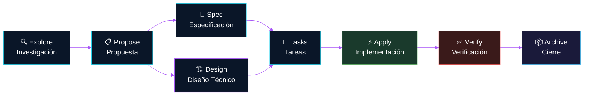
```mermaid
%%{init: {'theme': 'base', 'themeVariables': {'background': '#0d1117', 'primaryColor': '#161b22', 'primaryTextColor': '#FFFFFF', 'secondaryColor': '#1e1e2e', 'secondaryTextColor': '#FFFFFF', 'lineColor': '#a855f7', 'textColor': '#e6edf3', 'clusterBkg': '#0a1628', 'clusterBorder': '#22d3ee'}}}%%
flowchart LR
    P1[🔍 Explore<br/>Investigación] --> P2[📋 Propose<br/>Propuesta]
    P2 --> P3[📄 Spec<br/>Especificación]
    P2 --> P4[🏗️ Design<br/>Diseño Técnico]
    P3 --> P5[📝 Tasks<br/>Tareas]
    P4 --> P5
    P5 --> P6[⚡ Apply<br/>Implementación]
    P6 --> P7[✅ Verify<br/>Verificación]
    P7 --> P8[📦 Archive<br/>Cierre]
    
    style P1 fill:#0a1628,stroke:#22d3ee,color:#fff
    style P2 fill:#0a1628,stroke:#22d3ee,color:#fff
    style P3 fill:#0a1628,stroke:#22d3ee,color:#fff
    style P4 fill:#0a1628,stroke:#a855f7,color:#fff
    style P5 fill:#0a1628,stroke:#22d3ee,color:#fff
    style P6 fill:#1a3a2c,stroke:#66bb6a,color:#fff
    style P7 fill:#3a1a1a,stroke:#ef5350,color:#fff
    style P8 fill:#1a1a3a,stroke:#4fc3f7,color:#fff
```

### Fase por fase, en palabras simples

| Fase | Quién lidera | Qué pasa ahí | Pregunta que responde |
|------|-------------|-------------|----------------------|
| **Explore** | 🏛️ Architect | Investiga el código existente, busca módulos similares, entiende el contexto. | "¿Qué hay ya? ¿Qué necesitamos entender?" |
| **Propose** | 🏛️ Architect | Propone la solución con alternativas. Decide el enfoque. | "¿Cómo lo vamos a hacer? ¿Qué opciones tenemos?" |
| **Spec** | 🏛️ Architect | Escribe los requisitos detallados, escenarios, reglas de negocio. | "¿Qué debe cumplir exactamente?" |
| **Design** | 🏛️ Architect + Modeler | Diseña la arquitectura: qué modelos, qué campos, qué vistas. | "¿Cómo se construye?" |
| **Tasks** | 🏛️ Architect | Desglosa el diseño en tareas pequeñas e independientes. | "¿Qué hay que hacer paso a paso?" |
| **Apply** | 👨‍💻 Modeler + Viewer | **Implementa**: escribe código Python, XML, tests. | "Aquí está el código funcionando." |
| **Verify** | 🔍 Reviewer + Tester | Revisa calidad, seguridad, performance. Corre tests. | "¿Cumple con los estándares?" |
| **Archive** | 🏛️ Architect | Cierra el cambio, archiva artefactos, actualiza documentación. | "¿Queda todo documentado?" |

### Principio clave: las flechas no rectas

Fíjate que **Propose se bifurca** en Spec y Design. Esto significa que **especificación y diseño pueden ocurrir en paralelo** — no hay que esperar a terminar una para empezar la otra. El pipeline no es una línea recta, es un **grafo acíclico dirigido (DAG)**.

---

# SECCIÓN 4 — Los Engranajes 🌿

## Las 13 Disciplinas de Ingeniería

Si los 7 agentes son las personas del equipo, las 13 disciplinas son **los sistemas y herramientas que usan para hacer su trabajo**. No son personas — son **mecanismos**.

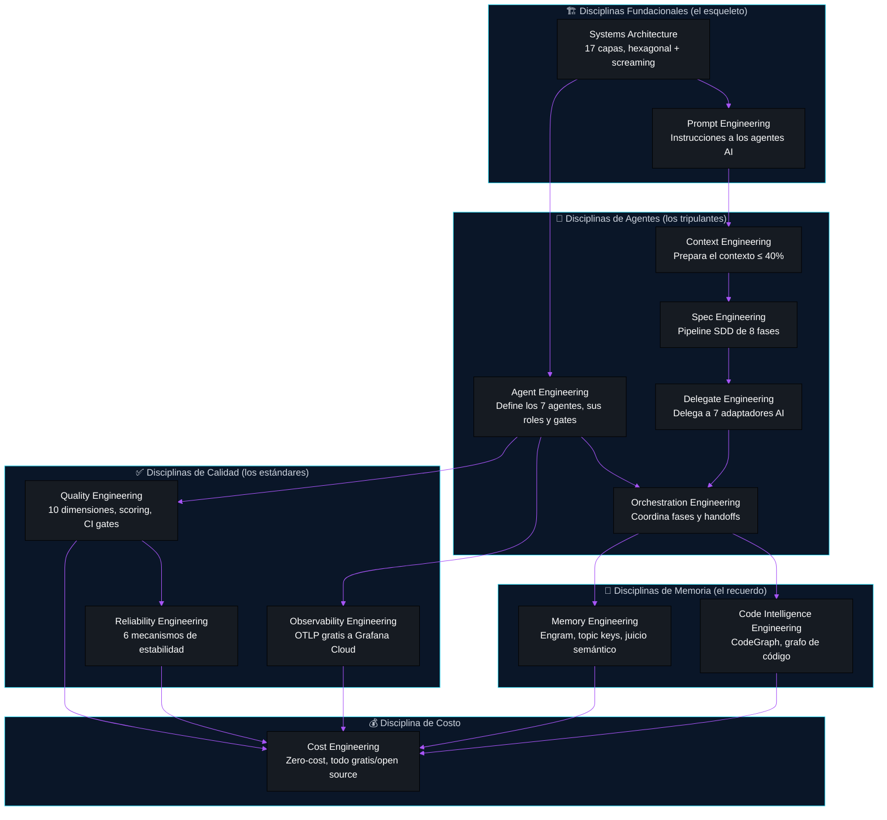
```mermaid
%%{init: {'theme': 'base', 'themeVariables': {'background': '#0d1117', 'primaryColor': '#161b22', 'primaryTextColor': '#FFFFFF', 'secondaryColor': '#1e1e2e', 'secondaryTextColor': '#FFFFFF', 'lineColor': '#a855f7', 'textColor': '#e6edf3', 'clusterBkg': '#0a1628', 'clusterBorder': '#22d3ee'}}}%%
flowchart TD
    subgraph Fundacional ["🏗️ Disciplinas Fundacionales (el esqueleto)"]
        SA[Systems Architecture<br/>17 capas, hexagonal + screaming]
        PE[Prompt Engineering<br/>Instrucciones a los agentes AI]
    end
    
    subgraph Agentes ["🤖 Disciplinas de Agentes (los tripulantes)"]
        AE[Agent Engineering<br/>Define los 7 agentes, sus roles y gates]
        CE[Context Engineering<br/>Prepara el contexto ≤ 40%]
        SE[Spec Engineering<br/>Pipeline SDD de 8 fases]
        DE[Delegate Engineering<br/>Delega a 7 adaptadores AI]
        OE[Orchestration Engineering<br/>Coordina fases y handoffs]
    end
    
    subgraph Calidad ["✅ Disciplinas de Calidad (los estándares)"]
        QE[Quality Engineering<br/>10 dimensiones, scoring, CI gates]
        RE[Reliability Engineering<br/>6 mecanismos de estabilidad]
        OBE[Observability Engineering<br/>OTLP gratis a Grafana Cloud]
    end
    
    subgraph Memoria ["🧠 Disciplinas de Memoria (el recuerdo)"]
        ME[Memory Engineering<br/>Engram, topic keys, juicio semántico]
        CIE[Code Intelligence Engineering<br/>CodeGraph, grafo de código]
    end
    
    subgraph Costo ["💰 Disciplina de Costo"]
        CE2[Cost Engineering<br/>Zero-cost, todo gratis/open source]
    end
    
    SA --> AE
    SA --> PE
    PE --> CE
    AE --> OE
    CE --> SE
    SE --> DE
    DE --> OE
    
    AE --> QE
    AE --> OBE
    QE --> RE
    
    OE --> ME
    OE --> CIE
    
    QE --> CE2
    RE --> CE2
    OBE --> CE2
    ME --> CE2
    CIE --> CE2
```

### ¿Qué hace cada disciplina? (Semi-técnico)

| # | Disciplina | ¿Qué resuelve? | En una frase |
|---|-----------|---------------|-------------|
| **1** | **Systems Architecture** | ¿Cómo está organizado el código de iris? | 17 capas que van del transporte MCP hasta los módulos Odoo, siguiendo hexagonal + screaming architecture. |
| **2** | **Prompt Engineering** | ¿Cómo se le dan instrucciones a los agentes AI? | 8 plantillas SDD + 5 especializadas Odoo, ensambladas con Slim-MD Builder respetando el 40% de presupuesto. |
| **3** | **Agent Engineering** | ¿Quiénes son los agentes y cómo se comportan? | 7 especialistas en 4 capas (Onion Model), cada uno con skills, quality gates y personalidad. |
| **4** | **Context Engineering** | ¿Qué contexto necesita cada agente para trabajar? | Detector de 22 tipos de tarea con 130+ keywords, carga 120+ archivos de conocimiento. |
| **5** | **Spec Engineering** | ¿Cómo se escriben especificaciones que funcionen? | Pipeline SDD con delta specs, trazabilidad desde propuesta hasta archivo. |
| **6** | **Delegate Engineering** | ¿Cómo iris delega trabajo a los modelos AI? | 5 pasos: scoring → selección → prompt → two-phase commit → budget tracking. |
| **7** | **Orchestration Engineering** | ¿Cómo se coordinan las fases y los agentes? | DAG de 8 fases, handoff explícito entre agentes, estado persistente. |
| **8** | **Observability Engineering** | ¿Cómo sabemos que todo funciona? | OpenTelemetry gratis (Apache-2.0) con HTTP/ORM/RPC tracing exportado a Grafana Cloud. |
| **9** | **Quality Engineering** | ¿Cómo medimos la calidad del código generado? | 10 dimensiones con pesos, fórmula de scoring, 4 CI gates. |
| **10** | **Reliability Engineering** | ¿Cómo evitamos que iris se caiga? | 6 mecanismos: timeouts, retry+backoff, circuit breaker, fallback, bulkhead, health checks. |
| **11** | **Memory Engineering** | ¿Cómo iris recuerda entre sesiones? | Engram con topic keys, resolución de conflictos semánticos, protocolo de 2 pasos. |
| **12** | **Code Intelligence Engineering** | ¿Cómo iris entiende el código existente? | CodeGraph: grafo de código con 10 herramientas (search, trace, context, impact, etc.). |
| **13** | **Cost Engineering** | ¿Cómo hacemos que todo cueste cero? | Todos los servicios son gratis/open source, budget tracking por adaptador, sin suscripciones adicionales. |

---

# SECCIÓN 5 — La Matriz de Conexiones 🌳

## Quién se conecta con quién y para qué

Esta sección muestra las **relaciones entre los 7 agentes y las 13 disciplinas**, y cómo se conectan entre sí.

### Mapa de Agentes → Disciplinas que usan

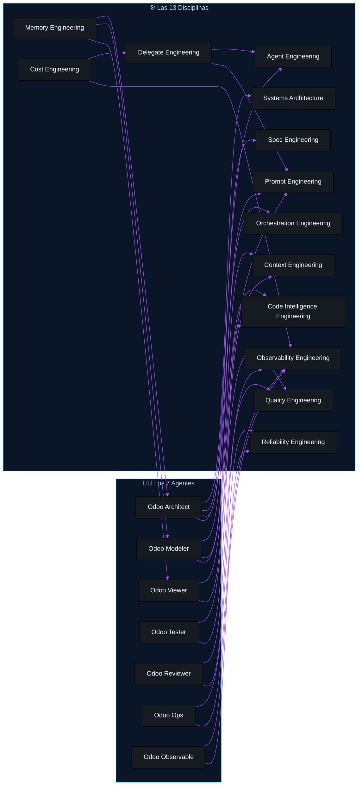
```mermaid
%%{init: {'theme': 'base', 'themeVariables': {'background': '#0d1117', 'primaryColor': '#161b22', 'primaryTextColor': '#FFFFFF', 'secondaryColor': '#1e1e2e', 'secondaryTextColor': '#FFFFFF', 'lineColor': '#a855f7', 'textColor': '#e6edf3', 'clusterBkg': '#0a1628', 'clusterBorder': '#22d3ee'}}}%%
flowchart LR
    subgraph Agentes ["🧑‍💼 Los 7 Agentes"]
        ARCH[Odoo Architect]
        MODEL[Odoo Modeler]
        VIEW[Odoo Viewer]
        TEST[Odoo Tester]
        REVIEW[Odoo Reviewer]
        OPS[Odoo Ops]
        OBS[Odoo Observable]
    end
    
    subgraph Disciplinas ["⚙️ Las 13 Disciplinas"]
        SA[Systems Architecture]
        PE[Prompt Engineering]
        AE[Agent Engineering]
        CE[Context Engineering]
        SPE[Spec Engineering]
        DELEG[Delegate Engineering]
        ORCH[Orchestration Engineering]
        OBE[Observability Engineering]
        QE[Quality Engineering]
        REL[Reliability Engineering]
        ME[Memory Engineering]
        CIE[Code Intelligence Engineering]
        COST[Cost Engineering]
    end
    
    ARCH --> SA
    ARCH --> AE
    ARCH --> SPE
    ARCH --> ORCH
    
    MODEL --> PE
    MODEL --> CE
    MODEL --> CIE
    
    VIEW --> PE
    VIEW --> CE
    
    TEST --> QE
    TEST --> CIE
    
    REVIEW --> QE
    REVIEW --> OBE
    
    OPS --> REL
    OPS --> OBE
    
    OBS --> OBE
    OBS --> REL
    
    DELEG --> AE
    DELEG --> PE
    
    ME --> ARCH
    ME --> MODEL
    ME --> VIEW
    
    COST --> DELEG
    COST --> OBE
```

### Los puentes entre disciplinas

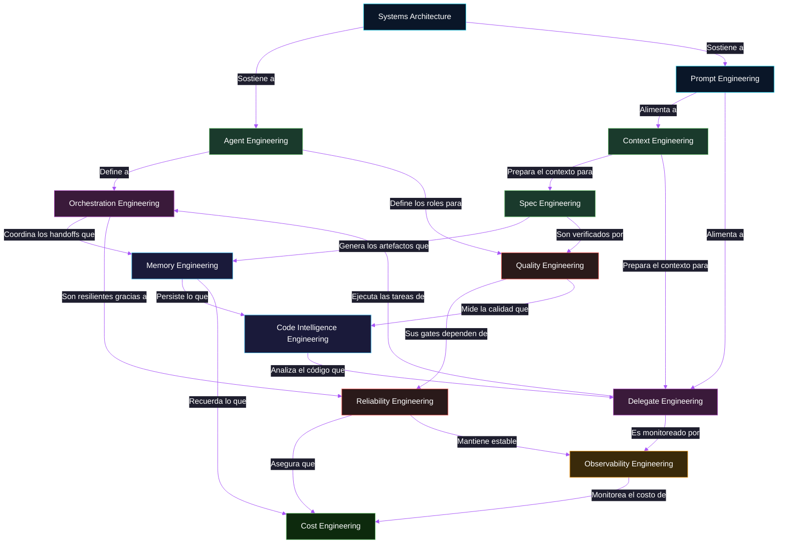
```mermaid
%%{init: {'theme': 'base', 'themeVariables': {'background': '#0d1117', 'primaryColor': '#161b22', 'primaryTextColor': '#FFFFFF', 'secondaryColor': '#1e1e2e', 'secondaryTextColor': '#FFFFFF', 'lineColor': '#a855f7', 'textColor': '#e6edf3', 'clusterBkg': '#0a1628', 'clusterBorder': '#22d3ee'}}}%%
flowchart TD
    %% Disciplinas que habilitan a otras
    SA[Systems Architecture] -->|"Sostiene a"| AE[Agent Engineering]
    SA -->|"Sostiene a"| PE[Prompt Engineering]
    
    PE -->|"Alimenta a"| CE[Context Engineering]
    PE -->|"Alimenta a"| DELEG[Delegate Engineering]
    
    AE -->|"Define a"| ORCH[Orchestration Engineering]
    AE -->|"Define los roles para"| QE[Quality Engineering]
    
    CE -->|"Prepara el contexto para"| SPE[Spec Engineering]
    CE -->|"Prepara el contexto para"| DELEG
    
    SPE -->|"Genera los artefactos que"| ME[Memory Engineering]
    SPE -->|"Son verificados por"| QE
    
    DELEG -->|"Ejecuta las tareas de"| ORCH
    DELEG -->|"Es monitoreado por"| OBE[Observability Engineering]
    
    ORCH -->|"Coordina los handoffs que"| ME
    ORCH -->|"Son resilientes gracias a"| REL[Reliability Engineering]
    
    QE -->|"Sus gates dependen de"| REL
    QE -->|"Mide la calidad que"| CIE[Code Intelligence Engineering]
    
    REL -->|"Asegura que"| COST[Cost Engineering]
    REL -->|"Mantiene estable"| OBE
    
    ME -->|"Persiste lo que"| CIE
    ME -->|"Recuerda lo que"| COST
    
    CIE -->|"Analiza el código que"| DELEG
    
    OBE -->|"Monitorea el costo de"| COST

    style SA fill:#0a1628,stroke:#22d3ee,color:#fff
    style PE fill:#0a1628,stroke:#22d3ee,color:#fff
    style AE fill:#1a3a2c,stroke:#66bb6a,color:#fff
    style CE fill:#1a3a2c,stroke:#66bb6a,color:#fff
    style SPE fill:#1a3a2c,stroke:#66bb6a,color:#fff
    style DELEG fill:#3a1a3a,stroke:#ab47bc,color:#fff
    style ORCH fill:#3a1a3a,stroke:#ab47bc,color:#fff
    style OBE fill:#3a2a0a,stroke:#ffa726,color:#fff
    style QE fill:#2a1a1a,stroke:#ef5350,color:#fff
    style REL fill:#2a1a1a,stroke:#ef5350,color:#fff
    style ME fill:#1a1a3a,stroke:#4fc3f7,color:#fff
    style CIE fill:#1a1a3a,stroke:#4fc3f7,color:#fff
    style COST fill:#0d2a0d,stroke:#66bb6a,color:#fff
```

### Explicación de los puentes

| Disciplina A | Se conecta con B | Porque |
|-------------|-----------------|--------|
| **Systems Architecture** | Agent Engineering | La arquitectura de 17 capas define dónde viven los agentes. |
| **Prompt Engineering** | Context Engineering | Los prompts se ensamblan con el contexto que Context Engineering prepara. |
| **Agent Engineering** | Quality Engineering | Cada agente tiene quality gates que Quality Engineering mide. |
| **Spec Engineering** | Memory Engineering | Los artefactos SDD se persisten en Engram vía Memory Engineering. |
| **Delegate Engineering** | Orchestration Engineering | La delegación a adaptadores AI es orquestada por Orchestration. |
| **Observability Engineering** | Cost Engineering | Monitorear el uso de cada adaptador permite controlar costos. |
| **Reliability Engineering** | Quality Engineering | Los CI gates requieren circuit breakers y timeouts para funcionar. |

---

# SECCIÓN 6 — La Arquitectura Técnica 🌳

## Las 17 capas del sistema

iris tiene **17 capas** organizadas desde el transporte MCP hasta los módulos de dominio Odoo. Cada capa solo se comunica con sus vecinas inmediatas (separation of concerns).


```mermaid
%%{init: {'theme': 'base', 'themeVariables': {'background': '#0d1117', 'primaryColor': '#161b22', 'primaryTextColor': '#FFFFFF', 'secondaryColor': '#1e1e2e', 'secondaryTextColor': '#FFFFFF', 'lineColor': '#a855f7', 'textColor': '#e6edf3', 'clusterBkg': '#0a1628', 'clusterBorder': '#22d3ee'}}}%%
flowchart TD
    subgraph Transport ["Capas 1-2: Transporte"]
        C1["1. MCP STDIO Transport<br/>Protocolo estándar MCP sobre stdin/stdout"]
        C2["2. MCP Protocol Layer<br/>Mensajes JSON-RPC 2.0, tools, resources"]
    end
    
    subgraph Server ["Capas 3-5: Servidor"]
        C3["3. Server Core<br/>Inicialización, lifecycle, shutdown graceful"]
        C4["4. Tool Registry<br/>Registro de 20+ herramientas MCP"]
        C5["5. Router & Classifier<br/>Clasificación de tareas por tipo y complejidad"]
    end
    
    subgraph Engine ["Capas 6-10: Motores"]
        C6["6. Context Engine<br/>Detector de tareas, selector de skills, Slim-MD"]
        C7["7. Delegate Engine<br/>Scoring, selección, prompt, two-phase commit"]
        C8["8. Orchestration Engine<br/>DAG de fases, handoff, estado persistente"]
        C9["9. Quality Scanner<br/>10 dimensiones, scoring, CI gates"]
        C10["10. Harness Engine<br/>Persistencia de learning artifacts"]
    end
    
    subgraph Adapters ["Capas 11-13: Adaptadores"]
        C11["11. AI Adapters Layer<br/>Claude, Gemini, Copilot, Codex, Kilo, Cursor, OpenCode"]
        C12["12. Resilience Layer<br/>Timeouts, circuit breaker, bulkhead, retry"]
        C13["13. Budget Layer<br/>Budget tracking diario por adaptador"]
    end
    
    subgraph Memory ["Capas 14-15: Memoria"]
        C14["14. Engram Memory Client<br/>Topic keys, mem_save, mem_search, mem_judge"]
        C15["15. CodeGraph Client<br/>Grafo de código, 10 tools de análisis"]
    end
    
    subgraph Domain ["Capas 16-17: Dominio Odoo"]
        C16["16. Odoo.sh Integration<br/>SSH dinámico, logs, psql, backups"]
        C17["17. Domain Skills & Knowledge<br/>120+ archivos de conocimiento Odoo v14-v19"]
    end
    
    C1 --> C2
    C2 --> C3
    C3 --> C4
    C4 --> C5
    C5 --> C6
    C6 --> C7
    C7 --> C8
    C8 --> C9
    C9 --> C10
    C10 --> C11
    C11 --> C12
    C12 --> C13
    C13 --> C14
    C14 --> C15
    C15 --> C16
    C16 --> C17
```

### Los 7 Adaptadores AI

iris no usa un solo modelo AI. Puede delegar a **7 adaptadores diferentes** según la tarea:

| Adaptador | Modelo | Cuándo se usa |
|-----------|--------|--------------|
| **Claude** | Anthropic Claude | Tareas SDD complejas (default para desarrollo Odoo) |
| **Gemini** (vía Antigravity) | Google Gemini 2.5 Pro | Documentación, reportes, tareas de escritura |
| **GitHub Copilot** | OpenAI / Copilot | Ediciones rápidas, autocompletado |
| **OpenAI Codex** | GPT-4 Codex | Refactorización, código boilerplate |
| **Kilo Code** | Modelo local | Tareas offline, sin conexión |
| **Cursor** | Modelo Cursor | Desarrollo dentro del IDE Cursor |
| **OpenCode** | DeepSeek / varios | Alternativa open source, tareas generales |

---

# SECCIÓN 7 — El Protocolo de Calidad 🔥

## Cómo iris asegura que el código que genera sea bueno

iris no solo genera código — **mide la calidad** del código que genera usando 10 dimensiones con pesos específicos.

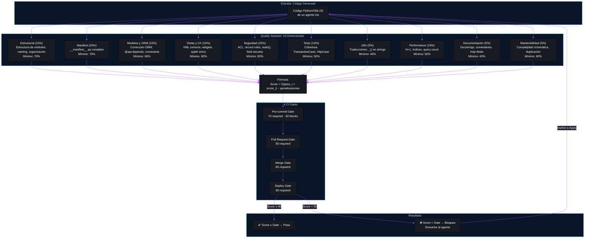
```mermaid
%%{init: {'theme': 'base', 'themeVariables': {'background': '#0d1117', 'primaryColor': '#161b22', 'primaryTextColor': '#FFFFFF', 'secondaryColor': '#1e1e2e', 'secondaryTextColor': '#FFFFFF', 'lineColor': '#a855f7', 'textColor': '#e6edf3', 'clusterBkg': '#0a1628', 'clusterBorder': '#22d3ee'}}}%%
flowchart TD
    subgraph Entrada ["Entrada: Código Generado"]
        COD[Código Python/XML/JS<br/>de un agente iris]
    end
    
    subgraph Scanner ["Quality Scanner: 10 Dimensiones"]
        D1["Estructural (15%)<br/>Estructura de módulos, naming, organización<br/>Mínimo: 70%"]
        D2["Manifest (10%)<br/>__manifest__.py completo<br/>Mínimo: 70%"]
        D3["Modelos y ORM (15%)<br/>Corrección ORM, @api.depends, constraints<br/>Mínimo: 60%"]
        D4["Vistas y UX (10%)<br/>XML correcto, widgets, xpath único<br/>Mínimo: 60%"]
        D5["Seguridad (15%)<br/>ACL, record rules, sudo(), field security<br/>Mínimo: 80%"]
        D6["Tests (10%)<br/>Cobertura TransactionCase, HttpCase<br/>Mínimo: 50%"]
        D7["i18n (5%)<br/>Traducciones, _() en strings<br/>Mínimo: 40%"]
        D8["Performance (10%)<br/>N+1, índices, query count<br/>Mínimo: 50%"]
        D9["Documentación (5%)<br/>Docstrings, comentarios, help fields<br/>Mínimo: 40%"]
        D10["Mantenibilidad (5%)<br/>Complejidad ciclomática, duplicación<br/>Mínimo: 40%"]
    end
    
    subgraph Gates ["4 CI Gates"]
        PRE[Pre-commit Gate<br/>70 required · 50 blocks]
        PR[Pull Request Gate<br/>80 required]
        MERGE[Merge Gate<br/>85 required]
        DEPLOY[Deploy Gate<br/>90 required]
    end
    
    subgraph Resultado ["Resultado"]
        PASS["✅ Score ≥ Gate → Pasa"]
        FAIL["❌ Score < Gate → Bloquea<br/>Devuelve al agente"]
    end
    
    COD --> D1
    COD --> D2
    COD --> D3
    COD --> D4
    COD --> D5
    COD --> D6
    COD --> D7
    COD --> D8
    COD --> D9
    COD --> D10
    
    D1 & D2 & D3 & D4 & D5 & D6 & D7 & D8 & D9 & D10 --> SCORE
    
    SCORE["Fórmula:<br/>Score = Σ(peso_i × score_i) − penalizaciones"] --> PRE
    PRE --> PR
    PR --> MERGE
    MERGE --> DEPLOY
    
    DEPLOY -->|Score ≥ 90| PASS
    DEPLOY -->|Score < 90| FAIL
    FAIL -->|"Vuelve a Apply"| COD
```

### Los 6 Mecanismos de Confiabilidad (Reliability Engineering)

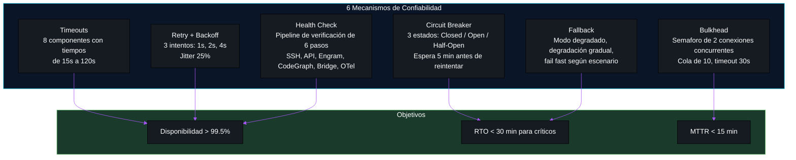
```mermaid
%%{init: {'theme': 'base', 'themeVariables': {'background': '#0d1117', 'primaryColor': '#161b22', 'primaryTextColor': '#FFFFFF', 'secondaryColor': '#1e1e2e', 'secondaryTextColor': '#FFFFFF', 'lineColor': '#a855f7', 'textColor': '#e6edf3', 'clusterBkg': '#0a1628', 'clusterBorder': '#22d3ee'}}}%%
flowchart TD
    subgraph Mecanismos ["6 Mecanismos de Confiabilidad"]
        T[Timeouts<br/>8 componentes con tiempos<br/>de 15s a 120s]
        R[Retry + Backoff<br/>3 intentos: 1s, 2s, 4s<br/>Jitter 25%]
        CB[Circuit Breaker<br/>3 estados: Closed / Open / Half-Open<br/>Espera 5 min antes de reintentar]
        FB[Fallback<br/>Modo degradado, degradación gradual,<br/>fail fast según escenario]
        BH[Bulkhead<br/>Semaforo de 2 conexiones concurrentes<br/>Cola de 10, timeout 30s]
        HC[Health Check<br/>Pipeline de verificación de 6 pasos<br/>SSH, API, Engram, CodeGraph, Bridge, OTel]
    end
    
    subgraph Objetivos ["Objetivos"]
        DISPO["Disponibilidad > 99.5%"]
        RTO["RTO < 30 min para críticos"]
        MTTR["MTTR < 15 min"]
    end
    
    T --> DISPO
    R --> DISPO
    CB --> RTO
    FB --> RTO
    BH --> MTTR
    HC --> DISPO
    
    style Mecanismos fill:#0a1628,stroke:#22d3ee,color:#fff
    style Objetivos fill:#1a3a2c,stroke:#66bb6a,color:#fff
```

---

# SECCIÓN 8 — El Mapa Completo 🔥

## Todo junto: la conexión final de cada pieza del sistema

Este es el diagrama más grande y completo. Muestra **cada componente de iris** y cómo se conecta con los demás. Es la foto definitiva del sistema entero.


```mermaid
%%{init: {'theme': 'base', 'themeVariables': {'background': '#0d1117', 'primaryColor': '#161b22', 'primaryTextColor': '#FFFFFF', 'secondaryColor': '#1e1e2e', 'secondaryTextColor': '#FFFFFF', 'lineColor': '#a855f7', 'textColor': '#e6edf3', 'clusterBkg': '#0a1628', 'clusterBorder': '#22d3ee'}}}%%
flowchart TB
    %% ==================== TÚ ====================
    TU["🧑‍💻 TÚ<br/>Desarrollador Odoo"] -->|"Pides en lenguaje natural:<br/>'crea un módulo de comisiones'"| IRIS
    
    %% ==================== IRIS MCP SERVER ====================
    subgraph IRIS["iris — MCP Orchestrator"]
        direction TB
        
        %% Sub-capa: Server Core
        MCPSERVER["MCP Server Core<br/>Inicialización · Lifecycle · Shutdown graceful<br/>JSON-RPC 2.0 sobre STDIO"]
        
        %% Sub-capa: Tools
        TOOLS["Tool Registry<br/>20+ herramientas MCP<br/>iris_delegate · codegraph_search · mem_save · status"]
        
        %% Sub-capa: Router
        ROUTER["Router + Classifier<br/>22 tipos de tarea · 130+ keywords<br/>Complejidad: low / medium / high"]
    end
    
    %% ==================== PIPELINE SDD ====================
    subgraph SDD["Pipeline SDD — 8 Fases"]
        direction LR
        P1["1. 🔍 Explore<br/>CodeGraph search<br/>Análisis de código"]
        P2["2. 📋 Propose<br/>Definición de alcance<br/>Alternativas"]
        P3["3. 📄 Spec<br/>Requisitos detallados<br/>Escenarios"]
        P4["4. 🏗️ Design<br/>ADR + Diseño técnico<br/>Arquitectura"]
        P5["5. 📝 Tasks<br/>Desglose en tareas<br/>Checklist implementación"]
        P6["6. ⚡ Apply<br/>Generación de código<br/>Python + XML + Tests"]
        P7["7. ✅ Verify<br/>Quality Gates<br/>10 dimensiones"]
        P8["8. 📦 Archive<br/>Cierre · Sync ·<br/>Learning Artifact"]
        
        P1 --> P2
        P2 --> P3
        P2 --> P4
        P3 --> P5
        P4 --> P5
        P5 --> P6
        P6 --> P7
        P7 --> P8
    end
    
    %% ==================== LOS 7 AGENTES ====================
    subgraph AGENTS["🧑‍💼 Los 7 Agentes Especialistas"]
        direction TB
        
        subgraph L1C["🧅 Layer 1 — Core (siempre activo)"]
            ARCH["🏛️ Odoo Architect<br/>Estructura · ADRs · Decisiones<br/>Pipeline SDD completo"]
        end
        
        subgraph L2D["🧅 Layer 2 — Development (design → apply)"]
            MODEL["👨‍💻 Odoo Modeler<br/>Modelos Python · ORM · Fields<br/>Constraints · Security (ACL)"]
            VIEW["🎨 Odoo Viewer<br/>XML Views · QWeb Reports<br/>Widgets · XPath · Assets"]
        end
        
        subgraph L3Q["🧅 Layer 3 — Quality (apply → verify)"]
            TEST["🧪 Odoo Tester<br/>TransactionCase · HttpCase<br/>E2E Playwright · Coverage"]
            REVIEW["🔍 Odoo Reviewer<br/>Code Review OCA · Security Audit<br/>N+1 Detection · Scoring"]
        end
        
        subgraph L4O["🧅 Layer 4 — Operations (bajo demanda)"]
            OPS["⚙️ Odoo Ops<br/>SSH · Logs · Backups<br/>PostgreSQL · Odoo.sh"]
            OBS["📊 Odoo Observable<br/>OpenTelemetry · Tracing<br/>EXPLAIN ANALYZE · Performance"]
        end
    end
    
    %% ==================== LAS 13 DISCIPLINAS ====================
    subgraph DISCIPLINAS["⚙️ Las 13 Disciplinas de Ingeniería"]
        direction TB
        
        group1["🏗️ Fundacionales"]
        SA["Systems Architecture<br/>17 capas · Hexagonal + Screaming"]
        PE["Prompt Engineering<br/>8 plantillas SDD · Slim-MD Builder"]
        
        group2["🤖 De Agentes"]
        AE["Agent Engineering<br/>7 agentes · Onion Model · Reciprocal Apprenticeship"]
        CE["Context Engineering<br/>Detector 22 tipos · 120+ archivos · ≤40%"]
        SPE["Spec Engineering<br/>Delta specs · Trazabilidad · Escenarios"]
        DELEG["Delegate Engineering<br/>5 pasos · Two-Phase Commit · 7 adapters"]
        ORCH["Orchestration Engineering<br/>DAG 8 fases · Handoff · Estado persistente"]
        
        group3["✅ De Calidad"]
        QE["Quality Engineering<br/>10 dimensiones · Scoring · CI Gates"]
        REL["Reliability Engineering<br/>6 mecanismos · Circuit Breaker · Bulkhead"]
        OBE["Observability Engineering<br/>OTLP gratis · Grafana Cloud"]
        
        group4["🧠 De Memoria"]
        ME["Memory Engineering<br/>Engram · Topic Keys · Juicio semántico"]
        CIE["Code Intelligence Engineering<br/>CodeGraph · 10 tools · UI Map Engine"]
        
        group5["💰 De Costo"]
        COST["Cost Engineering<br/>Zero-cost · Budget tracking · Alertas"]
    end
    
    %% ==================== INFRAESTRUCTURA ====================
    subgraph INFRA["🏗️ Infraestructura"]
        ENGRAM["🧠 Engram<br/>Memoria persistente<br/>Topic keys · mem_save · mem_search<br/>Juicio semántico · Conflict resolution"]
        CODEGRAPH["🔍 CodeGraph<br/>Grafo de código<br/>10 herramientas de análisis<br/>UI Map Engine"]
        ODOOSH["☁️ Odoo.sh<br/>Hosting Enterprise<br/>SSH dinámico · Build ID variable<br/>Logs · PostgreSQL"]
        BRIDGE["🌉 alesco_api_bridge<br/>REST API segura<br/>Auth por token · Query builder<br/>Endpoints Odoo seguros"]
        OTEL["📡 alesco_observability<br/>OpenTelemetry gratis<br/>Apache 2.0 · OTLP export<br/>HTTP/ORM/RPC tracing"]
        GRAFANA["📊 Grafana Cloud<br/>Dashboards gratis<br/>14 días retención<br/>P50/P95/P99 spans"]
    end
    
    %% ==================== ADAPTADORES AI ====================
    subgraph ADAPTERS["🤖 7 Adaptadores AI"]
        direction TB
        ADA1["Claude (Anthropic)<br/>Default SDD complex"]
        ADA2["Gemini (Antigravity)<br/>Documentación"]
        ADA3["Copilot (GitHub)<br/>Ediciones rápidas"]
        ADA4["Codex (OpenAI)<br/>Refactorización"]
        ADA5["Kilo (local)<br/>Offline"]
        ADA6["Cursor<br/>IDE nativo"]
        ADA7["OpenCode (DeepSeek)<br/>Open source"]
    end
    
    %% ==================== SISTEMA DE MEMORIA ENGRAMA ====================
    subgraph ENGRAM_DETAIL["🧠 Engram — La Memoria de iris"]
        direction TB
        E_SAVE["mem_save<br/>Persiste observaciones<br/>Topic key upsert"]
        E_SEARCH["mem_search<br/>Búsqueda semántica<br/>Natural language"]
        E_JUDGE["mem_judge<br/>Resolución de conflictos<br/>6 tipos de relación"]
        E_CONTEXT["mem_context<br/>Contexto de sesiones<br/>Historial completo"]
        E_GET["mem_get_observation<br/>Contenido completo<br/>Sin truncación"]
    end
    
    %% ==================== SISTEMA CODEGRAPH ====================
    subgraph CODEGRAPH_DETAIL["🔍 CodeGraph — El Grafo de Código"]
        direction TB
        CG_SEARCH["codegraph_search<br/>Búsqueda de símbolos"]
        CG_CONTEXT["codegraph_context<br/>Contexto completo<br/>Entry points + relaciones"]
        CG_NODE["codegraph_node<br/>Detalle de un símbolo<br/>Callers + callees"]
        CG_TRACE["codegraph_trace<br/>Flujo entre 2 símbolos<br/>"Cómo llega X a Y""]
        CG_EXPLORE["codegraph_explore<br/>Varios símbolos<br/>Agrupados por archivo"]
    end
    
    %% ==================== CONEXIONES ====================
    
    %% Tú → iris
    TU --> MCPSERVER
    
    %% iris → pipeline
    MCPSERVER --> ROUTER
    ROUTER --> TOOLS
    TOOLS --> SDD
    
    %% SDD → Agentes (quién hace qué fase)
    P1 -->|"Explore: primario"| ARCH
    P2 -->|"Propose: primario"| ARCH
    P3 -->|"Spec: primario"| ARCH
    P4 -->|"Design: primario"| ARCH
    P4 ---|"soporte"| MODEL
    P5 -->|"Tasks: primario"| ARCH
    P6 -->|"Apply: primario"| MODEL
    P6 -->|"Apply: primario"| VIEW
    P6 ---|"soporte"| TEST
    P7 -->|"Verify: primario"| REVIEW
    P7 ---|"soporte"| TEST
    P7 ---|"soporte"| OPS
    P8 -->|"Archive: primario"| ARCH
    
    %% Agentes → Disciplinas que usan
    ARCH --- SA
    ARCH --- AE
    ARCH --- SPE
    ARCH --- ORCH
    
    MODEL --- PE
    MODEL --- CE
    MODEL --- CIE
    
    VIEW --- PE
    VIEW --- CE
    
    TEST --- QE
    TEST --- CIE
    
    REVIEW --- QE
    REVIEW --- OBE
    
    OPS --- REL
    OPS --- OBE
    
    OBS --- OBE
    OBS --- REL
    
    %% Disciplinas se conectan entre sí
    SA --> AE
    SA --> PE
    PE --> CE
    AE --> ORCH
    CE --> SPE
    CE --> DELEG
    SPE --> QE
    DELEG --> ORCH
    ORCH --> ME
    QE --> REL
    REL --> COST
    OBE --> COST
    ME --> CIE
    CIE --> DELEG
    
    %% Pipeline → Infraestructura
    SDD --> ENGRAM
    SDD --> CODEGRAPH
    
    %% Tool Registry → Infraestructura
    TOOLS --> ODOOSH
    TOOLS --> BRIDGE
    TOOLS --> OTEL
    ODOOSH --> OTEL
    OTEL --> GRAFANA
    
    %% Agentes → Adaptadores AI
    ARCH -->|"delega a"| ADAPTERS
    MODEL -->|"delega a"| ADAPTERS
    VIEW -->|"delega a"| ADAPTERS
    TEST -->|"delega a"| ADAPTERS
    REVIEW -->|"delega a"| ADAPTERS
    OPS -->|"delega a"| ADAPTERS
    OBS -->|"delega a"| ADAPTERS
    
    %% Engram detalle
    ENGRAM --- ENGRAM_DETAIL
    E_CONTEXT -->|"recupera estado<br/>tras compaction"| ARCH
    
    %% CodeGraph detalle
    CODEGRAPH --- CODEGRAPH_DETAIL
    CG_CONTEXT -->|"contexto para"| ARCH
    CG_CONTEXT -->|"contexto para"| MODEL
    CG_CONTEXT -->|"contexto para"| VIEW
    
    %% Estilos por capa
    style L1C fill:#0a1628,stroke:#22d3ee,color:#fff
    style L2D fill:#1a3a2c,stroke:#66bb6a,color:#fff
    style L3Q fill:#2a1a1a,stroke:#ef5350,color:#fff
    style L4O fill:#1a1a3a,stroke:#4fc3f7,color:#fff
    
    style group1 fill:#0d1117,stroke:#22d3ee,color:#fff,stroke-dasharray: 3
    style group2 fill:#0d1117,stroke:#66bb6a,color:#fff,stroke-dasharray: 3
    style group3 fill:#0d1117,stroke:#ef5350,color:#fff,stroke-dasharray: 3
    style group4 fill:#0d1117,stroke:#4fc3f7,color:#fff,stroke-dasharray: 3
    style group5 fill:#0d1117,stroke:#ffa726,color:#fff,stroke-dasharray: 3
```

---

## 📖 Transición: De lo Fundamental a lo Profundo

Las secciones 1-8 cubrieron los fundamentos: los 7 agentes, las 13 disciplinas, el pipeline SDD y la infraestructura. Las secciones 9-15 que siguen **profundizan en diagramas especializados**: complejidad, secuencia, estado, clases, infraestructura detallada, tiempo y el modelo C4 completo.

Cada sección nueva es **autónoma** — puedes leerlas en cualquier orden.

# SECCIÓN 9 — La Topología de Complejidad 🔥

> **¿Qué tan complejo es este cambio?** iris no trata todo igual. Clasifica cada tarea en un espectro que va desde "arreglar un typo" hasta "diseñar un nuevo módulo Odoo completo". Esta sección muestra los mecanismos de clasificación, los árboles de decisión y los mapas de calor que guían cada acción.

---

## 9.1 El Espectro de Complejidad

iris clasifica toda solicitud en 4 niveles. Esta decisión determina qué pipeline SDD se activa, cuántos agentes participan, y qué quality gates se exigen.


```mermaid
%%{init: {'theme': 'dark', 'themeVariables': { 'primaryColor': '#0d1117', 'primaryTextColor': '#e6edf3', 'primaryBorderColor': '#22d3ee', 'lineColor': '#a855f7', 'secondaryColor': '#1e293b', 'tertiaryColor': '#0f172a'}}}%%
flowchart TD
    REQ["📥 Solicitud entrante"] --> CLASSIFY{"Clasificador<br/>de complejidad"}

    CLASSIFY -->|"1 archivo, 1-2 cambios<br/>sin lógica nueva"| SIMPLE["🟢 Simple"]
    CLASSIFY -->|"2+ archivos<br/>lógica nueva"| MODERATE["🟡 Moderado"]
    CLASSIFY -->|"Nuevo flujo multi-módulo<br/>nuevo modelo + vistas"| COMPLEX["🟠 Complejo"]
    CLASSIFY -->|"Arquitectura, decisión<br/>estructural, ADR"| EPIC["🔴 Épico"]

    SIMPLE --> SIMPLE_FLOW["Implementación directa<br/>+ Engram save obligatorio"]
    MODERATE --> MODERATE_FLOW["sdd-ff → sdd-apply<br/>spec + design + tasks + apply"]
    COMPLEX --> COMPLEX_FLOW["sdd-new → 8 fases completas<br/>explore → propose → spec → design<br/>→ tasks → apply → verify → archive"]
    EPIC --> EPIC_FLOW["Múltiples sdd-new<br/>por componente<br/>+ ADR formal"]

    style SIMPLE fill:#0f172a,stroke:#22d3ee,stroke-width:2px
    style MODERATE fill:#0f172a,stroke:#22d3ee,stroke-width:2px
    style COMPLEX fill:#0f172a,stroke:#22d3ee,stroke-width:2px
    style EPIC fill:#0f172a,stroke:#22d3ee,stroke-width:2px
```

| Nivel | Criterio | Pipeline | Agentes | Quality Gates |
|-------|----------|----------|---------|---------------|
| 🟢 Simple | 1 archivo, 1-2 cambios, bug fix | Directo + Engram | 1 (cualquier agente) | Sintaxis + lint |
| 🟡 Moderado | 2+ archivos, lógica nueva, campo + vista | `/sdd-ff` → apply | 2-3 (Modeler + Viewer) | ORM≥80%, Views≥85% |
| 🟠 Complejo | Nuevo módulo, flujo multi-paso | `/sdd-new` → 8 fases | 4-5 (todos menos Ops) | Todos los gates ≥80% |
| 🔴 Épico | Arquitectura, multi-módulo, ADR | Múltiples `/sdd-new` | 7 (todos) | Todos ≥90% + ADR |

---

## 9.2 Árbol de Decisión de Complejidad

El clasificador interno usa un árbol de decisión binario para determinar el nivel exacto. Cada nodo pregunta una dimensión específica.


```mermaid
%%{init: {'theme': 'dark', 'themeVariables': { 'primaryColor': '#0d1117', 'primaryTextColor': '#e6edf3', 'primaryBorderColor': '#22d3ee', 'lineColor': '#a855f7', 'secondaryColor': '#1e293b', 'tertiaryColor': '#0f172a'}}}%%
flowchart TD
    ENTRY["📥 Solicitud entrante"] --> Q1{"¿Afecta más de<br/>1 archivo?"}

    Q1 -->|"No — 1 archivo"| Q2{"¿Es solo un cambio<br/>de sintaxis/typo?"}
    Q1 -->|"Sí — múltiples archivos"| Q3{"¿Crea un nuevo<br/>modelo Odoo?"}

    Q2 -->|"Sí"| SIMPLE["🟢 SIMPLE<br/>Implementación directa"]
    Q2 -->|"No — tiene lógica"| Q4{"¿Requiere nuevo<br/>método compute/onchange?"}

    Q4 -->|"No"| SIMPLE2["🟢 SIMPLE<br/>Campo + vista existente"]
    Q4 -->|"Sí"| MODERATE["🟡 MODERADO<br/>/sdd-ff → apply"]

    Q3 -->|"Sí — nuevo modelo"| Q5{"¿Tiene vistas<br/>asociadas?"}
    Q3 -->|"No — extensión"| Q6{"¿Requiere cambios<br/>en seguridad?"}

    Q5 -->|"Sí — form + tree + search"| COMPLEX["🟠 COMPLEJO<br/>sdd-new completo"]
    Q5 -->|"No — solo modelo"| MODERATE2["🟡 MODERADO<br/>/sdd-ff"]

    Q6 -->|"Sí — nuevos grupos/ACL"| Q7{"¿Afecta modelo<br/>existente de Odoo core?"}
    Q6 -->|"No — solo campos"| MODERATE3["🟡 MODERADO<br/>/sdd-ff"]

    Q7 -->|"Sí — herencia core"| COMPLEX2["🟠 COMPLEJO<br/>sdd-new completo"]
    Q7 -->|"No — módulo propio"| MODERATE4["🟡 MODERADO<br/>/sdd-ff"]

    style SIMPLE fill:#0f172a,stroke:#22d3ee,stroke-width:2px
    style SIMPLE2 fill:#0f172a,stroke:#22d3ee,stroke-width:2px
    style MODERATE fill:#0f172a,stroke:#22d3ee,stroke-width:2px
    style MODERATE2 fill:#0f172a,stroke:#22d3ee,stroke-width:2px
    style MODERATE3 fill:#0f172a,stroke:#22d3ee,stroke-width:2px
    style MODERATE4 fill:#0f172a,stroke:#22d3ee,stroke-width:2px
    style COMPLEX fill:#0f172a,stroke:#22d3ee,stroke-width:2px
    style COMPLEX2 fill:#0f172a,stroke:#22d3ee,stroke-width:2px
    style EPIC fill:#0f172a,stroke:#22d3ee,stroke-width:2px
```

---

## 9.3 Mapa de Calor de Complejidad por Dimensión

iris evalúa cada tarea en 5 dimensiones. La suma ponderada produce un score numérico que alimenta el árbol de decisión.

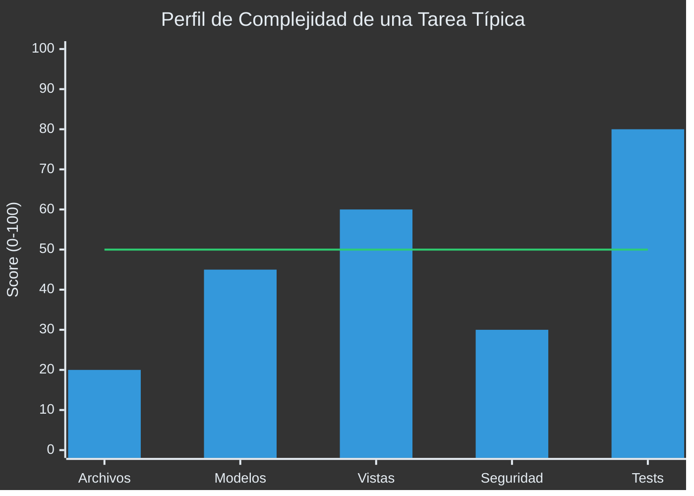
```mermaid
%%{init: {'theme': 'dark', 'themeVariables': { 'primaryColor': '#0d1117', 'primaryTextColor': '#e6edf3', 'primaryBorderColor': '#22d3ee', 'lineColor': '#a855f7', 'secondaryColor': '#1e293b', 'tertiaryColor': '#0f172a'}}}%%
xychart-beta
    title "Perfil de Complejidad de una Tarea Típica"
    x-axis ["Archivos", "Modelos", "Vistas", "Seguridad", "Tests"]
    y-axis "Score (0-100)" 0 --> 100
    bar [20, 45, 60, 30, 80]
    line [50, 50, 50, 50, 50]
```

| Dimensión | Peso | Bajo (0-25) | Medio (25-50) | Alto (50-75) | Crítico (75-100) |
|-----------|------|-------------|--------------|--------------|------------------|
| **Archivos** | 20% | 1 archivo | 2-3 archivos | 4-8 archivos | 9+ archivos |
| **Modelos** | 25% | Campo existente | Nuevo campo compute | Nuevo modelo simple | Nuevo modelo + herencia |
| **Vistas** | 20% | Vista existente | Xpath herencia | Vista form+tree+search | Reportes + kanban + portal |
| **Seguridad** | 15% | Sin cambios | ACL nuevos | Record rules + grupos | Multi-compañía + field-level |
| **Tests** | 20% | Sin tests | Unit test CRUD | HttpCase + scenarios | E2E Playwright + cobertura |

### Fórmula de Score

```
Score = (Archivos × 0.20) + (Modelos × 0.25) + (Vistas × 0.20) + (Seguridad × 0.15) + (Tests × 0.20)

Rangos:
  0-20  → 🟢 Simple (implementación directa)
 21-50  → 🟡 Moderado (/sdd-ff)
 51-80  → 🟠 Complejo (sdd-new)
 81-100 → 🔴 Épico (múltiples sdd-new + ADR)
```

---

## 9.4 Diagrama de Scoring en Tiempo Real

Cuando un agente solicita la clasificación, el sistema evalúa en vivo usando CodeGraph para contar archivos y detectar patrones.


```mermaid
%%{init: {'theme': 'dark', 'themeVariables': { 'primaryColor': '#0d1117', 'primaryTextColor': '#e6edf3', 'primaryBorderColor': '#22d3ee', 'lineColor': '#a855f7', 'secondaryColor': '#1e293b', 'tertiaryColor': '#0f172a'}}}%%
flowchart LR
    QUERY["📋 Tarea a clasificar"] --> CG["CodeGraph: conteo<br/>de archivos y símbolos"]
    CG --> SCORE["Calculadora de Score"]

    SCORE --> THRESHOLD{"Umbral dinámico<br/>según proyecto?"}

    THRESHOLD -->|"Proyecto nuevo<br/>(< 30 módulos)"| LOW["Umbral: 60<br/>Menos tolerancia"]
    THRESHOLD -->|"Proyecto maduro<br/>(30-100 módulos)"| MEDIUM["Umbral: 75<br/>Tolerancia media"]
    THRESHOLD -->|"Proyecto enterprise<br/>(> 100 módulos)"| HIGH["Umbral: 85<br/>Alta tolerancia"]

    LOW --> DECIDE{"Score vs Umbral"}
    MEDIUM --> DECIDE
    HIGH --> DECIDE

    DECIDE -->|"Score < Umbral"| DOWNGRADE["⬇️ Degradar nivel<br/>para pipeline más ágil"]
    DECIDE -->|"Score ≥ Umbral"| MAINTAIN["✅ Mantener nivel"]
    DECIDE -->|"Score >> Umbral<br/>(+20 puntos)"| UPGRADE["⬆️ Escalar nivel<br/>para más calidad"]

    style DOWNGRADE fill:#0f172a,stroke:#22d3ee,stroke-width:1px
    style MAINTAIN fill:#0f172a,stroke:#22d3ee,stroke-width:1px
    style UPGRADE fill:#0f172a,stroke:#22d3ee,stroke-width:1px
```

---

## 9.5 Matriz de Complejidad Cruzada

Las 5 dimensiones no son independientes. La matriz muestra cómo interactúan y qué combinaciones elevan el score drásticamente.

| Combina | Archivos | Modelos | Vistas | Seguridad | Tests | Score |
|---------|----------|---------|--------|-----------|-------|-------|
| Bug fix en vista existente | 5 | 0 | 10 | 0 | 0 | **3** 🟢 |
| Nuevo campo en modelo existente | 15 | 20 | 15 | 10 | 20 | **17** 🟢 |
| Nuevo modelo + vistas CRUD | 40 | 60 | 50 | 40 | 50 | **50** 🟡 |
| Nuevo módulo completo | 60 | 75 | 65 | 60 | 70 | **67** 🟠 |
| Módulo + herencia core + reporte + tests E2E | 80 | 85 | 80 | 75 | 90 | **83** 🔴 |
| Arquitectura multi-módulo + ADR | 95 | 95 | 90 | 90 | 95 | **93** 🔴 |

### Puntos de Inflexión

Ciertas combinaciones elevan el score desproporcionadamente:

| Combinación Peligrosa | Multiplicador | Por qué |
|----------------------|:------------:|---------|
| `Modelo nuevo + Seguridad alta` | ×1.3 | Record rules para modelo nuevo requieren diseño cuidadoso |
| `Herencia core + Tests E2E` | ×1.4 | Testear herencia core implica fixtures complejos |
| `Reporte QWeb + Traducciones` | ×1.2 | Reportes bilingües son el doble de trabajo |
| `Portal + Multi-compañía` | ×1.5 | Portal + record rules por compañía es combinatorio |

---

## 9.6 Decisión Final: El Mapa de Complejidad

Este diagrama consolida todo el proceso de clasificación en una vista unificada.


```mermaid
%%{init: {'theme': 'dark', 'themeVariables': { 'primaryColor': '#0d1117', 'primaryTextColor': '#e6edf3', 'primaryBorderColor': '#22d3ee', 'lineColor': '#a855f7', 'secondaryColor': '#1e293b', 'tertiaryColor': '#0f172a'}}}%%
flowchart TD
    subgraph INPUT["📥 Entrada"]
        REQ["Solicitud del<br/>desarrollador"] --> PARSER["Parser de lenguaje<br/>natural + contexto"]
        PARSER --> EXTRACTOR["Extractor de<br/>dimensiones"]
    end

    subgraph SCORING["📊 Scoring"]
        EXTRACTOR --> DIM1["Archivos: conteo<br/>CodeGraph"]
        EXTRACTOR --> DIM2["Modelos: detección<br/>de _inherit / nuevo"]
        EXTRACTOR --> DIM3["Vistas: xpath vs<br/>nuevo form/tree"]
        EXTRACTOR --> DIM4["Seguridad: grupos<br/>ACL/record rules"]
        EXTRACTOR --> DIM5["Tests: cobertura<br/>existente"]
        
        DIM1 --> CALC["Calculadora<br/>ponderada"]
        DIM2 --> CALC
        DIM3 --> CALC
        DIM4 --> CALC
        DIM5 --> CALC
        
        CALC --> ADJUST["Ajuste por<br/>multiplicadores"]
    end

    subgraph DECISION["🎯 Decisión"]
        ADJUST --> THRESHOLD{"Comparar con<br/>umbral del proyecto"}
        THRESHOLD -->|"≤20"| S["🟢 Simple"]
        THRESHOLD -->|"21-50"| M["🟡 Moderado"]
        THRESHOLD -->|"51-80"| C["🟠 Complejo"]
        THRESHOLD -->|"81+"| E["🔴 Épico"]
    end

    subgraph OUTPUT["🚀 Pipeline"]
        S --> DIR["Implementación directa<br/>+ Engram save"]
        M --> FF["sdd-ff: propose → spec<br/>→ design → tasks → apply"]
        C --> NEW["sdd-new: explore → propose<br/>→ spec → design → tasks<br/>→ apply → verify → archive"]
        E --> EPIC_EXEC["Múltiples sdd-new<br/>coordinados + ADRs"]
    end

    style INPUT fill:#1e293b,stroke:#22d3ee,stroke-width:1px
    style SCORING fill:#1e293b,stroke:#a855f7,stroke-width:1px
    style DECISION fill:#1e293b,stroke:#f59e0b,stroke-width:1px
    style OUTPUT fill:#1e293b,stroke:#10b981,stroke-width:1px
```

---

# SECCIÓN 10 — Coreografía Temporal 🔥

> **¿Quién habla con quién y en qué orden?** iris es un sistema de mensajería coreografiada. Cada agente, cada herramienta, cada skill se comunica en secuencias precisas. Esta sección despliega los diagramas de secuencia que revelan el flujo temporal de cada operación.

---

## 10.1 Flujo de Delegación Completo

Desde que el desarrollador envía una solicitud hasta que recibe el resultado completo con enseñanza.

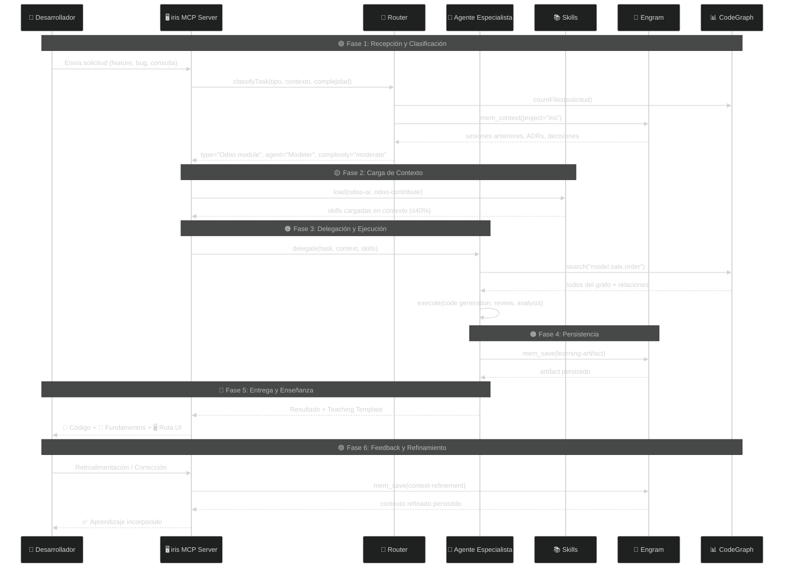
```mermaid
%%{init: {'theme': 'dark', 'themeVariables': { 'primaryColor': '#0d1117', 'primaryTextColor': '#e6edf3', 'primaryBorderColor': '#22d3ee', 'lineColor': '#a855f7', 'secondaryColor': '#1e293b', 'tertiaryColor': '#0f172a'}}}%%
sequenceDiagram
    participant DEV as 👤 Desarrollador
    participant IRIS as 🖥️ iris MCP Server
    participant ROUTER as 🧭 Router
    participant AGENT as 🤖 Agente Especialista
    participant SKILL as 📚 Skills
    participant ENGRAM as 🧠 Engram
    participant CODEGRAPH as 📊 CodeGraph

    Note over DEV,CODEGRAPH: 🟢 Fase 1: Recepción y Clasificación
    DEV->>IRIS: Envía solicitud (feature, bug, consulta)
    IRIS->>ROUTER: classifyTask(tipo, contexto, complejidad)
    ROUTER->>CODEGRAPH: countFiles(solicitud)
    ROUTER->>ENGRAM: mem_context(project="iris")
    ENGRAM-->>ROUTER: sesiones anteriores, ADRs, decisiones
    ROUTER-->>IRIS: type="Odoo module", agent="Modeler", complexity="moderate"

    Note over IRIS,SKILL: 🟡 Fase 2: Carga de Contexto
    IRIS->>SKILL: load(odoo-ai, odoo-contribute)
    SKILL-->>IRIS: skills cargadas en contexto (≤40%)

    Note over IRIS,AGENT: 🟠 Fase 3: Delegación y Ejecución
    IRIS->>AGENT: delegate(task, context, skills)
    AGENT->>CODEGRAPH: search("model.sale.order")
    CODEGRAPH-->>AGENT: nodos del grafo + relaciones
    AGENT->>AGENT: execute(code generation, review, analysis)

    Note over AGENT,ENGRAM: 🟤 Fase 4: Persistencia
    AGENT->>ENGRAM: mem_save(learning-artifact)
    ENGRAM-->>AGENT: artifact persistido

    Note over AGENT,DEV: 🔵 Fase 5: Entrega y Enseñanza
    AGENT-->>IRIS: Resultado + Teaching Template
    IRIS-->>DEV: 🐍 Código + 📖 Fundamentos + 🖥️ Ruta UI

    Note over DEV,CODEGRAPH: 🟣 Fase 6: Feedback y Refinamiento
    DEV->>IRIS: Retroalimentación / Corrección
    IRIS->>ENGRAM: mem_save(context-refinement)
    ENGRAM-->>IRIS: contexto refinado persistido
    IRIS-->>DEV: ✅ Aprendizaje incorporado
```

### Tiempos Típicos por Fase

| Fase | Duración | Quién | Dónde se gasta el tiempo |
|------|----------|-------|--------------------------|
| Recepción y clasificación | 1-3s | Router | CodeGraph search + Engram context |
| Carga de contexto | 2-5s | iris MCP | Lectura de skills del sistema |
| Delegación y ejecución | 10-120s | Agente especialista | Generación de código/ análisis |
| Persistencia | 1-2s | Engram | Embedding + conflict detection |
| Entrega y enseñanza | 2-10s | Agente → iris | Formateo de Teaching Template |
| Feedback | 5-30s | Desarrollador | Revisión humana + correcciones |

---

## 10.2 Handoff Entre Agentes

Cuando una tarea cruza de fase SDD, el agente saliente hace un handoff explícito al entrante. Este es el momento más crítico del pipeline.

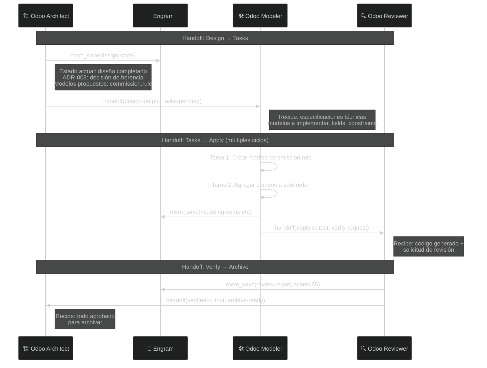
```mermaid
%%{init: {'theme': 'dark', 'themeVariables': { 'primaryColor': '#0d1117', 'primaryTextColor': '#e6edf3', 'primaryBorderColor': '#22d3ee', 'lineColor': '#a855f7', 'secondaryColor': '#1e293b', 'tertiaryColor': '#0f172a'}}}%%
sequenceDiagram
    participant ARCH as 🏗️ Odoo Architect
    participant ENGRAM as 🧠 Engram
    participant MODEL as 🛠️ Odoo Modeler
    participant REVIEW as 🔍 Odoo Reviewer

    Note over ARCH,REVIEW: Handoff: Design → Tasks
    ARCH->>ENGRAM: mem_save(design-state)
    Note right of ARCH: Estado actual: diseño completado<br/>ADR-008: decisión de herencia<br/>Modelos propuestos: commission.rule
    ARCH->>MODEL: handoff(design-output, tasks-pending)
    Note right of MODEL: Recibe: especificaciones técnicas<br/>modelos a implementar, fields, constraints

    Note over ARCH,REVIEW: Handoff: Tasks → Apply (múltiples ciclos)
    MODEL->>MODEL: Tarea 1: Crear modelo commission.rule
    MODEL->>MODEL: Tarea 2: Agregar campos a sale.order
    MODEL->>ENGRAM: mem_save(modeling-complete)
    MODEL->>REVIEW: handoff(apply-output, verify-request)
    Note right of REVIEW: Recibe: código generado +<br/>solicitud de revisión

    Note over ARCH,REVIEW: Handoff: Verify → Archive
    REVIEW->>ENGRAM: mem_save(review-report, score=85)
    REVIEW->>ARCH: handoff(verified-output, archive-ready)
    Note right of ARCH: Recibe: todo aprobado<br/>para archivar
```

### Reglas de Handoff

| Regla | Descripción | Consecuencia si se viola |
|-------|-------------|--------------------------|
| **Estado completo** | El agente saliente guarda todo el estado en Engram | El agente entrante empieza desde cero |
| **Output validado** | El entregable pasa quality gates antes del handoff | El revisor rechaza y rebota al remitente |
| **Contexto mínimo** | Solo pasa lo necesario, no todo el historial | Saturación de contexto del agente entrante |
| **Trazabilidad** | Cada handoff registra qué se pasó y por qué | Imposible auditar decisiones posteriores |

---

## 10.3 Ciclo de Vida de una Skill

Las skills no están siempre cargadas. Se cargan bajo demanda y se descargan cuando ya no son necesarias.

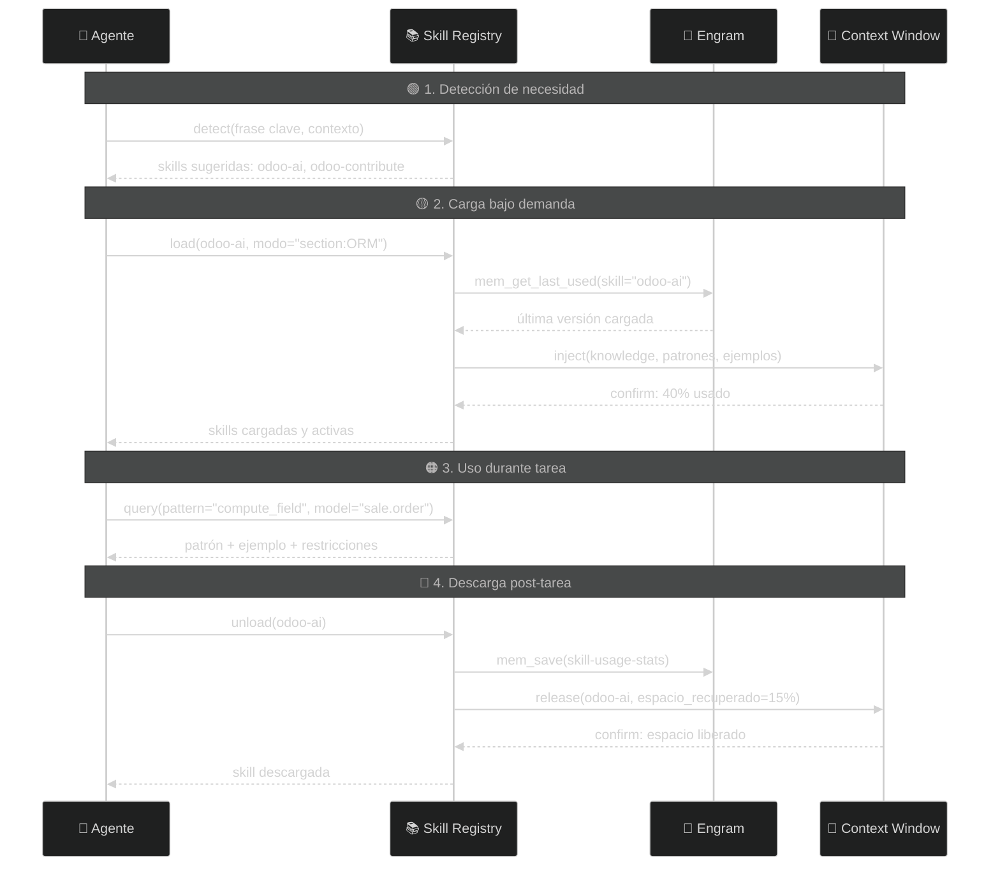
```mermaid
%%{init: {'theme': 'dark', 'themeVariables': { 'primaryColor': '#0d1117', 'primaryTextColor': '#e6edf3', 'primaryBorderColor': '#22d3ee', 'lineColor': '#a855f7', 'secondaryColor': '#1e293b', 'tertiaryColor': '#0f172a'}}}%%
sequenceDiagram
    participant AGENT as 🤖 Agente
    participant SKILL as 📚 Skill Registry
    participant ENGRAM as 🧠 Engram
    participant CONTEXT as 📐 Context Window

    Note over AGENT,CONTEXT: 🟢 1. Detección de necesidad
    AGENT->>SKILL: detect(frase clave, contexto)
    SKILL-->>AGENT: skills sugeridas: odoo-ai, odoo-contribute

    Note over AGENT,CONTEXT: 🟡 2. Carga bajo demanda
    AGENT->>SKILL: load(odoo-ai, modo="section:ORM")
    SKILL->>ENGRAM: mem_get_last_used(skill="odoo-ai")
    ENGRAM-->>SKILL: última versión cargada
    SKILL->>CONTEXT: inject(knowledge, patrones, ejemplos)
    CONTEXT-->>SKILL: confirm: 40% usado
    SKILL-->>AGENT: skills cargadas y activas

    Note over AGENT,CONTEXT: 🟠 3. Uso durante tarea
    AGENT->>SKILL: query(pattern="compute_field", model="sale.order")
    SKILL-->>AGENT: patrón + ejemplo + restricciones

    Note over AGENT,CONTEXT: 🔴 4. Descarga post-tarea
    AGENT->>SKILL: unload(odoo-ai)
    SKILL->>ENGRAM: mem_save(skill-usage-stats)
    SKILL->>CONTEXT: release(odoo-ai, espacio_recuperado=15%)
    CONTEXT-->>SKILL: confirm: espacio liberado
    SKILL-->>AGENT: skill descargada
```

### Métricas de Skills

| Métrica | Valor Típico | Notas |
|---------|:-----------:|-------|
| Tiempo de carga | 1-3s | Depende del tamaño del skill |
| Consumo de contexto | 5-40% | Límite duro: 40% máximo |
| Skills cargadas simultáneas | 2-4 | Norma: 3 skills concurrentes |
| Tasa de acierto en detección | 85% | 15% restante: carga manual |
| Skills totales en registry | 50+ | Odoo-ai, odoo-contribute, odoo-test, etc. |

---

## 10.4 Flujo de Error con Recuperación

No todo sale bien. iris tiene mecanismos de detección de fallos, reintentos y degradación graceful.

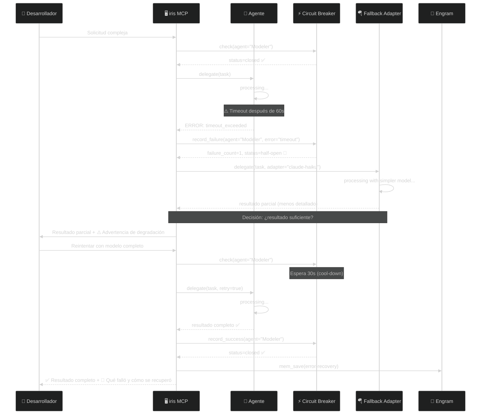
```mermaid
%%{init: {'theme': 'dark', 'themeVariables': { 'primaryColor': '#0d1117', 'primaryTextColor': '#e6edf3', 'primaryBorderColor': '#22d3ee', 'lineColor': '#a855f7', 'secondaryColor': '#1e293b', 'tertiaryColor': '#0f172a'}}}%%
sequenceDiagram
    participant DEV as 👤 Desarrollador
    participant IRIS as 🖥️ iris MCP
    participant AGENT as 🤖 Agente
    participant CB as ⚡ Circuit Breaker
    participant FALLBACK as 🪂 Fallback Adapter
    participant ENGRAM as 🧠 Engram

    DEV->>IRIS: Solicitud compleja
    IRIS->>CB: check(agent="Modeler")
    CB-->>IRIS: status=closed ✅

    IRIS->>AGENT: delegate(task)
    AGENT->>AGENT: processing...
    Note over AGENT: ⚠️ Timeout después de 60s

    AGENT-->>IRIS: ERROR: timeout_exceeded
    IRIS->>CB: record_failure(agent="Modeler", error="timeout")
    CB-->>IRIS: failure_count=1, status=half-open 🔶

    IRIS->>FALLBACK: delegate(task, adapter="claude-haiku")
    FALLBACK->>FALLBACK: processing with simpler model...
    FALLBACK-->>IRIS: resultado parcial (menos detallado)

    Note over IRIS,FALLBACK: Decisión: ¿resultado suficiente?
    IRIS->>DEV: Resultado parcial + ⚠️ Advertencia de degradación
    DEV->>IRIS: Reintentar con modelo completo

    IRIS->>CB: check(agent="Modeler")
    Note over CB: Espera 30s (cool-down)

    IRIS->>AGENT: delegate(task, retry=true)
    AGENT->>AGENT: processing...
    AGENT-->>IRIS: resultado completo ✅

    IRIS->>CB: record_success(agent="Modeler")
    CB-->>IRIS: status=closed ✅

    IRIS->>ENGRAM: mem_save(error-recovery)
    IRIS-->>DEV: ✅ Resultado completo + 📖 Qué falló y cómo se recuperó
```

### Estrategias de Recuperación

| Falla | Estrategia | Tiempo de recuperación | Degradación |
|-------|-----------|:----------------------:|-------------|
| Timeout del agente | Reintentar con fallback adapter | 30-60s | Usar modelo más simple |
| Error de skill | Recargar skill de registry | 5-10s | Sin skill: operación limitada |
| Engram unavailable | Operar sin memoria (cache local) | 0s | Sin persistencia entre sesiones |
| CodeGraph caído | Usar grep/glob como fallback | 2-5s | Búsqueda menos precisa |
| Circuit breaker open | Esperar cool-down + reintentar | 30-120s | Full degradation hasta recuperación |

---

## 10.5 El Flujo de Verificación (Verify)

La fase más importante del pipeline SDD. Verifica que lo implementado cumple lo especificado.

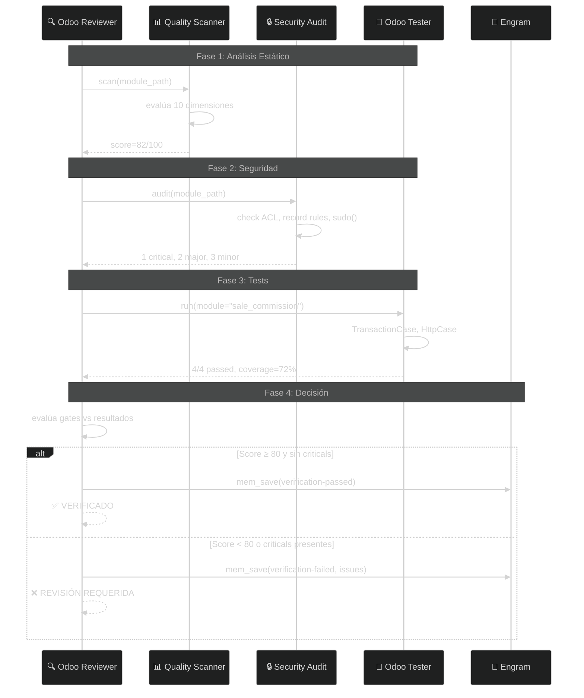
```mermaid
%%{init: {'theme': 'dark', 'themeVariables': { 'primaryColor': '#0d1117', 'primaryTextColor': '#e6edf3', 'primaryBorderColor': '#22d3ee', 'lineColor': '#a855f7', 'secondaryColor': '#1e293b', 'tertiaryColor': '#0f172a'}}}%%
sequenceDiagram
    participant REVIEW as 🔍 Odoo Reviewer
    participant SCORE as 📊 Quality Scanner
    participant SECURITY as 🔒 Security Audit
    participant TEST as 🧪 Odoo Tester
    participant ENGRAM as 🧠 Engram

    Note over REVIEW,TEST: Fase 1: Análisis Estático
    REVIEW->>SCORE: scan(module_path)
    SCORE->>SCORE: evalúa 10 dimensiones
    SCORE-->>REVIEW: score=82/100

    Note over REVIEW,TEST: Fase 2: Seguridad
    REVIEW->>SECURITY: audit(module_path)
    SECURITY->>SECURITY: check ACL, record rules, sudo()
    SECURITY-->>REVIEW: 1 critical, 2 major, 3 minor

    Note over REVIEW,TEST: Fase 3: Tests
    REVIEW->>TEST: run(module="sale_commission")
    TEST->>TEST: TransactionCase, HttpCase
    TEST-->>REVIEW: 4/4 passed, coverage=72%

    Note over REVIEW,ENGRAM: Fase 4: Decisión
    REVIEW->>REVIEW: evalúa gates vs resultados
    alt Score ≥ 80 y sin criticals
        REVIEW->>ENGRAM: mem_save(verification-passed)
        REVIEW-->>REVIEW: ✅ VERIFICADO
    else Score < 80 o criticals presentes
        REVIEW->>ENGRAM: mem_save(verification-failed, issues)
        REVIEW-->>REVIEW: ❌ REVISIÓN REQUERIDA
    end
```

---

# SECCIÓN 11 — Máquinas de Estado 🔥

> **¿En qué estado está cada componente?** iris no es un sistema binario (funciona/no funciona). Cada subsistema tiene una máquina de estados que define cómo responde ante fallos, carga, y recuperación. Esta sección revela las state machines que controlan el comportamiento dinámico del sistema.

---

## 11.1 Circuit Breaker — La Máquina de Estados del Adaptador

Cada adaptador AI tiene un Circuit Breaker con 3 estados. Es el mecanismo más crítico de Reliability Engineering.

```mermaid
%%{init: {'theme': 'dark', 'themeVariables': { 'primaryColor': '#0d1117', 'primaryTextColor': '#e6edf3', 'primaryBorderColor': '#22d3ee', 'lineColor': '#a855f7', 'secondaryColor': '#1e293b', 'tertiaryColor': '#0f172a'}}}%%
stateDiagram-v2
    [*] --> CLOSED: Inicio / Reset
    
    CLOSED --> OPEN: failure_count ≥ threshold<br/>(ej: 3 fallos en 60s)
    CLOSED --> CLOSED: success → reset counter
    
    OPEN --> HALF_OPEN: cool_down expired<br/>(ej: 30s de espera)
    OPEN --> OPEN: cool_down no expirado
    
    HALF_OPEN --> CLOSED: success → recuperación<br/>reset completo
    HALF_OPEN --> OPEN: failure → umbral alcanzado
    
    note right of CLOSED
        ✅ Funcionamiento normal
        Todas las requests pasan
        Contador de fallos: 0/N
    end note
    
    note right of OPEN
        🔴 Aislado
        Requests rechazadas inmediatamente
        Fallback adapter activado
        Temporizador: cool-down
    end note
    
    note right of HALF_OPEN
        🟡 Prueba
        Deja pasar 1 request
        Decide: recuperación o fallo permanente
    end note
```

### Transiciones y Parámetros

| Transición | Gatillo | Acción |
|------------|---------|--------|
| `CLOSED → OPEN` | `failure_count ≥ threshold` (default: 3) | Aísla el adaptador, activa fallback |
| `OPEN → HALF_OPEN` | `cool_down_expired` (default: 30s) | Prepara prueba de recuperación |
| `HALF_OPEN → CLOSED` | `probe_success` | Reestablece tráfico normal |
| `HALF_OPEN → OPEN` | `probe_failure` | Extiende aislamiento |

### Política de Reintentos por Tipo de Error

| Error | Reintentar | Backoff | Circuit Breaker |
|-------|:----------:|:-------:|:---------------:|
| Timeout | ✅ Sí | Exponencial (1s, 2s, 4s) | Sí, cuenta como fallo |
| Rate limit | ✅ Sí | Lineal (5s, 10s) | No — no es fallo del adaptador |
| Bad request | ❌ No | — | No, error del prompt |
| Server error | ✅ Sí | Exponencial (1s, 2s, 4s) | Sí, cuenta como fallo |
| Auth error | ❌ No | — | Sí, error de configuración |

---

## 11.2 Máquina de Estados del Pipeline SDD

Cada fase SDD es un estado en una máquina más grande. Las transiciones están guardadas por las quality gates.

```mermaid
%%{init: {'theme': 'dark', 'themeVariables': { 'primaryColor': '#0d1117', 'primaryTextColor': '#e6edf3', 'primaryBorderColor': '#22d3ee', 'lineColor': '#a855f7', 'secondaryColor': '#1e293b', 'tertiaryColor': '#0f172a'}}}%%
stateDiagram-v2
    [*] --> EXPLORE: Nueva solicitud
    
    EXPLORE --> PROPOSE: Investigación completa
    EXPLORE --> [*]: No viable / Cancelado
    
    PROPOSE --> SPEC: Propuesta aprobada
    PROPOSE --> DESIGN: Propuesta aprobada
    
    SPEC --> TASKS: Especificación completa
    DESIGN --> TASKS: Diseño completo
    
    TASKS --> APPLY_REVIEW: Desglose completo
    
    APPLY_REVIEW --> APPLY: Implementar tarea 1
    APPLY_REVIEW --> APPLY: Implementar tarea 2
    APPLY_REVIEW --> APPLY: Implementar tarea N
    
    APPLY --> VERIFY: Código listo
    APPLY --> APPLY_REVIEW: Faltan tareas
    
    VERIFY --> VERIFY_REVIEW: Quality gates calculados
    
    VERIFY_REVIEW --> ARCHIVE: Score ≥ 80 y sin criticals
    VERIFY_REVIEW --> APPLY: Score < 80 o criticals (re-aplicar fix)
    VERIFY_REVIEW --> PROPOSE: Cambio de alcance detectado
    VERIFY_REVIEW --> [*]: Cancelado por quality fail
    
    ARCHIVE --> [*]: Cierre completado

    note right of VERIFY_REVIEW
        ⚖️ Punto de decisión crítico
        3 caminos posibles:
        → Archive (aprobado)
        → Apply (reintentar)
        → Propose (replanificar)
    end note
```

### Estados de Decisión (Puntos de Control)

| Estado | Decisión | Siguiente | Condición |
|--------|----------|-----------|-----------|
| **EXPLORE** | ¿Es viable? | PROPOSE o [*] | CodeGraph confirma factibilidad |
| **PROPOSE** | ¿Aprobado? | SPEC + DESIGN | Propuesta aceptada por el usuario |
| **TASKS** | ¿Completo? | APPLY_REVIEW | Checklist de tareas generado |
| **APPLY_REVIEW** | ¿Quedan tareas? | APPLY o VERIFY | FIFO queue de tareas |
| **VERIFY_REVIEW** | ¿Aprueba gates? | ARCHIVE / APPLY / PROPOSE | Score ≥ 80 y sin criticals |

---

## 11.3 Ciclo de Vida de un Agente

Cada agente especialista pasa por 6 estados durante su ciclo de vida en una sesión.

```mermaid
%%{init: {'theme': 'dark', 'themeVariables': { 'primaryColor': '#0d1117', 'primaryTextColor': '#e6edf3', 'primaryBorderColor': '#22d3ee', 'lineColor': '#a855f7', 'secondaryColor': '#1e293b', 'tertiaryColor': '#0f172a'}}}%%
stateDiagram-v2
    [*] --> INACTIVE: Sistema inicia
    
    INACTIVE --> LOADING: Router clasifica tarea → agente necesario
    INACTIVE --> INACTIVE: Tarea no requiere este agente
    
    LOADING --> ACTIVE: Skills cargadas y contexto preparado
    LOADING --> FAILED: Error al cargar skills
    
    ACTIVE --> PROCESSING: Tarea recibida
    
    PROCESSING --> ACTIVE: Tarea completada (resultado entregado)
    PROCESSING --> FAILED: Error irrecuperable
    
    ACTIVE --> UNLOADING: Agente ya no necesario / handoff completo
    
    UNLOADING --> INACTIVE: Memoria persistida, recursos liberados
    
    FAILED --> INACTIVE: Error registrado en Engram, limpieza
    FAILED --> LOADING: Reintento permitido (retry < max)

    note right of ACTIVE
        🤖 Estado operativo
        Puede recibir múltiples tareas
        Skills cargadas en contexto
    end note
    
    note right of FAILED
        ❌ Estado de error
        Error registrado en Engram
        Si retry ≥ max: permanece FAILED
    end note
```

### Tiempos Típicos del Ciclo de Vida

| Estado | Duración | Evento de Salida |
|--------|:--------:|------------------|
| INACTIVE | Indefinido | Clasificación de tarea |
| LOADING | 2-5s | Skills cargadas OK |
| ACTIVE | 5-120s | Nueva tarea recibida |
| PROCESSING | 10-120s | Resultado entregado |
| UNLOADING | 1-3s | Memoria persistida |
| FAILED | Variable | Retry o cleanup |

---

## 11.4 Máquina de Estados de Engram (Memoria)

Engram tiene su propia state machine. Cada observación pasa por un ciclo de vida desde que se crea hasta que se consolida o archiva.

```mermaid
%%{init: {'theme': 'dark', 'themeVariables': { 'primaryColor': '#0d1117', 'primaryTextColor': '#e6edf3', 'primaryBorderColor': '#22d3ee', 'lineColor': '#a855f7', 'secondaryColor': '#1e293b', 'tertiaryColor': '#0f172a'}}}%%
stateDiagram-v2
    [*] --> DRAFT: Primer save (topic_key nuevo)
    [*] --> PENDING_REVIEW: Primer save con posible conflicto
    
    DRAFT --> ACTIVE: Confirmación / upsert
    DRAFT --> DELETED: Usuario cancela
    
    PENDING_REVIEW --> JUDGED: Agente resuelve conflicto
    PENDING_REVIEW --> ACTIVE: Conflicto = not_conflict
    
    JUDGED --> ACTIVE: Relación compatible/scoped/related
    JUDGED --> SUPERSEDED: Relación = supersedes
    JUDGED --> DELETED: Relación = conflicts_with<br/>y se elimina la anterior
    
    ACTIVE --> SUPERSEDED: Nueva observación mejor
    ACTIVE --> ARCHIVED: Consolidación manual
    
    SUPERSEDED --> ARCHIVED: Observación antigua reemplazada
    
    ARCHIVED --> [*]: Limpieza / fin de vida
    DELETED --> [*]: Eliminación permanente

    note right of PENDING_REVIEW
        ⚠️ Conflicto semántico detectado
        Dos observaciones describen lo mismo
        de forma diferente
        → Espera juicio del agente
    end note
```

### Tipos de Relación en el Juicio Semántico

| Relación | Significado | Acción |
|----------|-------------|--------|
| `related` | Relacionado pero no igual | Ambas activas |
| `compatible` | Compatibles, mismo tema | Ambas activas |
| `scoped` | Una es caso específico de la otra | Ambas activas (scope jerárquico) |
| `supersedes` | Una reemplaza a la otra | La anterior → SUPERSEDED |
| `conflicts_with` | Contradicción directa | Requiere decisión humana |
| `not_conflict` | Falsa alarma de conflicto | Ambas activas |

---

## 11.5 State Machine del Budget Tracker

Cada adaptador AI tiene un presupuesto diario. La state machine controla el gasto y la activación de alertas.

```mermaid
%%{init: {'theme': 'dark', 'themeVariables': { 'primaryColor': '#0d1117', 'primaryTextColor': '#e6edf3', 'primaryBorderColor': '#22d3ee', 'lineColor': '#a855f7', 'secondaryColor': '#1e293b', 'tertiaryColor': '#0f172a'}}}%%
stateDiagram-v2
    [*] --> NORMAL: Inicio del día / Reset diario
    
    NORMAL --> WARNING: Gasto ≥ 70% del budget diario
    NORMAL --> NORMAL: Gasto < 70%
    
    WARNING --> CRITICAL: Gasto ≥ 90% del budget diario
    WARNING --> NORMAL: Nuevo día / Reset
    WARNING --> WARNING: Gasto entre 70% y 90%
    
    CRITICAL --> EXHAUSTED: Gasto = 100% (budget agotado)
    CRITICAL --> NORMAL: Nuevo día / Reset
    CRITICAL --> CRITICAL: Gasto entre 90% y 99%
    
    EXHAUSTED --> EXHAUSTED: Rechazar requests (excepto críticas)
    EXHAUSTED --> NORMAL: Nuevo día / Reset
    EXHAUSTED --> WARNING: Reset manual por admin

    note right of NORMAL
        🟢 Gasto normal
        Todas las requests permitidas
        Sin restricciones
    end note
    
    note right of WARNING
        🟡 Alerta temprana
        Requests siguen permitidas
        Log de advertencia generado
        Sugerir adaptador alternativo
    end note
    
    note right of CRITICAL
        🟠 Alerta crítica
        Requests siguen permitidas
        Notificación al usuario
        Solo adaptadores esenciales
    end note
    
    note right of EXHAUSTED
        🔴 Budget agotado
        Requests bloqueadas
        Excepción: health checks
        Usar fallback gratis
    end note
```

---

## 11.6 Máquina de Estados Compuesta: Sesión de Desarrollo Completa

Esta es la super-state-machine que orquesta todo el ciclo de vida de una sesión de desarrollo, desde que el desarrollador inicia hasta que cierra.

```mermaid
%%{init: {'theme': 'dark', 'themeVariables': { 'primaryColor': '#0d1117', 'primaryTextColor': '#e6edf3', 'primaryBorderColor': '#22d3ee', 'lineColor': '#a855f7', 'secondaryColor': '#1e293b', 'tertiaryColor': '#0f172a'}}}%%
stateDiagram-v2
    state "🧑‍💻 SESIÓN DE DESARROLLO" as SESSION {
        [*] --> SESSION_START: iris init / user connect
        
        SESSION_START --> CONTEXT_LOAD: Branch safety check OK
        SESSION_START --> BLOCKED: Branch safety check fail
        
        CONTEXT_LOAD --> READY: Engram context + CodeGraph loaded
        CONTEXT_LOAD --> DEGRADED: Engram / CodeGraph unavailable
        
        READY --> TASK_RECEIVED: User request
        DEGRADED --> TASK_RECEIVED: User request (limited context)
        
        TASK_RECEIVED --> CLASSIFYING: Clasificación de complejidad
        
        CLASSIFYING --> SDD_PIPELINE: Moderado / Complejo
        CLASSIFYING --> DIRECT_EXEC: Simple / Consulta
        
        SDD_PIPELINE --> AGENT_EXEC: Una o más fases ejecutadas
        DIRECT_EXEC --> AGENT_EXEC: Implementación directa
        
        AGENT_EXEC --> VERIFYING: Código generado
        AGENT_EXEC --> ERROR: Fallo en ejecución
        
        VERIFYING --> COMPLETED: Quality gates pasan
        VERIFYING --> AGENT_EXEC: Quality gates fallan (reintento)
        VERIFYING --> ERROR: Fallo irrecuperable
        
        COMPLETED --> SESSION_CLOSE: Usuario confirma / archiva
        ERROR --> SESSION_CLOSE: Usuario cancela / timeout
        
        BLOCKED --> SESSION_CLOSE: Usuario desiste
        
        SESSION_CLOSE --> [*]: Engram save + cleanup
    }
```

### Tabla de Estados de la Sesión

| Estado | Descripción | Posibles Siguientes | Tiempo Máximo |
|--------|-------------|---------------------|:-------------:|
| **SESSION_START** | Inicio de sesión | CONTEXT_LOAD, BLOCKED | 5s |
| **BLOCKED** | Rama no autorizada | SESSION_CLOSE | Indefinido |
| **CONTEXT_LOAD** | Carga de contexto | READY, DEGRADED | 10s |
| **READY** | Listo para trabajar | TASK_RECEIVED | Indefinido |
| **DEGRADED** | Modo con limitaciones | TASK_RECEIVED | Indefinido |
| **TASK_RECEIVED** | Solicitud recibida | CLASSIFYING | 2s |
| **CLASSIFYING** | Clasificando complejidad | SDD_PIPELINE, DIRECT_EXEC | 5s |
| **SDD_PIPELINE** | Pipeline SDD activo | AGENT_EXEC | 5-30 min |
| **DIRECT_EXEC** | Ejecución directa | AGENT_EXEC | 1-5 min |
| **AGENT_EXEC** | Agente trabajando | VERIFYING, ERROR | 2 min |
| **VERIFYING** | Verificando calidad | COMPLETED, AGENT_EXEC, ERROR | 30s |
| **COMPLETED** | Tarea completada | SESSION_CLOSE | Indefinido |
| **ERROR** | Error detectado | SESSION_CLOSE | 60s |
| **SESSION_CLOSE** | Cerrando sesión | [*] | 5s |

---

# SECCIÓN 12 — El Modelo de Clases 🔥

> **¿Cómo se estructura el código de iris?** Detrás de cada agente, cada skill, cada herramienta, hay interfaces y clases que definen el contrato. Esta sección revela el modelo UML completo: las interfaces que conectan adaptadores, el sistema de memoria Engram, y los scanners de calidad.

---

## 12.1 Diagrama de Clases: Adaptadores AI

El corazón de Delegate Engineering. Cada adaptador implementa la interfaz `AIAdapter` con un contrato estricto.

```mermaid
%%{init: {'theme': 'dark', 'themeVariables': { 'primaryColor': '#0d1117', 'primaryTextColor': '#e6edf3', 'primaryBorderColor': '#22d3ee', 'lineColor': '#a855f7', 'secondaryColor': '#1e293b', 'tertiaryColor': '#0f172a'}}}%%
classDiagram
    class AIAdapter {
        <<interface>>
        +String name
        +String model
        +String provider
        +Budget budget
        +CircuitBreaker circuitBreaker
        +execute(prompt: String, context: Context) Result
        +getStatus() AdapterStatus
        +reset() void
    }

    class ClaudeAdapter {
        +String name = "claude"
        +String model = "claude-sonnet-4"
        +String provider = "Anthropic"
        +execute(prompt, context) Result
        +getStatus() AdapterStatus
        +reset() void
        -handleToolUse(response) void
        -formatSystemMessage(phase) String
    }

    class GeminiAdapter {
        +String name = "gemini"
        +String model = "gemini-2.5-pro"
        +String provider = "Google"
        +execute(prompt, context) Result
        +getStatus() AdapterStatus
        +reset() void
    }

    class OpenCodeAdapter {
        +String name = "opencode"
        +String model = "deepseek-v4"
        +String provider = "DeepSeek"
        +execute(prompt, context) Result
        +getStatus() AdapterStatus
        +reset() void
    }

    class FallbackAdapter {
        +String name = "fallback"
        +String model = "claude-haiku-3.5"
        +String provider = "Anthropic"
        +AIAdapter primary
        +int failureCount
        +execute(prompt, context) Result
        +getStatus() AdapterStatus
        -attemptFallback(primary, prompt, context) Result
    }

    AIAdapter <|-- ClaudeAdapter : implements
    AIAdapter <|-- GeminiAdapter : implements
    AIAdapter <|-- OpenCodeAdapter : implements
    AIAdapter <|-- FallbackAdapter : implements
    FallbackAdapter --> AIAdapter : wraps primary
```

### Contrato de la Interfaz AIAdapter

| Método | Input | Output | Excepciones |
|--------|-------|--------|-------------|
| `execute()` | prompt + context | Result (code + explanation) | TimeoutError, RateLimitError, AuthError |
| `getStatus()` | — | AdapterStatus (healthy/degraded/down) | — |
| `reset()` | — | void | Solo si circuit breaker open |

---

## 12.2 Diagrama de Clases: Systema de Memoria Engram

Engram no es una simple base de datos. Tiene un modelo de objetos completo con observaciones, juicios, sesiones y relaciones.

```mermaid
%%{init: {'theme': 'dark', 'themeVariables': { 'primaryColor': '#0d1117', 'primaryTextColor': '#e6edf3', 'primaryBorderColor': '#22d3ee', 'lineColor': '#a855f7', 'secondaryColor': '#1e293b', 'tertiaryColor': '#0f172a'}}}%%
classDiagram
    class Observation {
        +int id
        +String title
        +String content
        +String type
        +String topicKey
        +String scope
        +String project
        +DateTime createdAt
        +DateTime updatedAt
        +save() Observation
        +search(query, project) Observation[]
        +getContext(sessionId) ContextSummary
    }

    class Session {
        +String id
        +String project
        +String directory
        +DateTime startTime
        +DateTime endTime
        +String summary
        +Observation[] observations
        +start() void
        +end(summary) void
        +getContext() ContextSummary
    }

    class SemanticJudgment {
        +String id
        +int observationIdA
        +int observationIdB
        +String relation
        +float confidence
        +String reasoning
        +String model
        +String status
        +judge(relation, confidence) void
        +getVerdict() String
    }

    class TopicKey {
        +String key
        +String project
        +int latestObservationId
        +int version
        +upsert(content) Observation
        +getHistory() Observation[]
    }

    class ConflictDetector {
        +detect(newObs, existing) Conflict[]
        +findSimilar(text, threshold) Observation[]
        +resolve(judgment) void
    }

    Observation "1" --> "0..*" SemanticJudgment : involved in
    Session "1" --> "0..*" Observation : contains
    Observation "1" --> "0..1" TopicKey : belongs to
    ConflictDetector --> Observation : analyzes
    TopicKey --> Observation : latest version →
```

### Tipos de Observación

| Tipo | Propósito | Ejemplo |
|------|-----------|---------|
| `decision` | Decisión técnica documentada | "Usar stored compute para margen" |
| `architecture` | Decisión arquitectónica | ADR-008: "Patrón de herencia para comisiones" |
| `bugfix` | Bug encontrado y corregido | "N+1 en _compute_margin" |
| `pattern` | Patrón reusable descubierto | "Prefetching automático en Odoo 18" |
| `config` | Configuración del sistema | "Budget tracking habilitado para Claude" |
| `discovery` | Hallazgo técnico | "CodeGraph no indexa archivos .xml" |
| `learning` | Aprendizaje general | "Los xpath deben tener posición única" |
| `manual` | Observación manual genérica | (default) |

---

## 12.3 Diagrama de Clases: Quality Scanner

El sistema de calidad evalúa módulos completos en 10 dimensiones. Cada dimensión es un scanner independiente.

```mermaid
%%{init: {'theme': 'dark', 'themeVariables': { 'primaryColor': '#0d1117', 'primaryTextColor': '#e6edf3', 'primaryBorderColor': '#22d3ee', 'lineColor': '#a855f7', 'secondaryColor': '#1e293b', 'tertiaryColor': '#0f172a'}}}%%
classDiagram
    class QualityScanner {
        +String modulePath
        +ScoreResult[] results
        +float totalScore
        +scan(path) ScoreReport
        +getScoreByDimension(type) float
        +getCriticalIssues() Issue[]
    }

    class ScoreResult {
        +String dimension
        +float score
        +float weight
        +Issue[] issues
        +String verdict
        +getWeightedScore() float
    }

    class Issue {
        +String severity
        +String message
        +String file
        +int line
        +String suggestion
        +isCritical() boolean
    }

    class ScoreReport {
        +float totalScore
        +String verdict
        +ScoreResult[] dimensions
        +Issue[] allIssues
        +String summary
        +passed() boolean
    }

    class StructuralScanner {
        +scan(path) ScoreResult
        +checkDirectoryStructure(path) Issue[]
        +checkFileNaming(path) Issue[]
    }

    class ORMScanner {
        +scan(path) ScoreResult
        +checkModelDefinition(path) Issue[]
        +checkFieldTypes(path) Issue[]
        +checkComputeDepends(path) Issue[]
        +checkNPlusOne(path) Issue[]
    }

    class SecurityScanner {
        +scan(path) ScoreResult
        +checkACL(path) Issue[]
        +checkRecordRules(path) Issue[]
        +checkSudoUsage(path) Issue[]
        +checkSQLInjection(path) Issue[]
    }

    class ViewScanner {
        +scan(path) ScoreResult
        +checkXPathUniqueness(path) Issue[]
        +checkWidgetUsage(path) Issue[]
        +checkViewInheritance(path) Issue[]
    }

    class TestScanner {
        +scan(path) ScoreResult
        +checkTestCoverage(path) Issue[]
        +checkTestTypes(path) Issue[]
        +findMissingTests(path) Issue[]
    }

    QualityScanner "1" --> "1..*" ScoreResult : produces
    ScoreResult "1" --> "0..*" Issue : contains
    QualityScanner --> ScoreReport : generates
    
    QualityScanner --> StructuralScanner : uses
    QualityScanner --> ORMScanner : uses
    QualityScanner --> SecurityScanner : uses
    QualityScanner --> ViewScanner : uses
    QualityScanner --> TestScanner : uses
```

### Las 10 Dimensiones del Scanner

| # | Scanner | Peso | ¿Qué revisa? |
|---|---------|:----:|-------------|
| 1 | **Structural** | 10% | Directorios, naming, manifest completo |
| 2 | **Models & ORM** | 15% | Modelos, fields, compute, depends, constraints |
| 3 | **Views** | 15% | Vistas XML, xpath, widgets, assets |
| 4 | **Security** | 15% | ACL, record rules, sudo(), SQL injection |
| 5 | **Tests** | 15% | Cobertura, tipos de test, edge cases |
| 6 | **Performance** | 10% | N+1, índices, query count, prefetching |
| 7 | **Manifest** | 5% | __manifest__.py completo y correcto |
| 8 | **Naming OCA** | 5% | snake_case, nombres de modelos OCA |
| 9 | **i18n** | 5% | Traducciones, _() calls, .po files |
| 10 | **Documentation** | 5% | Docstrings, comments, README |

---

## 12.4 Diagrama de Clases: Tool Registry y Router

El sistema de herramientas MCP y el enrutamiento de tareas.

```mermaid
%%{init: {'theme': 'dark', 'themeVariables': { 'primaryColor': '#0d1117', 'primaryTextColor': '#e6edf3', 'primaryBorderColor': '#22d3ee', 'lineColor': '#a855f7', 'secondaryColor': '#1e293b', 'tertiaryColor': '#0f172a'}}}%%
classDiagram
    class Tool {
        <<abstract>>
        +String name
        +String description
        +Schema inputSchema
        +execute(params) Result
    }

    class ToolRegistry {
        +Tool[] tools
        +register(tool) void
        +get(name) Tool
        +list() Tool[]
        +execute(name, params) Result
    }

    class IrisDelegate {
        +String phase
        +String change
        +String[] contextIds
        +execute(params) Result
        -scoreTask(instruction) ComplexityScore
        -selectAdapter(score) AIAdapter
        -buildPrompt(phase, instruction) String
    }

    class Router {
        +classifyTask(text) TaskType
        +getComplexity(text) ComplexityLevel
        +selectAgent(type, complexity) Agent
        +loadSkills(agent) Skill[]
    }

    class ComplexityClassifier {
        +int fileCount
        +int modelCount
        +int viewCount
        +bool hasNewModel
        +bool hasSecurity
        +bool needsTests
        +calculate() ComplexityLevel
        +getDimensions() Dimension[]
    }

    Tool <|-- IrisDelegate : extends
    Tool <|-- CodeGraphSearch : extends
    Tool <|-- MemSave : extends
    Tool <|-- Status : extends
    
    ToolRegistry "1" --> "0..*" Tool : manages
    Router --> ComplexityClassifier : uses
    IrisDelegate --> Router : consults
```

---

## 12.5 Diagrama de Paquetes: Arquitectura General de iris

La vista de más alto nivel del código fuente.

```mermaid
%%{init: {'theme': 'dark', 'themeVariables': { 'primaryColor': '#0d1117', 'primaryTextColor': '#e6edf3', 'primaryBorderColor': '#22d3ee', 'lineColor': '#a855f7', 'secondaryColor': '#1e293b', 'tertiaryColor': '#0f172a'}}}%%
classDiagram
    package "src/" {
        class "index.ts" as Main {
            +start(): void
            -initMCPServer(): void
            -registerTools(): void
        }
        
        class "Server Core" as Server {
            +MCPTransport transport
            +ToolRegistry tools
            +Router router
            +handleRequest(request): Response
        }
        
        class "tools/" as Tools {
            +delegate.ts
            +status.ts
            +history.ts
            +config.ts
            +setup.ts
        }
        
        class "adapters/" as Adapters {
            +claude.ts
            +gemini.ts
            +opencode.ts
            +fallback.ts
            +base.ts
        }
        
        class "engram/" as Engram {
            +memory.ts
            +search.ts
            +judge.ts
            +session.ts
        }
        
        class "codegraph/" as CodeGraph {
            +search.ts
            +context.ts
            +trace.ts
            +explore.ts
        }
        
        class "quality/" as Quality {
            +scanner.ts
            +dimensions/
            +report.ts
        }
    }

    Main --> Server : creates
    Server --> Tools : registers
    Server --> Adapters : delegates to
    Server --> Engram : persists to
    Server --> CodeGraph : queries
    Quality --> Engram : saves reports
    Tools --> Adapters : uses
    Tools --> Engram : uses
    Tools --> CodeGraph : uses
```

---

# SECCIÓN 13 — Infraestructura y Seguridad 🔥

> **¿Dónde vive iris y cómo se protege?** iris no es una aplicación monolítica. Es un sistema distribuido que cruza múltiples zonas de seguridad: la máquina local del desarrollador, servidores Odoo.sh remotos, APIs de AI en la nube, y servicios de telemetría. Esta sección mapea cada zona, sus protocolos, y sus barreras de seguridad.

---

## 13.1 Diagrama de Infraestructura General

La vista de alto nivel de todas las zonas de red y cómo se conectan.

```mermaid
%%{init: {'theme': 'dark', 'themeVariables': { 'primaryColor': '#0d1117', 'primaryTextColor': '#e6edf3', 'primaryBorderColor': '#22d3ee', 'lineColor': '#a855f7', 'secondaryColor': '#1e293b', 'tertiaryColor': '#0f172a'}}}%%
architecture-beta
    group local_zone[Zona Local — Desarrollo]

    service iris_server[iris MCP] in local_zone
    service codegraph[CodeGraph] in local_zone
    service engram[Engram DB] in local_zone
    service local_fs[Sistema de Archivos] in local_zone

    group cloud_zone[Zona Cloud — AI Providers]

    service claude[Claude API] in cloud_zone
    service gemini[Gemini API] in cloud_zone
    service opencode[OpenCode API] in cloud_zone
    service openai[OpenAI API] in cloud_zone

    group odoo_zone[Zona Odoo — Cliente]

    service odoo_sh[Odoo.sh] in odoo_zone
    service postgresql[PostgreSQL] in odoo_zone
    service bridge[alesco_api_bridge] in odoo_zone

    group observability_zone[Zona Observabilidad]

    service otel[OpenTelemetry] in observability_zone
    service grafana[Grafana Cloud] in observability_zone

    junction junction_router at local_zone

    iris_server:L -- R: junction_router
    junction_router:T --> B: codegraph
    junction_router:T --> B: engram
    junction_router:T --> B: local_fs

    iris_server:R --> L: claude
    iris_server:R --> L: gemini
    iris_server:R --> L: opencode
    iris_server:R --> L: openai

    iris_server:B --> T: odoo_sh
    odoo_sh:R --> L: postgresql
    odoo_sh:T --> B: bridge

    iris_server:T --> B: otel
    otel:R --> L: grafana
```

### Zonas de Seguridad

| Zona | Componentes | Nivel de Confianza | Acceso |
|------|------------|:------------------:|--------|
| 🟢 **Local** | iris MCP, CodeGraph, Engram, FS | ✅ Confiable | Solo el desarrollador |
| 🟡 **Cloud AI** | Claude, Gemini, OpenCode, OpenAI | ⚠️ Semi-confiable | API keys + HTTPS |
| 🟠 **Odoo Cliente** | Odoo.sh, PostgreSQL, Bridge | ⚠️ Semi-confiable | SSH ed25519 + token |
| 🔵 **Observabilidad** | OTel, Grafana Cloud | ⚠️ Semi-confiable | API keys + HTTPS |

---

## 13.2 Diagrama de Conexiones Seguras

Cada conexión entre zonas usa un protocolo específico con autenticación y encriptación.

```mermaid
%%{init: {'theme': 'dark', 'themeVariables': { 'primaryColor': '#0d1117', 'primaryTextColor': '#e6edf3', 'primaryBorderColor': '#22d3ee', 'lineColor': '#a855f7', 'secondaryColor': '#1e293b', 'tertiaryColor': '#0f172a'}}}%%
flowchart LR
    subgraph LOCAL["🟢 Zona Local — Desarrollo"]
        IRIS["iris MCP Server"]
        ENGRAM_LOCAL["Engram<br/>(SQLite local)"]
        CODEGRAPH_LOCAL["CodeGraph<br/>(índice local)"]
    end

    subgraph AI["🟡 Zona Cloud AI"]
        CLAUDE["Claude API<br/>Anthropic"]
        GEMINI["Gemini API<br/>Google"]
        OPENCODE["OpenCode API<br/>DeepSeek"]
    end

    subgraph ODOO["🟠 Zona Odoo Cliente"]
        ODOOSH["Odoo.sh<br/>Producción"]
        BRIDGE["alesco_api_bridge<br/>REST API"]
        PG["PostgreSQL<br/>Odoo.sh"]
    end

    subgraph OBS["🔵 Zona Observabilidad"]
        OTEL["OpenTelemetry<br/>Collector"]
        GRAFANA["Grafana Cloud<br/>Dashboards"]
    end

    %% Conexiones con protocolos
    IRIS -->|"HTTPS + API Key<br/>TLS 1.3"| CLAUDE
    IRIS -->|"HTTPS + API Key<br/>TLS 1.3"| GEMINI
    IRIS -->|"HTTPS + API Key<br/>TLS 1.3"| OPENCODE
    
    IRIS -->|"SSH ed25519<br/>+ Passphrase<br/>Build ID dinámico"| ODOOSH
    ODOOSH -->|"Localhost<br/>Unix socket"| PG
    ODOOSH -->|"HTTPS + JWT<br/>Token rotativo"| BRIDGE
    
    IRIS -->|"SQLite local<br/>sin red"| ENGRAM_LOCAL
    IRIS -->|"Archivos locales"| CODEGRAPH_LOCAL
    
    IRIS -->|"OTLP gRPC<br/>+ API Key"| OTEL
    OTEL -->|"HTTPS + API Key"| GRAFANA

    style LOCAL fill:#0f172a,stroke:#22d3ee,stroke-width:2px
    style AI fill:#1e293b,stroke:#a855f7,stroke-width:2px
    style ODOO fill:#0f172a,stroke:#f59e0b,stroke-width:2px
    style OBS fill:#1e293b,stroke:#10b981,stroke-width:2px
```

### Protocolos de Conexión

| Conexión | Protocolo | Autenticación | Encriptación | Puerto |
|----------|-----------|--------------|:------------:|:------:|
| iris → Claude API | HTTPS REST | API Key (Bearer) | TLS 1.3 | 443 |
| iris → Gemini API | HTTPS gRPC | API Key | TLS 1.3 | 443 |
| iris → OpenCode | HTTPS REST | API Key | TLS 1.3 | 443 |
| iris → Odoo.sh | SSH | ed25519 + passphrase | SSH隧道 | 22 |
| iris → Engram | SQLite local | — (archivo local) | — | — |
| iris → CodeGraph | Archivos FS | — (archivo local) | — | — |
| iris → OTel | OTLP gRPC | API Key | TLS 1.3 | 4317 |
| OTel → Grafana | HTTPS | API Key | TLS 1.3 | 443 |

---

## 13.3 Mapa de Seguridad por Capa

Cada capa de la arquitectura tiene requisitos de seguridad específicos.

```mermaid
%%{init: {'theme': 'dark', 'themeVariables': { 'primaryColor': '#0d1117', 'primaryTextColor': '#e6edf3', 'primaryBorderColor': '#22d3ee', 'lineColor': '#a855f7', 'secondaryColor': '#1e293b', 'tertiaryColor': '#0f172a'}}}%%
flowchart TD
    subgraph L1["🔒 Capa 1: Transporte"]
        MCP["MCP Protocol<br/>JSON-RPC 2.0 sobre STDIO"]
        TLS["TLS 1.3<br/>Todas las conexiones externas"]
    end

    subgraph L2["🔒 Capa 2: Autenticación"]
        API_KEYS["API Keys<br/>Claude, Gemini, OpenCode"]
        SSH_KEYS["SSH ed25519<br/>Odoo.sh"]
        TOKENS["JWT Token<br/>alesco_api_bridge"]
    end

    subgraph L3["🔒 Capa 3: Autorización"]
        CONTRIBUTOR["Contributor Check<br/>CONTRIBUTING.md whitelist"]
        BRANCH["Branch Safety<br/>Produccion/DB bloqueadas"]
        GIT_OPS["Git Ops Control<br/>Push requiere autorización"]
    end

    subgraph L4["🔒 Capa 4: Ejecución"]
        CB["Circuit Breaker<br/>Aisla adaptadores fallidos"]
        BUDGET["Budget Tracker<br/>Límite diario por adaptador"]
        TIMEOUT["Timeouts<br/>Límite por operación"]
    end

    subgraph L5["🔒 Capa 5: Datos"]
        ENGRAM_SEC["Engram<br/>Base local sin exposición"]
        CODEGRAPH_SEC["CodeGraph<br/>Índice local del código"]
        LOGS["Logs sanitizados<br/>Sin API keys en texto"]
    end

    L1 --> L2
    L2 --> L3
    L3 --> L4
    L4 --> L5

    style L1 fill:#0f172a,stroke:#22d3ee,stroke-width:1px
    style L2 fill:#0f172a,stroke:#22d3ee,stroke-width:1px
    style L3 fill:#0f172a,stroke:#22d3ee,stroke-width:1px
    style L4 fill:#0f172a,stroke:#22d3ee,stroke-width:1px
    style L5 fill:#0f172a,stroke:#22d3ee,stroke-width:1px
```

### Políticas de Seguridad por Tipo de Operación

| Operación | Política | Excepción |
|-----------|----------|-----------|
| **Commit local** | Automático, sin autorización | — |
| **Push a staging** | Requiere "sí, autorizo" | Solo st_* branches |
| **Push a producción** | Requiere autorización + CI pass | Solo produccion/db_* |
| **SSH a Odoo.sh** | Requiere build_id dinámico | No hardcodear URLs |
| **DROP/TRUNCATE SQL** | Bloqueado siempre | Ninguna |
| **DELETE sin WHERE** | Bloqueado siempre | Ninguna |
| **git push --force** | Bloqueado siempre | Ninguna |
| **git rebase** | Bloqueado siempre | Ninguna |
| **git reset** | Bloqueado siempre | Ninguna |
| **Uso de API key** | Solo en variables de entorno | No hardcodear |

---

## 13.4 Diagrama de Despliegue (Deployment)

Cómo iris se despliega en el entorno del desarrollador.

```mermaid
%%{init: {'theme': 'dark', 'themeVariables': { 'primaryColor': '#0d1117', 'primaryTextColor': '#e6edf3', 'primaryBorderColor': '#22d3ee', 'lineColor': '#a855f7', 'secondaryColor': '#1e293b', 'tertiaryColor': '#0f172a'}}}%%
flowchart TD
    subgraph DEV["💻 Máquina del Desarrollador — Windows 11"]
        VSCODE["🖥️ VS Code / Cursor<br/>IDE con MCP Client"]
        
        subgraph IRIS_INSTALL["📦 iris — Instalación local"]
            IRIS_BIN["iris.exe / iris_setup.exe<br/>Compilado con pkg<br/>Node.js 18+"]
            CONFIG["~/.iris/config.json<br/>API keys · Preferencias<br/>Budget · Adaptadores"]
            ENGRAM_DB["~/.iris/engram.db<br/>SQLite persistente<br/>Todas las observaciones"]
            CODEGRAPH_DB["~/.iris/codegraph/<br/>Índices de código<br/>Por proyecto"]
            SKILLS["~/.claude/skills/<br/>Skills del sistema<br/>odoo-ai, odoo-contribute"]
            LOGS["~/.iris/logs/<br/>Logs de operación<br/>Tracing de delegación"]
        end
        
        VSCODE -->|"MCP Protocol<br/>STDIO JSON-RPC 2.0"| IRIS_BIN
        IRIS_BIN -->|"Lee"| CONFIG
        IRIS_BIN -->|"Escribe/lee"| ENGRAM_DB
        IRIS_BIN -->|"Escribe/lee"| CODEGRAPH_DB
        IRIS_BIN -->|"Carga"| SKILLS
        IRIS_BIN -->|"Escribe"| LOGS
    end

    subgraph EXTERNAL["☁️ Servicios Externos"]
        AI_APIS["Anthropic · Google · DeepSeek<br/>APIs AI"]
        ODOO_SERVERS["Odoo.sh · Clientes<br/>Servidores remotos"]
        GRAFANA_SVC["Grafana Cloud<br/>Dashboards OTel"]
    end

    IRIS_BIN -->|"HTTPS Outbound"| AI_APIS
    IRIS_BIN -->|"SSH Outbound"| ODOO_SERVERS
    IRIS_BIN -->|"OTLP Outbound"| GRAFANA_SVC

    style DEV fill:#0f172a,stroke:#22d3ee,stroke-width:2px
    style IRIS_INSTALL fill:#1e293b,stroke:#a855f7,stroke-width:1px
    style EXTERNAL fill:#0f172a,stroke:#f59e0b,stroke-width:2px
```

### Estructura de Archivos de iris

```
~/.iris/
├── config.json              # Configuración principal (API keys, preferencias)
├── engram.db                # Base de datos SQLite de memoria persistente
├── codegraph/               # Índices de CodeGraph por proyecto
│   └── iris/                #   → índice del proyecto iris
│       └── index.json
├── skills/                  # Cache de skills (mirror de ~/.claude/skills/)
├── logs/                    # Logs de operación
│   ├── iris-2026-06-15.log
│   └── delegate-2026-06-15.log
└── tmp/                     # Archivos temporales
    └── engram/              #   → uploads/chunks de Engram
```

### Requisitos del Sistema

| Requisito | Mínimo | Recomendado |
|-----------|:------:|:-----------:|
| Node.js | 18.x LTS | 20.x LTS |
| RAM | 512 MB | 2 GB |
| Disco | 100 MB | 500 MB |
| OS | Windows 10+ | Windows 11 |
| Terminal | PowerShell 7+ | PowerShell 7+ |
| Git | 2.30+ | 2.40+ |
| SSH | OpenSSH 8+ | OpenSSH 9+ |

---

## 13.5 Flujo de Git Seguro: Guardrails de Operaciones

iris implementa un sistema de guardrails (barandillas de protección) que previenen operaciones destructivas en git.

```mermaid
%%{init: {'theme': 'dark', 'themeVariables': { 'primaryColor': '#0d1117', 'primaryTextColor': '#e6edf3', 'primaryBorderColor': '#22d3ee', 'lineColor': '#a855f7', 'secondaryColor': '#1e293b', 'tertiaryColor': '#0f172a'}}}%%
flowchart TD
    GIT_OP["🚀 Operación Git solicitada"] --> CHECK_TYPE{"¿Qué tipo<br/>de operación?"}

    CHECK_TYPE -->|"commit / add / status / log<br/>diff / fetch / branch"| AUTO["✅ Automático<br/>Sin autorización"]
    CHECK_TYPE -->|"push (cualquier variante)"| PUSH_CHECK
    CHECK_TYPE -->|"cherry-pick / merge"| AUTH_REQUIRED["🔐 Requiere autorización explícita"]
    CHECK_TYPE -->|"push --force / rebase / reset"| BLOCKED["🔒 BLOQUEADO<br/>Sin excepción"]
    CHECK_TYPE -->|"delete remote branch"| BLOCKED2["🔒 BLOQUEADO<br/>Sin excepción"]

    PUSH_CHECK --> BRANCH{"¿A qué rama?"}
    BRANCH -->|"st_* (staging)"| STAGING_PUSH
    BRANCH -->|"produccion / db_*"| PROD_PUSH
    BRANCH -->|"main / master"| WARN["⚠️ Advertencia: ¿Seguro?"]

    STAGING_PUSH --> SUMMARY["📋 Mostrar resumen<br/>de cambios"]
    SUMMARY --> AUTH{"¿'sí, autorizo'<br/>del usuario?"}
    AUTH -->|"Sí"| PUSH["✅ Push a staging"]
    AUTH -->|"No / Silencio"| ABORT["❌ Push cancelado"]

    PROD_PUSH --> STAGING_OK["¿Ya está en staging<br/>y verificado?"]
    STAGING_OK -->|"Sí"| PROD_AUTH["🔐 Autorización<br/>para producción"]
    STAGING_OK -->|"No"| REJECT["❌ Primero staging"]
    PROD_AUTH --> PUSH_PROD["✅ Push a producción"]

    style AUTO fill:#0f172a,stroke:#22d3ee,stroke-width:1px
    style AUTH_REQUIRED fill:#0f172a,stroke:#f59e0b,stroke-width:1px
    style BLOCKED fill:#0f172a,stroke:#ef5350,stroke-width:2px
    style BLOCKED2 fill:#0f172a,stroke:#ef5350,stroke-width:2px
    style PUSH fill:#0f172a,stroke:#22d3ee,stroke-width:1px
    style PUSH_PROD fill:#0f172a,stroke:#22d3ee,stroke-width:1px
    style ABORT fill:#0f172a,stroke:#ef5350,stroke-width:1px
    style REJECT fill:#0f172a,stroke:#ef5350,stroke-width:1px
    style WARN fill:#0f172a,stroke:#f59e0b,stroke-width:1px
```

---

# SECCIÓN 14 — El Tiempo en iris 🔥

> **¿Cuándo pasó cada cosa?** iris es un proyecto vivo con historia. Esta sección muestra la línea de tiempo del proyecto, el flujo de versiones en git, y los hitos planificados en un diagrama de Gantt.

---

## 14.1 Timeline del Proyecto iris

Desde la primera chispa de la idea hasta la versión actual.

```mermaid
%%{init: {'theme': 'dark', 'themeVariables': { 'primaryColor': '#0d1117', 'primaryTextColor': '#e6edf3', 'primaryBorderColor': '#22d3ee', 'lineColor': '#a855f7', 'secondaryColor': '#1e293b', 'tertiaryColor': '#0f172a'}}}%%
timeline
    title Historia del Proyecto iris (2025-2026)
    Q1 2025 : PRD inicial<br/>Concepto de orquestador<br/>7 ingenierías propuestas
    Q2 2025 : Prototipo funcional<br/>MCP Server básico<br/>Router con 7 agentes
    Q3 2025 : Engram v1<br/>Memoria persistente<br/>SDD Pipeline implementado
    Q4 2025 : CodeGraph integrado<br/>13 disciplinas completas<br/>Quality Scanner
    Q1 2026 : v1.0 Release<br/>7 adaptadores AI<br/>Circuit Breaker + Budget
    Q2 2026 : v1.1 Release<br/>OpenCode adapter (DeepSeek)<br/>Refinamiento quality gates<br/>Documentación completa
    Q3 2026 : v1.2 (próximo)<br/>Performance optimization<br/>Test coverage > 90%
    Q4 2026 : v2.0 (planificado)<br/>Multi-proyecto<br/>Engram Drive sync
```

### Hitos Clave

| Fecha | Hito | Versión | Impacto |
|-------|------|:-------:|---------|
| 2025-03-15 | PRD v1 aprobado | — | Fundación conceptual |
| 2025-05-01 | Primer commit funcional | v0.0.1 | Código inicial |
| 2025-07-20 | Engram guarda primera memoria | v0.3.0 | Memoria persistente |
| 2025-09-10 | Pipeline SDD completo | v0.5.0 | 8 fases operativas |
| 2025-11-01 | 13 disciplinas completas | v0.8.0 | Sistema completo |
| 2026-01-15 | v1.0.0 release | v1.0.0 | Estable |
| 2026-03-01 | OpenCode adapter | v1.1.0 | 7mo adaptador |
| 2026-04-15 | Quality Scanner v2 | v1.1.3 | 10 dimensiones |
| 2026-06-01 | Documentación completa | v1.1.5 | AGENTS.md, SYSTEM-GUIDE.md |

---

## 14.2 GitGraph: Flujo de Versiones

Cómo se ramifica y versiona iris en git.

```mermaid
%%{init: {'theme': 'dark', 'themeVariables': { 'primaryColor': '#0d1117', 'primaryTextColor': '#e6edf3', 'primaryBorderColor': '#22d3ee', 'lineColor': '#a855f7', 'secondaryColor': '#1e293b', 'tertiaryColor': '#0f172a'}}}%%
gitGraph
    commit id: "init: scaffolding iris"
    commit id: "feat: MCP server core"
    branch develop
    commit id: "feat: Router + classifier"
    commit id: "feat: Claude adapter"
    commit id: "feat: Engram memory v1"
    
    branch feature/sdd-pipeline
    commit id: "feat: explore phase"
    commit id: "feat: propose + spec"
    commit id: "feat: design + tasks"
    commit id: "feat: apply + verify"
    commit id: "feat: archive phase"
    
    checkout develop
    merge feature/sdd-pipeline
    
    branch feature/codegraph
    commit id: "feat: search + context tools"
    commit id: "feat: trace + explore"
    
    checkout develop
    merge feature/codegraph
    
    branch feature/quality
    commit id: "feat: quality scanner"
    commit id: "feat: 10 dimensions"
    
    checkout develop
    merge feature/quality
    
    checkout main
    merge develop tag: "v1.0.0"
    
    branch hotfix/circuit-breaker
    commit id: "fix: CB state transition"
    
    checkout main
    merge hotfix/circuit-breaker tag: "v1.0.1"
    
    checkout main
    branch feature/opencode
    commit id: "feat: OpenCode adapter"
    commit id: "feat: budget tracker"
    commit id: "docs: AGENTS.md, VISION.md"
    
    checkout main
    merge feature/opencode tag: "v1.1.0"
```

### Convenciones de Git

| Elemento | Convención |
|----------|-----------|
| **Rama principal** | `main` — siempre estable, solo merges desde develop o hotfix |
| **Rama de desarrollo** | `develop` — integración de features |
| **Features** | `feature/<nombre>` — desde develop, se mergea a develop |
| **Hotfixes** | `hotfix/<bug>` — desde main, se mergea a main y develop |
| **Tags** | `v<major>.<minor>.<patch>` — solo en main |
| **Commits** | Conventional Commits: `feat:`, `fix:`, `docs:`, `refactor:`, `test:` |

---

## 14.3 Gantt: Hitos Planificados

La hoja de ruta a futuro con las próximas entregas.

```mermaid
%%{init: {'theme': 'dark', 'themeVariables': { 'primaryColor': '#0d1117', 'primaryTextColor': '#e6edf3', 'primaryBorderColor': '#22d3ee', 'lineColor': '#a855f7', 'secondaryColor': '#1e293b', 'tertiaryColor': '#0f172a'}}}%%
gantt
    title Roadmap iris 2026
    dateFormat  YYYY-MM-DD
    axisFormat  %b %Y

    section v1.2 — Optimización
    Performance optimization           :done, v12_perf, 2026-06-01, 30d
    Test coverage > 90%                :done, v12_test, 2026-06-15, 30d
    Bug fixes post-docs                :active, v12_fix, 2026-06-20, 20d
    Release v1.2.0                     :milestone, v12_rel, 2026-07-15, 0d

    section v1.3 — Engram Drive
    Google Drive integration           :v13_drive, 2026-07-01, 45d
    Team sync protocol                 :v13_sync, 2026-07-15, 30d
    Conflict resolution UI             :v13_conflict, 2026-08-01, 30d
    Release v1.3.0                     :milestone, v13_rel, 2026-09-01, 0d

    section v2.0 — Multi-proyecto
    Multi-project routing              :v20_routing, 2026-09-01, 60d
    Project isolation in Engram        :v20_iso, 2026-09-15, 45d
    Cross-project CodeGraph            :v20_cg, 2026-10-01, 45d
    Unified dashboard                  :v20_dash, 2026-10-15, 60d
    Release v2.0.0                     :milestone, v20_rel, 2026-12-15, 0d

    section V3 — Community (futuro)
    Open source preparation            :v30_oss, 2027-01-01, 90d
    Plugin system for adapters         :v30_plugin, 2027-02-01, 90d
    SDK for custom skills              :v30_sdk, 2027-03-01, 90d
    Release v3.0.0                     :milestone, v30_rel, 2027-06-01, 0d
```

### Resumen del Roadmap

| Versión | Fecha estimada | Features principales |
|---------|:--------------:|---------------------|
| **v1.2.0** | Jul 2026 | Performance, test coverage, bug fixes |
| **v1.3.0** | Sep 2026 | Engram Drive (sync de memoria entre desarrolladores) |
| **v2.0.0** | Dic 2026 | Multi-proyecto, aislamiento, dashboard unificado |
| **v3.0.0** | Jun 2027 | Open source, plugin system, SDK para skills |

---

## 14.4 Ciclo de Release

Cómo se construye y distribuye cada versión de iris.

```mermaid
%%{init: {'theme': 'dark', 'themeVariables': { 'primaryColor': '#0d1117', 'primaryTextColor': '#e6edf3', 'primaryBorderColor': '#22d3ee', 'lineColor': '#a855f7', 'secondaryColor': '#1e293b', 'tertiaryColor': '#0f172a'}}}%%
flowchart LR
    subgraph DEV_CYCLE["🔄 Ciclo de Desarrollo"]
        CODE["💻 Código en<br/>feature/*"] --> PR["📥 Pull Request<br/>→ develop"]
        PR --> REVIEW["🔍 Code Review"]
        REVIEW --> MERGE_DEV["✅ Merge a develop"]
        MERGE_DEV --> TEST["🧪 Testing <br/>en develop"]
        TEST --> MERGE_MAIN["✅ Merge a main"]
    end

    subgraph RELEASE["📦 Ciclo de Release"]
        MERGE_MAIN --> TAG["🏷️ git tag v1.x.x<br/>solo en main"]
        TAG --> GITHUB["⚙️ GitHub Actions"]
        GITHUB --> BUILD["🔨 Build<br/>pkg → .exe"]
        GITHUB --> CHANGELOG["📝 Update<br/>CHANGELOG.md"]
        BUILD --> RELEASE_ASSET["📦 iris-setup.exe<br/>+ iris.zip"]
        CHANGELOG --> RELEASE_NOTE["📋 Release notes<br/>en GitHub"]
    end

    subgraph DISTRIBUTION["📤 Distribución"]
        RELEASE_ASSET --> GITHUB_REL["GitHub Release"]
        GITHUB_REL --> USER["👤 Desarrollador<br/>descarga e instala"]
    end

    style DEV_CYCLE fill:#1e293b,stroke:#22d3ee,stroke-width:1px
    style RELEASE fill:#1e293b,stroke:#a855f7,stroke-width:1px
    style DISTRIBUTION fill:#1e293b,stroke:#10b981,stroke-width:1px
```

### Reglas del Ciclo de Release

| Regla | Descripción |
|-------|-------------|
| **Tags solo en main** | Nunca hacer tag en develop o feature branches |
| **Conventional commits** | `feat:` `fix:` `docs:` `refactor:` `test:` |
| **Sin versiones en commits** | La versión solo va en el tag de git |
| **Pre-commit hooks** | Lint + tests antes de cada commit |
| **CHANGELOG.md** | Formato keepachangelog.com |
| **CI gates** | Build + Tests + Quality Score ≥ 80 |
| **Push automático** | Nunca — siempre requiere "sí, autorizo" |
| **GitHub Actions** | Build automático en cada tag push |

---

# SECCIÓN 15 — Modelo C4 🔥

> **La vista del arquitecto.** El modelo C4 (Context, Container, Component, Code) es el estándar de la industria para documentar arquitectura de software. iris se describe aquí en 4 niveles de profundidad, desde el contexto global del sistema hasta los componentes internos de cada contenedor.

---

## 15.1 Nivel 1 — Diagrama de Contexto (C1)

El sistema completo como una caja negra. ¿Quiénes se relacionan con iris y cómo?

```mermaid
%%{init: {'theme': 'dark', 'themeVariables': { 'primaryColor': '#0d1117', 'primaryTextColor': '#e6edf3', 'primaryBorderColor': '#22d3ee', 'lineColor': '#a855f7', 'secondaryColor': '#1e293b', 'tertiaryColor': '#0f172a'}}}%%
flowchart TD
    DEV["👤 Desarrollador Odoo<br/>Persona<br/>Usa iris para desarrollar<br/>módulos Odoo más rápido"] -->|"Solicitudes en<br/>lenguaje natural"| IRIS

    IRIS["🖥️ iris<br/>Sistema de Software<br/>Orquestador de agentes AI<br/>para desarrollo Odoo"] -->|"Genera código<br/>+ explicaciones"| DEV

    IRIS -->|"Consulta APIs AI<br/>HTTPS + API Key"| CLAUDE["🤖 Claude API<br/>Sistema Externo<br/>Anthropic AI"]
    IRIS -->|"Consulta APIs AI<br/>HTTPS + API Key"| GEMINI["🤖 Gemini API<br/>Sistema Externo<br/>Google AI"]
    IRIS -->|"Consulta APIs AI<br/>HTTPS + API Key"| OPENCODE["🤖 OpenCode API<br/>Sistema Externo<br/>DeepSeek AI"]

    IRIS -->|"SSH + Consultas SQL<br/>ed25519 + Read-only"| ODOO_SH["☁️ Odoo.sh<br/>Sistema Externo<br/>Hosting Odoo Enterprise"]
    ODOO_SH -->|"Serves"| ODOO_USERS["👥 Usuarios Odoo<br/>Personas<br/>Usuarios del ERP"]

    IRIS -->|"OTLP gRPC<br/>Trazas de operación"| GRAFANA["📊 Grafana Cloud<br/>Sistema Externo<br/>Dashboards de telemetría"]

    style DEV fill:#1e293b,stroke:#22d3ee,stroke-width:2px
    style IRIS fill:#0f172a,stroke:#a855f7,stroke-width:3px,color:#fff
    style CLAUDE fill:#1e293b,stroke:#f59e0b,stroke-width:1px
    style GEMINI fill:#1e293b,stroke:#f59e0b,stroke-width:1px
    style OPENCODE fill:#1e293b,stroke:#f59e0b,stroke-width:1px
    style ODOO_SH fill:#1e293b,stroke:#f59e0b,stroke-width:1px
    style ODOO_USERS fill:#1e293b,stroke:#22d3ee,stroke-width:1px,stroke-dasharray:3
    style GRAFANA fill:#1e293b,stroke:#f59e0b,stroke-width:1px
```

### Relaciones del Contexto

| Relación | Desde | Hacia | Protocolo | Frecuencia |
|----------|-------|-------|-----------|:----------:|
| Solicitudes de desarrollo | Desarrollador | iris | MCP JSON-RPC (STDIO) | Cada tarea |
| Delegación AI | iris | Claude/Gemini/OpenCode | HTTPS + API Key | Por operación |
| Operaciones servidor | iris | Odoo.sh | SSH ed25519 | Bajo demanda |
| Consultas BD | iris | PostgreSQL (Odoo.sh) | SQL read-only | Bajo demanda |
| Telemetría | iris | Grafana Cloud | OTLP gRPC | Cada operación |

---

## 15.2 Nivel 2 — Diagrama de Contenedores (C2)

iris se descompone en contenedores (aplicaciones y almacenes de datos).

```mermaid
%%{init: {'theme': 'dark', 'themeVariables': { 'primaryColor': '#0d1117', 'primaryTextColor': '#e6edf3', 'primaryBorderColor': '#22d3ee', 'lineColor': '#a855f7', 'secondaryColor': '#1e293b', 'tertiaryColor': '#0f172a'}}}%%
flowchart TD
    DEV["👤 Desarrollador Odoo"] -->|"MCP Protocol<br/>JSON-RPC 2.0"| MCP["🖥️ MCP Server<br/>[TypeScript] <br/>Punto de entrada JSON-RPC"]

    MCP --> ROUTER["🧭 Router<br/>[TypeScript]<br/>Clasifica y enruta tareas"]
    
    ROUTER --> DELEGATE["📤 Delegate Engine<br/>[TypeScript]<br/>Score → Select → Prompt → Execute"]
    ROUTER --> TOOL_REG["🔧 Tool Registry<br/>[TypeScript]<br/>20+ herramientas MCP"]

    DELEGATE --> ADAPTERS["🤖 AI Adapters<br/>[TypeScript]<br/>7 adaptadores (Claude, Gemini, etc.)"]
    
    TOOL_REG --> ENGRAM["🧠 Engram<br/>[SQLite]<br/>Memoria persistente"]
    TOOL_REG --> CODEGRAPH["📊 CodeGraph<br/>[JSON Index]<br/>Grafo de código"]
    TOOL_REG --> QUALITY["✅ Quality Scanner<br/>[TypeScript]<br/>10 dimensiones de calidad"]

    ADAPTERS -->|"HTTPS"| CLAUDE["Claude API"]
    ADAPTERS -->|"HTTPS"| GEMINI["Gemini API"]
    ADAPTERS -->|"HTTPS"| OPENCODE["OpenCode API"]

    MCP --> OTEL["📡 OpenTelemetry<br/>[TypeScript]<br/>Exportador OTLP"]

    OTEL -->|"gRPC"| GRAFANA["Grafana Cloud"]

    style DEV fill:#1e293b,stroke:#22d3ee,stroke-width:2px
    style MCP fill:#0f172a,stroke:#a855f7,stroke-width:2px,color:#fff
    style ROUTER fill:#0f172a,stroke:#a855f7,stroke-width:1px,color:#fff
    style DELEGATE fill:#0f172a,stroke:#a855f7,stroke-width:1px,color:#fff
    style TOOL_REG fill:#0f172a,stroke:#a855f7,stroke-width:1px,color:#fff
    style ADAPTERS fill:#0f172a,stroke:#a855f7,stroke-width:1px,color:#fff
    style ENGRAM fill:#1e293b,stroke:#22d3ee,stroke-width:1px
    style CODEGRAPH fill:#1e293b,stroke:#22d3ee,stroke-width:1px
    style QUALITY fill:#1e293b,stroke:#22d3ee,stroke-width:1px
    style OTEL fill:#0f172a,stroke:#10b981,stroke-width:1px
    style CLAUDE fill:#1e293b,stroke:#f59e0b,stroke-width:1px
    style GEMINI fill:#1e293b,stroke:#f59e0b,stroke-width:1px
    style OPENCODE fill:#1e293b,stroke:#f59e0b,stroke-width:1px
    style GRAFANA fill:#1e293b,stroke:#f59e0b,stroke-width:1px
```

### Contenedores

| Contenedor | Tecnología | Propósito | Datos que almacena |
|------------|-----------|-----------|-------------------|
| **MCP Server** | TypeScript/Node.js | Punto de entrada JSON-RPC | Ninguno (stateless) |
| **Router** | TypeScript | Clasifica y enruta tareas | Cache de clasificación |
| **Delegate Engine** | TypeScript | Scorea, selecciona adaptador, ejecuta | Historial de delegación |
| **Tool Registry** | TypeScript | Registra y expone herramientas MCP | Ninguno |
| **AI Adapters** | TypeScript (7 clases) | Adaptan a APIs AI externas | Ninguno (stateless) |
| **Engram** | SQLite (better-sqlite3) | Memoria persistente del sistema | Observaciones, sesiones, juicios |
| **CodeGraph** | JSON index (archivos) | Grafo de código del proyecto | Símbolos, relaciones, trails |
| **Quality Scanner** | TypeScript | Escáner de calidad en 10 dimensiones | Reportes temporales |
| **OpenTelemetry** | TypeScript (opentelemetry-js) | Exporta trazas a Grafana | Buffer de spans en memoria |

---

## 15.3 Nivel 3 — Diagrama de Componentes (C3)

Los componentes internos de los contenedores más importantes.

### Componentes del Delegate Engine

```mermaid
%%{init: {'theme': 'dark', 'themeVariables': { 'primaryColor': '#0d1117', 'primaryTextColor': '#e6edf3', 'primaryBorderColor': '#22d3ee', 'lineColor': '#a855f7', 'secondaryColor': '#1e293b', 'tertiaryColor': '#0f172a'}}}%%
flowchart TD
    INPUT["📥 Tarea entrante"] --> SCORER["📊 Complexity Scorer<br/>5 dimensiones<br/>Ponderación dinámica"]
    SCORER --> SELECTOR["🎯 Adapter Selector<br/>Score + Budget + CB Status"]
    
    SELECTOR --> BUILDER["📝 Prompt Builder<br/>Slim-MD Assembly<br/>Skills injection ≤40%"]
    BUILDER --> EXECUTOR["⚡ Executor<br/>Two-Phase Commit<br/>Timeout management"]
    
    EXECUTOR --> TRACKER["💰 Budget Tracker<br/>Daily cost tracking<br/>Warning at 70%, 90%, 100%"]
    EXECUTOR --> CB["⚡ Circuit Breaker<br/>State: CLOSED/OPEN/HALF_OPEN<br/>Cool-down: 30s"]
    
    CB --> FALLBACK["🪂 Fallback Manager<br/>Degradation strategy<br/>Adapter downgrade"]
    
    EXECUTOR --> RESULT["📤 Result + Teaching Template"]

    style INPUT fill:#1e293b,stroke:#22d3ee,stroke-width:1px
    style SCORER fill:#0f172a,stroke:#a855f7,stroke-width:1px
    style SELECTOR fill:#0f172a,stroke:#a855f7,stroke-width:1px
    style BUILDER fill:#0f172a,stroke:#a855f7,stroke-width:1px
    style EXECUTOR fill:#0f172a,stroke:#a855f7,stroke-width:1px
    style TRACKER fill:#0f172a,stroke:#f59e0b,stroke-width:1px
    style CB fill:#0f172a,stroke:#ef5350,stroke-width:1px
    style FALLBACK fill:#0f172a,stroke:#f59e0b,stroke-width:1px
    style RESULT fill:#1e293b,stroke:#22d3ee,stroke-width:1px
```

### Componentes de Engram

```mermaid
%%{init: {'theme': 'dark', 'themeVariables': { 'primaryColor': '#0d1117', 'primaryTextColor': '#e6edf3', 'primaryBorderColor': '#22d3ee', 'lineColor': '#a855f7', 'secondaryColor': '#1e293b', 'tertiaryColor': '#0f172a'}}}%%
flowchart TD
    subgraph ENGRAM_CORE["🧠 Engram Core"]
        SAVE["💾 mem_save<br/>Persistencia con upsert<br/>Detección de conflictos"]
        SEARCH["🔍 mem_search<br/>Búsqueda semántica<br/>Natural language → embedding"]
        JUDGE["⚖️ mem_judge<br/>Resolución de conflictos<br/>6 relaciones semánticas"]
        CONTEXT["📋 mem_context<br/>Contexto de sesión<br/>Historial completo"]
        GET["📄 mem_get_observation<br/>Lectura completa<br/>Sin truncación"]
        TIMELINE["📅 mem_timeline<br/>Línea de tiempo<br/>Contexto cronológico"]
        STATS["📊 mem_stats<br/>Estadísticas globales<br/>Sesiones + observaciones"]
        SESSION["🔐 Session Manager<br/>Start/End/Summary<br/>Seguimiento de sesión"]
    end

    subgraph STORAGE["💾 Almacenamiento"]
        SQLITE["SQLite (better-sqlite3)<br/>~/iris/engram.db<br/>Tablas: observations, sessions, judgments, topics"]
        EMBEDDING["Vector Store<br/>Embeddings semánticos<br/>Búsqueda por similitud"]
    end

    SAVE --> SQLITE
    SAVE --> EMBEDDING
    SEARCH --> EMBEDDING
    SEARCH --> SQLITE
    JUDGE --> SQLITE
    CONTEXT --> SQLITE
    SESSION --> SQLITE

    style ENGRAM_CORE fill:#0f172a,stroke:#22d3ee,stroke-width:2px
    style STORAGE fill:#1e293b,stroke:#a855f7,stroke-width:2px
```

---

## 15.4 Nivel 4 — Diagrama de Código (C4)

El nivel más profundo. Muestra las relaciones entre archivos fuente clave de iris.

```mermaid
%%{init: {'theme': 'dark', 'themeVariables': { 'primaryColor': '#0d1117', 'primaryTextColor': '#e6edf3', 'primaryBorderColor': '#22d3ee', 'lineColor': '#a855f7', 'secondaryColor': '#1e293b', 'tertiaryColor': '#0f172a'}}}%%
flowchart TD
    subgraph SRC["src/ — Código Fuente de iris"]
        INDEX["index.ts<br/>Punto de entrada<br/>initMCP, registerTools"]
        
        subgraph TOOLS["src/tools/ — 6 tool files"]
            DELEGATE["delegate.ts<br/>★ Core: 374 líneas<br/>iris_delegate tool"]
            STATUS["status.ts<br/>Adapter status + CB"]
            HISTORY["history.ts<br/>Task history query"]
            CONFIG["config.ts<br/>iris_config tool"]
            SETUP["setup.ts<br/>iris_setup tool"]
            ODOO_SH["odoo_sh tools<br/>discover / logs / psql / status"]
        end
        
        subgraph ADAPTERS["src/adapters/ — 7 adaptadores"]
            BASE["base.ts<br/>AIAdapter interface"]
            CLAUDE["claude.ts<br/>Claude Sonnet 4"]
            GEMINI["gemini.ts<br/>Gemini 2.5 Pro"]
            OPENCODE["opencode.ts<br/>DeepSeek v4"]
            FALLBACK["fallback.ts<br/>Haiku fallback"]
        end
        
        subgraph ENGRAM_SRC["src/engram/ — Memoria"]
            MEMORY["memory.ts<br/>Core mem_save / search"]
            JUDGE_SRC["judge.ts<br/>Conflict resolution"]
            SESSION_SRC["session.ts<br/>Session lifecycle"]
        end
        
        subgraph CODEGRAPH_SRC["src/codegraph/ — Grafo"]
            SEARCH_CG["search.ts<br/>Symbol search"]
            CONTEXT_CG["context.ts<br/>Task context builder"]
            TRACE_CG["trace.ts<br/>Call path tracing"]
            EXPLORE_CG["explore.ts<br/>Multi-file explore"]
        end

        subGRAPH QUALITY_SRC["src/quality/ — Quality"]
            SCANNER["scanner.ts<br/>Quality scanner core"]
            DIMENSIONS["dimensions/<br/>10 scanners"]
            REPORT["report.ts<br/>Score report builder"]
        end
    end

    INDEX --> DELEGATE
    INDEX --> STATUS
    DELEGATE --> BASE
    DELEGATE --> MEMORY
    DELEGATE --> SEARCH_CG
    STATUS --> BASE
    MEMORY --> JUDGE_SRC
    CONTEXT_CG --> SEARCH_CG
    CONTEXT_CG --> TRACE_CG
    SCANNER --> DIMENSIONS
    SCANNER --> REPORT

    style INDEX fill:#0f172a,stroke:#a855f7,stroke-width:2px
    style DELEGATE fill:#0f172a,stroke:#22d3ee,stroke-width:2px
    style TOOLS fill:#1e293b,stroke:#22d3ee,stroke-width:1px
    style ADAPTERS fill:#1e293b,stroke:#a855f7,stroke-width:1px
    style ENGRAM_SRC fill:#1e293b,stroke:#22d3ee,stroke-width:1px
    style CODEGRAPH_SRC fill:#1e293b,stroke:#22d3ee,stroke-width:1px
    style QUALITY_SRC fill:#1e293b,stroke:#22d3ee,stroke-width:1px
```

### Métricas de Código por Componente

| Componente | Archivos | Líneas | % del total | Dependencias clave |
|-----------|:-------:|:------:|:-----------:|-------------------|
| **Delegate Engine** | 1 | 374 | 12% | base.ts, memory.ts, codegraph |
| **Router + Classifier** | 2 | ~150 | 5% | delegate.ts |
| **AI Adapters** | 7 | ~800 | 26% | base.ts |
| **Engram** | 4 | ~600 | 19% | sqlite, embeddings |
| **CodeGraph** | 5 | ~500 | 16% | filesystem |
| **Quality Scanner** | 12 | ~400 | 13% | codegraph |
| **MCP Server Core** | 2 | ~200 | 6% | tools |
| **Tools Registry** | 6 | ~300 | 10% | adapters, engram, codegraph |

---

## 15.5 Mapa C4: Relaciones Entre Niveles

Cómo los 4 niveles del modelo C4 se relacionan entre sí.

```mermaid
%%{init: {'theme': 'dark', 'themeVariables': { 'primaryColor': '#0d1117', 'primaryTextColor': '#e6edf3', 'primaryBorderColor': '#22d3ee', 'lineColor': '#a855f7', 'secondaryColor': '#1e293b', 'tertiaryColor': '#0f172a'}}}%%
flowchart BT
    subgraph C1["C1 — Contexto"]
        C1_SYS["iris — Sistema<br/>Caja negra"]
    end
    
    subgraph C2["C2 — Contenedores"]
        C2_MCP["MCP Server"]
        C2_ROUTER["Router"]
        C2_DELEGATE["Delegate Engine"]
        C2_TOOLS["Tool Registry"]
        C2_ADAPTERS["AI Adapters"]
        C2_ENGRAM["Engram<br/>(SQLite)"]
        C2_CODEGRAPH["CodeGraph<br/>(JSON)"]
        C2_QUALITY["Quality Scanner"]
        C2_OTEL["OpenTelemetry"]
    end
    
    subgraph C3["C3 — Componentes"]
        C3_SCORER["Complexity Scorer"]
        C3_SELECTOR["Adapter Selector"]
        C3_BUILDER["Prompt Builder"]
        C3_EXECUTOR["Executor"]
        C3_TRACKER["Budget Tracker"]
        C3_CB["Circuit Breaker"]
        C3_FALLBACK["Fallback Manager"]
        C3_SAVE["mem_save"]
        C3_SEARCH["mem_search"]
        C3_JUDGE["mem_judge"]
        C3_SESSION["Session Manager"]
    end
    
    subgraph C4["C4 — Código"]
        C4_INDEX["index.ts"]
        C4_DELEGATE["delegate.ts"]
        C4_BASE["base.ts"]
        C4_CLAUDE["claude.ts"]
        C4_MEMORY["memory.ts"]
        C4_SCANNER["scanner.ts"]
        C4_SEARCH_CG["search.ts"]
        C4_TRACE_CG["trace.ts"]
    end

    C1 --> C2 : "se descompone en"
    C2 --> C3 : "contiene"
    C3 --> C4 : "implementado en"

    C2_DELEGATE --> C3_SCORER
    C2_DELEGATE --> C3_SELECTOR
    C2_DELEGATE --> C3_BUILDER
    C2_DELEGATE --> C3_EXECUTOR
    C2_DELEGATE --> C3_TRACKER
    C2_DELEGATE --> C3_CB
    C2_DELEGATE --> C3_FALLBACK
    
    C2_ENGRAM --> C3_SAVE
    C2_ENGRAM --> C3_SEARCH
    C2_ENGRAM --> C3_JUDGE
    C2_ENGRAM --> C3_SESSION

    C3_EXECUTOR --> C4_DELEGATE
    C3_CB --> C4_DELEGATE
    C3_SAVE --> C4_MEMORY
    C3_SEARCH --> C4_MEMORY
    C3_SELECTOR --> C4_BASE
    C3_SELECTOR --> C4_CLAUDE
    C2_CODEGRAPH --> C4_SEARCH_CG
    C2_CODEGRAPH --> C4_TRACE_CG
    C2_QUALITY --> C4_SCANNER
    C2_MCP --> C4_INDEX

    style C1 fill:#0f172a,stroke:#22d3ee,stroke-width:3px,color:#fff
    style C2 fill:#1e293b,stroke:#a855f7,stroke-width:2px
    style C3 fill:#0f172a,stroke:#22d3ee,stroke-width:1px
    style C4 fill:#1e293b,stroke:#f59e0b,stroke-width:1px
```

---

## 📖 Epílogo: Cómo entender todo esto

iris es un sistema complejo, pero su lógica es simple: **agentes especialistas + pipeline SDD + memoria persistente + calidad medida = código Odoo robusto y enseñable**.

### Las capas de este documento

| Capa | Secciones | Para quién |
|------|-----------|------------|
| 🌱 **Fundamentos** | 1-2 | Cualquier persona que quiera entender qué es iris |
| 🌿 **Funcionamiento** | 3-4 | Desarrolladores que empiezan a usar iris |
| 🌳 **Arquitectura** | 5-8 | Arquitectos que necesitan entender el diseño |
| 🔥 **Profundidad técnica** | 9-15 | Ingenieros que quieren ver los detalles de implementación |

### Las 15 secciones en una frase

| # | Sección | En una frase |
|---|---------|-------------|
| 1 | La foto familiar | iris es un capitán con 7 tripulantes, 13 engranajes y un proceso de 8 pasos |
| 2 | Quién hace qué | Architect diseña, Modeler construye, Viewer maqueta, Tester prueba, Reviewer audita, Ops opera, Observable monitorea |
| 3 | Camino del trabajo | Las tareas viajan por 8 fases: Explore → Propose → Spec → Design → Tasks → Apply → Verify → Archive |
| 4 | Los engranajes | 13 disciplinas de ingeniería que van desde Systems Architecture hasta Cost Engineering |
| 5 | Matriz de conexiones | Cada agente usa disciplinas específicas y se conecta con la infraestructura |
| 6 | Arquitectura técnica | 17 capas desde el transporte MCP hasta los módulos Odoo |
| 7 | Protocolo de calidad | 10 dimensiones con scoring y 4 CI gates que protegen cada entrega |
| 8 | Mapa completo | El mega-diagrama que une agentes + disciplinas + pipeline + infraestructura |
| 9 | Topología de complejidad | Árboles de decisión, scoring y mapas de calor para clasificar cada tarea |
| 10 | Coreografía temporal | Diagramas de secuencia: delegación, handoff, errores y recuperación |
| 11 | Máquinas de estado | Circuit breaker, pipeline SDD, ciclo de vida de agentes y budget tracker |
| 12 | Modelo de clases | UML de adaptadores, Engram, Quality Scanner y Tool Registry |
| 13 | Infraestructura y seguridad | Zonas de red, protocolos, deployment y guardrails de git |
| 14 | El tiempo en iris | Timeline del proyecto, gitGraph, Gantt de hitos y ciclo de release |
| 15 | Modelo C4 | Contexto → Contenedores → Componentes → Código en 4 niveles |

### Cómo profundizar

| Si quieres entender mejor... | Lee este archivo |
|---------------------------|-----------------|
| Los agentes en detalle (personalidad, skills, gates) | `AGENTS.md` |
| Las 13 disciplinas con fuentes y papers | `docs/SYSTEM-GUIDE.md` §8 |
| La arquitectura de 17 capas | `docs/03-ARCHITECTURE.md` |
| Los diagramas de flujo del pipeline | `SYSTEM-GUIDE.md` (raíz) |
| El PRD original con las ingenierías | `docs/01-PRD.md` |
| Cómo contribuir y el Reciprocal Apprenticeship | `docs/04-CONTRIBUTING.md` |
| Diagramas de clases UML en profundidad | `docs/03-ARCHITECTURE.md` |
| Operaciones Odoo.sh (SSH, psql, logs) | `docs/03-ARCHITECTURE.md` §7 |

---

*Documento generado a partir de la memoria Engram del proyecto iris.*
*Fuentes: AGENTS.md (1061 líneas), SYSTEM-GUIDE.md raíz (1051 líneas), docs/SYSTEM-GUIDE.md (3223 líneas), docs/01-PRD.md, docs/03-ARCHITECTURE.md, docs/04-CONTRIBUTING.md*
*Última actualización: 2026-06-15 — 15 secciones, ~3000 líneas, ~40 diagramas Mermaid*
