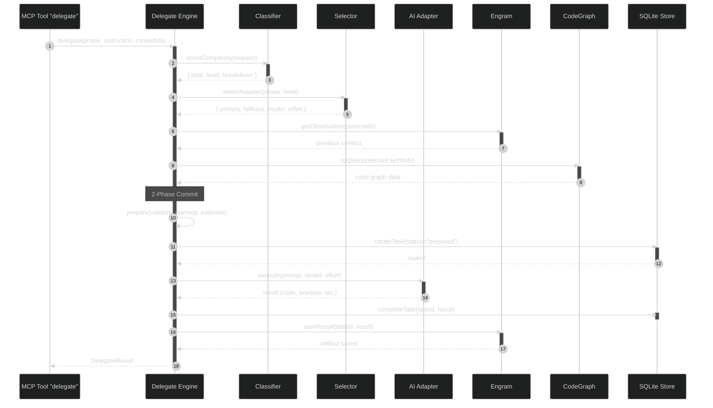
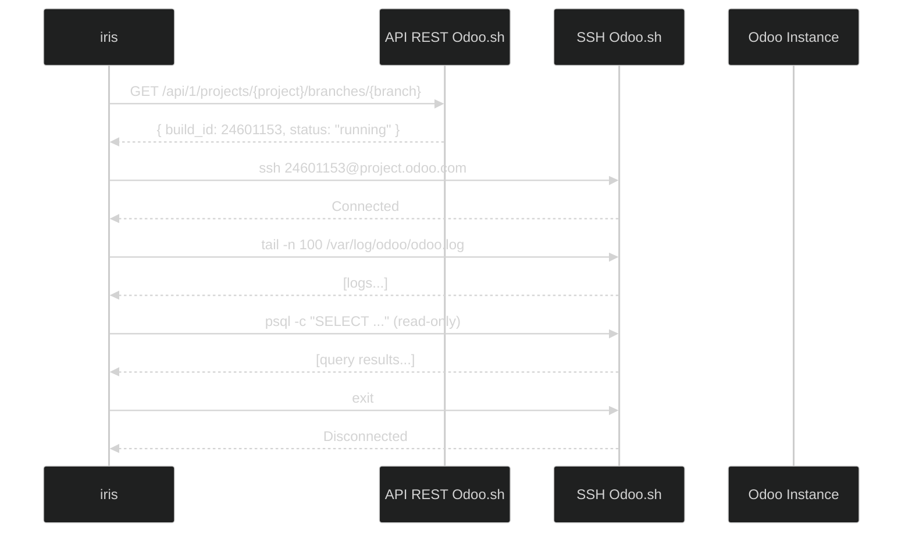
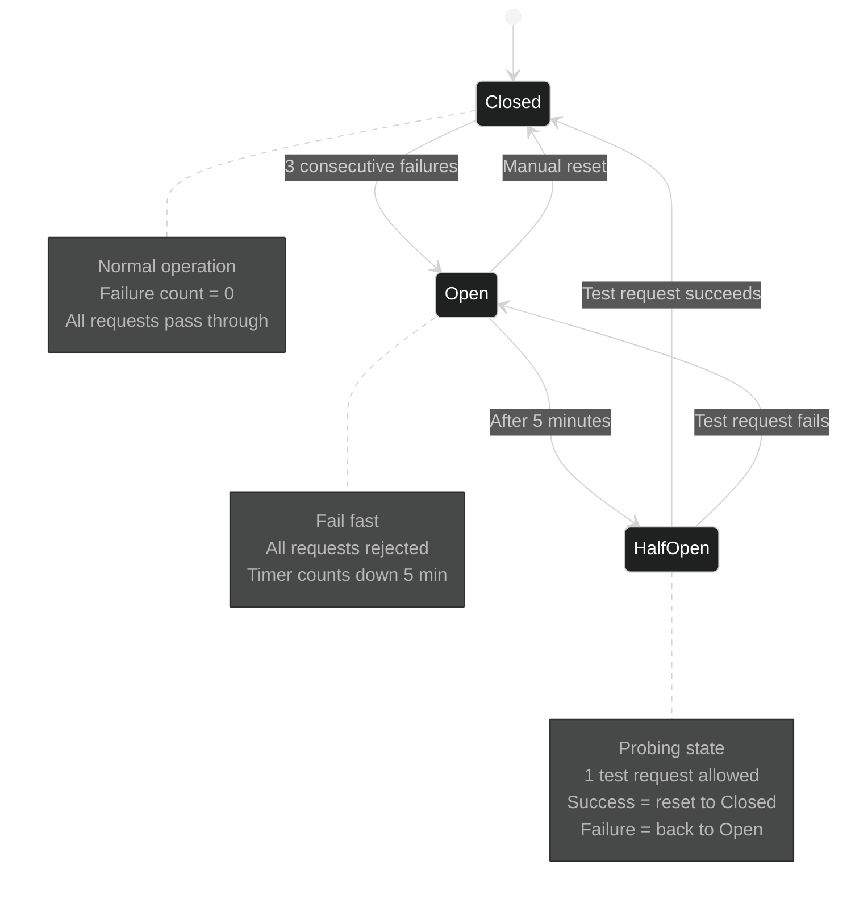

# SYSTEM GUIDE

> **Version:** 1.1.7
> **Ultima actualizacion:** 2026-06-12
> **Autor:** Fairw — Systems Engineer & Senior Odoo Architect
> **Estado:** Borrador
> **Depende de:** `docs/01-PRD.md`, `docs/02-ADR.md`, `docs/03-ARCHITECTURE.md`, `docs/04-CONTRIBUTING.md`, `AGENTS.md`
> **Ingenieria relacionada:** Systems Architecture (1), Orchestration Engineering (8), Context Engineering (4), Agent Engineering (3), Reliability Engineering (13), Observability Engineering (10)

---

## Indice

1. [System Architecture](#1-system-architecture)
   1.1 [MCP Server Layer](#11-mcp-server-layer)
   1.2 [SDD Pipeline Layer](#12-sdd-pipeline-layer)
   1.3 [Context Engine Layer](#13-context-engine-layer)
   1.4 [Delegate Engine Layer](#14-delegate-engine-layer)
   1.5 [Harness Engine Layer](#15-harness-engine-layer)
   1.6 [Router Layer](#16-router-layer)
   1.7 [AI Adapters Layer](#17-ai-adapters-layer)
   1.8 [Execution Ports Layer](#18-execution-ports-layer)
   1.9 [Skills & Knowledge Layer](#19-skills--knowledge-layer)
   1.10 [Engram Memory Layer](#110-engram-memory-layer)
   1.11 [CodeGraph Layer](#111-codegraph-layer)
   1.12 [Odoo.sh Integration Layer](#112-odoosh-integration-layer)
   1.13 [alesco_api_bridge Module](#113-alesco_api_bridge-module)
   1.14 [alesco_observability Module](#114-alesco_observability-module)
   1.15 [Storage Layer](#115-storage-layer)
   1.16 [Security Layer](#116-security-layer)
   1.17 [Resilience Layer](#117-resilience-layer)
2. [SDD Programming Flow](#2-sdd-programming-flow)
   2.1 [Explore](#21-explore)
   2.2 [Propose](#22-propose)
   2.3 [Spec](#23-spec)
   2.4 [Design](#24-design)
   2.5 [Tasks](#25-tasks)
   2.6 [Apply](#26-apply)
   2.7 [Verify](#27-verify)
   2.8 [Archive](#28-archive)
3. [Delegate Engine Flow](#3-delegate-engine-flow)
   3.1 [Task Reception](#31-task-reception)
   3.2 [Complexity Scoring](#32-complexity-scoring)
   3.3 [Adapter Selection](#33-adapter-selection)
   3.4 [Prompt Building](#34-prompt-building)
   3.5 [Two-Phase Commit](#35-two-phase-commit)
   3.6 [Execution](#36-execution)
   3.7 [Persistence](#37-persistence)
   3.8 [Budget Tracking](#38-budget-tracking)
4. [Context Engine Flow](#4-context-engine-flow)
   4.1 [Task Type Detection](#41-task-type-detection)
   4.2 [Skill Detection](#42-skill-detection)
   4.3 [Knowledge Injection](#43-knowledge-injection)
   4.4 [Slim-MD Preamble Construction](#44-slim-md-preamble-construction)
   4.5 [Flow Example](#45-flow-example)
5. [Quality Scanner Flow](#5-quality-scanner-flow)
   5.1 [Ten Dimensions](#51-ten-dimensions)
   5.2 [Scoring Formula](#52-scoring-formula)
   5.3 [CI Gates](#53-ci-gates)
   5.4 [Enforcement Model](#54-enforcement-model)
   5.5 [Reciprocal Apprenticeship](#55-reciprocal-apprenticeship)
 6. [Security Architecture](#6-security-architecture)
    6.1 [7-Layer Security Model](#61-7-layer-security-model)
    6.2 [5 Security Zones](#62-5-security-zones)
    6.3 [Security Checklist by SDD Phase](#63-security-checklist-by-sdd-phase)
    6.4 [Security Incident Response](#64-security-incident-response)
 7. [Resilience Architecture](#7-resilience-architecture)
    7.1 [Timeouts](#71-timeouts)
    7.2 [Retry with Exponential Backoff](#72-retry-with-exponential-backoff)
    7.3 [Circuit Breaker](#73-circuit-breaker)
    7.4 [Fallback Strategies](#74-fallback-strategies)
    7.5 [Bulkhead Pattern](#75-bulkhead-pattern)
    7.6 [Health Check System](#76-health-check-system)
    7.7 [Disaster Recovery Scenarios](#77-disaster-recovery-scenarios)
    7.8 [Backup Strategy (3-2-1)](#78-backup-strategy-3-2-1)
 8. [The 13 Engineering Disciplines](#8-the-13-engineering-disciplines)
    8.1 [Systems Architecture Engineering](#81-systems-architecture-engineering)
    8.2 [Prompt Engineering](#82-prompt-engineering)
    8.3 [Agent Engineering](#83-agent-engineering)
    8.4 [Context Engineering](#84-context-engineering)
    8.5 [Spec Engineering](#85-spec-engineering)
    8.6 [Delegate Engineering](#86-delegate-engineering)
    8.7 [Orchestration Engineering](#87-orchestration-engineering)
    8.8 [Observability Engineering](#88-observability-engineering)
    8.9 [Quality Engineering](#89-quality-engineering)
    8.10 [Reliability Engineering](#810-reliability-engineering)
    8.11 [Memory Engineering](#811-memory-engineering)
    8.12 [Code Intelligence Engineering](#812-code-intelligence-engineering)
    8.13 [Cost Engineering](#813-cost-engineering)
 9. [Connectivity Matrix](#9-connectivity-matrix)
    9.1 [External Connections Table](#91-external-connections-table)
    9.2 [Connection Security Policies](#92-connection-security-policies)
10. [Learning Map -- Reciprocal Apprenticeship](#10-learning-map--reciprocal-apprenticeship)
    10.1 [The 4 Pillars](#101-the-4-pillars)
    10.2 [Teaching Mode Template](#102-teaching-mode-template)
    10.3 [Agent Teaching Personalities](#103-agent-teaching-personalities)
    10.4 [Learning Artifact Lifecycle](#104-learning-artifact-lifecycle)
    10.5 [Learning Progression (Onion Model)](#105-learning-progression-onion-model)

---

## Introduccion

El presente documento constituye la guia de referencia completa del sistema iris, un orquestador MCP (Model Context Protocol) disenado exclusivamente para el desarrollo profesional de Odoo Enterprise. iris coordina agentes AI especializados, gestiona el ciclo de vida de desarrollo SDD (Spec-Driven Development), y proporciona herramientas de integracion directa con Odoo.sh, analisis estatico de codigo mediante CodeGraph, memoria persistente a traves de Engram, y un sistema de calidad automatizado de 10 dimensiones.

La arquitectura sigue los principios de **Arquitectura Hexagonal** (puertos y adaptadores), **Screaming Architecture** (estructura por dominio de negocio), y **Odoo-First** (todas las decisiones priorizan el ecosistema Odoo). El sistema se organiza en 17 capas que abarcan desde el transporte MCP hasta la resiliencia y seguridad empresarial.

Este documento esta organizado en 10 secciones que cubren la totalidad del sistema iris: Arquitectura del Sistema (1), Flujo de Programacion SDD (2), Flujo del Delegate Engine (3), Flujo del Context Engine (4), Flujo del Quality Scanner (5), Arquitectura de Seguridad (6), Arquitectura de Resiliencia (7), 13 Disciplinas de Ingenieria (8), Matriz de Conectividad (9), y Mapa de Aprendizaje (10).

---

## 1. System Architecture

iris se compone de 17 capas arquitectonicas organizadas en una jerarquia de abstraccion que va desde el transporte MCP en la periferia hasta los modulos de dominio Odoo en el nucleo. Cada capa tiene responsabilidades especificas, interfaces bien definidas, y mecanismos de falla controlados.

El diagrama siguiente presenta una vista general de todas las capas y sus relaciones:

```mermaid
%%{init: {'theme': 'dark', 'themeVariables': {'primaryColor': '#1f6feb', 'primaryTextColor': '#ffffff', 'primaryBorderColor': '#22d3ee', 'lineColor': '#8b949e'}}}%%
flowchart TD
    subgraph CapaMCP ["1.1 MCP Server Layer"]
        MCP[MCP Server\nFastMCP STDIO]
        TOOLS[Tools Registry\n11 tools]
    end

    subgraph CapaSDD ["1.2 SDD Pipeline Layer"]
        SDD[8-phase DAG\nExplore→Propose→Spec→Design\n→Tasks→Apply→Verify→Archive]
    end

    subgraph CapaContext ["1.3 Context Engine Layer"]
        DETECTOR[Task Type Detector\n130+ keywords → 22 types]
        SKILLDET[Skill Detector\n8 skills × 5 triggers]
        KNOWLEDGE[Knowledge Injector\nv14-v19 docs]
        SLIMMD[Slim-MD Builder\nSub-agent preamble]
    end

    subgraph CapaDelegate ["1.4 Delegate Engine Layer"]
        DELEGATE[Core Orchestrator\n374 lines, 2-phase commit]
        COMPLEXITY[Complexity Scorer\n4 dimensions → 0-100]
    end

    subgraph CapaHarness ["1.5 Harness Engine Layer"]
        FF[Feedforward Control\nTask→Phase→Agent→Adapter]
        FB[Feedback Control\nQuality gates, handoff]
    end

    subgraph CapaRouter ["1.6 Router Layer"]
        CLASSIFIER[Classifier\n4-dimension scoring]
        SELECTOR[Selector\nPhase→Adapter mapping]
        CB[Circuit Breaker\n3 failures→5min open]
    end

    subgraph CapaAdapters ["1.7 AI Adapters Layer"]
        ADAPTERS[7 Adapters\nAntigravity, Claude, Copilot\nCodex, Kilo, Cursor, OpenCode]
    end

    subgraph CapaPorts ["1.8 Execution Ports Layer"]
        ENGRAM_PORT[Engram MCP Client\n5-step IPC]
        CG_PORT[CodeGraph MCP Client\n10 tools]
        SUBPROC[Subprocess\nNode.js child_process]
        TERMINAL[Terminal\ncmd.exe /c start]
    end

    subgraph CapaSkills ["1.9 Skills & Knowledge Layer"]
        SKILLS[40+ skills\n5 tiers T0-T4]
        KB[Knowledge Base\n~120 files]
        SCRIPTS[Scripts\n14 PS + 5 git hooks]
        RULES[13 Master Rules\nR0-R13]
        PROMPTS[Prompts\n8 SDD + 9 Review + 5 domain]
    end

    subgraph CapaEngram ["1.10 Engram Memory Layer"]
        ENGRAM[Engram\nSDD artifacts + Learning]
    end

    subgraph CapaCG ["1.11 CodeGraph Layer"]
        CODEGRAPH[CodeGraph\n10 tools, local index]
    end

    subgraph CapaOdooSh ["1.12 Odoo.sh Integration Layer"]
        ODOOSH[Odoo.sh API + SSH\nDynamic build discovery]
    end

    subgraph CapaBridge ["1.13 alesco_api_bridge"]
        BRIDGE[Odoo 18 REST Bridge\nControllers + Audit]
    end

    subgraph CapaObserv ["1.14 alesco_observability"]
        OBSERV[OpenTelemetry\nOTLP → Grafana Cloud]
    end

    subgraph CapaStorage ["1.15 Storage Layer"]
        SQLITE[SQLite\n5 tables]
        TASKS[Task Store\nCRUD + status]
        BUDGETS[Budget Store\n$0.50-5.00/day]
        CACHE[UI Map Cache\n30min TTL]
    end

    subgraph CapaSecurity ["1.16 Security Layer"]
        SEC[7-layer model\n5 Security Zones]
    end

    subgraph CapaResilience ["1.17 Resilience Layer"]
        RESIL[Timeouts, Retry, CB\nBulkhead, DR, Backup]
    end

    MCP --> SDD
    SDD --> DELEGATE
    SDD --> CLASSIFIER
    DELEGATE --> DETECTOR
    DELEGATE --> COMPLEXITY
    COMPLEXITY --> CLASSIFIER
    CLASSIFIER --> SELECTOR
    SELECTOR --> ADAPTERS
    ADAPTERS --> ENGRAM_PORT
    ADAPTERS --> CG_PORT
    ADAPTERS --> SUBPROC
    ADAPTERS --> TERMINAL
    DETECTOR --> SKILLDET
    SKILLDET --> SKILLS
    SKILLDET --> KB
    SKILLDET --> RULES
    DETECTOR --> KNOWLEDGE
    DELEGATE --> FF
    FF --> FB
    ENGRAM_PORT --> ENGRAM
    CG_PORT --> CODEGRAPH
    DELEGATE --> ODOOSH
    DELEGATE --> BRIDGE
    BRIDGE --> OBSERV
    DELEGATE --> SQLITE
    DELEGATE --> SEC
    DELEGATE --> RESIL

    style CapaMCP fill:#0f172a,stroke:#22d3ee,stroke-width:2px
    style CapaSDD fill:#1e293b,stroke:#22d3ee,stroke-width:2px
    style CapaContext fill:#0f172a,stroke:#a855f7,stroke-width:2px
    style CapaDelegate fill:#1e293b,stroke:#a855f7,stroke-width:2px
    style CapaHarness fill:#0f172a,stroke:#10b981,stroke-width:2px
    style CapaRouter fill:#1e293b,stroke:#f59e0b,stroke-width:2px
    style CapaAdapters fill:#0f172a,stroke:#f59e0b,stroke-width:2px
    style CapaPorts fill:#1e293b,stroke:#ef4444,stroke-width:2px
    style CapaSkills fill:#0f172a,stroke:#8b5cf6,stroke-width:2px
    style CapaEngram fill:#1e293b,stroke:#22d3ee,stroke-width:2px
    style CapaCG fill:#0f172a,stroke:#22d3ee,stroke-width:2px
    style CapaOdooSh fill:#1e293b,stroke:#10b981,stroke-width:2px
    style CapaBridge fill:#0f172a,stroke:#10b981,stroke-width:2px
    style CapaObserv fill:#1e293b,stroke:#10b981,stroke-width:2px
    style CapaStorage fill:#0f172a,stroke:#f59e0b,stroke-width:2px
    style CapaSecurity fill:#1e293b,stroke:#ef4444,stroke-width:2px
    style CapaResilience fill:#0f172a,stroke:#ef4444,stroke-width:2px
```



### 1.1 MCP Server Layer

La capa MCP Server es el punto de entrada de iris. Implementa el protocolo MCP (Model Context Protocol) sobre transporte STDIO utilizando JSON-RPC como formato de intercambio.

| Propiedad | Valor |
|-----------|-------|
| **Transporte** | STDIO (entrada/salida estandar) |
| **Protocolo** | JSON-RPC 2.0 |
| **Framework** | FastMCP |
| **Entry Point** | `src/server.ts`, `src/index.ts` |
| **Tools Registradas** | 11 |

Las herramientas registradas en el servidor MCP son:

| Tool | Descripcion | Fuente |
|------|-------------|--------|
| `delegate` | Orquesta tareas SDD hacia agentes AI especializados | `src/tools/delegate.ts` |
| `odoo-sh` | Ejecuta comandos remotos en Odoo.sh via SSH | `src/tools/odoo-sh.ts` |
| `quality-scan` | Escanea un modulo Odoo contra 10 dimensiones de calidad | `src/tools/quality-scanner.ts` |
| `cg-query` | Consulta el grafo de codigo CodeGraph | `src/codegraph/client.ts` |
| `engram-save` | Persiste una observacion en memoria Engram | `src/tools/engram-sync.ts` |
| `engram-search` | Busca en memoria Engram | `src/tools/engram-sync.ts` |
| `engram-timeline` | Obtiene linea de tiempo contextual | `src/tools/engram-sync.ts` |
| `task-status` | Consulta estado de tareas en ejecucion | `src/store/tasks.ts` |
| `adapter-status` | Consulta estado de adaptadores y circuit breakers | `src/router/circuit-breaker.ts` |
| `budget-status` | Consulta presupuesto diario de adaptadores | `src/store/budgets.ts` |
| `config-get` | Obtiene configuracion actual del sistema | `src/config.ts` |

### 1.2 SDD Pipeline Layer

El pipeline SDD (Spec-Driven Development) es el corazon del flujo de trabajo de iris. Organiza el desarrollo en 8 fases conectadas mediante un grafo aciclico dirigido (DAG) que garantiza que cada fase tenga las dependencias necesarias antes de ejecutarse.

**Grafo de dependencias:**

```mermaid
%%{init: {'theme': 'dark', 'themeVariables': {'primaryColor': '#1f6feb', 'primaryTextColor': '#ffffff', 'primaryBorderColor': '#22d3ee', 'lineColor': '#8b949e'}}}%%
flowchart LR
    EXPLORE[Explore] --> PROPOSE[Propose]
    PROPOSE --> SPEC[Spec]
    PROPOSE --> DESIGN[Design]
    SPEC --> TASKS[Tasks]
    DESIGN --> TASKS
    TASKS --> APPLY[Apply]
    APPLY --> VERIFY[Verify]
    VERIFY --> ARCHIVE[Archive]

    style EXPLORE fill:#1e293b,stroke:#22d3ee,stroke-width:2px
    style PROPOSE fill:#1e293b,stroke:#a855f7,stroke-width:2px
    style SPEC fill:#1e293b,stroke:#10b981,stroke-width:2px
    style DESIGN fill:#1e293b,stroke:#f59e0b,stroke-width:2px
    style TASKS fill:#1e293b,stroke:#ef4444,stroke-width:2px
    style APPLY fill:#1e293b,stroke:#22d3ee,stroke-width:2px
    style VERIFY fill:#1e293b,stroke:#a855f7,stroke-width:2px
    style ARCHIVE fill:#1e293b,stroke:#10b981,stroke-width:2px
```



**Relacion proposal-spec-design:**

```
proposal -> specs --> tasks -> apply -> verify -> archive
             ^
             |
           design
```

**Mapeo de agentes por fase:**

| Fase | Agente Primario | Agentes de Soporte | Skills Cargadas |
|------|-----------------|--------------------|-----------------|
| explore | Odoo Architect | -- | odoo-ai, odoo-contribute |
| propose | Odoo Architect | Modeler, Viewer | odoo-ai, screaming-architecture |
| spec | Odoo Architect | Todos los agentes | odoo-ai (secciones relevantes) |
| design | Odoo Architect | Modeler | odoo-ai (ORM), odoo-contribute (OCA naming) |
| tasks | Odoo Architect | Todos los agentes | Skills segun dominio de cada tarea |
| apply | Modeler / Viewer | Tester | odoo-ai (ORM/views), odoo-qweb (reportes) |
| verify | Reviewer | Tester | odoo-code-review, odoo-security, odoo-test |
| archive | Odoo Architect | Todos los agentes | Skills segun lecciones registradas |

**Reglas de transicion entre fases:**

1. **Un agente primario por fase**: cada fase tiene un unico responsable que coordina el output.
2. **Agentes de soporte bajo demanda**: se activan solo si el cambio requiere su especialidad.
3. **Handoff explicito**: al cambiar de fase, el agente saliente documenta el estado actual en Engram.
4. **Arquitecto siempre presente**: Odoo Architect permanece como supervisor durante todo el pipeline.
5. **Reviewer bloquea el merge**: Odoo Reviewer debe aprobar antes de que verify pase a archive.

Referencia completa: `AGENTS.md` Seccion 5 (Agent-to-SDD Phase Mapping).

### 1.3 Context Engine Layer

El Context Engine es el sistema de deteccion y carga de contexto que prepara a los sub-agentes con el conocimiento necesario para ejecutar una tarea. Opera bajo un presupuesto estricto de contexto del 40%.

**Componentes:**

| Componente | Archivo | Responsabilidad |
|------------|---------|-----------------|
| Task Type Detector | `src/context/odoo-selector.ts` | Clasifica la tarea en 22 tipos mediante 130+ keywords |
| Skill Detector | `src/context/context-detector.ts` | Detecta 8 skills mediante 5 tipos de disparadores |
| Knowledge Injector | `src/context/rules.ts` | Carga documentacion version-especifica de Odoo |
| Slim-MD Builder | `src/context/slim-md.ts` | Construye el preambulo del sub-agente |

**Task Type Detector:**

El clasificador de tipos de tarea utiliza 130+ keywords mapeadas a 22 tipos de tarea Odoo. Cada tipo tiene una configuracion asociada que define el adaptador primario, adaptador de respaldo, archivos de conocimiento, y reglas activas.

```typescript
// Estructura de deteccion (src/context/odoo-selector.ts)
const TASK_KEYWORD_MAP: Record<string, OdooTaskType> = {
  'fields.': 'odoo-orm',
  '@api.': 'odoo-orm',
  '_inherit': 'odoo-orm',
  'xpath': 'odoo-view',
  'ir.rule': 'odoo-security',
  'report': 'odoo-report',
  'http.route': 'odoo-controller',
  // ... 130+ entradas
}
```

**22 tipos de tarea Odoo:**

| Tipo | Descripcion | Adaptador Primario | Reglas |
|------|-------------|-------------------|--------|
| odoo-orm | Modelos, campos, ORM | claude | R1, R7, R10, R13 |
| odoo-view | Vistas XML, QWeb | claude | R1, R5, R7 |
| odoo-security | ACL, ir.rule, grupos | claude | R1, R4, R13 |
| odoo-report | Reportes PDF, QWeb | antigravity | R1, R7 |
| odoo-migration | Upgrades, pre-migrate | claude | R1, R5 |
| odoo-test | Tests unitarios/integracion | claude | R1, R7 |
| odoo-controller | Rutas HTTP, endpoints | claude | R1, R7, R13 |
| odoo-wizard | Modelos transientes | claude | R1, R4, R7 |
| odoo-mail | Chatter, followers, emails | claude | R1, R7 |
| odoo-portal | Portal de cliente | antigravity | R1, R7, R13 |
| odoo-owl | Componentes OWL frontend | antigravity | R1, R7, R13 |
| odoo-source | Module Intelligence Report | antigravity | R1, R6, R12 |
| odoo-ops | Operaciones servidor Odoo.sh | claude | R2, R3 |
| odoo-ci | CI/CD pipelines | claude | R9 |
| odoo-api | API externa / jsonrpc | claude | R13 |
| odoo-commit | Commits convencionales | claude | R3, R9 |
| odoo-pr | Pull Requests | claude | R3, R9 |
| odoo-changelog | Changelog / release notes | claude | R9 |
| odoo-module | Nuevos modulos scaffold | antigravity | R1, R4, R7 |
| odoo-accounting | Contabilidad (account.move, etc.) | antigravity | R1, R7, R10 |
| odoo-stock | Inventario (stock.move, etc.) | antigravity | R1, R7, R10 |
| odoo-debug | Depuracion / troubleshooting | antigravity | R1 |

**Skill Detector:**

El detector de skills utiliza 5 tipos de disparadores con niveles de confianza:

| Disparador | Confianza | Ejemplo |
|------------|-----------|---------|
| `extensions` | 0.6 | Archivo `.py` dispara `odoo-ai` |
| `patterns` | 0.8 | `ir.ui.view` en contenido dispara `odoo-ai` |
| `phases` | 0.85 | Fase `verify` dispara `odoo-quality` |
| `commands` | 0.75 | Comando `quality` dispara `odoo-quality` |
| `taskTypes` | 0.9 | Tipo `odoo-orm` dispara `odoo-ai` |

**8 skills registradas:**

| Skill | Tier | Disparadores |
|-------|------|-------------|
| odoo-ai | 1 | .py, .xml, patterns: models/, __manifest__, ir.ui.view, fields. |
| odoo-contribute | 1 | .yml, .yaml, patterns: .github/workflows, Dockerfile |
| odoo-quality | 2 | phases: verify, commands: quality, score, review, audit |
| odoo-observability | 2 | commands: otel, trace, observability, performance, slow |
| odoo-reliability | 2 | commands: backup, reliability, disaster, recovery |
| odoo-module | 3 | patterns: __manifest__, commands: scaffold, new module |
| odoo-ops | 3 | commands: odoo.sh, ssh, deploy, server, staging |
| odoo-security | 3 | patterns: ir.model.access, ir.rule, res.groups |

Las skills de Tier 1 y 2 con confianza >= 0.8 se clasifican como **primarias**; las demas como **secundarias**.

**Knowledge Injector:**

Carga archivos de conocimiento desde `knowledge/odoo/` segun el tipo de tarea detectado:

```typescript
// Ejemplo de carga (src/context/rules.ts)
'odoo-orm': { knowledgeFiles: ['ai/knowledge/core/orm-patterns.md'] }
'odoo-view': { knowledgeFiles: ['ai/knowledge/patterns/xml-views.md'] }
'odoo-security': { knowledgeFiles: ['ai/knowledge/security/security-patterns.md'] }
```

El repositorio de conocimiento contiene aproximadamente 120 archivos organizados por version de Odoo (v14-v19), patrones, dominio de negocio, seguridad, agentes, y devops.

**13 Reglas Maestras (R0-R13):**

| Regla | Titulo | Descripcion |
|-------|--------|-------------|
| R0 | Zero Cost | Sin dependencias de pago. Preferir herramientas open-source o gratuitas. |
| R1 | Odoo First | Toda decision tecnica prioriza el ecosistema Odoo. |
| R2 | Safe Ops | Comandos destructivos requieren confirmacion explicita. |
| R3 | No Secrets | Nunca exponer tokens, claves SSH, o credenciales en logs o codigo. |
| R4 | Security First | Toda operacion debe validar autenticacion y autorizacion. |
| R5 | Technical Teaching | Cada output debe incluir fundamentos tecnicos (Reciprocal Apprenticeship). |
| R6 | State Recovery | iris no guarda estado local. Todo se persiste en Engram. |
| R7 | Performance | Prevenir N+1, usar prefetching, evitar bucles con search(). |
| R8 | Context Budget | Skills cargadas no deben exceder el 40% del contexto disponible. |
| R9 | Conventional Commits | Commits deben seguir el formato conventional-commits. |
| R10 | Domain Precise | Las busquedas ORM deben usar dominios precisos, no registros completos. |
| R11 | Fail Fast | Si un componente falla, registrar el error y fallar con mensaje claro. |
| R12 | Graceful Degradation | El sistema debe degradarse gracefulmente, no colapsar. |
| R13 | Data Integrity | Validar integridad referencial antes de operaciones destructive. |

### 1.4 Delegate Engine Layer

El Delegate Engine es el orquestador central del sistema. Con 374 lineas en `src/tools/delegate.ts`, es el componente mas grande de iris y el que coordina todo el flujo de delegacion de tareas a agentes AI externos.

**Flujo del Delegate Engine:**



**Complejidad:** 4 dimensiones evaluadas:

| Dimension | Peso | Criterios de Puntuacion |
|-----------|------|------------------------|
| Scope (Alcance) | 30 pts | Palabras en instruccion: <20 = 5, <60 = 15, <150 = 22, >=150 = 30 |
| ContextSize (Tamano Contexto) | 30 pts | contextIds: 0 = 5, <=2 = 12, <=5 = 22, >5 = 30 |
| ArchitecturalImpact (Impacto Arq.) | 20 pts | Fases design/apply/spec = 20; keywords architecture/refactor = 10-20 |
| DependencyResolution (Dependencias) | 20 pts | Keywords install/package/library: 0 = 2, <=2 = 10, >2 = 20 |

**Niveles de complejidad:**

| Rango | Nivel | Descripcion |
|-------|-------|-------------|
| 0-35 | low | Tarea simple, respuesta rapida |
| 36-70 | medium | Tarea moderada, requiere analisis |
| 71-100 | high | Tarea compleja, requiere modelo potente |

El puntaje total puede ser sobrescrito manualmente mediante el campo `complexity` en el request.

**Two-Phase Commit:**

El patron de two-phase commit garantiza que no se consuman recursos del adaptador sin validacion previa:

1. **Prepare (Fase 1):**
   - Validar que la instruccion cumple con el schema Zod
   - Verificar disponibilidad del adaptador via Circuit Breaker
   - Verificar presupuesto diario del adaptador
   - Calentar Engram (cargar observaciones previas)
   - Calentar CodeGraph (consultar simbolos relevantes)
   - Estimar costo de la operacion
   - Generar token de confirmacion con TTL de 10 minutos
   - Almacenar plan pendiente en `pendingTokens` (memoria en proceso)

2. **Commit (Fase 2a) o Rollback (Fase 2b):**
   - Commit: ejecutar el adaptador con el prompt construido
   - Rollback: liberar recursos, no ejecutar adaptador
   - Timeout del token: 10 minutos; si expira, se rechaza automaticamente

**Resultado estructurado:**

```typescript
interface DelegateResult {
  taskId: string
  phase: string
  instruction: string
  complexity: ComplexityScore
  adapter: AdapterSelection
  teaching?: string      // Teaching mode output
  learning?: string      // Learning artifact
  budget: BudgetStatus   // Post-execution budget
  result?: string        // Adapter output
  error?: string         // Error message if failed
}
```

### 1.5 Harness Engine Layer

El Harness Engine implementa los controles feedforward y feedback que garantizan la calidad del sistema. Es el mecanismo de enforcement que asegura que cada tarea siga el pipeline correcto y cumpla con los quality gates.

**Feedforward Control:**

El control feedforward establece la ruta de ejecucion antes de que ocurra:

```
Task Type → SDD Phase → Primary Agent → Support Agents → Adapter → Execution Tool
```

Cada decision feedforward se toma basada en el tipo de tarea detectado y la fase SDD solicitada. Por ejemplo, una tarea de tipo `odoo-orm` en fase `apply` se enruta a Claude como adaptador primario con el agente Modeler.

**Feedback Control:**

El control feedback verifica los resultados despues de la ejecucion:

| Mecanismo | Cuando se Activa | Que Verifica |
|-----------|-----------------|--------------|
| Quality Gates | Al finalizar cada fase | Cada dimension tiene score minimo |
| Agent Handoff | Al cambiar de agente | Estado documentado en Engram |
| Teaching Mode | En cada output | Fundamentos, ruta UI, alternativas |
| CI Gates | Pre-commit, PR, merge, deploy | Score global contra umbral |

Referencia completa: `docs/01-PRD.md` Seccion 6.

### 1.6 Router Layer

El Router Layer es el sistema de enrutamiento que conecta las tareas con los adaptadores AI adecuados segun la fase SDD, el tipo de tarea Odoo, y la complejidad.

**Componentes:**

| Componente | Archivo | Funcion |
|------------|---------|---------|
| Classifier | `src/router/classifier.ts` | Evalua 4 dimensiones de complejidad |
| Selector | `src/router/selector.ts` | Mapea fase y tipo a adaptador + modelo |
| Circuit Breaker | `src/router/circuit-breaker.ts` | Protege contra fallos repetidos |

**Classifier:**

El clasificador puntua la complejidad en 4 dimensiones con pesos especificos:

- **Scope (30%):** longitud de la instruccion
- **ContextSize (30%):** cantidad de observaciones de contexto solicitadas
- **ArchitecturalImpact (20%):** si la tarea afecta la arquitectura del sistema
- **DependencyResolution (20%):** si requiere instalar o integrar dependencias externas

El puntaje total (0-100) determina el nivel: low (0-35), medium (36-70), high (71-100).

**Selector:**

El selector mapea fase SDD a adaptador primario:

| Fase | Adaptador Primario | Modelo Low | Modelo Medium | Modelo High | Fallback |
|------|-------------------|------------|---------------|-------------|----------|
| explore | antigravity | Gemini 3.5 Flash (Medium) | Gemini 3.5 Flash (High) | Gemini 3.1 Pro (High) | claude |
| propose | claude | claude-haiku-4-5 | claude-sonnet-4-6 | claude-opus-4-7 | antigravity |
| spec | claude | claude-haiku-4-5 | claude-sonnet-4-6 | claude-opus-4-7 | antigravity |
| design | antigravity | Gemini 3.5 Flash (Medium) | Gemini 3.5 Flash (High) | Gemini 3.1 Pro (High) | claude |
| tasks | claude | claude-haiku-4-5 | claude-sonnet-4-6 | claude-opus-4-7 | copilot |
| apply | claude | claude-haiku-4-5 | claude-sonnet-4-6 | claude-opus-4-7 | codex |
| verify | claude | claude-haiku-4-5 | claude-sonnet-4-6 | claude-opus-4-7 | antigravity |
| archive | antigravity | Gemini 3.5 Flash (Medium) | Gemini 3.5 Flash (High) | Gemini 3.1 Pro (High) | claude |

El tipo de tarea Odoo puede sobrescribir el adaptador basado en fase. Por ejemplo, una tarea `odoo-source` siempre usa antigravity como primario independientemente de la fase.

**Circuit Breaker:**

El circuit breaker protege contra fallos repetidos en los adaptadores:

| Estado | Condicion | Comportamiento |
|--------|-----------|----------------|
| **Closed** | Fallos < 3 | Peticiones pasan normalmente |
| **Open** | Fallos >= 3 | Peticiones rechazadas por 5 minutos |
| **Half-Open** | 5 minutos transcurridos | Una peticion de prueba pasa; si falla, vuelve a Open |

Cada exito resetea el contador de fallos a 0 (maneja recuperacion half-open). El estado es en memoria y se pierde al reiniciar el proceso (por decision arquitectonica D1).

### 1.7 AI Adapters Layer

La capa de adaptadores AI abstrae la interfaz con diferentes motores de IA. Cada adaptador implementa la interfaz `IAdapter` definida en `src/adapters/base.ts`:

```typescript
// Interfaz base (src/adapters/base.ts)
export abstract class BaseAdapter implements IAdapter {
  abstract name: AdapterName
  abstract execute(prompt: string, model: string, effort: string): Promise<string>
  isAvailable(): boolean { return true }
}
```

**7 Adaptadores Concretos:**

| Adaptador | Clase | Comando CLI | Fuente |
|-----------|-------|-------------|--------|
| Antigravity / Gemini | `AntigravityAdapter` | `agy.exe` STDIO | `src/adapters/antigravity.ts` |
| Claude | `ClaudeAdapter` | `claude` CLI STDIO | `src/adapters/claude.ts` |
| Copilot | `CopilotAdapter` | `gh copilot` CLI | `src/adapters/copilot.ts` |
| Codex | `CodexAdapter` | `codex` CLI | `src/adapters/codex.ts` |
| Kilo | `KiloAdapter` | `kilo` CLI | `src/adapters/kilo.ts` |
| Cursor | `CursorAdapter` | `cursor` CLI | `src/adapters/cursor.ts` |
| OpenCode | `OpenCodeAdapter` | `opencode` CLI | `src/adapters/opencode.ts` |

**Modelos por nivel de complejidad:**

| Adapter | Simple | Medium | Complex | Critical |
|---------|--------|--------|---------|----------|
| Claude | claude-haiku-4-5 | claude-sonnet-4-6 | claude-opus-4-7 | claude-opus-4-7 |
| Antigravity | Gemini 3.5 Flash (M) | Gemini 3.5 Flash (H) | Gemini 3.1 Pro (H) | Gemini 3.1 Pro (H) |
| Copilot | gpt-4.1-mini | gpt-4o | gpt-5.2 | gpt-5.2 |
| Codex | o4-mini | o4-mini | o3 | o3 |
| Kilo | claude-3-5-haiku | claude-sonnet-4 | claude-opus-4 | claude-opus-4 |
| Cursor | claude-3-5-haiku | claude-sonnet-4 | claude-opus-4 | claude-opus-4 |
| OpenCode | opencode/zen | opencode/zen | opencode/zen | opencode/zen |

### 1.8 Execution Ports Layer

Los puertos de ejecucion abstraen los diferentes mecanismos de comunicacion con sistemas externos:

| Puerto | Mecanismo | Uso |
|--------|-----------|-----|
| Engram MCP Client | IPC 5 pasos (connect, register, notify, exchange, close) | Singleton para memoria persistente |
| CodeGraph MCP Client | 10 herramientas MCP | Consulta de grafo de codigo |
| Subprocess | `child_process` de Node.js | Ejecucion inline de procesos |
| Terminal | `cmd.exe /c start` | Ejecucion fire-and-forget en Windows Terminal |

**10 herramientas de CodeGraph:**

| Herramienta | Funcion |
|-------------|---------|
| `cgSearch` | Busqueda semantica en el grafo de codigo |
| `cgTrace` | Traza de ruta de ejecucion |
| `cgContext` | Definiciones y contexto de simbolos |
| `cgExplore` | Exploracion de modulos |
| `cgNode` | Detalles de un nodo especifico |
| `cgFiles` | Archivos por modulo |
| `cgStatus` | Estado del proyecto |
| `cgCallers` | Llamadas entrantes a una funcion |
| `cgCallees` | Llamadas salientes de una funcion |
| `cgImpact` | Analisis de impacto de cambios |

### 1.9 Skills & Knowledge Layer

La capa de conocimiento almacena y gestiona todo el conocimiento especializado que iris utiliza para guiar a los agentes AI.

**Skill Registry:**

40+ skills organizadas en 5 tiers:

| Tier | Categoria | Skills |
|------|-----------|--------|
| **T0** | Core SDD | sdd-init, sdd-propose, sdd-spec, sdd-design, sdd-tasks, sdd-apply, sdd-verify, sdd-archive, sdd-explore |
| **T1** | Odoo AI | odoo-ai, odoo-oca, odoo-overview |
| **T2** | Odoo Contribute | odoo-contribute, odoo-module, odoo-commit, odoo-pr, odoo-changelog, odoo-ci |
| **T3** | Execution | odoo-quality, odoo-observability, odoo-reliability, odoo-ops, odoo-security |
| **T4** | Utilities | angular-core, angular-architecture, angular-forms, angular-performance, go-patterns, go-testing, typescript, tailwind-4, screaming-architecture, hexagonal-architecture, material-design-ux, skill-creator, skill-mapper, mermaid |

**Knowledge Base:** aproximadamente 120 archivos en `knowledge/odoo/` organizados por:
- Version Odoo (v14, v15, v16, v17, v18, v19)
- Patrones (ORM, vistas, seguridad, reportes, wizards, controladores, mail, portal)
- Dominios de negocio (contabilidad, inventario, ventas, compras, MRP, HR, CRM)
- Seguridad (OWASP Odoo, hardening, auditoria)
- Agentes (prompts, skills, herramientas)
- DevOps (Docker, CI/CD, Odoo.sh, PostgreSQL)

**Scripts Library:** 14 scripts PowerShell + 5 git hooks en `knowledge/odoo/ai/scripts/`.

**RULES.md:** 13 reglas maestras (R0-R13) que gobiernan el comportamiento del sistema.

**Prompts System:**
- 8 prompts de fase SDD (uno por fase)
- 9 prompts de Human-First Review
- 5 prompts de dominio Odoo

### 1.10 Engram Memory Layer

Engram es el sistema de memoria persistente de iris. Proporciona almacenamiento de observaciones a traves de sesiones, permitiendo que el sistema recuerde decisiones arquitectonicas, bugs encontrados, configuraciones, y patrones establecidos.

**Protocolo IPC:** 5 pasos

```
1. connect(project, sessionId) → session token
2. register_context(project, workingDirectory) → context id
3. notify_status(status, currentPhase) → acknowledged
4. exchange_sync(observations) → synced observations
5. close_session(sessionId) → summary saved
```

**Tipos de artefactos SDD persistidos:**

| Tipo de Artefacto | Topic Key | Contenido |
|-------------------|-----------|-----------|
| Exploration | `sdd/{change}/explore` | Investigacion y requerimientos |
| Proposal | `sdd/{change}/proposal` | Intencion, alcance, enfoque |
| Spec | `sdd/{change}/spec` | Requerimientos con escenarios |
| Design | `sdd/{change}/design` | Decisiones arquitectonicas |
| Tasks | `sdd/{change}/tasks` | Checklist de tareas |
| Apply Progress | `sdd/{change}/apply-progress` | Estado de implementacion |
| Verify Report | `sdd/{change}/verify-report` | Reporte de verificacion |
| Archive Report | `sdd/{change}/archive-report` | Lecciones aprendidas |

**Learning Artifacts:** output estructurado del Teaching Mode que incluye codigo, fundamentos, ruta UI, ruta de test, relaciones impactadas, seguridad, y alternativas.

**UI Maps:** mapas de navegacion de la UI de Odoo generados mediante parseo de XML.

### 1.11 CodeGraph Layer

CodeGraph proporciona analisis estatico del codigo fuente de Odoo mediante un grafo de dependencias indexado localmente.

| Aspecto | Detalle |
|---------|---------|
| **Base de datos** | Grafo de codigo indexado localmente |
| **Cliente** | `src/codegraph/client.ts` |
| **Herramientas** | 10 (cgSearch, cgTrace, cgContext, cgExplore, cgNode, cgFiles, cgStatus, cgCallers, cgCallees, cgImpact) |
| **Formato** | MCP Client sobre STDIO |

### 1.12 Odoo.sh Integration Layer

La integracion con Odoo.sh permite ejecutar comandos remotos en instancias de Odoo Enterprise alojadas en Odoo.sh.

**Arquitectura de conexion:**



**Warning importante:** Las URLs SSH de Odoo.sh son dinamicas. El `build_id` cambia con cada push a Odoo.sh. Hardcodear la URL SSH rompe la conexion en cada deploy. iris descubre automaticamente el build_id via API REST antes de cada conexion SSH.

**Comandos soportados:**

| Comando | Descripcion | Modo |
|---------|-------------|------|
| `tail` | Ver logs recientes | Lectura |
| `psql` | Consultas SQL (read-only) | Lectura |
| `service status` | Estado del servidor Odoo | Lectura |
| `backup list` | Listar backups disponibles | Lectura |
| `backup restore` | Restaurar backup | Escritura (confirmacion) |
| `build status` | Estado del build CI | Lectura |

Fuente: `src/tools/odoo-sh.ts`.

### 1.13 alesco_api_bridge Module

alesco_api_bridge es un modulo Odoo 18 que proporciona un puente REST seguro entre iris y la instancia Odoo.

**Estructura del modulo:**

```
alesco_api_bridge/
├── __init__.py
├── __manifest__.py
├── controllers/
│   ├── __init__.py
│   ├── api.py          # Endpoints REST principales
│   ├── health.py       # Health check endpoint
│   ├── docs.py         # Documentacion de API
│   ├── metrics.py      # Metricas de performance
│   └── ai.py           # Endpoints AI invocation
├── models/
│   ├── __init__.py
│   ├── audit_log.py    # Auditoria request/response
│   ├── api_config.py   # Configuracion de API
│   └── rate_limit.py   # Limitacion de tasa
└── security/
    └── ir.model.access.csv  # ACL para 7 modelos
```

**Seguridad:**
- ACL definidas para 7 modelos
- Record rules para aislamiento multi-compania
- Autenticacion basada en token (Bearer)
- Logging completo de request y response

### 1.14 alesco_observability Module

alesco_observability es un modulo Odoo 18 que integra OpenTelemetry para observabilidad gratuita.

| Aspecto | Detalle |
|---------|---------|
| **Base** | `opentelemetry-distro-odoo` (Apache-2.0, **gratis**) |
| **Tracing middleware** | HTTP requests, ORM queries, RPC calls |
| **Export** | OTLP hacia Grafana Cloud Free Tier |
| **Costo** | $0/mes |

**Warning de costos:**

| Opcion | Costo | Licencia | Recomendado |
|--------|-------|----------|-------------|
| `opentelemetry-distro-odoo` | $0 (gratis) | Apache-2.0 | Siempre |
| `dkn_otel` | $24.99/mes | OPL-1 (pago) | Evitar |
| `az_opentelemetry` | $20.00/mes | OPL-1 (pago) | Evitar |

### 1.15 Storage Layer

La capa de almacenamiento utiliza SQLite para persistencia local de datos operativos.

**Base de datos:** SQLite con 5 tablas:

| Tabla | Proposito | Columnas Clave |
|-------|-----------|----------------|
| `sessions` | Sesiones de trabajo activas | id, project, started_at, status |
| `tasks` | Tareas SDD y su estado | id, phase, status, adapter, result |
| `adapter_budget` | Presupuesto diario por adaptador | adapter, daily_limit_usd, current_spend_usd, reset_date |
| `adapter_config` | Configuracion de adaptadores | adapter, model, params |
| `circuit_breaker` | Estado de circuit breakers | adapter, failures, unavailable_until |

**Task Store** (`src/store/tasks.ts`): CRUD completo para tareas SDD con seguimiento de estado (pending, prepared, running, completed, failed).

**Budget Store** (`src/store/budgets.ts`): Control de gasto diario por adaptador:

| Adaptador | Limite Diario (USD) |
|-----------|---------------------|
| claude | $5.00 |
| antigravity | $0.00 (gratis) |
| copilot | $0.00 (incluido en GitHub) |
| codex | $2.00 |
| kilo | $0.00 |
| cursor | $0.00 |
| opencode | $0.00 |
| odoo-sh | $0.00 |

Los presupuestos se resetear automaticamente a la medianoche.

**Cache:** UI Map Cache con TTL de 30 minutos.

### 1.16 Security Layer

La capa de seguridad implementa un modelo de 7 capas y 5 zonas de seguridad. El detalle completo se encuentra en la Seccion 6 de este documento (a documentar en la segunda parte).

**Resumen de las 7 capas:**

| Capa | Descripcion |
|------|-------------|
| L1 | Transport Security (STDIO, HTTPS, SSH) |
| L2 | Authentication (Token-based, API keys, SSH keys) |
| L3 | Authorization (ACL, Record Rules, Groups) |
| L4 | Input Validation (Zod schemas, SQL parameterization) |
| L5 | Audit Logging (Request/response logging) |
| L6 | Rate Limiting (Por adaptador, por usuario) |
| L7 | Secrets Management (No hardcoded secrets) |

**5 Zonas de Seguridad:**

| Zona | Descripcion | Acceso |
|------|-------------|--------|
| Z0 | Public | Sin autenticacion |
| Z1 | Internal Network | Red interna del proyecto |
| Z2 | MCP Bridge | Solo via protocolo MCP |
| Z3 | AI Adapters | Solo adaptadores autorizados |
| Z4 | Odoo.sh DMZ | Solo comandos permitidos |

### 1.17 Resilience Layer

La capa de resiliencia implementa los patrones de reliable systems. El detalle completo se encuentra en la Seccion 7 de este documento (a documentar en la segunda parte).

**Patrones implementados:**

| Patron | Implementacion | Detalle |
|--------|---------------|---------|
| Timeouts | Por adaptador y operacion | Default: 120s, configurable |
| Retry | Con backoff exponencial | Max 3 intentos |
| Circuit Breaker | 3 fallos → open 5min | Half-open testing |
| Fallback | Adaptador secundario configurado | Por fase y tipo de tarea |
| Bulkhead | Separacion de recursos por adaptador | Sin interferencia entre adaptadores |
| Health Check | Endpoint interno de monitoreo | Verifica conectividad a componentes |
| Disaster Recovery | Restauracion desde Engram | Recuperacion de estado en sesiones |
| Backup | Respaldo de base de datos SQLite | Diario automatico |

---

## 2. SDD Programming Flow

El flujo de programacion SDD (Spec-Driven Development) es el ciclo de vida completo para realizar cambios en el ecosistema iris-Odoo. Consta de 8 fases, cada una con agentes responsables, skills cargadas, quality gates, y artefactos de salida.

### 2.1 Explore

**Proposito:** Investigar el codebase, recopilar requerimientos, y clarificar ambiguedades antes de proponer un cambio.

**Agentes:**
- Primario: Odoo Architect
- Soporte: ninguno

**Skills cargadas:** `odoo-ai` (modulo completo), `odoo-contribute` (estructura OCA)

**Actividades:**
- Consultar CodeGraph para entender la estructura actual de modulos
- Revisar modelos, vistas, y seguridad existentes
- Identificar puntos de extension y conflictos potenciales
- Buscar en Engram decisiones previas relacionadas
- Clarificar requerimientos ambiguos con el desarrollador

**Quality Gates:**
- CodeGraph query exitosa (arbol de herencia resuelto)
- Dependencias del modulo identificadas
- Sin preguntas sin respuesta del desarrollador

**Artefacto de salida:** Exploration artifact con hallazgos del codebase, dependencias identificadas, y preguntas pendientes.

**Topic key:** `sdd/{change-name}/explore`

### 2.2 Propose

**Proposito:** Definir la intencion, alcance, enfoque, y alternativas para un cambio.

**Agentes:**
- Primario: Odoo Architect
- Soporte: Odoo Modeler, Odoo Viewer

**Skills cargadas:** `odoo-ai`, `screaming-architecture`

**Actividades:**
- Definir el cambio concreto (que se va a hacer y que NO)
- Evaluar alternativas de implementacion con tradeoffs
- Identificar modulos afectados
- Estimar complejidad tecnica
- Documentar riesgos potenciales

**Quality Gates:**
- Estructural >= 90%
- Manifest >= 90%
- ADRs documentados si aplica
- Alcance claramente delimitado (in-scope vs out-of-scope)

**Artefacto de salida:** Proposal con descripcion del cambio, alcance, enfoque recomendado, alternativas descartadas, y riesgos.

**Topic key:** `sdd/{change-name}/proposal`

### 2.3 Spec

**Proposito:** Escribir requerimientos detallados con escenarios de comportamiento y criterios de aceptacion.

**Agentes:**
- Primario: Odoo Architect
- Soporte: todos los agentes (cada uno en su dominio)

**Skills cargadas:** `odoo-ai` (secciones relevantes segun el cambio)

**Actividades:**
- Definir requerimientos funcionales usando lenguaje RFC 2119 (DEBE, PODRIA, NO DEBE)
- Definir requerimientos no funcionales (performance, seguridad, concurrencia)
- Escribir escenarios Given-When-Then para cada requerimiento
- Definir criterios de aceptacion claros y verificables
- Identificar casos borde

**Estructura de un requerimiento:**

```
REQ-001: Calculo de Margen en Orden de Venta
Prioridad: Alta
Categoria: Funcional
Descripcion: El sistema DEBE calcular automaticamente el margen
  de cada orden de venta como la diferencia entre el precio total
  y el costo total de sus lineas.
Criterios de Aceptacion:
  - ESC-001: Orden con lineas de producto → margen = total - costo
  - ESC-002: Orden sin lineas → margen = 0
  - ESC-003: Costo > precio → margen negativo
  - ESC-004: Cambio en precio de linea → margen se recalcula
```

**Quality Gates:**
- Cada requerimiento tiene al menos un escenario
- Criterios de aceptacion son verificables (no subjetivos)
- Casos borde identificados y documentados

**Artefacto de salida:** Delta spec con requerimientos y escenarios.

**Topic key:** `sdd/{change-name}/spec`

### 2.4 Design

**Proposito:** Diseno tecnico detallado con decisiones arquitectonicas y enfoque de implementacion.

**Agentes:**
- Primario: Odoo Architect
- Soporte: Odoo Modeler

**Skills cargadas:** `odoo-ai` (seccion ORM), `odoo-contribute` (OCA naming)

**Actividades:**
- Disenar modelos, campos, y relaciones
- Definir estrategia de herencia (herencia classica, delegation, prototypal)
- Disenar vistas (form, list, search, kanban)
- Definir seguridad (ACL, record rules, field-level)
- Documentar decisiones arquitectonicas con alternativas
- Generar diagramas de secuencia o entidad-relacion

**Estructura del diseno:**

```
## Modelos
### sale.order (herencia)
- margin: Float (stored computed, digits='Product Price')
  - compute: _compute_margin
  - depends: order_line.price_total, order_line.purchase_price

### sale.order.line (herencia)
- purchase_price: Float (nuevo campo almacenado)

## Vistas
### sale.order.form (herencia)
- XPath: //page[@name='other_info']//group
- Posicion: inside
- Nuevo group "Margen" con field margin (widget='monetary')

## Seguridad
- ACL: No new models required (extension de sale.order)
- Record rules: No new rules required

## Alternativas
1. Non-stored compute: no ocupa DB, pero no searchable → ❌
2. Stored compute: ocupa DB, searchable → ✅ elegido
```

**Quality Gates:**
- Diseno cubre todos los requerimientos de Spec
- Alternativas documentadas con tradeoffs
- Estrategia de herencia definida y justificada
- Seguridad (ACL/Record rules) disenada

**Artefacto de salida:** Design document con decisiones arquitectonicas, diagramas, y especificacion tecnica.

**Topic key:** `sdd/{change-name}/design`

### 2.5 Tasks

**Proposito:** Descomponer el cambio en una checklist de tareas de implementacion con dependencias.

**Agentes:**
- Primario: Odoo Architect
- Soporte: todos los agentes

**Skills cargadas:** segun dominio de cada tarea

**Actividades:**
- Descomponer el cambio en tareas atomicas implementables
- Ordenar tareas por dependencias (grafo topologico)
- Asignar tipo de tarea a cada item (model, view, security, test, etc.)
- Estimar esfuerzo relativo de cada tarea
- Identificar tareas paralelizables

**Estructura de la checklist:**

```
## Tareas

### T001: Agregar campo purchase_price en sale.order.line
- Tipo: odoo-orm
- Dependencias: ninguna
- Esfuerzo: bajo
- Archivos: models/sale_order_line.py
- Descripcion: Anadir campo Float purchase_price almacenado

### T002: Agregar campo computed margin en sale.order
- Tipo: odoo-orm
- Dependencias: T001
- Esfuerzo: medio
- Archivos: models/sale_order.py
- Descripcion: Anadir campo Float margin con compute y @api.depends

### T003: Agregar campo margin a vista form de sale.order
- Tipo: odoo-view
- Dependencias: T002
- Esfuerzo: bajo
- Archivos: views/sale_order_view.xml
- Descripcion: Herencia de vista form para mostrar margin en pestana "Otra Informacion"

### T004: Escribir tests para campo margin
- Tipo: odoo-test
- Dependencias: T002
- Esfuerzo: medio
- Archivos: tests/test_margin.py
- Descripcion: 4 escenarios (computed, zero, negative, no-recompute)
```

**Quality Gates:**
- Cada tarea es atomicamente implementable (una sola responsabilidad)
- Dependencias forman un grafo aciclico (DAG)
- Cada tarea tiene tipo, archivos, y descripcion claros
- No hay tareas duplicadas u omitidas vs Spec+Design

**Artefacto de salida:** Task checklist con dependencias y asignaciones.

**Topic key:** `sdd/{change-name}/tasks`

### 2.6 Apply

**Proposito:** Implementar el codigo siguiendo las especificaciones y el diseno.

**Agentes:**
- Primario: Odoo Modeler (para tareas ORM/seguridad) o Odoo Viewer (para tareas vistas/reportes)
- Soporte: Odoo Tester

**Skills cargadas:** `odoo-ai` (ORM o views segun corresponda), `odoo-qweb` (reportes), `odoo-oca` (convenciones)

**Actividades:**
- Escribir codigo Python (modelos, campos, metodos compute, constraints, seguridad)
- Escribir vistas XML (form, list, search, kanban, xpath inheritance)
- Escribir tests (TransactionCase, HttpCase)
- Ejecutar quality-scan al finalizar
- Documentar cambios con Teaching Mode

**Flujo de apply:**

```mermaid
%%{init: {'theme': 'dark', 'themeVariables': {'primaryColor': '#1f6eb', 'primaryTextColor': '#ffffff', 'primaryBorderColor': '#22d3ee', 'lineColor': '#8b949e'}}}%%
flowchart LR
    TASKS[Tasks Phase] --> APPLY[Apply Phase]
    APPLY --> MODELER[Odoo Modeler\nORM / Security]
    APPLY --> VIEWER[Odoo Viewer\nViews / Reports]
    MODELER --> TESTER[Odoo Tester\nTests]
    VIEWER --> TESTER
    TESTER --> REVIEW[Code Review\nQuality Scan]
    REVIEW --> COMPLETE[Task Complete]

    style TASKS fill:#1e293b,stroke:#a855f7,stroke-width:1px
    style APPLY fill:#0f172a,stroke:#22d3ee,stroke-width:2px
    style MODELER fill:#1e293b,stroke:#10b981,stroke-width:1px
    style VIEWER fill:#1e293b,stroke:#10b981,stroke-width:1px
    style TESTER fill:#1e293b,stroke:#f59e0b,stroke-width:1px
    style REVIEW fill:#1e293b,stroke:#ef4444,stroke-width:1px
    style COMPLETE fill:#0f172a,stroke:#22d3ee,stroke-width:2px
```

**Quality Gates:**
- Modelos y ORM >= 80%
- Seguridad >= 90%
- Vistas y UX >= 85%
- Tests cubren escenarios definidos en Spec
- Sin errores de sintaxis o importacion
- quality-scan pasa CI gate correspondiente

**Teaching mode en apply:**

Cada implementacion debe incluir:

```
## Teaching Mode
- Codigo generado
- Fundamentos (por que esto y no aquello)
- Ruta UI (donde verificar en Odoo)
- Ruta de test (como probarlo)
- Relaciones impactadas (modelos, vistas, seguridad)
- Seguridad (riesgos y mitigaciones)
- Alternativas (tradeoffs de cada opcion)
```

**Artefacto de salida:** Codigo implementado + quality scan.

### 2.7 Verify

**Proposito:** Validar que la implementacion cumple con las especificaciones, el diseno, y los estandares de calidad.

**Agentes:**
- Primario: Odoo Reviewer
- Soporte: Odoo Tester

**Skills cargadas:** `odoo-code-review` (scoring OCA), `odoo-security` (auditoria de seguridad), `odoo-test` (validacion de tests)

**Actividades:**
- Revisar todo el codigo implementado contra los 10 dimensiones de calidad
- Verificar que los tests cubren los escenarios definidos en Spec
- Validar seguridad (ACL completos, record rules, sudo() justificado, SQL parameterization)
- Detectar N+1 y otros anti-patrones de performance
- Verificar cumplimiento de naming OCA
- Generar reporte con scoring y hallazgos

**Dimensiones evaluadas en verify:**

| Dimension | Peso | Puntaje Minimo |
|-----------|------|----------------|
| Estructural | 10% | 85% |
| Manifest | 10% | 90% |
| Modelos y ORM | 20% | 80% |
| Vistas y UX | 15% | 85% |
| Seguridad | 15% | 90% |
| Tests | 15% | 80% |
| i18n | 5% | 70% |
| Performance | 5% | 80% |
| Documentation | 3% | 70% |
| Mantenibilidad | 2% | 70% |

**Reporte de verificacion:**

```
Quality Score: 82/100 (AMARILLO)

CRITICAL (1):
  - N+1 en _compute_margin: acceso a price_total en bucle
    → Fix: usar mapped() o prefetch

MAJOR (2):
  - Falta ir.model.access.csv para commission.rule
  - _compute_margin sin @api.depends

MINOR (3):
  - Usar <list> en vez de <tree> (Odoo 18)
  - Faltan indices en campos de busqueda frecuente
  - _rec_name no definido
```

**Quality Gates:**
- ALL dimensions >= 80%
- Sin hallazgos critical de seguridad
- Sin N+1 patterns
- Tests existentes y con cobertura de logica de negocio
- Manifest completo y correcto

**Artefacto de salida:** Verification report con quality scores por dimension y recomendaciones.

**Topic key:** `sdd/{change-name}/verify-report`

### 2.8 Archive

**Proposito:** Sincronizar delta specs con las especificaciones principales y archivar el cambio completado.

**Agentes:**
- Primario: Odoo Architect
- Soporte: todos los agentes (segun lecciones registradas)

**Skills cargadas:** segun lecciones aprendidas durante el cambio

**Actividades:**
- Sincronizar delta specs con documentos principales (si aplica)
- Documentar lecciones aprendidas
- Persistir learning artifacts en Engram
- Actualizar changelog si es necesario
- Cerrar el cambio formalmente

**Learning Artifact final:**

```
## Lecciones Aprendidas

### Que funciono bien
- La estrategia de stored computed field fue correcta para 'margin'
- Los tests detectaron un bug en el calculo con descuentos

### Que se podria mejorar
- Incluir el analisis de performance (query count) desde el diseno
- Especificar los widgets de vista en el diseno, no en apply

### Decisiones arquitectonicas confirmadas
- Stored compute fields con inverse method
- Extension de modelo existente vs modulo independiente

### Deuda tecnica identificada
- Falta indice en campo email de res.partner
- Metodo _compute_margin necesita refactor (65 lineas)
```

**Quality Gates:**
- Todos los learning artifacts persistidos en Engram
- Delta specs sincronizados con specs principales
- Changelog actualizado (si aplica)
- No quedan tareas en estado pending o in_progress

**Artefacto de salida:** Archive report con lecciones aprendidas y estado final.

**Topic key:** `sdd/{change-name}/archive-report`

---

## 3. Delegate Engine Flow

El Delegate Engine es el corazon operativo de iris. Toma una solicitud de tarea desde la herramienta MCP `delegate` y la ejecuta a traves de un pipeline de 8 pasos.

```mermaid
%%{init: {'theme': 'dark', 'themeVariables': {'primaryColor': '#1f6feb', 'primaryTextColor': '#ffffff', 'primaryBorderColor': '#22d3ee', 'lineColor': '#8b949e'}}}%%
flowchart TD
    A[Task Reception\nMCP Tool 'delegate'] --> B[Complexity Scoring\n4 dimensions → 0-100]
    B --> C[Adapter Selection\nScore maps to model tier]
    C --> D[Prompt Building\nSystem + Context + Skills + Task]
    D --> E[2-Phase Commit\nPrepare → Commit / Rollback]
    E -->|Commit| F[Execution\nLaunch adapter CLI]
    F --> G[Persistence\nSave to Engram + SQLite]
    G --> H[Budget Tracking\nDeduct from daily budget]

    E -->|Rollback| I[Release Resources\nNo execution]

    style A fill:#0f172a,stroke:#22d3ee,stroke-width:2px
    style B fill:#1e293b,stroke:#a855f7,stroke-width:2px
    style C fill:#1e293b,stroke:#10b981,stroke-width:2px
    style D fill:#1e293b,stroke:#f59e0b,stroke-width:2px
    style E fill:#1e293b,stroke:#ef4444,stroke-width:2px
    style F fill:#1e293b,stroke:#22d3ee,stroke-width:2px
    style G fill:#1e293b,stroke:#a855f7,stroke-width:2px
    style H fill:#1e293b,stroke:#10b981,stroke-width:2px
    style I fill:#0f172a,stroke:#8b5cf6,stroke-width:2px
```



### 3.1 Task Reception

La herramienta MCP `delegate` recibe una solicitud con el siguiente schema Zod:

```typescript
const DelegateInputSchema = z.object({
  phase: z.enum(['explore', 'propose', 'spec', 'design', 'tasks', 'apply', 'verify', 'archive']),
  instruction: z.string().min(1),
  change: z.string().optional(),
  contextIds: z.array(z.number()).optional(),
  deliverable: z.string().optional(),
  outputPath: z.string().optional(),
  complexity: z.enum(['low', 'medium', 'high']).optional(),
  dry_run: z.boolean().optional(),
  fire_and_forget: z.boolean().optional(),
  confirm: z.string().optional(),
  override: z.object({ model: z.string().optional(), effort: z.string().optional() }).optional(),
})
```

### 3.2 Complexity Scoring

El clasificador evalua 4 dimensiones para calcular un puntaje de complejidad (0-100):

| Dimension | Peso | Funcion de Puntuacion |
|-----------|------|----------------------|
| Scope | 30 pts | `scoreScope()`: palabras en instruccion → <20: 5, <60: 15, <150: 22, >=150: 30 |
| ContextSize | 30 pts | `scoreContextSize()`: contextIds → 0: 5, <=2: 12, <=5: 22, >5: 30 |
| ArchitecturalImpact | 20 pts | `scoreArchitecturalImpact()`: fase design/apply/spec → 20 automatico; keywords match → 2-20 |
| DependencyResolution | 20 pts | `scoreDependencyResolution()`: keywords install/package/library → 0 hits: 2, <=2: 10, >2: 20 |

El nivel se determina por el puntaje total:

```typescript
function levelFromScore(score: number): ComplexityLevel {
  if (score <= 35) return 'low'    // Tarea simple
  if (score <= 70) return 'medium' // Tarea moderada
  return 'high'                     // Tarea compleja
}
```

El campo `complexity` en el request permite sobrescribir manualmente el nivel.

### 3.3 Adapter Selection

El selector determina que adaptador AI usar basado en:
1. **Fase SDD** → adaptador primario (ej: `apply` → claude)
2. **Tipo de tarea Odoo** → puede sobrescribir el adaptador (ej: `odoo-source` → antigravity)
3. **Nivel de complejidad** → modelo especifico (ej: `high` → claude-opus-4-7)
4. **Fallback** → adaptador secundario si el primario falla

```typescript
// Logica de seleccion (src/router/selector.ts)
function selectAdapter(phase, complexity, forcedAdapter, overrideModel, overrideEffort, odooTaskType) {
  if (odooTaskType && TASK_CONFIG[odooTaskType]) {
    primary = TASK_CONFIG[odooTaskType].primaryAdapter  // Tipo sobrescribe fase
    fallback = TASK_CONFIG[odooTaskType].fallbackAdapter
  } else {
    primary = PHASE_ADAPTER[phase]  // Fase define adaptador
    fallback = PHASE_FALLBACK[phase]
  }
  // Resolver modelo segun complejidad
  model = MODEL_MAP[primary][complexity]
  return { primary, fallback, model, effort }
}
```

### 3.4 Prompt Building

El prompt se construye en 5 capas:

1. **System Prompt:** identidad del sub-agente, constraints, reglas
2. **Contexto Engram:** observaciones previas relevantes cargadas via `getObservation()`
3. **Contexto CodeGraph:** informacion del grafo de codigo (simbolos, relaciones)
4. **Rules (RULES.md):** reglas maestras aplicables segun tipo de tarea
5. **Skills:** contenido de skills relevantes cargadas via `detectSkills()`
6. **Task Description:** instruccion especifica de la tarea

El preambulo Slim-MD se construye en `src/context/slim-md.ts`:

```
# iris Sub-Agent Context

You are agy, operating as an iris sub-agent. Complete the delegated task below.

## Constraints
- Return only the requested output. No preamble, meta-commentary, or pleasantries.
- No "Co-Authored-By" in commits. Conventional commits format only.

## Task
Phase: apply
Type: odoo-orm
Rules: R1, R7, R10, R13
Knowledge: ai/knowledge/core/orm-patterns.md
```

### 3.5 Two-Phase Commit

El patron two-phase commit previene el consumo no validado de recursos:

**Fase 1: Prepare**

```typescript
// Logica de preparacion
async function prepare(request: DelegateRequest): Promise<PendingPlan> {
  // 1. Validar schema
  const parsed = DelegateInputSchema.parse(request)

  // 2. Verificar circuit breaker
  if (!isAvailable(adapter)) throw new Error(`Adapter ${adapter} unavailable`)

  // 3. Verificar presupuesto
  if (isOverBudget(adapter)) throw new Error(`Adapter ${adapter} over budget`)

  // 4. Calentar Engram
  const context = request.contextIds
    ? await Promise.all(request.contextIds.map(id => getObservation(id)))
    : []

  // 5. Crear plan pendiente con token (TTL: 10 min)
  const token = randomUUID()
  pendingTokens.set(token, {
    plan: { /* validated plan */ },
    expiresAt: Date.now() + TOKEN_TTL_MS,
    request,
  })

  return { token, expiresAt, estimatedCost }
}
```

**Fase 2a: Commit**

```typescript
async function commit(token: string): Promise<DelegateResult> {
  const pending = pendingTokens.get(token)
  if (!pending || Date.now() > pending.expiresAt) {
    throw new Error('Token expired or invalid')
  }

  // 1. Crear tarea en SQLite
  const taskId = createTask({ phase, status: 'running' })

  // 2. Ejecutar adaptador
  const result = await adapter.execute(prompt, model, effort)

  // 3. Completar tarea
  completeTask(taskId, { status: 'completed', result })

  // 4. Registrar uso de presupuesto
  recordUsage(adapter, estimatedCost)

  // 5. Persistir resultado en Engram
  await saveResult(taskId, result)

  // 6. Limpiar token
  pendingTokens.delete(token)

  return { taskId, result, budget: getDailyBudget(adapter) }
}
```

**Fase 2b: Rollback**

```typescript
async function rollback(token: string): Promise<void> {
  const pending = pendingTokens.get(token)
  if (!pending) return  // Idempotente
  pendingTokens.delete(token)
  // Liberar recursos sin ejecutar
}
```

### 3.6 Execution

La ejecucion lanza el adaptador CLI con el prompt construido:

```typescript
// Ejecucion via adaptador (src/tools/delegate.ts)
const result = await adapter.execute(fullPrompt, model, effort)
```

Cada adaptador implementa el metodo `execute()` de forma especifica:
- **ClaudeAdapter:** invoca `claude` CLI con STDIO
- **AntigravityAdapter:** invoca `agy.exe` CLI con STDIO
- **CopilotAdapter:** invoca `gh copilot` CLI
- **CodexAdapter:** invoca `codex` CLI

### 3.7 Persistence

Los resultados se persisten en dos lugares:

| Destino | Proposito | Formato |
|---------|-----------|---------|
| Engram | Memoria persistente cross-session | Artifact con topic key `delegate/{taskId}` |
| SQLite (tasks) | Estado local y monitoreo | Registro en tabla `tasks` |

El artifact de Engram incluye:
- Task ID, fase, instruccion original
- Complexity score y breakdown
- Adapter selection (modelo, esfuerzo)
- Resultado completo del adaptador
- Teaching mode output (si aplica)
- Budget status post-ejecucion

### 3.8 Budget Tracking

Cada ejecucion descuenta del presupuesto diario del adaptador:

```typescript
// Registro de uso (src/store/budgets.ts)
recordUsage(adapter, estimatedCost)
```

Los limites diarios son:

| Adaptador | Limite Diario | Reseteo |
|-----------|---------------|---------|
| claude | $5.00 | Medianoche |
| antigravity | $0.00 | N/A (gratis) |
| copilot | $0.00 | N/A (incluido en GitHub) |
| codex | $2.00 | Medianoche |
| otros | $0.00 | N/A |

Si el adaptador excede el presupuesto, `isOverBudget()` retorna `true` y la operacion se rechaza en la fase de prepare.

---

## 4. Context Engine Flow

El Context Engine prepara el contexto necesario para que los sub-agentes ejecuten tareas de Odoo de manera efectiva. Opera en 4 etapas: deteccion de tipo de tarea, deteccion de skills, inyeccion de conocimiento, y construccion del preambulo Slim-MD.

```mermaid
%%{init: {'theme': 'dark', 'themeVariables': {'primaryColor': '#1f6feb', 'primaryTextColor': '#ffffff', 'primaryBorderColor': '#22d3ee', 'lineColor': '#8b949e'}}}%%
flowchart TD
    A[Task Instruction\n"Create a margin field in sale.order"]
    B[Task Type Detector\nodoo-selector.ts]
    C[Skill Detector\ncontext-detector.ts]
    D[Knowledge Injector\nrules.ts]
    E[Slim-MD Builder\nslim-md.ts]
    F[Complete Preamble\nSent to sub-agent]

    A --> B
    A --> C
    B --> D
    D --> E
    C --> E
    E --> F

    B1[130+ keywords → 22 types\nDetected: odoo-orm]
    B --> B1

    C1[8 skills × 5 triggers\nDetected: odoo-ai, odoo-oca]
    C --> C1

    D1[~120 knowledge files\nLoaded: v18/orm-patterns.md]
    D --> D1

    style A fill:#0f172a,stroke:#22d3ee,stroke-width:2px
    style B fill:#1e293b,stroke:#a855f7,stroke-width:2px
    style C fill:#1e293b,stroke:#10b981,stroke-width:2px
    style D fill:#1e293b,stroke:#f59e0b,stroke-width:2px
    style E fill:#1e293b,stroke:#ef4444,stroke-width:2px
    style F fill:#0f172a,stroke:#22d3ee,stroke-width:2px
    style B1 fill:#0f172a,stroke:#a855f7,stroke-width:1px
    style C1 fill:#0f172a,stroke:#10b981,stroke-width:1px
    style D1 fill:#0f172a,stroke:#f59e0b,stroke-width:1px
```

### 4.1 Task Type Detection

El detector de tipos de tarea (`src/context/odoo-selector.ts`) implementa un sistema de matching por keywords con 130+ entradas.

**Algoritmo:**

```typescript
export function detectTaskType(instruction: string): { type: OdooTaskType; config: TaskConfig } | null {
  const lower = instruction.toLowerCase()

  // Priorizar keywords mas largas (mas especificas)
  const sortedKeys = Object.keys(TASK_KEYWORD_MAP).sort((a, b) => b.length - a.length)

  for (const keyword of sortedKeys) {
    if (lower.includes(keyword)) {
      const type = TASK_KEYWORD_MAP[keyword]
      return { type, config: TASK_CONFIG[type] }
    }
  }

  return null  // Sin match
}
```

**Ejemplos de deteccion:**

| Instruccion | Keyword Match | Tipo Detectado |
|-------------|---------------|----------------|
| "Create a margin field in sale.order" | "fields." | odoo-orm |
| "Add an xpath to inherit the form view" | "xpath" | odoo-view |
| "Fix the N+1 query in _compute_margin" | "compute" | odoo-orm |
| "Add ir.model.access.csv for commission.rule" | "ir.model.access" | odoo-security |
| "Write a test for the margin calculation" | "test" | odoo-test |
| "Create a PDF report for sale.order" | "report" | odoo-report |
| "Add an HTTP endpoint for commission data" | "http.route" | odoo-controller |
| "Migrate the module from v16 to v18" | "migrate" | odoo-migration |
| "Anadir campo computado a modelo existente" | "nuevo campo" | odoo-orm |
| "Crear modulo para gestion de comisiones" | "nuevo modulo" | odoo-module |

Cada tipo de tarea retorna una configuracion con:

```typescript
interface TaskConfig {
  primaryAdapter: AdapterName     // Adaptador primario para este tipo
  fallbackAdapter: AdapterName    // Adaptador de respaldo
  knowledgeFiles: string[]        // Archivos de conocimiento a cargar
  activeRules: string[]           // Reglas maestras a activar
}
```

### 4.2 Skill Detection

El detector de skills (`src/context/context-detector.ts`) evalua 5 tipos de disparadores para determinar que skills cargar.

**Input de deteccion:**

```typescript
interface DetectionInput {
  filePath?: string      // Ruta del archivo (si aplica)
  fileContent?: string   // Contenido del archivo (si aplica)
  phase?: Phase          // Fase SDD actual
  command?: string       // Comando (si aplica)
  instruction?: string   // Instruccion del usuario
  taskType?: string      // Tipo de tarea ya detectado
}
```

**Confianza por disparador:**

| Disparador | Confianza | Fuente |
|------------|-----------|--------|
| `taskTypes` | 0.9 | Tipo de tarea ya clasificado |
| `phases` | 0.85 | Fase SDD actual |
| `patterns` | 0.8 | Patron regex en contenido de archivo |
| `commands` | 0.75 | Palabra clave en comando |
| `extensions` | 0.6 | Extension de archivo |
| `instruction` | 0.5 | Palabra clave en instruccion |

**Clasificacion primaria vs secundaria:**

```typescript
// Skills primarias: confianza >= 0.8 y tier <= 2
primary: skills.filter(m => m.confidence >= 0.8 && tier <= 2)

// Skills secundarias: confianza < 0.8 o tier > 2
secondary: skills.filter(m => m.confidence < 0.8 || tier > 2)
```

### 4.3 Knowledge Injection

El inyector de conocimiento (`src/context/rules.ts`) carga archivos de documentacion especificos segun el tipo de tarea.

```typescript
export function injectKnowledgeContext(type: OdooTaskType): string {
  const config = TASK_CONFIG[type]
  if (!config || config.knowledgeFiles.length === 0) return ''

  const sections: string[] = []
  for (const file of config.knowledgeFiles) {
    const content = loadKnowledgeFile(file)
    if (content) {
      sections.push(`### Knowledge: ${file}\n\n${content}`)
    }
  }

  return sections.length > 0
    ? `## Odoo Knowledge Context\n\n${sections.join('\n\n---\n\n')}`
    : ''
}
```

**Archivos de conocimiento por tipo de tarea:**

| Tipo de Tarea | Archivo de Conocimiento |
|---------------|------------------------|
| odoo-orm | `ai/knowledge/core/orm-patterns.md` |
| odoo-view | `ai/knowledge/patterns/xml-views.md` |
| odoo-security | `ai/knowledge/security/security-patterns.md` |
| odoo-wizard | `ai/knowledge/patterns/wizards.md` |
| odoo-report | `ai/knowledge/patterns/reports.md` |
| odoo-owl | `ai/knowledge/v18/owl-components.md` |
| odoo-controller | `ai/knowledge/patterns/controllers.md` |
| odoo-mail | `ai/knowledge/patterns/mail.md` |
| odoo-portal | `ai/knowledge/patterns/portal.md` |
| odoo-migration | `ai/knowledge/core/data-migration.md` |
| odoo-test | `ai/knowledge/testing/patterns.md` |
| odoo-ops | `contribute/plugins/odoo-ops/SKILL.md` |
| odoo-ci | `contribute/plugins/odoo-ci/SKILL.md` |
| odoo-api | `ai/knowledge/patterns/controllers.md` |
| odoo-commit | `contribute/plugins/odoo-commit/SKILL.md` |
| odoo-pr | `contribute/plugins/odoo-pr/SKILL.md` |
| odoo-changelog | `contribute/plugins/odoo-changelog/SKILL.md` |
| odoo-module | `contribute/plugins/odoo-oca/SKILL.md` |
| odoo-accounting | `ai/knowledge/business/accounting.md` |
| odoo-stock | `ai/knowledge/business/stock.md` |

### 4.4 Slim-MD Preamble Construction

El Slim-MD Builder (`src/context/slim-md.ts`) construye el preambulo que se envia al sub-agente como contexto inicial.

```typescript
export function buildTaskPreamble(phase: string, odooTaskType?: OdooTaskType): string {
  const lines = ['# iris Sub-Agent Context', '', BASE, '', '## Task']
  lines.push(`Phase: ${phase}`)

  if (odooTaskType) {
    const cfg = TASK_CONFIG[odooTaskType]
    lines.push(`Type: ${odooTaskType}`)
    lines.push(`Rules: ${cfg.activeRules.join(', ')}`)
    lines.push(`Knowledge: ${cfg.knowledgeFiles[0]}`)
  } else if (['propose', 'spec', 'design', 'tasks'].includes(phase)) {
    lines.push('Focus: SDD artifact. Follow template structure exactly.')
  } else if (phase === 'apply') {
    lines.push('Focus: Code implementation. Write files as specified.')
  }

  lines.push('', '---')
  return lines.join('\n')
}
```

**Preambulo base:**

```
You are agy, operating as an iris sub-agent. Complete the delegated task below.

## Constraints
- Return only the requested output. No preamble, meta-commentary, or pleasantries.
- If the prompt specifies an outputPath: write the result to that path using your Write tool.
- No "Co-Authored-By" in commits. Conventional commits format only.
```

### 4.5 Flow Example

A continuacion, un ejemplo completo del flujo del Context Engine para una tarea tipica:

```
Instruccion: "Create a margin field in sale.order"

Paso 1: Task Type Detection
  Input: "create a margin field in sale.order"
  Keywords evaluadas: "field" → no match directo, "fields." → MATCH
  Keyword: "fields." (longitud 7)
  Tipo detectado: odoo-orm
  Config: { primaryAdapter: 'claude', knowledgeFiles: ['ai/knowledge/core/orm-patterns.md'],
            activeRules: ['R1', 'R7', 'R10', 'R13'] }

Paso 2: Skill Detection
  Input: { instruction: "create a margin field in sale.order", taskType: 'odoo-orm' }
  odoo-ai: taskType match → confianza 0.9 → PRIMARIA
  odoo-oca: instruction match "field" → no match directo en commands
  Skills detectadas: [odoo-ai (0.9, primaria), odoo-oca (potencial secundaria)]

Paso 3: Knowledge Injection
  Tipo: odoo-orm
  Archivo cargado: knowledge/odoo/ai/knowledge/core/orm-patterns.md
  Contenido injectado en seccion "## Odoo Knowledge Context"

Paso 4: Slim-MD Preamble
  Phase: apply
  Type: odoo-orm
  Rules: R1, R7, R10, R13
  Knowledge: ai/knowledge/core/orm-patterns.md

Paso 5: Prompt final construido
  [System Prompt: identidad sub-agente]
  [Engram Context: observaciones previas]
  [CodeGraph Context: informacion de sale.order]
  [Slim-MD Preamble]
  [Skills Content: odoo-ai patterns]
  [Knowledge Context: orm-patterns.md]
  [Task Instruction: "Create a margin field in sale.order"]
```

---

## 5. Quality Scanner Flow

El Quality Scanner es el sistema de evaluacion de calidad automatica para modulos Odoo. Analiza un modulo completo contra 10 dimensiones de calidad, genera un puntaje ponderado, y verifica contra CI Gates configurables.

```mermaid
%%{init: {'theme': 'dark', 'themeVariables': {'primaryColor': '#1f6feb', 'primaryTextColor': '#ffffff', 'primaryBorderColor': '#22d3ee', 'lineColor': '#8b949e'}}}%%
flowchart TD
    A[Module Path] --> B[Scan Module\nquality-scanner.ts]
    B --> C1[scanEstructural\n10% weight]
    B --> C2[scanManifest\n10% weight]
    B --> C3[scanOrm\n20% weight]
    B --> C4[scanViews\n15% weight]
    B --> C5[scanSecurity\n15% weight]
    B --> C6[scanTests\n15% weight]
    B --> C7[scanI18n\n5% weight]
    B --> C8[scanPerformance\n5% weight]
    B --> C9[scanDocumentation\n3% weight]
    B --> C10[scanMaintainability\n2% weight]

    C1 --> D[Overall Score\nWeighted average 0-100]
    C2 --> D
    C3 --> D
    C4 --> D
    C5 --> D
    C6 --> D
    C7 --> D
    C8 --> D
    C9 --> D
    C10 --> D

    D --> E{CI Gate Check}
    E -->|>= threshold| F[PASS]
    E -->|< threshold| G[FAIL]

    F --> H[Quality Report\nJSON or formatted text]
    G --> H

    style A fill:#0f172a,stroke:#22d3ee,stroke-width:2px
    style B fill:#0f172a,stroke:#a855f7,stroke-width:2px
    style D fill:#0f172a,stroke:#10b981,stroke-width:2px
    style E fill:#1e293b,stroke:#f59e0b,stroke-width:2px
    style F fill:#0f172a,stroke:#22d3ee,stroke-width:2px
    style G fill:#0f172a,stroke:#ef4444,stroke-width:2px
    style H fill:#0f172a,stroke:#a855f7,stroke-width:2px
```



### 5.1 Ten Dimensions

El Quality Scanner evalua 10 dimensiones con pesos especificos que reflejan la importancia relativa de cada area en un modulo Odoo:

| # | Dimension | Peso | Responsable | Evaluador |
|---|-----------|------|-------------|-----------|
| 1 | Estructural | 10% | Odoo Architect | `scanEstructural()` |
| 2 | Manifest | 10% | Odoo Architect | `scanManifest()` |
| 3 | Modelos y ORM | 20% | Odoo Modeler | `scanOrm()` |
| 4 | Vistas y UX | 15% | Odoo Viewer | `scanViews()` |
| 5 | Seguridad | 15% | Odoo Reviewer | `scanSecurity()` |
| 6 | Tests | 15% | Odoo Tester | `scanTests()` |
| 7 | i18n | 5% | Odoo Reviewer | `scanI18n()` |
| 8 | Performance | 5% | Odoo Reviewer | `scanPerformance()` |
| 9 | Documentacion | 3% | Odoo Modeler | `scanDocumentation()` |
| 10 | Mantenibilidad | 2% | Odoo Reviewer | `scanMaintainability()` |

**Dimension 1: Estructural (10%)**

Verifica la estructura de directorios OCA:

| Check | Severidad | Deduccion |
|-------|-----------|-----------|
| Directorio `models/` existe | critical | 50% |
| Directorio `security/` existe | critical | 50% |
| Directorio `views/` existe | major | 25% |
| Directorio `data/` existe | major | 25% |
| Directorio `tests/` existe | major | 25% |
| `tests/` no vacio (tiene archivos .py) | minor | 10% |

**Dimension 2: Manifest (10%)**

Verifica `__manifest__.py`:

| Check | Severidad | Deduccion |
|-------|-----------|-----------|
| `__manifest__.py` existe | critical | 100% (falla total) |
| Campo `name` presente | major | 20% |
| Campo `version` presente | major | 20% |
| Campo `category` presente | major | 20% |
| Campo `license` presente | major | 20% |
| Campo `depends` presente | major | 20% |
| Campo `author` presente | major | 20% |
| Licencia AGPL-3 (modulos OCA) | major | 50% |
| Version sigue formato OCA (18.0.1.0.0) | minor | 15% |
| Campo `summary` presente | minor | 15% |

**Dimension 3: Modelos y ORM (20%)**

La dimension mas pesada. Verifica la correctitud del codigo Python/ORM:

| Check | Severidad | Deduccion |
|-------|-----------|-----------|
| `sudo()` sin comentario de contexto | major | 30% |
| `cr.execute()` sin parametrizacion | critical | 30% |
| `search()` dentro de bucle (N+1) | major | 20% |
| Compute method sin `@api.depends` | major | 25% |
| Sin `_rec_name` definido | minor | 10% |
| Sin `_order` definido | minor | 5% |
| Sin constraints SQL o Python | info | 5% |

**Dimension 4: Vistas y UX (15%)**

Verifica la calidad de las vistas XML:

| Check | Severidad | Deduccion |
|-------|-----------|-----------|
| Usa `<tree>` en vez de `<list>` (Odoo 18) | minor | 10% |
| Uso excesivo de `attrs` vs `invisible` inline | minor | 10% |
| Form view sin `<notebook>` | minor | 15% |
| Sin search view (`<search>`) | minor | 10% |

**Dimension 5: Seguridad (15%)**

Verifica la postura de seguridad del modulo:

| Check | Severidad | Deduccion |
|-------|-----------|-----------|
| `ir.model.access.csv` no existe | critical | 100% (falla total) |
| Modelos sin entrada en ACL | critical | 50% |
| `ir.model.access.csv` vacio (solo header) | major | 30% |
| Sin record rules (`ir.rule`) | minor | 15% |
| Rutas publicas (`auth='public'`) en controladores | major | 20% |

**Dimension 6: Tests (15%)**

Verifica la cobertura y calidad de tests:

| Check | Severidad | Deduccion |
|-------|-----------|-----------|
| Directorio `tests/` no existe | critical | 100% (falla total) |
| `tests/` existe pero sin archivos de test | major | 30% |
| Tests no usan `TransactionCase` | minor | 10% |
| Tests vacios (solo `pass`) | minor | 15% |
| Muy pocos tests (< 3 metodos) | minor | 10% |

**Dimension 7: i18n (5%)**

Verifica la internacionalizacion:

| Check | Severidad | Deduccion |
|-------|-----------|-----------|
| Strings sin `_()` en Python | major | 25% |
| Strings hardcoded en QWeb templates | major | 25% |
| Sin llamadas `_()` en archivos Python | minor | 25% |

**Dimension 8: Performance (5%)**

Verifica anti-patrones de performance:

| Check | Severidad | Deduccion |
|-------|-----------|-----------|
| `browse()` dentro de bucle (N+1) | major | 30% |
| `search()` dentro de bucle (N+1) | major | 40% |
| Stored computed field sin inverse method | minor | 20% |

**Dimension 9: Documentacion (3%)**

Verifica la documentacion del codigo:

| Check | Severidad | Deduccion |
|-------|-----------|-----------|
| Metodos sin docstring (`"""..."""`) | minor | 10% |
| Fields sin parametro `help` | minor | 15% |
| `__manifest__.py` sin `description` | minor | 20% |
| `__manifest__.py` sin `summary` | minor | 15% |

**Dimension 10: Mantenibilidad (2%)**

Verifica la calidad del codigo:

| Check | Severidad | Deduccion |
|-------|-----------|-----------|
| Metodos muy largos (> 100 lineas) | minor | 30% |
| Numeros magicos (literales sin constante) | minor | 20% |

### 5.2 Scoring Formula

El puntaje de cada dimension se calcula mediante **penalizacion multiplicativa**:

```
dimensionScore = 1.0 × (1 - d1) × (1 - d2) × ... × (1 - dn)

Donde:
  d1, d2, ..., dn = deducciones de cada violacion (0.0 a 1.0)
```

**Ejemplo:**

```
Violaciones en ORM:
  - sudo() sin comentario: deduction 0.30
  - search() en bucle: deduction 0.20

dimensionScore = 1.0 × (1 - 0.30) × (1 - 0.20)
               = 1.0 × 0.70 × 0.80
               = 0.56 (56%)
```

El puntaje global se calcula como **promedio ponderado**:

```
overallScore = Σ(dimension.weight × dimension.score × 100)

Donde:
  dimension.weight = peso de la dimension (0.0 a 1.0)
  dimension.score = puntaje de la dimension (0.0 a 1.0)
```

**Ejemplo:**

```
Dimension        Peso   Score   Contribucion
Estructural      0.10   1.00    10.0
Manifest         0.10   0.85    8.5
Modelos y ORM    0.20   0.56    11.2
Vistas y UX      0.15   1.00    15.0
Seguridad        0.15   0.70    10.5
Tests            0.15   0.80    12.0
i18n             0.05   1.00    5.0
Performance      0.05   0.60    3.0
Documentacion    0.03   0.85    2.55
Mantenibilidad   0.02   1.00    2.0

Overall Score: 79.75 → 80/100
```

**Umbral de color:**

| Rango | Color | Significado |
|-------|-------|-------------|
| >= 90 | Verde | Excelente, listo para produccion |
| >= 70 | Amarillo | Aceptable, requiere revision |
| < 70 | Rojo | Insuficiente, requiere accion |

### 5.3 CI Gates

Los CI Gates son umbrales de calidad que se aplican en diferentes puntos del pipeline de desarrollo:

| Gate | Puntaje Requerido | Puntaje de Bloqueo | Cuando se Aplica |
|------|-------------------|---------------------|------------------|
| pre-commit | >= 70% | < 50% | Antes de cada commit (pre-commit hook) |
| pr | >= 80% | < 80% | Al crear un Pull Request |
| merge | >= 85% | < 85% | Al hacer merge a main |
| deploy | >= 90% | < 90% | Al desplegar a produccion |

**Comportamiento por gate:**

| Gate | Score < Bloqueo | Score >= Bloqueo pero < Requerido | Score >= Requerido |
|------|----------------|-----------------------------------|-------------------|
| pre-commit | ❌ Bloquea el commit | ⚠️ Warning (no bloquea) | ✅ Pass |
| pr | ❌ Bloquea el PR | ❌ Bloquea el PR | ✅ Pass |
| merge | ❌ Bloquea el merge | ❌ Bloquea el merge | ✅ Pass |
| deploy | ❌ Bloquea el deploy | ❌ Bloquea el deploy | ✅ Pass |

**Logica de evaluacion:**

```typescript
// Implementacion (src/tools/quality-scanner.ts, checkCiGate)
const gateConfig = {
  'pre-commit': { required: 70, blockBelow: 50 },
  'pr':          { required: 80, blockBelow: 80 },
  'merge':       { required: 85, blockBelow: 85 },
  'deploy':      { required: 90, blockBelow: 90 },
}

function checkCiGate(report, gate) {
  const config = gateConfig[gate]
  if (score < config.blockBelow) {
    return { passed: false, message: `❌ Score ${score} < ${config.blockBelow}. Blocking.` }
  }
  if (gate === 'pre-commit' && score >= config.blockBelow && score < config.required) {
    return { passed: true, message: `⚠️ Score ${score} below recommended ${config.required}.` }
  }
  return { passed: true, message: `✅ Score ${score} >= ${config.required}. Passed.` }
}
```

### 5.4 Enforcement Model

Cada dimension tiene un puntaje minimo que debe cumplir independientemente del puntaje global:

| Dimension | Minimo | Consecuencia si no cumple |
|-----------|--------|--------------------------|
| Estructural | 70% | El modulo no es instalable |
| Manifest | 70% | El modulo no es detectable por Odoo |
| Modelos y ORM | 60% | Riesgo de bugs en produccion |
| Vistas y UX | 60% | Mala experiencia de usuario |
| Seguridad | 80% | Riesgo de seguridad |
| Tests | 50% | Riesgo de regresiones |
| i18n | 40% | Modulo no internacionalizable |
| Performance | 50% | Riesgo de N+1 en produccion |
| Documentacion | 40% | Dificultad de mantenimiento |
| Mantenibilidad | 40% | Deuda tecnica acumulada |

**Severidad de violaciones:**

| Severidad | Impacto | Accion Requerida |
|-----------|---------|------------------|
| **critical** | El modulo no funciona o tiene vulnerabilidad de seguridad | Debe corregirse antes de cualquier gate |
| **major** | Riesgo significativo de bugs, performance, o mantenibilidad | Debe corregirse antes de merge |
| **minor** | Violacion de convenciones o buenas practicas | Debe corregirse antes de deploy |
| **info** | Sugerencia de mejora | Recomendado, no obligatorio |

### 5.5 Reciprocal Apprenticeship

El Quality Scanner implementa el principio de Reciprocal Apprenticeship: cada hallazgo incluye una explicacion del fundamento tecnico (*fundamental*), una ruta de verificacion en UI de Odoo (*uiVerification*), y una sugerencia de correccion (*fix*).

```typescript
// Estructura de una violacion
interface QualityIssue {
  rule: string                    // Identificador unico de la regla
  severity: 'critical' | 'major' | 'minor' | 'info'
  deduction: number               // Proporcion de penalizacion (0.0 a 1.0)
  message: string                 // Mensaje descriptivo
  fundamental: string             // Explicacion del "por que"
  uiVerification: string          // Ruta de verificacion en UI de Odoo
  fix: string                     // Sugerencia de correccion
  referenceUrl: string            // Enlace a documentacion oficial
}
```

**Ejemplo de salida con Reciprocal Apprenticeship:**

```
🔴 [CRITICAL] ir.model.access.csv does not exist — no model ACL defined
   📖 Every model needs explicit access rights in ir.model.access.csv.
      Without it, only sudo() can access the model. Regular users see
      "Record does not exist" or cannot see the menu at all.
   🖥️ Settings → Technical → Security → Access Rights → filter by model.
      If no entries appear, ACL is missing.
   🔧 Create security/ir.model.access.csv with entries for all models.
   🔗 https://www.odoo.com/documentation/18.0/developer/reference/backend/security.html

🟡 [MAJOR] sudo() call in models/sale_order.py:142 without context comment
   📖 sudo() bypasses ALL security rules (ACL, record rules, field-level
      permissions). Every use must be justified with a comment explaining
      WHY it is necessary. Uncommented sudo() is a security risk.
   🖥️ Code review: search for .sudo() in Python files. Check if each
      has a comment above it.
   🔧 Add comment above line 142: # sudo required because <reason>
   🔗 https://www.odoo.com/documentation/18.0/developer/reference/backend/security.html#sudo
```

**Learning Moments:**

Cada hallazgo con campo `fundamental` genera un *learning moment* que se agrega al reporte:

```typescript
interface LearningMoment {
  dimension: string     // Dimension donde se encontro
  severity: string      // critical, major, minor
  concept: string       // Concepto aprendido (ej: "Sql Parameterization")
  summary: string       // Resumen de una oracion
  referenceUrl: string  // Enlace a documentacion
}
```

Los learning moments se persisten en Engram como parte del artifact de verificacion, permitiendo que sesiones futuras consulten las lecciones aprendidas en verificaciones anteriores.

---

## 6. Security Architecture

La seguridad en iris se disena bajo un modelo de **defensa en profundidad** que abarca 7 capas, desde la proteccion de archivos de configuracion hasta la supervision activa de incidentes. Cada capa aborda un vector de ataque especifico y se complementa con las demas para eliminar puntos unicos de falla.

La arquitectura de seguridad sigue los principios establecidos en `docs/05-SECURITY.md` y `docs/03-ARCHITECTURE.md` (Seccion 8), con especial atencion a las conexiones de infraestructura critica (Odoo.sh SSH, API REST) y la proteccion de datos sensibles (tokens, claves SSH, secretos de aplicacion).

### 6.1 7-Layer Security Model

El modelo de seguridad de 7 capas organiza las defensas desde el nivel mas bajo (configuracion local) hasta el mas alto (supervision y respuesta). Cada capa tiene responsables, mecanismos, y metricas de exito definidos.

```mermaid
%%{init: {'theme': 'dark', 'themeVariables': {'primaryColor': '#1f6feb', 'primaryTextColor': '#ffffff', 'primaryBorderColor': '#22d3ee', 'lineColor': '#8b949e'}}}%%
flowchart LR
    subgraph L1 ["L1 - Config Security"]
        CONFIG[Config encryption\n0400 permissions\nEnv var sanitization]
    end
    subgraph L2 ["L2 - Code Security"]
        STATIC[Static analysis\nSAST scanning\nSecret detection]
    end
    subgraph L3 ["L3 - Transport Security"]
        TLS[TLS 1.3\nSSH ed25519\nmTLS for bridges]
    end
    subgraph L4 ["L4 - Authentication"]
        AUTH[Bearer tokens\nAPI keys\nSSH keys + passphrase\nOAuth]
    end
    subgraph L5 ["L5 - Authorization"]
        AUTHZ[ACL\nRecord rules\nField-level permissions\nGroups]
    end
    subgraph L6 ["L6 - Audit"]
        AUDIT[Engram trail\nCorrelation IDs\nSession tracking\nAudit log]
    end
    subgraph L7 ["L7 - Harness"]
        HARNESS[Rate limiting\nBudget caps\nCircuit breaker\nBulkhead]
    end

    L1 --> L2 --> L3 --> L4 --> L5 --> L6 --> L7

    style L1 fill:#0f172a,stroke:#ef4444,stroke-width:2px
    style L2 fill:#1e293b,stroke:#ef4444,stroke-width:2px
    style L3 fill:#0f172a,stroke:#f59e0b,stroke-width:2px
    style L4 fill:#1e293b,stroke:#f59e0b,stroke-width:2px
    style L5 fill:#0f172a,stroke:#22d3ee,stroke-width:2px
    style L6 fill:#1e293b,stroke:#22d3ee,stroke-width:2px
    style L7 fill:#0f172a,stroke:#10b981,stroke-width:2px
```



**Layer 1 - Config Security:**

La primera linea de defensa protege los archivos de configuracion local que contienen tokens y credenciales. El archivo `~/.iris/config.json` se almacena con permisos 0400 (solo lectura para el propietario), equivalentes a `chmod 400` en sistemas Unix. Las variables de entorno que contienen secretos (API keys, tokens Odoo.sh, tokens GitHub) se sanitizan automaticamente en logs y outputs mediante el sistema de filtrado de secrets.

Las siguientes variables de entorno tienen proteccion especial:

| Variable | Proteccion | Almacenamiento |
|----------|-----------|----------------|
| `ODOO_SH_TOKEN` | Sanitizada en logs | Variable de entorno |
| `GITHUB_TOKEN` | Sanitizada en logs | Variable de entorno |
| `SSH_KEY_PATH` | Permisos 0400 verificados | Archivo del sistema |
| `IRIS_CONFIG` | Cifrado AES-256 en disco | `~/.iris/config.json` |
| `ENGRAM_CONFIG` | Permisos 0400 | Archivo del sistema |

**Layer 2 - Code Security:**

El analisis estatico de codigo (SAST) se integra en el Quality Scanner como una dimension dedicada con peso del 15% sobre el puntaje global. Esta dimension escanea automaticamente el codigo en busca de:

- **SQL Injection**: deteccion de `cr.execute()` con concatenacion de strings en lugar de parametros con tuplas
- **sudo() sin contexto**: llamadas a `.sudo()` sin comentario que justifique su uso
- **Hardcoded secrets**: deteccion de tokens, claves, o passwords literales en el codigo fuente
- **XML Injection**: evaluacion de `t-esc` sin sanitizar en templates QWeb
- **Insecure deserialization**: deteccion de `eval()`, `exec()`, `pickle.loads()` en codigo Python

Cada hallazgo genera una violacion con severidad `critical`, `major`, `minor`, o `info`, y se documenta en el reporte de calidad junto con la sugerencia de correccion y el fundamento tecnico.

**Layer 3 - Transport Security:**

Todas las conexiones externas utilizan TLS 1.3 como version minima del protocolo. No se permiten conexiones sin cifrar (HTTP plano, FTP, Telnet) para ningun servicio externo.

Las conexiones SSH utilizan exclusivamente claves de tipo **ed25519**. Quedan prohibidos los siguientes tipos de clave por considerarse debiles o deprecados:

| Tipo | Estado | Razon |
|------|--------|-------|
| ed25519 | Permitido | Seguridad comprobada, rendimiento superior |
| RSA (2048+) | Deprecado | Requiere 2048+ bits, mas lento |
| RSA (1024) | Prohibido | Vulnerable a factorizacion |
| DSA | Prohibido | Vulnerable, retirado de OpenSSH |
| ECDSA (NIST) | Deprecado | Dependencia de curvas NIST cuestionable |

Los tuneles SSH a Odoo.sh utilizan descubrimiento dinamico de `build_id` via API REST, lo que elimina la necesidad de almacenar URLs SSH estaticas que podrian quedar obsoletas o ser interceptadas.

**Layer 4 - Authentication:**

iris implementa un sistema de autenticacion multicapa con cuatro metodos segun el contexto:

| Metodo | Proposito | Rotacion | Almacenamiento |
|--------|-----------|----------|----------------|
| Bearer token | API REST del bridge | 90 dias | Variable de entorno |
| API key | Odoo.sh API | 90 dias | Variable de entorno |
| SSH key pair (ed25519) | Odoo.sh shell | Anual + incidente | Archivo local 0400 |
| OAuth token | GitHub API | 90 dias | Variable de entorno |
| Config token | MCP local | Por sesion | `~/.iris/config.json` |

Todas las claves SSH requieren passphrase. No se permiten claves sin passphrase bajo ninguna circunstancia. El passphrase se solicita al inicio de cada sesion y no se almacena en disco.

**Layer 5 - Authorization:**

El modelo de autorizacion sigue las mejores practicas de Odoo Enterprise con tres niveles de granularidad:

1. **ACL de modelo** (`ir.model.access.csv`): define permisos CRUD por modelo y grupo de usuarios. Todo modelo nuevo debe tener su entrada ACL correspondiente.

2. **Record rules** (`ir.rule`): restringen el acceso a registros especificos segun el contexto del usuario (compania, grupo, territorio). Implementan aislamiento multi-compania y multi-grupo.

3. **Field-level permissions** (`groups` en campos de modelo): restringen la visibilidad y editabilidad de campos sensibles (precios de costo, margenes, comisiones) a grupos privilegiados.

La regla maestra R4 (Security First) establece que toda operacion debe validar autenticacion y autorizacion antes de ejecutar cualquier logica de negocio.

**Layer 6 - Audit:**

iris mantiene un registro de auditoria completo que captura:

- Cada operacion ejecutada por el sistema (tipo, timestamp, duracion, resultado)
- Cada cambio de configuracion (quien, cuando, que, por que)
- Cada decision arquitectonica (referencia ADR, contexto, alternativas)
- Cada artifact SDD creado (propuesta, especificacion, diseno, tareas)
- Cada interaccion con Odoo.sh (conexion SSH, API call, comando ejecutado)

El registro de auditoria se persiste en Engram con el topic key `audit/{component}/{timestamp}` y utiliza correlation IDs (UUID v4) para enlazar operaciones relacionadas a traves de multiples componentes.

El modulo `alesco_api_bridge` en Odoo extiende el modelo `audit_log` con los siguientes campos:

| Campo | Tipo | Proposito |
|-------|------|-----------|
| `correlation_id` | Char | UUID de trazabilidad entre iris y Odoo |
| `operation_type` | Selection | Tipo de operacion (create, read, update, delete, execute) |
| `model_name` | Char | Modelo Odoo afectado |
| `record_id` | Integer | ID del registro afectado |
| `user_context` | Json | Contexto del usuario que origino la operacion |
| `iris_session` | Char | ID de sesion de iris que origino la operacion |

**Layer 7 - Harness:**

La capa de sujecion (harness) aplica limites y controles para prevenir abusos y fallos en cascada:

- **Rate limiting**: maximo 60 requests por minuto a endpoints API del bridge, 10 requests por minuto a Odoo.sh API
- **Budget caps**: limites diarios por adaptador ($0.50-5.00/dia), notificacion al alcanzar 80% del presupuesto
- **Circuit breaker**: 3 fallos consecutivos abren el circuito por 5 minutos, con reintentos en half-open
- **Bulkhead**: maximo 2 ejecuciones concurrentes por adaptador, cola de espera maxima de 10 tareas

### 6.2 5 Security Zones

iris define 5 zonas de seguridad con niveles crecientes de restriccion. Cada componente del sistema se asigna a una zona segun la sensibilidad de los datos que maneja y el impacto de una potencial vulneracion.

| Zona | Nombre | Ejemplos | Acceso |
|------|--------|----------|--------|
| Z0 | Public | GitHub repos, documentacion publica, sitio web | Sin autenticacion |
| Z1 | Internal | Config local iris, base de datos SQLite, cache local | Solo lectura para adaptadores AI |
| Z2 | Restricted | Engram, CodeGraph, secrets locales, logs de auditoria | Autenticacion MCP requerida |
| Z3 | Sensitive | Claves SSH Odoo.sh, tokens API, configuracion de produccion | Cifrado + MFA |
| Z4 | Critical | Base de datos Odoo en produccion, credenciales PostgreSQL | Nunca almacenado, solo efimero |

**Z0 - Public:** No contiene datos sensibles ni requiere autenticacion. Incluye el repositorio GitHub publico, la documentacion de usuario, y los ejemplos de configuracion.

**Z1 - Internal:** Accesible solo desde el entorno local del desarrollador. Los adaptadores AI tienen acceso de solo lectura para consultar configuracion y estado, pero no pueden modificar archivos de configuracion.

**Z2 - Restricted:** Requiere autenticacion explicita via el protocolo MCP. Engram y CodeGraph solo aceptan conexiones desde procesos autorizados con tokens de sesion validos. El acceso se audita y registra.

**Z3 - Sensitive:** Almacena claves SSH y tokens API con cifrado AES-256 en reposo. El acceso requiere autenticacion MCP mas confirmacion explicita del usuario (MFA). Las claves SSH se solicitan al inicio de sesion y nunca se persisten en logs.

**Z4 - Critical:** Nunca se almacenan credenciales de produccion en el sistema iris. Las conexiones a la base de datos Odoo de produccion se realizan mediante tuneles SSH efimeros que se crean bajo demanda y se destruyen al finalizar la operacion.

### 6.3 Security Checklist by SDD Phase

Cada fase del pipeline SDD tiene responsabilidades de seguridad especificas que deben cumplirse antes de avanzar a la siguiente fase:

| Fase SDD | Responsabilidades de Seguridad | Entregable |
|----------|-------------------------------|------------|
| **Explore** | Verificar postura de seguridad existente. Identificar modelos sensibles que podrian verse afectados. Revisar incidentes de seguridad previos en Engram. | Reporte de exploracion con analisis de impacto en seguridad |
| **Propose** | Identificar implicaciones de seguridad del cambio propuesto. Evaluar si el cambio afecta zonas Z3 o Z4. Determinar si se requieren nuevos grupos de permisos. | Seccion de seguridad en la propuesta |
| **Spec** | Definir requisitos de seguridad en los criterios de aceptacion. Especificar reglas ACL necesarias. Documentar record rules requeridas. Indicar campos con proteccion a nivel de campo. | Criterios de aceptacion con requerimientos de seguridad |
| **Design** | Incluir decisiones de seguridad en el diseno arquitectonico. Realizar threat modeling para el cambio. Definir estrategia de autenticacion y autorizacion. Documentar en ADR si aplica. | ADR de seguridad si el cambio lo amerita |
| **Tasks** | Desglosar tareas de implementacion de seguridad (ACL, record rules, permisos de campo). Incluir tareas de test de seguridad. Asignar prioridad a tareas criticas. | Checklist de tareas de seguridad |
| **Apply** | Implementar la seguridad junto con la funcionalidad. Escribir tests que verifiquen restricciones de acceso. Documentar el uso de sudo() con comentarios. | Codigo con seguridad implementada y probada |
| **Verify** | Ejecutar auditoria de seguridad con Quality Scanner (dimension de seguridad con peso 15%). Ejecutar el skill `odoo-security` para auditoria completa. Verificar contra la checklist de la fase Spec. | Reporte de auditoria de seguridad con scoring |
| **Archive** | Documentar decisiones de seguridad tomadas. Registrar lecciones aprendidas sobre seguridad. Actualizar ADRs si es necesario. Persistir en Engram como learning artifact. | Learning artifact con lecciones de seguridad |

### 6.4 Security Incident Response

iris define un proceso de respuesta a incidentes de seguridad con 5 fases, alineado con el marco NIST SP 800-61:

**Fase 1 - Detection:**

La deteccion de incidentes ocurre a traves de tres canales:

1. **Quality Scanner**: el analisis estatico de codigo detecta vulnerabilidades antes de que lleguen a produccion. Cada violacion de seguridad con severidad `critical` activa una alerta inmediata.

2. **Audit log**: el modulo `alesco_api_bridge` registra todas las operaciones. Patrones anomales (multiples fallos de autenticacion, accesos a modelos sensibles fuera de horario) activan alertas.

3. **User report**: el desarrollador puede reportar incidentes manualmente mediante el comando `iris> tool: report-incident`.

**Fase 2 - Containment:**

Al detectar un incidente, se activan los mecanismos de contencion segun el tipo:

- **Token leak**: revocar token inmediatamente via API, rotar todas las claves del mismo servicio, auditar logs de acceso desde la ultima rotacion conocida
- **SSH compromise**: revocar clave SSH, rotar todas las claves del proyecto, auditar todas las sesiones SSH activas y recientes
- **Data breach**: aislar la zona afectada, activar circuit breaker en los adaptadores involucrados, detener operaciones en la zona comprometida

**Fase 3 - Eradication:**

Una vez contenido el incidente, se elimina la causa raiz:

1. Aplicar parche de seguridad (si aplica)
2. Rotar claves y tokens del servicio afectado
3. Actualizar configuracion de seguridad (reglas de firewall, permisos, rate limiting)
4. Verificar que no existen puertas traseras residuales

**Fase 4 - Recovery:**

La recuperacion restaura el servicio a su estado normal:

1. Restaurar desde backup si hubo corrupcion de datos
2. Verificar integridad de datos y configuracion
3. Reabrir circuit breakers manualmente tras verificacion
4. Monitorear el sistema por 24 horas para detectar recurrencias

**Fase 5 - Post-mortem:**

Cada incidente genera un aprendizaje que se documenta y persiste:

1. Actualizar el ADR correspondiente con las lecciones del incidente
2. Documentar el incidente en Engram con topic key `security/incident/{fecha}`
3. Actualivar la lista de verificacion de seguridad si el incidente revelo una brecha en el proceso
4. Compartir el aprendizaje con el equipo mediante el Teaching Mode del agente Odoo Reviewer

> Referencia completa de politicas de seguridad: `docs/05-SECURITY.md`
> Politica de conexiones seguras: `docs/03-ARCHITECTURE.md` Seccion 8
> Agente especializado: `AGENTS.md` Seccion 3 (Odoo Reviewer, Odoo Ops)

---

## 7. Resilience Architecture

La resiliencia en iris se construye sobre 8 mecanismos complementarios que garantizan la disponibilidad del sistema incluso ante fallos de componentes individuales. El diseno sigue los principios de **Fail Fast** (R11) y **Graceful Degradation** (R12) definidos en las reglas maestras del Context Engine.

El objetivo es que ningun fallo de un componente se propague al resto del sistema ni degrade la experiencia del desarrollador mas alla de lo estrictamente necesario.

### 7.1 Timeouts

Cada operacion en iris tiene un timeout explicito definido en la configuracion del sistema. Los timeouts evitan que operaciones lentas o colgadas consuman recursos indefinidamente.

| Componente | Timeout | Racional |
|-----------|---------|----------|
| Context Detection | 30s | La clasificacion ML debe completarse rapidamente para no retrasar el flujo |
| Skill Detection | 15s | Escaneo de archivos + coincidencia de patrones; debe ser casi instantaneo |
| Subagent Execution | 120s | La inferencia del modelo AI domina el tiempo; 2 minutos es limite practico |
| Engram Sync | 10s | Operaciones de memoria deben ser rapidas para no bloquear el flujo |
| CodeGraph Query | 30s | Analisis de codigo en repos grandes puede ser lento; 30s es limite seguro |
| Odoo.sh SSH | 30s | Latencia de servidor remoto; tiempo suficiente para conexiones normales |
| Quality Scan | 60s | Escaneo de archivos + calculo de scoring en modulos completos |
| Adapter Request | 60s | Tiempo de respuesta del modelo AI; incluye tiempo de cola |
| Circuit Breaker Reset | 5min | Tiempo de espera en estado Open antes de probar Half-Open |

La configuracion de timeouts se centraliza en `src/config/timeouts.ts` y se puede sobrescribir mediante variables de entorno con el prefijo `IRIS_TIMEOUT_`.

### 7.2 Retry with Exponential Backoff

Las operaciones que fallan por causas transitorias se reintentan automaticamente con un patron de backoff exponencial:

**Parametros:**

- **Maximo de intentos**: 3 (primer intento + 2 reintentos)
- **Backoff**: 1s, 2s, 4s (base de 1 segundo, multiplicador de 2^n)
- **Jitter**: +/- 25% aleatorio sobre el tiempo de espera para evitar el efecto thundering herd
- **Ventana total**: tiempo maximo de 7 segundos entre el primer intento y el ultimo reintento

**Operaciones reintentables:**

| Operacion | Reintentable | Razon |
|-----------|-------------|-------|
| Network timeout | Si | Puede ser congestion transitoria |
| Temporary SSH failure | Si | Servidor puede estar reiniciandose |
| API rate limit (429) | Si | Puede esperar y reintentar |
| Token expired (401) | No | Requiere rotacion manual |
| Invalid input (400) | No | Error del cliente, no transitorio |
| Auth failure (403) | No | Problema de permisos, no transitorio |
| Not found (404) | No | Recurso no existe, reintentar no ayuda |

```typescript
// Logica de backoff implementada en src/router/retry.ts
function calculateBackoff(attempt: number): number {
  const base = 1000 // 1 segundo base
  const exponential = base * Math.pow(2, attempt)
  const jitter = exponential * (0.75 + Math.random() * 0.5) // +/- 25%
  return Math.floor(jitter)
}
```

### 7.3 Circuit Breaker

El Circuit Breaker protege a los adaptadores AI y servicios externos de sobrecarga cuando presentan fallos repetidos. Implementa una maquina de estados de 3 estados:



**Comportamiento:**

- **Closed**: operacion normal. Cada fallo incrementa un contador. Si el contador llega a 3 fallos consecutivos, transiciona a Open. El contador se resetea si hay 2 minutos sin fallos (backoff adaptativo).

- **Open**: todas las solicitudes al adaptador fallan inmediatamente (fail-fast) sin consumir recursos del adaptador. Se mantiene en este estado durante 5 minutos, periodo tras el cual transiciona a Half-Open.

- **Half-Open**: se permite una unica solicitud de prueba. Si tiene exito, se transiciona a Closed (el servicio se recupero). Si falla, se transiciona a Open por otros 5 minutos.

El estado del Circuit Breaker por adaptador se almacena en memoria del proceso con persistencia opcional en SQLite para recuperacion tras reinicio.

**Metricas:**

| Metrica | Descripcion | Alerta en |
|---------|-------------|-----------|
| `circuit_{adapter}_state` | Estado actual del circuito | Open > 5 min |
| `circuit_{adapter}_failures` | Fallos consecutivos | >= 3 |
| `circuit_{adapter}_last_open` | Timestamp de ultima apertura | N/A |
| `circuit_{adapter}_total_opens` | Total de aperturas en la sesion | > 3 por hora |

### 7.4 Fallback Strategies

iris implementa cuatro estrategias de fallback para mantener la operatividad cuando componentes criticos no estan disponibles:

**Degraded Mode (Modo Degradado):**

Cuando Engram o CodeGraph no estan disponibles, iris utiliza resultados cacheados localmente. Las operaciones de escritura (save, update) se encolan para sincronizacion posterior cuando el servicio se recupere. El modo degradado se indica claramente al desarrollador con un mensaje en la interfaz.

**Graceful Degradation (Degradacion Gradual):**

Si uno o mas adaptadores AI fallan, el sistema continua operando con los adaptadores restantes. La seleccion de adaptador prioriza aquellos que estan en estado Closed (funcionando). Si todos los adaptadores premium fallan, se intenta con adaptadores de respaldo de menor capacidad.

**User Notification (Notificacion al Usuario):**

Cada vez que el sistema opera en modo degradado, se muestra una notificacion clara al desarrollador indicando:

- Que componente fallo
- Que impacto tiene en la operacion actual
- Que alternativa se esta utilizando
- Cuando se reintentara la conexion

**Fail-Fast (Fallo Rapido):**

Para operaciones no criticas (como sugerencias automaticas o cache warming), el sistema aplica fail-fast: si el componente no responde dentro del timeout, se cancela la operacion sin bloquear el flujo principal. Esto evita que fallos en componentes auxiliares retrasen la tarea principal del desarrollador.

### 7.5 Bulkhead Pattern

El patron Bulkhead (mamparo) aisla los adaptadores AI entre si para evitar que el fallo de uno afecte a los demas. Cada adaptador opera en su propio compartimento estanco con recursos dedicados.

**Configuracion:**

| Parametro | Valor | Descripcion |
|-----------|-------|-------------|
| Semaphore (max concurrent) | 2 | Maximo 2 ejecuciones simultaneas por adaptador |
| Queue (max waiting) | 10 | Maximo 10 tareas en cola de espera por adaptador |
| Queue timeout | 30s | Tiempo maximo de espera en cola antes de timeout |
| Isolation | Total | Falla de un adaptador no afecta a otros |

**Comportamiento:**

1. Cuando se solicita una ejecucion a un adaptador, se verifica el semaforo
2. Si hay menos de 2 ejecuciones activas, se asigna inmediatamente
3. Si hay 2 ejecuciones activas, la tarea se encola (maximo 10)
4. Si la cola esta llena, la tarea se rechaza con error "Bulkhead queue full"
5. Si la tarea espera mas de 30s en cola, expira con error "Bulkhead queue timeout"
6. Cuando una ejecucion completa, se desencola la siguiente tarea de la cola

```typescript
// Estructura del Bulkhead (src/router/bulkhead.ts)
interface BulkheadConfig {
  adapterName: string
  maxConcurrent: number    // 2
  maxQueueSize: number     // 10
  queueTimeoutMs: number   // 30000
  activeCount: number      // concurrentes actuales
  queue: Task[]            // tareas en espera
}
```

### 7.6 Health Check System

El sistema de health check verifica la conectividad y estado de todos los componentes criticos de iris mediante un pipeline de 6 pasos. Cada paso retorna un estado (ok, warning, error), la latencia de la verificacion, y detalles adicionales.

```mermaid
%%{init: {'theme': 'dark', 'themeVariables': {'primaryColor': '#1f6feb', 'primaryTextColor': '#ffffff', 'primaryBorderColor': '#22d3ee', 'lineColor': '#8b949e'}}}%%
flowchart TD
    START[Health Check Trigger] --> STEP1
    
    subgraph PIPELINE ["6-Step Verification Pipeline"]
        STEP1[1. Bridge Health\nGET /health] -->|ok| STEP2
        STEP1 -->|error| FAIL1
        
        STEP2[2. Odoo.sh SSH\nVerify SSH connection] -->|ok| STEP3
        STEP2 -->|error| FAIL2
        
        STEP3[3. Odoo.sh API\nVerify REST endpoint] -->|ok| STEP4
        STEP3 -->|error| FAIL3
        
        STEP4[4. Engram Connectivity\nVerify MCP IPC] -->|ok| STEP5
        STEP4 -->|error| FAIL4
        
        STEP5[5. CodeGraph Connectivity\nVerify MCP IPC] -->|ok| STEP6
        STEP5 -->|error| FAIL5
        
        STEP6[6. SQLite Integrity\nCheck file + schema] -->|ok| PASS
        STEP6 -->|error| FAIL6
    end

    PASS[All Checks Passed]
    FAIL1[Bridge Error]
    FAIL2[SSH Error]
    FAIL3[API Error]
    FAIL4[Engram Error]
    FAIL5[CodeGraph Error]
    FAIL6[SQLite Error]

    style PASS fill:#0f172a,stroke:#10b981,stroke-width:2px
    style FAIL1 fill:#1e293b,stroke:#ef4444,stroke-width:2px
    style FAIL2 fill:#1e293b,stroke:#ef4444,stroke-width:2px
    style FAIL3 fill:#1e293b,stroke:#ef4444,stroke-width:2px
    style FAIL4 fill:#1e293b,stroke:#ef4444,stroke-width:2px
    style FAIL5 fill:#1e293b,stroke:#ef4444,stroke-width:2px
    style FAIL6 fill:#1e293b,stroke:#ef4444,stroke-width:2px
```



**Detalle de cada paso:**

1. **Bridge Health** (`alesco_api_bridge /health`): verifica que el modulo Odoo esta instalado, funcionando, y responde con el estado del servidor Odoo (base de datos, workers, version).

2. **Odoo.sh SSH**: verifica la conexion SSH al build activo de Odoo.sh utilizando descubrimiento dinamico de build_id via API REST. Confirma que la clave SSH es valida y el servidor responde.

3. **Odoo.sh API**: verifica que el endpoint REST de Odoo.sh responde correctamente con el token de API configurado. Confirma que el proyecto y la rama existen.

4. **Engram Connectivity**: verifica la conexion MCP con el servidor Engram mediante IPC local. Confirma que el proceso engram-mcp esta activo y responde a comandos basicos.

5. **CodeGraph Connectivity**: verifica la conexion MCP con el servidor CodeGraph. Confirma que el indice de codigo esta disponible y responde a consultas.

6. **SQLite Integrity**: verifica que el archivo de base de datos SQLite existe, tiene los permisos correctos, y el schema coincide con el esperado (5 tablas).

**Reporte de health check:**

```typescript
interface HealthCheckReport {
  timestamp: string           // ISO 8601
  overall: 'ok' | 'warning' | 'error'
  steps: HealthCheckStep[]
  duration: number            // ms totales
}

interface HealthCheckStep {
  name: string                // Nombre del paso
  status: 'ok' | 'warning' | 'error'
  latency: number             // ms
  details: string             // Mensaje descriptivo
}
```

### 7.7 Disaster Recovery Scenarios

iris define escenarios especificos de recuperacion ante desastres con objetivos de tiempo de recuperacion (RTO) y punto de recuperacion (RPO) claramente definidos:

| Escenario | Respuesta | RTO | RPO |
|-----------|----------|-----|-----|
| **Token leak** | Revocar y rotar todos los tokens del servicio afectado. Auditar logs de acceso desde la ultima rotacion. Actualivar configuracion de seguridad. | 5 min | N/A |
| **SSH compromise** | Revocar clave comprometida. Rotar todas las claves del proyecto. Auditar todas las sesiones activas y recientes. Rotar infraestructura si hay evidencia de persistencia. | 15 min | N/A |
| **Data corruption** | Restaurar desde backup mas reciente. Verificar integridad de datos mediante checksums. Ejecutar validacion de esquema y consistencia referencial. | 30 min | 1 hora |
| **Adapter failure** | Circuit breaker aísla el adaptador fallido. Fallback a adaptador alternativo de respaldo. Notificar al desarrollador sobre el cambio de adaptador. | 1 min | N/A |
| **SQLite corruption** | Restaurar desde backup automatizado. Verificar integridad del archivo restaurado. Reconstruir indices si es necesario. | 15 min | 1 hora |
| **Supply chain attack** | Congelar dependencias en versiones conocidas. Auditar lockfile contra checksums oficiales. Verificar integridad de paquetes instalados. | 1 hora | N/A |
| **Engram data loss** | Restaurar desde backup remoto de Engram. Verificar integridad de observaciones y relaciones. Reconstruir indices semanticos. | 30 min | 24 horas |
| **CodeGraph index loss** | Reconstruir indice desde el repositorio de codigo. Verificar cobertura de modulos y simbolos. | 1 hora | N/A |

Cada escenario se documenta en un runbook ejecutable que incluye los comandos exactos a ejecutar, las verificaciones de exito, y los criterios de retorno a operacion normal.

### 7.8 Backup Strategy (3-2-1)

iris sigue la estrategia de backup **3-2-1**, estandar de la industria para proteccion de datos:

- **3 copias**: los datos existen en al menos 3 copias (primaria + backup local + backup remoto)
- **2 medios**: las copias residen en al menos 2 tipos de medio diferentes (SSD local + nube)
- **1 fuera del sitio**: al menos 1 copia se almacena fuera del sitio de produccion (GitHub, cloud storage)

**Componentes respaldados:**

| Componente | Estrategia | Frecuencia | Retencion |
|-----------|-----------|------------|-----------|
| SQLite DB (task store, budget store, cache) | Dump SQL + compresion | Diaria | 7 diarios, 4 semanales, 3 mensuales |
| Configuracion local (~/.iris/) | Cifrado + copia a cloud | Semanal | 4 semanales |
| Engram observaciones | Export via API de Engram | Diaria | 7 diarios |
| CodeGraph index | Reconstruible desde codigo fuente | Bajo demanda | N/A (reconstruible) |

**Automated backup procedure:**

```bash
# Backup diario de SQLite
pg_dump --format=custom --file=backup/iris_$(date +%Y%m%d).dump iris_db

# Verificacion de integridad
pg_restore --list backup/iris_$(date +%Y%m%d).dump > /dev/null && echo "OK"

# Cifrado antes de copia remota
gpg --encrypt --recipient admin@iris.dev backup/iris_*.dump
```

> Referencia completa de resiliencia: `docs/03-ARCHITECTURE.md` Seccion 5 (Resilience Patterns)
> Agente especializado: `AGENTS.md` Seccion 3 (Odoo Ops)

---

## 8. The 13 Engineering Disciplines

iris se construye sobre 13 disciplinas de ingenieria que abarcan la totalidad del ciclo de vida del desarrollo de software Odoo: desde la arquitectura de sistemas hasta la gestion de costos. Cada disciplina representa un area de especializacion con principios, practicas, tools, y metricas definidas.

Las disciplinas no son independientes: se complementan y refuerzan mutuamente. Por ejemplo, la disciplina de Agent Engineering depende de Prompt Engineering para definir las instrucciones de cada agente, y ambas dependen de Context Engineering para inyectar el conocimiento necesario.

### 8.1 Systems Architecture Engineering

La disciplina de Arquitectura de Sistemas define la estructura fundamental de iris: 17 capas organizadas en una jerarquia de abstraccion que va desde el transporte MCP hasta los modulos de dominio Odoo. Cada capa tiene responsabilidades especificas, interfaces bien definidas, y mecanismos de falla controlados.

Los principios rectores incluyen diseno por capas (separation of concerns), aislamiento de componentes (cada capa se comunica solo con sus vecinas inmediatas), y contratos de interfaz estrictos (el protocolo MCP sirve como bus universal de comunicacion).

- **Archivos clave**: `src/tools/delegate.ts` (orquestador), `src/server.ts` (MCP server), `docs/03-ARCHITECTURE.md`
- **Patron principal**: Hexagonal Architecture + Screaming Architecture
- **Metrica**: numero de capas = 17, acoplamiento entre capas < 5 dependencias directas

### 8.2 Prompt Engineering

La disciplina de Ingenieria de Prompts define la estructura y contenido de las instrucciones que iris envia a los agentes AI. Comprende 3 familias de prompts:

1. **8 SDD phase prompts**: una plantilla de prompt por cada fase del pipeline SDD (Explore, Propose, Spec, Design, Tasks, Apply, Verify, Archive). Cada plantilla incluye secciones de rol, contexto, reglas, tarea, y formato de salida.

2. **9 Human-First Review prompts**: prompts estructurados para la revision de codigo por pares humanos, documentados en `docs/Human-First Review.md`.

3. **5 Odoo domain prompts**: prompts especializados para dominios Odoo especificos (ORM, vistas, seguridad, reportes, controllers).

Cada prompt sigue el patron de construction del Slim-MD Builder, que ensambla el prompt final concatenando bloques de contexto segun las necesidades de la tarea, respetando el presupuesto de contexto del 40%.

- **Archivos clave**: `src/context/slim-md.ts`, `docs/Human-First Review.md`
- **Patron principal**: Role + Context + RULES + Task + Format
- **Metrica**: presupuesto de contexto utilizado < 40%

### 8.3 Agent Engineering

La disciplina de Ingenieria de Agentes define 7 agentes especializados Odoo organizados en el Onion Model de 4 capas:

| Capa | Agentes | Activacion |
|------|---------|------------|
| Layer 1 - Core | Odoo Architect | Siempre activo |
| Layer 2 - Development | Odoo Modeler, Odoo Viewer | Fases design, tasks, apply |
| Layer 3 - Quality | Odoo Tester, Odoo Reviewer | Fases apply, verify |
| Layer 4 - Operations | Odoo Ops, Odoo Observable | Bajo demanda |

Cada agente tiene rol analogo a un puesto real en un equipo Odoo enterprise, skills que carga, quality gates que debe cumplir, modo de ensenanza estructurado, y personalidad definida.

- **Archivos clave**: `AGENTS.md` (definiciones completas), `docs/01-PRD.md` Seccion 3
- **Patron principal**: Reciprocal Apprenticeship (4 pilares: Executes, Teaches, Shows, Learns)
- **Metrica**: quality gates de cada agente >= 80%

### 8.4 Context Engineering

La disciplina de Ingenieria de Contexto gestiona la preparacion optima del contexto que reciben los sub-agentes AI. Opera bajo un presupuesto estricto del 40% del contexto disponible y abarca 4 componentes:

1. **Task Type Detector**: clasifica la tarea en 22 tipos mediante 130+ keywords mapeadas a tipos de tarea Odoo
2. **Skill Detector**: detecta hasta 8 skills mediante 5 tipos de disparadores con niveles de confianza (0.6 a 0.9)
3. **Knowledge Injector**: carga archivos de conocimiento desde `knowledge/odoo/` segun el tipo de tarea (~120 archivos para v14-v19)
4. **Slim-MD Preamble Builder**: construye el preambulo del sub-agente con informacion de mision, reglas, y contexto especifico de la tarea

- **Archivos clave**: `src/context/odoo-selector.ts`, `src/context/context-detector.ts`, `src/context/rules.ts`, `src/context/slim-md.ts`
- **Patron principal**: deteccion -> carga -> inyeccion -> construccion de preambulo
- **Metrica**: contexto utilizado <= 40%, precision de deteccion > 90%

### 8.5 Spec Engineering

La disciplina de Ingenieria de Especificaciones gestiona el pipeline SDD (Spec-Driven Development) de 8 fases. El nombre "Spec Engineering" refleja que las especificaciones son el artefacto central del cual derivan todas las decisiones tecnicas posteriores.

Cada cambio (change) produce artefactos delta: especificaciones que describen solo lo que cambia respecto al estado actual del sistema. Los artefactos mantienen trazabilidad completa desde la propuesta inicial hasta el archivo final.

- **Artefactos**: Proposal, Spec, Design, Tasks, Apply Progress, Verify Report, Archive Report
- **Archivos clave**: skills SDD (sdd-propose, sdd-spec, sdd-design, sdd-tasks, sdd-apply, sdd-verify, sdd-archive)
- **Patron principal**: delta specs con trazabilidad, escenarios basados en requisitos
- **Metrica**: completitud de trazabilidad (cada requisito -> tarea -> test -> verificacion)

### 8.6 Delegate Engineering

La disciplina de Ingenieria de Delegacion gestiona la interaccion con los 7 adaptadores AI externos. Su componente central es el Delegate Engine (`src/tools/delegate.ts`, 374 lineas), el archivo mas grande de iris.

El flujo comprende:

1. **Complexity Scoring**: evaluacion de la tarea en 4 dimensiones (Scope 30%, ContextSize 30%, ArchitecturalImpact 20%, DependencyResolution 20%) para determinar el nivel de complejidad (low/medium/high)
2. **Adapter Selection**: mapeo de fase SDD + tipo de tarea al adaptador AI optimo (Claude, Gemini, Copilot, Codex, etc.)
3. **Prompt Building**: construccion del prompt final con Slim-MD Builder
4. **Two-Phase Commit**: Prepare (validacion, disponibilidad, presupuesto) + Commit (ejecucion) o Rollback (liberacion de recursos)
5. **Budget Tracking**: registro del consumo de presupuesto por adaptador

- **Archivos clave**: `src/tools/delegate.ts`, `src/router/classifier.ts`, `src/router/selector.ts`
- **Patron principal**: Two-Phase Commit, 7 adapters, 4-dimension scoring
- **Metrica**: tasa de exito de delegacion > 95%

### 8.7 Orchestration Engineering

La disciplina de Ingenieria de Orquestacion coordina la secuencia de fases SDD, el protocolo de handoff entre agentes, y el seguimiento de estado a traves de Engram.

Componentes clave:

1. **Phase Sequencing**: grafo aciclico dirigido (DAG) de 8 fases SDD con dependencias explicitas entre artefactos
2. **Agent Handoff Protocol**: al cambiar de fase, el agente saliente documenta el estado actual en Engram como learning artifact, y el agente entrante recupera el estado antes de comenzar
3. **State Tracking**: el estado del pipeline SDD se persiste en Engram con el topic key `sdd/{change-name}/state`, permitiendo recuperacion tras perdida de contexto (compaction)

- **Archivos clave**: `AGENTS.md` Seccion 5 (Agent-to-SDD Phase Mapping)
- **Patron principal**: 8-phase DAG, handoff explicito, estado persistente
- **Metrica**: tasa de recuperacion de estado tras compaction > 95%

### 8.8 Observability Engineering

La disciplina de Ingenieria de Observabilidad proporciona visibilidad completa del comportamiento del sistema en produccion y desarrollo mediante telemetria estructurada.

La implementacion utiliza **OpenTelemetry** (OTLP) con exportacion a Grafana Cloud. El modulo `alesco_observability` en Odoo instrumenta los componentes del sistema:

- **HTTP tracing**: seguimiento de requests a endpoints del bridge con medicion de latencia, codigos de estado, y parametros
- **ORM tracing**: seguimiento de operaciones de base de datos (search, create, write, unlink) con deteccion de N+1
- **RPC tracing**: seguimiento de llamadas a metodos remotos con contextos de usuario y parametros
- **Span analysis**: desglose de tiempos por componente para identificar cuellos de botella

```typescript
// Ejemplo de span OTel (alesco_observability)
const span = tracer.startSpan('orm.search', {
  attributes: {
    'db.model': 'sale.order',
    'db.domain': JSON.stringify(domain),
    'db.limit': limit,
  },
})
```

> Importante: iris utiliza exclusivamente `opentelemetry-distro-odoo` (gratis, Apache-2.0). No se utiliza `dkn_otel` (pago, $24.99/mes, OPL-1) ni `az_opentelemetry` (pago).

- **Archivos clave**: `alesco_observability/`, `docs/02-ADR.md` ADR-005
- **Patron principal**: OpenTelemetry, OTLP export, Grafana dashboards
- **Metrica**: cobertura de tracing en paths criticos 100%

### 8.9 Quality Engineering

La disciplina de Ingenieria de Calidad gestiona el sistema automatizado de 10 dimensiones que evalua la calidad del codigo Odoo generado. El Quality Scanner es el componente central que implementa esta disciplina.

**10 dimensiones de calidad:**

| Dimension | Peso | Minimo | Enfoque |
|-----------|------|--------|---------|
| Estructural | 15% | 70% | Estructura de modulos, naming |
| Manifest | 10% | 70% | __manifest__.py completo |
| Modelos y ORM | 15% | 60% | Correccion ORM, depends |
| Vistas y UX | 10% | 60% | Vistas XML, widgets |
| Seguridad | 15% | 80% | ACL, record rules, sudo() |
| Tests | 10% | 50% | Cobertura de tests |
| i18n | 5% | 40% | Traducciones, _() |
| Performance | 10% | 50% | N+1, indices |
| Documentacion | 5% | 40% | Docstrings, comentarios |
| Mantenibilidad | 5% | 40% | Complejidad ciclomatica |

**Scoring formula:**

```typescript
const SCORE = sum(peso_i * score_i) - penalizaciones
```

**4 CI Gates:** pre-commit (70 required, 50 block), PR (80 required), merge (85 required), deploy (90 required).

- **Archivos clave**: `src/tools/quality-scanner.ts`, `skills/odoo-quality/`
- **Patron principal**: 10-dimension scoring, weighted + penalized, CI gates
- **Metrica**: score global > 85 en merge gate

### 8.10 Reliability Engineering

La disciplina de Ingenieria de Confiabilidad garantiza la disponibilidad del sistema mediante 6 mecanismos complementarios detallados en la Seccion 7 de este documento:

1. **Timeouts**: 8 componentes con timeouts explicitos (15s a 120s)
2. **Retry with Exponential Backoff**: 3 intentos, 1s/2s/4s + jitter 25%
3. **Circuit Breaker**: 3 estados (Closed/Open/Half-Open), 5 min de espera
4. **Fallback Strategies**: modo degradado, degradacion gradual, fail-fast
5. **Bulkhead Pattern**: semaforo de 2 concurrentes, cola de 10, timeout de 30s
6. **Health Check System**: 6-step verification pipeline

- **Archivos clave**: `src/router/circuit-breaker.ts`, `src/router/bulkhead.ts`, `src/config/timeouts.ts`
- **Patron principal**: 6 mecanismos, DR scenarios, 3-2-1 backup
- **Metrica**: disponibilidad > 99.5%, RTO < 30 min para escenarios criticos

### 8.11 Memory Engineering

La disciplina de Ingenieria de Memoria gestiona la persistencia de conocimiento a traves de Engram, el sistema de memoria persistente de iris. Permite que el sistema recuerde decisiones, aprendizajes, y contexto entre sesiones.

**Componentes clave:**

1. **Topic Key System**: sistema de versionado de artefactos mediante topic keys estables (formato: `sdd/{change-name}/{artifact-type}`). Cada upsert a una topic key actualiza la observacion mas reciente, manteniendo el historial de versiones.

2. **Conflict Resolution**: sistema de juicio semantico (mem_judge) que detecta y resuelve conflictos entre observaciones mediante relaciones (related, compatible, scoped, conflicts_with, supersedes, not_conflict).

3. **2-Step Recovery Protocol**: las sesiones futuras recuperan artefactos mediante busqueda semantica (mem_search) seguida de recuperacion completa (mem_get_observation). Esto evita la truncacion de resultados.

4. **Cross-session State**: el estado del pipeline SDD se persiste en Engram y se recupera tras perdida de contexto por compaction.

- **Archivos clave**: `src/engram/client.ts`, skills de engram
- **Patron principal**: topic key upsert, semantic judgment, 2-step recovery
- **Metrica**: tasa de recuperacion de estado > 95%

### 8.12 Code Intelligence Engineering

La disciplina de Ingenieria de Inteligencia de Codigo gestiona el analisis estatico de codigo mediante CodeGraph, el sistema de grafos de codigo de iris. Proporciona 10 herramientas de consulta:

1. **search**: busqueda semantica en el grafo de codigo
2. **trace**: seguimiento de flujo de ejecucion desde entrada a salida
3. **context**: contexto de un nodo especifico (definicion, usos, referencias)
4. **explore**: exploracion del grafo por tipo de nodo (modelos, vistas, etc.)
5. **node**: informacion detallada de un nodo individual
6. **files**: listado de archivos en el modulo
7. **status**: estado actual del indice de CodeGraph
8. **callers**: funciones que llaman a una funcion dada
9. **callees**: funciones llamadas por una funcion dada
10. **impact**: analisis de impacto de cambios (que se rompe si modifico X)

Adicionalmente, el **UI Map Engine** parsea archivos XML de vistas Odoo y Python de modelos para construir un mapa de la interfaz de usuario que permite a los agentes comprender la estructura visual sin acceso a la UI.

- **Archivos clave**: `src/codegraph/client.ts`, skills de CodeGraph
- **Patron principal**: grafo de codigo, 10 tools, UI Map Engine
- **Metrica**: cobertura de modulos en el grafo > 90%

### 8.13 Cost Engineering

La disciplina de Ingenieria de Costos garantiza que iris opere con costo cero recurrente ($0/mes), siguiendo la regla maestra R0 (Zero Cost). Todos los servicios utilizados tienen tier gratuito o son open-source.

**Estructura de costos:**

| Componente | Costo | Modelo |
|-----------|-------|--------|
| OpenTelemetry (opentelemetry-distro-odoo) | $0 | Open source, Apache-2.0 |
| Grafana Cloud | $0 | Tier gratuito (14 dias retencion) |
| Odoo.sh | $0 | Incluido en suscripcion Enterprise |
| AI Adapters (Claude, Gemini, etc.) | $0 | Suscripciones existentes del usuario |
| Engram | $0 | MCP local, sin costo |
| CodeGraph | $0 | Indice local, sin costo |
| GitHub Actions | $0 | Tier gratuito (2000 min/mes) |

**Budget tracking:**

Cada adaptador AI tiene un presupuesto diario configurable ($0.50 a $5.00/dia por defecto). El sistema registra el consumo por sesion y por tarea, y emite alertas al alcanzar el 80% del presupuesto diario.

**Configuracion de presupuestos por adaptador:**

```typescript
const BUDGET_LIMITS = {
  claude:    { daily: 5.00, alert: 0.80 },
  antigravity: { daily: 3.00, alert: 0.80 },
  copilot:  { daily: 2.00, alert: 0.80 },
  codex:    { daily: 1.00, alert: 0.80 },
  kilo:     { daily: 0.50, alert: 0.80 },
  cursor:   { daily: 0.50, alert: 0.80 },
  opencode: { daily: 0.50, alert: 0.80 },
}
```

- **Archivos clave**: `src/context/budget.ts`, SQLite budget store
- **Patron principal**: zero-cost, per-adapter budgets, automated alerts
- **Metrica**: costo operativo mensual = $0

---

## 9. Connectivity Matrix

iris establece conexiones con 14 servicios externos e internos, cada uno con requisitos especificos de protocolo, autenticacion, cifrado, y proposito. La matriz de conectividad proporciona una referencia completa para auditores de seguridad, operaciones, y desarrolladores.

### 9.1 External Connections Table

La siguiente tabla enumera todas las conexiones que iris establece, organizadas por servicio:

| Servicio | Protocolo | Puerto | Autenticacion | Cifrado | Proposito | Archivo Fuente |
|----------|-----------|--------|---------------|---------|-----------|----------------|
| Claude Desktop | MCP/STDIO | N/A | Config local | N/A (localhost) | Ejecucion de modelo AI | src/adapters/claude.ts |
| Antigravity (Gemini) | MCP/STDIO | N/A | Config local | N/A (localhost) | Ejecucion de modelo AI | src/adapters/antigravity.ts |
| GitHub Copilot | STDIO | N/A | GitHub token | TLS | Ejecucion de modelo AI | src/adapters/copilot.ts |
| OpenAI Codex | STDIO | N/A | API key | TLS | Ejecucion de modelo AI | src/adapters/codex.ts |
| Kilo Code | STDIO | N/A | Config local | N/A (localhost) | Ejecucion de modelo AI | src/adapters/kilo.ts |
| Cursor | STDIO | N/A | Config local | N/A (localhost) | Ejecucion de modelo AI | src/adapters/cursor.ts |
| OpenCode | STDIO | N/A | Config local | N/A (localhost) | Ejecucion de modelo AI | src/adapters/opencode.ts |
| Odoo.sh API | HTTPS REST | 443 | Bearer token (env var) | TLS 1.3 | Descubrimiento de builds, estado | src/tools/odoo-sh.ts |
| Odoo.sh SSH | SSH | 22 | Clave ed25519 + passphrase | Protocolo SSH | Operaciones remotas (logs, psql) | src/tools/odoo-sh.ts |
| GitHub API | HTTPS REST | 443 | Token (env var) | TLS 1.3 | CI/CD, releases, issues | .github/workflows/ |
| Engram Memory | MCP/STDIO | N/A | Config local | N/A (localhost) | Memoria persistente | src/engram/client.ts |
| CodeGraph | MCP/STDIO | N/A | Config local | N/A (localhost) | Analisis de codigo | src/codegraph/client.ts |
| Grafana Cloud | HTTPS OTLP | 443 | API key | TLS 1.3 | Observabilidad y tracing | alesco_observability/ |
| PostgreSQL (local) | TCP | 5432 | Trust local | N/A (localhost) | Base de datos Odoo | Configuracion Odoo |

**Distribucion por tipo de conexion:**

| Tipo | Cantidad | Proposito |
|------|----------|-----------|
| MCP/STDIO local | 7 | Adaptadores AI + Engram + CodeGraph |
| HTTPS externo | 3 | Odoo.sh API, GitHub API, Grafana Cloud |
| SSH externo | 1 | Odoo.sh shell |
| TCP local | 1 | PostgreSQL local |
| STDIO local | 4 | Copilot, Codex, Kilo, Cursor |

### 9.2 Connection Security Policies

Todas las conexiones externas (no localhost) cumplen con las siguientes politicas de seguridad:

**TLS 1.3 minimum:**

Todas las conexiones HTTPS utilizan TLS 1.3 como version minima del protocolo. No se permiten conexiones con TLS 1.2 o inferior, SSL 3.0, o SSL 2.0. La configuracion de TLS se verifica en cada health check.

Cipher suites permitidas:

```
TLS_AES_256_GCM_SHA384
TLS_AES_128_GCM_SHA256
TLS_CHACHA20_POLY1305_SHA256
```

**SSH key policy:**

Las claves SSH deben cumplir con los siguientes requisitos obligatorios:

- Tipo: exclusivamente ed25519
- Tamano: 256 bits (fijo para ed25519)
- Passphrase: obligatorio, minimo 16 caracteres
- Formato: OpenSSH (no PuTTY, no SSH.com)
- Archivo: `~/.ssh/id_ed25519` con permisos 0400
- Archivo publico: `~/.ssh/id_ed25519.pub` con permisos 0644
- Rotacion: anual obligatoria, inmediata si hay sospecha de compromiso

Tipos de clave prohibidos: RSA (cualquier tamano), DSA (cualquier tamano), ECDSA con curvas NIST (P-256, P-384, P-521), y claves SSH1.

**API token storage:**

- Todos los tokens se almacenan en variables de entorno, nunca en archivos de codigo
- El unico archivo que puede contener tokens es `~/.iris/config.json` con permisos 0400
- Los tokens tienen fecha de expiracion y deben rotarse periodicamente (cada 90 dias)
- Los tokens se sanitizan automaticamente en logs y outputs del sistema

**Local MCP connections:**

Las conexiones MCP locales utilizan stdin/stdout del sistema operativo. La seguridad se delega al sistema operativo huesped:

- Aislamiento de procesos (cada MCP server corre en su propio proceso)
- Permisos de archivo para sockets IPC
- Politicas de ejecucion de scripts (PowerShell Execution Policy en Windows)

**Connection logging:**

Todas las conexiones se registran con correlation IDs (UUID v4) que permiten enlazar operaciones a traves de multiples componentes:

```typescript
interface ConnectionLog {
  correlationId: string    // UUID v4
  service: string          // Nombre del servicio
  operation: string        // Tipo de operacion
  timestamp: string        // ISO 8601
  duration: number         // ms
  status: 'ok' | 'error'  // Resultado
  error?: string           // Mensaje de error si status = error
}
```

El log de conexiones se persiste en Engram con el topic key `connectivity/log/{service}` y se utiliza para auditoria, debugging, y analisis de patrones de uso.

---

## 10. Learning Map -- Reciprocal Apprenticeship

El Mapa de Aprendizaje define como iris ensena y aprende durante cada interaccion con el desarrollador. Es la manifestacion practica del principio de **Reciprocal Apprenticeship** (Aprendizaje Reciproco), donde cada interaccion produce aprendizaje en ambas direcciones: el desarrollador aprende los fundamentos tecnicos de Odoo, y el sistema aprende el contexto de negocio del proyecto.

### 10.1 The 4 Pillars

El Reciprocal Apprenticeship se sustenta en 4 pilares que todo agente especializado debe cumplir en cada interaccion:

**Pillar 1 - Executes (Ejecuta):**

El agente genera codigo, revisiones, y analisis que cumplen la tarea tecnica solicitada. Cada output debe ser ejecutable, verificable, y seguir las convenciones OCA. El codigo generado no es un "borrador" ni una "idea": es codigo listo para implementar.

**Pillar 2 - Teaches (Ensenanza):**

Cada output incluye una explicacion de los fundamentos tecnicos detras de cada decision. No basta con generar el codigo correcto: el agente debe explicar POR QUE se eligio ese patron sobre las alternativas. Esto incluye:

- El comportamiento del ORM subyacente (SQL equivalente, implicaciones de FK/join)
- Las consecuencias de performance de cada decision
- Las implicaciones de seguridad de cada patron
- Las convenciones OCA aplicables

**Pillar 3 - Shows (Muestra):**

Cada output indica donde verificar el resultado en la interfaz de usuario de Odoo. La ruta de verificacion sigue el formato:

```
Menu -> Accion -> Pestana -> Campo
```

Por ejemplo: "Ventas -> Ordenes -> Ordenes de Venta -> pestana Otra Informacion -> seccion Margen -> campo Margen [S/. 30.00]".

Esto permite que el desarrollador confirme visualmente que el cambio funciona correctamente, reforzando el aprendizaje con evidencia concreta.

**Pillar 4 - Learns (Aprende):**

El sistema incorpora el contexto de negocio del proyecto a partir de las correcciones, preguntas, y decisiones del desarrollador. Cada interaccion produce un **learning artifact** que se persiste en Engram y mejora el comportamiento futuro del sistema.

### 10.2 Teaching Mode Template

Cada agente especializado utiliza una plantilla de ensenanza estructurada que se genera automaticamente con cada output. La plantilla asegura que los 4 pilares se cumplan en cada interaccion:

```
📖 [AGENT NAME] - Teaching Mode

📦 CHANGE: [description]
├── 🐍 CODE
│   [codigo generado]
├── 📖 FUNDAMENTALS (why this, not that)
│   [explicacion conceptual: ORM, SQL, Odoo internals]
├── 🖥️ UI PATH (where to verify in Odoo)
│   [menu -> action -> tab -> field]
├── 🧪 TEST PATH (how to test it)
│   [scenarios: UI + code]
├── 🔗 IMPACTED RELATIONS
│   [models, views, security, reports]
├── ⚠️ SECURITY (risks, mitigations)
│   [ACL, record rules, sudo(), field-level security]
└── 💡 ALTERNATIVES (other options considered)
    [tradeoffs of each alternative]
```

La plantilla se persiste en Engram como learning artifact al finalizar cada interaccion, permitiendo que sesiones futuras consulten las decisiones y fundamentos de cambios anteriores.

### 10.3 Agent Teaching Personalities

Cada agente tiene un estilo de ensenanza unico que refleja su especialidad y experiencia. Las personalidades no son arbitrarias: estan disenadas para maximizar la retencion del aprendizaje en el contexto especifico de cada dominio Odoo.

**Odoo Architect:**

El Arquitecto habla como un Technical Lead con 15+ anos de experiencia. Su estilo es comparativo y referencial: "En mi experiencia, hay dos patrones comunes en OCA..." Citando modulos OCA especificos como ejemplos, compara alternativas arquitectonicas y explica las consecuencias a largo plazo de cada decision. Nunca da una respuesta sin explicar las otras opciones que se descartaron.

**Odoo Modeler:**

Preciso y orientado al detalle. Por cada campo que crea, explica el tipo SQL equivalente (VARCHAR vs TEXT, INTEGER vs BIGINT), el comportamiento de las foreign keys e joins, y las implicaciones de performance de stored vs non-stored computed fields. No deja ningun field sin explicacion tecnica.

**Odoo Viewer:**

Visual y consciente del diseno. Muestra el XML de la vista junto con su representacion renderizada, explicando como se ve cada elemento en la UI. Compara alternativas de widget (monetary vs percentage vs float) segun el caso de uso. Piensa en la experiencia del usuario final y sugiere mejoras de usabilidad.

**Odoo Tester:**

Meticuloso y ligeramente paranoico. Siempre pregunta "what if this fails?" para cada escenario. No asume datos limpios ni usuarios perfectos. Por cada funcionalidad, identifica los edge cases que el desarrollador podria haber pasado por alto y explica por que son importantes. Su lema: "Si no esta probado, esta roto."

**Odoo Reviewer:**

Constructivamente critico. No solo senala problemas: explica el impacto en produccion de cada hallazgo. Por cada violacion de seguridad, explica que podria hacer un atacante. Por cada problema de performance, calcula el impacto cuantitativo ("100 usuarios x 50 lineas = 5,000 queries adicionales"). Su objetivo no es solo revisar codigo, sino formar mejores desarrolladores Odoo.

**Odoo Ops:**

Calmado bajo presion y metodico. Explica la arquitectura de infraestructura subyacente y el "por que" de cada comando de operaciones. Piensa en disaster recovery primero: antes de ejecutar cualquier comando, ya tiene planificado como revertirlo. Sus explicaciones incluyen modos de fallo, sintomas de alerta temprana, y procedimientos de escalamiento.

**Odoo Observable:**

Data-driven y analitico. No optimiza sin medir primero. Cada recomendacion de performance viene acompanada de datos de tracing OTel: percentiles (P50, P95, P99), tiempos por span, y planes de query EXPLAIN ANALYZE. Traduce hallazgos tecnicos (sequential scans, missing indexes) en explicaciones claras del impacto en la experiencia del usuario.

### 10.4 Learning Artifact Lifecycle

Cada learning artifact generado por un agente sigue un ciclo de vida de 5 etapas que garantiza su creacion, almacenamiento, recuperacion, y mejora continua:

**Stage 1 - Creation (Creacion):**

El learning artifact se genera durante el handoff entre agentes o al finalizar una interaccion. Contiene el output estructurado del Teaching Mode (codigo, fundamentos, ruta UI, ruta de test, relaciones impactadas, seguridad, alternativas).

**Stage 2 - Storage (Almacenamiento):**

El artifact se persiste en Engram con el topic key `learning/{agent-name}/{change-name}`. El topic key permite actualizar el artifact existente si el mismo agente genera nuevo aprendizaje para el mismo cambio (upsert).

```typescript
// Ejemplo de persistencia
await mem_save({
  title: `learning/modeler/margin-field`,
  content: teachingTemplate,  // Output estructurado del Teaching Mode
  topic_key: `learning/modeler/margin-field`,
  type: 'learning',
  project: 'iris',
})
```

**Stage 3 - Recovery (Recuperacion):**

Las sesiones futuras recuperan los learning artifacts mediante el protocolo de 2 pasos:

1. `mem_search(query: "learning/{agent}/{change-name}", project: "iris")` -> obtiene el observation ID
2. `mem_get_observation(id: observationId)` -> recupera el contenido completo del artifact

Este protocolo evita la truncacion de resultados que ocurriria si se intentara recuperar el contenido completo directamente desde la busqueda.

**Stage 4 - Cross-reference (Referencia Cruzada):**

Los learning artifacts se enlazan a los artefactos SDD del mismo cambio mediante el `change-name`. Esto permite navegar desde un artifact de aprendizaje hasta la especificacion, diseno, y tareas que lo originaron.

La relacion es: un SDD change puede tener multiples learning artifacts (uno por agente que participo).

**Stage 5 - Improvement (Mejora):**

Cuando el desarrollador corrige o complementa la informacion de un learning artifact, el artifact se actualiza con la nueva informacion. Este es el mecanismo central del Reciprocal Apprenticeship: el sistema aprende de las correcciones del desarrollador y mejora su comportamiento futuro.

### 10.5 Learning Progression (Onion Model)

La progresion de aprendizaje sigue el mismo Onion Model de los agentes: el desarrollador comienza en el nucleo (Core Odoo) y progresa hacia las capas externas a medida que domina cada nivel.

```mermaid
%%{init: {'theme': 'dark', 'themeVariables': {'primaryColor': '#1f6feb', 'primaryTextColor': '#ffffff', 'primaryBorderColor': '#22d3ee', 'lineColor': '#8b949e'}}}%%
flowchart TD
    subgraph L1 ["Layer 1 - Core (siempre activo)"]
        ARCH[Odoo Architect\nRazonamiento arquitectonico\nDecisiones estructurales]
    end

    subgraph L2 ["Layer 2 - Development"]
        MODELER[Odoo Modeler\nModelos, ORM, Seguridad]
        VIEWER[Odoo Viewer\nVistas, Reports, UX]
    end

    subgraph L3 ["Layer 3 - Quality"]
        TESTER[Odoo Tester\nTests, Cobertura, E2E]
        REVIEWER[Odoo Reviewer\nCode Review, Auditoria]
    end

    subgraph L4 ["Layer 4 - Operations"]
        OPS[Odoo Ops\nSSH, Logs, DB, Deploy]
        OBSERVABLE[Odoo Observable\nTracing, Performance]
    end

    ARCH --> MODELER
    ARCH --> VIEWER
    MODELER --> TESTER
    VIEWER --> TESTER
    TESTER --> REVIEWER
    REVIEWER --> OPS
    REVIEWER --> OBSERVABLE

    style L1 fill:#0f172a,stroke:#22d3ee,stroke-width:2px
    style L2 fill:#1e293b,stroke:#a855f7,stroke-width:2px
    style L3 fill:#0f172a,stroke:#10b981,stroke-width:2px
    style L4 fill:#1e293b,stroke:#f59e0b,stroke-width:2px
```



**Layer 1 - Core Odoo (siempre activo):**

El Odoo Architect permanece siempre presente como supervisor y guia. En esta capa, el desarrollador aprende los fundamentos arquitectonicos: estructura de modulos, estrategia de herencia, pipeline SDD, y convenciones OCA.

**Layer 2 - Development (fases design -> apply):**

Cuando el desarrollo avanza a las fases de diseno e implementacion, se activan el Odoo Modeler y el Odoo Viewer. El desarrollador aprende modelos Python, ORM, vistas XML, widgets, y QWeb reports. Esta capa cubre el 60% del trabajo diario de un desarrollador Odoo.

**Layer 3 - Quality (fases apply -> verify):**

Al completar la implementacion, se activan el Odoo Tester y el Odoo Reviewer. El desarrollador aprende a escribir tests (TransactionCase, HttpCase), a revisar codigo con estandares OCA, y a auditar seguridad. Esta capa es critica para la madurez del desarrollador.

**Layer 4 - Operations (bajo demanda):**

Bajo demanda, se activan el Odoo Ops y el Odoo Observable. El desarrollador aprende operaciones de servidor, analisis de logs, tracing con OpenTelemetry, y optimizacion de performance. Esta capa diferencia a un desarrollador Odoo avanzado de uno principiante.

**Progresion natural:**

El desarrollador progresa naturalmente a traves de las capas a medida que gana experiencia. Un desarrollador nuevo comienza en Layer 1, aprendiendo de la mano del Arquitecto. A medida que se siente comodo, empieza a trabajar con Modeler y Viewer (Layer 2). Cuando domina la implementacion, pasa a Tester y Reviewer (Layer 3). Finalmente, cuando necesita operar en produccion, aprende de Ops y Observable (Layer 4).

Cada capa construye sobre la anterior. Ningun desarrollador puede saltarse una capa: no se puede auditar seguridad (Layer 3) sin entender el ORM (Layer 2), ni operar en produccion (Layer 4) sin saber escribir tests (Layer 3).

> Referencia completa de agentes: `AGENTS.md` Seccion 3 (Agent Definitions) y Seccion 6 (Teaching Mode)
> Referencia de Reciprocal Apprenticeship: `docs/04-CONTRIBUTING.md` Seccion 2 (4 Pillars)
> Referencia de Onion Model: `AGENTS.md` Seccion 2 (Agent Onion Model)

---

*Fin del documento - SYSTEM GUIDE v1.0.0*

