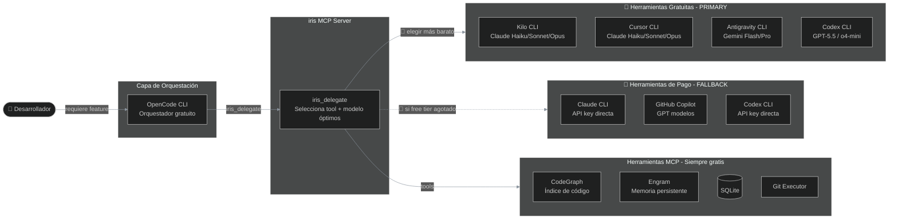
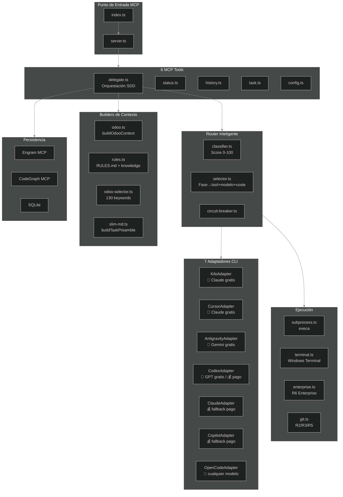
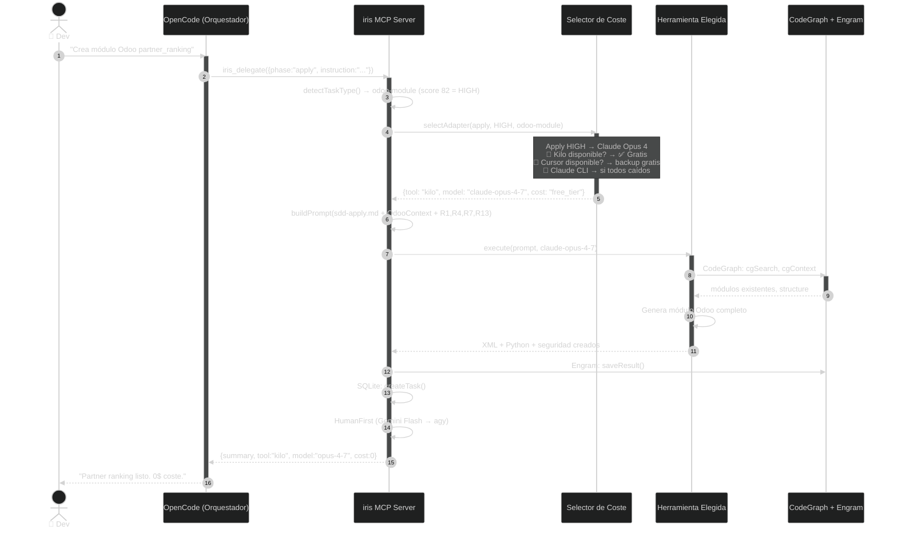
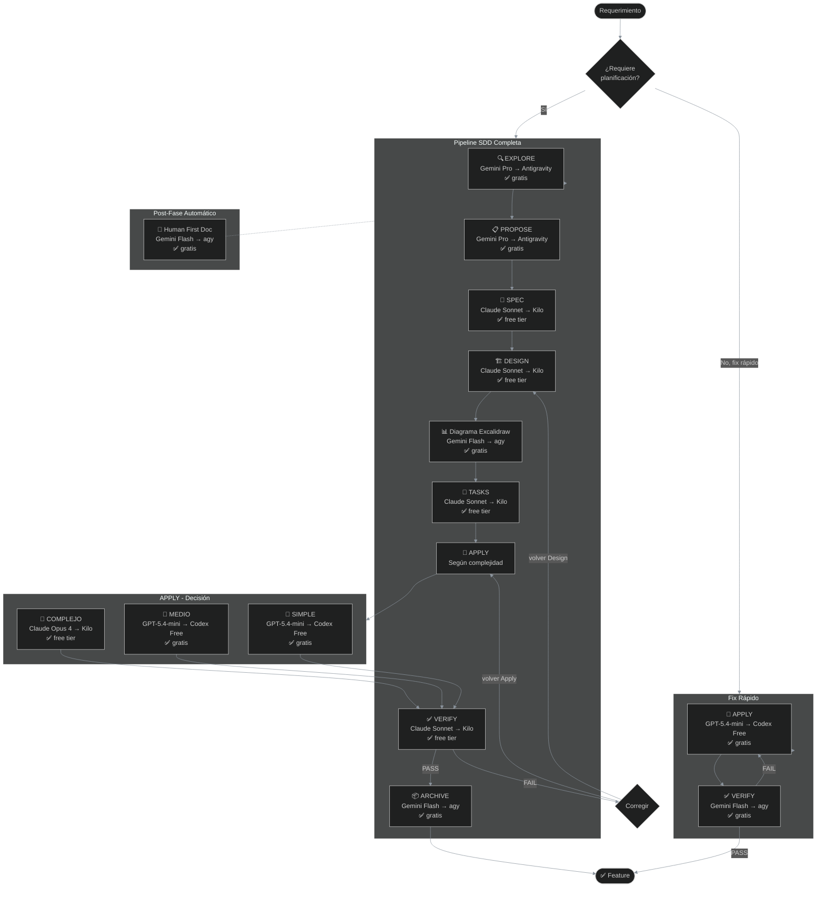
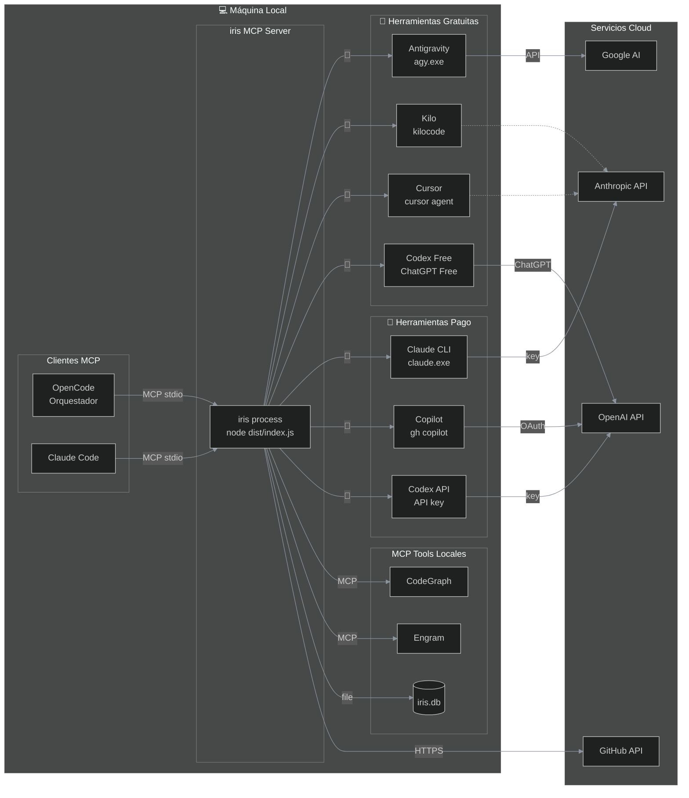
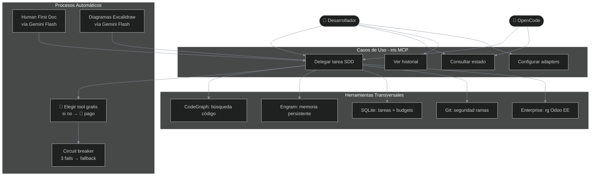
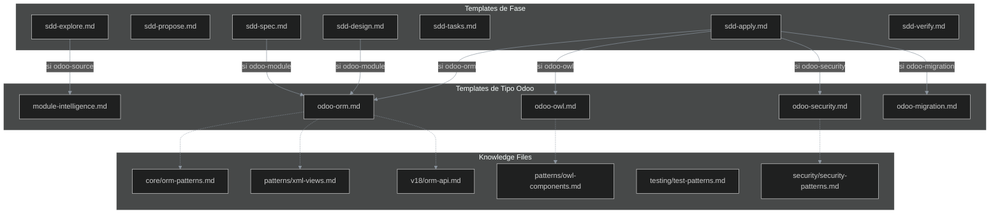

# Iris v2 — Arquitectura de Orquestación Multi-Adaptador

> **Principio:** Cada fase SDD se resuelve con el modelo adecuado ejecutado en la herramienta **más económica disponible**. Las herramientas gratuitas son PRIMARY; las de pago son solo FALLBACK cuando se agotan los tiers gratuitos.

---

## Modelos vs Herramientas: La Matriz Completa

```
Un mismo modelo CORRE en múltiples herramientas con distinto coste:

CLAUDE SONNET 4.6  →  Kilo CLI (free tier)  → ✅ GRATIS
                    →  Cursor CLI (free tier) → ✅ GRATIS
                    →  Claude CLI (API key)   → 💰 PAGO

GPT-5.5             →  Codex CLI (ChatGPT Free) → ✅ GRATIS (limitado)
                    →  Codex CLI (API key)      → 💰 PAGO

GEMINI 2.5 PRO     →  Antigravity CLI (free) → ✅ GRATIS
                    →  OpenCode CLI (zen)     → ✅ GRATIS
```

---

## 1. Diagrama de Contexto — Gratis primero, pago de backup



### Matriz de Costes por Combinación (Modelo × Herramienta)

| Modelo | Herramienta | Plan | Coste | Prioridad |
|---|---|---|---|---|
| **Claude Haiku 4.5** | Kilo CLI | Free tier | ✅ Gratis | 🥇 |
| **Claude Haiku 4.5** | Cursor CLI | Free tier | ✅ Gratis | 🥇 |
| **Claude Sonnet 4.6** | Kilo CLI | Free tier | ✅ Gratis | 🥇 |
| **Claude Sonnet 4.6** | Cursor CLI | Free tier | ✅ Gratis | 🥇 |
| **Claude Sonnet 4.6** | Claude CLI | API key | 💰 Pago | 🥈 |
| **Claude Opus 4.7** | Kilo CLI | Free tier | ✅ Gratis | 🥇 |
| **Claude Opus 4.7** | Cursor CLI | Free tier | ✅ Gratis | 🥇 |
| **Claude Opus 4.7** | Claude CLI | API key | 💰 Pago | 🥈 |
| **Gemini 2.5 Flash** | Antigravity CLI | Free | ✅ Gratis | 🥇 |
| **Gemini 2.5 Pro** | Antigravity CLI | Free | ✅ Gratis | 🥇 |
| **GPT-5.5** | Codex CLI | ChatGPT Free | ✅ Gratis | 🥇 |
| **GPT-5.5** | Codex CLI | API key | 💰 Pago | 🥈 |
| **GPT-5.4-mini** | Codex CLI | ChatGPT Free | ✅ Gratis | 🥇 |
| **GPT-5.4-mini** | Codex CLI | API key | 💰 Pago | 🥈 |
| **GPT-5.3-Codex** | Codex CLI | Plus/Pro | 💰 Pago | 🥈 |
| **GPT o4-mini** | Codex CLI | API key | 💰 Pago | 🥈 |
| **GPT o3-mini** | Codex CLI | API key | 💰 Pago | 🥈 |
| **GPT-4o / 5.5** | GitHub Copilot | Suscripción | 💰 Pago | 🥈 |

---

## 2. Mapa de Fases SDD → Modelo + Herramienta + Coste

```mermaid
%%{init: {'theme': 'dark', 'themeVariables': {'primaryColor': '#1f6feb', 'primaryTextColor': '#ffffff', 'primaryBorderColor': '#22d3ee', 'lineColor': '#8b949e'}}}%%
flowchart TD
    subgraph Fases [Fases SDD]
        EXPLORE[🔍 Explore]
        PROPOSE[📋 Propose]
        SPEC[📐 Spec]
        DESIGN[🏗️ Design]
        TASKS[📝 Tasks]
        APPLY_H[🔧 Apply HIGH]
        APPLY_M[🔧 Apply MED]
        APPLY_L[🔧 Apply LOW]
        VERIFY[✅ Verify]
        DOC[📄 Document]
        HF[🤖 Human First]
        DIAG[📊 Diagrams]
    end

    subgraph FreeChain [🥇 Cadena Gratis Primario]
        F1[Gemini 2.5 Pro → Antigravity]
        F2[Gemini 2.5 Pro → Antigravity]
        F3[Claude Sonnet 4 → Kilo]
        F4[Claude Sonnet 4 → Kilo]
        F5[Claude Sonnet 4 → Kilo]
        F6[Claude Opus 4 → Kilo]
        F7[GPT-5.4-mini → Codex Free]
        F8[GPT-5.4-mini → Codex Free]
        F9[Claude Sonnet 4 → Kilo]
        F10[Gemini 2.5 Flash → Antigravity]
        F11[Gemini 2.5 Flash → Antigravity]
        F12[Gemini 2.5 Flash → Antigravity]
    end

    subgraph FallbackChain [🥈 Fallback Pago]
        B1[Claude Sonnet 4 → Claude CLI]
        B2[GPT-5.5 → Codex API key]
        B3[Gemini 2.5 Pro → Agy (si rate limit)]
    end

    EXPLORE --> F1
    PROPOSE --> F2
    SPEC --> F3
    DESIGN --> F4
    TASKS --> F5
    APPLY_H --> F6
    APPLY_M --> F7
    APPLY_L --> F8
    VERIFY --> F9
    DOC --> F10
    HF --> F11
    DIAG --> F12

    F3 -.->|Kilo caído| B1
    F4 -.->|Kilo caído| B1
    F5 -.->|Kilo caído| B1
    F6 -.->|Kilo caído| B1
    F9 -.->|Kilo caído| B1
    F7 -.->|Codex free limit| B2
    F8 -.->|Codex free limit| B2
    F1 -.->|Agy rate limit| B3
```

### Tabla de Asignación por Fase

| Fase | Modelo Primario | Tool Primaria | Coste Primario | Fallback 1 | Fallback 2 |
|---|---|---|---|---|---|
| **Explore** | Gemini 2.5 Pro | Antigravity | ✅ Gratis | OpenCode (zen) | Claude Sonnet → Kilo |
| **Propose** | Gemini 2.5 Pro | Antigravity | ✅ Gratis | OpenCode (zen) | Claude Sonnet → Kilo |
| **Spec** | Claude Sonnet 4.6 | **Kilo** 🥇 / Cursor 🥇 | ✅ Free tier | Cursor (si Kilo caído) | Claude CLI 💰 |
| **Design** | Claude Sonnet 4.6 | **Kilo** 🥇 / Cursor 🥇 | ✅ Free tier | Cursor (si Kilo caído) | Claude CLI 💰 |
| **Tasks** | Claude Sonnet 4.6 | **Kilo** 🥇 / Cursor 🥇 | ✅ Free tier | Cursor (si Kilo caído) | Claude CLI 💰 |
| **Apply HIGH** | Claude Opus 4.7 | **Kilo** 🥇 / Cursor 🥇 | ✅ Free tier | Cursor (si Kilo caído) | Claude CLI 💰 |
| **Apply MED** | GPT-5.4-mini | **Codex Free** 🥇 | ✅ Gratis | Kilo (Claude Haiku) | Codex API 💰 |
| **Apply LOW** | GPT-5.4-mini | **Codex Free** 🥇 | ✅ Gratis | Kilo (Claude Haiku) | Codex API 💰 |
| **Verify** | Claude Sonnet 4.6 | **Kilo** 🥇 / Cursor 🥇 | ✅ Free tier | Cursor (si Kilo caído) | Claude CLI 💰 |
| **Document** | Gemini 2.5 Flash | **Antigravity** 🥇 | ✅ Gratis | OpenCode (zen) | — |
| **Human First** | Gemini 2.5 Flash | **Antigravity** 🥇 | ✅ Gratis | OpenCode (zen) | — |
| **Diagrams** | Gemini 2.5 Flash | **Antigravity** 🥇 | ✅ Gratis | — | — |

> **🎯 Caso ideal:** 0$ — todo corre en tiers gratuitos.
> **🎯 Caso realista:** ~90-95% gratis, solo se paga cuando se exceden rate limits.

---

## 3. Árbol de Decisión — Selección de Herramienta

```
¿Fase explore/propose/document/HF/diagrams?
  ├── 🥇 Antigravity (Gemini) disponible?      → ✅ GRATIS
  ├── 🥇 OpenCode (zen) disponible?            → ✅ GRATIS
  └── 💰 Gemini via API key?                   → PAGO

¿Fase spec/design/tasks/verify?
  ├── 🥇 Kilo disponible?                      → ✅ FREE TIER (Claude Sonnet)
  ├── 🥇 Cursor disponible?                    → ✅ FREE TIER (Claude Sonnet)
  └── 💰 Claude CLI (API key)                  → PAGO

¿Fase apply HIGH (complejo)?
  ├── 🥇 Kilo disponible?                      → ✅ FREE TIER (Claude Opus)
  ├── 🥇 Cursor disponible?                    → ✅ FREE TIER (Claude Opus)
  └── 💰 Claude CLI (API key)                  → PAGO

¿Fase apply MED/LOW (simple)?
  ├── 🥇 Codex Free (GPT-5.4-mini) disponible? → ✅ GRATIS
  ├── 🥇 Kilo (Claude Haiku) disponible?       → ✅ FREE TIER
  └── 💰 Codex API / Copilot                   → PAGO
```

---

## 4. Diagrama de Componentes — Estructura Interna



### Descripción de Archivos Clave

| Archivo | Rol |
|---|---|
| `src/index.ts` | Entry point MCP Server, stdio transport, graceful shutdown |
| `src/server.ts` | `registerTools()` — 6 tools con Zod |
| `src/tools/delegate.ts` | Pipeline: detecta tipo → clasifica complejidad → selecciona tool óptima (gratis→pago) → buildPrompt → execute → save → HumanFirst |
| `src/router/classifier.ts` | `scoreComplexity()` — 4 señales: scope, contexto, impacto, dependencias → 0-100 |
| `src/router/selector.ts` | Tabla de enrutamiento: fase + tipo Odoo + complejidad → (tool, modelo, esfuerzo) con prioridad de coste |
| `src/router/circuit-breaker.ts` | 3 fallos consecutivos → OPEN 5 min, half-open, test recovery |
| `src/context/odoo.ts` | `buildOdooContext()` — CodeGraph + manifest → versión, edición, paths |
| `src/context/odoo-selector.ts` | 130+ keywords → 22 OdooTaskTypes |
| `src/context/rules.ts` | RULES.md (R1-R13) parser + inyección de knowledge |
| `src/context/slim-md.ts` | Preámbulo "You are agy..." para sub-agentes |
| `src/executor/git.ts` | `classifyBranch()`, `checkIdentity()`, `checkR5()` |
| `src/executor/enterprise.ts` | `rg` en Odoo Enterprise source (R6) |

---

## 5. Diagrama de Secuencia — Delegación Completa



### Flujo Interno de `executeTask()` en delegate.ts

```
executeTask(req):
 1. scoreComplexity(req)          → { score, level }
 2. OdooTaskType = detectTaskType(req.instruction)
 3. (tool, model) = selectCheapest(phase, level, taskType)
 4. buildPrompt(template + OdooContext + rules + knowledge)
 5. adapter = getAdapter(tool)
 6. if !adapter.isAvailable()     → selectNextCheapest()
 7. if adapter.circuitBreaker.OPEN → selectNextCheapest()
 8. result = adapter.execute(prompt, model)
 9. if result.success:
      saveToEngram(result)
      saveToSQLite(task)
      triggerHumanFirstDoc()   ← fire-and-forget
      if phase == 'design':
        generateExcalidraw()   ← fire-and-forget
      return { summary, adapter, model, cost }
10. else:
      adapter.recordFailure()
      if adapter.circuitBreaker.OPEN:
        selectNextCheapest()   ← retry with fallback
      else:
        return { error }
```

---

## 6. Diagrama de Actividades — Pipeline SDD Completo



---

## 7. Diagrama de Máquina de Estados — Ciclo de Vida de Tarea

```mermaid
%%{init: {'theme': 'dark', 'themeVariables': {'primaryColor': '#1f6feb', 'primaryTextColor': '#ffffff', 'primaryBorderColor': '#22d3ee', 'lineColor': '#8b949e'}}}%%
stateDiagram-v2
    [*] --> Pending

    state Pending {
        [*] --> AwaitingConfirm
        AwaitingConfirm --> Confirmed : usuario autoriza
        AwaitingConfirm --> Expired : 10-min TTL
        Expired --> [*]
    end

    Pending --> Running
    Pending --> [*] : expired

    state Running {
        [*] --> Scoring
        Scoring --> SelectingTool
        SelectingTool --> BuildingPrompt
        BuildingPrompt --> Executing
        Executing --> Saving
        Saving --> PostPhase
        PostPhase --> [*]
    }

    Running --> Completed
    Running --> Failed
    Running --> SelectingTool : 🥇 caído → 🥇 otro gratis<br/>→ 🥈 pago

    state Completed {
        [*] --> HumanFirstDoc
        HumanFirstDoc --> PersistEngram
        PersistEngram --> [*]
    }

    Failed --> Pending : retry ≤3
    Failed --> [*] : max retries

    state CircuitBreaker {
        CLOSED --> OPEN : 3 fails
        OPEN --> HALF_OPEN : 5 min
        HALF_OPEN --> CLOSED : ok
        HALF_OPEN --> OPEN : fail
    }
```

---

## 8. Diagrama de Despliegue



---

## 9. Diagrama de Casos de Uso



---

## 10. Budget Tracking y Circuit Breaker

```
CADA TOOL EN ~/.iris/config.json:
├── enabled: true
├── priority: 1 (gratis) > 2 (free tier) > 3 (pago)
├── daily_budget_usd: 0 (ilimitado para gratis)
├── circuit_breaker: { failures: 0, state: "CLOSED" }
└── models: [ "claude-sonnet-4-6", "claude-opus-4-7", ... ]

PRIORIDAD DE SELECCIÓN (selector.ts):
1. Fase SDD → modelo necesario
2. Buscar tools que soporten ese modelo
3. De esas, ordenar por priority (menor = mejor)
4. Filtrar: enabled + not OPEN + within budget
5. Elegir la primera disponible
6. Si falla → recordFailure(), si 3 fails → OPEN 5 min
7. Pasar a la siguiente en priority
8. Si todas gratis caídas → escalar a pago

EJEMPLO: Apply HIGH necesita Claude Opus
  🥇 Kilo (priority:1, free tier) → disponible? ✅ USA
  🥇 Cursor (priority:1, free tier) → si Kilo OPEN
  🥈 Claude CLI (priority:3, pago) → si todos caídos
```

### Budget por Tool

| Tool | Prioridad | daily_budget_usd | Modelos gratis |
|---|---|---|---|
| Antigravity (agy) | 1 | 0 (ilimitado) | Gemini Flash, Pro |
| Kilo | 1 | 0 (ilimitado) | Claude Haiku, Sonnet, Opus |
| Cursor | 1 | 0 (ilimitado) | Claude Haiku, Sonnet, Opus |
| Codex Free | 1 | 0 (ilimitado) | GPT-5.5, GPT-5.4-mini |
| OpenCode | 1 | 0 (ilimitado) | opencode/zen |
| Claude CLI | 3 | 5.00 | N/A (pago) |
| GitHub Copilot | 3 | 2.00 | N/A (pago) |
| Codex API | 3 | 5.00 | N/A (pago) |

---

## 11. Estructura de Archivos Propuesta

```
iris/
├── src/
│   ├── index.ts                   # Entry point MCP
│   ├── server.ts                  # registerTools() × 6
│   ├── config.ts                  # ~/.iris/config.json
│   │
│   ├── types/index.ts             # Interfaces + unions
│   │
│   ├── adapters/                  # 7 wrappers CLI
│   │   ├── base.ts                # BaseAdapter abstract
│   │   ├── claude.ts              # Claude CLI (pago)
│   │   ├── antigravity.ts         # agy (Gemini gratis)
│   │   ├── copilot.ts             # gh copilot (pago)
│   │   ├── codex.ts               # Codex (gratis/pago)
│   │   ├── kilo.ts                # Kilo (Claude free tier)
│   │   ├── cursor.ts              # Cursor (Claude free tier)
│   │   └── opencode.ts            # OpenCode (cualquiera)
│   │
│   ├── router/
│   │   ├── classifier.ts          # score 0-100
│   │   ├── selector.ts            # Fase→tool+model+cost
│   │   └── circuit-breaker.ts     # 3 fails → 5min
│   │
│   ├── context/
│   │   ├── slim-md.ts             # buildTaskPreamble()
│   │   ├── odoo.ts                # buildOdooContext()
│   │   ├── odoo-selector.ts       # 130 keywords
│   │   └── rules.ts               # RULES.md parser
│   │
│   ├── executor/
│   │   ├── subprocess.ts          # execa
│   │   ├── terminal.ts            # Windows Terminal
│   │   ├── git.ts                 # R2/R3/R5
│   │   └── enterprise.ts          # R6 rg
│   │
│   ├── tools/                     # 6 MCP handlers
│   │   ├── delegate.ts            # ⭐ Corazón
│   │   ├── status.ts
│   │   ├── history.ts
│   │   ├── task.ts
│   │   └── config.ts
│   │
│   ├── store/
│   │   ├── db.ts                  # SQLite
│   │   ├── tasks.ts               # CRUD
│   │   └── budgets.ts             # tracking
│   │
│   ├── engram/
│   │   ├── client.ts              # Engram MCP
│   │   └── sync.ts                # saveResult, poll
│   │
│   ├── codegraph/client.ts        # CodeGraph MCP
│   ├── config/local.ts            # Alesco paths
│   ├── diagrams/generator.ts      # Excalidraw
│   └── updater.ts                 # version check
│
├── prompts/
│   ├── sdd-explore.md             # Investigar código
│   ├── sdd-propose.md             # Propuesta cambio
│   ├── sdd-spec.md                # Especificación
│   ├── sdd-design.md              # Diseño técnico
│   ├── sdd-tasks.md               # Desglose tareas
│   ├── sdd-apply.md               # Implementación
│   ├── sdd-verify.md              # Verificación
│   │
│   ├── docs/                      # Human First (español)
│   │   ├── sdd-explore.md
│   │   ├── sdd-propose.md
│   │   ├── sdd-spec.md
│   │   ├── sdd-design.md
│   │   ├── sdd-tasks.md
│   │   ├── sdd-apply.md
│   │   ├── sdd-verify.md
│   │   ├── excalidraw-guide.md
│   │   └── sdd-documentation-context.md
│   │
│   └── odoo/                      # Específicos Odoo
│       ├── odoo-orm.md
│       ├── odoo-owl.md
│       ├── odoo-security.md
│       ├── odoo-migration.md
│       └── module-intelligence.md
│
├── knowledge/
│   ├── odoo/ai/                   # 200+ archivos
│   │   ├── RULES.md               # R1-R13
│   │   ├── core/                  # ORM, performance
│   │   ├── patterns/              # XML views, wizards
│   │   ├── security/              # ACL, audit
│   │   ├── testing/
│   │   ├── v18/ + v19/
│   │   ├── business/              # Accounting, stock
│   │   ├── migration/
│   │   ├── api/                   # JSON-2, actions
│   │   └── devops/                # Docker, CI/CD
│   ├── odoo/contribute/           # 8 plugins OCA
│   └── excalidraw/                # Templates + palette
│
├── scripts/
│   ├── setup.ts                   # Instalador
│   ├── detect-alesco-path.ps1
│   ├── install-tools.ps1
│   ├── sync-agents.ps1
│   └── init-codegraph.ps1
│
├── db/schema.sql                  # 5 tablas
├── .github/workflows/
│   ├── ci.yml
│   └── release.yml
│
├── package.json
├── tsconfig.json
└── README.md
```

---

## 12. Sistema de Composición de Prompts — QUÉ + CÓMO + CONTEXTO + REGLAS

> Este es el corazón de iris: **cómo armamos el prompt perfecto para cada AI en cada fase**.

Cada AI que recibe una tarea de iris necesita saber exactamente:
- **QUÉ** hacer (objetivo, deliverables, output esperado)
- **CÓMO** hacerlo (instrucciones paso a paso, formato, metodología)
- **CONTEXTO** (proyecto, versión, rama, paths, módulo)
- **REGLAS** (qué está prohibido, qué es obligatorio)
- **CONTRATO** (qué devolver, cómo devolverlo, dónde escribirlo)

### 12.1 Las 8 Capas del Prompt Final

```mermaid
%%{init: {'theme': 'dark', 'themeVariables': {'primaryColor': '#1f6feb', 'primaryTextColor': '#ffffff', 'primaryBorderColor': '#22d3ee', 'lineColor': '#8b949e'}}}%%
flowchart LR
    subgraph Build [buildPrompt() en delegate.ts]
        direction TB
        L1[8 capas → 1 prompt final]
    end

    subgraph Layers [Arquitectura de Capas]
        L1A[🧠 Capa 1: IDENTIDAD<br/>slim-md.ts]
        L2[🎯 Capa 2: OBJETIVO<br/>phase + change + deliverable]
        L3[📊 Capa 3: CONTEXTO PROYECTO<br/>odoo.ts - OdooContext]
        L4[📋 Capa 4: INSTRUCCIONES FASE<br/>prompts/sdd-{phase}.md]
        L5[🔧 Capa 5: INSTRUCCIONES TIPO<br/>prompts/odoo/{type}.md]
        L6[🚫 Capa 6: REGLAS<br/>rules.ts - RULES.md filtradas]
        L7[📚 Capa 7: REFERENCIAS<br/>knowledge files inyectados]
        L8[📝 Capa 8: CONTRATO SALIDA<br/>outputPath + formato + restricciones]
    end

    L1 --> L1A
    L2 --> L1A
    L3 --> L1A
    L4 --> L1A
    L5 --> L1A
    L6 --> L1A
    L7 --> L1A
    L8 --> L1A

    L1A --> FINAL([Prompt Final<br/>enviado al adapter])
```

### 12.2 Cada Capa en Detalle

#### Capa 1: IDENTIDAD (slim-md.ts)

```
# IRIS TASK EXECUTION

You are agy, operating as an iris sub-agent.
Complete the delegated task below. You MUST follow these EXACT instructions.

## Constraints
- Return only the requested output
- No preamble, meta-commentary, or pleasantries
- If outputPath is specified: write the result there
- NEVER add "Co-Authored-By" or AI attribution
```

**Archivo fuente:** `src/context/slim-md.ts` → `buildTaskPreamble(phase, taskType?)`

**Comportamiento:**
- Siempre se inyecta primero (encabeza el prompt)
- Si es fase SDD: añade "Focus: SDD artifact. Follow template structure exactly."
- Si es Odoo: añade referencias a TASK_CONFIG + knowledge files
- Si tiene outputPath: añade "Write output to: {outputPath}"

---

#### Capa 2: OBJETIVO (desde el request)

```
## Objective

Phase: spec
Change: "módulo partner_ranking para Odoo 18"
Deliverable: Documento de especificación con requisitos MUST/SHOULD
           y escenarios Given/When/Then para cada requisito.
```

**Origen:** Parámetros de `iris_delegate` (phase, instruction, change, deliverable)

**Comportamiento:**
- Se extrae de `DelegateRequest` directamente
- `instruction` se parsea para detectar palabras clave (via `detectTaskType`)
- `deliverable` es opcional, describe el formato esperado
- `change` es el nombre del cambio (usa el `instruction` truncado si no se provee)

---

#### Capa 3: CONTEXTO PROYECTO (odoo.ts)

```
## Odoo Project Context

- Version: 18.0
- Edition: enterprise
- Module: partner_ranking
- Branch: st_desarrollo
- Enterprise path: G:\...\odoo-enterprise-18
- Community path: G:\...\odoo-community-18
- Task Type: odoo-module
- Active Rules: R1, R4, R7, R13
```

**Archivo fuente:** `src/context/odoo.ts` → `buildOdooContext(instruction?)` + `formatOdooContextForPrompt(ctx)`

**Comportamiento:**
- Solo se inyecta si `detectTaskType()` retorna un tipo Odoo (no null)
- Usa CodeGraph para buscar `__manifest__.py`
- Si no hay manifest → retorna null → esta capa se omite
- `resolveAlescoPaths()` resuelve enterprise_path y community_path
- `activeRules` se filtra según `TASK_CONFIG[type].activeRules`

---

#### Capa 4: INSTRUCCIONES DE FASE (prompts/sdd-{phase}.md)

```
## SDD Phase: {phase}

{contenido del template sdd-{phase}.md}
```

**Archivo fuente:** `prompts/sdd-{phase}.md`

**Variables de template** (reemplazadas por delegate.ts):

| Variable | Se reemplaza con |
|---|---|
| `{phase}` | explore / propose / spec / design / tasks / apply / verify |
| `{change}` | Nombre del cambio |
| `{instruction}` | Instrucción original del usuario |
| `{deliverable}` | Formato esperado |
| `{contextIds}` | IDs de Engram para consultar |
| `{outputPath}` | Ruta donde escribir el output |

**Templates disponibles:**

| Template | Propósito | Dice al AI |
|---|---|---|
| `sdd-explore.md` | Investigar código actual | "Survey codebase, find current state, identify pain points. Output: Current State / Problem / Affected Areas / Risks / Recommendation." |
| `sdd-propose.md` | Propuesta de cambio | "Write change proposal with Intent / Scope (in/out) / Approach / Affected Areas / Risks / Rollback Plan / Success Criteria." |
| `sdd-spec.md` | Especificación | "RFC 2119 keywords (MUST/SHOULD/MAY). Scenarios in Given/When/Then format. Each requirement numbered." |
| `sdd-design.md` | Diseño técnico | "Architecture Overview / Key Decisions (with ADR format) / Interface Definitions / Data Flow / Files Affected." |
| `sdd-tasks.md` | Desglose de tareas | "Dependency-ordered tasks. Hierarchical (1.1, 1.2, 2.1). Foundation → Core → Integration → Testing." |
| `sdd-apply.md` | Implementación | "Generate code. No scope creep. Follow patterns in knowledge. Write to outputPath. Return only summary." |
| `sdd-verify.md` | Verificación | "Check each spec scenario. Scenario Coverage table. Issues Found. Verdict: PASS/FAIL/NEEDS REVISION." |

---

#### Capa 5: INSTRUCCIONES DE TIPO (prompts/odoo/{type}.md)

```
## Odoo Specialization: {taskType}

{contenido del template odoo/{taskType}.md}
```

**Archivo fuente:** `prompts/odoo/{type}.md` (solo si detectTaskType retorna tipo Odoo)

**Templates disponibles:**

| Template | Para tareas de tipo | Dice al AI |
|---|---|---|
| `odoo-orm.md` | odoo-orm, odoo-wizard, odoo-module | "Model conventions, field types, api.depends, constraints, ondelete. R1/R7/R10/R13 rules." |
| `odoo-owl.md` | odoo-owl | "OWL component patterns, useService, useState, onWillStart. R7/R13 rules." |
| `odoo-security.md` | odoo-security | "ir.model.access.csv format, record rules, group definitions. R4/R13 rules." |
| `odoo-migration.md` | odoo-migration | "Pre/post/end migration scripts, noupdate, openupgrade. R1/R5 rules." |
| `module-intelligence.md` | odoo-source | "10+1 step analysis via CodeGraph. Report structure: manifest→models→fields→views→controllers→security." |

---

#### Capa 6: REGLAS ACTIVAS (rules.ts)

```
## Active Rules

R1 (Version Bump): Each apply phase MUST bump __manifest__.py version.
R4 (ACL): Every new model MUST have ir.model.access.csv entry.
R7 (PEP8): Code MUST follow Odoo coding standards (PEP8, OCA).
R13 (SQL Injection): All raw SQL MUST use parameterized queries.
```

**Archivo fuente:** `src/context/rules.ts` → `selectRulesForTask(odooTaskType)`

**Comportamiento:**
- Lee `knowledge/odoo/ai/RULES.md` (R1-R13)
- Filtra solo las reglas marcadas en `TASK_CONFIG[type].activeRules`
- Cada regla se inyecta como bullet point con su descripción

**Reglas R1-R13 referenciadas por tipo de tarea:**

| Regla | Título | Tipos que la activan |
|---|---|---|
| R1 | Version Bump | odoo-module, odoo-orm, odoo-view, odoo-security, odoo-wizard, odoo-report, odoo-owl, odoo-controller, odoo-mail, odoo-portal, odoo-migration, odoo-test, odoo-debug, odoo-accounting, odoo-stock |
| R2 | Branch Safety | odoo-ops, odoo-commit, odoo-pr |
| R3 | Identity Verification | odoo-ops, odoo-commit, odoo-pr |
| R4 | ACL Requirement | odoo-security, odoo-wizard, odoo-module, odoo-spec, odoo-design |
| R5 | Pre-migrate Warning | odoo-migration, odoo-view |
| R6 | Enterprise First | odoo-source |
| R7 | Coding Standards (PEP8/OCA) | odoo-orm, odoo-view, odoo-wizard, odoo-report, odoo-owl, odoo-controller, odoo-mail, odoo-portal, odoo-migration, odoo-test, odoo-module, odoo-accounting, odoo-stock |
| R8 | Sequence Standards | odoo-apply |
| R9 | Commit Convention | odoo-ci, odoo-commit, odoo-pr, odoo-changelog |
| R10 | API Signatures | odoo-orm, odoo-controller, odoo-accounting, odoo-stock |
| R11 | SDD Classification | odoo-spec |
| R12 | Token Efficiency | odoo-source |
| R13 | Injection Prevention | odoo-orm, odoo-owl, odoo-controller, odoo-portal, odoo-security, odoo-api, odoo-apply |

---

#### Capa 7: REFERENCIAS DE CONOCIMIENTO (knowledge files)

```
## Knowledge References

### Core Patterns
{contenido de knowledge/odoo/ai/core/orm-patterns.md}
{contenido de knowledge/odoo/ai/patterns/xml-views.md}

### Version Reference
{contenido de knowledge/odoo/ai/v18/orm-api.md}
```

**Archivo fuente:** `src/context/rules.ts` → `injectKnowledgeContext(odooTaskType)`

**Comportamiento:**
- Lee `TASK_CONFIG[type].knowledgeFiles[]` para saber qué archivos cargar
- Cada archivo se lee y se inyecta como sección
- Los archivos se cargan de `knowledge/odoo/` + ruta relativa
- Se limita a ~4000 tokens de knowledge para no saturar el prompt

**Knowledge files por tipo de tarea:**

| Tipo | knowledgeFiles cargados |
|---|---|
| odoo-orm | core/orm-patterns.md, core/performance.md, v18/orm-api.md |
| odoo-owl | patterns/owl-components.md, v18/owl-api.md |
| odoo-view | patterns/xml-views.md, patterns/qweb.md |
| odoo-security | security/security-patterns.md, security/acl-patterns.md |
| odoo-wizard | patterns/wizards.md |
| odoo-report | patterns/reports.md |
| odoo-controller | patterns/controllers.md |
| odoo-migration | migration/v18-to-v19.md |
| odoo-test | testing/test-patterns.md |
| odoo-module | core/orm-patterns.md, patterns/xml-views.md, security/acl-patterns.md |
| odoo-accounting | business/accounting.md |
| odoo-stock | business/stock.md |

---

#### Capa 8: CONTRATO DE SALIDA (desde el request + slim-md.ts)

```
## Output Contract

Output path: {outputPath}/partner_ranking/__manifest__.py
Output format: Python files + XML views + CSV security
Restrictions:
- No preamble, no meta-commentary
- If writing to outputPath: write each file individually
- NEVER add "Co-Authored-By" or AI attribution
- Write REAL, complete code — no placeholders, no TODOs
- If you cannot complete the task: say so clearly, do NOT hallucinate
```

**Origen:** Parámetros de `iris_delegate` + validaciones de `buildTaskPreamble`

**Componentes:**
- `outputPath`: dónde escribir los archivos (opcional)
- `format`: el formato de salida esperado (código, markdown, JSON)
- `restrictions`: heredadas de slim-md.ts (no preamble, no Co-Authored-By, etc.)

---

### 12.3 Diagrama de Flujo — Cómo se Compone el Prompt

```mermaid
%%{init: {'theme': 'dark', 'themeVariables': {'primaryColor': '#1f6feb', 'primaryTextColor': '#ffffff', 'primaryBorderColor': '#22d3ee', 'lineColor': '#8b949e'}}}%%
flowchart TD
    REQ([iris_delegate request]) --> A{detectTaskType}
    A -->|Odoo type| B1[buildOdooContext]
    A -->|null| B2[skip OdooContext]

    B1 --> C[selectRulesForTask]
    B1 --> D[injectKnowledgeContext]
    
    B2 --> C

    C --> E[loadPhaseTemplate<br/>prompts/sdd-{phase}.md]
    D --> E

    E --> F{¿Hay template<br/>de tipo?}
    F -->|Sí| G[cargar prompts/odoo/{type}.md]
    F -->|No| H[sin template de tipo]

    G --> I[buildTaskPreamble]
    H --> I

    I --> J[ensamblar 8 capas<br/>en orden jerárquico]

    J --> K[Prompt Final<br/>→ adapter.execute()]
```

### 12.4 Ejemplo Concreto: Prompt Compuesto para "spec" + "odoo-module"

```
🧠 CAPA 1: IDENTIDAD
────────────────────────────────────────
You are agy, operating as an iris sub-agent.
Complete the delegated task below.
Focus: SDD artifact. Follow template structure exactly.
Constraints: No preamble, no meta-commentary.
If outputPath is specified: write the result there.

🎯 CAPA 2: OBJETIVO
────────────────────────────────────────
## Objective
Phase: spec
Change: partner_ranking
Instruction: Especificar módulo partner_ranking para Odoo 18 Enterprise
Deliverable: Documento SPEC

📊 CAPA 3: CONTEXTO PROYECTO
────────────────────────────────────────
## Odoo Project Context
- Version: 18.0
- Edition: enterprise
- Module: partner_ranking
- Branch: st_desarrollo
- Active Rules: R1, R4, R11
- Task Type: odoo-module

📋 CAPA 4: INSTRUCCIONES FASE
────────────────────────────────────────
## SDD Phase: spec
Write a specification document for the change "partner_ranking".
...
Requisitos MUST/SHOULD, escenarios Given/When/Then.

🔧 CAPA 5: INSTRUCCIONES TIPO
────────────────────────────────────────
## Odoo Specialization: odoo-module
Este módulo requiere: modelo, vista tree/form, security,
menú, demo data. Sigue las convenciones Odoo 18 Enterprise.
... (template odoo-orm.md adaptado para spec)

🚫 CAPA 6: REGLAS ACTIVAS
────────────────────────────────────────
## Active Rules
R1: version bump required
R4: every new model needs ACL
R11: SDD classification required

📚 CAPA 7: REFERENCIAS
────────────────────────────────────────
## Knowledge References
### core/orm-patterns.md
...
### patterns/xml-views.md
...

📝 CAPA 8: CONTRATO SALIDA
────────────────────────────────────────
## Output Contract
Write to: docs/sdd/partner-ranking/spec.md
Format: Markdown
Restrictions: No preamble, no Co-Authored-By.
```

### 12.5 Templates SDD por Fase (contenido completo)

Cada template `prompts/sdd-{phase}.md` contiene **instrucciones detalladas** para el AI sobre QUÉ debe producir en esa fase y CÓMO estructurarlo:

#### `sdd-explore.md` (para Gemini Pro)

```markdown
# SDD Phase: Explore — {change}

## Context
Instrucción original: {instruction}

## Task
Survey the current codebase to understand the state of affairs related to this change.

## Required Output Sections

### 1. Current State
- What exists today related to this change
- Key files and their roles
- Data flow overview

### 2. Problems / Opportunities
- Pain points in current implementation
- Gaps or missing functionality
- Technical debt identified

### 3. Affected Areas
- Models/files that will need changes
- Dependencies and integrations
- Risks areas

### 4. Risks
- Technical risks
- Migration/compatibility risks
- Unknowns that need investigation

### 5. Recommendation
- Recommended approach
- Alternative approaches considered
- Effort estimate (S/M/L/XL)

## Constraints
- Use CodeGraph (cgSearch, cgContext, cgTrace) to understand code
- Use Enterprise search (R6) before proposing new implementations
- Return ONLY the 5 sections above — no preamble
```

#### `sdd-propose.md` (para Gemini Pro)

```markdown
# SDD Phase: Propose — {change}

## Context
Instrucción original: {instruction}

## Task
Write a change proposal document.

## Required Output Sections

### 1. Intent
- What problem does this solve?
- Why now?

### 2. Scope (In)
- Features/modules included
- What will be built/modified

### 3. Scope (Out)
- What is explicitly NOT included
- Future considerations

### 4. Approach
- Technical approach overview
- Key design decisions
- Architecture changes

### 5. Affected Areas
- Models, views, controllers, reports
- Security implications
- Performance considerations

### 6. Risks
- Technical risks with mitigations
- Dependency risks

### 7. Rollback Plan
- How to revert if needed

### 8. Success Criteria
- How do we know this is done?
- Acceptance tests

## Constraints
- MUST consider R6 (Enterprise First) before proposing new modules
- Must align with Odoo architecture conventions
- Return ONLY the 8 sections — no preamble
```

#### `sdd-spec.md` (para Claude Sonnet via Kilo)

```markdown
# SDD Phase: Spec — {change}

## Context
Instrucción original: {instruction}

## Task
Write a specification document using RFC 2119 keywords.

## Requirements Format
Each requirement MUST be numbered and categorized:
- **[MUST]**: Absolutely required, non-negotiable
- **[SHOULD]**: Strongly recommended but not strictly required
- **[MAY]**: Optional, included if time permits

## Scenario Format
Each requirement MUST have at least one scenario in GWT format:

### Scenario: {title}
**Given** {precondition}
**When** {action/trigger}
**Then** {expected result}

## Required Sections

### 1. Functional Requirements
- Feature requirements with scenarios

### 2. Non-Functional Requirements
- Performance, security, usability

### 3. Data Requirements
- New models/fields, relationships
- Data migration needs

### 4. UI/UX Requirements
- Views, menus, dashboard
- User interaction flows

### 5. Integration Requirements
- External APIs, module dependencies
- Webhooks, automated actions

### 6. Security Requirements
- Access rights, record rules
- Field-level permissions

### 7. Out of Scope
- Explicitly excluded from this spec

## Constraints
- Use RFC 2119 keywords (MUST, SHOULD, MAY)
- Every requirement needs a scenario
- Consider R4 (ACL) for every new model
- Return ONLY the 7 sections — no preamble
```

#### `sdd-design.md` (para Claude Sonnet via Kilo)

```markdown
# SDD Phase: Design — {change}

## Context
Instrucción original: {instruction}

## Task
Write a technical design document.

## Required Sections

### 1. Architecture Overview
- High-level diagram (Mermaid)
- Component interactions
- Data flow

### 2. Key Design Decisions
Each decision in ADR format:
- **Context**: What was the situation?
- **Decision**: What did we choose?
- **Consequences**: What tradeoffs were made?

### 3. Interface Definitions
- TypeScript interfaces or Python models
- Method signatures
- API contracts

### 4. Data Flow
- Input → Process → Output for each feature
- State transitions if applicable

### 5. Files Affected
- New files with brief description
- Modified files with changes needed
- Deleted files if any

### 6. Security Considerations
- Access control model
- Data validation rules
- Injection prevention (R13)

## Constraints
- Design MUST consider R4 (ACL) and R10 (API signatures)
- Consider Enterprise patterns (R6) before custom implementations
- Return ONLY the 6 sections — no preamble
```

#### `sdd-tasks.md` (para Claude Sonnet via Kilo)

```markdown
# SDD Phase: Tasks — {change}

## Context
Instrucción original: {instruction}

## Task
Break down the change into implementation tasks ordered by dependency.

## Task Format
Each task MUST be numbered hierarchically (1, 1.1, 1.2, 2, 2.1, ...):

### Task {number}: {title}
- **Files**: path/to/file1.py, path/to/file2.xml
- **Dependencies**: Task 1, Task 2.1
- **Effort**: S/M/L
- **Description**: What to do
- **Acceptance**: How to verify

## Required Task Categories (in order)
1. **Foundation**: Base setup, manifest, models
2. **Core Logic**: Business logic, computed fields, methods
3. **UI Layer**: Views, menus, dashboard
4. **Integration**: Controllers, APIs, automated actions, cron
5. **Security**: ACL, record rules, groups
6. **Testing**: Test cases, test data
7. **Documentation**: Help texts, user docs

## Constraints
- Tasks MUST be dependency-ordered
- Foundation tasks MUST come first
- R1 (version bump) MUST be the FIRST foundation task
- Return ONLY the task list — no preamble
```

#### `sdd-apply.md` (para Claude Opus via Kilo, o GPT-5.4-mini via Codex)

```markdown
# SDD Phase: Apply — {change}

## Context
Instrucción original: {instruction}

## Task
Implement the code for this task. Write REAL, complete code.

## Constraints
- **No scope creep**: Implement ONLY what is specified
- **No placeholders**: Write complete, working code
- **No TODOs**: Every line counts
- **Follow patterns**: Use existing code as reference (use CodeGraph)
- **Security**: R4 (ACL) for every new model, R13 (parameterized queries)
- **Standards**: Odoo coding standards (R7), PEP8, OCA conventions
- **Sequence**: R8 (use ir.sequence for autonumeric fields)
- **API**: R10 (proper API method signatures)

## Output
- Write files to {outputPath} if specified
- Files must be complete and ready to use
- After writing, return a ONE-paragraph summary of what was created
- List files created/modified with brief description

## Verification
- Use CodeGraph to verify the implementation matches existing patterns
- Return ONLY the summary paragraph — no preamble
```

#### `sdd-verify.md` (para Claude Sonnet via Kilo)

```markdown
# SDD Phase: Verify — {change}

## Context
Instrucción original: {instruction}

## Task
Verify that the implementation matches the specification.

## Required Output Sections

### 1. Scenario Coverage Table
| Spec Req | Scenario | Status | Notes |
|---|---|---|---|
| REQ-001 | Scenario A | ✅ PASS | ... |
| REQ-002 | Scenario B | ❌ FAIL | ... |

### 2. Issues Found
- **{ID}**: {description} — Severity (HIGH/MED/LOW)

### 3. Missing Requirements
- Requirements from spec not found in implementation

### 4. Additional Findings
- Code quality observations
- Security concerns
- Performance considerations

### 5. Verdict
- **PASS**: All requirements met
- **FAIL**: Critical requirements missing
- **NEEDS REVISION**: Minor issues found, can be fixed in current phase

## Constraints
- Compare implementation against spec scenarios
- Check R2 branch safety and R9 commit conventions
- Return ONLY the 5 sections — no preamble
```

---

### 12.6 Contrato de Salida — Qué debe devolver cada fase

Cada fase produce un output diferente. El contrato de salida especifica:

| Fase | Output esperado | Formato | Extensiones |
|---|---|---|---|
| **Explore** | Current State, Problems, Risks, Recommendation | Markdown | `.md` |
| **Propose** | Intent, Scope, Approach, Risks, Rollback | Markdown | `.md` |
| **Spec** | Requirements MUST/SHOULD + GWT scenarios | Markdown | `.md` |
| **Design** | Architecture, ADRs, Data Flow, Files | Markdown (+ Mermaid) | `.md` |
| **Tasks** | Lista jerárquica de tareas con dependencias | Markdown | `.md` |
| **Apply** | Código completo (Python, XML, JS, CSV) | Archivos en outputPath | `.py`, `.xml`, `.js`, `.csv` |
| **Verify** | Coverage table, Issues, Verdict | Markdown | `.md` |

El contrato se construye así:

```typescript
function buildOutputContract(req: DelegateRequest): string {
  const parts: string[] = []
  
  if (req.outputPath) {
    parts.push(`Output path: ${req.outputPath}`)
  }
  
  parts.push('Restrictions:')
  parts.push('- No preamble, no meta-commentary, no pleasantries')
  parts.push('- If writing to outputPath: write each file individually')
  parts.push('- NEVER add "Co-Authored-By" or AI attribution')
  parts.push('- Write REAL, complete code — no placeholders, no TODOs')
  
  if (req.phase === 'apply') {
    parts.push('- Return ONLY a one-paragraph summary after writing files')
  } else {
    parts.push('- Return ONLY the required sections — no preamble')
  }
  
  return parts.join('\n')
}
```

---

### 12.7 Mapa de Templates por Fase × Tipo de Tarea



---

### 12.8 Resumen: El AI Siempre Recibe

```
1. QUIÉN ES → "Eres un sub-agente de iris, operando en fase X"
2. QUÉ HACER → "Genera una especificación para el módulo Y"
3. EN QUÉ CONTEXTO → "Odoo 18 Enterprise, rama st_desarrollo"
4. CÓMO HACERLO → Template sdd-spec.md + template odoo-orm.md
5. CON QUÉ REGLAS → "R1, R4, R11 activas"
6. CON QUÉ REFERENCIAS → Patrones ORM, XML views, API v18
7. QUÉ ENTREGAR → "Archivo .md en outputPath, sin preámbulos"
```

**Nunca más un AI va a recibir un prompt ambiguo o incompleto.**

---

## 13. Resumen Estratégico de Costes

```
🥇 ANTIGRAVITY (Gemini)         → explore, propose, document, HF, diagrams
🥇 KILO / CURSOR (Claude)       → spec, design, tasks, apply HIGH, verify
🥇 CODEX FREE (GPT-5.4-mini)    → apply MED/LOW, quick fixes
🥇 OPENCODE (zen)               → fallback universal gratis

🥈 CLAUDE CLI                   → fallback cuando Kilo/Cursor agotados
🥈 GITHUB COPILOT / CODEX API   → fallback cuando Codex Free agotado
```

> **Coste estimado mensual:** 0$ para uso normal.
> Solo se paga si el volumen de desarrollo es extremadamente alto y se agotan todos los rate limits gratuitos.

---

*Documento generado con Mermaid (12 diagramas).*
*Usa Ctrl+Shift+V en VS Code para previsualizar.*
